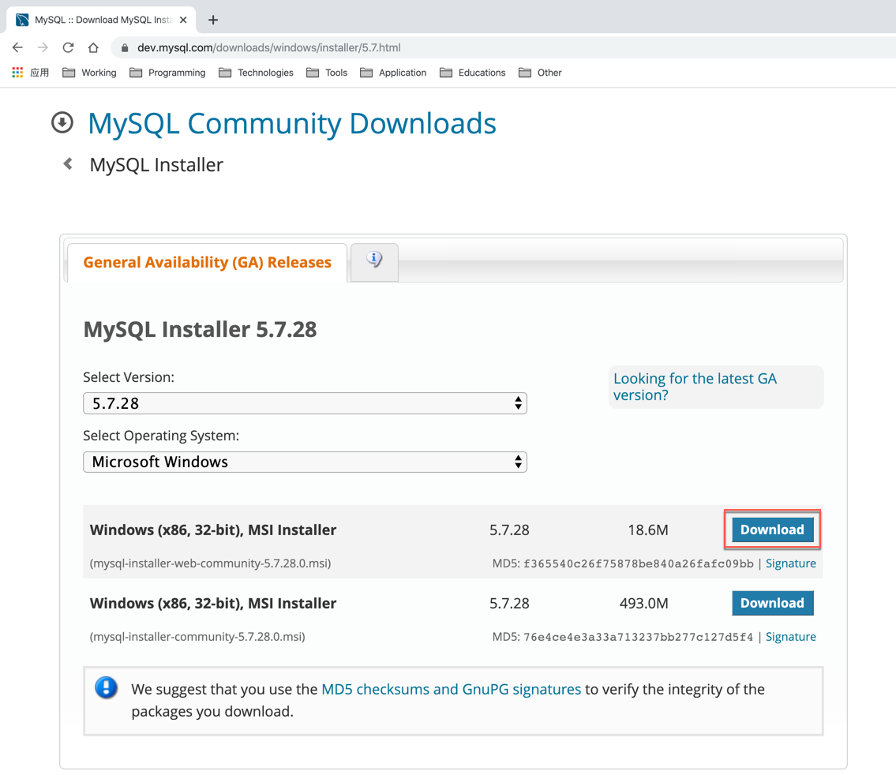
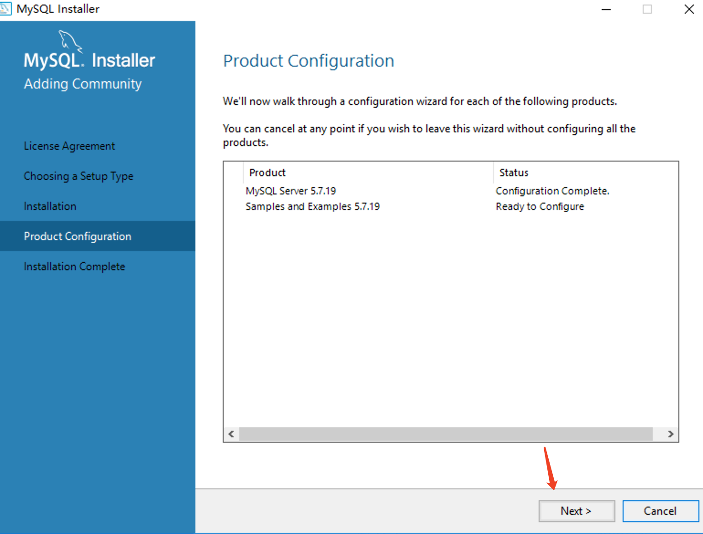
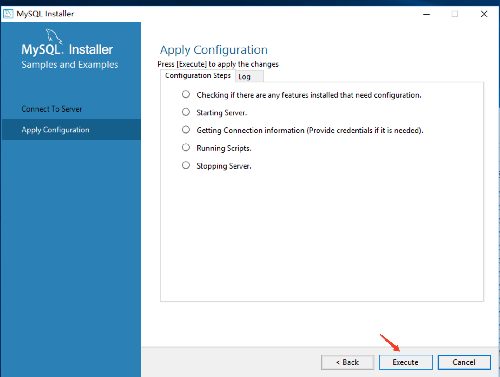

​     


[TOC]


### 一、引言

------

#### 1.1 现有的数据存储方式有哪些？

> * Java程序存储数据（变量、对象、数组、集合），数据保存在内存中，属于瞬时状态存储。
>* 文件（File）存储数据，保存在硬盘上，属于持久状态存储。


#### 1.2 以上存储方式存在哪些缺点？

> * 没有数据类型的区分。
>
> * 存储数据量级较小。
>
> * 没有访问安全限制。
>
> * 没有备份、恢复机制。


### 二、数据库

------

#### 2.1 概念

> ​		数据库是“按照数据结构来组织、[存储和管理数据的仓库]()。是一个长期存储在计算机内的、有组织的、有共享的、统一管理的数据集合。

#### 2.2 数据库的分类

> * 关系结构数据库：以表格（Table）存储，多表间建立关联关系，通过分类、合并、连接、选取等运算实现访问。
> * 非关系型数据库：多数使用哈希表，表中以键值（key-value）的方式实现特定的键和一个指针指向的特定数据。

#### 2.3 关系型数据库常见单位（E-R原则）

* **遵循ER模型**
* E    entity   代表实体的意思，对应到数据库当中的一张表          
* R    relationship 代表关系的意思  
* **具体体现**
  * 将数据放到表中，表再放到库中。
  * 一个数据库中可以有多个表，每个表都有一个名字，用来标识自己。表名具有唯一性。
  * 表具有一些特性，这些特性定义了数据在表中如何存储，类似java和python中 “类”的设计。
  * 表由列组成，我们也称为**字段**。每个字段描述了它所含有的数据的意义，**数据表的设计实际上就是对字段的设计**。创建数据表时，为每个字段分配一个数据类型，定义它们的数据长度和字段名。每个字段类似java 或者python中的“实例属性”。
  * 表中的数据是按行存储的，一行即为一条记录。每一行类似于java或python中的“对象”。

|  单位名称  |                 描述                 |       备注       |
| :--------: | :----------------------------------: | :--------------: |
|     库     | 数据库概念中最大的单位，内部存储表！ |                  |
|     表     |           一类数据的集合！           |     Java的类     |
| 行（元组） |         一类数据，一行数据！         | 对应Java中的对象 |
|  列（域）  |  最小的数据存储单位，代表一个属性！  |    对象的属性    |


### 三、数据库管理系统【DBMS】

------

#### 3.1 概念

> ​		[数据库管理系统]()（DataBase Management System，DBMS）：指一种操作和管理数据库的大型软件，用于建立、使用和维护数据库，对数据库进行统一管理和控制，以保证数据库的安全性和完整性。用户通过数据库管理系统访问数据库中的数据。

#### 3.2 常见数据库管理系统

> * Oracle：被认为是业界目前比较成功的关系型数据库管理系统。Oracle数据库可以运行在UNIX、Windows等主流操作系统平台，完全支持所有的工业标准，并获得最高级别的ISO标准安全性认证。
> * DB2：IBM公司的产品，DB2数据库系统采用多进程多线索体系结构，其功能足以满足大中公司的需要，并可灵活地服务于中小型电子商务解决方案。
> * SQL Server：Microsoft 公司推出的关系型数据库管理系统。具有使用方便可伸缩性好与相关软件集成程度高等优点。
> * SQLLite:应用在手机端的数据库。
> * MySQL:MySQL是一个[关系型数据库管理系统]()，由瑞典MySQL AB 公司开发，属于 Oracle 旗下产品。MySQL 是最流行的关系型数据库管理系统之一

### 四、MySQL

------

#### 4.1 简介

> ​		MySQL是一个[关系型数据库管理系统]()，由瑞典MySQL AB 公司开发，属于 Oracle 旗下产品。MySQL 是最流行的关系型数据库管理系统之一，在 WEB 应用方面，MySQL是最好的 RDBMS(Relational Database Management System，关系数据库管理系统) 应用软件之一。

#### 4.2 访问与下载

> 官方网站：https://www.mysql.com/
>
> 下载地址：https://dev.mysql.com/downloads/mysql/
>
> ​                  https://downloads.mysql.com/archives/community/

|         版本选择         |
| :----------------------: |
|  |

|         下载页面         |
| :----------------------: |
|  |


#### 4.3 安装

> 运行mysql-installer-community-5.7.28.0.msi，进入安装步骤

|   同意协议，点击下一步   |
| :----------------------: |
|  |

| 选择安装类型，点击下一步 |
| :----------------------: |
|  |

| 注意：安装需要依赖环境，如需安装的功能缺少对应环境，需先安装环境 |
| :----------------------------------------------------------: |
|                                      |

| 下一步的时候会提示缺少环境,此处的提示是说你期望安装的产品中缺少依赖,不一定提示的是数据库服务器安装的依赖,可能是其他功能组件的依赖缺少 |
| :----------------------------------------------------------: |
|                                      |

| 此处发现没有 mysql server, 说明它对应的依赖缺少,可以先执行安装这些可以安装的,之后安装完依赖后再重新安装其他模块,我们此处的操作是先安装依赖,然后后退再次安装 |
| :----------------------------------------------------------: |
|                                      |

| 下载安装前面提示的 mysql server 需要的 vc2013后,vc2013 如果在64位系统上面建议32和64的程序都安装,然后在上图的地方后退,重新 next 就可以看到可以安装 mysql server 了 |
| :----------------------------------------------------------: |
|                                      |

|    检查是否存在失败项    |
| :----------------------: |
|  |

| 进行第一步配置,除了需要设置密码外,后面的步骤基本上都是下一步 |
| :----------------------------------------------------------: |
|                                      |

|      类型与网络配置      |
| :----------------------: |
|  |

|      设置 root 密码      |
| :----------------------: |
|  |

|    创建SQL服务与窗口     |
| :----------------------: |
|  |

|           插件           |
| :----------------------: |
|  |

|         应用配置         |
| :----------------------: |
|  |

| finish 后回到当前页面继续配置 |
| :---------------------------: |
|       |

| 连接服务器（先 check检查, 后下一步） |
| :----------------------------------: |
|              |

| 执行完此步骤 下一步 finish 配置完成 |
| :---------------------------------: |
|             |


#### 4.4 卸载

> * 控制台卸载。
> * 找到mysql的安装目录进行删除。
> * programdata  删除mysql 

* [注意：如果卸载后，如有未删除的MySQL服务，可采用手动删除。]()
* [以管理员身份打开命令行，输入 sc delete MySQL57 回车。]()

```sql
net stop 服务名  #关闭服务
net start 服务名 #开启服务
```

#### 4.5 配置环境变量

> * Windows 
>   * 创建MYSQL_HOME：C:\Program Files\MySQL\MySQL Server 5.7 
>   * 追加PATH：%MYSQL_HOME%\bin;
> * MacOS / Linux
>   * 终端中输入cd ~ 进入目录，并检查.bash_profile是否存在，有则追加，无则创建
>   * 创建文件 touch .bash_profile
>   * 打开文件 open .bash_profile
>   * 输入export PATH=${PATH}:/usr/local/mysql/bin 保存并退出终端


#### 4.6 MySQL目录结构

> 核心文件介绍

| 文件夹名称 |        内容        |
| :--------: | :----------------: |
|    bin     |      命令文件      |
|    lib     |       库文件       |
|  include   |       头文件       |
|   Share    | 字符集、语言等信息 |


#### 4.7 MySQL配置文件[设置编码格式]

> 在MySQL安装目录中找到my.ini文件，并打开my.ini文件查看几个常用配置参数

|          参数          |           描述           |
| :--------------------: | :----------------------: |
| default-character-set  |     客户端默认字符集     |
|  character-set-server  |    服务器端默认字符集    |
|          port          | 客户端和服务器端的端口号 |
| default-storage-engine | MySQL默认存储引擎 INNODB |

```ini
[mysql]
no-beep
# 服务设置编码格式
default-character-set=utf8
# default-character-set=

[mysqld]
default-storage-engine=INNODB
# 服务设置驱动编码格式
character-set-server=utf8
collation-server=utf8_general_ci
```

### 五、SQL语言

------

#### 5.1 概念

> SQL：Structure Query Language。（结构化查询语言）
>
> structure query language /  structrue query languge
>
> SQL被美国国家标准局（ANSI）确定为关系型数据库语言的美国标准，后来被国际化标准组织（ISO）采纳为关系数据库语言的国际标准。
>
>
> 各关系型数据库厂商都支持ISO的SQL标准。***普通话***
>
> 各关系型数据库厂商在标准的基础上做了自己的扩展。***方言***

* [经验：通常执行对数据库的“增删改查CRUD”，简称C（Create）R（Read）U（Update）D（Delete）。]()

#### 5.2 SQL分类

> - 数据查询语言DQL（Data Query Language）：select、where、order by、group by、having 。
> - 数据定义语言DDL（Data Definition Language）：create、alter、drop。
> - 数据操作语言DML（Data Manipulation Language）：insert、update、delete 。
> - 事务处理语言TPL（Transaction Process Language）：commit、rollback 。
> - 数据控制语言DCL（Data Control Language）：grant、revoke。

#### 5.3 SQL语句规范

1. mysql的sql语法不区分大小写，数据区分大小写

2. 命名时：尽量使用26个英文字母大小写，数字0-9，下划线，不要使用其他符号

3. 建议不要使用mysql的关键字等来作为表名、字段名等，如果不小心使用，请在SQL语句中使用`（飘号）引起来

   | ADD                | ALL                 | ALTER              |
   | :----------------- | :------------------ | :----------------- |
   | ANALYZE            | AND                 | AS                 |
   | ASC                | ASENSITIVE          | BEFORE             |
   | BETWEEN            | BIGINT              | BINARY             |
   | BLOB               | BOTH                | BY                 |
   | CALL               | CASCADE             | CASE               |
   | CHANGE             | CHAR                | CHARACTER          |
   | CHECK              | COLLATE             | COLUMN             |
   | CONDITION          | CONNECTION          | CONSTRAINT         |
   | CONTINUE           | CONVERT             | CREATE             |
   | CROSS              | CURRENT_DATE        | CURRENT_TIME       |
   | CURRENT_TIMESTAMP  | CURRENT_USER        | CURSOR             |
   | DATABASE           | DATABASES           | DAY_HOUR           |
   | DAY_MICROSECOND    | DAY_MINUTE          | DAY_SECOND         |
   | DEC                | DECIMAL             | DECLARE            |
   | DEFAULT            | DELAYED             | DELETE             |
   | DESC               | DESCRIBE            | DETERMINISTIC      |
   | DISTINCT           | DISTINCTROW         | DIV                |
   | DOUBLE             | DROP                | DUAL               |
   | EACH               | ELSE                | ELSEIF             |
   | ENCLOSED           | ESCAPED             | EXISTS             |
   | EXIT               | EXPLAIN             | FALSE              |
   | FETCH              | FLOAT               | FLOAT4             |
   | FLOAT8             | FOR                 | FORCE              |
   | FOREIGN            | FROM                | FULLTEXT           |
   | GOTO               | GRANT               | GROUP              |
   | HAVING             | HIGH_PRIORITY       | HOUR_MICROSECOND   |
   | HOUR_MINUTE        | HOUR_SECOND         | IF                 |
   | IGNORE             | IN                  | INDEX              |
   | INFILE             | INNER               | INOUT              |
   | INSENSITIVE        | INSERT              | INT                |
   | INT1               | INT2                | INT3               |
   | INT4               | INT8                | INTEGER            |
   | INTERVAL           | INTO                | IS                 |
   | ITERATE            | JOIN                | KEY                |
   | KEYS               | KILL                | LABEL              |
   | LEADING            | LEAVE               | LEFT               |
   | LIKE               | LIMIT               | LINEAR             |
   | LINES              | LOAD                | LOCALTIME          |
   | LOCALTIMESTAMP     | LOCK                | LONG               |
   | LONGBLOB           | LONGTEXT            | LOOP               |
   | LOW_PRIORITY       | MATCH               | MEDIUMBLOB         |
   | MEDIUMINT          | MEDIUMTEXT          | MIDDLEINT          |
   | MINUTE_MICROSECOND | MINUTE_SECOND       | MOD                |
   | MODIFIES           | NATURAL             | NOT                |
   | NO_WRITE_TO_BINLOG | NULL                | NUMERIC            |
   | ON                 | OPTIMIZE            | OPTION             |
   | OPTIONALLY         | OR                  | ORDER              |
   | OUT                | OUTER               | OUTFILE            |
   | PRECISION          | PRIMARY             | PROCEDURE          |
   | PURGE              | RAID0               | RANGE              |
   | READ               | READS               | REAL               |
   | REFERENCES         | REGEXP              | RELEASE            |
   | RENAME             | REPEAT              | REPLACE            |
   | REQUIRE            | RESTRICT            | RETURN             |
   | REVOKE             | RIGHT               | RLIKE              |
   | SCHEMA             | SCHEMAS             | SECOND_MICROSECOND |
   | SELECT             | SENSITIVE           | SEPARATOR          |
   | SET                | SHOW                | SMALLINT           |
   | SPATIAL            | SPECIFIC            | SQL                |
   | SQLEXCEPTION       | SQLSTATE            | SQLWARNING         |
   | SQL_BIG_RESULT     | SQL_CALC_FOUND_ROWS | SQL_SMALL_RESULT   |
   | SSL                | STARTING            | STRAIGHT_JOIN      |
   | TABLE              | TERMINATED          | THEN               |
   | TINYBLOB           | TINYINT             | TINYTEXT           |
   | TO                 | TRAILING            | TRIGGER            |
   | TRUE               | UNDO                | UNION              |
   | UNIQUE             | UNLOCK              | UNSIGNED           |
   | UPDATE             | USAGE               | USE                |
   | USING              | UTC_DATE            | UTC_TIME           |
   | UTC_TIMESTAMP      | VALUES              | VARBINARY          |
   | VARCHAR            | VARCHARACTER        | VARYING            |
   | WHEN               | WHERE               | WHILE              |
   | WITH               | WRITE               | X509               |
   | XOR                | YEAR_MONTH          | ZEROFILL           |

4. 数据库和表名、字段名等对象名中间不要包含空格

5. 同一个mysql软件中，数据库不能同名，同一个库中，表不能重名，同一个表中，字段不能重名

6. 注释添加方式

   ```sql
   单行注释：#注释内容
   
   单行注释：--空格注释内容    其中--后面的空格必须有
   
   多行注释：/* 注释内容 */
   ```

   

#### 5.4 数据库-数据库管理系统-SQL语句的关系


#### 5.5 数据库连接基本命令

> cmd命令连接MySQL数据库

```mysql
mysql -h 登录数据库ip地址 -u 账号 -p 密码 -P 3306端口号
```

> 退出数据库连接

```mysql
mysql>exit; #注意连接mysql以后！命令必须添加;结束执行
```

### 六、DDL(Data Definition Language)

> 使用的关键字：CREATE、 ALTER、 DROP

#### 6.1 操作数据库

##### 6.1.1 创建数据库

```sql
Create database mydb1;   #创建数据库
Create database mydb2 character set gbk; #创建数据库设置编码格式
```

##### 6.1.2 查询数据库

```sql
# 查看当前数据库服务器中的所有数据库
Show databases;
# 查看前面创建的mydb2数据库的定义信息
Show  create  database mydb2;
```

##### 6.1.3 修改数据库

```
查看服务器中的数据库，并把mydb2的字符集修改为utf8; 
alter database mydb2 character set utf8;
```

##### 6.1.4 删除数据库

```sql
#删除数据库
drop database mydb3;
```

##### 6.1.5 其他数据库操作

```sql
查看当前使用的数据库
select database();

切换数据库
Use mydb2;
```

#### 6.2 操作数据表

##### 6.2.1 数据类型

> MySQL支持多种类型，大致可以分为三类：数值、日期/时间和字符串(字符)类型。对于我们约束数据的类型有很大的帮助

###### 6.2.1.1 数值类型

| 类型             | 大小                              | 范围（有符号）                                   | 范围（无符号）              | 用途           |
| ---------------- | --------------------------------- | ------------------------------------------------ | --------------------------- | -------------- |
| [INT/INTEGER]()  | 4 字节                            | (-2147483648，2147 483 647)                      | (0，4294967 295)            | 整数值         |
| [TINYINT]()      | 1 字节                            | (-128，127)                                      | (0，255）                   | 整数值         |
| [SMALLINT]()     | 2 字节                            | (-32768，32767)                                  | (0，65535)                  | 整数值         |
| [MEDIUMINT]()    | 3 字节                            | (-8388608，8388607)                              | (0，16777215)               | 整数值         |
| [BIGINT]()       | 8 字节                            | (-2^63,2^63-1)                                   | (0，2^64)                   | 整数值         |
| [DOUBLE(M,D)]()  | 8个字节，M表示长度，D表示小数位数 | 同上，受M和D的约束   DOUBLE(16,2) -999.99-999.99 | 同上，受M和D的约束，M最大16 | 双精度浮点数值 |
| [DECIMAL(M,D)]() | DECIMAL(M,D)                      | 依赖于M和D的值，M最大值为65                      | 依赖于M和D的值，M最大值为65 | 小数值         |
|                  |                                   |                                                  |                             |                |

> double:双精度实型，含字节数为8，64bit数值范围-1.7E308~1.7E308
>
> decimal:数字型，128bit，不存在精度损失，常用于银行帐目计算。
>
> unsigned : 数字类型无符号！
>
> zerofill： 0填充

<font color='red'>注意：精准选择，节约空间！</font>

###### 6.2.1.2 日期类型

| 类型          | 大小 | 格式                  | 范围                                                         | 用途                     |
| ------------- | :--- | --------------------- | ------------------------------------------------------------ | ------------------------ |
| [DATE]()      | 3    | YYYY-MM-DD            | 1000-01-01/9999-12-31                                        | 日期值                   |
| [TIME]()      | 3    | HH:MM:SS              | '-838:59:59'/'838:59:59'                                     | 时间值或持续时间         |
| [YEAR]()      | 1    | YYYY                  | 1901/2155                                                    | 年份值                   |
| [DATETIME]()  | 8    | YYYY-MM-DD HH:MM:SS   | 1000-01-01 00:00:00/9999-12-31 23:59:59                      | 混合日期和时间值         |
| [TIMESTAMP]() | 4    | YYYY-MM-DD HH：MM：SS | 1970-01-01 00:00:00/2038 结束时间是第 **2147483647** 秒北京时间 **2038-1-19 11:14:07**，格林尼治时间 2038年1月19日 凌晨 03:14:07 | 混合日期和时间值，时间戳 |

> DATETIME和TIMESTAMP对比：
>
> * timestamp的时间范围较小
>
> * timestamp的第一个非空字段如果插入或者更新为null自动设置为系统时间
>
> * timestamp自动赋值和时区有关
>
>   show  variables like 'time_zone'
>
>   set time_zone = "+9:00"

###### 6.2.1.3 字符串类型

| 类型        | 大小         | 用途                              |
| ----------- | ------------ | --------------------------------- |
| [CHAR]()    | 0-255字符    | 定长字符串  char(10) 10个字符     |
| [VARCHAR]() | 0-65535 字节 | 变长字符串  varchar(10)  10个字符 |
| [TEXT]()    | 0-65535字节  | 长文本数据                        |

- [CHAR和VARCHAR类型类似，但它们保存和检索的方式不同。它们的最大长度和是否尾部空格被保留等方面也不同。在存储或检索过程中不进行大小写转换。]()


##### 6.2.2 数据表的创建

> [CREATE TABLE 表名（]()
>
> ​	[列名 数据类型 [约束],]()
>
> ​	[列名 数据类型 [约束],]()
>
> ​	....
>
> ​	[列名 数据类型 [约束]]()        //最后一列的末尾不加逗号
>
> [）[charset=utf8]]()         //可根据需要指定表的字符编码


| 列名          | 数据类型      | 说明     |
| ------------- | ------------- | -------- |
| subject_id    | INT           | 课程编号 |
| subject_name  | VARCHAR（20） | 课程名称 |
| subject_hours | INT           | 课程时长 |

```mysql
#依据上述表格创建数据表，并向表中插入 3 条测试语句
CREATE TABLE subject(
	subject_id INT,
  subject_name VARCHAR(20),
  subject_hours INT
)charset=utf8;
```


##### 6.2.2 数据表的修改（ALTER）

> [ALTER]()  TABLE 表名 操作;

###### 6.2.2.1 表中添加一列

```mysql
#在课程表基础上添加gradeId 列
ALTER TABLE subject ADD grade_id int;
```

###### 6.2.2.2 修改表中的列类型

```mysql
#修改课程表中课程名称长度为10个字符
ALTER TABLE subject MODIFY subject_name VARCHAR(10);
```

- [注意：修改表中的某列时，也要写全列的名字，数据类型，约束]()

###### 6.2.2.3 删除表中的列

```mysql
#删除课程表中 gradeId 列
ALTER TABLE subject DROP grade_id;
```

- [注意：删除列时，每次只能删除一列]()

###### 6.2.2.4 修改列名

```mysql
#修改课程表中 subjectHours 列为 classHours
ALTER TABLE subject CHANGE subject_hours class_hours int ;
```

- [注意：修改列名时，在给定列新名称时，要指定列的类型和约束]()

###### 6.2.2.5 修改表名

```mysql
#修改课程表的subject 为 sub
ALTER TABLE subject rename sub;
```

##### 6.2.3 数据表的删除（DROP）

> [DROP]() TABLE 表名

```mysql
#删除学生表
DROP TABLE subject;
```

##### 6.2.4 数据表列查看

```sql
desc 表名
```

### 七、客户端工具

------

#### 7.1 Navicate

> [Navicat是一套快速、可靠并价格相宜的数据库管理工具，专为简化数据库的管理及降低系统管理成本而设。]()它的设计符合数据库管理员、开发人员及中小企业的需要。Navicat 是以直觉化的图形用户界面而建的，让你可以以安全并且简单的方式创建、组织、访问并共用信息。

#### 7.2 SQLyog

> [MySQL可能是世界上最流行的开源数据库引擎，但是使用基于文本的工具和配置文件可能很难进行管理。]()SQLyog提供了完整的图形界面，即使初学者也可以轻松使用MySQL的强大功能。其拥有广泛的预定义工具和查询、友好的视觉界面、类似 Excel 的查询结果编辑界面等优点。


### 八、DML（Data Manipulation Language）

#### 8.1 新增（INSERT）

> 语法： INSERT INTO 表名（列名1，列名2 ...）VALUES(列值1，列值2...);
>
> 注意： 列名与列值的类型、个数、顺序要一一对应。
>
> ​				可以把列名当做java中的形参，把列值当做实参。
>
> ​				参不要超出列定义的长度。
>
> ​			   如果插入空值，请使用null
>
> ​			   插入的日期和字符一样，都使用引号括起来。

```sql
create table emp(
    id int,
    name varchar(100),
    gender varchar(10),
    birthday date,
    salary double(10,2),
    entry_date date,
    resume text
);
```


##### 8.1.1 添加一条信息

```mysql
INSERT INTO emp(id,name,gender,birthday,salary,entry_date,resume)
VALUES(1,'zhangsan','female','1990-5-10',10000,'2015-5-5','good girl');

INSERT INTO emp(id,name,gender,birthday,salary,entry_date,resume)
VALUES(2,'lisi','male','1995-5-10',10000,'2015-5-5','good boy');

INSERT INTO emp(id,name,gender,birthday,salary,entry_date,resume)
VALUES(3,'你好','male','1995-5-10',10000,'2015-5-5','good boy');
```

- [注意：表名后的列名和 VALUES 里的值要一一对应（个数、顺序、类型）]()


#### 8.2 修改（UPDATE）

> 语法：UPDATE 表名 SET 列名1=列值1，列名2=列值2 。。。 WHERE 列名=值


##### 8.2.1 修改数据

```sql
1.将所有员工薪水修改为5000元。
UPDATE emp SET salary=5000 

2.将姓名为’zs’的员工薪水修改为3000元。
UPDATE emp SET salary=3000 WHERE name=’zhangsan’;

3.将姓名为’aaa’的员工薪水修改为4000元,job改为ccc。
UPDATE emp SET salary=4000,gender='female' WHERE name='lisi';

4.将wu的薪水在原有基础上增加1000元。
UPDATE emp SET salary=salary+1000 WHERE gender='male';	
```

- [注意：SET 后多个列名=值，绝大多数情况下都要加 WHERE 条件，指定修改，否则为整表更新]()


#### 8.3 删除（DELETE）

> [DELETE]() FROM 表名 WHERE 条件；

##### 8.3.1 删除一条信息

```MYSQL
删除表中名称为’zs’的记录。
DELETE FROM emp WHERE name=‘zs’;
删除表中所有记录。
DELETE FROM emp;
```

- [注意：删除时，如若不加 WHERE条件，删除的是整张表的数据]()

#### 8.4 清空整表数据（TRUNCATE）

> [TRUNCATE]() TABLE 表名;

##### 8.4.1 清空整张表

```mysql
#清空t_countries整张表
TRUNCATE TABLE emp;
```

- [注意：与 DELETE 不加 WHERE 删除整表数据不同，TRUNCATE 是把表销毁，再按照原表的格式创建一张新表]()


### 九、DQL(Data Query Language)【`重点`】

------

#### 9.1 简介

> 数据库执行DQL语句不会对数据进行改变，而是让数据库发送结果集给客户端。
>
> 查询返回的结果集是一张虚拟表。

#### 9.2 查询语法

> 语法：
>
> SELECT selection_list /*要查询的列名称*/
>
>  FROM table_list /*要查询的表名称*/
>
>  WHERE condition /*行条件*/
>
>  GROUP BY grouping_columns /*对结果分组*/
>
>  HAVING condition /*分组后的行条件*/
>
>  ORDER BY sorting_columns /*对结果分组*/
>
>  LIMIT offset_start, row_count /*结果限定*/

| 关键字 | 描述           |
| ------ | -------------- |
| SELECT | 指定要查询的列 |
| FROM   | 指定要查询的表 |

#### 9.3 准备数据

学生表：stu

| 字段名称 | 字段类型    | 说明     |
| -------- | ----------- | -------- |
| sid      | char(6)     | 学生学号 |
| sname    | varchar(50) | 学生姓名 |
| age      | int         | 学生年龄 |
| gender   | varchar(50) | 学生性别 |

 ```sql
CREATE TABLE stu (	
    sid	CHAR(6),	
    sname	VARCHAR(50),	
    age		INT,	
    gender	VARCHAR(50));
    
INSERT INTO stu VALUES('S_1001', 'liuYi', 35, 'male');
INSERT INTO stu VALUES('S_1002', 'chenEr', 15, 'female');
INSERT INTO stu VALUES('S_1003', 'zhangSan', 95, 'male');
INSERT INTO stu VALUES('S_1004', 'liSi', 65, 'female');
INSERT INTO stu VALUES('S_1005', 'wangWu', 55, 'male');
INSERT INTO stu VALUES('S_1006', 'zhaoLiu', 75, 'female');
INSERT INTO stu VALUES('S_1007', 'sunQi', 25, 'male');
INSERT INTO stu VALUES('S_1008', 'zhouBa', 45, 'female');
INSERT INTO stu VALUES('S_1009', 'wuJiu', 85, 'male');
INSERT INTO stu VALUES('S_1010', 'zhengShi', 5, 'female');
INSERT INTO stu VALUES('S_1011', 'xxx', NULL, NULL);     
 ```

 

雇员表：emp

| ***字段名称*** | ***字段类型*** | ***说明*** |
| -------------- | -------------- | ---------- |
| ***empno***    | int            | 员工编号   |
| ***ename***    | varchar(50)    | 员工姓名   |
| ***job***      | varchar(50)    | 员工工作   |
| ***mgr***      | int            | 领导编号   |
| ***hiredate*** | date           | 入职日期   |
| ***sal***      | decimal(7,2)   | 月薪       |
| ***comm***     | decimal(7,2)   | 奖金       |
| ***deptno***   | int            | 部分编号   |

 ```sql
CREATE TABLE emp(	
    empno		INT,	
    ename		VARCHAR(50),	
    job		VARCHAR(50),	
    mgr		INT,	
    hiredate	DATE,	
    sal		DECIMAL(7,2),	
    comm	decimal(7,2),	
    deptno		INT) ;
    
INSERT INTO emp values(7369,'SMITH','CLERK',7902,'1980-12-17',800,NULL,20);
INSERT INTO emp values(7499,'ALLEN','SALESMAN',7698,'1981-02-20',1600,300,30);
INSERT INTO emp values(7521,'WARD','SALESMAN',7698,'1981-02-22',1250,500,30);
INSERT INTO emp values(7566,'JONES','MANAGER',7839,'1981-04-02',2975,NULL,20);
INSERT INTO emp values(7654,'MARTIN','SALESMAN',7698,'1981-09-28',1250,1400,30);
INSERT INTO emp values(7698,'BLAKE','MANAGER',7839,'1981-05-01',2850,NULL,30);
INSERT INTO emp values(7782,'CLARK','MANAGER',7839,'1981-06-09',2450,NULL,10);
INSERT INTO emp values(7788,'SCOTT','ANALYST',7566,'1987-04-19',3000,NULL,20);
INSERT INTO emp values(7839,'KING','PRESIDENT',NULL,'1981-11-17',5000,NULL,10);
INSERT INTO emp values(7844,'TURNER','SALESMAN',7698,'1981-09-08',1500,0,30);
INSERT INTO emp values(7876,'ADAMS','CLERK',7788,'1987-05-23',1100,NULL,20);
INSERT INTO emp values(7900,'JAMES','CLERK',7698,'1981-12-03',950,NULL,30);
INSERT INTO emp values(7902,'FORD','ANALYST',7566,'1981-12-03',3000,NULL,20);
INSERT INTO emp values(7934,'MILLER','CLERK',7782,'1982-01-23',1300,NULL,10);    
 ```

部门表：dept

| ***字段名称*** | ***字段类型*** | ***说明***   |
| -------------- | -------------- | ------------ |
| ***deptno***   | int            | 部分编码     |
| ***dname***    | varchar(50)    | 部分名称     |
| ***loc***      | varchar(50)    | 部分所在地点 |

 ```sql
CREATE TABLE dept(	deptno		INT,
                  dname		varchar(14),
                  loc		varchar(13));
INSERT INTO dept values(10, 'ACCOUNTING', 'NEW YORK');
INSERT INTO dept values(20, 'RESEARCH', 'DALLAS');
INSERT INTO dept values(30, 'SALES', 'CHICAGO');
INSERT INTO dept values(40, 'OPERATIONS', 'BOSTON');                              
 ```


#### 9.4 基础查询

##### 9.4.1 查询所有列

```sql
SELECT * FROM stu;
```

##### 9.4.2 查询指定列

```sql
SELECT sid, sname, age FROM stu;
```

#### 9.5 条件查询

##### 9.5.1 条件查询介绍

条件查询就是在查询时给出WHERE子句，在WHERE子句中可以使用如下运算符及关键字：

```sql
-- 算数运算符
加：+
减：-
乘：*
除：/   div（只保留整数部分）
模：%   mod

-- 比较运算符
=、!=、<>、<、<=、>、>=

-- 逻辑运算符【条件拼接】
逻辑与：&& 或 and
逻辑或：|| 或 or
逻辑非：! 或 not
逻辑异或：^ 或 xor  二者只能满足一个 or 一个或者多个

-- 范围运算符
区间范围：between x  and  y
	      not between x  and  y
集合范围：in (x,x,x)
	      not in(x,x,x)

-- 正则和模糊查询
regexp '正则'
like 'xxx'
如果想要表示0~n个字符，用%
如果想要表示确定的1个字符，用_

-- null处理
（1）判断时
xx is null
xx is not null

(2)计算时
ifnull(xx,代替值)  当xx是null时，用代替值计算
```

##### 9.5.2 查询性别为女，并且年龄50的记录

```sql
SELECT * FROM stu WHERE gender='female' AND ge<50; 
```

##### 9.5.3 查询学号为S_1001，或者姓名为liSi的记录

```sql
SELECT * FROM stu
	WHERE sid='S_1001' OR sname='liSi';
```

##### 9.5.4	查询学号为S_1001，S_1002，S_1003的记录

```sql
SELECT * FROM stu
	WHERE sid IN ('S_1001','S_1002','S_1003');
```

##### 9.5.5 查询学号不是S_1001，S_1002，S_1003的记录

```sql
SELECT * FROM tab_student  
 	WHERE s_number NOT IN ('S_1001','S_1002','S_1003');
```

##### 9.5.6 查询年龄为null的记录

```sql
SELECT * FROM stu
	WHERE age IS NULL;
```

##### 9.5.7 查询年龄在20到40之间的学生记录

```sql
SELECT *
	FROM stu
	WHERE age>=20 AND age<=40;
或者
SELECT * 
	FROM stu
	WHERE age BETWEEN 20 AND 40;
```

##### 9.5.8	查询性别非男的学生记录

```sql
SELECT *
	FROM stu 
	WHERE gender!='male';
或者
SELECT *
	FROM stu
	WHERE gender<>'male';
或者
SELECT *
	FROM stu
	WHERE NOT gender='male';
```

##### 9.5.9	查询姓名不为null的学生记录

```sql
SELECT * 
	FROM stu
	WHERE NOT sname IS NULL;
或者
SELECT * 
    FROM stu
	WHERE sname IS NOT NULL;
```

##### 9.5.10 算数运算符使用

```sql
select 1+1;
select 1/2; #0.5
select 1 div 2; #0
```

##### 9.5.11 查询性别是male 异或 年龄为30 【二者满足一个】

```sql
select * from stu where gender = "male" xor / ^ age = 30
```

##### 9.5.12 姓名为zh开头，并且后面是4位字母组成

```sql
SELECT * FROM stu WHERE  sname REGEXP '^zh[A-z]{4}$'
```

#### 9.6 模糊查询

> 当想查询姓名中包含a字母的学生时就需要使用模糊查询了。模糊查询需要使用关键字LIKE。
>
> 通配符: 
>
> _ 任意一个字母
>
> %：任意0~n个字母

##### 9.6.1 查询姓名由5个字母构成的学生记录

```sql
SELECT *
	FROM stu
	WHERE sname LIKE '_____';
模糊查询必须使用LIKE关键字。其中 “_”匹配任意一个字母，5个“_”表示5个任意字母。
```

##### 9.6.2 查询姓名由5个字母构成，并且第5个字母为“i”的学生记录

```sql
SELECT * 
	FROM stu
	WHERE sname LIKE '____i';
```

##### 9.6.3 查询姓名以“z”开头的学生记录

```sql
SELECT * 
	FROM stu
	WHERE sname LIKE 'z%';
```

##### 9.6.4 查询姓名中第2个字母为“i”的学生记录

```sql
SELECT * 
	FROM stu
	WHERE sname LIKE '_i%';
```

##### 9.6.5 查询姓名中包含“a”字母的学生记录

```sql
SELECT * 
	FROM stu
	WHERE sname LIKE '%a%';
```

#### 9.7 分支结构查询

```mysql
CASE
	WHEN 条件1 THEN 结果1
	WHEN 条件2 THEN 结果2
	WHEN 条件3 THEN 结果3
	ELSE 结果
END As ‘列名’
```

- [注意：通过使用CASE END进行条件判断，每条数据对应生成一个值。]()
- [经验：类似 Java 中的switch。]()

```mysql
#查询员工信息（编号，名字，薪资 , 薪资级别<对应条件表达式生成>）
SELECT empno , ename , sal , deptno , 
       CASE
           WHEN sal>=10000 THEN 'A'
           WHEN sal>=8000 AND sal<10000 THEN 'B'
           WHEN sal>=6000 AND sal<8000  THEN 'C'
           WHEN sal>=4000 AND sal<6000  THEN 'D'
       ELSE 'E'
   END AS "LEVEL"
FROM emp;
```


#### 9.8  时间查询

> 语法：SELECT [时间函数([参数列表]) ]()

- [经验：执行时间函数查询，会自动生成一张虚表（一行一列）]()

| 时间函数              | 描述                                   |
| --------------------- | :------------------------------------- |
| SYSDATE()             | 当前系统时间（日、月、年、时、分、秒） |
| CURDATE()             | 获取当前日期                           |
| CURTIME()             | 获取当前时间                           |
| WEEK(DATE)            | 获取指定日期为一年中的第几周           |
| YEAR(DATE)            | 获取指定日期的年份                     |
| HOUR(TIME)            | 获取指定时间的小时值                   |
| MINUTE(TIME)          | 获取时间的分钟值                       |
| DATEDIFF(DATE1,DATE2) | 获取DATE1 和 DATE2 之间相隔的天数      |
| ADDDATE(DATE,N)       | 计算DATE 加上 N 天后的日期             |

*EXTRACT(unit FROM date)*

  unit是要从日期中提取的[间隔](http://www.yiibai.com/mysql/interval.html)。 以下是unit参数的有效间隔。

· DAY

· DAYofwee

· DAY_MICROSECOND

· DAY_MINUTE

· DAY_SECOND

· HOUR

· HOUR_MICROSECOND

· HOUR_MINUTE

· HOUR_SECOND

· MICROSECOND

· MINUTE

· MINUTE_MICROSECOND

· MINUTE_SECOND

· MONTH

· QUARTER

· SECOND

· SECOND_MICROSECOND

· WEEK

· YEAR

· YEAR_MONTH


STR_TO_DATE('1992-04-12',"%Y-%m-%d")字符串定义为时间

年：  %Y  显示四位 ： 2015    %y   只显示后两位  ：15

月：  %M 月份的英文显示：October %m  月份的阿拉伯显示：01-12  %b 月份的英文缩略显示：Oct  %c  月份的阿拉伯显示：1-12

日：  %d 阿拉伯显示：00-31     %D 带有英文后缀：1st-31th   %e 阿拉伯显示：1-31      %j  年的天：001-366  

时：  %H 00-23      %h:01-12     %I:01-12    %k:0-23    %l:1-12

分：  %i：00-59

秒：  %S：00-59     %s:00-59

eg:  STR_TO_DATE('1992-04-12',"%Y-%m-%d")  输出：1992-04-12（日期形式）


#####  9.8.1 把hiredate列看做是员工的生日,查询本月过生日的员工

```sql
select ename,hiredate from emp where extract(month from hiredate) = extract(month from SYSDATE())
```

##### 9.8.2  6月份过生日的员工

```sql
select ename,hiredate from emp where extract(month from hiredate) = 6;
```

##### 9.8.3 请用二种以上的方式查询1997年入职的员工

```sql
select ename,hiredate from emp where hiredate between str_to_date('1997-1-1', '%Y-%m-%d') and str_to_date('1997-12-31', '%Y-%m-%d')

select  ename,hiredate from emp where  YEAR(hiredate)='1997'

select  ename,hiredate from emp where extract(year from hiredate)=1997
```

##### 9.8.4 查询1997年下半年入职的员工

```sql
select first_name,hire_date from employees where hire_date between str_to_date('1997-6-1','%Y-%m-%d') and str_to_date('1997-12-31','%Y-%m-%d')

select first_name,hire_date from employees where YEAR(hire_date)=1997 AND MONTH(hire_date)<7
```

##### 9.8.5 查询员工姓名和工龄（工龄）

##### 9.8.6 查询员工姓名和工龄和赔偿（每一年工龄赔偿3万）

课后思考：

##### 9.8.7 查询员工姓名和工龄和赔偿（每一年工龄赔偿3万，赔偿按N+1运算）


#### 9.9 聚合函数

> 语法：SELECT [聚合函数(列名)]() FROM 表名;

- [经验：对多条数据的单列进行统计，返回统计后的一行结果。]()

| 聚合函数 | 说明                     |
| -------- | ------------------------ |
| SUM()    | 求所有行中单列结果的总和 |
| AVG()    | 平均值                   |
| MAX()    | 最大值                   |
| MIN()    | 最小值                   |
| COUNT()  | 求总行数                 |


##### 9.9.1 单列总和

```mysql
#统计所有员工每月的工资总和
SELECT sum(salary)
FROM t_employees;
```


##### 9.9.2 单列平均值

```mysql
#统计所有员工每月的平均工资
SELECT AVG(salary)
FROM t_employees;
```


##### 9.9.3 单列最大值

```mysql
#统计所有员工中月薪最高的工资
SELECT MAX(salary)
FROM t_employees;
```


##### 9.9.4 单列最小值

```mysql
#统计所有员工中月薪最低的工资
SELECT MIN(salary)
FROM t_employees;
```


##### 9.9.5 总行数

```mysql
#统计员工总数
SELECT COUNT(*)
FROM t_employees;
```

```mysql
#统计有提成的员工人数
SELECT COUNT(commission_pct) 
FROM t_employees;
```

- [ 注意：聚合函数自动忽略null值，不进行统计。 ]()


#### 9.10 字段控制查询

##### 9.10.1 去除重复记录

去除重复记录（两行或两行以上记录中系列的上的数据都相同），例如emp表中sal字段就存在相同的记录。当只查询emp表的sal字段时，那么会出现重复记录，那么想去除重复记录，需要使用DISTINCT：

```sql
SELECT DISTINCT sal FROM emp;
```


##### 9.10.2 ifnull()

查看雇员的月薪与佣金之和

因为sal和comm两列的类型都是数值类型，所以可以做加运算。如果sal或comm中有一个字段不是数值类型，那么会出错。

```sql
SELECT sal+comm FROM emp;
```

comm列有很多记录的值为NULL，因为任何东西与NULL相加结果还是NULL，所以结算结果可能会出现NULL。下面使用了把NULL转换成数值0的函数IFNULL：

```sql
SELECT *,sal+IFNULL(comm,0) FROM emp;
```

##### 9.10.3 给列名添加别名

在上面查询中出现列名为sal+IFNULL(comm,0)，这很不美观，现在我们给这一列给出一个别名，为total：

```sql
SELECT *, sal+IFNULL(comm,0) AS total FROM emp;
```

给列起别名时，是可以省略AS关键字的：

```sql
SELECT *,sal+IFNULL(comm,0) total FROM emp;
```


#### 9.11  排序查询

> 排序语法：
>
> ​	ORDER BY  列名 ASC /DESC;

##### 9.11.1 查询所有学生记录，按年龄升序排序

```sql
SELECT
	FROM stu
	ORDER BY sage ASC;

或者
 SELECT *
	FROM stu
	ORDER BY sage;
```

##### 9.11.2 查询所有学生记录，按年龄降序排序

```sql
SELECT *
	FROM stu
    ORDER BY age DESC;
```

##### 9.11.3 查询所有雇员，按月薪降序排序，如果月薪相同时，按编号升序排序

```sql
SELECT * FROM emp
	ORDER BY sal DESC,empno ASC;
```


#### 9.12 分组查询

> 语法：SELECT 列名 FROM 表名 WHERE 条件  [GROUP BY 分组依据（列）;]()

| 关键字   | 说明                            |
| -------- | ------------------------------- |
| GROUP BY | 分组依据，必须在 WHERE 之后生效 |


##### 9.12.1 查询各部门的总人数

```mysql
#思路：
#1.按照部门编号进行分组（分组依据是 department_id）
#2.再针对各部门的人数进行统计（count）
SELECT depno,COUNT(empno)
FROM emp
GROUP BY depno; 
```


##### 9.12.2 查询各部门的平均工资

```mysql
#思路：
#1.按照部门编号进行分组（分组依据department_id）。
#2.针对每个部门进行平均工资统计（avg）。
SELECT depno , AVG(sal)
FROM emp
GROUP BY depno
```


##### 9.12.3 查询各个部门、各个岗位的人数

```mysql
#思路：
#1.按照部门编号进行分组（分组依据 department_id）。
#2.按照岗位名称进行分组（分组依据 job_id）。
#3.针对每个部门中的各个岗位进行人数统计（count）。
SELECT depno,job , COUNT(empno)
FROM emp
GROUP BY depno,job;
```


##### 9.12.4 查询每个部门的部门编号以及每个部门工资大于1500的人数

```sql
SELECT deptno,COUNT(*)
	FROM emp
	WHERE sal>1500
	GROUP BY deptno;
```

- [注：分组查询中，select显示的列只能是分组依据列，或者聚合函数列，不能出现其他列。]()


#### 9.13 分组过滤查询

> 语法：SELECT 列名  FROM 表名 WHERE 条件  GROUP BY 分组列 [HAVING 过滤规则]()

| 关键字          | 说明                               |
| --------------- | ---------------------------------- |
| HAVING 过滤规则 | 过滤规则定义对分组后的数据进行过滤 |


##### 9.13.1 查询工资总和大于9000的部门编号以及工资和

```mysql
SELECT deptno, SUM(sal)
	FROM emp
	GROUP BY deptno
	HAVING SUM(sal) > 9000;
```

​	注：having与where的区别:

​		1.having是在分组后对数据进行过滤.

​		 where是在分组前对数据进行过滤

​		2.having后面可以使用分组函数(统计函数)

   	  where后面不可以使用分组函数。

#### 9.14 限定查询

>  SELECT 列名 FROM 表名 [LIMIT 起始行，查询行数]()

| 关键字                        | 说明                         |
| ----------------------------- | ---------------------------- |
| LIMIT offset_start，row_count | 限定查询结果的起始行和总行数 |

##### 9.14.1 查询前 5 行记录

```mysql
#查询表中前五名员工的所有信息
SELECT * FROM emp LIMIT 0,5;
```

- [注意：起始行是从 0 开始，代表了第一行。第二个参数代表的是从指定行开始查询几行]()


##### 9.14.2 查询范围记录

```MYSQL
#查询表中从第四条开始，查询 10 行
SELECT * FROM emp LIMIT 3,10;
```


##### 9.14.3 LIMIT典型应用

分页查询：一页显示 10 条，一共查询三页

```MYSQL
#思路：第一页是从 0开始，显示 10 条
SELECT * FROM emp LIMIT 0,10;

#第二页是从第 10 条开始，显示 10 条
SELECT * FROM emp LIMIT 10,10;

#第三页是从 20 条开始，显示 10 条
SELECT * FROM emp LIMIT 20,10;
```

- [经验：在分页应用场景中，起始行是变化的，但是一页显示的条数是不变的]()


#### 9.15 查询总结

> 语句编写顺序

[SELECT 列名 FROM 表名 WHERE 条件 GROUP BY 分组 HAVING 过滤条件 ORDER BY 排序列（asc|desc）LIMIT 起始行，总条数]()


#### 9.16 函数扩展

> 函数可以出现在查询列表也可以出现在条件处！
>
> 函数可以嵌套使用！

##### 9.16.1 字符串函数

| 函数                            | 用法                                                         |
| ------------------------------- | ------------------------------------------------------------ |
| CONCAT(S1,S2,......,Sn)         | 连接S1,S2,......,Sn为一个字符串                              |
| CONCAT_WS(s, S1,S2,......,Sn)   | 同CONCAT(s1,s2,...)函数，但是每个字符串之间要加上s           |
| CHAR_LENGTH(s)                  | 返回字符串s的字符数                                          |
| LENGTH(s)                       | 返回字符串s的字节数，和字符集有关                            |
| INSERT(str, index , len, instr) | 将字符串str从第index位置开始，len个字符长的子串替换为字符串instr |
| UPPER(s) 或 UCASE(s)            | 将字符串s的所有字母转成大写字母                              |
| LOWER(s)  或LCASE(s)            | 将字符串s的所有字母转成小写字母                              |
| LEFT(s,n)                       | 返回字符串s最左边的n个字符                                   |
| RIGHT(s,n)                      | 返回字符串s最右边的n个字符                                   |
| LPAD(str, len, pad)             | 用字符串pad对str最左边进行填充，直到str的长度为len个字符     |
| RPAD(str ,len, pad)             | 用字符串pad对str最右边进行填充，直到str的长度为len个字符     |
| LTRIM(s)                        | 去掉字符串s左侧的空格                                        |
| RTRIM(s)                        | 去掉字符串s右侧的空格                                        |
| TRIM(s)                         | 去掉字符串s开始与结尾的空格                                  |
| TRIM(【BOTH 】s1 FROM s)        | 去掉字符串s开始与结尾的s1                                    |
| TRIM(【LEADING】s1 FROM s)      | 去掉字符串s开始处的s1                                        |
| TRIM(【TRAILING】s1 FROM s)     | 去掉字符串s结尾处的s1                                        |
| REPEAT(str, n)                  | 返回str重复n次的结果                                         |
| REPLACE（str, a, b）            | 用字符串b替换字符串str中所有出现的字符串a                    |
| STRCMP(s1,s2)                   | 比较字符串s1,s2                                              |
| SUBSTRING(s,index,len)          | 返回从字符串s的index位置其len个字符                          |

**举例1：大小写控制函数**

| 函数                    | 结果           |
| ----------------------- | -------------- |
| **LOWER('SQL Course')** | **sql course** |
| **UPPER('SQL Course')** | **SQL COURSE** |

**举例2：字符控制函数**

| 函数                            | 结果                  |
| ------------------------------- | --------------------- |
| **CONCAT('Hello','World')**     | **HelloWorld**        |
| **SUBSTR('HelloWorld',1,5)**    | **Hello**             |
| **LENGTH('HelloWorld')**        | **10**                |
| **INSTR('HelloWorld','W')**     | **6**                 |
| **LPAD(salary,10,'\*')**        | **\*\*\*\*\*24000**   |
| **RPAD(salary,10, '\*')**       | **24000\**\**\*\*\*** |
| **TRIM('H' FROM 'HelloWorld')** | **elloWorld**         |
| **REPLACE('abcd','b','m')**     | **amcd**              |


##### 9.16.2 数值函数

| 函数          | 用法                                 |
| ------------- | ------------------------------------ |
| ABS(x)        | 返回x的绝对值                        |
| CEIL(x)       | 返回大于x的最小整数值                |
| FLOOR(x)      | 返回小于x的最大整数值                |
| MOD(x,y)      | 返回x/y的模                          |
| RAND()        | 返回0~1的随机值                      |
| ROUND(x,y)    | 返回参数x的四舍五入的有y位的小数的值 |
| TRUNCATE(x,y) | 返回数字x截断为y位小数的结果         |
| SQRT(x)       | 返回x的平方根                        |
| POW(x,y)      | 返回x的y次方                         |

**举例1：ROUND:四舍五入**

```
ROUND(45.926, 2)     -->  45.93
```

**举例2：TRUNCATE:截断**

```
TRUNCATE(45.926)      --> 45
```

**举例3：MOD:求余**

```sql
MOD(1600, 300)	 --> 100
```


##### 9.16.3 其他函数

| 函数          | 用法                                    |
| ------------- | --------------------------------------- |
| database()    | 返回当前数据库名                        |
| version()     | 返回当前数据库版本                      |
| user()        | 返回当前登录用户名                      |
| password(str) | 返回字符串str的加密版本，41位长的字符串 |
| md5(str)      | 返回字符串str的md5值，也是一种加密方式  |


### 十、约束

------

> 约束是用来对数据业务规则和数据完整性进行实施、维护。约束的作用范围仅限在当前数据库，约束可以被当做**数据库对象**来处理，它们具有名称和关联模式，是逻辑约束，不会因为设置约束而额外占用空间。
>
> * 实体完整性（Entity Integrity）：例如，同一个表中，不能存在两条完全相同无法区分的记录
> * 域完整性（Domain Integrity）：例如：年龄范围0-120，性别范围“男/女”
> * 引用完整性（Referential Integrity）：例如：员工所在部门，在部门表中要能找到这个部门
> * 用户自定义完整性（User-defined Integrity）：例如：用户名唯一、密码不能为空等，本部门经理的工资不得高于本部门职工的平均工资的5倍。

#### 10.1 实体完整性约束

> 表中的一行数据代表一个实体（entity），实体完整性的作用即是标识每一行数据不重复、实体唯一。

##### 10.1.1 主键约束

> [PRIMARY KEY]() 唯一，标识表中的一行数据，此列的值不可重复，且不能为 NULL

```mysql
第一种添加方式：
CREATE TABLE student(
id int primary key,
name varchar(50)
);
第二种添加方式：此种方式优势在于，可以创建联合主键
CREATE TABLE student(
id int,
name varchar(50),
primary key(id)
);

//联合主键
//当指定的健都不重复的时候才算一个数据
CREATE TABLE student(
classid int,
stuid int,
name varchar(50),
primary key(classid，stuid)
);


第三种添加方式：
CREATE TABLE student(
id int,
name varchar(50)
);
ALTER TABLE student  ADD  PRIMARY  KEY (id);
```

##### 10.1.2 唯一约束

> [UNIQUE]() 唯一，标识表中的一行数据，不可重复，可以为 NULL

```mysql
#为表中列值不允许重复的列添加唯一约束
CREATE TABLE subject(
	subjectId INT PRIMARY KEY,
  subjectName VARCHAR(20) UNIQUE,#课程名称唯一！
  subjectHours INT
)charset=utf8;

INSERT INTO subject(subjectId,subjectName,subjectHours) VALUES(1,'Java',40);
INSERT INTO subject(subjectId,subjectName,subjectHours) VALUES(2,'Java',40);#error 课程名称已存在
```


##### 10.1.3 自动增长列

> [AUTO_INCREMENT]() 自动增长，给主键数值列添加自动增长。从 1 开始，每次加 1。不能单独使用，和主键配合。

```mysql
#为表中主键列添加自动增长，避免忘记主键 ID 序号
CREATE TABLE subject(
	subjectId INT PRIMARY KEY AUTO_INCREMENT,#课程编号主键且自动增长，会从 1 开始根据添加数据的顺序依次加 1
  subjectName VARCHAR(20) UNIQUE,
  subjectHours INT
)charset=utf8;

INSERT INTO subject(subjectName,subjectHours) VALUES('Java',40);#课程编号自动从 1 增长
INSERT INTO subject(subjectName,subjectHours) VALUES('JavaScript',30);#第二条编号为 2
```


#### 10.2 域完整性约束

> 限制列的单元格的数据正确性。

##### 10.2.1 非空约束

> [NOT NULL]() 非空，此列必须有值。

```mysql
#课程名称虽然添加了唯一约束，但是有 NULL 值存在的可能,要避免课程名称为NULL
CREATE TABLE subject(
	subjectId INT PRIMARY KEY AUTO_INCREMENT,
  subjectName VARCHAR(20) UNIQUE NOT NULL,
  subjectHours INT
)charset=utf8;

INSERT INTO subject(subjectName,subjectHours) VALUES(NULL,40);#error，课程名称约束了非空
```


##### 10.2.2 默认值约束

> [DEFAULT 值]()   为列赋予默认值，当新增数据不指定值时，书写DEFAULT，以指定的默认值进行填充。

```mysql
#当存储课程信息时，若课程时长没有指定值，则以默认课时 20 填充
CREATE TABLE subject(
	subjectId INT PRIMARY KEY AUTO_INCREMENT,
  subjectName VARCHAR(20) UNIQUE NOT NULL,
  subjectHours INT DEFAULT 20
)charset=utf8;

INSERT INTO subject(subjectName,subjectHours) VALUES('Java',DEFAULT);#课程时长以默认值 20 填充
```


###### 10.2.3 检查约束

> ​	检查约束，mysql暂不支持

```sql
create table stu(
	sid int primary key,
	sname varchar(20),
	gender char check ('男'or'女')
);
insert into stu values(1,'张三','男');
insert into stu values(2,'李四','妖');

使用枚举类型解决如上问题：
create table stu(
	sid int primary key,
	sname varchar(20),
	gender enum ('男','女')
);
```


#### 10.3引用完整性约束（主外键约束）

> - [语法：CONSTRAINT 引用名 FOREIGN KEY（列名） REFERENCES 被引用表名(列名)]()
>
> - 详解：FOREIGN KEY 引用外部表的某个列的值，新增数据时，约束此列的值必须是引用表中存在的值。

```MYSQL
#创建专业表
CREATE TABLE Speciality(
	id INT PRIMARY KEY AUTO_INCREMENT,
	SpecialName VARCHAR(20) UNIQUE NOT NULL
)CHARSET=utf8;

#创建课程表(课程表的SpecialId 引用专业表的 id)
CREATE TABLE subject(
	subjectId INT PRIMARY KEY AUTO_INCREMENT,
  subjectName VARCHAR(20) UNIQUE NOT NULL,
  subjectHours INT DEFAULT 20,
  specialId INT NOT NULL,
  CONSTRAINT fk_subject_specialId  FOREIGN KEY(specialId) REFERENCES Speciality(id)  #引用专业表里的 id 作为外键，新增课程信息时，约束课程所属的专业。
)charset=utf8;

ALTER TABLE 外键表 ADD CONSTRAINT 约束名称 FOREIGN KEY(外键) REFERENCES 主表(主键);
```

- 注意：当两张表存在引用关系，要执行删除操作，一定要先删除从表（引用表），再删除主表（被引用表）

- 查看外键约束是否有效   select @@FOREIGN_KEY_CHECKS，1表示有效，0表示失效。

- 设置失效  SET FOREIGN_KEY_CHECKS = 0 ，设置生效 SET FOREIGN_KEY_CHECKS = 1

- 约束是针对双方

  * 添加了外键约束后，主表的修改和删除数据受约束
  * 添加了外键约束后，从表的添加和修改数据受约束
  * 在从表上建立外键，要求主表必须存在
  * 删除主表时，要求从表从表先删除，或将从表中外键引用该主表的关系先删除

- 约束要求

  * 在从表上建立外键，而且主表要先存在。
  * 一个表可以建立多个外键约束
  * 从表的外键列，在主表中引用的只能是键列（主键，唯一键，外键），推荐引用主表的主键。
  * 从表的外键列与主表被参照的列名字可以不相同，但是数据类型必须一样

  

### 十一、表关系

#### 11.1 一对一

 一对一：例如t_person表和t_card表，即人和身份证。这种情况需要找出主从关系，即谁是主表，谁是从表。人可以没有身份证，但身份证必须要有人才行，所以人是主表，而身份证是从表。设计从表可以有两种方案：

在t_card表中添加外键列（相对t_user表），并且给外键添加唯一约束； 给t_card表的主键添加外键约束（相对t_user表），即t_card表的主键也是外键！

​    ***两个表主外健关联，但是关联的外键是子表的主键！或者外键加了唯一约束***


#### 11. 2 一对多

一对多（多对一）：最为常见的就是一对多！一对多和多对一，这是从哪个角度去看得出来的。t_user和t_section的关系，从t_user来看就是一对多，而从t_section的角度来看就是多对一！这种情况都是在多方创建外键！

   ***只要看见一对多，就要想起 主外键关联***


#### 11.3 多对多

​	 多对多：例如t_stu和t_teacher表，即一个学生可以有多个老师，而一个老师也可以有多个学生。这种情况通常需要创建中间表来处理多对多关系。例如再创建一张表t_stu_tea表，给出两个外键，一个相对t_stu表的外键，另一个相对t_teacher表的外键。

​    多对多： 要关键一个中间表！关联两个表，并且中间表会跟两个主表进行主外键关联


### 十二、多表查询`【重点】`

多表查询有如下几种：

* 合并结果集；UNION 、  UNION ALL
* 连接查询
  * 内连接 [INNER] JOIN  ON 
  * 外连接 OUTER JOIN ON
    * 左外连接 LEFT [OUTER] JOIN
    * 右外连接 RIGHT [OUTER] JOIN

* 自然连接 NATURAL JOIN

* 子查询


#### 12.1 合并结果集

1. 作用：合并结果集就是把两个select语句的查询结果合并到一起！

2. 合并结果集有两种方式：

   UNION：去除重复记录

   UNION ALL：不去除重复记录

```sql
# 数据准备
CREATE TABLE a(
   aid INT,
   aname VARCHAR(10)
);

CREATE TABLE b(
   bid INT,
   bname VARCHAR(10)
);


INSERT INTO a VALUES(1,'aaaa'),(2,'bbbb'),(3,'cccc');
INSERT INTO b VALUES(4,'aaaa'),(2,'bbbb'),(3,'cccc');
```


#### 12.2 连接查询

> ​	连接查询会产生笛卡尔积，假设集合A={a,b}，集合B={0,1,2}，则两个集合的笛卡尔积为{(a,0),(a,1),(a,2),(b,0),(b,1),(b,2)}。可以扩展到多个集合的情况。
>
> 那么多表查询产生这样的结果并不是我们想要的，那么怎么去除重复的，不想要的记录呢，当然是通过条件过滤。通常要查询的多个表之间都存在关联关系，那么就通过关联关系去除笛卡尔积。
>
> 你能想像到emp和dept表连接查询的结果么？emp一共14行记录，dept表一共4行记录，那么连接后查询出的结果是56行记录。
>
> 也就你只是想在查询emp表的同时，把每个员工的所在部门信息显示出来，那么就需要使用主外键来去除无用信息了。


##### 12.2.1 99查询法

> ​	数据在两个表！可以用99查询法
>
> ​    语法： select * from 表1 ,表2… where 主 = 外

```sql
查询员工以及所在部门信息
# 99查询法
SELECT * FROM emp,dept WHERE emp.deptno=dept.deptno
[在多表查询中，在使用列时必须指定列所从属的表，例如emp.deptno表示emp表的deptno列。];

SELECT e.ename,e.sal,e.comm,d.dname 
FROM emp AS e,dept AS d
WHERE e.deptno=d.deptno;
[其中AS是可以省略的]
```

**案例：查询工资高于2000的男性员工的姓名和所在部门信息 **

##### 12.2.2 内连接查询

> 上面的连接语句就是内连接，但它不是SQL标准中的查询方式，可以理解为方言！SQL标准的内连接为：

```sql
SELECT * FROM emp e INNER JOIN dept d ON e.deptno=d.deptno;
# inner 可以省略
```

**案例：查询工资高于2000的男性员工的姓名和所在部门信息 **

##### 12.2.3 外连接查询

###### 左外连接

```sql
SELECT * FROM emp e 
LEFT OUTER JOIN dept d 
ON e.deptno=d.deptno;
[OUTER可以省略]
```

###### 右外连接

```sql
SELECT * FROM emp e 
RIGHT OUTER JOIN dept d 
ON e.deptno=d.deptno;
```

**案例：查询所有部门，以及所有部门下的员工信息**

##### 12.2.4  内连接和外连接区别

数据准备：

```sql
-- 学生表
CREATE TABLE student(
	stuid VARCHAR(10)PRIMARY KEY,
	stuname VARCHAR(50)
)

DROP TABLE score;

-- 分数表
CREATE TABLE score(
	stuid VARCHAR(10),
	score INT,
	courseid INT,
	CONSTRAINT fk_stu_sco  FOREIGN KEY(stuid) REFERENCES student(stuid)
)

DROP TABLE score;

SELECT * FROM student;
INSERT INTO student VALUES('1001','张三峰');
INSERT INTO student VALUES('1002','张无忌');
INSERT INTO student VALUES('1003','王尼玛');
INSERT INTO student VALUES('1004','王老五');

SELECT * FROM score;
INSERT INTO score VALUES('1001',98,1);
INSERT INTO score VALUES('1002',95,1);
INSERT INTO score VALUES('1002',67,2);
INSERT INTO score VALUES('1003',83,2);
INSERT INTO score VALUES('1003',57,3);
```

###### 查询学员以及分数

```sql
SELECT s.stuid,s.stuname,c.score,c.courseid FROM student s,score c WHERE s.stuid = c.stuid;
```


#### 12.3 自然连接` 【了解】`

> ​	大家也都知道，连接查询会产生无用笛卡尔积，我们通常使用主外键关系等式来去除它。而自然连接无需你去给出主外键等式，它会自动找到这一等式：
>
> 两张连接的表中名称和类型完全一致的列作为条件，例如emp和dept表都存在deptno列，并且类型一致，所以会被自然连接找到！
>
> 当然自然连接还有其他的查找条件的方式，但其他方式都可能存在问题！

```sql
SELECT * FROM emp NATURAL JOIN dept; 自然内连接
SELECT * FROM emp NATURAL LEFT JOIN dept; 自然左外连接
SELECT * FROM emp NATURAL RIGHT JOIN dept; 自然右外连接
```


#### 12.4 子查询

> 一个select语句中包含另一个完整的select语句。
>
> 子查询就是嵌套查询，即SELECT中包含SELECT，如果一条语句中存在两个，或两个以上SELECT，那么就是子查询语句了。
>
> 子查询出现的位置：
>
> * where后，作为条件被查询的一条件的一部分；
>
> * from后，作表；
>
> 当子查询出现在where后作为条件时，还可以使用如下关键字：
>
> * any
>
> * all
>
>  子查询结果集的形式：
>
> * 单行单列（用于条件） >  < 
>
> * 单行多列（用于条件）in 
>
> *  多行单列（用于条件）any  all
>
> * 多行多列（用于表） 


##### 12.4.1 工资高于JONES的员工

分析：

查询条件：工资>JONES工资，其中JONES工资需要一条子查询。

第一步：查询JONES的工资

```sql
SELECT sal FROM emp WHERE ename='JONES'
```

第二步：查询高于JONES工资的员工

```sql
SELECT * FROM emp WHERE sal > (第一步)
```

结果：

```sql
SELECT * FROM emp WHERE sal > (SELECT sal FROM emp WHERE ename='JONES')
```

子查询结果集形式：单行单列

 

##### 12.4.2 SCOTT同一个部门的员工。

```sql
SELECT * FROM emp WHERE deptno > (SELECT deptno FROM emp WHERE ename='SCOTT')
```

子查询结果集形式：单行单列


##### 12.4.3 工资高于30号部门所有人的员工信息

分析：

查询条件：工资高于30部门所有人工资，其中30部门所有人工资是子查询。高于所有需要使用all关键字。

第一步：查询30部门所有人工资

```sql
SELECT sal FROM emp WHERE deptno=30;
```

 第二步：查询高于30部门所有人工资的员工信息

```sql
SELECT * FROM emp WHERE sal > ALL (${第一步}) 
```

结果：

```sql
SELECT * FROM emp WHERE sal > ALL (SELECT sal FROM emp WHERE deptno=30)
```


 子查询作为条件

子查询形式为多行单列（当子查询结果集形式为多行单列时可以使用ALL或ANY关键字）

 

##### 12.4.4 查询工作和工资与MARTIN完全相同的员工信息

分析：

查询条件：工作和工资与MARTIN完全相同，这是子查询

第一步：查询出MARTIN的工作和工资

```sql
SELECT job,sal FROM emp WHERE ename='MARTIN'
```

第二步：查询出与MARTIN工作和工资相同的人

```sql
SELECT * FROM emp WHERE (job,sal) IN (${第一步})
```

结果：

```sql
SELECT * FROM emp WHERE (job,sal) IN (SELECT job,sal FROM emp WHERE ename='MARTIN')
```

子查询形式为单行多列


##### 12.4.5 有2个以上直接下属的员工信息

```sql
 SELECT * FROM emp WHERE empno IN(
		SELECT mgr FROM emp GROUP BY mgr HAVING COUNT(mgr)>=2);
```

 

##### 12.4.6 查询员工编号为7788的员工名称、员工工资、部门名称、部门地址

分析：（无需子查询）

查询列：员工名称、员工工资、部门名称、部门地址

查询表：emp和dept，分析得出，不需要外连接（外连接的特性：某一行（或某些行）记录上会出现一半有值，一半为NULL值）

条件：员工编号为***\*7788\****

第一步：去除多表，只查一张表，这里去除部门表，只查员工表

```sql
SELECT ename, sal FROM emp e WHERE empno=7788
```

第二步：让第一步与dept做内连接查询，添加主外键条件去除无用笛卡尔积

```sql
SELECT e.ename, e.sal, d.dname, d.loc FROM emp e, dept d WHERE e.deptno=d.deptno AND empno=7788
```

第二步中的dept表表示所有行所有列的一张完整的表，这里可以把dept替换成所有行，但只有dname和loc列的表，这需要子查询。

第三步：查询dept表中dname和loc两列，因为deptno会被作为条件，用来去除无用笛卡尔积，所以需要查询它。

```sql
SELECT dname,loc,deptno FROM dept;
```

第四步：替换第二步中的dept

```sql
SELECT e.ename, e.sal, d.dname, d.loc FROM emp e, (SELECT dname,loc,deptno FROM dept) d WHERE e.deptno=d.deptno AND e.empno=7788
```

子查询形式为多行多列！


#### 12.5 自连接

> 自己连接自己!一个表在一次查询中多次使用！

求7369员工编号、姓名、经理编号和经理姓名

```sql
SELECT e1.empno , e1.ename,e2.mgr,e2.ename 
	FROM emp e1, emp e2 
	WHERE e1.mgr = e2.empno AND e1.empno = 7369;
```


### 十三、事务（TPL）【`重点`】

------

#### 13.1 事务简介

> ​	数据库事务( transaction)是访问并可能操作各种数据项的一个数据库操作序列，这些操作要么全部执行,要么全部不执行，是一个不可分割的工作单位。事务由事务开始与事务结束之间执行的全部数据库操作组成。

#### 13.2事务场景

>比如，我们去银行转账，操作可以分为下面两个环节： 
>	(1)从第一个账户划出款项。 
>	(2)将款项存入第二个账户。  
>在这个过程中，两个环节是关联的。第一个账户划出款项必须保证正确的存入第二个账户，如果第二个环节没有完成，整个的过程都应该取消，否则就会发生丢失款项的问题。整个交易过程，可以看作是一个事物，成功则全部成功，失败则需要全部撤消，这样可以避免当操作的中间环节出现问题时，产生数据不一致的问题。
>
>​	数据库事务是一个逻辑上的划分，有的时候并不是很明显，它可以是一个操作步骤也可以是多个操作步骤。我们可以这样理解数据库事物:对数据库所做的一系列修改，在修改过程中，暂时不写入数据库，而是缓存起来，用户在自己的终端可以预览变化，直到全部修改完成，并经过检查确认无误后，一次性提交并写入数据库，在提交之前，必要的话所做的修改都可以取消。提交之后，就不能撤销，提交成功后其他用户才可以通过查询浏览数据的变化。


#### 13.3 事务的类型

> 显式事务
> 显式事务又称自定义事务，是指用显式的方式定义其开始和结束的事务，当使用start transaction和 commit语句时则表示发生显式事务。
>
> 自动事务
> 自动事务是指能够自动开启事务并且能够自动结束事务。在事务执行过程中，如果没有出现异常，事务则自动提交;当执行过程产生错误时，则事务自动回滚。
>
> MySQL默认就是自动事务！我们要学习的就是手动开启事务！自定义一个事务内部包含的数据库操作！


#### 13.4 事务操作命令

##### 13.4.1 查看自动提交事务命令

```sql
 show variables like '%autocommit%'
```

##### 13.4.2 显示开启事务

###### 方案1：取消自动事务

```sql
set  autocommit = off  / 1; 关闭自动提交 本次窗口有效 		
DMLSQL语句序列		  
commit/rollback  
```

###### 方案2：手动操作事务

```sql
start transaction
DMLSQL语句序列			 
commit/rollback 
```

注意：commit以后SQL语句会真正的改变数据！rollback会回滚开启事务之前的状态！


#### 13.5  数据库模拟转账

##### 13.5.1 数据准备

```sql
CREATE TABLE account(
   id INT,
   money INT UNSIGNED  #不能为负数
)

INSERT INTO account VALUES(1,1000),(2,1000)
```


##### 13.5.2 未开启事务错误演示

```mysql
#A 账户转账给 B 账户 1000 元。
#A 账户加2000 元
UPDATE account SET MONEY = MONEY+2000 WHERE id=1;

#B 账户减 2000 元
UPDATE account SET MONEY = MONEY-2000 WHERE id=2;
```

- 出现问题！


##### 13.5.3  开启事务正确演示

```mysql
#A 账户转账给 B 账户 1000 元。
#A 账户加2000 元
start transaction;
UPDATE account SET MONEY = MONEY+2000 WHERE id=1;

#B 账户减2000 元
UPDATE account SET MONEY = MONEY-2000 WHERE id=2;
rollback;
```

- 虽然出现错误！但是通过事务的操作！还原了数据！


#### 13.6 事务的作用

> 一个数据库事务通常包含了一个序列的对数据库的读/写操作。它的存在包含有以下两个目的： 
> 		[为数据库操作序列提供了一个从失败中恢复到正常状态的方法，同时提供了数据库即使在异常状态下仍能保持一致性的方法。]()
> 	   当多个应用程序在并发访问数据库时，可以在这些应用程序之间提供一个隔离方法，以防止彼此的操作互相干扰。


#### 13.7 思考什么情况需要显示的开启事务？


#### 13.8 事务的特性

> - [Atomicity(原子性)]()
>
> 　　　　表示一个事务内的所有操作是一个整体，要么全部成功，要么全部失败
>
> - [Consistency(一致性)]()
>
> 　　　　表示一个事务内有一个操作失败时，所有的更改过的数据都必须回滚到修改前状态
>
> - [Isolation(隔离性)]()
>
> 　　　　事务查看数据操作时数据所处的状态，要么是另一并发事务修改它之前的状态，要么是另一事务修改它之后的状态，事务不会查看中间状态的数据。
>
> - [Durability(持久性)]()
>
> 　　　　持久性事务完成之后，它对于系统的影响是永久性的。


#### 13.9 事务的隔离级别操作

> 数据库事务的隔离性！避免一个并发操作数据库互相干扰的问题！
>
> 但是我们要注意的是！事务有隔离级别！可以通过控制隔离级别的高低！
>
> 改改变事务之间的干扰强度！
>
> 需要测试隔离级别！必须有并发操作情况！

##### 13.9.1 事务的隔离级别

 1、READ UNCOMMITTED: 赃读. 重复读、虚读都有可能发生。

2、READ COMMITTED: 避免赃读。重复读、虚读有可能发生。（oracle默认的）

3、REPEATABLE READ:避免赃读、重复读。虚读有可能发生。（mysql默认）

4、SERIALIZABLE: 避免赃读、不可重复读、虚读。

##### 13.9.2 隔离级别操作命令

```sql
查看当前的事务隔离级别：SELECT @@TX_ISOLATION;
更改当前的事务隔离级别：SET TRANSACTION ISOLATION LEVEL 四个级别之一。
设置隔离级别必须在事务之前
```

##### 13.9.3 常见隔离级别数据异常

脏读:一个事务读取到了另一个事务没有提交的数据!
重复读: 一个事务读取到了另一个事务提交的update数据!
幻读(虚读): 一个事务读取到了另一个事务的提交的insert数据

##### 13.9.4 隔离级别演示

> 还是利用之前的表！演示还钱案例！

##### 13.9.5 隔离级别总结

>级别越高，
>性能越低，
>数据越安全

### 十四、权限管理（DCL）

------

#### 14.1 创建用户

> CREATE [USER]() 用户名 [IDENTIFIED BY]() 密码

##### 14.1.1 创建一个用户

```MYSQL
#创建一个 zhangsan 用户
CREATE USER `zhangsan` IDENTIFIED BY '123';
```

#### 14.2 授权

> [GRANT ALL ON]() 数据库.表 [TO]() 用户名;


##### 14.2.1 用户授权

```mysql
#将 companyDB下的所有表的权限都赋给 zhangsan
GRANT ALL全部权限 create,update,delete ON companyDB.* TO `zhangsan`;

```


#### 14.3 撤销权限

> [REVOKE ALL ON]() 数据库.表名 [FROM]() 用户名

- [注意：撤销权限后，账户要重新连接客户端才会生效]()


##### 14.3.1 撤销用户权限

```mysql
#将 zhangsan 的 companyDB 的权限撤销
REVOKE ALL ON companyDB.* FROM `zhangsan`;
```


#### 14.4 删除用户

> [DROP USER]() 用户名


##### 14.4.1 删除用户

```mysql
#删除用户 zhangsan
DROP USER `zhangsan`;
```


### 十五、 数据库备份命令

#### 15.1 生成SQL脚本

```sql
mysqldump –u用户名 –p密码 数据库名>生成的脚本文件路径
```

#### 15.2 还原恢复脚本

```sql
mysql –u用户名 –p密码 数据库<要执行脚本文件路径
```


