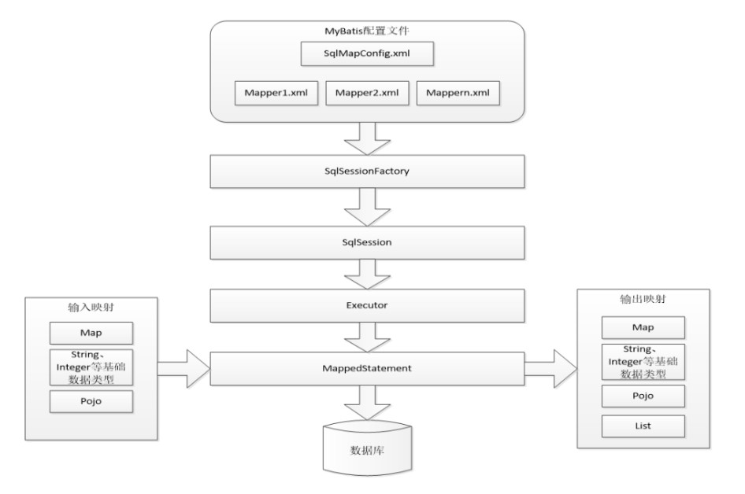
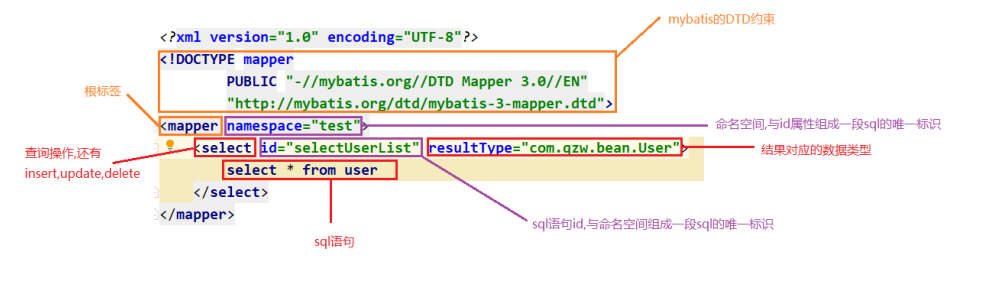
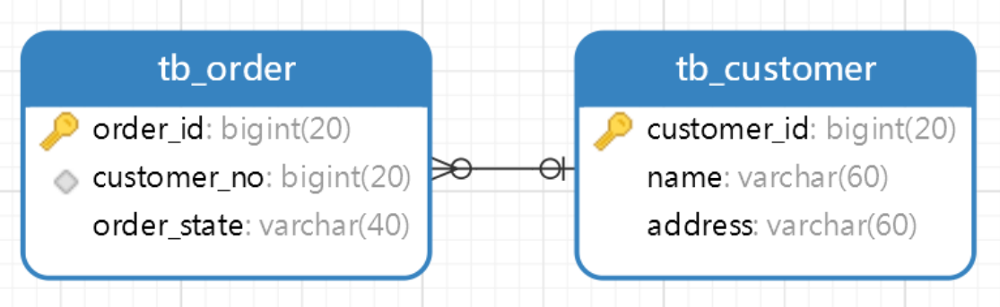
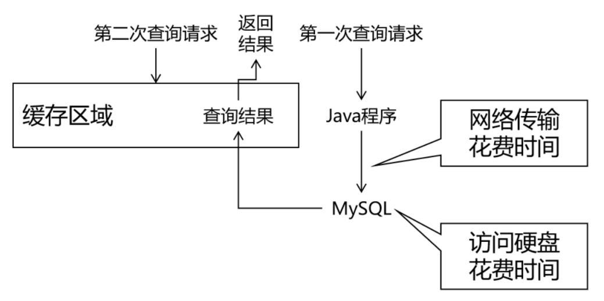
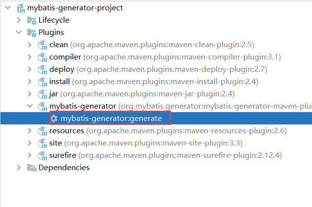

## MyBatis

### 1.原始JDBC存在问题

- 存在问题
    - ①频繁地创建和销毁Connection对象
    - ②driverClass、url、username、password、sql语句都存在字符串硬编码
    - ③手动设置参数
        - 输入映射：将输入的值映射到占位符
    - ④手动处理结果集
        - 输出映射：将结果集映射到JavaBean
    - ⑤手动释放资源
- 解决方案(使用mybatis)
    - ①引入连接池
    - ②使用配置文件
    - ③使用反射+缺省操作
    - ④使用反射+缺省操作
    - ⑤缺省操作

### 2.mybatis概述

- 概述

    - mybatis是一个优秀的基于java的持久层框架，它内部封装了jdbc,使开发者只需要关注sql语句本身，而不需要花费精力去处理加载驱动、创建连接等繁杂的过程

- 结构

    

### 3.mybatis入门程序

- 官网

    [mybatis - MyBatis 3 | 入门](https://mybatis.org/mybatis-3/zh/getting-started.html)

- 开发步骤
    - ①引入mybatis相关依赖
    - ②创建mybatis的核心配置文件
        - 配置数据库环境(事务管理器、数据源)
        - 加载mapper映射文件
    - ③创建mapper映射配置文件
        - 配置MappedStatement
    - ④定义dao接口及其实现子类
        - 1,读取mybatis的核心配置文件
        - 2,创建SqlSessionFactory对象
        - 3,获取SqlSession对象
        - 4,操作对应的MappedStatement对象
        - 5,释放资源
    - ⑤代码测试

- ①引入mybatis相关依赖

    ```xml
    <dependency>
        <groupId>org.mybatis</groupId>
        <artifactId>mybatis</artifactId>
        <version>3.5.7</version>
    </dependency>
    <dependency>
        <groupId>mysql</groupId>
        <artifactId>mysql-connector-java</artifactId>
        <version>5.1.48</version>
    </dependency>
    ```

- ②创建mybatis的核心配置文件

    ```xml
    <?xml version="1.0" encoding="UTF-8" ?>
    <!DOCTYPE configuration
            PUBLIC "-//mybatis.org//DTD Config 3.0//EN"
            "http://mybatis.org/dtd/mybatis-3-config.dtd">
    <configuration>
        <environments default="development">
            <environment id="development">
                <!--事务管理器-->
                <transactionManager type="JDBC"/>
                <!--数据源-->
                <dataSource type="POOLED">
                    <property name="driver" value="com.mysql.jdbc.Driver"/>
                    <property name="url" value="jdbc:mysql://localhost:3306/mydb1"/>
                    <property name="username" value="root"/>
                    <property name="password" value="root"/>
                </dataSource>
            </environment>
        </environments>
    
        <!--加载映射配置文件-->
        <mappers>
            <mapper resource="mapper01.xml"/>
        </mappers>
    </configuration>
    ```

- ③创建mapper映射配置文件

    ```xml
    <?xml version="1.0" encoding="UTF-8" ?>
    <!DOCTYPE mapper
            PUBLIC "-//mybatis.org//DTD Mapper 3.0//EN"
            "http://mybatis.org/dtd/mybatis-3-mapper.dtd">
    <mapper namespace="test">
        <!--
            配置MappedStatement
            id:statement唯一标识
            parameterType: 输入映射的类型
            resultType: 输出映射的类型
        -->
        <select id="selectExamById" parameterType="int" resultType="com.atguigu.pojo.Exam">
            select * from tb_exam where id = #{id}
        </select>
    </mapper>
    ```

    ④定义dao接口及其实现子类

    ```java
    public class ExamDaoImpl implements ExamDao {
        @Override
        public Exam selectExamById(Integer id) throws Exception {
            //1，读取mybatis核心配置文件
            InputStream inputStream = Resources.getResourceAsStream("SqlMapConfig.xml");
            //2，获取SqlSessionFactory对象
            SqlSessionFactory sqlSessionFactory = new SqlSessionFactoryBuilder().build(inputStream);
            //3，打开会话
            SqlSession sqlSession = sqlSessionFactory.openSession();
            //4，执行MappedStatement
            Exam exam = sqlSession.selectOne("selectExamById", id);
            //5，关闭会话
            sqlSession .close();
            return exam;
        }
    }
    ```

    ⑤代码测试

    ```java
    public class ExamDaoTest {
    
        @Test
        public void selectExamById() throws Exception {
    
            ExamDao examDao = new ExamDaoImpl();
            Exam exam = examDao.selectExamById(1);
            System.out.println("exam = " + exam);
    
        }
    }
    ```


### 4.mapper映射文件说明

- 映射文件
  
    
    

### 5.添加用户

- 代码实现
  
    ```xml
    <!--添加用户-->
    <insert id="addExam" parameterType="com.atguigu.pojo.Exam">
        insert into tb_exam
        values (null, #{name}, #{math}, #{english}, #{chinese})
    </insert>
    ```
    
    ```java
    @Override
    public int addExam(Exam inputExam) throws Exception {
        //1，读取mybatis核心配置文件
        InputStream inputStream = Resources.getResourceAsStream("SqlMapConfig.xml");
        //2，获取SqlSessionFactory对象
        SqlSessionFactory sqlSessionFactory = new SqlSessionFactoryBuilder().build(inputStream);
        //3，打开会话
        SqlSession sqlSession = sqlSessionFactory.openSession();
        //4，执行MappedStatement
        int addExam = sqlSession.insert("addExam", inputExam);
        //5，提交事务
        sqlSession.commit();
        //6，关闭会话
        sqlSession.close();
        return addExam;
    }
    ```
    
- 注意事项

    - mybatis的事务是手动提交

### 6.删除用户

- 代码实现
  
    ```xml
    <delete id="deleteExamById" parameterType="int">
        delete
        from tb_exam
        where id = #{id}
    </delete>
    ```
    
    ```java
    @Override
    public int deleteExamById(Integer id) throws Exception {
        //1，读取mybatis核心配置文件
        InputStream inputStream = Resources.getResourceAsStream("SqlMapConfig.xml");
        //2，获取SqlSessionFactory对象
        SqlSessionFactory sqlSessionFactory = new SqlSessionFactoryBuilder().build(inputStream);
        //3，打开会话
        SqlSession sqlSession = sqlSessionFactory.openSession();
        //4，执行MappedStatement
        int deleteExamById = sqlSession.insert("deleteExamById", id);
        //5，提交事务
        sqlSession.commit();
        //6，关闭会话
        sqlSession.close();
        return deleteExamById;
    }
    ```
    

### 7.修改用户

- 代码实现
  
    ```xml
    <update id="updateExamById" parameterType="com.atguigu.pojo.Exam">
        update tb_exam
        set name    = #{name},
            math    = #{math},
            english = #{english},
            chinese = #{chinese}
        where id = #{id}
    </update>
    ```
    
    ```java
    @Override
    public int updateExamById(Exam inputExam) throws Exception {
        //1，读取mybatis核心配置文件
        InputStream inputStream = Resources.getResourceAsStream("SqlMapConfig.xml");
        //2，获取SqlSessionFactory对象
        SqlSessionFactory sqlSessionFactory = new SqlSessionFactoryBuilder().build(inputStream);
        //3，打开会话
        SqlSession sqlSession = sqlSessionFactory.openSession();
        //4，执行MappedStatement
        int updateExamById = sqlSession.insert("updateExamById", inputExam);
        //5，提交事务
        sqlSession.commit();
        //6，关闭会话
        sqlSession.close();
        return updateExamById;
    }
    ```
    

### 8.Resources类概述

- 概述
    - 用来读取资源的工具类

### 9.SqlSessionFactoryBuilder类概述

- 概述
    - 这个类可以被实例化，使用和丢弃，一旦创建了SqlSessionFactory，就不再需要它了
    - 但最好还是不要一直保留它
    - 最好是一个方法内的匿名对象

### 10.SqlSessionFactory接口概述

- 概述
    - SqlSessionFactory一旦被创建就应该在应用的运行期间一直存在，没有任何理由丢弃它或重新创建另一个实例
    - 使用SqlSessionFactory的最佳时间是在应用运行期间，不要重复创建多次，多次创建SqlSessionFactory被视为一种代码“坏习惯”。因此SqlSessionFactory的最佳作用域是应用作用域

### 11.SqlSession接口概述

- 概述
    - 每个线程都应该有它自己的SqlSession实例。SqlSession的实例不是线程安全的，因此是不能被共享的，所以它的最佳作用域是请求或方法作用域
    - 一次数据库操作就应该是一个新的SqlSession对象

### 12.mybatis传统dao开发

- 概述
    - mybatis开发有两种方式：1.传统dao开发; 2.mapper接口代理开发
    - 传统dao开发：dao接口 + dao接口实现子类 + mapper映射文件
- 代码实现
  
    ```java
    public class ExamDaoImpl implements ExamDao {
       
    	  private SqlSessionFactory sqlSessionFactory ;
    
        //后续和spring框架整合之后，就可以保证sqlSessionFactory对象是一个单例对象
        public ExamDaoImpl(SqlSessionFactory sqlSessionFactory) {
            this.sqlSessionFactory = sqlSessionFactory;
        }
    
        @Override
        public Exam selectExamById(Integer id) throws Exception {
    
            //3，打开会话
            SqlSession sqlSession = sqlSessionFactory.openSession();
            //4，执行MappedStatement
            Exam exam = sqlSession.selectOne("selectExamById", id);
            //5，关闭会话
            sqlSession .close();
            return exam;
        }
    
        @Override
        public int addExam(Exam inputExam) throws Exception {
    
            //3，打开会话
            SqlSession sqlSession = sqlSessionFactory.openSession();
            //4，执行MappedStatement
            int addExam = sqlSession.insert("addExam", inputExam);
            //5，提交事务
            sqlSession.commit();
            //6，关闭会话
            sqlSession.close();
            return addExam;
        }
    
        @Override
        public int deleteExamById(Integer id) throws Exception {
    
            //3，打开会话
            SqlSession sqlSession = sqlSessionFactory.openSession();
            //4，执行MappedStatement
            int deleteExamById = sqlSession.delete("deleteExamById", id);
            //5，提交事务
            sqlSession.commit();
            //6，关闭会话
            sqlSession.close();
            return deleteExamById;
        }
    
        @Override
        public int updateExamById(Exam inputExam) throws Exception {
    
            //3，打开会话
            SqlSession sqlSession = sqlSessionFactory.openSession();
            //4，执行MappedStatement
            int updateExamById = sqlSession.update("updateExamById", inputExam);
            //5，提交事务
            sqlSession.commit();
            //6，关闭会话
            sqlSession.close();
            return updateExamById;
        }
    }
    ```
    
- 存在问题
    - ①mapper映射文件和dao实现子类的耦合度过高
    - ②开发中会有大量的dao实现子类，难以维护

### 13.mybatis接口代理开发

- 概述

    - dao接口 + mapper映射文件
- 开发步骤
    - ①mapper映射文件要和接口放在同一个目录中
    - ②mapper映射文件要和接口名称一致
    - ③mapper映射文件的namespace和接口的全类名一致
    - ④MappedStatement的id和接口的方法名称一致
    - ⑤MappedStatement的paramType和接口方法的形参类型一致
    - ⑥MappedStatement的returnType和接口方法的返回值类型一致
    - ⑦代码测试
- 代码实现
  
    ```xml
    <?xml version="1.0" encoding="UTF-8" ?>
    <!DOCTYPE mapper
            PUBLIC "-//mybatis.org//DTD Mapper 3.0//EN"
            "http://mybatis.org/dtd/mybatis-3-mapper.dtd">
    <mapper namespace="com.atguigu.dao.ExamDao">
        <select id="selectExamById" parameterType="int" resultType="com.atguigu.pojo.Exam">
            select *
            from tb_exam
            where id = #{id}
        </select>
    
        <!--添加exam-->
        <insert id="addExam" parameterType="com.atguigu.pojo.Exam">
            insert into tb_exam
            values (null, #{name}, #{math}, #{english}, #{chinese})
        </insert>
    
        <!--删除exam-->
        <delete id="deleteExamById" parameterType="int">
            delete
            from tb_exam
            where id = #{id}
        </delete>
    
        <!--修改exam-->
        <update id="updateExamById" parameterType="com.atguigu.pojo.Exam">
            update tb_exam
            set name   = #{name},
                math    = #{math},
                english = #{english},
                chinese = #{chinese}
            where id = #{id}
        </update>
    </mapper>
    ```
    
    ```java
    public class ExamDaoTest {
    
        private SqlSessionFactory sqlSessionFactory;
    
        @Before
        public void init() throws IOException {
            sqlSessionFactory = new SqlSessionFactoryBuilder()
                    .build(Resources.getResourceAsStream("SqlMapConfig.xml"));
        }
    
        @Test
        public void selectExamById() throws Exception {
            SqlSession sqlSession = sqlSessionFactory.openSession();
            ExamDao examDao = sqlSession.getMapper(ExamDao.class);
            Exam exam = examDao.selectExamById(2);
            System.out.println("exam = " + exam);
            sqlSession.close();
        }
    }
    ```
    

### 14.mybatis-config配置文件解释

- 概述
    - properties
        - 用于在mybatis中声明变量
    - settings
        - 缓存、懒加载、日志实现等等
    - typeAlias
        - 设置别名
    - plugins
        - 设置插件
    - environments
        - 事务管理器、数据源
    - mappers
        - 加载mapper映射文件

### 15.mybatis内置连接池

- 概述
    - 在Mybatis中也有连接池技术，但是它采用的是自己的连接池技术。在mybatis的mybatis-config.xml配置文件中，通过配置<DataSource>标签实现连接池的配置
- 分类
    - JndiDataSourceFactory
    - PooledDataSource
    - UnpooledDataSource

### 16.environments标签

- 组成
    - transactionManager
        - JDBC：有事务管理
        - MANAGED：无事务管理
    - dataSource
        - POOLED
        - UNPOOLED
- 代码实现
  
    ```xml
    <environments default="development2">
    
        <environment id="development">
            <!--事务管理器-->
            <transactionManager type="JDBC"/>
    
            <!--数据源-->
            <dataSource type="POOLED">
                <property name="driver" value="com.mysql.jdbc.Driver"/>
                <property name="url" value="jdbc:mysql://localhost:3306/mydb1"/>
                <property name="username" value="root"/>
                <property name="password" value="root"/>
            </dataSource>
    
        </environment>
    
        <environment id="development2">
            <!--事务管理器-->
            <transactionManager type="JDBC"/>
    
            <!--数据源-->
            <dataSource type="UNPOOLED">
                <property name="driver" value="com.mysql.jdbc.Driver"/>
                <property name="url" value="jdbc:mysql://localhost:3306/mydb1"/>
                <property name="username" value="root"/>
                <property name="password" value="root"/>
            </dataSource>
    
        </environment>
    </environments>
    ```
    

### 17.properties标签

- 概述

    - 在mybatis容器中声明变量并复用
- 代码实现
  
    ```xml
    <properties>
        <property name="driverClass" value="com.mysql.jdbc.Driver"/>
        <property name="url" value="jdbc:mysql://localhost:3306/mydb1"/>
        <property name="username" value="root"/>
        <property name="password" value="root"/>
    </properties>
    <environments default="development">
        <environment id="development">
            <!--事务管理器-->
            <transactionManager type="JDBC"/>
    
            <!--数据源-->
            <dataSource type="POOLED">
                <property name="driver" value="${driverClass}"/>
                <property name="url" value="${url}"/>
                <property name="username" value="${username}"/>
                <property name="password" value="${password}"/>
            </dataSource>
        </environment>
    </environments>
    ```
    
    ```xml
    <properties resource="jdbc.properties"></properties>
    <!--整合spring之后弃用-->
    <environments default="development">
        <environment id="development">
            <!--事务管理器-->
            <transactionManager type="JDBC"/>
    
            <!--数据源-->
            <dataSource type="POOLED">
                <property name="driver" value="${driverClass}"/>
                <property name="url" value="${url}"/>
                <property name="username" value="${username}"/>
                <property name="password" value="${password}"/>
            </dataSource>
        </environment>
    </environments>
    ```
    

### 18.settings标签之log4j

- 概述

    - 在日常开发过程中，排查问题时难免需要输出mybatis真正执行的SQL语句、参数、结果等信息，我们就可借助log4j的概念来实现执行信息的输出
- 开发步骤
    - ①引入log4j相关依赖
    - ②引入log4j.xml配置文件
    - ③配置mybatis的日志实现
- ①引入log4j相关依赖
  
    ```xml
    <dependency>
        <groupId>log4j</groupId>
        <artifactId>log4j</artifactId>
        <version>1.2.17</version>
    </dependency>
    ```
    
- ②引入log4j.xml配置文件
  
    ```xml
    <?xml version="1.0" encoding="UTF-8" ?>
    <!DOCTYPE log4j:configuration SYSTEM "log4j.dtd">
    <log4j:configuration xmlns:log4j="http://jakarta.apache.org/log4j/">
    
        <appender name="STDOUT" class="org.apache.log4j.ConsoleAppender">
            <param name="Encoding" value="UTF-8"/>
            <layout class="org.apache.log4j.PatternLayout">
                <param name="ConversionPattern" value="%-5p %d{MM-dd HH:mm:ss,SSS} %m  (%F:%L) \n"/>
            </layout>
        </appender>
        <logger name="java.sql">
            <level value="debug"/>
        </logger>
        <logger name="org.apache.ibatis">
            <level value="info"/>
        </logger>
    
        <!--开启全局日志打印-->
        <root>
            <level value="debug"/>
            <appender-ref ref="STDOUT"/>
        </root>
    </log4j:configuration>
    ```
    
- ③配置mybatis的日志实现
  
    ```xml
    <properties resource="jdbc.properties"></properties>
    ```
    

### 19.settings标签之mapUnderscoreToCamelCase

- 概述
    - 数据库中，表的字段名称为：a_column; java中，类的名称为：aColumn
    - 如果设置mapUnderscoreToCamleCase=true，a_column字段就会自动映射到aColumn
- 代码实现
  
    ```xml
    <settings>
        <setting name="mapUnderscoreToCamelCase" value="true"/>
    </settings>
    ```
    

### 20.typeAliases标签

- 概述

    - 设置java类型的别名
- 代码实现
  
    ```xml
    <typeAliases>
        <typeAlias type="com.atguigu.pojo.User" alias="user" ></typeAlias>
        <typeAlias type="com.atguigu.pojo.Exam" alias="exam" ></typeAlias>
    </typeAliases>
    ```
    
    ```xml
    <typeAliases>
        <package name="com.atguigu.pojo"/>
    </typeAliases>
    ```
    

### 21.mapper标签

- 概述

    - 加载映射配置文件
- 代码
  
    ```xml
    <!--加载映射配置文件-->
    <mappers>
        <!--传统dao开发、接口代理开发-->
        <mapper resource="com/atguigu/dao/ExamDao.xml"/>
        <mapper resource="com/atguigu/dao/UserDao.xml"/>
    </mappers>
    ```
    
    ```xml
    <!--加载映射配置文件-->
    <mappers>
        <!--接口代理开发-->
        <mapper class="com.atguigu.dao.UserDao"></mapper>
        <mapper class="com.atguigu.dao.ExamDao"></mapper>
    </mappers>
    ```
    
    ```xml
    <mappers>
        <!--接口代理开发-->
        <package name="com.atguigu.dao"/>
    </mappers>
    ```
    

### 22.核心配置文件之plugins插件

- 概述

    - mybatis可以使用第三方的插件对功能进行扩展，分页助手PageHelper是将分页的复杂操作进行封装，使用简单的方式即可获得分页的相关数据
- 开发步骤
    - ①引入pagehelper相关依赖
    - ②在mybatis-config.xml中配置pagehelper
    - ③定义service接口机器实现子类
        - 编写分页代码
    - ④定义dao接口及其实现子类
- ①引入pagehelper相关依赖
  
    ```xml
    <dependency>
        <groupId>com.github.pagehelper</groupId>
        <artifactId>pagehelper</artifactId>
        <version>5.2.1</version>
    </dependency>
    ```
    
- ②在mybatis-config.xml中配置pagehelper
  
    ```xml
    <plugins>
        <plugin interceptor="com.github.pagehelper.PageInterceptor">
            <property name="reasonable" value="true"/>
        </plugin>
    </plugins>
    ```
    
- ③定义service接口及其实现子类
  
    ```java
    @Override
    public PageInfo<Exam> selectExamListByPage(Integer currentPage, Integer pageSize) throws Exception {
        //开启分页查询
        PageHelper.startPage(currentPage, pageSize);
        SqlSessionFactory sqlSessionFactory = new SqlSessionFactoryBuilder()
                .build(Resources.getResourceAsStream("SqlMapConfig.xml"));
        SqlSession sqlSession = sqlSessionFactory.openSession();
        ExamDao examDao = sqlSession.getMapper(ExamDao.class);
        List<Exam> examList = examDao.selectExamList();
    
        sqlSession.close();
        return new PageInfo<>(examList);
    }
    ```
    
- ④定义dao接口及其实现子类
- ⑤代码测试
  
    ```java
    @Test
    public void selectExamListByPage() throws Exception {
        ExamService examService = new ExamServiceImpl();
        PageInfo<Exam> pageInfo = examService.selectExamListByPage(2, 2);
        System.out.println("pageInfo = " + pageInfo);
        System.out.println("当前页数:"+pageInfo.getPageNum());
        System.out.println("每页记录数:"+pageInfo.getPageSize());
        System.out.println("总页数:"+pageInfo.getPages());
        System.out.println("上一页的页码:"+pageInfo.getPrePage());
        System.out.println("下一页的页码:"+pageInfo.getNextPage());
        System.out.println("是否是第一页:"+pageInfo.isIsFirstPage());
        System.out.println("是否是最后一页:"+pageInfo.isIsLastPage());
        System.out.println("总记录数:"+pageInfo.getTotal());
        System.out.println("当前页数据:"+pageInfo.getList());
    }
    ```
    

### 23.给SQL语句传参

- 概述

    - Mybatis会在运行过程中，把配置文件中的SQL语句中的#{}转换为”?”占位符，发送给数据库执行。
- 需求

    - 根据账户模糊查询
- 代码实现
  
    ```java
    <select id="selectUserLikeName1" parameterType="string" resultType="user">
        select *
        from tb_user
        where user_name like "%"#{userName}"%"
    </select>
    
    <select id="selectUserLikeName2" parameterType="string" resultType="user">
        select *
        from tb_user
        where user_name like "%${userName}%"
    </select>
    ```
    
- 总结
    - #{}
        - 不能直接写入字符串中
        - 可以防止SQL注入漏洞
        - 不可以传入表名
    - ${}
        - 能直接写入到字符串中
        - 不可以防止SQL注入漏洞
        - 可以传入表名

### 24.输入映射

- 概述
    - 输入映射：是在映射文件中通过parameterType指定输入参数的类型。从而将用户输入的内容赋值到SQL语句的占位符中。
- 简单类型：包含一个值
    - 基本数据类型
    - 包装类
    - String
- 复杂类型：包含多个值
    - javabean实体类
    - 集合
    - 数组

### 25.输入映射之简单类型

- 概述

    - 输入一个简单类型的值
- 需求

    - 根据id查询用户记录
- 代码实现
  
    ```xml
    <select id="selectUserById1" parameterType="int" resultType="user">
        select *
        from tb_user
        where user_id = #{userId}
    </select>
    
    <select id="selectUserById2"  resultType="user">
        select *
        from tb_user
        where user_id = #{userId}
    </select>
    ```
    

### 26.输入映射之零散简单类型

- 概述

    - 输入多个简单类型的值
- 需求

    - 根据账户和密码查询记录
- 代码实现
  
    ```xml
    <select id="selectUserByNameAndPwd1" resultType="user">
        select *
        from tb_user
        where user_name = #{param1}
          and user_pwd = #{param2}
    </select>
    
    <select id="selectUserByNameAndPwd2" resultType="user">
        select *
        from tb_user
        where user_name = #{userName}
          and user_pwd = #{userPwd}
    </select>
    ```
    
    ```java
    User selectUserByNameAndPwd1(String userName , String userPwd) throws Exception;
    
    User selectUserByNameAndPwd2(@Param("userName") String userName , @Param("userPwd") String userPwd) throws Exception;
    ```
    

### 27.输入映射之实体类型

- 概述

    - mybatis会根据#{}中传入的数据，加工成getXxx()方法，通过反射在实体类对象中调用这个方法，从而获取到对应的数据。填充到#{}这个位置
- 需求

    - 根据用户名和密码查询用户
- 代码实现
  
    ```java
    <select id="selectUserByNameAndPwd3" parameterType="user" resultType="user">
        select *
        from tb_user
        where user_name = #{userName}
          and user_pwd = #{userPwd}
    </select>
    
    <select id="selectUserByNameAndPwd4"  resultType="user">
        select *
        from tb_user
        where user_name = #{userName}
          and user_pwd = #{userPwd}
    </select>
    ```
    

### 28.输入映射之Map

- 概述

    - 如果要输入多个简单类型的值，同时也找不合适的javabean来进行封装，使用零散简单类型(@Param)又太过复杂，此时就可以使用map封装，然后进行输入映射
- 代码实现
  
    ```xml
    <select id="selectUserByMap" parameterType="map"  resultType="user">
        select *
        from tb_user
        where user_name = #{userName}
          and user_pwd = #{userPwd}
    </select>
    
    <select id="selectUserByMap2"   resultType="user">
        select *
        from tb_user
        where user_name = #{userName}
          and user_pwd = #{userPwd}
    </select>
    ```
    
- 注意事项
    - #{userName}和map的key一致
    - parameterType=”map”可以省略

### 29.输出映射

- 概述
    - 输出映射，是在映射文件中通过resultType指定输出结果的类型。类型可以是简单类型、复杂类型
- 简单类型：包含一个值
    - 基本数据类型
    - 包装类
    - String

### 30.输出映射值之简单类型

- 概述

    - 输出一个简单类型的结果
- 需求

    - 查询总记录数
- 代码实现
  
    ```xml
    <select id="selectTotalCount" resultType="long">
        select count(*)
        from tb_user
    </select>
    ```
    

### 31.输出映射之Map

- 概述
    - 适用于SQL查询返回的各个字段综合起来并不和一个现有的实体类对应，没法封装到实体类对象中。能够封装成实体类型的，就不使用map类型
    - map的键存储的是字段的名，map的值存储的是字段的值
- 代码实现
  
    ```xml
    <select id="selectUserById4" resultType="map">
        select *
        from tb_user
        where user_id = #{userId}
    </select>
    ```
    

### 32. 输出映射之List

- 概述

    - 查询结果返回多个实体类对象，希望把多个实体类对象放在List集合中返回。此时不需要任何特殊处理，还是在resultType属性中设置实体类类型
- 代码实现
  
    ```xml
    <select id="selectUserList" resultType="user">
        select *
        from tb_user
    </select>
    ```
    

### 33.输出映射之ResultMap

- 概述
    - 如果数据库中的字段名称(a_column)和实体类中的属性名称(aColumn)不一致，会导致输出映射不成功！
    - 可以通过设置别名、mapUnderscoreToCamelCase=true、resultMap来解决
    - resultMap自定义映射规则来达到输出映射的目的
- 代码实现
  
    ```xml
    <!--自定义输出映射规则-->
    <resultMap id="userMap" type="user">
        <id column="user_id" property="userId" javaType="Integer"></id>
        <result column="user_name" property="userName" javaType="String"></result>
        <result column="user_pwd" property="userPwd" javaType="String"></result>
        <result column="money" property="money" javaType="Double"></result>
    </resultMap>
    
    <select id="selectUserListByResultMap" resultMap="userMap">
        select *
        from tb_user
    </select>
    ```
    
- 注意事项

    - 如果表中的字段名和类的属性名一致，就不需要在resultMap中自定义映射规则，可以自动输出映射

### 34.insert实现主键返回

- 概述

    - 添加记录后，获取已添加的记录的自增长主键值

- 分类
    - ①使用useGenerateKeys属性
    - ②使用selectKey标签

- ①使用useGenerateKeys属性

    ```xml
    <insert id="addUser1" useGeneratedKeys="true" keyColumn="user_id" keyProperty="userId">
        insert into tb_user
        values (null, #{userName}, #{userPwd}, #{money})
    </insert>
    ```

- ②使用selectKey标签

    ```xml
    <insert id="addUser2" >
        insert into tb_user
        values (null, #{userName}, #{userPwd}, #{money})
        <selectKey keyColumn="user_id" keyProperty="userId" resultType="int"  order="AFTER">
            select last_insert_id()
        </selectKey>
    </insert>
    ```

### 35.动态SQL之SQL片段

* 概述

  * 在开发中，SQL的拼接很常见，有很多的sql具有重复性高的特点，这时最好把重复的sql抽取出来，作为公用的sql片段。

* 代码实现

  ```xml
  <!--定义SQL片段-->
  <sql id="queryArgs">
      user_name , user_pwd
  </sql>
  
  <select id="selectUserLikeName1" parameterType="string" resultType="user">
      select
      /*使用SQL片段*/
      <include refid="queryArgs"></include>
      from tb_user
      where user_name like "%"#{userName}"%"
  </select>
  ```

### 36.动态SQL之if标签

* 概述

  * if标签可以根据条件动态地生成SQL语句

* 需求

  * 如果账户和密码都没有就查询所有用户记录
  * 如果只有账户，就根据账户查询用户记录
  * 如果只有密码，就根据密码查询用户记录
  * 如果账户和密码都有，就根据账户和密码查询用户

* 代码实现

  ```xml
  <!--存在问题，SQL语句一成不变，无法达到需求-->
  <select id="selectUserListByNameAndPwd" resultType="user">
      select *
      from tb_user
      where user_name = #{userName}
      and user_pwd = #{userPwd}
  </select>
  ```

  ```xml
  <select id="selectUserListByNameAndPwd2" resultType="user">
      select *
      from tb_user
      where 1 = 1
      <if test="userName!=null and userName!=''">
          and user_name = #{userName}
      </if>
      <if test="userPwd!=null and userPwd!=''">
          and user_Pwd = #{userPwd}
      </if>
  </select>
  ```

* 存在问题

  * 不够优雅~~~

### 37.动态SQL之where标签

* 概述

  * where标签会自动去掉标签体内前面多余的and/or

* 代码实现

  ```xml
  <select id="selectUserListByWhere" resultType="user">
      select *
      from tb_user
      <where>
          <if test="userName!=null and userName!=''">
              and user_name = #{userName}
          </if>
          <if test="userPwd!=null and userPwd!=''">
              and user_Pwd = #{userPwd}
          </if>
      </where>
  </select>
  ```

### 38.动态SQL之trim标签

* 常用属性

  | 属性            | 说明                       |
  | --------------- | -------------------------- |
  | prefix          | 如果条件成立，生成指定前缀 |
  | prefixOverrides | 如果条件成立，移除指定前缀 |
  | suffix          | 如果条件成立，生成指定后缀 |
  | suffixOverrides | 如果条件成立，移除指定后缀 |

 * 代码实现

   ```xml
   <select id="selectUserListByTrim" resultType="user">
       select *
       from tb_user
       /*
           根据条件，动态地生成where关键字，动态地移除and或or，相当于where标签
       */
       <trim prefix="where" prefixOverrides="and|or">
           <if test="userName!=null and userName!=''">
               and user_name = #{userName}
           </if>
           <if test="userPwd!=null and userPwd!=''">
               and user_Pwd = #{userPwd}
           </if>
       </trim>
   </select>
   ```

### 39.动态SQL之set标签

* 概述

  * 动态生成set关键字，会自动去掉标签体内后面多余的逗号

* 需求

  * 根据id修改用户信息

* 代码实现

  ```xml
  <update id="updateUserById">
      update tb_user
      set
      <if test="userName!=null and userName!=''">
          user_name = #{userName},
      </if>
      <if test="userPwd!=null and userPwd!=''">
          user_pwd = #{userPwd},
      </if>
      where user_id = #{userId}
  </update>
  ```

  ```xml
  <update id="updateUserById">
      update tb_user
      <set>
          <if test="userName!=null and userName!=''">
              user_name = #{userName},
          </if>
          <if test="userPwd!=null and userPwd!=''">
              user_pwd = #{userPwd},
          </if>
      </set>
  
      where user_id = #{userId}
  </update>
  ```

### 40.动态SQL之choose标签

* 概述

  * 在多个分支条件中，仅执行一个，而后面的条件匹配都会被忽略

* 代码实现

  ```xml
  <select id="selectUserListByChoose" resultType="user">
      select * from tb_user
      <where>
          <choose>
              <when test="userName!=null and userName!=''">
                  user_name = #{userName}
              </when>
              <when test="userPwd!=null and userPwd!=''">
                  user_pwd = #{userPwd}
              </when>
          </choose>
      </where>
  </select>
  ```

### 41.动态SQL之批量查询

* 需求

  * 根据一组id查询多条用户记录

* 代码实现

  ```xml
  <!--
      方式一：select * from tb_user where user_id in(1,2,3)
  -->
  <select id="selectUserListByIds" resultType="user">
      select * from tb_user
      <where>
          user_id in
          <foreach collection="list" open="(" separator="," close=")" item="id">
              #{id}
          </foreach>
      </where>
  </select>
  
  <!--
      方式二：select * from tb_user where user_id = 1 or user_id = 2 or user_id = 3
  -->
  <select id="selectUserListByIds2" resultType="user">
      select * from tb_user
      <where>
          <foreach collection="list" separator="or" item="id">
              user_id = #{id}
          </foreach>
      </where>
  </select>
  ```

### 42.动态SQL之批量添加

* 需求

  * 批量添加用户记录

* 代码实现

  ```xml
  <insert id="addUsers">
      insert into tb_user values
      <foreach collection="list" separator="," item="user">
          (null,#{user.userName},#{user.userPwd},#{user.money})
      </foreach>
  </insert>
  ```

### 43.动态SQL之批量修改

* 需求

  * 批量修改用户记录

* 代码实现

  ```properties
  driverClass=com.mysql.jdbc.Driver
  url=jdbc:mysql://localhost:3306/mydb1?allowMultiQueries=true
  username=root
  password=root
  ```

  ```xml
  <update id="updateUsers">
      <foreach collection="list" separator=";" item="user">
          update tb_user set user_name = #{user.userName} where user_id = #{user.userId}
      </foreach>
  </update>
  ```

### 44.多表关系设计回顾

* 一对一：表A中的一条记录确定表B中的一条记录，表B中的一条记录确定表A中的一条记录
  * 比如：公司和注册地址
  * 一对一查询
* 一对多：表A中的一条记录确定表B中的多条记录，表B中的一条记录确定表A中的一条记录
  * 比如：部门和员工
  * 一对一查询
  * 一对多查询
* 多对多：表A中的一条记录确定表B中的多条记录，表B中的一条记录确定表A中的多条记录
  * 比如：老师和学生
  * 一对多查询
  * 一对多查询

### 45.关联查询环境搭建

* 环境搭建

  

* 代码实现

  ```java
  public class Customer {
      private Integer customerId;//用户编号
      private String customerName;//用户姓名
      private String address;//收货地址
      private List<Order> orderList;//订单列表
  }
  ```

  ```java
  public class Order {
      private Integer orderId;//订单编号
      private String orderState;//订单状态
      private Customer customer;//用户信息
  }
  ```

### 46.关联查询之一对一查询

* 需求

  * 根据id查询订单信息，关联查询用户信息

* 代码实现

  ```xml
  <!--Order类的自定义输出映射规则-->
  <resultMap id="orderMap" type="order">
      <id property="orderId" column="order_id" javaType="int"></id>
      <result property="orderState" column="order_state" javaType="String"></result>
      <association property="customer" javaType="customer">
          <id property="customerId" column="customer_id" javaType="int"></id>
          <result property="customerName" column="customer_name" javaType="String"></result>
          <result property="address" column="address" javaType="String"></result>
      </association>
  </resultMap>
  
  <select id="selectOrderAndCustomerByOrderId" resultMap="orderMap">
      select *
      from tb_order
      inner join tb_customer on tb_customer.customer_id = tb_order.customer_no
      where tb_order.order_id = #{orderId}
  </select>
  ```

### 47.分步查询之一对一

* 概述

  * 将一次多表查询拆分成多次单表查询，为后续的延迟加载做铺垫

* 需求

  * 根据id查询订单信息，分步查询用户信息

* 分析

  ```sql
  -- 根据orderId查询tb_order信息(customer_no)，再根据customer_no查询tb_customer
  select customer_no from tb_order where order_id = 1;
  select * from tb_customer where customer_id = 1;
  ```

* 代码实现

  ```xml
  <!--分步查询-->
  <resultMap id="orderMap2" type="order">
      <id property="orderId" column="order_id" javaType="int"></id>
      <result property="orderState" column="order_state" javaType="String"></result>
  
      <!--①②调用第二次单表查询:传入customer_no字段值-->
      <association
              property="customer"
              select="com.atguigu.mapper.CustomerMapper.selectCustomerByCustomerId"
              column="customer_no"
      />
  </resultMap>
  
  <!--①①第一次单表查询-->
  <select id="selectOrderByOrderId" resultMap="orderMap2">
      select *
      from tb_order
      where order_id = #{orderId}
  </select>
  ```

  ```xml
  <!--①③第二次单表查询--><select id="selectCustomerByCustomerId" resultType="customer">    select *    from tb_customer    where customer_id = #{customerId}</select>
  ```


### 48.分步查询之一对多

* 需求

  * 根据id查询用户记录，分布查询订单记录

* 分析

  ```sql
  -- 根据customer_name查询tb_customer信息(customer_id)，再根据customer_id查询tb_order
  select * from tb_customer where customer_name = '张三';
  select * from tb_order where customer_no = 1;
  ```

* 代码实现

  ```xml
  <!--分步查询-->
  <resultMap id="customerMap2" type="customer">
      <id property="customerId" column="customer_id" javaType="int"></id>
      <result property="customerName" column="customer_name" javaType="String"></result>
      <result property="address" column="address" javaType="String"></result>
      <!--②②调用第二次单表查询-->
      <collection property="orderList"
                  ofType="order"                select="com.atguigu.mapper.OrderMapper.selectOrderListByCustomerId"
                  column="customer_id"/>
  </resultMap>
  
  <!--②①第一次单表查询-->
  <select id="selectCustomerByCustomerName" resultMap="customerMap2">
      select * from tb_customer where customer_name = #{customerName}
  </select>
  ```

  ```xml
  <!--②③第二次单表查询-->
  <select id="selectOrderListByCustomerId" resultType="order">
      select *
      from tb_order
      where customer_no = #{customerId}
  </select>
  ```

### 49.mybatis延迟加载

* 概述
  * 延迟加载也就做懒加载，就是在使用某条数据再去查询，不使用就不查询
* 注意事项
  * 通常情况下，一对一查询不需要做延迟加载，一对多需要做延迟加载

### 50.延迟加载之一对一

* 开发步骤

  * ①编写mybatis-config.xml
    * 开启延迟加载
  * ②给具体statement配置延迟加载

* ①编写mybatis-config.xml

  ```xml
  <!--开启延迟加载-->
  <setting name="lazyLoadingEnabled" value="true"/>
  ```

* ②给具体statement配置延迟加载

  ```xml
  <!--分步查询-->
  <resultMap id="orderMap2" type="order">
      <id property="orderId" column="order_id" javaType="int"></id>
      <result property="orderState" column="order_state" javaType="String"></result>
  
      <!--①②调用第二次单表查询:传入customer_no字段值-->
      <!-- fetchType="eager"-->
      <association
                   property="customer"
                   select="com.atguigu.mapper.CustomerMapper.selectCustomerByCustomerId"
                   column="customer_no"
                   fetchType="lazy" />
  </resultMap>
  
  <!--①①第一次单表查询-->
  <select id="selectOrderByOrderId" resultMap="orderMap2">
      select *
      from tb_order
      where order_id = #{orderId}
  </select>
  ```

### 51.延迟加载之一对多

* 开发步骤

  * ①编写mybatis-config.xml
    * 开启延迟加载
  * ②给具体statement配置延加载

* ①编写mybatis-config.xml

* ②给具体statement配置延迟加载

  ```xml
  <!--分步查询-->
  <resultMap id="customerMap2" type="customer">
      <id property="customerId" column="customer_id" javaType="int"></id>
      <result property="customerName" column="customer_name" javaType="String"></result>
      <result property="address" column="address" javaType="String"></result>
      <!--②②调用第二次单表查询-->
      <collection property="orderList"
                  ofType="order"
                  select="com.atguigu.mapper.OrderMapper.selectOrderListByCustomerId"
                  column="customer_id"
                  fetchType="lazy"
      />
  
  </resultMap>
  
  <!--②①第一次单表查询-->
  <select id="selectCustomerByCustomerName" resultMap="customerMap2">
      select * from tb_customer where customer_name = #{customerName}
  </select>
  ```

### 52.mybatis缓存

* 概述

  * 

  * 第一次查询数据库(磁盘)后，会将记录存储到缓存中，第二次查询该记录，直接从缓存(内存)中获取

* 分类

  * 一级缓存
    * 当前SqlSession有效
  * 二级缓存
    * SqlSessionFactory有效，跨SqlSession
    * 当SqlSession.close()，一级缓存就会写入到二级缓存中

### 53.一级缓存的验证

* 概述

  * 一级缓存是SqlSession范围的缓存，当调用SqlSession的修改，添加，删除，commit()，close()等方法时，就会清空一级缓存

* 代码实现

  ```java
  @Test
  public void selectUserById() throws Exception {
      SqlSession sqlSession = sqlSessionFactory.openSession();
      UserMapper userMapper = sqlSession.getMapper(UserMapper.class);
      //查询userId=1的记录
      User user = userMapper.selectUserById(37);
      System.out.println("user = " + user);
  
      //查询userId=1的记录
      user = userMapper.selectUserById(37);
      System.out.println("user = " + user);
  
      sqlSession.close();
  }
  ```

### 54.一级缓存的清空

* 概述

  * 如果SqlSession去执行commit操作(执行插入、更新、删除)，清空SqlSession中的一级缓存，这样做的目的是为了让缓存中存储的是最新的信息

* 代码实现

  ```java
  @Test
  public void selectUserById() throws Exception {
      SqlSession sqlSession = sqlSessionFactory.openSession();
      UserMapper userMapper = sqlSession.getMapper(UserMapper.class);
      //查询userId=1的记录
      User user = userMapper.selectUserById(37);
      System.out.println("user = " + user);
  
      //执行DML，清空一级缓存
      userMapper.deleteUserById(15);
  
      //查询userId=1的记录
      user = userMapper.selectUserById(37);
      System.out.println("user = " + user);
  
      sqlSession.close();
  }
  ```

### 54.二级缓存的验证

* 概述

  * 二级缓存是跨SqlSession的
  * 当SqlSession关闭时，会将一级缓存中的内容写入到二级缓存中

* 开发步骤

  * ①编写mybatis-config.xml
    * 开启全局缓存
  * ②编写mapper映射文件
    * 开启二级缓存
  * ③二级缓存验证

* ①编写mybatis-config.xml

  ```xml
  <!--开启缓存-->
  <setting name="cacheEnabled" value="true"/>
  ```

* ②编写mapper映射文件

  ````xml
  <?xml version="1.0" encoding="UTF-8" ?>
  <!DOCTYPE mapper
          PUBLIC "-//mybatis.org//DTD Mapper 3.0//EN"
          "http://mybatis.org/dtd/mybatis-3-mapper.dtd">
  <mapper namespace="com.atguigu.mapper.UserMapper">
  
      <!--开启二级缓存-->
      <cache></cache>
  
      <select id="selectUserById" resultType="user" useCache="true">
          select *
          from tb_user
          where user_id = #{userId}
      </select>
  </mapper>
  ````

* ③二级缓存验证

  ```java
  @Test
  public void selectUserById2() throws Exception {
      SqlSession sqlSession = sqlSessionFactory.openSession();
      UserMapper userMapper = sqlSession.getMapper(UserMapper.class);
      //-----一级缓存的验证-----
      User user = userMapper.selectUserById(37);
      //user = userMapper.selectUserById(37);
      //一级缓存关闭，会将一级缓存中的内容写入到二级缓存
      sqlSession.close();
      //-----二级缓存的验证-----
      sqlSession = sqlSessionFactory.openSession();
      userMapper = sqlSession.getMapper(UserMapper.class);
      user = userMapper.selectUserById(37);
      sqlSession.close();
  
      sqlSession = sqlSessionFactory.openSession();
      userMapper = sqlSession.getMapper(UserMapper.class);
      user = userMapper.selectUserById(37);
      sqlSession.close();
  
  }
  ```

### 55.逆向工程

* 正向工程
  * 先创建Java实体类，由框架负责根据实体类生成数据库表。Hibernate是支持正向工程的。
* 逆向工程
  * 先创建数据表，由框架负责根据数据库表，反向生成如下资源
    * Java实体类、Mapper接口、Mapper配置文件

### 56.逆向工程操作

* 开发步骤

  * ①新建项目：mybatis-generator-project
  * ②编写pom.xml
    * 引入逆向工程相关依赖
  * ③编写generatorConfig.xml
    * 逆向工程核心配置文件
  * ④执行\mybatis-generator-maven-plugin
    * 生成javabean实体类、mapper接口、mapper映射文件

* ①新建项目：mybatis-generator-project

* ②编写pom.xml

  ```xml
  <dependencies>
      <dependency>
          <groupId>org.mybatis</groupId>
          <artifactId>mybatis</artifactId>
          <version>3.5.7</version>
      </dependency>
  </dependencies>
  <!-- 控制Maven在构建过程中相关配置 -->
  <build>
      <!-- 构建过程中用到的插件 -->
      <plugins>
          <!-- 具体插件，逆向工程的操作是以构建过程中插件形式出现的 -->
          <plugin>
              <groupId>org.mybatis.generator</groupId>
              <artifactId>mybatis-generator-maven-plugin</artifactId>
              <version>1.3.0</version>
  
              <!-- 插件的依赖 -->
              <dependencies>
                 <!-- 逆向工程的核心依赖 -->
                  <dependency>
                      <groupId>org.mybatis.generator</groupId>
                      <artifactId>mybatis-generator-core</artifactId>
                      <version>1.3.2</version>
                  </dependency>
  
                  <!-- 数据库连接池 -->
                  <dependency>
                      <groupId>com.mchange</groupId>
                      <artifactId>c3p0</artifactId>
                      <version>0.9.2</version>
                  </dependency>
  
                  <!-- MySQL驱动 -->
                  <dependency>
                      <groupId>mysql</groupId>
                      <artifactId>mysql-connector-java</artifactId>
                      <version>5.1.8</version>
                  </dependency>
              </dependencies>
          </plugin>
      </plugins>
  </build>
  ```

* ③编写generatorConfig.xml

  ```xml
  <?xml version="1.0" encoding="UTF-8"?>
  <!DOCTYPE generatorConfiguration
          PUBLIC "-//mybatis.org//DTD MyBatis Generator Configuration 1.0//EN"
          "http://mybatis.org/dtd/mybatis-generator-config_1_0.dtd">
  <generatorConfiguration>
      <!--
              targetRuntime: 执行生成的逆向工程的版本
                      MyBatis3Simple: 生成基本的CRUD（清新简洁版）
                      MyBatis3: 生成带条件的CRUD（奢华尊享版）
       -->
      <context id="DB2Tables" targetRuntime="MyBatis3">
          <!-- 数据库的连接信息 -->
          <jdbcConnection driverClass="com.mysql.jdbc.Driver"
                          connectionURL="jdbc:mysql://127.0.0.1:3306/mydb1"
                          userId="root"
                          password="root">
          </jdbcConnection>
          <!-- javaBean的生成策略-->
          <javaModelGenerator targetPackage="com.atguigu.pojo" targetProject=".\src\main\java">
              <property name="enableSubPackages" value="true"/>
              <property name="trimStrings" value="true"/>
          </javaModelGenerator>
          <!-- SQL映射文件的生成策略 -->
          <sqlMapGenerator targetPackage="com.atguigu.mapper" targetProject=".\src\main\java">
              <property name="enableSubPackages" value="true"/>
          </sqlMapGenerator>
          <!-- Mapper接口的生成策略 -->
          <javaClientGenerator type="XMLMAPPER" targetPackage="com.atguigu.mapper"
                               targetProject=".\src\main\java">
              <property name="enableSubPackages" value="true"/>
          </javaClientGenerator>
          <!-- 逆向分析的表 -->
          <!-- tableName设置为*号，可以对应所有表，此时不写domainObjectName -->
          <!-- domainObjectName属性指定生成出来的实体类的类名 -->
          <table tableName="tb_user" domainObjectName="User"/>
          <table tableName="tb_exam" domainObjectName="Exam"/>
      </context>
  </generatorConfiguration>
  ```

* ④执行mybatis-generator-maven-plugin

  * 

### 57.QBC查询

* 概述

  * QBC：Query By Criteria
  * QBC查询最大的特点就是将SQL语句中的WHERE子句进行了组件化的封装，让我们可以用Criteria对象的方法自由的拼装查询的条件

* 代码实现

  ```java
  public class UserMapperTest {
  
      private SqlSessionFactory sqlSessionFactory;
  
      @Before
      public void init() throws IOException {
          sqlSessionFactory = new SqlSessionFactoryBuilder()
                  .build(Resources.getResourceAsStream("SqlMapConfig.xml"));
      }
  
      /**
       * 添加记录，插入全部字段
       */
      @Test
      public void insert() {
          SqlSession sqlSession = sqlSessionFactory.openSession();
          UserMapper userMapper = sqlSession.getMapper(UserMapper.class);
  
          User record = new User(null, null, "12345", 250.0);
          userMapper.insert(record);
  
          sqlSession.commit();
          sqlSession.close();
      }
  
      /**
       * 添加记录，插入部分字段(动态SQL)
       */
      @Test
      public void insertSelective() {
          SqlSession sqlSession = sqlSessionFactory.openSession();
          UserMapper userMapper = sqlSession.getMapper(UserMapper.class);
          User record = new User(null, null, "12345", 250.0);
          userMapper.insertSelective(record);
  
          sqlSession.commit();
          sqlSession.close();
      }
  
      /**
       * 删除记录，根据id
       */
      @Test
      public void deleteByPrimaryKey() {
          SqlSession sqlSession = sqlSessionFactory.openSession();
          UserMapper userMapper = sqlSession.getMapper(UserMapper.class);
          int deleteByPrimaryKey = userMapper.deleteByPrimaryKey(50);
          System.out.println("deleteByPrimaryKey = " + deleteByPrimaryKey);
          sqlSession.commit();
          sqlSession.close();
      }
  
      /**
       * 删除记录，根据Criteria条件
       */
      @Test
      public void deleteByExample() {
          SqlSession sqlSession = sqlSessionFactory.openSession();
          UserMapper userMapper = sqlSession.getMapper(UserMapper.class);
  
          UserExample userExample = new UserExample();
          UserExample.Criteria criteria = userExample.createCriteria();
          criteria.andUserIdEqualTo(49);
          UserExample.Criteria criteria2 = userExample.or();
          criteria2.andUserIdEqualTo(50);
          userMapper.deleteByExample(userExample);
  
          sqlSession.commit();
          sqlSession.close();
      }
  
      /**
       * 修改记录，根据id，修改全部字段
       */
      @Test
      public void updateByPrimaryKey() {
          SqlSession sqlSession = sqlSessionFactory.openSession();
          UserMapper userMapper = sqlSession.getMapper(UserMapper.class);
          User record = new User(48, null, "123", 500.0);
          userMapper.updateByPrimaryKey(record);
          sqlSession.commit();
          sqlSession.close();
      }
  
      /**
       * 修改记录，根据id，修改部分字段(动态SQL)
       */
      @Test
      public void updateByPrimaryKeySelective() {
          SqlSession sqlSession = sqlSessionFactory.openSession();
          UserMapper userMapper = sqlSession.getMapper(UserMapper.class);
          User record = new User(48, null, "123", 500.0);
          userMapper.updateByPrimaryKeySelective(record);
          sqlSession.commit();
          sqlSession.close();
      }
  
      /**
       * 修改记录，根据Criteria条件，修改全部字段
       */
      @Test
      public void updateByExample() {
          SqlSession sqlSession = sqlSessionFactory.openSession();
          UserMapper userMapper = sqlSession.getMapper(UserMapper.class);
  
          //要修改生成的值
          User record = new User(48, null, "aaa", 500.0);
          //条件
          UserExample userExample = new UserExample();
          UserExample.Criteria criteria = userExample.createCriteria();
          criteria.andUserIdEqualTo(48);
          userMapper.updateByExample(record, userExample);
  
          sqlSession.commit();
          sqlSession.close();
      }
  
      /**
       * 修改记录，根据Criteria条件，修改部分字段(动态SQL)
       */
      @Test
      public void updateByExampleSelective() {
          SqlSession sqlSession = sqlSessionFactory.openSession();
          UserMapper userMapper = sqlSession.getMapper(UserMapper.class);
  
          //要修改生成的值
          User record = new User(48, null, "bbb", 500.0);
          //条件
          UserExample userExample = new UserExample();
          UserExample.Criteria criteria = userExample.createCriteria();
          criteria.andUserIdEqualTo(48);
          userMapper.updateByExampleSelective(record, userExample);
  
          sqlSession.commit();
          sqlSession.close();
  
      }
  
      /**
       * 查询记录，根据id
       */
      @Test
      public void selectByPrimaryKey() {
          SqlSession sqlSession = sqlSessionFactory.openSession();
          UserMapper userMapper = sqlSession.getMapper(UserMapper.class);
  
          User user = userMapper.selectByPrimaryKey(48);
          System.out.println("user = " + user);
          sqlSession.close();
  
      }
  
      /**
       * 查询记录，根据Criteria条件
       */
      @Test
      public void selectByExample() {
  
          SqlSession sqlSession = sqlSessionFactory.openSession();
          UserMapper userMapper = sqlSession.getMapper(UserMapper.class);
  
          UserExample userExample = new UserExample();
          UserExample.Criteria criteria = userExample.createCriteria();
          criteria.andUserNameLike("%a%");
          List<User> userList = userMapper.selectByExample(userExample);
          System.out.println("userList = " + userList);
          sqlSession.close();
      }
  
      /**
       * 统计个数，根据Criteria条件
       */
      @Test
      public void countByExample() {
          SqlSession sqlSession = sqlSessionFactory.openSession();
          UserMapper userMapper = sqlSession.getMapper(UserMapper.class);
  
          UserExample userExample = new UserExample();
          UserExample.Criteria criteria = userExample.createCriteria();
          criteria.andUserNameLike("%a%");
          int count = userMapper.countByExample(userExample);
          System.out.println("count = " + count);
          sqlSession.close();
  
      }
  }
  ```

### 58.mybatis注解基本使用

* 概述

  * 替代mapper映射文件

* 代码实现

  ```java
  public interface UserMapper {
      @Insert("insert into tb_user values(null,#{userName},#{userPwd},#{money})")
      int addUser(User inputUser) throws Exception;
  
      @Delete("delete from tb_user where user_id = #{userId}")
      int deleteUserByPrimaryKey(Integer userId) throws Exception;
  
      @Update("update tb_user set user_name = #{userName} where user_id = #{userId}")
      int updateUserByPrimaryKey(User user) throws Exception;
  
      @Select("select * from tb_user where user_id = #{userId}")
      User selectUserByPrimaryKey(Integer userId) throws Exception;
  
      @Select("select * from tb_user")
      List<User> selectUserList() throws Exception;
  }
  ```

### 59.复杂关系映射注解说明

* 概述
  * 之前我们可以通过映射文件的配置来实现，在使用注解开发时我们需要借助@Result注解，@Result注解，@One注解，@Many注解
* @Results注解
  * 相当于<resultMap>标签
  * 配置@Result注解使用
* @Result注解
  * 相当于<id>标签，<result>标签
  * 配合@One、@Many注解使用
* @One
  * 相当于<association>标签
  * 一对一查询
* @Many
  * 相当于<collection>标签
  * 一对多查询

### 60.注解实现一对一查询

* 需求

  * 根据id查询订单信息，关联用户信息

* 代码实现

  ```java
  public interface OrderMapper {
      @Results({
              @Result(id = true, property = "orderId", column = "order_id", javaType = Integer.class),
              @Result(id = false, property = "orderState", column = "order_state", javaType = String.class),
              @Result(
                      id = false,
                      property = "customer",
                      column = "customer_no",
                      one = @One(//①②调用第二次单表查询
                              select = "com.atguigu.mapper.CustomerMapper.selectCustomerByCustomerId",
                              fetchType = FetchType.EAGER
                      ))
      })
      //①①第一次单表查询
      @Select("select * from tb_order where order_id = #{orderId}")
      Order selectOrderByOrderId(Integer orderId) throws Exception;
  }
  ```

  ```java
  public interface CustomerMapper {
      //①③第二次单表查询
      @Select("select * from tb_customer where customer_id = #{customerId}")
      Customer selectCustomerByCustomerId(Integer customerId) throws Exception;
  
  }
  ```

### 61.注解实现一对多查询

* 需求

  * 根据id查询用户信息，关联订单信息

* 代码实现

  ```java
  public interface CustomerMapper {
      //②①第一次单表查询
      @Results({
              @Result(id = true, property = "customerId", column = "customer_id", javaType = Integer.class),
              @Result(id = false, property = "customerName", column = "customer_name", javaType = String.class),
              @Result(id = false, property = "address", column = "address", javaType = String.class),
              @Result(
                      id = false,
                      property = "orderList",
                      column = "customer_id",
                      many = @Many(//②②调用第二次单表查询
                              select = "com.atguigu.mapper.OrderMapper.selectOrderListByCustomerId",
                              fetchType = FetchType.LAZY
                      )
              )
  
      })
      @Select("select * from tb_customer where customer_name = #{customerName}")
      Customer selectCustomerByCustomerName(String customerName) throws Exception;
  }
  ```

  


