## Spring

### 1. 程序的耦合和解耦

* 耦合

  * 编写程序的时候，通常会用多个工程模块，共同实现我们的功能，这时，各个功能模块间联系的紧密度就可以理解为我们常说的耦合度

* 解耦

  * 编写程序要做到“到内聚，低耦合”

  * “高内聚”是要我们在编写程序时，每个功能模块可以专注的完成一个功能。

  * “低耦合”是指我们在编写程序时，尽量减少模块间的联系

  * 在程序设计开发时，我们的理想状态是将每一个功能模块都积木话，及我们可以将功能模块互相组合，从而实现我们的功能。

  * 解耦的好处有很多，提高了代码的复用性，提高了代码的维护性。

    


### 2. 三层结构的耦合性问题

* 代码实现

  ```java
  public class UserController {
      public static void main(String[] args) throws Exception {
          UserService userService = new UserServiceImpl();
          User user = userService.selectUserById(1);
          System.out.println("user = " + user);
      }
  }
  ```

  ```java
  public class UserServiceImpl implements UserService {
      public User selectUserById(int userId) throws Exception {
          UserMapper userMapper = new UserMapperImpl();
          return userMapper.selectUserById(userId);
      }
  }
  ```

  ```java
  public class UserMapperImpl implements UserMapper {
      public User selectUserById(int userId) throws Exception {
          return new User(userId, "zhangsan", "zhangsan");
      }
  }
  ```

* 存在问题

  * ①在UserController中创建UserService对象，如果UserService类的构造器发生变化，UserController也会随着变化;
  * ②通过new方式创建对象需要导入正确的包路径，否则编译不通过就报错。

* 解决方案

  * ①使用工厂模式；

  * ②使用反射、XML配置文件

    


### 3. 解耦方案使用工厂模式

* 代码实现

  ```java
  public class MyApplicationContext {
      public  Object getBean(String beanName) {
          if (beanName.equals("userService")) {
              return new UserServiceImpl();
          } else if (beanName.equals("userMapper")) {
              return new UserMapperImpl();
          } else if (beanName.equals("user")) {
              return new User(1, "zhangsan", "zhangsan");
          }
          return null;
      }
  }
  ```

  ```java
  public class UserController {
      public static void main(String[] args) throws Exception {
          UserService userService = (UserService) new MyApplicationContext()
                  .getBean("userService");
          User user = userService.selectUserById(1);
          System.out.println("user = " + user);
      }
  }
  ```

  ```java
  public class UserServiceImpl implements UserService {
      public User selectUserById(int userId) throws Exception {
          UserMapper userMapper = (UserMapper) new MyApplicationContext()
                  .getBean("userMapper");
          return userMapper.selectUserById(userId);
      }
  }
  ```

  ```java
  public class UserMapperImpl implements UserMapper {
      public User selectUserById(int userId) throws Exception {
          return (User) new MyApplicationContext()
                  .getBean("user");
      }
  }
  ```

* 存在问题

  * if...else...if太多了，难以维护；

  * 通过new方式创建对象需要导入正确的包路径，否则编译不通过就报错。

    


### 4. 解耦方案使用反射

* 代码实现

  ```java
  public class MyApplicationContext {
      public  Object getBean(String className) {
          Object obj = null;
          try {
              obj = Class.forName(className).newInstance();
          } catch (Exception e) {
              e.printStackTrace();
          }
          return obj;
      }
  }
  ```

  ```java
  public class UserController {
      public static void main(String[] args) throws Exception {
          UserService userService = (UserService) new MyApplicationContext()
                  .getBean("com.atguigu.service.impl.UserServiceImpl");
          User user = userService.selectUserById(1);
          System.out.println("user = " + user);
      }
  }
  ```

  ```java
  public class UserServiceImpl implements UserService {
      public User selectUserById(int userId) throws Exception {
          UserMapper userMapper = (UserMapper) new MyApplicationContext()
                  .getBean("com.atguigu.mapper.impl.UserMapperImpl");
          return userMapper.selectUserById(userId);
      }
  }
  ```

  ```java
  public class UserMapperImpl implements UserMapper {
      public User selectUserById(int userId) throws Exception {
          return (User) new MyApplicationContext()
                  .getBean("com.atguigu.pojo.User");
      }
  }
  ```

* 存在问题

  * 存在大量的字符串的硬编码

    


### 5. 解耦方案使用xml配置

* 代码实现

  ```xml
  <?xml version="1.0" encoding="UTF-8" ?>
  <beans>
      <!--UserServiceImpl对象，id=userService-->
      <bean id="userService" class="com.atguigu.service.impl.UserServiceImpl"></bean>
  
      <!--UserMapperImpl对象，id=userMapper-->
      <bean id="userMapper" class="com.atguigu.mapper.impl.UserMapperImpl"></bean>
      
      <!--User对象，id=user-->
      <bean id="user" class="com.atguigu.pojo.User"></bean>
  </beans>
  ```

  ```java
  public class MyApplicationContext {
      private Map<String, Object> map = new HashMap<String, Object>();
  
      public MyApplicationContext() {
          parseXML();
      }
  
      /**
       * 解析xml文件
       */
      private void parseXML() {
          SAXReader saxReader = new SAXReader();
          try {
              Document document = saxReader
                      .read(MyApplicationContext.class.getClassLoader().getResourceAsStream("beans.xml"));
              Element rootElement = document.getRootElement();
              List<Element> beanEles = rootElement.elements("bean");
              for (Element beanEle : beanEles) {
                  String id = beanEle.attribute("id").getValue();
                  String className = beanEle.attributeValue("class");
                  Object instance = Class.forName(className).newInstance();
                  map.put(id, instance);
              }
          } catch (Exception e) {
              e.printStackTrace();
          }
      }
  
      public Object getBean(String beanName) {
          return map.get(beanName);
      }
  }
  ```

  ```java
  public class UserController {
      public static void main(String[] args) throws Exception {
          UserService userService = (UserService) new MyApplicationContext()
                  .getBean("userService");
          User user = userService.selectUserById(1);
          System.out.println("user = " + user);
      }
  }
  ```

  ```java
  public class UserServiceImpl implements UserService {
      public User selectUserById(int userId) throws Exception {
          UserMapper userMapper = (UserMapper) new MyApplicationContext()
                  .getBean("userMapper");
          return userMapper.selectUserById(userId);
      }
  }
  ```

  ```java
  public class UserMapperImpl implements UserMapper {
      public User selectUserById(int userId) throws Exception {
          return (User) new MyApplicationContext()
                  .getBean("user");
      }
  }
  ```


### 6. Spring概述

* 概述
  * 以IOC和AOP为核心技术；
  * 包含视图层技术SpringMVC、SpringJDBCTemplate、事务管理等等；也可以整合一些其他的第三方技术，比如：mybatis、redis等等

* 官网
  * [Spring | Home](https://spring.io/)
* 结构
  * 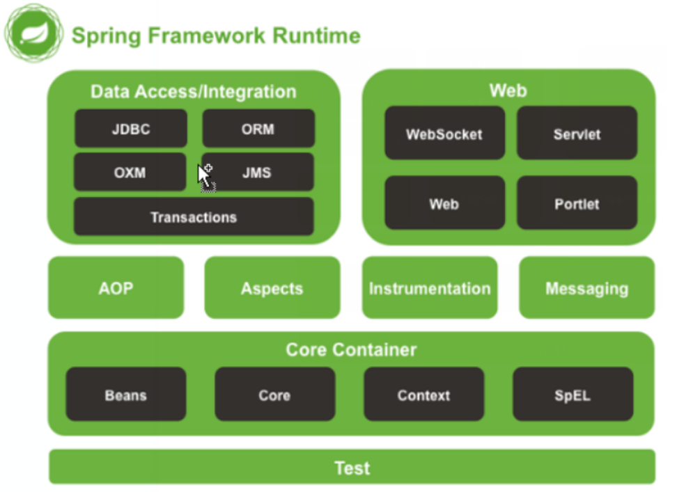


### 7. Spring入门

* 开发步骤

  * ①引入Spring相关依赖
    * spring-beans、spring-core、spring-context、spring-expression
  * ②编写spring-core.xml
  * ③代码测试
    * 初始化Spring容器

* ①引入Spring相关依赖

  ```xml
  <properties>
      <spring.version>5.3.13</spring.version>
  </properties>
  
  <dependencies>
      
      <!--spring start-->
      <dependency>
          <groupId>org.springframework</groupId>
          <artifactId>spring-core</artifactId>
          <version>${spring.version}</version>
      </dependency>
      <dependency>
          <groupId>org.springframework</groupId>
          <artifactId>spring-beans</artifactId>
          <version>${spring.version}</version>
      </dependency>
      <dependency>
          <groupId>org.springframework</groupId>
          <artifactId>spring-context</artifactId>
          <version>${spring.version}</version>
      </dependency>
      <dependency>
          <groupId>org.springframework</groupId>
          <artifactId>spring-expression</artifactId>
          <version>${spring.version}</version>
      </dependency>
      <!--spring end-->
      
  </dependencies>
  ```

* ②编写spring-core.xml

  ```xml
  <?xml version="1.0" encoding="UTF-8"?>
  <beans xmlns="http://www.springframework.org/schema/beans"
         xmlns:xsi="http://www.w3.org/2001/XMLSchema-instance"
         xsi:schemaLocation="
         http://www.springframework.org/schema/beans http://www.springframework.org/schema/beans/spring-beans.xsd">
  
      <bean id="user" class="com.atguigu.pojo.User"></bean>
    
  </beans>
  ```

* ③代码测试

  ```java
  public class IOCTest {
  
      @Test
      public void test1(){
          //初始化Spring容器
          ApplicationContext applicationContext = new ClassPathXmlApplicationContext("spring-core.xml");
          User user = (User) applicationContext.getBean("user");
          System.out.println("user = " + user);
      }
      
  }
  ```


### 8. IOC控制反转

* 概述

  * IOC : inversion of control，对资源控制权进行反转	


  * 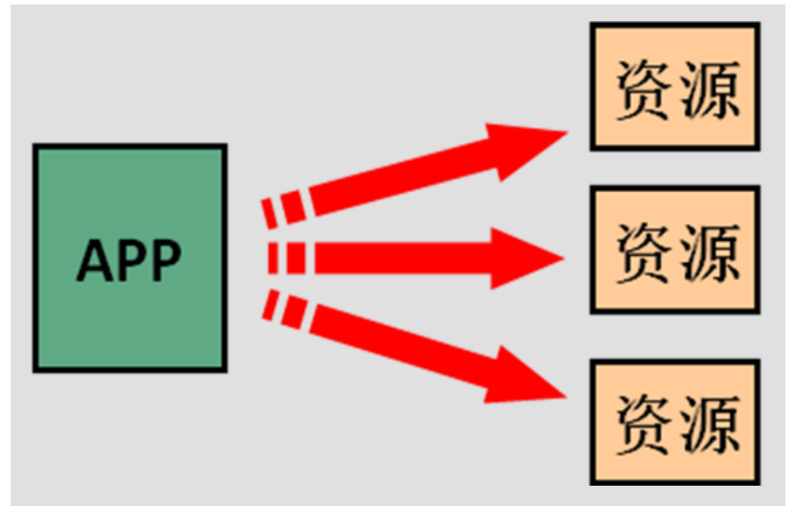

  *  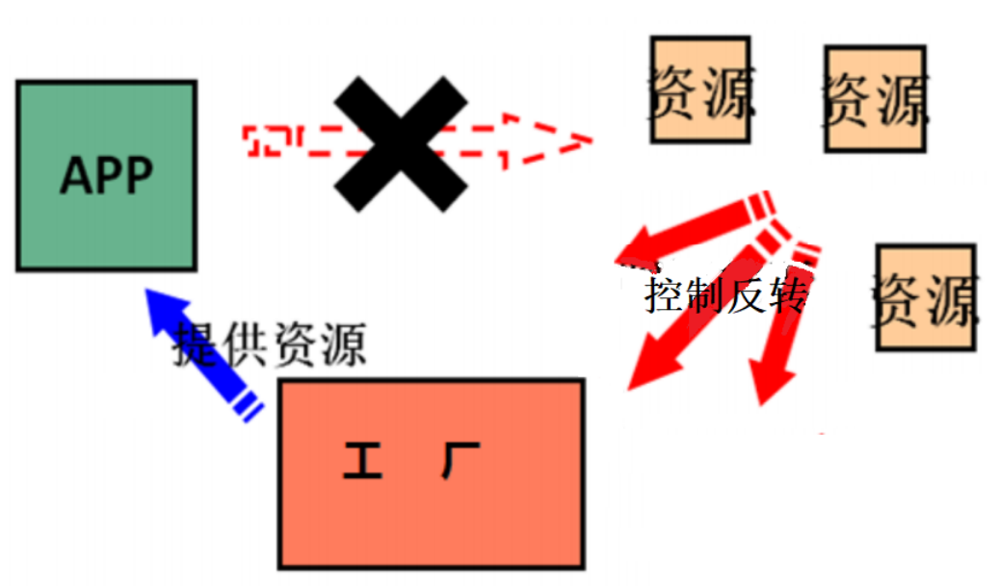


### 9. Spring使用构造器IOC对象

* 概述
  * <bean>标签默认使用类的无参构造器

* 代码实现

  ```xml
  <bean id="user" class="com.atguigu.pojo.User"/>
  ```

* 注意事项

  * 如果类没有无参构造器，报错"NoSuchMethodException: com.atguigu.pojo.User.<init>()"


### 10. Spring使用静态工厂IOC对象

* 代码实现

  ```java
  public class Bean01 {
  
      private String beanName = "a";
  
  }
  ```

  ```java
  public class StaticBeanFactory {
  
      public static Bean01 getBean(){
          return new Bean01();
      }
  
  }
  ```

  ```xml
  <!--Spring使用静态工厂IOC对象--><bean id="bean01"  factory-method="getBean" class="com.atguigu.factory.StaticBeanFactory"></bean>
  ```


### 11. Spring使用实例工厂IOC对象

* 代码实现

  ```java
  public class Bean02 {
  
      private String beanName = "bean02";
  
  }
  ```

  ```java
  public class DynamicBeanFactory {
      public Bean02 getBean(){
          return new Bean02();
      }
  }
  ```

  ```xml
  <!--Spring使用实例工厂IOC对象--><bean id="bean02" factory-method="getBean" factory-bean="dynamicBeanFactory"></bean><bean id="dynamicBeanFactory" class="com.atguigu.factory.DynamicBeanFactory"></bean>
  ```


### 12. FactoryBean机制

* 概述
  * 类似于静态工厂IOC对象，
  * FactoryBean是Spring提供的一种整合第三方框架的常用机制。和普通的bean不同，配置 一个FactoryBean类型的bean，在获取bean的时候得到的并不是class属性中配置的这个类 的对象，而是getObject()方法的返回值。通过这种机制，Spring可以帮我们把复杂组件创 建的详细过程和繁琐细节都屏蔽起来，只把最简洁的使用界面展示给我们。
  * Spring整合MyBatis就会使用到FactoryBean机制。


* 开发步骤

  * ①定义类实现FactoryBean接口
    * 重写方法
  * ②将定义类IOC到Spring容器

* ①定义类实现FactoryBean接口

  ```java
  public class Bean03FactoryBean implements FactoryBean<Bean03> {
      public Bean03 getObject() throws Exception {
          return new Bean03();
      }
  
      public Class<?> getObjectType() {
          return Bean03.class;
      }
  
      public boolean isSingleton() {
          return true;
      }
  }
  ```

* ②将定义类IOC到Spring容器

  ```xml
  <!--FactoryBean机制-->
  <bean id="bean03" class="com.atguigu.factorybean.Bean03FactoryBean"></bean>
  ```


### 13. bean标签的属性

* 语法

  ```xml
  <bean id="bean唯一标识" name="bean别名" class="bean全限定类名"></bean>
  ```

* 代码实现

  ```xml
  <!--bean标签的属性-->
  <bean id="user2" name="myUser,myUser2,myUser3" class="com.atguigu.pojo.User"></bean>
  ```

  ```java
  @Test
  public void test5(){
      ApplicationContext applicationContext = new ClassPathXmlApplicationContext("spring-core.xml");
      Object myUser3 = applicationContext.getBean("myUser3");
      System.out.println("myUser3 = " + myUser3);
  }
  ```


### 14. Spring团队开发

* 概述

  * 在开发中，Spring的配置文件会有很多个，比如：spring-core.xml、spring-mvc.xml、spring-security.xml等等

* ①Spring容器初始化时加载多个xml配置文件

  ```xml
  <?xml version="1.0" encoding="UTF-8"?>
  <beans xmlns="http://www.springframework.org/schema/beans"
         xmlns:xsi="http://www.w3.org/2001/XMLSchema-instance"
         xsi:schemaLocation="http://www.springframework.org/schema/beans http://www.springframework.org/schema/beans/spring-beans.xsd">
  
      <!--团队开发-->
      <bean id="user1" class="com.atguigu.pojo.User"></bean>
  
  </beans>
  ```

  ```xml
  <?xml version="1.0" encoding="UTF-8"?>
  <beans xmlns="http://www.springframework.org/schema/beans"
         xmlns:xsi="http://www.w3.org/2001/XMLSchema-instance"
         xsi:schemaLocation="http://www.springframework.org/schema/beans http://www.springframework.org/schema/beans/spring-beans.xsd">
      <!--团队开发-->
      <bean id="user2" class="com.atguigu.pojo.User"></bean>
  
  </beans>
  ```

  ```java
  /**
   * ①Spring团队开发
   *  Spring容器初始化时加载多个xml配置文件
   */
  @Test
  public void test6(){
      ApplicationContext applicationContext = new ClassPathXmlApplicationContext("spring1.xml","spring2.xml");
      Object user1 = applicationContext.getBean("user1");
      System.out.println("user1 = " + user1);
      Object user2 = applicationContext.getBean("user2");
      System.out.println("user2 = " + user2);
  
  }
  ```

* ②在主配置文件中import其他的配置文件（推荐）

  ```xml
  <?xml version="1.0" encoding="UTF-8"?>
  <beans xmlns="http://www.springframework.org/schema/beans"
         xmlns:xsi="http://www.w3.org/2001/XMLSchema-instance"
         xsi:schemaLocation="http://www.springframework.org/schema/beans http://www.springframework.org/schema/beans/spring-beans.xsd">
  
      <!--团队开发-->
      <bean id="user1" class="com.atguigu.pojo.User"></bean>
  
      <import resource="spring2.xml"></import>
  
  
  </beans>
  ```

  ```xml
  <?xml version="1.0" encoding="UTF-8"?>
  <beans xmlns="http://www.springframework.org/schema/beans"
         xmlns:xsi="http://www.w3.org/2001/XMLSchema-instance"
         xsi:schemaLocation="http://www.springframework.org/schema/beans http://www.springframework.org/schema/beans/spring-beans.xsd">
      <!--团队开发-->
      <bean id="user2" class="com.atguigu.pojo.User"></bean>
  
  </beans>
  ```

  ```java
  /**
   * ②Spring团队开发
   *  在主配置文件中import其他的配置文件
   */
  @Test
  public void test7(){
      ApplicationContext applicationContext = new ClassPathXmlApplicationContext("spring1.xml");
      Object user1 = applicationContext.getBean("user1");
      System.out.println("user1 = " + user1);
      Object user2 = applicationContext.getBean("user2");
      System.out.println("user2 = " + user2);
      Object user3 = applicationContext.getBean("user3");
      System.out.println("user3 = " + user3);
  }
  ```

* 注意事项

  * 如果在不同的spring配置文件中有相同的bean，遵守后配置后加载的覆盖原则。


### 15. Spring引入logback

* 常见日志框架

  * jul : jdk自带的日志功能
  * log4j : 由Ceki Gulcu创立，后被apache收购
  * lo4j2 : apache收购log4j之后，对log4j的升级
  * logback: Ceki Gulcu看lo4j2不爽，重新搞的日志框架

* 常见日志门面

  * slf4j : 由Ceki Gulcu创立
  * jcl : Jakarta Commons Logging，是Apache提供的一个通用日志API

* 日志级别

  * error > warn > info > debug > trace
  * 比如：日志级别是debug，error、 warn 、 info 、 debug的信息都会打印

* 为什么？

  * ①System.out.println()是线程安全，效率极其低下!!!
  * ②在项目开发阶段，需要将程序的运行信息打印到控制台，在项目生产阶段，不需要将程序的运行信息打印到控制台，所以就需要关闭日志打印
  * ③在项目生产阶段，需要将日志记录到日志文件、数据库中。

* 开发步骤

  * ①引入依赖
    * slf4j、logback
  * ②编写logback.xml
  * ③使用日志记录器

* ①引入依赖

  ```xml
  <!--logback start-->
  <dependency>
      <groupId>org.slf4j</groupId>
      <artifactId>slf4j-api</artifactId>
      <version>1.7.30</version>
  </dependency>
  <dependency>
      <groupId>ch.qos.logback</groupId>
      <artifactId>logback-classic</artifactId>
      <version>1.2.3</version>
  </dependency>
  
  
  <!--logback end-->
  ```

* ②编写logback.xml

  ```xml
  <?xml version="1.0" encoding="UTF-8"?>
  <configuration debug="true">
      <!-- 指定日志输出的位置 -->
      <appender name="STDOUT"
                class="ch.qos.logback.core.ConsoleAppender">
          <encoder>
              <!-- 日志输出的格式 -->
              <!-- 按照顺序分别是：时间、日志级别、线程名称、打印日志的类、日志主体内容、换行 -->
              <pattern>[%d{HH:mm:ss.SSS}] [%-5level] [%thread] [%logger] [%msg]%n</pattern>
          </encoder>
      </appender>
  
      <!-- 设置全局日志级别。日志级别按顺序分别是：DEBUG、INFO、WARN、ERROR -->
      <!-- 指定任何一个日志级别都只打印当前级别和后面级别的日志。 -->
      <root level="info">
          <!-- 指定打印日志的appender，这里通过“STDOUT”引用了前面配置的appender -->
          <appender-ref ref="STDOUT"/>
      </root>
  
      <logger name="com.atguigu.test.LogbackTest">
          <level value="off"/>
      </logger>
  
  
  
  </configuration>
  ```

* ③使用日志记录器

  ```java
  public class LogbackTest {
  
      Logger logger = LoggerFactory.getLogger(LogbackTest.class);
  
      @Test
      public void test1(){
          ApplicationContext applicationContext = new ClassPathXmlApplicationContext("spring-core.xml");
          Object user = applicationContext.getBean("user");
          System.out.println("user = " + user);
          logger.debug("debug ... user : " + user);
          logger.info("info ... user : " + user);
          logger.warn("warn ... user : " + user);
          logger.error("error ... user : " + user);
      }
  }
  ```


### 16. 据类型获取bean场景一

* 需求

  * IOC容器中同类型的bean只有一个
  * IOC容器中同类型的bean有多个

* 代码实现

  ```xml
  <!--根据类型获取bean场景一-->
  <!--同类型的bean只有一个-->
  <bean id="bean04" class="com.atguigu.pojo.Bean04"></bean>
  <!--同类型的bean有多个-->
  <bean id="myBean04" class="com.atguigu.pojo.Bean04"></bean>
  ```

  ```java
  @Test
  public void test8() {
      ApplicationContext applicationContext = new ClassPathXmlApplicationContext("spring-core.xml");
      Bean04 bean = applicationContext.getBean(Bean04.class);
      logger.debug(bean + "");
  }
  ```

* 总结

  * IOC容器中同类型的bean只有一个

    * 正常获取

  * IOC容器中同类型的bean有多个

    ```
    NoUniqueBeanDefinitionException: No qualifying bean of type 'com.atguigu.pojo.Bean04' available: expected single matching bean but found 2: bean04,myBean04
    ```

    * 报错

  


### 17. 根据类型获取bean场景二

* 需求

  * 有一个接口和一个接口的实现子类，将实现子类放入到IOC容器
  * 根据接口类型获取bean
  * 根据实现子类类型获取bean

* 代码实现

  ```xml
  <bean id="userService" class="com.atguigu.service.impl.UserServiceImpl"></bean>
  ```

  ```java
  @Test
  public void test9() {
      ApplicationContext applicationContext = new ClassPathXmlApplicationContext("spring-core.xml");
      //根据接口类型获取bean
      UserService bean = applicationContext.getBean(UserService.class);
      logger.debug(bean + "");
      //根据实现子类类型获取bean
      UserServiceImpl bean2 = applicationContext.getBean(UserServiceImpl.class);
      logger.debug(bean2 + "");
  
  }
  ```

* 总结

  * 根据接口类型获取bean
    * 正常获取
  * 根据实现子类类型获取bean
    * 正常获取


### 18. 根据类型获取bean场景三

* 需求

  * 声明一个接口，接口有多个实现子类，接口所有实现子类都放入IOC容器
  * 根据接口类型获取bean
  * 根据实现子类类型获取bean

* 代码实现

  ```xml
  <bean id="userService1" class="com.atguigu.service.impl.UserServiceImpl"></bean>
  <bean id="userService2" class="com.atguigu.service.impl.UserServiceImpl2"></bean>
  ```

  ```java
  @Test
  public void test10() {
      ApplicationContext applicationContext = new ClassPathXmlApplicationContext("spring-core.xml");
      //根据接口类型获取bean
      UserService bean = (UserService) applicationContext.getBean(UserService.class);
      logger.debug(bean + "");
      //根据实现子类类型获取bean
      UserService bean2 = applicationContext.getBean(UserServiceImpl2.class);
      logger.debug(bean2 + "");
  
  }
  ```

* 总结

  * 根据接口类型获取bean

    ```
    NoUniqueBeanDefinitionException: No qualifying bean of type 'com.atguigu.service.UserService' available: expected single matching bean but found 2: userService1,userService2
    ```

    * 报错

  * 根据实现子类类型获取bean

    * 正常获取


### 19. bean的scope属性

* scope

  * singleton : 默认值，单例
  * prototype : 多例
  * request
  * session

* 代码实现

  ```xml
  <bean id="user" class="com.atguigu.pojo.User" scope="singleton"></bean>
  ```

  ```java
  public class LifeTest {
  
      private ApplicationContext applicationContext = null;
  
      @Before
      public void init() {
          applicationContext = new ClassPathXmlApplicationContext("spring-core2.xml");
      }
  
      @Test
      public void test1() {
          Object user = applicationContext.getBean("user");
          Object user2 = applicationContext.getBean("user");
          System.out.println(user == user2);
      }
  }
  ```


### 20. bean的生命周期监听

* 概述

  * 监听bean对象在Spring容器中的创建和销毁

* scope=singleton

  * 创建：Spring容器初始化就创建
  * 销毁：Spring容器关闭就销毁

* scope=prototype

  * 创建：使用时就创建
  * 销毁：交给JVM的垃圾回收机制

* 代码实现

  ```java
  public class User {
  
      private Integer userId;
      private String userName;
      private String userPwd;
  
  
      public void init(){//监听User对象的创建
          System.out.println("User init");
      }
  
      public void destroy(){//监听User对象的销毁
          System.out.println("User destroy");
      }
  }
  ```

  ```xml
  <bean id="user" class="com.atguigu.pojo.User" scope="prototype" init-method="init" destroy-method="destroy"></bean>
  ```


### 21. bean生命周期

* 生命周期
  * 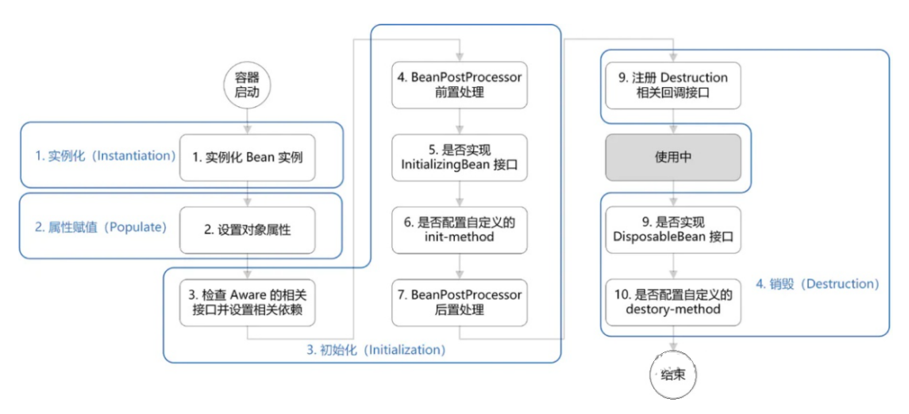

* bean生命周期分为四个阶段：实例化、属性赋值、初始化、销毁


### 22. BeanPostProcessor接口

* 概述

  * 用于在对象初始化之前、初始化之后做一些处理。

* 开发步骤

  * ①自定义类实现BeanPostProcessor接口
    * 重写方法
  * ②编写spring-core.xml
    * 将自定义类IOC到Spring容器

* ①自定义类实现BeanPostProcessor接口

  ```java
  public class MyBeanPostProcessor implements BeanPostProcessor {
  
      public Object postProcessBeforeInitialization(Object bean, String beanName) throws BeansException {//在init之前执行
          if (bean instanceof User) {
              System.out.println("init之前");
          }
          return bean;
      }
  
      public Object postProcessAfterInitialization(Object bean, String beanName) throws BeansException {//在init之后执行
          if (bean instanceof User) {
              System.out.println("init之后");
          }
          return bean;
      }
  }
  ```

* ②编写spring-core.xml

  ```xml
  <bean class="com.atguigu.processor.MyBeanPostProcessor"></bean>
  ```


### 23. bean生命周期练习

* 需求

  * 利用bean生命周期自定义连接池

* 开发步骤

  * ①自定义MyDataSource类
  * ②定义MyDataSourcePostProcessor类
  * ③编写spring-core.xml
  * ④代码测试

* ①自定义MyDataSource类

  ```java
  public class MyDataSource {
  
      public MyDataSource(){
          System.out.println("①MyDataSource实例化");
      }
  
      private LinkedList<Connection> linkedList = new LinkedList<Connection>();
  
      private String driverClassName;//驱动
  
  
      public void setDriverClassName(String driverClassName) {
          System.out.println("②MyDataSource属性赋值");
          this.driverClassName = driverClassName;
      }
  
      private String jdbcUrl ;//数据库连接路径
      private String username;//账户
      private String password;//密码
      private Integer initPoolSize;//初始连接数
  
  
      private void loadDriver() throws ClassNotFoundException {
          Class.forName(driverClassName);
      }
  
  
      /**
       * 容器创建，init
       * @throws ClassNotFoundException
       * @throws SQLException
       */
      public void init() throws ClassNotFoundException, SQLException {
          System.out.println("③②MyDataSource init");
          //加载驱动
          loadDriver();
  
          for (Integer i = 0; i < initPoolSize; i++) {
              Connection connection = DriverManager.getConnection(jdbcUrl, username, password);
              linkedList.add(connection);
          }
      }
  
      public Connection getConnection() {
          return linkedList.removeFirst();
      }
  
      public void destroy(){
          System.out.println("④MyDataSource销毁");
          linkedList.clear();
      }
  
  
  }
  ```

* ②定义MyDataSourcePostProcessor类

  ```java
  public class MyDataSourcePostProcessor implements BeanPostProcessor {
  
      public Object postProcessBeforeInitialization(Object bean, String beanName) throws BeansException {
          if (bean instanceof MyDataSource) {
              System.out.println("③①MyDataSource初始化之前");
              MyDataSource dataSource = (MyDataSource) bean;
              System.out.println("连接池 : " + dataSource.getInitPoolSize());//5
              dataSource.setInitPoolSize(10);
          }
          return bean;
      }
  
      public Object postProcessAfterInitialization(Object bean, String beanName) throws BeansException {
          if (bean instanceof MyDataSource) {
              System.out.println("③③MyDataSource初始化之后");
              MyDataSource dataSource = (MyDataSource) bean;
              System.out.println("连接池 : " + dataSource.getInitPoolSize());//10
          }
          return bean;
      }
  }
  ```

* ③编写spring-core.xml

  ```xml
  <bean id="dataSource" class="com.atguigu.datasource.MyDataSource" init-method="init" destroy-method="destroy">
      <property name="driverClassName" value="com.mysql.jdbc.Driver"></property>
      <property name="jdbcUrl" value="jdbc:mysql://localhost:3306/mydb1"></property>
      <property name="username" value="root"></property>
      <property name="password" value="root"></property>
      <property name="initPoolSize" value="5"></property>
  </bean>
  
  <bean class="com.atguigu.processor.MyDataSourcePostProcessor"></bean>
  ```

* ④代码测试

  ```java
  /**
   * bean生命周期练习
   */
  @Test
  public void test2(){
      MyDataSource dataSource = (MyDataSource) applicationContext.getBean("dataSource");
      Connection connection = dataSource.getConnection();
      try {
          PreparedStatement statement = connection.prepareStatement("select * from tb_user");
          ResultSet resultSet = statement.executeQuery();
          List<User> userList = new ArrayList<User>();
          while (resultSet.next()) {
              User user = new User();
              user.setUserName(resultSet.getString("user_name"));
              userList.add(user);
          }
          System.out.println("userList = " + userList);
      } catch (Exception e) {
          e.printStackTrace();
      }
  
      applicationContext.close();
      System.out.println(dataSource.getLinkedList());
  
  }
  ```


### 24. 依赖注入DI

* 概述
  * dependency injection : 依赖注入
  * 是控制反转IOC的具体体现
* 依赖注入的数据类型
  * 简单类型
  * javabean
  * 集合
* 依赖注入的方式
  * 构造器注入
  * set方法注入
  * 注解注入


### 25. 构造器注入

* 概述

  * 通过<constuctor-arg>标签，使用构造器将IOC容器中的资源设置到java程序中

* 分类

  * ①注入简单类型
  * ②注入javabean

* 代码实现

  ```xml
  <bean id="user" class="com.atguigu.pojo.User">
      <!--注入简单类型-->
      <constructor-arg name="userId" value="1"></constructor-arg>
      <constructor-arg name="userName" value="zhangsan"></constructor-arg>
      <constructor-arg name="userPwd" value="12345"></constructor-arg>
  
      <!--注入javabean-->
      <constructor-arg name="student" ref="student"></constructor-arg>
  </bean>
  
  <bean id="student" class="com.atguigu.pojo.Student">
      <constructor-arg name="stuId" value="1"></constructor-arg>
      <constructor-arg name="stuName" value="学生1"></constructor-arg>
  </bean>
  ```

* 注意事项

  * name="userName"跟构造器的形参名称一致!


### 26. set方法注入

* 概述

  * 通过<property>标签，使用set方法将IOC容器中的资源设置到java程序中

* 代码实现

  ```xml
  <!--set方法注入-->
  <bean id="user2" class="com.atguigu.pojo.User">
      <!--注入简单类型-->
      <property name="userId" value="2"></property>
      <property name="userName" value="lisi"></property>
      <property name="userPwd" value="12345"></property>
  
      <!--注入javabean-->
      <property name="student" ref="student2"></property>
  </bean>
  
  
  <bean id="student2" class="com.atguigu.pojo.Student">
      <constructor-arg name="stuId" value="2"></constructor-arg>
      <constructor-arg name="stuName" value="学生2"></constructor-arg>
  </bean>
  ```

* 注意事项

  * name="userName"跟setUserName方法名有关!


### 27. 容器注入

* 代码实现

  ```java
  public class Bean01 {
  
      private String[] strs;
      private List<String> strList;
      private List<Student> studentList;
      private Set<String> strSet;
      private Map<Integer,String> map;
      private Properties properties;
  }
  ```

  ```xml
  <!--构造器注入-->
  <bean id="user" class="com.atguigu.pojo.User">
      <!--注入简单类型-->
      <constructor-arg name="userId" value="1"></constructor-arg>
      <constructor-arg name="userName" value="zhangsan"></constructor-arg>
      <constructor-arg name="userPwd" value="12345"></constructor-arg>
  
      <!--注入javabean-->
      <constructor-arg name="student" ref="student"></constructor-arg>
  </bean>
  
  <bean id="student" class="com.atguigu.pojo.Student">
      <constructor-arg name="stuId" value="1"></constructor-arg>
      <constructor-arg name="stuName" value="学生1"></constructor-arg>
  </bean>
  
  
  <!--set方法注入-->
  <bean id="user2" class="com.atguigu.pojo.User">
      <!--注入简单类型-->
      <property name="userId" value="2"></property>
      <property name="userName" value="lisi"></property>
      <property name="userPwd" value="12345"></property>
  
      <!--注入javabean-->
      <property name="student" ref="student2"></property>
  </bean>
  
  
  <bean id="student2" class="com.atguigu.pojo.Student">
      <constructor-arg name="stuId" value="2"></constructor-arg>
      <constructor-arg name="stuName" value="学生2"></constructor-arg>
  </bean>
  
  <!--容器注入-->
  <bean id="bean01" class="com.atguigu.pojo.Bean01">
      <property name="strs">
          <array>
              <value>a</value>
              <value>b</value>
              <value>c</value>
          </array>
      </property>
  
      <property name="strList">
          <list>
              <value>a</value>
              <value>b</value>
              <value>c</value>
          </list>
      </property>
  
      <property name="studentList">
          <list>
              <bean id="myStu1" class="com.atguigu.pojo.Student"></bean>
              <bean id="myStu2" class="com.atguigu.pojo.Student"></bean>
              <ref bean="student"></ref>
              <ref bean="student2"></ref>
          </list>
      </property>
  
      <property name="strSet">
          <set>
              <value>a</value>
              <value>b</value>
              <value>c</value>
          </set>
      </property>
  
      <property name="map">
          <map>
              <entry key="1" value="a"></entry>
              <entry key="2" value="b"></entry>
              <entry key="3" value="c"></entry>
          </map>
      </property>
  
      <property name="properties">
          <props>
              <prop key="1">a</prop>
              <prop key="2">b</prop>
              <prop key="3">c</prop>
          </props>
      </property>
  
  </bean>
  ```


### 28. p命名空间注入

* 概述

  * 为了简化依赖注入操作。

* 语法

  ```xml
  <bean 
        p:propertyName="值"
        p:propertyName-ref="beanId"></bean>
  ```

* 代码实现

  ```xml
  <bean   id="user3"
          class="com.atguigu.pojo.User"
          p:userId="3"
          p:userName="阿磊"
          p:userPwd="250"
          p:student-ref="student3">
  </bean>
  
  <bean id="student3"
        class="com.atguigu.pojo.Student"
        p:stuId="31"
        p:stuName="阿三">
  </bean>
  ```


### 29. ApplicationContext层次结构

* 层次结构
  * 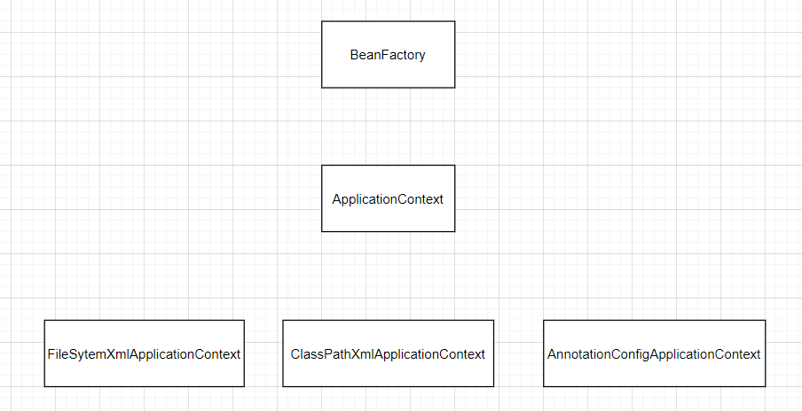


### 30. BeanFactory和ApplicationContext的区别

* BeanFactory

  * 提供最基础的IOC功能
  * 使用bean时才初始化

* ApplicationContext

  * 除了有最基础的IOC功能以外，还有AOP、事务管理、JDBCTemplate...
  * 容器初始化bean就初始化

* 代码实现

  ```java
  public class ApplicationContextTest {
  
      @Test
      public void test1(){
          //ApplicationContext : IOC容器初始化，bean就初始化
          //ApplicationContext applicationContext = new ClassPathXmlApplicationContext("spring-core.xml");
          //BeanFactory : IOC容器初始化，bean不初始化，在使用bean时才初始化
          BeanFactory beanFactory = new XmlBeanFactory(new ClassPathResource("spring-core.xml"));
          beanFactory.getBean("user");
      }
  
  }
  ```


### 31. ApplicationContext的三个实现类

* ClassPathXmlApplicationContext

  * 根据类路径下的xml配置文件加载Spring容器

* FileSystemXmlApplicationContext

  * 根据系统磁盘路径下的xml配置文件加载Spring容器

* AnnotationConfigApplicationContext

  * 在纯注解开发中，根据配置类加载Spring容器

* 代码实现

  ```java
  @Test
  public void test2(){
      ApplicationContext applicationContext = new FileSystemXmlApplicationContext("C:\\Users\\qiuzhiwei\\Desktop\\spring-core.xml");
      Object user = applicationContext.getBean("user");
      System.out.println("user = " + user);
  }
  ```


### 32. Spring操作数据库

* 需求

  * Spring 整合 DbUtils，查询用户列表

* 开发步骤

  * ①引入相关依赖
  * ②编写UserController
  * ③定义UserService及其实现子类
  * ④定义UserDao及其实现子类
  * ⑤编写spring-core.xml

* ①引入相关依赖

  ```xml
  <properties>
      <maven.compiler.source>8</maven.compiler.source>
      <maven.compiler.target>8</maven.compiler.target>
      <junit.version>4.13.2</junit.version>
      <lombok.version>1.18.22</lombok.version>
      <spring.version>5.3.13</spring.version>
      <dbutils.version>1.7</dbutils.version>
      <druid.version>1.2.8</druid.version>
      <mysql.version>5.1.48</mysql.version>
  </properties>
  
  <dependencies>
  
      <!--junit start-->
      <dependency>
          <groupId>junit</groupId>
          <artifactId>junit</artifactId>
          <version>${junit.version}</version>
          <scope>test</scope>
      </dependency>
      <!--junit end-->
  
      <!--lombok start-->
      <dependency>
          <groupId>org.projectlombok</groupId>
          <artifactId>lombok</artifactId>
          <version>${lombok.version}</version>
      </dependency>
      <!--lombok end-->
  
      <!--spring start-->
      <dependency>
          <groupId>org.springframework</groupId>
          <artifactId>spring-core</artifactId>
          <version>${spring.version}</version>
      </dependency>
      <dependency>
          <groupId>org.springframework</groupId>
          <artifactId>spring-beans</artifactId>
          <version>${spring.version}</version>
      </dependency>
      <dependency>
          <groupId>org.springframework</groupId>
          <artifactId>spring-context</artifactId>
          <version>${spring.version}</version>
      </dependency>
      <dependency>
          <groupId>org.springframework</groupId>
          <artifactId>spring-expression</artifactId>
          <version>${spring.version}</version>
      </dependency>
      <!--spring end-->
  
  
      <!--jdbc start-->
      <dependency>
          <groupId>commons-dbutils</groupId>
          <artifactId>commons-dbutils</artifactId>
          <version>${dbutils.version}</version>
      </dependency>
      <dependency>
          <groupId>com.alibaba</groupId>
          <artifactId>druid</artifactId>
          <version>${druid.version}</version>
      </dependency>
      <dependency>
          <groupId>mysql</groupId>
          <artifactId>mysql-connector-java</artifactId>
          <version>${mysql.version}</version>
      </dependency>
      <!--jdbc end-->
  
  
  </dependencies>
  ```

* ②编写UserController

  ```java
  public class UserController {
  
      public static void main(String[] args) throws Exception {
          ApplicationContext applicationContext = new ClassPathXmlApplicationContext("spring-core.xml");
          UserService userService = applicationContext.getBean(UserService.class);
          List<User> userList = userService.selectUserList();
          System.out.println("userList = " + userList);
      }
  
  }
  ```

* ③定义UserService及其实现子类

  ```java
  public class UserServiceImpl implements UserService {
  
      private UserDao userDao;
  
      public void setUserDao(UserDao userDao) {
          this.userDao = userDao;
      }
  
      @Override
      public List<User> selectUserList() throws Exception {
  
          return userDao.selectUserList();
      }
  }
  ```

* ④定义UserDao及其实现子类

  ```java
  public class UserDaoImpl implements UserDao {
  
      private QueryRunner queryRunner;
  
      public void setQueryRunner(QueryRunner queryRunner) {
          this.queryRunner = queryRunner;
      }
  
      @Override
      public List<User> selectUserList() throws Exception {
          return queryRunner.query(
                  "select user_id userId,user_name userName, user_pwd userPwd from tb_user",
                  new BeanListHandler<>(User.class)
          );
      }
  }
  ```

* ⑤编写spring-core.xml

  ```xml
  <!--5.1,将UserServiceImpl对象放入到Spring容器，userDao成员变量进行注入-->
  <bean id="userService" class="com.atguigu.service.impl.UserServiceImpl">
      <property name="userDao" ref="userDao"></property>
  </bean>
  
  
  <!--5.2,将UserDaoImpl对象放入到Spring容器，queryRunner成员变量进行注入-->
  <bean id="userDao" class="com.atguigu.dao.impl.UserDaoImpl">
      <property name="queryRunner" ref="queryRunner"></property>
  </bean>
  
  <!--5.3,将QueryRunner对象放入到Spring容器，ds成员变量进行注入-->
  <bean id="queryRunner" class="org.apache.commons.dbutils.QueryRunner">
      <constructor-arg name="ds" ref="dataSource"></constructor-arg>
  </bean>
  
  
  <!--5.4,将DruidDataSource对象放入到Spring容器，四个成员变量driverClassName、url、username、password进行注入-->
  <bean id="dataSource" class="com.alibaba.druid.pool.DruidDataSource">
      <property name="driverClassName" value="com.mysql.jdbc.Driver"></property>
      <property name="url" value="jdbc:mysql://localhost:3306/mydb1"></property>
      <property name="username" value="root"></property>
      <property name="password" value="root"></property>
  </bean>
  ```


### 33. IOC注解说明

* 说明
  * 学习基于注解的 IoC 配置，大家脑海里首先得有一个认知，即注解配置和 xml 配置要实现 的功能都是一样 的，都是要降低程序间的耦合。只是配置的形式不一样。
  * 关于实际的开发中到底使用xml还是注解，每家公司有着不同的使用习惯。所以这两种配置 方式我们都需要掌 握。


### 34. 注解创建对象

* 开发步骤

  * ①扫描注解
  * ②使用@Controller、@Service、@Repository、@Component
  * ③代码测试

* ①扫描注解

  ```xml
  <?xml version="1.0" encoding="UTF-8"?>
  <beans xmlns="http://www.springframework.org/schema/beans"
         xmlns:context="http://www.springframework.org/schema/context"
         xmlns:xsi="http://www.w3.org/2001/XMLSchema-instance"
         xsi:schemaLocation="
         http://www.springframework.org/schema/beans
         http://www.springframework.org/schema/beans/spring-beans.xsd
         http://www.springframework.org/schema/context
         http://www.springframework.org/schema/context/spring-context.xsd">
  
      <!--扫描注解-->
      <context:component-scan base-package="com.atguigu"></context:component-scan>
  
  </beans>
  ```

* ②使用@Controller、@Service、@Repository、@Component

  ```java
  @Controller("userController")
  public class UserController {
  
      public void selectUserList(){
          System.out.println("UserController selectUserList");
      }
  }
  ```

  ```java
  @Service("userService")
  public class UserServiceImpl implements UserService {
      @Override
      public void selectUserList() throws Exception {
          System.out.println("UserServiceImpl selectUserList");
      }
  }
  ```

  ```java
  @Repository("userDao")
  public class UserDaompl implements UserDao {
      @Override
      public void selectUserList() throws Exception {
          System.out.println("UserDaompl selectUserList");
      }
  }
  ```

  ```java
  @Component("user")
  @Data
  @NoArgsConstructor
  @AllArgsConstructor
  public class User {
  
      private Integer userId;
      private String userName;
      private String userPwd;
  
  }
  ```

* ③代码测试

  ```java
  public class AnnotationTest {
  
      private ApplicationContext applicationContext ;
  
      @Before
      public void init(){
          applicationContext = new ClassPathXmlApplicationContext("spring-core.xml");
      }
  
      @Test
      public void test1() throws Exception {
  
          UserController userController = (UserController) applicationContext.getBean("userController");
          userController.selectUserList();
  
          UserService userService = (UserService) applicationContext.getBean("userService");
          userService.selectUserList();
  
          UserDao userDao = (UserDao) applicationContext.getBean("userDao");
          userDao.selectUserList();
  
          User user = (User) applicationContext.getBean("user");
          System.out.println("user = " + user);
      }
  
  }
  ```

* 注意事项

  * @Controller、@Service、@Repository就是@Component


### 35. 扫描详解

* 方式

  * ①基本扫描
  * ②排除扫描
    * 排除@Controller
  * ③包含扫描
    * 只扫描@Controller

* ①基本扫描

  ```xml
  <context:component-scan base-package="com.atguigu"></context:component-scan>
  ```

* ②排除扫描

  ```xml
  <context:component-scan base-package="com.atguigu">
      <context:exclude-filter type="annotation" expression="org.springframework.stereotype.Controller"/>
  </context:component-scan>
  ```

* ③包含扫描

  ```xml
  <context:component-scan base-package="com.atguigu" use-default-filters="false">
      <context:include-filter type="annotation" expression="org.springframework.stereotype.Controller"/>
  </context:component-scan>
  ```

* 适用场景

  * 聚合项目中不同模块负责扫描不同的注解。


### 36. 依赖注入之@Autowired

* 概述

  * 相当于： <property name="" value="">
  * 先按照类型进行注入，再按照beanid进行注入

* 工作流程

  * 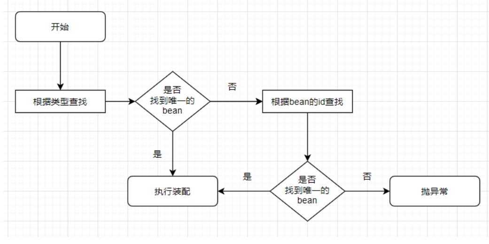

* 代码实现

  ```java
  @Controller("userController")
  public class UserController {
  
  
      @Autowired
      private UserService userService2;
  
      public void selectUserList() throws Exception {
          System.out.println("UserController selectUserList");
          userService2.selectUserList();
      }
  }
  ```

  ```java
  @Service("userService1")
  public class UserServiceImpl implements UserService {
      @Override
      public void selectUserList() throws Exception {
          System.out.println("UserServiceImpl selectUserList");
      }
  }
  ```

  ```java
  @Service("userService2")
  public class UserServiceImpl2 implements UserService {
      @Override
      public void selectUserList() throws Exception {
          System.out.println("UserServiceImpl2 selectUserList");
      }
  }
  ```

* 注意事项

  * @Autowired不需要set方法


### 37. 依赖注入之@Qualifier

* 概述

  * 配合@Autowired适用，按照beanid进行注入

* 代码实现

  ```java
  @Controller("userController")
  public class UserController {
  
  
      @Autowired
      @Qualifier("userService2")
      private UserService userService;
  
      public void selectUserList() throws Exception {
          System.out.println("UserController selectUserList");
          userService.selectUserList();
      }
  
  
      public void selectUserList2() throws Exception {
          System.out.println("UserController selectUserList");
          userService.selectUserList();
      }
  }
  ```


### 38. @Autowired的其他细节

* 概述

  * @Autowired不仅仅可以作用在成员变量，也可以作用在构造器、set方法等

* ①标记在构造器

  ```java
  @Component
  public class UserServiceWrapper {
  
  
  
      private UserService userService;
  
  
      @Autowired
      public UserServiceWrapper(UserService userService2) {
          this.userService = userService1;
      }
  
  
      public UserService getUserService() {
          return userService;
      }
  }
  ```

* ②标记在set方法

  ```java
  @Component
  public class UserServiceWrapper {
  
  
  
      private UserService userService;
  
  
      @Autowired//将Spring容器中的UserService类型的bean注入到形参userService上
      @Qualifier("userService2")
      public void setUserService(UserService userService){
          this.userService = userService;
      }
  
      public UserService getUserService() {
          return userService;
      }
  }
  ```

* ③佛系装配 : 一般情况下，如果装配失败抛出异常，设置佛系后，装配失败就拉到!!

  ```java
  @Controller("userController")
  public class UserController {
  
  
      @Autowired(required = false)//佛系装配
      @Qualifier("userService3")
      private UserService userService = null;
  
      public void selectUserList() throws Exception {
          System.out.println("UserController selectUserList");
          userService.selectUserList();
      }
  
  }
  ```


### 39. 依赖注入之@Resource

* 概述

  * 相当于：  <property name="" value="">
  * JSR-250提供的，它是Java标准，绝大部分框架都支持。

* 代码实现

  ```java
  @Controller("userController")
  public class UserController {
  
      //①同时指定了name和type，查找name和type唯一匹配的bean
      //@Resource(name = "userService2",type = UserServiceImpl2.class)
      //②指定name，查找name唯一匹配的bean
      //@Resource(name = "userService2")
      //③指定type，查找type唯一匹配的bean
      //@Resource(type = UserServiceImpl2.class)
      //④既没有指定name，也没有指定type。先按照name查找，再按照type查找
      @Resource
      private UserServiceImpl userService;
  
      public void selectUserList() throws Exception {
          System.out.println("UserController selectUserList");
          userService.selectUserList();
      }
  
  }
  ```


### 40. 依赖注入之@Value

* 概述

  * 给简单类型注入值
  * 读取properties配置文件中的值并注入

* 代码实现

  ```java
  @Component("user")
  public class User {
  
      @Value("1")
      private Integer userId ;
      @Value("浩浩")
      private String userName;
      @Value("haohao")
      private String userPwd;
  
  }
  ```


### 41. 注解整合junit

* 代码实现

  ```java
  @RunWith(SpringJUnit4ClassRunner.class)
  @ContextConfiguration(locations = "classpath:spring-core.xml")
  public class UserServiceTest {
  
      private ApplicationContext applicationContext ;
  
      @Autowired
      @Qualifier("userService2")
      private UserService userService;
  
      @Test
      public void test1() throws Exception {
          userService.selectUserList();
  
      }
  
  }
  ```


### 42. Spring新注解说明

* @Configuration
  * 用于指定当前类是一个 spring 配置类;
  * 相当于spring.xml配置文件。
* @ComponentScan
  * 用于扫描注解；
  * 相当于<context:component-scan base-package="xxx">标签
* @Bean
  * 该注解只能写在方法上，表明使用方法创建一个对象，并且放入 spring 容器;
  * 相当于<bean id="xxx" class="xxx">标签
* @PropertySource
  * 用于加载properties文件;
  * 相当于<context:property-placeholder location="xxx.properties">标签
* @Import
  * 用于导入其他配置类;
  * 相当于<import resource="xxx.xml">标签


### 43. Spring纯注解开发

* 开发步骤

  * ①定义service层及其实现子类
  * ②定义dao层及其实现子类
  * ③定义MySpringCoreConfiguration
  * ④定义MySpringDaoConfiguration
  * ⑤代码测试

* ①定义service层及其实现子类

  ```java
  @Service
  public class UserServiceImpl implements UserService {
  
  
      @Autowired
      private UserDao userDao;
  
  
      @Override
      public List<User> selectUserList() throws Exception {
          return userDao.selectUserList();
      }
  }
  ```

* ②定义dao层及其实现子类

  ```java
  @Repository
  public class UserDaoImpl implements UserDao {
  
      @Autowired
      private QueryRunner queryRunner;
  
      @Override
      public List<User> selectUserList() throws Exception {
          return queryRunner.query(
                  "select user_id userId,user_name userName, user_pwd userPwd from tb_user",
                  new BeanListHandler<>(User.class)
          );
      }
  }
  ```

* ③定义MySpringCoreConfiguration

  ```java
  @Configuration
  @ComponentScan("com.atguigu")//扫描注解
  @Import(MySpringDaoConfiguration.class)
  public class MySpringCoreConfiguration {
  
  
  
  }
  ```

* ④定义MySpringDaoConfiguration

  ```java
  @Configuration
  @PropertySource("jdbc.properties")
  public class MySpringDaoConfiguration {
  
  
      @Value("${driverClassName}")
      private String driverClassName ;
  
      @Value("${url}")
      private String url ;
  
      @Value("${user}")
      private String user ;
  
      @Value("${password}")
      private String password ;
  
      @Bean
      public QueryRunner getQueryRunner(DataSource ds){
          return new QueryRunner(ds);
      }
  
      @Bean
      public DataSource getDataSource(){
          DruidDataSource dataSource = new DruidDataSource();
          dataSource.setDriverClassName(driverClassName);
          dataSource.setUrl(url);
          dataSource.setUsername(user);
          dataSource.setPassword(password);
          return dataSource;
      }
  
  }
  ```

* ⑤代码测试

  ```java
  public class UserController {
  
  
      public static void main(String[] args) throws Exception {
          ApplicationContext applicationContext = new AnnotationConfigApplicationContext(MySpringCoreConfiguration.class);
          UserService userService = applicationContext.getBean(UserService.class);
          List<User> userList = userService.selectUserList();
          System.out.println("userList = " + userList);
      }
  
  }
  ```

  ```java
  @RunWith(SpringJUnit4ClassRunner.class)
  @ContextConfiguration(classes = MySpringCoreConfiguration.class)
  public class UserServiceTest {
  
  
      @Autowired
      private UserService userService ;
  
      @Test
      public void selectUserList() throws Exception {
          List<User> userList = userService.selectUserList();
          System.out.println("userList = " + userList);
      }
  
  
  }
  ```


### 44. 注解开发的作用和弊端

* 总结
  * 自定义类使用注解来处理
  * 第三方类使用XML来处理


### 45. AOP概述

* 概述
  * AOP : aspect oritented programing : 面向切面编程
  * AOP关注的是程序中的共性功能，开发时，将共性功能抽取出来制作成独立的功能模块，此 时原始功能中将不具有这些被抽取出的共性功能代码。在被抽取的共性功能的模块运行时 候，将共性功能模块也运行，即可完成原始的功能。
* 作用
  * 在程序运行期间，不修改源码对已有方法进行增强。
* 好处
  * 减少重复代码
  * 提供程序效率
  * 方便项目维护


### 46. AOP原理环境搭建

* 代码实现

  ```java
  public class UserServiceImpl implements UserService {
      @Override
      public void addUser() {
          System.out.println("权限校验");
          System.out.println("UserServiceImpl addUser");
          System.out.println("日志记录");
      }
  
      @Override
      public void deleteUser() {
          System.out.println("权限校验");
          System.out.println("UserServiceImpl deleteUser");
          System.out.println("日志记录");
      }
  
      @Override
      public void updateUser() {
          System.out.println("UserServiceImpl updateUser");
      }
  
      @Override
      public void selectUserList() {
          System.out.println("UserServiceImpl selectUserList");
      }
  }
  ```

* 存在问题

  * 将主要功能和辅助功能写到一块，不方便程序维护，增加程序的耦合性；
  * 不满足单一职责原则。


### 47. 动态代理JDKProxy

* 概述

  * 基于接口的代理类实现方案

* 开发步骤

  * ①定义UserServiceJDKProxy工具类
    * 获取代理类对象
  * ②代码测试

* ①定义UserServiceJDKProxy工具类

  ```java
  public class UserServiceJDKProxy {
  
  
      /**
       * 获取UserService(被代理类)对象的代理类对象
       *
       * @param userService : 被代理类对象
       * @return
       */
      public static UserService createUserServiceJDKProxy(UserService userService) {
          UserService proxy = (UserService) Proxy.newProxyInstance(
                  userService.getClass().getClassLoader(),//被代理类的类加载器
                  userService.getClass().getInterfaces(),//被代理类实现的所有接口
                  new InvocationHandler() {//执行增强 (执行被代理类的方法)
                      @Override
                      public Object invoke(Object proxy, Method method, Object[] args) throws Throwable {
                          //Object proxy: 代理类对象
                          // Method method:被代理类的原始方法
                          // Object[] args:方法的实际参数
                          Object result = null;
                          if ("addUser".equals(method.getName()) || "deleteUser".equals(method.getName())) {
                              System.out.println("权限校验");
                              //执行被代理类的原始方法
                              result = method.invoke(userService, args);
                              System.out.println("日志记录");
                          } else {
                              result = method.invoke(userService, args);
                          }
                          return result;
                      }
                  }
          );
  
          return proxy;
      }
  
  
  }
  ```

  ```java
  public class UserServiceImpl implements UserService {
      @Override
      public void addUser() {
          System.out.println("UserServiceImpl addUser");
      }
  
      @Override
      public void deleteUser() {
          System.out.println("UserServiceImpl deleteUser");
      }
  
      @Override
      public void updateUser() {
          System.out.println("UserServiceImpl updateUser");
      }
  
      @Override
      public void selectUserList() {
          System.out.println("UserServiceImpl selectUserList");
      }
  }
  ```

* ②代码测试

  ```java
  public class UserServiceJDKProxyTest {
  
      @Test
      public void createUserServiceJDKProxy() {
          //被代理类对象
          UserService userService = new UserServiceImpl();
          //获取代理类对象
          UserService userServiceJDKProxy = UserServiceJDKProxy.createUserServiceJDKProxy(userService);
          userServiceJDKProxy.addUser();
          userServiceJDKProxy.deleteUser();
          userServiceJDKProxy.updateUser();
          userServiceJDKProxy.selectUserList();
  
      }
  }
  ```

* 存在问题

  * 必须要有接口!!!


### 48. 动态代理CGLIB

* 概述

  * 不限定是否具有接口，可以对任意操作进行增强 
  * 不需要原始被代理对象，动态创建新的代理对象

* 工作流程

  * 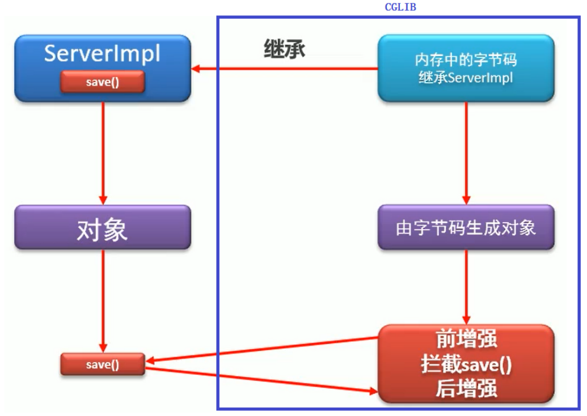

* 开发步骤

  * ①定义UserServiceCGLIBProxy类
    * 获取代理类对象
  * ②代码测试

* ①定义UserServiceCGLIBProxy类

  ```java
  /**
   * 获取UserService代理类对象
   */
  public class UserServiceCGLIBProxy {
  
      /**
       * 获取代理类对象
       *
       * @param clazz : 被代理类的字节码对象
       * @return
       */
      public static UserService createUserServiceCGLIBProxy(Class clazz) {
          Enhancer enhancer = new Enhancer();
          //被代理类是代理类的父类
          enhancer.setSuperclass(clazz);
          //增强方法
          enhancer.setCallback(new MethodInterceptor() {//拦截被代理类的原始方法
              @Override
              public Object intercept(Object o, Method method, Object[] args, MethodProxy methodProxy) throws Throwable {
                  //Object o: 代理类对象
                  // Method method: 被代理类的原始方法
                  // Object[] args: 方法的实际参数
                  // MethodProxy methodProxy: 代理类的方法
  
                  //执行被代理类对象的原始方法
                  //Object result = method.invoke(o, args);//死路一条
                  //Object result = methodProxy.invoke(o, args);//死路二条
                  Object result = null;
                  if ("addUser".equals(method.getName()) || "deleteUser".equals(method.getName())) {
                      System.out.println("权限校验");
                      result = methodProxy.invokeSuper(o, args);//活路一条
                      System.out.println("日志记录");
                  } else {
                      result = methodProxy.invokeSuper(o, args);
                  }
                  return result;
              }
          });
          return (UserService) enhancer.create();
      }
  
  }
  ```

* ②代码测试

  ```java
  public class UserServiceCGLIBProxyTest {
  
      @Test
      public void createUserServiceCGLIBProxy() {
  
          UserService userService = UserServiceCGLIBProxy.createUserServiceCGLIBProxy(UserServiceImpl.class);
          userService.addUser();
          userService.deleteUser();
          userService.updateUser();
          userService.selectUserList();
  
      }
  }
  ```


### 49. AOP名词解释

* 连接点 : join point
  * 被代理类中的所有方法
* 切入点: pointcut
  * 被代理类中的具有共性功能的方法
* 通知: advice
  * 将共性功能抽取成独立的方法
* 切面：aspect
  * 通知和切入点的关系，比如：前置关系、后置关系、环绕关系等等
* 目标对象类
  * 包含切入点方法的类
* 织入
  * 将共性功能(通知)加入到原始方法(切入点)执行的过程


### 50. AOP入门案例

* 开发步骤

  * ①引入相关依赖
    * spring-core、spring-beans、spring-context、spring-expression、spring-jcl、spring-aop、spring-aspects等等
  * ②制作目标对象类
  * ③制作通知类
  * ④编写spring-core.xml
    * 配置切面
  * ⑤代码测试

* ①引入相关依赖

  ```xml
  <properties>
      <maven.compiler.source>8</maven.compiler.source>
      <maven.compiler.target>8</maven.compiler.target>
      <junit.version>4.13.2</junit.version>
      <lombok.version>1.18.22</lombok.version>
      <spring.version>5.3.13</spring.version>
      <dbutils.version>1.7</dbutils.version>
      <druid.version>1.2.8</druid.version>
      <mysql.version>5.1.48</mysql.version>
  </properties>
  
  <dependencies>
  
      <!--junit start-->
      <dependency>
          <groupId>junit</groupId>
          <artifactId>junit</artifactId>
          <version>${junit.version}</version>
          <scope>test</scope>
      </dependency>
      <!--junit end-->
  
      <!--lombok start-->
      <dependency>
          <groupId>org.projectlombok</groupId>
          <artifactId>lombok</artifactId>
          <version>${lombok.version}</version>
      </dependency>
      <!--lombok end-->
  
      <!--spring start-->
      <dependency>
          <groupId>org.springframework</groupId>
          <artifactId>spring-core</artifactId>
          <version>${spring.version}</version>
      </dependency>
      <dependency>
          <groupId>org.springframework</groupId>
          <artifactId>spring-beans</artifactId>
          <version>${spring.version}</version>
      </dependency>
      <dependency>
          <groupId>org.springframework</groupId>
          <artifactId>spring-context</artifactId>
          <version>${spring.version}</version>
      </dependency>
      <dependency>
          <groupId>org.springframework</groupId>
          <artifactId>spring-expression</artifactId>
          <version>${spring.version}</version>
      </dependency>
  
      <dependency>
          <groupId>org.springframework</groupId>
          <artifactId>spring-test</artifactId>
          <version>${spring.version}</version>
      </dependency>
  
      <dependency>
          <groupId>org.springframework</groupId>
          <artifactId>spring-jcl</artifactId>
          <version>${spring.version}</version>
      </dependency>
  
      <dependency>
          <groupId>org.springframework</groupId>
          <artifactId>spring-aop</artifactId>
          <version>${spring.version}</version>
      </dependency>
  
      <dependency>
          <groupId>org.springframework</groupId>
          <artifactId>spring-aspects</artifactId>
          <version>${spring.version}</version>
      </dependency>
  
      <dependency>
          <groupId>org.aspectj</groupId>
          <artifactId>aspectjweaver</artifactId>
          <version>1.9.7</version>
      </dependency>
  
      <dependency>
          <groupId>aopalliance</groupId>
          <artifactId>aopalliance</artifactId>
          <version>1.0</version>
      </dependency>
      <!--spring end-->
  
  
      <!--jdbc start-->
      <dependency>
          <groupId>commons-dbutils</groupId>
          <artifactId>commons-dbutils</artifactId>
          <version>${dbutils.version}</version>
      </dependency>
      <dependency>
          <groupId>com.alibaba</groupId>
          <artifactId>druid</artifactId>
          <version>${druid.version}</version>
      </dependency>
      <dependency>
          <groupId>mysql</groupId>
          <artifactId>mysql-connector-java</artifactId>
          <version>${mysql.version}</version>
      </dependency>
      <!--jdbc end-->
  
  
  </dependencies>
  ```

* ②制作目标对象类

  ```java
  public class UserServiceImpl implements UserService {
      @Override
      public void addUser() {//切入点
          System.out.println("UserServiceImpl addUser");
      }
  
      @Override
      public void deleteUser() {//切入点
          System.out.println("UserServiceImpl deleteUser");
      }
  
      @Override
      public void updateUser() {//连接点
          System.out.println("UserServiceImpl updateUser");
      }
  
      @Override
      public void selectUserList() {//连接点
          System.out.println("UserServiceImpl selectUserList");
      }
  }
  ```

* ③制作通知类

  ```java
  /**
   * 通知类
   */
  @Component
  public class MyAdvice01 {
  
      /**
       * 通知
       */
      public void checkPermission(){
          System.out.println("权限校验");
      }
  
      /**
       * 通知
       */
      public void printLog(){
          System.out.println("日志记录");
      }
  
  }
  ```

* ④编写spring-core.xml

  ```xml
  <?xml version="1.0" encoding="UTF-8"?>
  <beans xmlns="http://www.springframework.org/schema/beans"
         xmlns:xsi="http://www.w3.org/2001/XMLSchema-instance"
         xmlns:context="http://www.springframework.org/schema/context"
         xmlns:aop="http://www.springframework.org/schema/aop"
         xsi:schemaLocation="
         http://www.springframework.org/schema/beans http://www.springframework.org/schema/beans/spring-beans.xsd
         http://www.springframework.org/schema/context https://www.springframework.org/schema/context/spring-context.xsd
         http://www.springframework.org/schema/aop https://www.springframework.org/schema/aop/spring-aop.xsd">
  
      <!--扫描注解-->
      <context:component-scan base-package="com.atguigu"></context:component-scan>
  
      <!--配置切面 : 通知和切入点关系-->
      <aop:config>
          <aop:aspect ref="myAdvice01">
              <!--前置通知-->
              <aop:before method="checkPermission" pointcut="execution(public void com.atguigu.service.impl.UserServiceImpl.addUser())"></aop:before>
              <!--后置通知-->
              <aop:after method="printLog" pointcut="execution(public void com.atguigu.service.impl.UserServiceImpl.addUser())"></aop:after>
          </aop:aspect>
      </aop:config>
  
  </beans>
  ```

* ⑤代码测试

  ```java
  @RunWith(SpringJUnit4ClassRunner.class)
  @ContextConfiguration(locations = "classpath:spring-core.xml")
  public class UserServiceImplTest {
  
      @Autowired
      private UserService userService;
  
      @Test
      public void addUser() {
          userService.addUser();
      }
  
      @Test
      public void deleteUser() {
          userService.deleteUser();
      }
  
      @Test
      public void updateUser() {
          userService.updateUser();
      }
  
      @Test
      public void selectUserList() {
          userService.selectUserList();
  
      }
  }
  ```


### 51. 切入点表达式

* 语法

  ```java
  execution(权限修饰符 返回值类型 包名.类名.方法名(形参类型1,形参类型2...))
  
  execution(public void com.atguigu.service.impl.UserServiceImpl.addUser(int))
  
  -- 权限修饰符可以省略
  execution( void com.atguigu.service.impl.UserServiceImpl.addUser(int))
  
  -- 不限定返回值类型
  execution( * com.atguigu.service.impl.UserServiceImpl.addUser(int))
  
  -- 不限定包
  execution( * *..UserServiceImpl.addUser(int))
  
  -- 不限定类
  execution( * *..*ServiceImpl.addUser(int))
  
  -- 不限定方法名
  execution( * *..*ServiceImpl.*(int))
  
  -- 不限定方法参数
  execution( * *..*ServiceImpl.*(..))
  ```

  * 权限修饰符可以省略 

  * '*'代表任意包名、任意类名、任意方法名、任意参数类型 

  * '.'代表任意一个包下 

  * '..'代表任意一个或多个包、任意一个或多个参数（类型任意）


### 52. 切入点表达式抽取

* 代码实现

  ```xml
  <aop:config>
      <aop:aspect ref="myAdvice01">
          <aop:pointcut id="p1" expression="execution( * *..*ServiceImpl.*(..))"/>
          <!--前置通知-->
          <aop:before method="checkPermission" pointcut-ref="p1"></aop:before>
          <!--后置通知-->
          <aop:after method="printLog" pointcut-ref="p1"></aop:after>
      </aop:aspect>
  </aop:config>
  ```

  ```xml
  <aop:config>
      <aop:pointcut id="p1" expression="execution( * *..*ServiceImpl.*(..))"/>
      <aop:aspect ref="myAdvice01">
          <!--后置通知-->
          <aop:after method="printLog" pointcut-ref="p1"></aop:after>
      </aop:aspect>
      <aop:aspect ref="myAdvice01">
          <!--前置通知-->
          <aop:before method="checkPermission" pointcut-ref="p1"></aop:before>
          <!--后置通知-->
      </aop:aspect>
  </aop:config>
  ```

  ```xml
  <aop:config>
      <aop:aspect ref="myAdvice01">
          <!--前置通知-->
          <aop:before method="checkPermission"
                      pointcut="execution( * *..*ServiceImpl.*(..))"></aop:before>
          <!--后置通知-->
          <aop:after method="printLog"
                     pointcut="execution( * *..*ServiceImpl.*(..))"></aop:after>
      </aop:aspect>
  </aop:config>
  ```

  


### 53. 通知类别

* 通知类别

  | 通知类别        | 说明                                                   |
  | --------------- | ------------------------------------------------------ |
  | before          | 前置通知，在切入点之前执行                             |
  | after-returning | 正常后置通知，在切入点之后执行，切入点没有异常才执行   |
  | after-throwing  | 异常后置通知，在切入点之后执行，切入点有异常才执行     |
  | after           | 后置通知，在切入点之后执行，切入点不管是否有异常都执行 |
  | around          | 环绕通知，在切入点之前执行，在切入点之后执行           |

* 代码实现

  ```java
  /**
   * 通知类别
   */
  @Component
  public class MyAdvice02 {
  
  
      /**
       * 前置通知  ok
       */
      public void before(){
          System.out.println("MyAdvice02 before");
      }
  
      /**
       * 正常后置通知
       */
      public void afterReturning(){
          System.out.println("MyAdvice02 afterReturning");
      }
  
  
      /**
       * 异常后置通知 ok
       */
      public void afterThrowing(){
          System.out.println("MyAdvice02 afterThrowing");
      }
  
  
      /**
       * 后置通知 ok
       */
      public void after(){
          System.out.println("MyAdvice02 after");
      }
  
  
      /**
       * 环绕通知 ok
       */
      public void around(ProceedingJoinPoint pjp){
          System.out.println("MyAdvice02 around之前");
  
          //执行切入点
          try {
              pjp.proceed();
          } catch (Throwable e) {
              e.printStackTrace();
              throw new RuntimeException(e);
          }
  
          System.out.println("MyAdvice02 around之后");
  
      }
  
  }
  ```

  ```xml
  <aop:config>
      
      <aop:aspect ref="myAdvice02">
          <aop:pointcut id="p1" expression="execution(* *..*Service.*(..))"/>
  
          <aop:before method="before" pointcut-ref="p1"></aop:before>
  
          <aop:after-returning method="afterReturning" pointcut-ref="p1"></aop:after-returning>
  
          <aop:after-throwing method="afterThrowing" pointcut-ref="p1"></aop:after-throwing>
  
          <aop:after method="after" pointcut-ref="p1"></aop:after>
  
          <aop:around method="around" pointcut-ref="p1"></aop:around>
      </aop:aspect>
      
  </aop:config>
  ```


### 54. around通知模拟其他通知

* 代码实现

  ```java
  @Component
  public class MyAdvice03 {
  
      /**
       * 前置通知
       */
      public void around2Before(ProceedingJoinPoint pjp){
          System.out.println("MyAdvice03 before");
          try {
              pjp.proceed();
          } catch (Throwable e) {
              e.printStackTrace();
          }
      }
  
  
      /**
       * 正常后置通知
       * @param pjp
       */
      public void around2AfterReturning(ProceedingJoinPoint pjp){
          try {
              pjp.proceed();
              //1
              System.out.println("MyAdvice03 afterReturning");
          } catch (Throwable e) {
              e.printStackTrace();
              //2
          }
          //3
  
      }
  
  
      /**
       * 异常后置通知
       * @param pjp
       */
      public void around2AfterThrowing(ProceedingJoinPoint pjp){
          try {
              pjp.proceed();
              //1
          } catch (Throwable e) {
              e.printStackTrace();
              //2
              System.out.println("MyAdvice03 afterThrowing");
              throw new RuntimeException(e);
          }
          //3
  
      }
  
  
      /**
       * 后置通知
       * @param pjp
       */
      public void around2After(ProceedingJoinPoint pjp){
          try {
              pjp.proceed();
              //1
          } catch (Throwable e) {
              e.printStackTrace();
              //2
              throw new RuntimeException(e);
          } finally {
              //3
              System.out.println("MyAdvice03 after");
          }
  
      }
  
  }
  ```


### 55. 通知获取切入点输入参数

* 分类

  * ①around通知获取切入点输入参数
  * ②非around通知获取切入点输入参数

* 代码实现

  ```java
  @Component
  public class MyAdvice04 {
  
  
      /**
       * ①around通知获取切入点输入参数
       */
      public void around(ProceedingJoinPoint pjp) {
          Object[] args = pjp.getArgs();
          System.out.println(Arrays.toString(args));
          try {
              pjp.proceed();
          } catch (Throwable e) {
              e.printStackTrace();
          }
      }
  
  
  
      /**
       * ②非around通知获取切入点输入参数
       * @param jp
       */
      public void before(JoinPoint jp){
          Object[] args = jp.getArgs();
          System.out.println(Arrays.toString(args));
  
      }
  }
  ```


### 56. 通知获取切入点返回值

* 概述

  * before :  无法获取
  * after-returning : 可以获取
  * after-throwing : 无法获取
  * after : 无法获取
  * around : 可以获取

* 代码实现

  ```java
  @Component
  public class MyAdvice05 {
  
  
      public void afterReturning(String result){
          System.out.println("MyAdvice05 afterReturning result : " + result);
      }
  
      public Object around(ProceedingJoinPoint pjp){
          System.out.println("MyAdvice05 around之前");
          try {
              Object result = pjp.proceed();
              System.out.println("MyAdvice05 around result = " + result);
              return result;
          } catch (Throwable e) {
              e.printStackTrace();
          }
          System.out.println("MyAdvice05 around之后");
          return null;
      }
  
  }
  ```

  ```xml
  <aop:config>
      <aop:aspect ref="myAdvice05">
          <aop:pointcut id="p1" expression="execution(* *..*Service.*(..))"/>
  
          <aop:around method="around" pointcut-ref="p1"></aop:around>
          <aop:after-returning method="afterReturning" pointcut-ref="p1" returning="result"></aop:after-returning>
  
      </aop:aspect>
  
  </aop:config>
  ```


### 57. 通知获取切入点异常

* 概述

  * before :  无法获取
  * after-returning : 无法获取
  * after-throwing : 可以获取
  * after : 无法获取
  * around : 可以获取

* 代码实现

  ```java
  @Component
  public class MyAdvice06 {
  
      public void afterThrowing(Exception e){
          System.out.println("MyAdvice05 afterThrowing exception : " + e);
      }
  
      public void around(ProceedingJoinPoint pjp){
          System.out.println("MyAdvice06 around之前");
          try {
              pjp.proceed();
          } catch (Throwable e) {
              e.printStackTrace();
              System.out.println("MyAdvice06 around exception : " + e);
              throw new RuntimeException(e);
          }
          System.out.println("MyAdvice06 around之后");
  
      }
  
  }
  ```

  ```xml
  <aop:config>
      <aop:aspect ref="myAdvice06">
          <aop:pointcut id="p1" expression="execution(* *..*Service.*(..))"/>
  
          <aop:around method="around" pointcut-ref="p1"></aop:around>
          <aop:after-throwing method="afterThrowing" pointcut-ref="p1" throwing="e"></aop:after-throwing>
      </aop:aspect>
  
  </aop:config>
  ```


### 58. AOP注解开发

* 开发步骤

  * ①开启支持AOP注解
  * ②制作目标对象类
  * ③制作通知类
    * 使用AOP注解

* ①开启支持AOP注解

  ```xml
  <?xml version="1.0" encoding="UTF-8"?>
  <beans xmlns="http://www.springframework.org/schema/beans"
         xmlns:xsi="http://www.w3.org/2001/XMLSchema-instance"
         xmlns:context="http://www.springframework.org/schema/context"
         xmlns:aop="http://www.springframework.org/schema/aop"
         xsi:schemaLocation="
         http://www.springframework.org/schema/aop http://www.springframework.org/schema/aop/spring-aop.xsd
         http://www.springframework.org/schema/beans http://www.springframework.org/schema/beans/spring-beans.xsd
         http://www.springframework.org/schema/context https://www.springframework.org/schema/context/spring-context.xsd">
      <context:component-scan base-package="com.atguigu"></context:component-scan>
      <!--开启AOP注解支持-->
      <aop:aspectj-autoproxy></aop:aspectj-autoproxy>
  </beans>
  ```

* ②制作目标对象类

  ```java
  @Service
  public class UserServiceImpl implements UserService {
      @Override
      public void addUser() throws Exception {
          System.out.println("UserServiceImpl addUser");
          System.out.println(1 / 0);
      }
  
      @Override
      public void deleteUser() throws Exception {
          System.out.println("UserServiceImpl deleteUser");
      }
  }
  ```

* ③制作通知类

  ```java
  @Aspect
  @Component
  public class MyAdvice01 {
  
  
      @Before("execution(* *..*Service.addUser())")
      public void before(){
          System.out.println("MyAdvice01 before");
      }
  
      @AfterReturning("execution(* *..*Service.addUser())")
      public void afterReturning(){
          System.out.println("MyAdvice01 afterReturning");
      }
  
      @AfterThrowing("execution(* *..*Service.addUser())")
      public void afterThrowing(){
          System.out.println("MyAdvice01 afterThrowing");
      }
  
      @After("execution(* *..*Service.addUser())")
      public void after(){
          System.out.println("MyAdvice01 after");
      }
  
      @Around("execution(* *..*Service.addUser())")
      public void around(ProceedingJoinPoint pjp){
          System.out.println("MyAdvice01 around之前");
          try {
              pjp.proceed();
          } catch (Throwable e) {
              e.printStackTrace();
          }
          System.out.println("MyAdvice01 around之后");
  
      }
  
  }
  ```

  


### 59. AOP注解获取切入点输入参数

* 分类

  * around通知获取
  * 非around通知获取

* 代码实现

  ```java
  @Aspect
  @Component
  public class MyAdvice02 {
  
      @Around("execution(* *..*Service.*(..))")
      public void around(ProceedingJoinPoint pjp) {
          Object[] args = pjp.getArgs();
          System.out.println("MyAdvice02 around" + Arrays.toString(args));
          try {
              pjp.proceed();
          } catch (Throwable e) {
              e.printStackTrace();
          }
      }
  
  
      @Before("execution(* *..*Service.*(..))")
      public void before(JoinPoint jp){
          Object[] args = jp.getArgs();
          System.out.println("MyAdvice02 before" + Arrays.toString(args));
      }
  
  }
  ```


### 60. AOP注解获取切入点返回值

* 概述

  * after-returning、around可以获取切入点返回值

* 代码实现

  ```java
  @Aspect
  @Component
  public class MyAdvice03 {
  
      @Around("execution(* *..*Service.*(..))")
      public Object around(ProceedingJoinPoint pjp) {
          try {
              Object result = pjp.proceed();
              System.out.println("MyAdvice03 around " + result);
              return result;
          } catch (Throwable e) {
              e.printStackTrace();
          }
          return null;
      }
  
      @AfterReturning(value = "execution(* *..*Service.*(..))",returning = "result")
      public void afterReturning(Object result){
          System.out.println("MyAdvice03 afterReturning " + result);
      }
  
  
  }
  ```

  


### 61. AOP注解获取切入点异常

* 概述

  * after-throwing、around可以获取切入点的异常

* 代码实现

  ```java
  @Aspect
  @Component
  public class MyAdvice04 {
  
      @Around("execution(* *..*Service.*(..))")
      public void around(ProceedingJoinPoint pjp) {
          try {
              pjp.proceed();
          } catch (Throwable e) {
              e.printStackTrace();
              System.out.println("MyAdvice04 around " + e);
              throw new RuntimeException(e);
          }
      }
  
      @AfterThrowing(value = "execution(* *..*Service.*(..))" , throwing = "e")
      public void afterThrowing(Exception e){
          System.out.println("MyAdvice04 afterThrowing " + e);
      }
  
  }
  ```


### 62. AOP对根据类型获取bean的影响场景一

* 需求

  * 声明一个接口，接口有一个实现子类 
  * 创建一个通知类，对上面接口的实现子类应用通知 
  * 根据接口类型获取bean 
  * 根据实现子类类型获取bean

* 总结

  * 根据接口类型获取bean
    * 正常获取
  * 根据实现子类类型获取bean
    * 报错，BeanNotOfRequiredTypeException: Bean named 'userServiceImpl' is expected to be of type 'com.atguigu.service.impl.UserServiceImpl' but was actually of type 'com.sun.proxy.$Proxy20'

  


### 63. AOP对根据类型获取bean的影响场景二

* 需求

  * 声明一个类
  * 创建一个通知类，对上面的类应用通知
  * 根据这个类的类型获取bean

* 代码实现

  ```java
  @Service
  public class UserServiceImpl2  {
      public String addUser(int num) throws Exception {
          System.out.println("UserServiceImpl2 addUser " + num);
          //System.out.println(1 / 0);
          return "helloworld";
      }
  
      public void deleteUser() throws Exception {
          System.out.println("UserServiceImpl2 deleteUser");
      }
  }
  ```

  ```java
  @Aspect
  @Component
  public class MyAdvice06 {
  
      @Before("execution(* *..UserServiceImpl2.*(..))")
      public void before(){
          System.out.println("MyAdvice06 before");
      }
  
  }
  ```

  ```java
  @RunWith(SpringJUnit4ClassRunner.class)
  @ContextConfiguration(locations = "classpath:spring-core.xml")
  public class UserServiceImpl2Test {
  
      @Autowired
      private UserServiceImpl2 userServiceImpl2;
  
      @Test
      public void addUser() throws Exception {
          userServiceImpl2.addUser(250);
      }
  
      @Test
      public void deleteUser() {
      }
  }
  ```

* 总结

  * 根据这个类的类型获取bean
    * 正常获取


### 64. AOP对根据类型获取bean的影响总结

* 有接口

  * 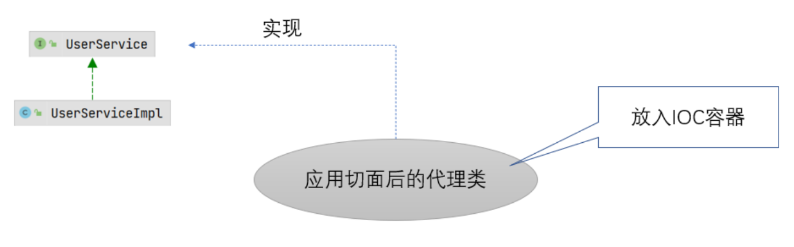

  * 使用JDKProxy，放入到Spring容器中的是代理类对象，而代理类实现于UserService接口，和被代理类UserServiceImpl之间没有直接关系

* 没接口

  * 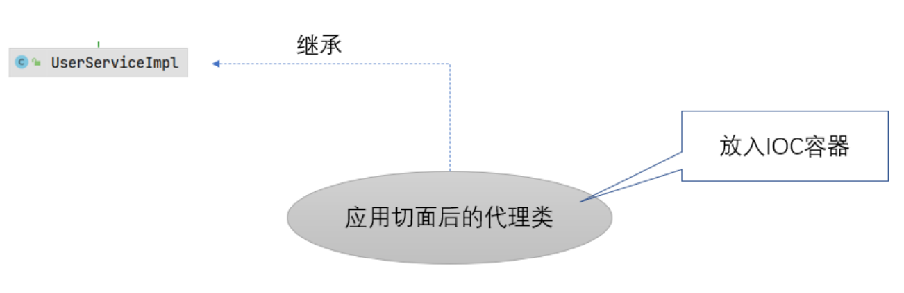

  * 使用CGLIB，放入到Spring容器中的是代理类对象，而代理类继承于UserServiceImpl(被代理类)，也就是说，代理类和被代理类之间是继承关系


### 65. JdbcTemplate模板类使用

* 开发步骤

  * ①引入相关依赖
    * spring-jdbc
  * ②定义dao接口及其实现子类
  * ③编写spring-core.xml
    * 将JdbcTemplate对象放入Spring容器
  * ④代码测试

* ①引入相关依赖

  ```xml
  <properties>
      <maven.compiler.source>8</maven.compiler.source>
      <maven.compiler.target>8</maven.compiler.target>
      <junit.version>4.13.2</junit.version>
      <lombok.version>1.18.22</lombok.version>
      <spring.version>5.3.13</spring.version>
      <dbutils.version>1.7</dbutils.version>
      <druid.version>1.2.8</druid.version>
      <mysql.version>5.1.48</mysql.version>
  </properties>
  
  <dependencies>
  
      <!--junit start-->
      <dependency>
          <groupId>junit</groupId>
          <artifactId>junit</artifactId>
          <version>${junit.version}</version>
          <scope>test</scope>
      </dependency>
      <!--junit end-->
  
      <!--lombok start-->
      <dependency>
          <groupId>org.projectlombok</groupId>
          <artifactId>lombok</artifactId>
          <version>${lombok.version}</version>
      </dependency>
      <!--lombok end-->
  
      <!--spring start-->
      <dependency>
          <groupId>org.springframework</groupId>
          <artifactId>spring-core</artifactId>
          <version>${spring.version}</version>
      </dependency>
      <dependency>
          <groupId>org.springframework</groupId>
          <artifactId>spring-beans</artifactId>
          <version>${spring.version}</version>
      </dependency>
      <dependency>
          <groupId>org.springframework</groupId>
          <artifactId>spring-context</artifactId>
          <version>${spring.version}</version>
      </dependency>
      <dependency>
          <groupId>org.springframework</groupId>
          <artifactId>spring-expression</artifactId>
          <version>${spring.version}</version>
      </dependency>
  
      <dependency>
          <groupId>org.springframework</groupId>
          <artifactId>spring-test</artifactId>
          <version>${spring.version}</version>
      </dependency>
  
      <dependency>
          <groupId>org.springframework</groupId>
          <artifactId>spring-jcl</artifactId>
          <version>${spring.version}</version>
      </dependency>
  
      <dependency>
          <groupId>org.springframework</groupId>
          <artifactId>spring-aop</artifactId>
          <version>${spring.version}</version>
      </dependency>
  
      <dependency>
          <groupId>org.springframework</groupId>
          <artifactId>spring-aspects</artifactId>
          <version>${spring.version}</version>
      </dependency>
  
      <dependency>
          <groupId>org.aspectj</groupId>
          <artifactId>aspectjweaver</artifactId>
          <version>1.9.7</version>
      </dependency>
  
      <dependency>
          <groupId>aopalliance</groupId>
          <artifactId>aopalliance</artifactId>
          <version>1.0</version>
      </dependency>
      <dependency>
          <groupId>org.springframework</groupId>
          <artifactId>spring-jdbc</artifactId>
          <version>${spring.version}</version>
      </dependency>
      <!--spring end-->
  
      <!--jdbc start-->
      <dependency>
          <groupId>com.alibaba</groupId>
          <artifactId>druid</artifactId>
          <version>${druid.version}</version>
      </dependency>
      <dependency>
          <groupId>mysql</groupId>
          <artifactId>mysql-connector-java</artifactId>
          <version>${mysql.version}</version>
      </dependency>
      <!--jdbc end-->
  
  </dependencies>
  ```

* ②定义dao接口及其实现子类

  ```java
  @Repository
  public class UserDaoImpl implements UserDao {
  
      @Autowired
      private JdbcTemplate jdbcTemplate;
  
      @Override
      public void addUser(User inputUser) throws Exception {
          jdbcTemplate.update(
                  "insert into tb_user values(null,?,?,?)",
                  inputUser.getUserName(),
                  inputUser.getUserPwd(),
                  inputUser.getMoney()
          );
      }
  
      @Override
      public void deleteUser(Integer userId) throws Exception {
          jdbcTemplate.update(
                  "delete from tb_user where user_id = ?",
                  userId
          );
      }
  
      @Override
      public void updateUser(User inputUser) throws Exception {
          jdbcTemplate.update(
                  "update tb_user set user_name = ? , user_pwd = ? , money = ? where user_id = ?",
                  inputUser.getUserName(),
                  inputUser.getUserPwd(),
                  inputUser.getMoney(),
                  inputUser.getUserId()
          );
      }
  
      @Override
      public User selectUserById(Integer userId) throws Exception {
          String sql = "select * from tb_user where user_id = ?";
          RowMapper<? extends User> rowMapper = new RowMapper<User>() {
              @Override
              public User mapRow(ResultSet resultSet, int i) throws SQLException {
                  User user = new User();
                  user.setUserId(resultSet.getInt("user_id"));
                  user.setUserName(resultSet.getString("user_name"));
                  user.setUserPwd(resultSet.getString("user_pwd"));
                  user.setMoney(resultSet.getDouble("money"));
                  return user;
              }
          };
          return jdbcTemplate.queryForObject(
                  sql,
                  rowMapper,
                  userId
          );
      }
  
      @Override
      public List<User> selectUserList() throws Exception {
          return jdbcTemplate.query(
                  "select user_id userId,user_name userName , user_pwd userPwd ,money money from tb_user",
                  new BeanPropertyRowMapper<>(User.class)
          );
      }
  }
  ```

* ③编写spring-core.xml

  ```xml
  <?xml version="1.0" encoding="UTF-8"?>
  <beans xmlns="http://www.springframework.org/schema/beans"
         xmlns:xsi="http://www.w3.org/2001/XMLSchema-instance"
         xmlns:context="http://www.springframework.org/schema/context"
         xmlns:aop="http://www.springframework.org/schema/aop"
         xsi:schemaLocation="
         http://www.springframework.org/schema/aop http://www.springframework.org/schema/aop/spring-aop.xsd
         http://www.springframework.org/schema/beans http://www.springframework.org/schema/beans/spring-beans.xsd
         http://www.springframework.org/schema/context https://www.springframework.org/schema/context/spring-context.xsd">
  
  
      <context:component-scan base-package="com.atguigu"></context:component-scan>
  
      <bean id="jdbcTemplate" class="org.springframework.jdbc.core.JdbcTemplate">
          <property name="dataSource" ref="dataSource"></property>
      </bean>
      <context:property-placeholder location="jdbc.properties"></context:property-placeholder>
      <bean id="dataSource" class="com.alibaba.druid.pool.DruidDataSource">
          <property name="driverClassName" value="${driverClass}"></property>
          <property name="url" value="${url}"></property>
          <property name="username" value="${user}"></property>
          <property name="password" value="${password}"></property>
      </bean>
  
  </beans>
  ```

* ④代码测试

  ```java
  @RunWith(SpringJUnit4ClassRunner.class)
  @ContextConfiguration(locations = "classpath:spring-core.xml")
  public class UserDaoTest {
  
      @Autowired
      private UserDao userDao;
  
      @Test
      public void addUser() throws Exception {
          userDao.addUser(new User(1,"zhangsan","zhangsan",10000.0));
      }
  
      @Test
      public void deleteUser() {
      }
  
      @Test
      public void updateUser() {
      }
  
      @Test
      public void selectUserById() throws Exception {
          User user = userDao.selectUserById(52);
          System.out.println("user = " + user);
      }
  
      @Test
      public void selectUserList() throws Exception {
          List<User> userList = userDao.selectUserList();
          System.out.println("userList = " + userList);
      }
  }
  ```


### 66. Spring事务概念

* 分类
  * 编程式事务(难点)
    * 使用PlatformTransactionManager
    * 开发人员自己写java代码实现事务管理，是Spring事务管理原理
  * 声明式事务
    * XML配置声明
    * 注解配置声明
* 核心类
  * PlatformTransactionManager : 事务管理类
  * TransactionDefinition : 事务信息配置类
  * TransactionStatus : 事务状态类


### 67. PlatformTransactionManager接口概述

* 概述
  * 提供常用的操作事务的方法
* 常用方法
  * getTransaction : 开启事务
  * commit : 提交事务
  * rollback : 回滚事务
* 实现子类
  * DataSourceTransactionManager : 适用于Spring JDBC或mybatis
  * HibernateTransactionManager : 适用于hibernate
  * JpaTransactionManager : 适用于Spring Data JPA


### 68. TransactionDefinition接口概述

* 概述
  * 此接口定义了事务的属性(隔离级别、传播行为、超时、只读性)
* 常用方法
  * 设置/获取隔离级别
    * getIsolationLevel/setIsolationLevel
  * 设置/获取传播行为
    * getPropagationBehavior/setPropagationBehavior
  * 设置/获取只读性
    *  setReadOnly/isReadOnly
  * 设置/获取超时
    *  setTimeout/getTimeout
* 继承结构
  * DefaultTransactionDefinition


### 69. TransactionStatus接口概述

* 概述
  * 封装了事务的状态信息(是否是一个新的事务、是否已经结束等等)
* 继承结构
  * DefaultTransactionStatus


### 70. Spring事务管理环境搭建

* 需求

  * 转账业务(zhangsan向lisi转账100元)

* 开发步骤

  * ①定义service及其实现子类
  * ②定义dao及其实现子类
  * ③代码测试

* ①定义service及其实现子类

  ```java
  @Service
  public class UserServiceImpl implements UserService {
  
      @Autowired
      private UserDao userDao;
  
  
      @Override
      public void transfer(String outName, String inName, Double money) throws Exception {
          //出账
          userDao.outMoney(outName, money);
  
          System.out.println(1 / 0);
  
          //入账
          userDao.inMoney(inName, money);
      }
  }
  ```

* ②定义dao及其实现子类

  ```java
  @Repository
  public class UserDaoImpl implements UserDao {
  
      @Autowired
      private JdbcTemplate jdbcTemplate;
  
  
      @Override
      public void outMoney(String outName, Double money) throws Exception {
          jdbcTemplate.update(
                  "update tb_user set money = money - ? where user_name = ?",
                  money,
                  outName
          );
      }
  
      @Override
      public void inMoney(String inName, Double money) throws Exception {
          jdbcTemplate.update(
                  "update tb_user set money = money + ? where user_name = ?",
                  money,
                  inName
          );
      }
  }
  ```

* ③代码测试

  ```java
  @RunWith(SpringJUnit4ClassRunner.class)
  @ContextConfiguration(locations = "classpath:spring-core.xml")
  public class UserServiceTest {
  
      @Autowired
      private UserServiceImpl userService;
  
      @Test
      public void transfer() throws Exception {
          userService.transfer("zhangsan", "lisi", 100.0);
      }
  }
  ```


### 71. Spring编程式事务基础版

* 概述

  * 使用DataSourceTransactionManager进行事务管理

* 开发步骤

  * ①编写spring-core.xml
    * 1.1,将DataSourceTransactionManager对象放入到Spring容器
      * 注入dataSource
    * 1.2,将DefaultTransactionDefinition对象放入到Spring容器，设定了两种不同的事务策略
  * ②改造UserServiceImpl代码
    * 引入事务管理

* ①编写spring-core.xml

  ```xml
  <?xml version="1.0" encoding="UTF-8"?>
  <beans xmlns="http://www.springframework.org/schema/beans"
         xmlns:xsi="http://www.w3.org/2001/XMLSchema-instance"
         xmlns:context="http://www.springframework.org/schema/context"
         xmlns:aop="http://www.springframework.org/schema/aop"
         xsi:schemaLocation="
         http://www.springframework.org/schema/aop http://www.springframework.org/schema/aop/spring-aop.xsd
         http://www.springframework.org/schema/beans http://www.springframework.org/schema/beans/spring-beans.xsd
         http://www.springframework.org/schema/context https://www.springframework.org/schema/context/spring-context.xsd">
  
      //....
  
      <!--1.1,将DataSourceTransactionManager对象放入到Spring容器-->
      <bean id="transactionManager" class="org.springframework.jdbc.datasource.DataSourceTransactionManager">
          <property name="dataSource" ref="dataSource"></property>
      </bean>
  
      <!--1.2,将DefaultTransactionDefinition对象放入到Spring容器，设定了两种不同的事务策略-->
      <!--TransactionDefinition : 只读性=false,隔离级别=REPEATABLE_READ-->
      <bean id="definition1" class="org.springframework.transaction.support.DefaultTransactionDefinition">
          <property name="readOnly" value="false"></property>
      </bean>
  
      <!--TransactionDefinition : 只读性=true,隔离级别=REPEATABLE_READ-->
      <bean id="definition2" class="org.springframework.transaction.support.DefaultTransactionDefinition">
          <property name="readOnly" value="true"></property>
      </bean>
  
  </beans>
  ```

* ②改造UserServiceImpl代码

  ```java
  @Service
  public class UserServiceImpl implements UserService {
  
      @Autowired
      private UserDao userDao;
  
      @Autowired
      private DataSourceTransactionManager transactionManager;
  
  
      @Autowired
      @Qualifier("definition1")
      private TransactionDefinition definition;
  
      @Override
      public void transfer(String outName, String inName, Double money) throws Exception {
          TransactionStatus status = null;
          try {
              //开启事务
              status = transactionManager.getTransaction(definition);
              //出账
              userDao.outMoney(outName, money);
              System.out.println(1 / 0);
              //入账
              userDao.inMoney(inName, money);
              //没有异常就提交事务
              transactionManager.commit(status);
          } catch (Exception e) {
              e.printStackTrace();
              //有异常就回滚事务
              transactionManager.rollback(status);
          }
      }
  }
  ```

* 存在问题

  * 事务管理代码会被大量的使用，会有重复冗余问题。


### 72. Spring编程式事务优化版

* 概述

  * 使用MyTransactionManager工具类(开启事务、提交事务、回滚事务)

* 开发步骤

  * ①自定义MyTransactionManager工具类
  * ②改造UserServiceImpl代码
    * 使用MyTransactionManager工具类

* ①自定义MyTransactionManager工具类

  ```java
  @Component
  public class MyTransactionManager {
  
      @Autowired
      private DataSourceTransactionManager transactionManager;
  
      @Autowired
      @Qualifier("definition1")
      private DefaultTransactionDefinition definition;
  
      /**
       * 开启事务
       */
      public TransactionStatus startTransaction(){
          TransactionStatus status = transactionManager.getTransaction(definition);
          return status;
      }
  
  
      /**
       * 提交事务
       * @param status
       */
      public void commit(TransactionStatus status){
          transactionManager.commit(status);
      }
  
  
      /**
       * 回滚事务
       * @param status
       */
      public void rollback(TransactionStatus status){
          transactionManager.rollback(status);
      }
  
  
  }
  ```

* ②改造UserServiceImpl代码

  ```java
  @Service
  public class UserServiceImpl implements UserService {
  
      @Autowired
      private UserDao userDao;
  
      @Autowired
      private MyTransactionManager transactionManager;
  
      @Override
      public String addUser(int num) throws Exception {
          System.out.println("UserServiceImpl addUser " + num);
          //System.out.println(1 / 0);
          return "helloworld";
      }
  
      @Override
      public void deleteUser() throws Exception {
          try {
              System.out.println("UserServiceImpl deleteUser");
          } catch (Exception e) {
              e.printStackTrace();
          }
      }
  
      @Override
      public void transfer(String outName, String inName, Double money) throws Exception {
          TransactionStatus status = null;
          try {
              //开启事务
              status = transactionManager.startTransaction();
              //出账
              userDao.outMoney(outName, money);
              //System.out.println(1 / 0);
              //入账
              userDao.inMoney(inName, money);
              //没有异常就提交事务
              transactionManager.commit(status);
          } catch (Exception e) {
              e.printStackTrace();
              //有异常就回滚事务
              transactionManager.rollback(status);
          }
      }
  }
  ```

* 存在问题

  * ①UserServiceImpl主要功能是增删改查，辅助功能是事务管理，也就是说事务管理属于增强功能，可以使用AOP通知；
  * ②假设UserServiceImpl中有100个方法都需要进行事务管理，意味着事务管理属于共性功能，可以使用AOP通知。


### 73. Spring编程式事务最终版

* 概述

  * 使用环绕通知解决事务管理代码增强功能。

* 开发步骤

  * ①定义事务通知类TxAdvice
  * ②编写spring-core.xml
    * 配置AOP通知

* ①定义事务通知类TxAdvice

  ```java
  @Component
  public class TxAdvice {
  
      @Autowired
      private MyTransactionManager transactionManager;
  
      @Autowired
      @Qualifier("definition1")
      private TransactionDefinition definition1;
  
  
      /**
       * DML的事务通知
       * @param pjp
       */
      public void dmlAround(ProceedingJoinPoint pjp) {
          TransactionStatus status = null;
          //开启事务
          try {
              status = transactionManager.startTransaction(definition1);
              pjp.proceed();
              transactionManager.commit(status);
          } catch (Throwable e) {
              e.printStackTrace();
              transactionManager.rollback(status);
  
          }
      }
  
  
      @Autowired
      @Qualifier("definition2")
      private TransactionDefinition definition2;
  
      /**
       * DQL的事务通知
       * @param pjp
       */
      public void dqlAround(ProceedingJoinPoint pjp){
          TransactionStatus status = null;
          //开启事务
          try {
              status = transactionManager.startTransaction(definition2);
              pjp.proceed();
              transactionManager.commit(status);
          } catch (Throwable e) {
              e.printStackTrace();
              transactionManager.rollback(status);
  
          }
      }
  
  }
  ```

* ②编写spring-core.xml

  ```xml
  <!--DataSourceTransactionManager-->
  <bean id="transactionManager" class="org.springframework.jdbc.datasource.DataSourceTransactionManager">
      <property name="dataSource" ref="dataSource"></property>
  </bean>
  
  <!--TransactionDefinition : 只读性=false,隔离级别=REPEATABLE_READ-->
  <bean id="definition1" class="org.springframework.transaction.support.DefaultTransactionDefinition">
      <property name="readOnly" value="false"></property>
  </bean>
  
  <!--TransactionDefinition : 只读性=true,隔离级别=REPEATABLE_READ-->
  <bean id="definition2" class="org.springframework.transaction.support.DefaultTransactionDefinition">
      <property name="readOnly" value="true"></property>
  </bean>
  
  
  <aop:config>
      <aop:aspect ref="txAdvice">
          <aop:around method="dmlAround" pointcut="execution(* *..*Service.transfer(..))"></aop:around>
          <aop:around method="dmlAround" pointcut="execution(* *..*Service.deleteUser(..))"></aop:around>
          <aop:around method="dmlAround" pointcut="execution(* *..*Service.addUser(..))"></aop:around>
          <aop:around method="dqlAround" pointcut="execution(* *..*Service.selectUser(..))"></aop:around>
      </aop:aspect>
  </aop:config>
  ```


### 74. 声明式事务概述

* 概述
  * 将编程式事务中的通用代码抽取出来，制作成独立的around通知使用AOP工作原理，将事 务管理的代码动态织入到原始方法中。由于该功能使用量较大，Spring已经将该通知制作完 毕。
  * 开发人员只需要通过xml配置或注解配置的方式进行使用即可
* 分类
  * xml声明式事务
  * 注解声明式事务


### 75. xml声明式事务

* 开发步骤

  * ①编写spring-core.xml
    * 配置tx:advice
    * 将tx:advice作用到对应的切入点

* ①编写spring-core.xml

  ```xml
  <tx:advice id="txAdvice" transaction-manager="transactionManager">
      <tx:attributes>
          <tx:method name="transfer" read-only="false"/>
          <tx:method name="selectUserList" read-only="true"/>
      </tx:attributes>
  </tx:advice>
  
  <aop:config>
      <aop:advisor advice-ref="txAdvice" pointcut="execution(* *..*Service.*(..))"></aop:advisor>
  </aop:config>
  ```


### 76. xml声明式事务属性配置

* 常用属性

  * read-only : 只读事务
  * isolation : 事务隔离级别
  * timeout : 事务超时属性
  * rollback-for : 指定异常需要回滚
  * no-rollback-for : 指定异常不需要回滚

* 代码实现

  ```xml
  <tx:advice id="txAdvice" transaction-manager="transactionManager">
      <tx:attributes>
          <tx:method name="transfer" read-only="false" isolation="REPEATABLE_READ" timeout="10" propagation="REQUIRED" />
          <tx:method name="select*" read-only="true" isolation="REPEATABLE_READ" timeout="10" propagation="REQUIRED"/>
          <tx:method name="add*" read-only="false" isolation="REPEATABLE_READ" timeout="10" propagation="REQUIRED"/>
          <tx:method name="delete*" read-only="false" isolation="REPEATABLE_READ" timeout="10" propagation="REQUIRED"/>
          <tx:method name="update*" read-only="false" isolation="REPEATABLE_READ" timeout="10" propagation="REQUIRED"/>
      </tx:attributes>
  </tx:advice>
  
  <aop:config>
      <aop:advisor advice-ref="txAdvice" pointcut="execution(* *..*Service.*(..))"></aop:advisor>
  </aop:config>
  ```


### 77. 注解声明式事务

* 开发步骤

  * ①编写spring-core.xml
    * 开启事务注解支持
  * ②改造UserServiceImpl
    * 使用事务注解

* ①编写spring-core.xml

  ```xml
  <?xml version="1.0" encoding="UTF-8"?>
  <beans xmlns="http://www.springframework.org/schema/beans"
         xmlns:xsi="http://www.w3.org/2001/XMLSchema-instance"
         xmlns:context="http://www.springframework.org/schema/context"
         xmlns:aop="http://www.springframework.org/schema/aop"
         xmlns:tx="http://www.springframework.org/schema/tx"
         xsi:schemaLocation="
         http://www.springframework.org/schema/aop http://www.springframework.org/schema/aop/spring-aop.xsd
         http://www.springframework.org/schema/tx http://www.springframework.org/schema/tx/spring-tx.xsd
         http://www.springframework.org/schema/beans http://www.springframework.org/schema/beans/spring-beans.xsd
         http://www.springframework.org/schema/context https://www.springframework.org/schema/context/spring-context.xsd">
  
  
      <!--注解声明式事务-->
  
      <context:component-scan base-package="com.atguigu"></context:component-scan>
  
      <bean id="jdbcTemplate" class="org.springframework.jdbc.core.JdbcTemplate">
          <property name="dataSource" ref="dataSource"></property>
      </bean>
      <context:property-placeholder location="jdbc.properties"></context:property-placeholder>
      <bean id="dataSource" class="com.alibaba.druid.pool.DruidDataSource">
          <property name="driverClassName" value="${driverClass}"></property>
          <property name="url" value="${url}"></property>
          <property name="username" value="${user}"></property>
          <property name="password" value="${password}"></property>
      </bean>
  
      <!--DataSourceTransactionManager-->
      <bean id="transactionManager" class="org.springframework.jdbc.datasource.DataSourceTransactionManager">
          <property name="dataSource" ref="dataSource"></property>
      </bean>
  
  
      <!--开启事务注解支持-->
      <tx:annotation-driven transaction-manager="transactionManager"></tx:annotation-driven>
  
  </beans>
  ```

* ②改造UserServiceImpl

  ```java
  @Transactional(readOnly = false, isolation = Isolation.REPEATABLE_READ, propagation = Propagation.REQUIRED, timeout = 10)
  @Service
  public class UserServiceImpl implements UserService {
  
      @Autowired
      private UserDao userDao;
      
      @Transactional(readOnly = true)
      @Override
      public List<User> selectUserList() throws Exception {
          return userDao.selectUserList();
      }
  
      @Override
      public String addUser(int num) throws Exception {
          System.out.println("UserServiceImpl addUser " + num);
          //System.out.println(1 / 0);
          return "helloworld";
      }
  
      @Override
      public void deleteUser() throws Exception {
          System.out.println("UserServiceImpl deleteUser");
      }
  
      @Override
      public void transfer(String outName, String inName, Double money) throws Exception {
          userDao.outMoney(outName, money);
          System.out.println(1 / 0);
          userDao.inMoney(inName, money);
      }
  }
  ```


### 78. 事务的readOnly属性

* 概述

  * 对一个查询操作来说，如果我们把它设置成只读，就能够明确告诉数据库，这个操作不涉及 写操作。这样数据库就能够针对查询操作来进行优化。

* 代码实现

  ```java
  @Service
  public class UserServiceImpl implements UserService {
  
      @Autowired
      private UserDao userDao;
  
      @Transactional(readOnly = true)
      @Override
      public List<User> selectUserList() throws Exception {
          return userDao.selectUserList();
      }
  
  
      @Transactional(readOnly = false)
      @Override
      public String addUser(User inputUser) throws Exception {
          //System.out.println(1 / 0);
          userDao.addUser(inputUser);
          return "helloworld";
      }
  
      @Override
      public void deleteUser() throws Exception {
          System.out.println("UserServiceImpl deleteUser");
      }
  
      @Override
      public void transfer(String outName, String inName, Double money) throws Exception {
          userDao.outMoney(outName, money);
          System.out.println(1 / 0);
          userDao.inMoney(inName, money);
      }
  }
  ```

* 注意事项

  * DML操作的readOnly必须是false，否则报错"Connection is read-only"


### 79. 事务的timeout属性

* 概述

  * 事务在执行过程中，有可能因为遇到某些问题，导致程序卡住，从而长时间占用数据库资 源。而长时间占用资源，大概率是因为程序运行出现了问题
  * 此时这个很可能出问题的程序应该被回滚，撤销它已做的操作，事务结束，把资源让出来， 让其他正常程序可以执行。

* 代码实现

  ```java
  @Transactional(readOnly = false,timeout = 5)
  @Override
  public String addUser(User inputUser) throws Exception {
      //操作数据库之前超时，有效
      Thread.sleep(6000);
      userDao.addUser(inputUser);
      //操作数据库之后超时，无效
      //Thread.sleep(6000);
  
      return "helloworld";
  }
  ```

* 注意事项

  * 操作数据库之前超时，有效；操作数据库之后超时，无效


### 80. 事务的回滚和不回滚的异常

* 概述

  * 默认情况，遇到运行时异常回滚，遇到编译期异常不回滚。
  * rollbackFor设置需要回滚的异常
  * noRollbackFor设置不需要回滚的异常

* 代码实现

  ```java
  //@Transactional(rollbackFor = FileNotFoundException.class,noRollbackFor = ArithmeticException.class)
  @Transactional(rollbackFor = Exception.class)
  @Override
  public void addUser(User inputUser) throws Exception {
      System.out.println("UserServiceImpl addUser");
      userDao.addUser(inputUser);
      //运行时异常，会回滚
      System.out.println(1 / 0);
      //编译期异常
      //new FileInputStream("a");
  
  }
  ```


### 81. 事务的隔离级别

* 隔离级别

  * 读未提交：可以读取到事务未提交的数据
  * 读已提交：可以读取到事务中的数据前后不一致
  * 可重复读：查询事务中的数据(id=1)不存在，添加该数据(id=1)已存在
  * 串行化：效率低

* 代码实现

  ```JAVA
  @Transactional(isolation = Isolation.REPEATABLE_READ)
  @Override
  public void addUser(User inputUser) throws Exception {
      System.out.println("UserServiceImpl addUser");
      userDao.addUser(inputUser);
      //运行时异常，会回滚
      System.out.println(1 / 0);
      //编译期异常
      //new FileInputStream("a");
  }
  
  @Transactional(isolation = Isolation.REPEATABLE_READ)
  @Override
  public List<User> selectUserList() throws Exception {
      List<User> userList = userDao.selectUserList();
      userList = userDao.selectUserList();
      return userList;
  }
  ```


### 82. 事务传播行为(难点)

* 概述
  * 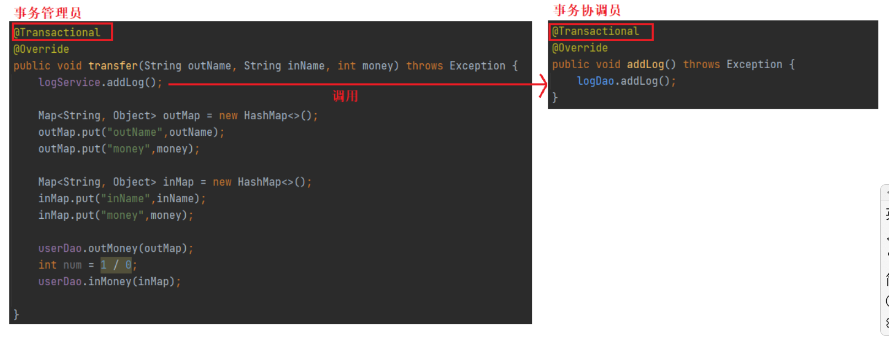
  * 规定管理员中的事务和协调员中的事务的关系。
* 传播行为
  * 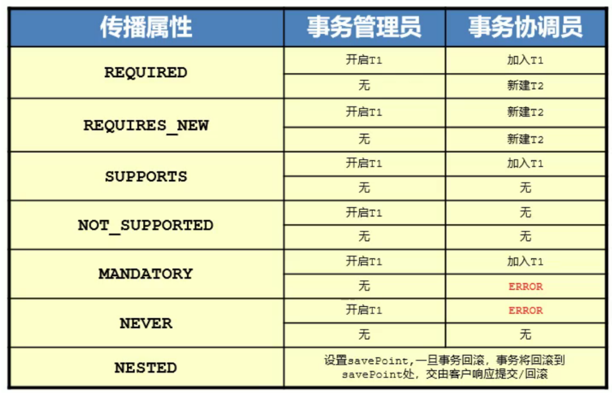


### 83. 事务传播行为演示(难点)

* 需求

  * 进行转账业务时，进行日志记录。

* REQUIRED

  ```java
  //事务管理员
  @Transactional(isolation = Isolation.REPEATABLE_READ)
  @Override
  public List<User> selectUserList() throws Exception {
      List<User> userList = userDao.selectUserList();
      userList = userDao.selectUserList();
      return userList;
  }
  ```

  ```java
  //事务协调员
  @Transactional(propagation = Propagation.REQUIRED)
  @Override
  public void addLog(String content) throws Exception {
      logDao.addLog(content);
      System.out.println(1 / 0);
  }
  ```

* 注意事项

  * 传播行为应该在协调员进行设置.


### 84. Spring整合MyBatis概述

* 概述
  * 将mybatis容器交给spring容器管理
* 传统dao开发
  * dao接口 + dao实现子类 + mapper映射文件 + spring容器
  * 本质是将dao实现子类交给spring容器管理
* 接口代理开发
  * dao接口 + mapper映射文件 + spring容器
  * 本质是将dao接口代理对象交给spring容器管理


### 85. Spring整合MyBatis之传统dao开发

* 概述

  * 本质将dao实现子类交给Spring容器管理

* 开发步骤

  * ①引入相关依赖
  * ②定义service及其实现子类
  * ③定义dao及其实现子类
  * ④编写spring-core.xml
    * 扫描注解
    * 将SqlSessionFactory对象交给Spring容器管理(使用SqlSessionFactoryBean)，FactoryBean机制
      * 加载mybatis核心配置文件SqlMapConfig.xml
    * 将DruidDataSource对象交给Spring容器管理
  * ⑤代码测试

* ①引入相关依赖

  ```xml
  <properties>
      <maven.compiler.source>8</maven.compiler.source>
      <maven.compiler.target>8</maven.compiler.target>
      <junit.version>4.13.2</junit.version>
      <lombok.version>1.18.22</lombok.version>
      <spring.version>5.3.13</spring.version>
      <dbutils.version>1.7</dbutils.version>
      <druid.version>1.2.8</druid.version>
      <mysql.version>5.1.48</mysql.version>
      <mybatis.version>3.5.7</mybatis.version>
      <mybatis-spring.version>2.0.6</mybatis-spring.version>
  </properties>
  
  <dependencies>
  
      <!--junit start-->
      <dependency>
          <groupId>junit</groupId>
          <artifactId>junit</artifactId>
          <version>${junit.version}</version>
          <scope>test</scope>
      </dependency>
      <!--junit end-->
  
      <!--lombok start-->
      <dependency>
          <groupId>org.projectlombok</groupId>
          <artifactId>lombok</artifactId>
          <version>${lombok.version}</version>
      </dependency>
      <!--lombok end-->
  
      <!--spring start-->
      <dependency>
          <groupId>org.springframework</groupId>
          <artifactId>spring-core</artifactId>
          <version>${spring.version}</version>
      </dependency>
      <dependency>
          <groupId>org.springframework</groupId>
          <artifactId>spring-beans</artifactId>
          <version>${spring.version}</version>
      </dependency>
      <dependency>
          <groupId>org.springframework</groupId>
          <artifactId>spring-context</artifactId>
          <version>${spring.version}</version>
      </dependency>
      <dependency>
          <groupId>org.springframework</groupId>
          <artifactId>spring-expression</artifactId>
          <version>${spring.version}</version>
      </dependency>
  
      <dependency>
          <groupId>org.springframework</groupId>
          <artifactId>spring-test</artifactId>
          <version>${spring.version}</version>
      </dependency>
  
      <dependency>
          <groupId>org.springframework</groupId>
          <artifactId>spring-jcl</artifactId>
          <version>${spring.version}</version>
      </dependency>
  
      <dependency>
          <groupId>org.springframework</groupId>
          <artifactId>spring-aop</artifactId>
          <version>${spring.version}</version>
      </dependency>
  
      <dependency>
          <groupId>org.springframework</groupId>
          <artifactId>spring-aspects</artifactId>
          <version>${spring.version}</version>
      </dependency>
  
      <dependency>
          <groupId>org.springframework</groupId>
          <artifactId>spring-jdbc</artifactId>
          <version>${spring.version}</version>
      </dependency>
  
      <dependency>
          <groupId>org.springframework</groupId>
          <artifactId>spring-tx</artifactId>
          <version>${spring.version}</version>
      </dependency>
      <!--spring end-->
  
  
      <!--mybatis-spring整合 start-->
      <dependency>
          <groupId>org.mybatis</groupId>
          <artifactId>mybatis-spring</artifactId>
          <version>${mybatis-spring.version}</version>
      </dependency>
      <!--mybatis-spring整合 end-->
  
  
      <!--mybatis start-->
      <dependency>
          <groupId>org.mybatis</groupId>
          <artifactId>mybatis</artifactId>
          <version>${mybatis.version}</version>
      </dependency>
      <!--mybatis end-->
  
      <!--jdbc start-->
      <dependency>
          <groupId>com.alibaba</groupId>
          <artifactId>druid</artifactId>
          <version>${druid.version}</version>
      </dependency>
      <dependency>
          <groupId>mysql</groupId>
          <artifactId>mysql-connector-java</artifactId>
          <version>${mysql.version}</version>
      </dependency>
      <!--jdbc end-->
  
  </dependencies>
  ```

* ②定义service及其实现子类

  ```java
  @Service
  public class UserServiceImpl implements UserService {
  
      @Autowired
      private UserDao userDao;
  
      @Override
      public List<User> selectUserList() throws Exception {
          return userDao.selectUserList();
      }
  }
  ```

* ③定义dao及其实现子类

  ```java
  @Repository
  public class UserDaoImpl implements UserDao {
  
      @Autowired
      private SqlSessionFactory sqlSessionFactory;
      @Override
      public List<User> selectUserList() throws Exception {
          SqlSession sqlSession = sqlSessionFactory.openSession();
          List<User> userList = sqlSession.selectList("selectUserList");
          sqlSession.close();
          return userList;
      }
  
  }
  ```

* ④编写spring-core.xml

  ```xml
  <?xml version="1.0" encoding="UTF-8"?>
  <beans xmlns="http://www.springframework.org/schema/beans"
         xmlns:xsi="http://www.w3.org/2001/XMLSchema-instance"
         xmlns:context="http://www.springframework.org/schema/context"
         xsi:schemaLocation="http://www.springframework.org/schema/beans http://www.springframework.org/schema/beans/spring-beans.xsd http://www.springframework.org/schema/context https://www.springframework.org/schema/context/spring-context.xsd">
  
      <!--扫描注解-->
      <context:component-scan base-package="com.atguigu"></context:component-scan>
  
      <bean id="sqlSessionFactory" class="org.mybatis.spring.SqlSessionFactoryBean">
          <property name="dataSource" ref="dataSource"></property>
          <!--加载mybatis容器-->
          <property name="configLocation" value="SqlMapConfig.xml"></property>
      </bean>
  
      <context:property-placeholder location="jdbc.properties"></context:property-placeholder>
      <bean id="dataSource" class="com.alibaba.druid.pool.DruidDataSource">
          <property name="driverClassName" value="${driverClass}"></property>
          <property name="url" value="${url}"></property>
          <property name="username" value="${user}"></property>
          <property name="password" value="${password}"></property>
      </bean>
  
  </beans>
  ```

* ⑤代码测试

  ```java
  public class UserController {
  
      public static void main(String[] args) throws Exception {
          //Spring容器初始化
          ApplicationContext applicationContext = new ClassPathXmlApplicationContext("spring-core.xml");
  
          UserService userService = applicationContext.getBean(UserService.class);
          List<User> userList = userService.selectUserList();
          System.out.println("userList = " + userList);
      }
  
  }
  ```

  ```java
  @RunWith(SpringJUnit4ClassRunner.class)
  @ContextConfiguration(locations = "classpath:spring-core.xml")
  public class UserServiceTest {
  
      @Autowired
      private UserService userService;
      @Test
      public void selectUserList() throws Exception {
          List<User> userList = userService.selectUserList();
          System.out.println("userList = " + userList);
      }
  }
  ```

* 存在问题

  * 每次都需要通过SqlSessionFactory获取SqlSession对象并使用，结束后还得关闭，比较麻烦。


### 86. Spring整合MyBatis之传统dao开发优化

* 概述

  * 使用SqlSessionDaoSupport类

* 优化一

  ```java
  @Repository
  public class UserDaoImpl extends SqlSessionDaoSupport implements UserDao {
  
  
      //给UserDaoImpl的父类SqlSessionDaoSupport注入SqlSessionFactory对象
      @Autowired
      @Override
      public void setSqlSessionFactory(SqlSessionFactory sqlSessionFactory) {
          super.setSqlSessionFactory(sqlSessionFactory);
      }
  
      @Override
      public List<User> selectUserList() throws Exception {
          List<User> userList = getSqlSession().selectList("selectUserList");
          return userList;
      }
  
  }
  ```

* 优化二

  ```java
  public class BaseDao extends SqlSessionDaoSupport {
  
      @Autowired
      @Override
      public void setSqlSessionFactory(SqlSessionFactory sqlSessionFactory) {
          super.setSqlSessionFactory(sqlSessionFactory);
      }
  }
  ```

  ```java
  @Repository
  public class UserDaoImpl extends BaseDao implements UserDao {
  
  
      @Override
      public List<User> selectUserList() throws Exception {
          List<User> userList = getSqlSession().selectList("selectUserList");
          return userList;
      }
  
  }
  ```


### 87. Spring整合MyBatis之接口代理

* 概述

  * 本质将接口代理对象交给Spring容器管理

* 开发步骤

  * ①定义service接口及其实现子类
  * ②定义dao接口
  * ③编写spring-core.xml
    * 扫描注解
    * 将dao接口代理类对象放入Spring容器(使用MapperFactoryBean)
    * 将SqlSessionFactory对象放入Spring容器(使用SqlSessionFactoryBean)
    * 将DruidDataSource对象放入到Spring容器
  * ④代码测试

* ①定义service接口及其实现子类

* ②定义dao接口

* ③编写spring-core.xml

  ```xml
  <?xml version="1.0" encoding="UTF-8"?>
  <beans xmlns="http://www.springframework.org/schema/beans"
         xmlns:xsi="http://www.w3.org/2001/XMLSchema-instance"
         xmlns:context="http://www.springframework.org/schema/context"
         xsi:schemaLocation="http://www.springframework.org/schema/beans http://www.springframework.org/schema/beans/spring-beans.xsd http://www.springframework.org/schema/context https://www.springframework.org/schema/context/spring-context.xsd">
  
      <!--扫描注解-->
      <context:component-scan base-package="com.atguigu"></context:component-scan>
  
      <!--将UserDao接口代理类对象放入Spring容器-->
      <bean class="org.mybatis.spring.mapper.MapperFactoryBean">
          <property name="mapperInterface" value="com.atguigu.mapper.UserMapper"></property>
          <property name="sqlSessionFactory" ref="sqlSessionFactory"></property>
      </bean>
  
      <bean id="sqlSessionFactory" class="org.mybatis.spring.SqlSessionFactoryBean">
          <property name="dataSource" ref="dataSource"></property>
          <property name="configLocation" value="SqlMapConfig.xml"></property>
      </bean>
  
  
      <context:property-placeholder location="jdbc.properties"></context:property-placeholder>
      <bean id="dataSource" class="com.alibaba.druid.pool.DruidDataSource">
          <property name="driverClassName" value="${driverClass}"></property>
          <property name="url" value="${url}"></property>
          <property name="username" value="${user}"></property>
          <property name="password" value="${password}"></property>
      </bean>
  
  </beans>
  ```

* ④代码测试

* 存在问题

  * ①在SqlMapConfig.xml文件中，不需要再通过<mappers>标签加载映射文件
  * ②如果有100个mapper接口，那么就需要写100次<bean class="org.mybatis.spring.mapper.MapperFactoryBean">将mapper接口代理类对象放入到Spring容器，过于麻烦。


### 88. Spring整合MyBatis之接口代理优化

* 概述

  * 使用MapperScannerConfigurer

* 代码实现

  ```xml
  <?xml version="1.0" encoding="UTF-8"?>
  <beans xmlns="http://www.springframework.org/schema/beans"
         xmlns:xsi="http://www.w3.org/2001/XMLSchema-instance"
         xmlns:context="http://www.springframework.org/schema/context"
         xsi:schemaLocation="http://www.springframework.org/schema/beans http://www.springframework.org/schema/beans/spring-beans.xsd http://www.springframework.org/schema/context https://www.springframework.org/schema/context/spring-context.xsd">
  
      <!--扫描注解-->
      <context:component-scan base-package="com.atguigu"></context:component-scan>
  
      <!--将UserDao接口代理类对象放入Spring容器-->
      <bean class="org.mybatis.spring.mapper.MapperScannerConfigurer">
          <property name="basePackage" value="com.atguigu.mapper"></property>
      </bean>
  
      <bean id="sqlSessionFactory" class="org.mybatis.spring.SqlSessionFactoryBean">
          <property name="dataSource" ref="dataSource"></property>
          <property name="configLocation" value="SqlMapConfig.xml"></property>
      </bean>
  
  
      <context:property-placeholder location="jdbc.properties"></context:property-placeholder>
      <bean id="dataSource" class="com.alibaba.druid.pool.DruidDataSource">
          <property name="driverClassName" value="${driverClass}"></property>
          <property name="url" value="${url}"></property>
          <property name="username" value="${user}"></property>
          <property name="password" value="${password}"></property>
      </bean>
  
  </beans>
  ```


### 89. Spring整合MyBatis引入logback

* 开发步骤

  * ①引入相关依赖
  * ②编写logback.xml
  * ③代码测试

* ①引入相关依赖

  ```xml
  <dependency>
      <groupId>ch.qos.logback</groupId>
      <artifactId>logback-classic</artifactId>
      <version>1.2.7</version>
  </dependency>
  <dependency>
      <groupId>org.slf4j</groupId>
      <artifactId>slf4j-api</artifactId>
      <version>1.7.32</version>
  </dependency>
  ```

* ②编写logback.xml

  ```xml
  <?xml version="1.0" encoding="UTF-8"?>
  <configuration debug="true">
      <!-- 指定日志输出的位置 -->
      <appender name="STDOUT"
                class="ch.qos.logback.core.ConsoleAppender">
          <encoder>
              <!-- 日志输出的格式 -->
              <!-- 按照顺序分别是：时间、日志级别、线程名称、打印日志的类、日志主体内容、换行 -->
              <pattern>[%d{HH:mm:ss.SSS}] [%-5level] [%thread] [%logger] [%msg]%n</pattern>
          </encoder>
      </appender>
  
      <!-- 设置全局日志级别。日志级别按顺序分别是：DEBUG、INFO、WARN、ERROR -->
      <!-- 指定任何一个日志级别都只打印当前级别和后面级别的日志。 -->
      <root level="INFO">
          <!-- 指定打印日志的appender，这里通过“STDOUT”引用了前面配置的appender -->
          <appender-ref ref="STDOUT"/>
      </root>
  
      <logger name="java.sql">
          <level value="debug"/>
      </logger>
  
      <logger name="org.apache.ibatis">
          <level value="info"/>
      </logger>
  
      <logger name="com.atguigu.controller.UserController">
          <level value="debug"/>
      </logger>
  
  
  </configuration>
  ```

* ③代码测试

  ```java
  public class UserController {
  
      public static Logger logger = LoggerFactory.getLogger(UserController.class);
  
      public static void main(String[] args) throws Exception {
          //Spring容器初始化
          ApplicationContext applicationContext = new ClassPathXmlApplicationContext("spring-core.xml");
  
          UserService userService = applicationContext.getBean(UserService.class);
          List<User> userList = userService.selectUserList();
          logger.debug("userList : " + userList);
      }
  
  }
  ```


### 90. Spring整合MyBatis引入分页插件

* 开发步骤

  * ①引入相关依赖
  * ②编写UserService
  * ③编写SqlMapConfig.xml
    * 配置PageInterceptor
  * ④代码测试

* ①引入相关依赖

  ```xml
  <dependency>
      <groupId>com.github.pagehelper</groupId>
      <artifactId>pagehelper</artifactId>
      <version>5.2.1</version>
  </dependency>
  ```

* ②编写UserService

  ```java
  @Service
  public class UserServiceImpl implements UserService {
  
      @Autowired
      private UserMapper userMapper;
  
  
      @Override
      public PageInfo<User> selectUserListByPage(Integer currentPage, Integer pageSize) throws Exception {
          PageHelper.startPage(currentPage,pageSize);
          List<User> userList = userMapper.selectUserList();
          return new PageInfo<>(userList);
      }
  }
  ```

* ③编写SqlMapConfig.xml

  ```xml
  <plugins>
      <plugin interceptor="com.github.pagehelper.PageInterceptor">
          <property name="reasonable" value="true"/>
      </plugin>
  </plugins>
  ```


### 91. Spring整合MyBatis引入事务管理

* 开发步骤

  * ①编写spring-core.xml
    * 开启支持事务注解
  * ②编写UserService
    * 使用@Transactional注解

* ①编写spring-core.xml

  ```xml
  <!--开启事务注解支持-->
  <tx:annotation-driven transaction-manager="transactionManager"></tx:annotation-driven>
  
  <bean id="transactionManager" class="org.springframework.jdbc.datasource.DataSourceTransactionManager">
      <property name="dataSource" ref="dataSource"></property>
  </bean>
  ```

* ②编写UserService

  ```java
  @Transactional
  @Service
  public class UserServiceImpl implements UserService {
  
      @Autowired
      private UserMapper userMapper;
  
      @Override
      public void addUser(User inputUser) throws Exception {
          userMapper.addUser(inputUser);
          System.out.println(1 / 0);
      }
  
      @Override
      public List<User> selectUserList() throws Exception {
          return userMapper.selectUserList();
      }
  
      @Override
      public PageInfo<User> selectUserListByPage(Integer currentPage, Integer pageSize) throws Exception {
          PageHelper.startPage(currentPage, pageSize);
          List<User> userList = userMapper.selectUserList();
          return new PageInfo<>(userList);
      }
  }
  ```


### 92. Spring整合web环境第一版

* 需求

  * 在JavaWeb程序中使用Spring容器（在UserServlet中使用Spring容器中的UserService对象）

* 开发步骤

  * ①创建web项目
  * ②Spring整合MyBatis
  * ③编写UserController

* ①创建web项目

* ②Spring整合MyBatis

* ③编写UserController

  ```java
  @WebServlet("/selectUserList")
  public class UserController extends HttpServlet {
  
  
      @Override
      protected void doGet(HttpServletRequest req, HttpServletResponse resp) throws ServletException, IOException {
          //初始化Spring容器
          ApplicationContext applicationContext = new ClassPathXmlApplicationContext("spring-core.xml");
          UserService userService = applicationContext.getBean(UserService.class);
          try {
              //使用Spring容器中的UserService对象
              List<User> userList = userService.selectUserList();
              System.out.println("userList = " + userList);
          } catch (Exception e) {
              e.printStackTrace();
          }
      }
  
      @Override
      protected void doPost(HttpServletRequest req, HttpServletResponse resp) throws ServletException, IOException {
          doGet(req, resp);
      }
  }
  ```

* 存在问题

  * 发起一次请求UserController，就会创建一次Spring容器。


### 93. Spring整合web环境第二版

* 概述

  * Spring容器只需要初始化一次，在后续的操作中都能够一直被使用。

* 解决方案

  * 服务器启动，项目启动，就初始化Spring容器，使用ServletContextListener监听器；

* 代码实现

  ```java
  public class MyContextLoaderListener implements ServletContextListener {
  
      @Override
      public void contextInitialized(ServletContextEvent sce) {
          //项目启动，初始化Spring容器
          ApplicationContext applicationContext = new ClassPathXmlApplicationContext("spring-core.xml");
          sce.getServletContext().setAttribute("applicationContext", applicationContext);
      }
  
      @Override
      public void contextDestroyed(ServletContextEvent sce) {
          //项目销毁
      }
  }
  ```

  ```xml
  <listener>
      <listener-class>com.atguigu.listenter.MyContextLoaderListener</listener-class>
  </listener>
  ```

  ```java
  @WebServlet("/selectUserList")
  public class UserController extends HttpServlet {
  
  
      @Override
      protected void doGet(HttpServletRequest req, HttpServletResponse resp) throws ServletException, IOException {
          //初始化Spring容器
          //ApplicationContext applicationContext = new ClassPathXmlApplicationContext("spring-core.xml");
          ApplicationContext applicationContext = (ApplicationContext) getServletContext().getAttribute("applicationContext");
          UserService userService = applicationContext.getBean(UserService.class);
          try {
              //使用Spring容器中的UserService对象
              List<User> userList = userService.selectUserList();
              System.out.println("userList = " + userList);
          } catch (Exception e) {
              e.printStackTrace();
          }
      }
  
      @Override
      protected void doPost(HttpServletRequest req, HttpServletResponse resp) throws ServletException, IOException {
          doGet(req, resp);
      }
  }
  ```

* 存在问题

  * 存在"spring-core.xml"、"applicationContext"字符串硬编码问题。


### 94. Spring整合Web环境第三版

* 概述

  * 将"spring-core.xml"设置web.xml中；
  * 将"applicationContext"放入到工具类中

* 代码实现

  ```xml
  <web-app>
      <display-name>Archetype Created Web Application</display-name>
  
      
      <context-param>
          <param-name>contextConfigLocation</param-name>
          <param-value>classpath:spring-core.xml</param-value>
      </context-param>
  
      <listener>
          <listener-class>com.atguigu.listenter.MyContextLoaderListener</listener-class>
      </listener>
  
  
  </web-app>
  ```

  ```java
  public class MyContextLoaderListener implements ServletContextListener {
  
      @Override
      public void contextInitialized(ServletContextEvent sce) {
          //获取contextConfigLocation全局变量的值=spring-core.xml
          String contextConfigLocation = sce.getServletContext().getInitParameter("contextConfigLocation");
          //项目启动，初始化Spring容器
          ApplicationContext applicationContext = new ClassPathXmlApplicationContext(contextConfigLocation);
          sce.getServletContext().setAttribute("applicationContext", applicationContext);
      }
  
      @Override
      public void contextDestroyed(ServletContextEvent sce) {
          //项目销毁
      }
  }
  ```

  ```java
  public class MyApplicationContextUtils {
  
  
      public static ApplicationContext getApplicationContext(ServletContext servletContext){
          return (ApplicationContext) servletContext.getAttribute("applicationContext");
      }
  
  }
  ```

  ```java
  @WebServlet("/selectUserList")
  public class UserController extends HttpServlet {
  
  
      @Override
      protected void doGet(HttpServletRequest req, HttpServletResponse resp) throws ServletException, IOException {
          //初始化Spring容器
          //ApplicationContext applicationContext = new ClassPathXmlApplicationContext("spring-core.xml");
          ApplicationContext applicationContext = MyApplicationContextUtils.getApplicationContext(getServletContext());
          UserService userService = applicationContext.getBean(UserService.class);
          try {
              //使用Spring容器中的UserService对象
              List<User> userList = userService.selectUserList();
              System.out.println("userList = " + userList);
          } catch (Exception e) {
              e.printStackTrace();
          }
      }
  
      @Override
      protected void doPost(HttpServletRequest req, HttpServletResponse resp) throws ServletException, IOException {
          doGet(req, resp);
      }
  }
  ```

* 存在问题

  * 特别麻烦，不要自己写，Spring已经提供给你了！！


### 95. Spring整合Web环境终极版

* 概述

  * Spring框架提供了ContextLoaderListener、WebApplicationContextUtils

* 开发步骤

  * ①引入相关依赖
  * ②编写web.xml
    * 配置ContextLoaderListener
  * ③编写UserController
    * 使用WebApplicationContextUtils

* ①引入相关依赖

  ```xml
  <dependency>
      <groupId>org.springframework</groupId>
      <artifactId>spring-web</artifactId>
      <version>${spring.version}</version>
  </dependency>
  
  <dependency>
      <groupId>org.springframework</groupId>
      <artifactId>spring-webmvc</artifactId>
      <version>${spring.version}</version>
  </dependency>
  ```

* ②编写web.xml

  ```xml
  <context-param>
      <param-name>contextConfigLocation</param-name>
      <param-value>classpath:spring-core.xml</param-value>
  </context-param>
  
  <listener>
      <listener-class>org.springframework.web.context.ContextLoaderListener</listener-class>
  </listener>
  ```

* ③编写UserController

  ```java
  @WebServlet("/selectUserList")
  public class UserController extends HttpServlet {
  
  
      @Override
      protected void doGet(HttpServletRequest req, HttpServletResponse resp) throws ServletException, IOException {
          ApplicationContext applicationContext = WebApplicationContextUtils.getWebApplicationContext(getServletContext());
          UserService userService = applicationContext.getBean(UserService.class);
          try {
              //使用Spring容器中的UserService对象
              List<User> userList = userService.selectUserList();
              System.out.println("userList = " + userList);
          } catch (Exception e) {
              e.printStackTrace();
          }
      }
  
      @Override
      protected void doPost(HttpServletRequest req, HttpServletResponse resp) throws ServletException, IOException {
          doGet(req, resp);
      }
  }
  ```

* 注意事项

  * 在web项目中，引用第三方配置文件时，需要在前面加上"classpath"，比如:classpath:SqlMapConfig.xml"、"classpath:jdbc.properties"