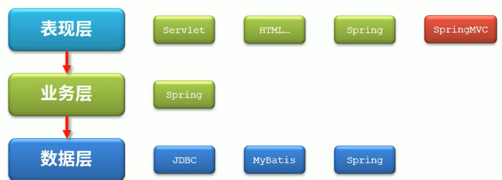
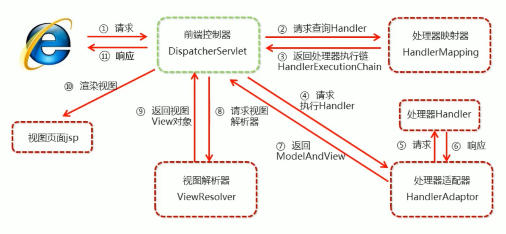
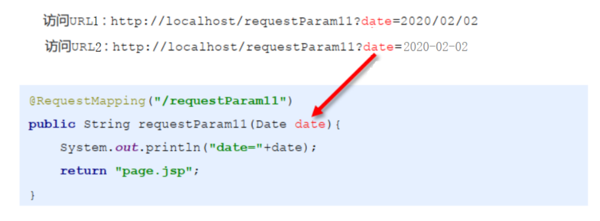
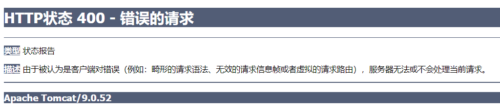
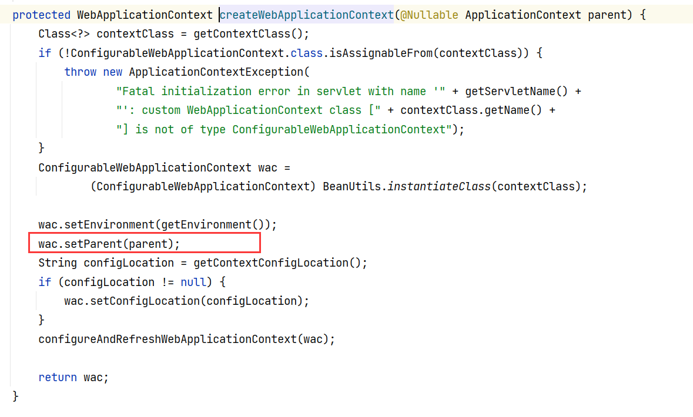
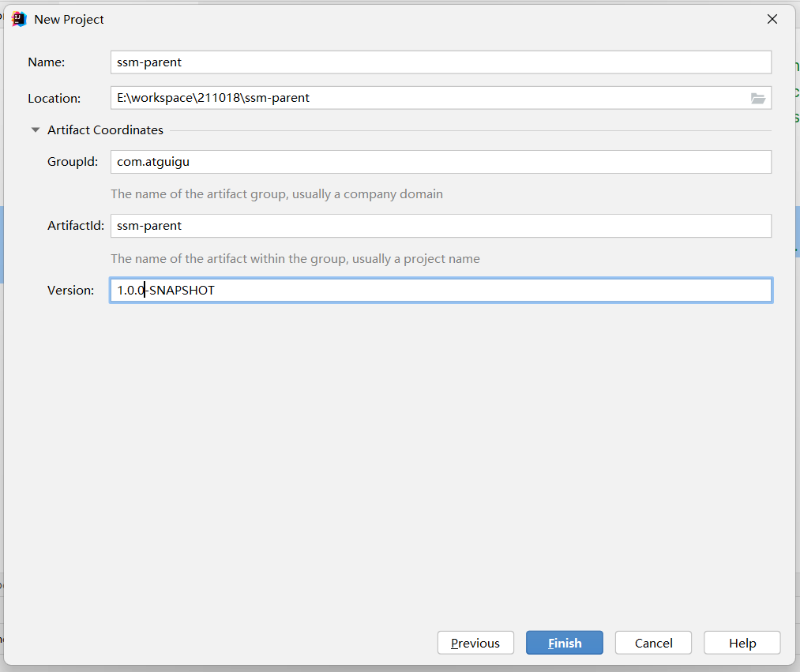
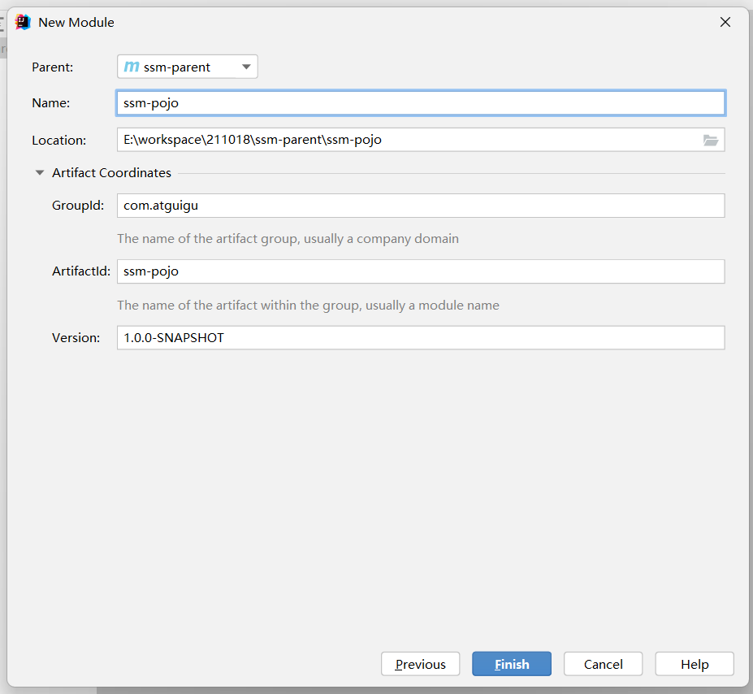
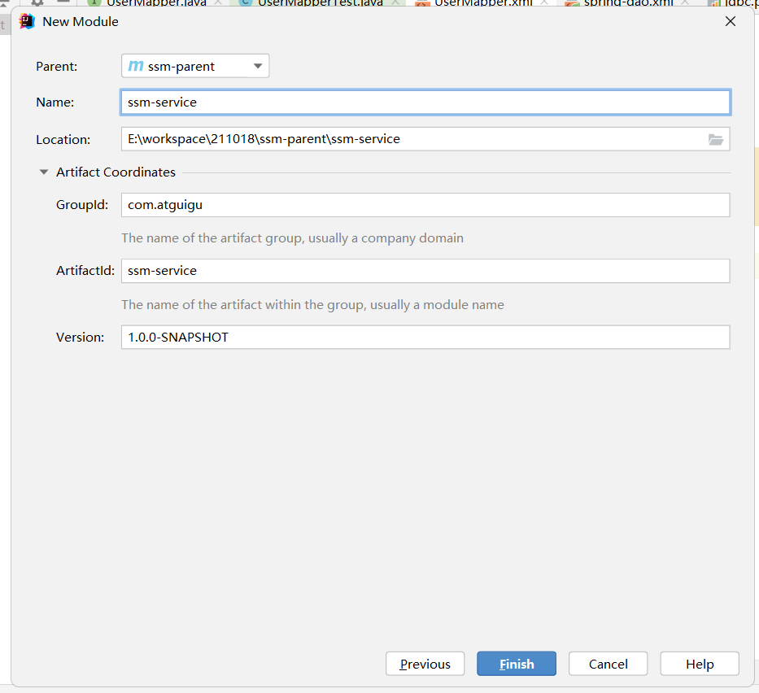
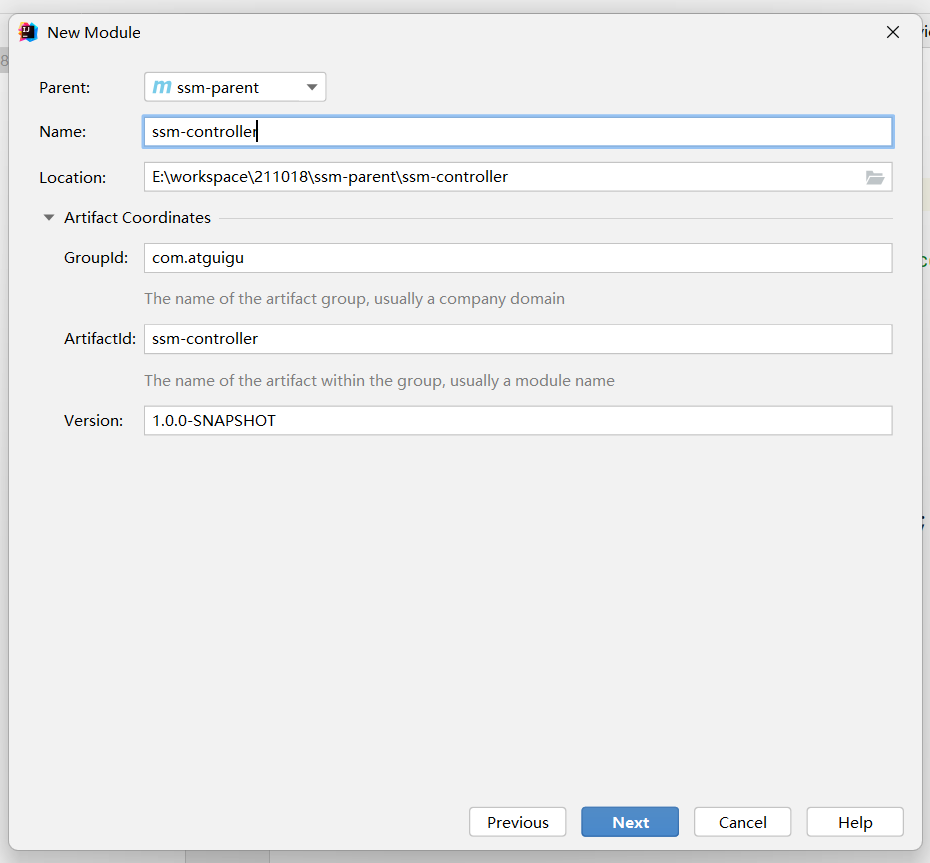
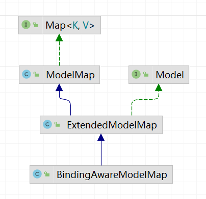

### 01-SpringMVC概述

* 三层结构
  * 

* 概述
  * SpringMVC 是一种基于 Java 的实现 MVC 模型的轻量级 Web 框架。
  * SpringMVC 已经成为目前最主流的MVC框架之一，并且随着Spring3.0 的发布，全面超越 Struts2，成为最优秀的 MVC 框架。它通过一套注解，让一个简单的 Java 类成为处理请求 的控制器，而无须实现任何接口。同时它还支持 RESTful 编程风格的请求。


### 02-SpringMVC入门案例

* 开发步骤

  * ①引入相关依赖
  * ②编写web.xml
    * 配置DispatcherServlet，加载spring-mvc.xml 。类似于ModelBaseServlet
  * ③编写spring-mvc.xml
    * 扫描注解
    * 配置视图解析器。类似于ViewBaseServlet
  * ④编写UserController
  * ⑤代码测试

* ①引入相关依赖

  ```xml
  <properties>
      <maven.compiler.source>8</maven.compiler.source>
      <maven.compiler.target>8</maven.compiler.target>
      <junit.version>4.13.2</junit.version>
      <lombok.version>1.18.22</lombok.version>
      <spring.version>5.3.13</spring.version>
      <logback.version>1.2.7</logback.version>
      <slf4j.version>1.7.32</slf4j.version>
      <servlet.version>4.0.1</servlet.version>
  </properties>
  
  <dependencies>
  
      <!--web start-->
      <dependency>
          <groupId>javax.servlet</groupId>
          <artifactId>javax.servlet-api</artifactId>
          <version>${servlet.version}</version>
      </dependency>
      <!--web end-->
  
      <!--logback start-->
      <dependency>
          <groupId>ch.qos.logback</groupId>
          <artifactId>logback-classic</artifactId>
          <version>${logback.version}</version>
      </dependency>
      <dependency>
          <groupId>org.slf4j</groupId>
          <artifactId>slf4j-api</artifactId>
          <version>${slf4j.version}</version>
      </dependency>
      <!--logback end-->
  
      <!--junit start-->
      <dependency>
          <groupId>junit</groupId>
          <artifactId>junit</artifactId>
          <version>${junit.version}</version>
          <scope>test</scope>
      </dependency>
      <!--junit end-->
  
      <!--lombok start-->
      <dependency>
          <groupId>org.projectlombok</groupId>
          <artifactId>lombok</artifactId>
          <version>${lombok.version}</version>
      </dependency>
      <!--lombok end-->
  
      <!--spring start-->
      <dependency>
          <groupId>org.springframework</groupId>
          <artifactId>spring-test</artifactId>
          <version>${spring.version}</version>
      </dependency>
  
      <dependency>
          <groupId>org.springframework</groupId>
          <artifactId>spring-aspects</artifactId>
          <version>${spring.version}</version>
      </dependency>
  
      <dependency>
          <groupId>org.springframework</groupId>
          <artifactId>spring-webmvc</artifactId>
          <version>${spring.version}</version>
      </dependency>
      <!--spring end-->
  
  </dependencies>
  ```

* ②编写web.xml

  ```xml
  <!DOCTYPE web-app PUBLIC
          "-//Sun Microsystems, Inc.//DTD Web Application 2.3//EN"
          "http://java.sun.com/dtd/web-app_2_3.dtd" >
  
  <web-app>
  
      <!--类似于ModelBaseServlet-->
      <servlet>
          <servlet-name>mvc</servlet-name>
          <servlet-class>org.springframework.web.servlet.DispatcherServlet</servlet-class>
          <!--加载spring-mvc.xml-->
          <init-param>
              <param-name>contextConfigLocation</param-name>
              <param-value>classpath:spring-mvc.xml</param-value>
          </init-param>
      </servlet>
  
      <servlet-mapping>
          <servlet-name>mvc</servlet-name>
          <url-pattern>/</url-pattern>
      </servlet-mapping>
  
  </web-app>
  ```

* ③编写spring-mvc.xml

  ```xml
  <?xml version="1.0" encoding="UTF-8"?>
  <beans xmlns="http://www.springframework.org/schema/beans"
         xmlns:xsi="http://www.w3.org/2001/XMLSchema-instance"
         xmlns:context="http://www.springframework.org/schema/context"
         xsi:schemaLocation="
         http://www.springframework.org/schema/beans http://www.springframework.org/schema/beans/spring-beans.xsd
         http://www.springframework.org/schema/context https://www.springframework.org/schema/context/spring-context.xsd">
  
      <!--扫描注解-->
      <context:component-scan base-package="com.atguigu"></context:component-scan>
  
      <!--视图解析器，类似于ViewBaseServlet-->
      <bean id="viewResolver" class="org.thymeleaf.spring5.view.ThymeleafViewResolver">
          <property name="order" value="1"/>
          <property name="characterEncoding" value="UTF-8"/>
          <property name="templateEngine">
              <bean class="org.thymeleaf.spring5.SpringTemplateEngine">
                  <property name="templateResolver">
                      <bean class="org.thymeleaf.spring5.templateresolver.SpringResourceTemplateResolver">
  
                          <!--视图前缀-->
                          <property name="prefix" value="/WEB-INF/templates/"/>
                          <!--视图后缀-->
                          <property name="suffix" value=".html"/>
                          <property name="templateMode" value="HTML5"/>
                          <property name="characterEncoding" value="UTF-8" />
                      </bean>
                  </property>
              </bean>
          </property>
      </bean>
  </beans>
  ```

* ④编写UserController

  ```java
  @Controller
  public class UserController  {
  
      @RequestMapping("/selectUserList")
      public ModelAndView selectUserList(){
          List<User> userList = new ArrayList<>();
          userList.add(new User(1,"陈磊","alei"));
          userList.add(new User(2,"土澳","tuAo"));
          //存储数据，并跳转页面
          ModelAndView modelAndView = new ModelAndView();
          modelAndView.addObject("userList",userList);
          modelAndView.setViewName("demo01");
          return modelAndView;
      }
  
  }
  ```

* ⑤代码测试


### 03--SpringMVC的执行流程

* 执行流程

  * 

  * ①浏览器发起请求(/framework25/selectUserList)，给前端控制器DispatcherServlet
  * ②前端控制器DispatcherServlet通过处理器映射器查询所有的处理器执行链
  * ③处理器映射器返回处理器执行链
  * ④前端控制器DispatcherServlet通过处理器适配找匹配的处理器
  * ⑤如果找到了匹配的处理器，处理器Handler就开始处理请求
  * ⑥处理器Handler返回响应(ModelAndView)给处理器适配器
  * ⑦处理器适配器将响应(ModelAndView)返回给前端控制器
  * ⑧前端控制器DispatcherServlet将响应(ModelAndView)交给视图解析器进行解析
  * ⑨视图解析器将渲染完毕的页面文件返回给前端控制器
  * ⑩前端控制器将渲染完毕的页面文件响应给浏览器展示


### 04-SpringMVC核心组件

* 核心组件
  * DispatcherServlet : 前端控制器，负责调度其他组件
  * HandlerMapping : 处理器映射器，负责获取处理器执行链
  * HandlerAdapter：处理器适配器，负责给请求适配对应的处理器
  * Handler：处理器，处理请求
  * ViewResolver：视图解析器，处理视图(ModelAndView)


### 05-SpringMVC核心组件配置

* 概述

  * SpringMVC默认已经对HandlerMapping、HandlerAdapter进行配置

* 代码实现

  ```xml
  <!--处理器映射器-->
  <bean class="org.springframework.web.servlet.mvc.method.annotation.RequestMappingHandlerMapping"></bean>
  
  <!--处理器适配器-->
  <bean class="org.springframework.web.servlet.mvc.method.annotation.RequestMappingHandlerAdapter"></bean>
  ```

  ```xml
  <!--处理器映射器、处理器适配器，同时也配置一些其他的辅助组件：类型转换器等等-->
  <mvc:annotation-driven></mvc:annotation-driven>
  ```


### 06-静态资源放行

* 静态资源

  * 图片、css、js、html、文本等等

* 方式一

  ```xml
  <!--放行静态资源-->
  <!--
      mapping: 访问路径
      location: 磁盘路径
  -->
  <mvc:resources mapping="/css/**" location="/css/"></mvc:resources>
  <mvc:resources mapping="/js/**" location="/js/"></mvc:resources>
  <mvc:resources mapping="/img/**" location="/img/"></mvc:resources>
  ```

* 方式二

  ```xml
  <mvc:default-servlet-handler></mvc:default-servlet-handler>
  ```


### 07-@RequestMapping注解概述

* 概述

  * Annotation for mapping web requests onto methods in request-handling classes with flexible method signatures.
  * 用于将请求映射到处理器方法上。

* 常用属性

  * path : 设置访问路径
  * method : 设置请求方式
  * params : 设置必须要携带的请求参数

* 作用

  * ①设置处理器的访问路径
  * ②窄化请求
  * ③限定请求方式

* 代码实现

  ```java
  @RequestMapping(path = "/request/testRequestMapping" , params = "username")
  public ModelAndView testRequestMapping(){
  
      ModelAndView modelAndView = new ModelAndView();
      modelAndView.setViewName("index");
      return modelAndView;
  }
  ```


### 08-@RequestMapping注解之访问路径

* 分类

  * ①精确匹配
  * ②模糊匹配

* ①精确匹配

* ②模糊匹配   ?表示1个字符， *表示0或多个字符， **表示0或多层目录

  ```java
  /**
   * 模糊匹配
   * @return
   */
  @RequestMapping(path = "/myrequest/*")
  public ModelAndView testRequestMapping2(){
      ModelAndView modelAndView = new ModelAndView();
      modelAndView.setViewName("index");
      return modelAndView;
  }
  ```


### 09-@RequestMapping注解之窄化请求

* 概述

  * 将@RequestMapping注解应用在类上。

* 代码实现

  ```java
  @Controller
  @RequestMapping("/request")
  public class RequestController {
  }
  ```


### 10-@RequestMapping注解之请求方式

* 概述

  * 常用请求方式为：get、post、put、delete

* 代码实现

  ```java
  /**
   * 处理GET
   * @return
   */
  @RequestMapping(path = "/request/testRequestMapping3",method = RequestMethod.GET)
  public ModelAndView testRequestMapping3(){
  
      ModelAndView modelAndView = new ModelAndView();
      modelAndView.setViewName("index");
      return modelAndView;
  }
  
  /**
   * 处理POST
   * @return
   */
  @RequestMapping(path = "/request/testRequestMapping4",method = RequestMethod.POST)
  public ModelAndView testRequestMapping4(){
  
      ModelAndView modelAndView = new ModelAndView();
      modelAndView.setViewName("index");
      return modelAndView;
  }
  ```

  ```java
  @GetMapping("/request/testRequestMapping3")
  public ModelAndView testRequestMapping3(){
  
      ModelAndView modelAndView = new ModelAndView();
      modelAndView.setViewName("index");
      return modelAndView;
  }
  
  @PostMapping("/request/testRequestMapping4")
  public ModelAndView testRequestMapping4(){
  
      ModelAndView modelAndView = new ModelAndView();
      modelAndView.setViewName("index");
      return modelAndView;
  }
  ```


### 11-请求参数绑定概述

* 概述
  * 就是将页面上的请求参数绑定到java数据中。
* 分类
  * 简单类型
  * javabean
  * 容器
  * javabean包装类
  * ....


### 12-请求参数绑定之简单类型

* 代码实现

  ```html
  <form th:action="@{/request/testRequestParam1}" method="get">
  
      账户:<input type="text" name="userName" ><br>
      密码:<input type="text" name="userPwd" ><br>
      <button type="submit">提交</button>
  
  </form>
  ```

  ```java
  @RequestMapping("/request/testRequestParam1")
  public ModelAndView testRequestParam1(String userName ,String userPwd){
      System.out.println("userName = " + userName);
      System.out.println("userPwd = " + userPwd);
      ModelAndView modelAndView = new ModelAndView();
      modelAndView.setViewName("index");
      return modelAndView;
  }
  ```


### 13-view-controller标签

* 概述

  * 当一个处理器只是用来转发页面的话，就可以使用View-Controller来代替。

* 代码实现

  ```xml
  <mvc:view-controller path="/demo02.html" view-name="demo02"></mvc:view-controller>
  <mvc:view-controller path="/demo03.html" view-name="demo03"></mvc:view-controller>
  ```


### 14-@RequestParam注解

* 概述

  * 把请求中的指定名称的参数值传递给控制器中的形参赋值

* 作用

  * ①设置请求参数名称
  * ②设置参数是否必需的参数
  * ③设置参数的默认值

* 代码实现

  ```java
  @RequestMapping("/request/testRequestParam2")
  public ModelAndView testRequestParam2(@RequestParam(value = "username" ,required = true ,defaultValue = "missing") String userName ){
      System.out.println("userName = " + userName);
      ModelAndView modelAndView = new ModelAndView();
      modelAndView.setViewName("index");
      return modelAndView;
  }
  ```


### 15-请求参数绑定之JavaBean

* 代码实现

  ```html
  <form th:action="@{/request/testRequestParam3}" method="get">
  
      账户:<input type="text" name="userName" ><br>
      密码:<input type="text" name="userPwd" ><br>
      <button type="submit">提交</button>
  
  </form>
  ```

  ```java
  @RequestMapping("/request/testRequestParam3")
  public ModelAndView testRequestParam3(User user ){
      System.out.println("user = " + user);
      ModelAndView modelAndView = new ModelAndView();
      modelAndView.setViewName("index");
      return modelAndView;
  }
  ```

* 注意事项

  * form表单中的name属性值和setXxx方法名有关。


### 16-请求参数绑定之JavaBean包装类

* 概述

  * 如果一个JavaBean类(对象A)中包含另外一个JavaBean类(对象B)

* 代码实现

  ```java
  public class UserWrapper {
  
      private User user;
  
  }
  ```

  ```html
  <form th:action="@{/request/testRequestParam4}" method="get">
  
      账户:<input type="text" name="user.userName" ><br>
      密码:<input type="text" name="user.userPwd" ><br>
      <button type="submit">提交</button>
  
  </form>
  ```

  ```java
  @RequestMapping("/request/testRequestParam4")
  public ModelAndView testRequestParam4(UserWrapper userWrapper ){
      System.out.println("userWrapper = " + userWrapper);
      ModelAndView modelAndView = new ModelAndView();
      modelAndView.setViewName("index");
      return modelAndView;
  }
  ```


### 17-请求参数中文乱码

* 回顾

  * 在tomcat8.0，get请求没有中文参数乱码问题，post请求有中文参数乱码问题。
  * 之前，可以通过自定义CharacterEncodingFitler来解决该问题。
  * 在SpringMVC框架中有提供类似的过滤器用于解决中文参数乱码问题。

* 代码实现

  ```xml
  <filter>
      <filter-name>encoding</filter-name>
      <filter-class>org.springframework.web.filter.CharacterEncodingFilter</filter-class>
      <init-param>
          <param-name>encoding</param-name>
          <param-value>utf-8</param-value>
      </init-param>
  </filter>
  <filter-mapping>
      <filter-name>encoding</filter-name>
      <url-pattern>/*</url-pattern>
  </filter-mapping>
  ```


### 18-请求参数绑定之容器

* 代码实现

  ```html
  <form th:action="@{/request/testRequestParam6}" method="post">
  
      javase : <input type="checkbox" name="hobbys" value="javase"><br>
      javame : <input type="checkbox" name="hobbys" value="javame"><br>
      javaee : <input type="checkbox" name="hobbys" value="javaee"><br>
  
      <button type="submit">提交</button>
  
  </form>
  ```

  ```java
  @RequestMapping("/request/testRequestParam5")
  public ModelAndView testRequestParam5(String[] hobbys){
      System.out.println(Arrays.toString(hobbys));
      ModelAndView modelAndView = new ModelAndView();
      modelAndView.setViewName("index");
      return modelAndView;
  }
  ```

  ```java
  @RequestMapping("/request/testRequestParam6")
  public ModelAndView testRequestParam6(@RequestParam("hobbys") List<String> hobbys){
      System.out.println(hobbys);
      ModelAndView modelAndView = new ModelAndView();
      modelAndView.setViewName("index");
      return modelAndView;
  }
  ```


### 19-请求参数绑定练习

* 环境准备

  ```java
  public class Student {
  
      private String stuName;
      private School school;
      private List<Subject> subjectList;
      private Subject[] subjectArray;
      private Map<String, Double> scores;
  }
  ```

  ```java
  public class School {
      private String schoolName;
  }
  ```

  ```java
  public class Subject { 
      private String subjectName;//学科名称
  
  }
  ```

* 代码实现

  ```html
  <form th:action="@{/request/testRequestParam7}" method="post">
  
      学生姓名:
          <input type="text" name="stuName"><br>
      学校名称:
          <input type="text" name="school.schoolName"><br>
      学科1名称[List类型]:
          <input type="text" name="subjectList[0].subjectName"><br>
      学科2名称[List类型]:
          <input type="text" name="subjectList[1].subjectName"><br>
      学科3名称[List类型]:
          <input type="text" name="subjectList[2].subjectName"><br>
      学科1名称[数组类型]:
          <input type="text" name="subjectArray[0].subjectName"><br>
      学科2名称[数组类型]:
          <input type="text" name="subjectArray[1].subjectName"><br>
      学科3名称[数组类型]:
          <input type="text" name="subjectArray[2].subjectName"><br>
      学科1分数:
          <input type="text" name="scores['javase']"><br>
      学科2分数:
          <input type="text" name="scores['javame']"><br>
      学科3分数:
          <input type="text" name="scores['javaee']"><br>
      <button type="submit">提交</button>
  
  </form>
  ```

  ```java
  @RequestMapping("/request/testRequestParam7")
  public ModelAndView testRequestParam7(Student student){
      System.out.println(student);
      ModelAndView modelAndView = new ModelAndView();
      modelAndView.setViewName("index");
      return modelAndView;
  }
  ```


### 20-@RequestHeader注解

* 概述

  * 通过这个注解获取请求消息头中的具体数据。

* 代码实现

  ```java
  @RequestMapping("/request/header")
  public ModelAndView getRequestHeader(@RequestHeader(value = "user-agent",defaultValue = "missing") String userAgent){
      System.out.println(userAgent);
      ModelAndView modelAndView = new ModelAndView();
      modelAndView.setViewName("index");
      return modelAndView;
  }
  ```


### 21-@CookieValue注解

* 概述

  * 获取当前请求中的 Cookie 数据

* 代码实现

  ```java
  @RequestMapping("/request/cookie")
  public ModelAndView getCookie(@CookieValue(name = "JSESSIONID",defaultValue = "missing") String JSESSIONID){
      System.out.println(JSESSIONID);
      ModelAndView modelAndView = new ModelAndView();
      modelAndView.setViewName("index");
      return modelAndView;
  }
  ```


### 22-处理器返回ModelAndView

* 概述
  * ModelAndView封装了数据和逻辑视图名称


### 23-处理器返回字符串

* 概述

  * 一般情况下，就是逻辑视图名称

* 代码实现

  ```java
  @RequestMapping("/response/testResponseStr")
  public String testResponseStr(Model model) {
      List<User> userList = new ArrayList<>();
      userList.add(new User(1, "陈磊", "alei"));
      userList.add(new User(2, "土澳", "tuAo"));
      model.addAttribute("userList", userList);//存储数据
      return "demo01";//跳转逻辑视图
  }
  ```


### 24-处理器返回值操作转发和重定向

* 概述

  * 默认情况下，处理器只能在视图解析器设置的目录范围内进行页面的跳转；
  * 如果想要跳到目录范围以外的资源，那么就需要用到前缀符号!!!

* 代码实现

  ```java
  /**
   * 转发到目录范围以外的资源
   *
   * @return
   */
  @RequestMapping("/response/forward")
  public String response2Forward() {
      return "forward:/mydemo01.html";
  }
  
  
  /**
   * 重定向到目录范围以外的资源
   *
   * @return
   */
  @RequestMapping("/response/redirect")
  public String response2Redirect() {
      return "redirect:/mydemo01.html";
  }
  
  
  /**
   * 重定向到具体的处理器
   * @return
   */
  @RequestMapping("/response/jump2Method")
  public String jump2Method(){
      return "redirect:/response/testResponseStr";
  }
  ```

* 注意事项

  * 使用"redirect:"操作重定向时，MVC框架已经内置了项目的访问路径。


### 25-原生ServletAPI对象

* 原生Servlet对象
  * HttpServletRequest
  * HttpServletResponse
  * HttpSession
  * ServletContext


### 26-获取request和response对象

* 代码实现

  ```java
  @RequestMapping("/servlet/getRequestResponse")
  public String getRequestResponse(HttpServletRequest request , HttpServletResponse response){
      System.out.println("request = " + request);
      System.out.println("response = " + response);
      return "index";
  }
  ```


### 27-获取session对象

* 代码实现

  ```java
  @RequestMapping("/servlet/getSession")
  public String getSession(HttpServletRequest request){
      System.out.println("session = " + request.getSession());
      return "index";
  }
  
  @RequestMapping("/servlet/getSession2")
  public String getSession2(HttpSession session){
      System.out.println("session = " + session);
      return "index";
  }
  ```


### 29-获取ServletContext对象

* 代码实现

  ```java
  @RequestMapping("/servlet/getServletContext")
  public String getServletContext(HttpServletRequest request){
      System.out.println("servletContext = " + request.getServletContext());
      return "index";
  }
  
  @Autowired
  private ServletContext servletContext;
  
  @RequestMapping("/servlet/getServletContext2")
  public String getServletContext2(){
      System.out.println("servletContext = " + servletContext);
      return "index";
  }
  ```


### 30-类型转换概述

* 概述
  * 请求参数绑定的过程中存在数据类型转换的问题
* 自动类型转换
  * 比如：客户端发送给服务器的是"100"，服务器用int来接收。
* 手动类型转换
  * 有一些数据类型无法自动类型转换，比如：日期。


### 31-日期类型格式转换

* 概述

  * 

  * SpringMVC有内置一个DateFormatter，默认格式是"yyyy/MM/dd"

* 代码实现

  ```xml
  <mvc:annotation-driven conversion-service="formattingConversionService"></mvc:annotation-driven>
  
  <bean id="formattingConversionService" class="org.springframework.format.support.FormattingConversionServiceFactoryBean">
      <property name="formatters">
          <set>
              <!--修改内置DateFormatter的格式-->
              <bean class="org.springframework.format.datetime.DateFormatter">
                  <property name="pattern" value="yyyy-MM-dd"></property>
              </bean>
          </set>
      </property>
  </bean>
  ```

  ```java
  public class User {
  
      private Integer userId;
      private String userName;
      private String userPwd;
      private Double money;
  
      @DateTimeFormat(pattern = "yyyy-MM-dd")
      private Date birthday;
  }
  ```


### 32-自定义类型转换器

* 概述

  * 之前是修改内置日期类型转换器的格式，
  * 现在是自定义日期类型转换器。

* 开发步骤

  * ①自定义Convert类实现Convert接口
  * ②编写spring-mvc.xml
    * 配置自定义Convert类

* ①自定义Convert类实现Convert接口

  ```java
  /**
   * <S, T> : S: source，原始数据类型 , T: target , 目标数据类型
   */
  public class MyDateConverter implements Converter<String, Date> {
      @Override
      public Date convert(String source) {
          //source : 原始日期字符串
          try {
              Date date = new SimpleDateFormat("yyyy-MM-dd").parse(source);
              return date;
          } catch (ParseException e) {
              e.printStackTrace();
          }
          return null;
      }
  }
  ```

* ②编写spring-mvc.xml

  ```xml
  <mvc:annotation-driven conversion-service="formattingConversionService"></mvc:annotation-driven>
  <bean id="formattingConversionService" class="org.springframework.format.support.FormattingConversionServiceFactoryBean">
      <property name="converters">
          <set>
              <bean class="com.atguigu.convert.MyDateConverter"></bean>
          </set>
      </property>
  </bean>
  ```


### 33-类型转换BindingResult接口

* 概述

  * 

  * 类型转换失败，跳转到一个400错误页面，体验不好；应该要跳转一个自定义错误页面，并展示合适的错误提示信息。
  * BindingResult包含了错误信息。

* 代码实现

  ```java
  @RequestMapping("/convert/testConvert01")
  public String testConvert01( User user  ,BindingResult bindingResult, Model model ){
      //出错时，从BindingResult获取错误信息
      if (bindingResult.hasErrors()) {
          FieldError fieldError = bindingResult.getFieldError();
          //birthday
          String fieldName = fieldError.getField();
          String defaultMessage = "日期格式错误!";
          model.addAttribute(fieldName + "ErrorMsg",defaultMessage);
          //跳转到自定义错误页面，并展示错误提示信息
          return "error";
      }
      System.out.println("user = " + user);
      return "index";
  }
  ```

* 注意事项

  * An Errors/BindingResult argument is expected to be declared immediately after the model attribute
  * BindingResult接口必须放在javabean属性后面紧挨着，否则报上述错误!!!


### 34-表单校验概述

* 概述
  * 之前，在javaweb阶段，我们使用javascript+正则表达式完成了客户端的表单校验；但是，可以通过一些方式绕过客户端的表单校验。
  * 现在，也需要在服务器代码中加入表单校验。
* 客户端校验
  * 使用js+正则表达式
* 服务器校验
  * 使用校验框架


### 35-校验框架入门

* 常用注解

* 开发步骤

  * ①引入依赖
    * hibernate-validator
  * ②改造javabean
    * 使用validator注解
  * ③编写前端代码
  * ④编写后台代码

* ①引入依赖

  ```xml
  <dependency>
      <groupId>org.hibernate.validator</groupId>
      <artifactId>hibernate-validator</artifactId>
      <version>6.0.17.Final</version>
  </dependency>
  ```

* ②改造javabean

  ```java
  public class User {
  
      private Integer userId;
  
      @NotBlank(message = "账户不能为空!")
      private String userName;
  
      @NotBlank(message = "密码不能为空!")
      private String userPwd;
  
      @NotNull(message = "金额不能为空!")
      @Min(value = 0 , message = "金额不能低于0元")
      @Max(value = 1000000 ,message = "金额不能高于1000000元")
      private Double money;
  
      @DateTimeFormat(pattern = "yyyy-MM-dd")
      private Date birthday;
  
  
      @NotBlank(message = "邮箱不能为空!")
      @Email(message = "邮箱格式错误!")
      private String email;
  
      @NotBlank(message = "手机号不能为空!")
      @Pattern(regexp = "[1]{1}[356789]{1}[0-9]{9}" ,message = "手机号格式错误!")
      private String phoneNum;
  }
  ```

* ③编写前端代码

  ```html
  <form th:action="@{/validator/testValidator1}">
  
      账户:<input type="text" name="userName"><br>
      密码:<input type="text" name="userPwd"><br>
      薪资:<input type="text" name="money"><br>
      生日:<input type="text" name="birthday"><br>
      邮箱:<input type="text" name="email"><br>
      电话:<input type="text" name="phoneNum"><br>
      <button type="submit">提交</button>
  
  </form>
  ```

* ④编写后台代码

  ```java
  @RequestMapping("/validator/testValidator1")
  public String testValidator1(@Valid User user){
      System.out.println("user = " + user);
      return "index";
  }
  ```


### 36-校验框架引入BindingResult接口

* 代码实现

  ```java
  @RequestMapping("/validator/testValidator2")
  public String testValidator2(@Valid User user , BindingResult bindingResult , Model model){
      System.out.println("user = " + user);
      //有错误时，保存错误提示信息，并跳转页面展示
      if (bindingResult.hasErrors()) {
          List<FieldError> fieldErrorList = bindingResult.getFieldErrors();
          for (FieldError fieldError : fieldErrorList) {
              //获取每一个错误信息
              String fieldName = fieldError.getField();
              String errorMsg = fieldError.getDefaultMessage();
              //错误1 : 生日为空!
              //错误2 : 生日格式错误! 需要处理.
              if ("birthday".equals(fieldName) && errorMsg.startsWith("Failed")) {
                  model.addAttribute(fieldName + "ErrorMsg","生日格式错误!");
  
              } else {
                  model.addAttribute(fieldName + "ErrorMsg",errorMsg);
              }
  
          }
          return "demo02";
      }
      return "index";
  }
  ```

  ```html
  <form th:action="@{/validator/testValidator2}">
  
      账户:
      <input type="text" name="userName">
      <span th:text="${userNameErrorMsg}" style="color: red"></span>
      <br>
      密码:
      <input type="text" name="userPwd">
      <span th:text="${userPwdErrorMsg}" style="color: red"></span>
  
      <br>
      薪资:<input type="text" name="money">
      <span th:text="${moneyErrorMsg}" style="color: red"></span>
      <br>
      生日:<input type="text" name="birthday">
      <span th:text="${birthdayErrorMsg}" style="color: red"></span>
  
      <br>
      邮箱:<input type="text" name="email">
      <span th:text="${emailErrorMsg}" style="color: red"></span>
  
      <br>
      电话:<input type="text" name="phoneNum">
      <span th:text="${phoneNumErrorMsg}" style="color: red"></span>
      <br>
      <button type="submit">提交</button>
  
  </form>
  ```


### 37-拦截器概述(掌握）

* 概述
  * 就是在Handler方法之前执行的组件。
* 拦截器VS过滤器
  * 相同点
    * 都需要执行过滤和放行
  * 不同点
    * 所在容器不同
      * 拦截器在Spring容器
      * 过滤器在tomcat容器
    * 作用范围不同
      * 拦截器只能拦截Spring容器中的资源
      * 过滤器可以拦截所有资源
    * IOC容器支持
      * 拦截器可以直接使用IOC容器中的资源
      * 过滤器不能直接使用IOC容器中的资源


### 38-拦截器入门

* 常用方法

  * preHandle : 在Handler方法之前执行，预处理
  * postHandle : 在Handler方法之后执行，在视图渲染之前执行
  * afterCompletion : 在Handler方法之后执行，在视图渲染之后执行

* 开发步骤

  * ①自定义拦截器类实现HandlerInterceptor接口
  * ②编写spring-mvc.xml
    * 配置自定义拦截器类
  * ③代码测试

* ①自定义拦截器类实现HandlerInterceptor接口

  ```java
  public class MyInterceptor1 implements HandlerInterceptor {
  
      @Override
      public boolean preHandle(HttpServletRequest request, HttpServletResponse response, Object handler) throws Exception {
          //在Handler方法之前执行
          System.out.println("MyInterceptor1 preHandle");
          return true;
      }
  
      @Override
      public void postHandle(HttpServletRequest request, HttpServletResponse response, Object handler, ModelAndView modelAndView) throws Exception {
          //在Handler方法之后执行,渲染视图之前执行
          System.out.println("MyInterceptor1 postHandle");
      }
  
      @Override
      public void afterCompletion(HttpServletRequest request, HttpServletResponse response, Object handler, Exception ex) throws Exception {
          //在Handler方法之后执行,渲染视图之后执行
          System.out.println("MyInterceptor1 afterCompletion");
      }
  }
  ```

* ②编写spring-mvc.xml

  ```xml
  <mvc:interceptors>
      <bean class="com.atguigu.interceptor.MyInterceptor1"></bean>
  </mvc:interceptors>
  ```

* ③代码测试


### 39-拦截器拦截路径

* 概述

  * 默认情况下，拦截器会拦截Spring容器中的所有资源。

* 代码实现

  ```xml
  <mvc:interceptors>
      <!--精确匹配-->
      <!--
      <mvc:interceptor>
          <mvc:mapping path="/interceptor/testInterceptor1"/>
          <bean class="com.atguigu.interceptor.MyInterceptor1"></bean>
      </mvc:interceptor>
      -->
      <!--匹配单层路径-->
      <!--
      <mvc:interceptor>
          <mvc:mapping path="/interceptor/*"/>
          <bean class="com.atguigu.interceptor.MyInterceptor1"></bean>
      </mvc:interceptor>
      -->
      <!--匹配多层路径-->
      <!--
      <mvc:interceptor>
          <mvc:mapping path="/interceptor/**"/>
          <bean class="com.atguigu.interceptor.MyInterceptor1"></bean>
      </mvc:interceptor>
      -->
      <mvc:interceptor>
          <mvc:mapping path="/interceptor/**"/>
          <mvc:exclude-mapping path="/interceptor/testInterceptor1"/>
          <bean class="com.atguigu.interceptor.MyInterceptor1"></bean>
      </mvc:interceptor>
  
  </mvc:interceptors>
  ```


### 40-多拦截器配置

* 总结

  * 先配置，先拦截，后放行。

* 代码实现

  ```xml
  <mvc:interceptors>
  
      <mvc:interceptor>
          <mvc:mapping path="/interceptor/**"/>
          <bean class="com.atguigu.interceptor.MyInterceptor1"></bean>
      </mvc:interceptor>
  
      <mvc:interceptor>
          <mvc:mapping path="/interceptor/**"/>
          <bean class="com.atguigu.interceptor.MyInterceptor2"></bean>
      </mvc:interceptor>
  
  </mvc:interceptors>
  ```


### 41-文件上传

* 概述

  * 通过浏览器将本地电脑中文件上传到服务器电脑中。

* 开发步骤

  * ①引入相关依赖
    * fileupload
  * ②编写前端代码（三要素）
    * 请求方式=post
    * enctype="multipart/form-data"
    * 文件上传项
  * ③编写spring-mvc.xml
    * 配置文件上传解析器
  * ④编写后台代码
    * 编写文件上传逻辑代码

* ①引入相关依赖

  ```
  <dependency>
      <groupId>commons-fileupload</groupId>
      <artifactId>commons-fileupload</artifactId>
      <version>1.4</version>
  </dependency>
  ```

* ②编写前端代码（三要素）

  ```html
  <form  th:action="@{/file/upload}" enctype="multipart/form-data" method="post">
  
      文件:<input type="file" name="myFile"><br>
      <button type="submit">上传</button>
  
  
  </form>
  ```

* ③编写spring-mvc.xml

  ```xml
  <bean id="multipartResolver"
        class="org.springframework.web.multipart.commons.CommonsMultipartResolver">
      <!-- 设置上传文件的最大尺寸为5MB -->
      <property name="maxUploadSize">
          <!--1TB、1GB、1MB、1KB、1byte-->
          <value>5242880</value>
      </property>
  </bean>
  ```

* ④编写后台代码

  ```java
  @Autowired
  private ServletContext servletContext;
  
  @RequestMapping("/file/upload")
  public String upload(MultipartFile myFile) throws IOException {
      //myFile : 浏览器上传文件的信息
      //获取upload目录的真实磁盘路径
      String uploadDirPath = servletContext.getRealPath("upload");
      File uploadDirFile = new File(uploadDirPath);
      if (!uploadDirFile.exists()){
          //创建upload目录
          uploadDirFile.mkdir();
      }
      //girl1.jpg
      String originalFilename = myFile.getOriginalFilename();
      //fdsafadsfdsaf.jpg
      String[] fileNames = originalFilename.split("[\\.]");
      String newFileName = UUID.randomUUID().toString().replaceAll("-","") + "." + fileNames[1];
      File destFile = new File(uploadDirPath + File.separator + newFileName);
      myFile.transferTo(destFile);
  
      return "index";
  }
  ```


### 42-文件下载

* 开发步骤

  * ①读取下载文件的内容
  * ②设置响应头
    * Content-Type(下载文件类型)
    * Content-Disposition(弹出下载窗口)
  * ③设置下载状态

* 代码实现

  ```java
  @RequestMapping("/file/download")
  public ResponseEntity<byte[]> download(String fileName) throws Exception {
  
      //①读取下载文件的内容，bytes : 下载文件的内容
      String downloadPath = servletContext.getRealPath("upload") + File.separator + fileName;
      BufferedInputStream bis = new BufferedInputStream(new FileInputStream(downloadPath));
      byte[] bytes = new byte[bis.available()];
      bis.read(bytes);
      //②设置响应头, headers : 设置响应头 , Content-Type(下载文件类型) , Content-Disposition(弹出下载窗口)
      MultiValueMap<String, String> headers = new HttpHeaders();
      headers.add("Content-Type", servletContext.getMimeType(fileName));
      headers.add("Content-Disposition", "attachement;filename=" + fileName);
      //③设置下载状态， status : 下载的状态
      HttpStatus status = HttpStatus.OK;
      return new ResponseEntity<>(bytes, headers, status);
  }
  ```


### 43-Restful风格介绍

* WebAPI
  * 如果一个URL返回的不包含HTML，而是数据，那么这个URL就是一个WebAPI（web接 口）

* Restful
  * 按照Rest风格访问WebAPI的一种方式
* Restful风格
  * ①不同CRUD操作采用不同的请求方式
  * ②后台的响应数据采用JSON格式


### 44-HiddenHttpMethodFilter过滤器

* 概述

  * form表单只支持get、post请求，如果要支持put、delete就需要使用HiddenHttpMethodFilter过滤器

* 代码实现

  ```html
  <!--post 2 put-->
  <form th:action="@{/rest/post2Put}" method="post">
      <input type="hidden" name="_method" value="put">
      消息:<input type="text" name="msg"><br>
      <button type="submit">提交</button>
  </form>
  
  <!--post 2 delete-->
  <form th:action="@{/rest/post2Delete}" method="post">
      <input type="hidden" name="_method" value="delete">
      消息:<input type="text" name="msg"><br>
      <button type="submit">提交</button>
  </form>
  ```

  ```java
  //@RequestMapping(path = "/rest/post2Put",method = RequestMethod.PUT)
  @PutMapping("/rest/post2Put")
  public String post2Put(String msg){
      System.out.println("msg = " + msg);
      return "demo01";
  }
  
  @DeleteMapping("/rest/post2Delete")
  public String post2Delete(String msg){
      System.out.println("msg = " + msg);
      return "demo01";
  }
  ```

* 注意事项

  * 只能使用post模拟put、delete


### 45-Restful风格查询用户

* 需求

  * 根据id查询用户记录

* 分析

  ```
  http://localhost:8080/framework27/user/selectUserById?id=1 : 之前
  http://localhost:8080/framework27/user/1 : 现在 , GET请求
  ```

* 代码实现

  ```html
  <a th:href="@{/user/1}">Restful风格查询用户</a>
  ```

  ```java
  @GetMapping("/user/{userId}")
  public String selectUserById(@PathVariable Integer userId){
      System.out.println("userId = " + userId);
      return "demo02";
  }
  ```

  


### 46-Restful风格删除用户

* 需求

  * 根据id删除用户记录

* 分析

  ```
  http://localhost:8080/framework27/user/deleteUserById?id=1 : 之前
  http://localhost:8080/framework27/user/1 : 现在 , DELETE请求
  ```

* 代码实现

  ```java
  @DeleteMapping("/user/{userId}")
  public String deleteUserById(@PathVariable Integer userId){
      System.out.println("deleteUserById userId = " + userId);
      return "demo02";
  }
  ```

  ```html
  <body>
  
  
  <div id="app">
  
      <!--post 2 delete-->
      <form method="post" id="deleteUserForm">
          <input type="hidden" name="_method" value="delete">
  
      </form>
  
      <a id="myA" th:href="@{/user/1}" @click.prevent="deleteUserById()">Restful风格删除用户</a>
  </div>
  
  
  </body>
  <script th:src="@{/js/vue.js}"></script>
  <script>
  
  
      //3,form表单根据a标签的href属性值发起请求
      var vue = new Vue({
          el: "#app",
          data: {},
          methods: {
              //1,点击a标签
              deleteUserById() {
                  console.log("deleteUserById");
                  //2,触发form表单
                  var formEle = document.getElementById("deleteUserForm");
                  var aEle = document.getElementById("myA");
                  //3,form表单根据a标签的href属性值发起请求
                  formEle.setAttribute("action", aEle.getAttribute("href"));
                  formEle.submit();
              }
          }
      })
  
  
  </script>
  ```

​		


### 47-Restful风格添加用户

* 需求

  * 添加用户记录

* 分析

  ```
  http://localhost:8080/framework27/user/addUser?userName=root&userPwd=root : 之前 
  http://localhost:8080/framework27/user?userName=root&userPwd=root: 现在 , POST请求
  ```

* 代码实现

  ```java
  @PostMapping("/user")
  public String addUser(User inputUser){
      System.out.println("addUser user = " + inputUser);
      return "demo04";
  }
  ```

  ```html
  <form th:action="@{/user}" method="post" >
      <input type="text" name="userName" ><br>
      <input type="text" name="userPwd" ><br>
      <input type="submit" value="提交">
  </form>
  ```


### 48-Restful风格登录功能

* 需求

  * 登录功能

* 分析

  ```properties
  http://localhost:8080/framework27/user/login?userName=root&userPwd=root : 之前,post
  http://localhost:8080/framework27/user?userName=root&userPwd=root: 现在 , POST请求
  ```

* 代码实现

  ```JAVA
  @PostMapping("/user/login")
  public String login(User inputUser){
      System.out.println("login user = " + inputUser);
      return "demo05";
  }
  ```

  ```html
  <form th:action="@{/user/login}" method="post" >
      <input type="text" name="userName" ><br>
      <input type="text" name="userPwd" ><br>
      <input type="submit" value="提交">
  </form>
  ```

​		


### 49-Restful风格修改用户功能

* 需求

  * 根据id修改用户记录

* 分析

  ```
  http://localhost:8080/framework27/user/updateUserById?userId=1&userName=root&userPwd=root : 之前,post
  http://localhost:8080/framework27/user?userId=1&userName=root&userPwd=root : 现在 , PUT请求
  ```

* 代码实现

  ```java
  @PutMapping("/user")
  public String updateUserById(User inputUser){
      System.out.println("updateUserById user = " + inputUser);
      return "demo04";
  }
  ```

  ```html
  <form th:action="@{/user}" method="post" >
      <input type="hidden" name="_method" value="put">
      <input type="hidden" name="userId" value="250">
      <input type="text" name="userName" ><br>
      <input type="text" name="userPwd" ><br>
      <input type="submit" value="提交">
  </form>
  ```

​		


### 50-SpringMVC获取AJAX发送的普通参数

* 代码实现

  ```html
  <body>
  <div id="app">
      <form th:action="@{/ajax/getParamter}" method="post" @submit.prevent="getParamter()">
  
          <input type="text" name="userName" v-model="user.userName"><br>
          <input type="text" name="userPwd" v-model="user.userPwd"><br>
          <input type="submit" value="提交">
      </form>
  </div>
  
  </body>
  <script th:src="@{/js/axios.js}"></script>
  <script th:src="@{/js/vue.js}"></script>
  <script>
  
      var vue = new Vue({
          el: "#app",
          data: {
              user: {
                  userId: 500,
                  userName: "",
                  userPwd: ""
              }
          },
          methods: {
              getParamter() {
                  var _this = this;
                  //发起异步请求 /ajax/getParamter
                  axios({
                      method: "get",
                      url: "/framework27/ajax/getParamter",
                      params: {
                          userId: _this.user.userId,
                          userName: _this.user.userName,
                          userPwd: _this.user.userPwd
                      }
                  }).then(function (res) {
                      var data = res.data;
                      console.log(data);
  
                  })
              }
          }
      })
  
  </script>
  ```

  ```java
  @RequestMapping("/ajax/getParamter")
  public void getParamter(User user, HttpServletResponse response) throws IOException {
      System.out.println("user = " + user);
      ResultVO resultVO = new ResultVO(true, "操作成功!", null);
      //resultVO 2 json字符串
      response.setContentType("application/json;charset=utf-8");
      String jsonStr = new ObjectMapper().writeValueAsString(resultVO);
      response.getWriter().write(jsonStr);
  }
  ```


### 51-SpringMVC获取AJAX发送的请求体json

* 代码实现1

  ```html
  <body>
  <div id="app">
      <form th:action="@{/ajax/getParamter}" method="post" @submit.prevent="getParamter()">
          <!--<input type="hidden" name="userId" value="250" v-model="user.userId">-->
          <input type="text" name="userName" v-model="user.userName"><br>
          <input type="text" name="userPwd" v-model="user.userPwd"><br>
          <input type="submit" value="提交">
      </form>
  </div>
  
  </body>
  <script th:src="@{/js/axios.js}"></script>
  <script th:src="@{/js/vue.js}"></script>
  <script>
  
      var vue = new Vue({
          el: "#app",
          data: {
              user: {
                  userId: 500,
                  userName: "",
                  userPwd: ""
              }
          },
          methods: {
              getParamter() {
                  var _this = this;
                  //发起异步请求 /ajax/getParamter
                  axios({
                      method: "post",
                      url: "/framework27/ajax/getParamter2",
                      data: {
                          userId: _this.user.userId,
                          userName: _this.user.userName,
                          userPwd: _this.user.userPwd
                      }
                  }).then(function (res) {
                      console.log(res);
                  })
              }
          }
      })
  
  </script>
  ```

  ```java
  @RequestMapping("/ajax/getParamter2")
  public void getParamter2(HttpServletRequest request, HttpServletResponse response) throws IOException {
      //①读取请求正文json
      BufferedReader bufferedReader = request.getReader();
      String content = null;
      StringBuffer sb = new StringBuffer();
      while ((content = bufferedReader.readLine()) != null) {
          sb.append(content);
      }
      String inputJsonStr = sb.toString();
      //②jsonStr 2 javabean
      User user = new ObjectMapper().readValue(inputJsonStr, User.class);
      System.out.println("user = " + user);
  
      ResultVO resultVO = new ResultVO(true, "操作成功!", null);
      //resultVO 2 json字符串
      response.setContentType("application/json;charset=utf-8");
      String jsonStr = new ObjectMapper().writeValueAsString(resultVO);
      response.getWriter().write(jsonStr);
  }
  ```

* 代码实现2

  ```java
  @RequestMapping("/ajax/getParamter3")
  public void getParamter3(@RequestBody String inputJsonStr, HttpServletResponse response) throws IOException {
      //①读取请求正文json
      System.out.println("inputJsonStr = " + inputJsonStr);
      //② jsonStr2 javabean
      User user = new ObjectMapper().readValue(inputJsonStr, User.class);
      System.out.println("user = " + user);
  
      ResultVO resultVO = new ResultVO(true, "操作成功!", null);
      //resultVO 2 json字符串
      response.setContentType("application/json;charset=utf-8");
      String jsonStr = new ObjectMapper().writeValueAsString(resultVO);
      response.getWriter().write(jsonStr);
  }
  ```

* 代码实现3(推荐)

  ```java
  @RequestMapping("/ajax/getParamter4")
  public void getParamter4(@RequestBody User user, HttpServletResponse response) throws IOException {
      //①读取请求正文json
      //②jsonStr 2 javabean
      System.out.println("user = " + user);
  
      ResultVO resultVO = new ResultVO(true, "操作成功!", null);
      //resultVO 2 json字符串
      response.setContentType("application/json;charset=utf-8");
      String jsonStr = new ObjectMapper().writeValueAsString(resultVO);
      response.getWriter().write(jsonStr);
  }
  ```


### 52-SpringMVC响应json字符串

* 概述

  * @ResponseBody : 将Handler方法的返回值作为响应正文返回给浏览器；如果返回值是一个javabean对象会自动将其转换为json字符串；同时也解决响应正文中文乱码问题。

* 代码实现1

  ```java
  @RequestMapping("/ajax/testResponse1")
  public void testResponse1(@RequestBody User user, HttpServletResponse response) throws IOException {
      //①读取请求正文json
      //②jsonStr 2 javabean
      System.out.println("user = " + user);
  
      response.setContentType("application/json;charset=utf-8");
      ResultVO resultVO = new ResultVO(true, "操作成功!", null);
      //① resultVO 2 json字符串
      String jsonStr = new ObjectMapper().writeValueAsString(resultVO);
      //② json字符串作为响应正文返回给客户端
      response.getWriter().write(jsonStr);
  }
  ```

* 代码实现2

  ```java
  @ResponseBody
  @RequestMapping("/ajax/testResponse2")
  public String testResponse2(@RequestBody User user, HttpServletResponse response) throws IOException {
      //①读取请求正文json
      //②jsonStr 2 javabean
      System.out.println("user = " + user);
  
      ResultVO resultVO = new ResultVO(true, "操作成功!", null);
      //① resultVO 2 json字符串
      String jsonStr = new ObjectMapper().writeValueAsString(resultVO);
      //② json字符串作为响应正文返回给客户端
      return jsonStr;//以前，默认应该是逻辑视图名称；返回是一个json字符串并且是响应正文。
  }
  ```

* 代码实现3(推荐)

  ```java
  @ResponseBody
  @RequestMapping("/ajax/testResponse3")
  public ResultVO testResponse3(@RequestBody User user, HttpServletResponse response) throws IOException {
      //①读取请求正文json
      //②jsonStr 2 javabean
      System.out.println("user = " + user);
      return new ResultVO(true, "操作成功!", null);//以前，默认应该是逻辑视图名称；返回是一个json字符串并且是响应正文。
  }
  ```


### 53-异常映射概述

* 概述
  * 一个项目中会包含很多个模块，各个模块需要分工完成。如果张三负责的模块按照 A 方案处 理异常，李四负责的模块按照 B 方法处理异常……各个模块处理异常的思路、代码、命名细 节都不一样，那么就会让整个项目非常混乱。
  * 将异常类型和某个具体的视图关联起来，建立映射关系。可以通过 SpringMVC 框架来帮助 我们管理异常。
* 好处
  * 让异常控制和核心业务解耦，二者各自维护，结构性更好 
  * 整个项目层面使用同一套规则来管理异常


### 54-注解开发异常处理器

* 以前

  ```java
  @RequestMapping("/exception/testException1")
  public String testException1(int num) {
      try {
          if (num == 1) {
              String str = null;
              System.out.println(str.length());
  
          } else if (num == 2) {
              System.out.println(1 / 0);
          }
      } catch (NullPointerException e) {
          e.printStackTrace();
          return "error1";
      } catch (ArithmeticException e) {
          e.printStackTrace();
          return "error2";
      }
      return "index";
  }
  ```

* 现在

  ```java
  @RequestMapping("/exception/testException2")
  public String testException2(int num) {
      if (num == 1) {
          String str = null;
          System.out.println(str.length());
      } else if (num == 2) {
          System.out.println(1 / 0);
      }
      return "index";
  }
  ```

  ```java
  @ControllerAdvice
  public class MyExceptionAdvice {
  
  
      @ExceptionHandler(NullPointerException.class)
      public String handleNullPointerException(){
          System.out.println("MyExceptionAdvice handleNullPointerException");
          return "error1";
      }
  
      @ExceptionHandler(ArithmeticException.class)
      public String handleArithmeticException(){
          System.out.println("MyExceptionAdvice handleArithmeticException");
          return "error2";
      }
  
  
  }
  ```


### 55-异常处理解决方案

* 代码实现

  ```java
  @ResponseBody
  @RequestMapping("/exception/testException3")
  public ResultVO testException3(int num) {
      try {
          if (num == 1) {
              String str = null;
              System.out.println(str.length());
          } else if (num == 2) {
              System.out.println(1 / 0);
          } else if (num == 3) {
              //业务异常 (用户输入有问题) ，比如：输入为空、格式不对...
              throw new MyBusinessException("你老实点~~~");
          }
      } catch (ArithmeticException e) {
          e.printStackTrace();
          throw new MySystemException("系统异常！");
      } catch (NullPointerException e) {
          e.printStackTrace();
          throw new MySystemException("系统异常！");
      }
      return new ResultVO(true, "操作成功!", null);
  }
  ```

  ```java
  @ControllerAdvice
  public class MyExceptionAdvice {
  
      @ResponseBody
      @ExceptionHandler(MyBusinessException.class)
      public ResultVO handleBusinessException(Exception e) {
          //提示用户
          return new ResultVO(false, "操作失败!", e.getMessage());
      }
  
  
      @ResponseBody
      @ExceptionHandler(MySystemException.class)
      public ResultVO handleSystemException(Exception e) {
          //安抚用户
  
          //发送消息给开发人员
  
          //记录日志
          return new ResultVO(false, "操作失败!", e);
      }
  
  }
  ```

​		


### 56-Spring、MyBatis、SpringMVC整合

* 开发步骤

  * ①引入相关依赖

  * ②Spring+MyBatis (mapper接口代理)

    * 1.1,定义service接口及其实现子类
    * 1.2,定义mapper接口
    * 1.3,编写spring-core.xml
      * 扫描注解
      * 扫描所有的mapper接口代理对象
      * 配置SqlSessionFactoryBean
      * 配置DruidDataSource
    * 1.4,测试通过

  * ③整合SpringMVC

    * 方式一,编写web.xml
      * 配置DispatcherServlet
        * 加载spring-mvc.xml
      * 配置ContextLoaderListener
        * 加载spring-core.xml
    * 方式二,编写web.xml
      * 配置DispatcherServlet
        * 加载spring-mvc.xml
        * 加载spring-core.xml

  * ③整合SpringMVC

    ```xml
    <!--方式一-->
    <context-param>
        <param-name>contextConfigLocation</param-name>
        <param-value>classpath:spring-core.xml</param-value>
    </context-param>
    
    <listener>
        <listener-class>org.springframework.web.context.ContextLoaderListener</listener-class>
    </listener>
    
    
    <servlet>
        <servlet-name>mvc</servlet-name>
        <servlet-class>org.springframework.web.servlet.DispatcherServlet</servlet-class>
        <init-param>
            <param-name>contextConfigLocation</param-name>
            <param-value>classpath:spring-mvc.xml</param-value>
        </init-param>
        <load-on-startup>1</load-on-startup>
    </servlet>
    <servlet-mapping>
        <servlet-name>mvc</servlet-name>
        <url-pattern>/</url-pattern>
    </servlet-mapping>
    ```

    ```xml
    <!--方式二-->
    <servlet>
        <servlet-name>mvc</servlet-name>
        <servlet-class>org.springframework.web.servlet.DispatcherServlet</servlet-class>
        <init-param>
            <param-name>contextConfigLocation</param-name>
            <param-value>classpath:spring-*.xml</param-value>
        </init-param>
        <load-on-startup>1</load-on-startup>
    </servlet>
    <servlet-mapping>
        <servlet-name>mvc</servlet-name>
        <url-pattern>/</url-pattern>
    </servlet-mapping>
    ```

​				

### 57-两个Spring容器的问题

* 概述
  * tomocat在读取web.xml时，是按照一定顺序进行加载读取：Filter、Listener、Servlet....
  * 使用ContextLoaderListener加载spring-core.xml
    * 加载后的Spring容器存储到ServletContext中，名称如下：
      * org.springframework.web.context.WebApplicationContext.ROOT
  * 使用DispatcherServlet加载spring-mvc.xml
    * 加载后的Spring容器存储到ServletContext中，名称如下：
      * org.springframework.web.servlet.FrameworkServlet.CONTEXT.mvc
* 源码
  * 


### 58-两个Spring容器的关系

* 概述
  * 通过ContextLoaderListener加载的spring容器是DispatcherServlet加载的spring容器的父容器。


### 59-两个Spring容器重复创建对象问题

* 概述

  * 如果spring-mvc.xml和spring-core.xml中如果都是扫描所有注解的话，那么就会有重复创 建对象的问题存在。

* 解决方案

  * 在spring-core.xml中排除扫描@Controller注解
  * 在spring-mvc.xml中包含扫描@Controller注解

* 代码实现

  ```xml
  <!--spring-mvc.xml-->
  <context:component-scan base-package="com.atguigu" use-default-filters="false">
      <context:include-filter type="annotation" expression="org.springframework.stereotype.Controller"/>
  </context:component-scan>
  ```

  ```xml
  <!--spring-core.xml-->
  <context:component-scan base-package="com.atguigu">
      <context:exclude-filter type="annotation" expression="org.springframework.stereotype.Controller"/>
  </context:component-scan>
  ```

​		


### 60-ssm聚合项目之ssm-parent父工程

* 开发步骤

  * ①创建项目project
  * ②编写pom.xml
    * 打包方式=pom
    * 版本锁定

* ①创建项目project

  * 

* ②编写pom.xml

  ```xml
  <!--版本锁定-->
  <properties>
      <servlet.version>4.0.1</servlet.version>
      <jsp.version>2.3.3</jsp.version>
      <thymeleaf.version>3.0.12.RELEASE</thymeleaf.version>
      <spring.version>5.3.9</spring.version>
      <lombok.version>1.18.20</lombok.version>
      <slf4j.version>1.7.30</slf4j.version>
      <logback.version>1.2.5</logback.version>
      <hibernate-validator.version>7.0.1.Final</hibernate-validator.version>
      <fileupload.version>1.4</fileupload.version>
      <mybatis-spring.version>2.0.6</mybatis-spring.version>
      <druid.version>1.2.6</druid.version>
      <mybatis.version>3.5.7</mybatis.version>
      <mysql.version>5.1.48</mysql.version>
      <pagehelper.version>5.2.1</pagehelper.version>
  
      <junit.version>4.13.2</junit.version>
  </properties>
  
  <!--依赖版本锁定-->
  <dependencyManagement>
      <dependencies>
  
          <dependency>
              <groupId>junit</groupId>
              <artifactId>junit</artifactId>
              <version>${junit.version}</version>
              <scope>test</scope>
          </dependency>
  
          <!--spring依赖-->
          <dependency>
              <groupId>org.springframework</groupId>
              <artifactId>spring-context</artifactId>
              <version>${spring.version}</version>
          </dependency>
  
          <dependency>
              <groupId>org.springframework</groupId>
              <artifactId>spring-core</artifactId>
              <version>${spring.version}</version>
          </dependency>
  
          <dependency>
              <groupId>org.springframework</groupId>
              <artifactId>spring-expression</artifactId>
              <version>${spring.version}</version>
          </dependency>
  
          <dependency>
              <groupId>org.springframework</groupId>
              <artifactId>spring-beans</artifactId>
              <version>${spring.version}</version>
          </dependency>
  
          <dependency>
              <groupId>org.springframework</groupId>
              <artifactId>spring-jcl</artifactId>
              <version>${spring.version}</version>
          </dependency>
  
  
          <dependency>
              <groupId>org.springframework</groupId>
              <artifactId>spring-aop</artifactId>
              <version>${spring.version}</version>
          </dependency>
  
          <dependency>
              <groupId>org.springframework</groupId>
              <artifactId>spring-aspects</artifactId>
              <version>${spring.version}</version>
          </dependency>
  
  
          <dependency>
              <groupId>org.springframework</groupId>
              <artifactId>spring-tx</artifactId>
              <version>${spring.version}</version>
          </dependency>
  
          <dependency>
              <groupId>org.springframework</groupId>
              <artifactId>spring-jdbc</artifactId>
              <version>${spring.version}</version>
          </dependency>
  
          <dependency>
              <groupId>org.springframework</groupId>
              <artifactId>spring-test</artifactId>
              <version>${spring.version}</version>
          </dependency>
  
  
          <!--mvc依赖-->
          <dependency>
              <groupId>org.springframework</groupId>
              <artifactId>spring-webmvc</artifactId>
              <version>${spring.version}</version>
          </dependency>
          <dependency>
              <groupId>org.springframework</groupId>
              <artifactId>spring-web</artifactId>
              <version>${spring.version}</version>
          </dependency>
  
          <dependency>
              <groupId>commons-fileupload</groupId>
              <artifactId>commons-fileupload</artifactId>
              <version>${fileupload.version}</version>
          </dependency>
  
  
          <dependency>
              <groupId>org.hibernate.validator</groupId>
              <artifactId>hibernate-validator</artifactId>
              <version>${hibernate-validator.version}</version>
          </dependency>
  
          <dependency>
              <groupId>javax.servlet</groupId>
              <artifactId>javax.servlet-api</artifactId>
              <version>${servlet.version}</version>
          </dependency>
          <dependency>
              <groupId>javax.servlet.jsp</groupId>
              <artifactId>javax.servlet.jsp-api</artifactId>
              <version>${jsp.version}</version>
          </dependency>
          <dependency>
              <groupId>org.thymeleaf</groupId>
              <artifactId>thymeleaf-spring5</artifactId>
              <version>${thymeleaf.version}</version>
          </dependency>
  
  
          <!--数据库依赖-->
          <dependency>
              <groupId>org.mybatis</groupId>
              <artifactId>mybatis-spring</artifactId>
              <version>${mybatis-spring.version}</version>
          </dependency>
  
  
          <dependency>
              <groupId>org.mybatis</groupId>
              <artifactId>mybatis</artifactId>
              <version>${mybatis.version}</version>
          </dependency>
  
          <dependency>
              <groupId>com.alibaba</groupId>
              <artifactId>druid</artifactId>
              <version>${druid.version}</version>
          </dependency>
  
  
          <dependency>
              <groupId>mysql</groupId>
              <artifactId>mysql-connector-java</artifactId>
              <version>${mysql.version}</version>
          </dependency>
  
          <dependency>
              <groupId>com.github.pagehelper</groupId>
              <artifactId>pagehelper</artifactId>
              <version>${pagehelper.version}</version>
          </dependency>
  
  
          <!--pojo依赖-->
          <dependency>
              <groupId>org.projectlombok</groupId>
              <artifactId>lombok</artifactId>
              <version>${lombok.version}</version>
          </dependency>
  
  
          <!--日志依赖-->
          <dependency>
              <groupId>org.slf4j</groupId>
              <artifactId>slf4j-api</artifactId>
              <version>${slf4j.version}</version>
          </dependency>
          <dependency>
              <groupId>ch.qos.logback</groupId>
              <artifactId>logback-classic</artifactId>
              <version>${logback.version}</version>
          </dependency>
  
      </dependencies>
  
  </dependencyManagement>
  
  <!--jdk1.8-->
  <build>
      <plugins>
  
          <plugin>
              <groupId>org.apache.maven.plugins</groupId>
              <artifactId>maven-compiler-plugin</artifactId>
              <version>3.6.0</version>
              <configuration>
                  <source>1.8</source>
                  <target>1.8</target>
                  <encoding>utf-8</encoding>
  
              </configuration>
          </plugin>
  
      </plugins>
  
  </build>
  ```


### 61-ssm聚合项目之ssm-pojo子模块

* 开发步骤

  * ①创建模块
    * 以ssm-parent为父工程
  * ②编写pom.xml
    * 打包方式=jar
    * 引入依赖

* ①创建模块

  * 

* ②编写pom.xml

  ```xml
  <parent>
      <artifactId>ssm-parent</artifactId>
      <groupId>com.atguigu</groupId>
      <version>1.0.0-SNAPSHOT</version>
  </parent>
  <modelVersion>4.0.0</modelVersion>
  <artifactId>ssm-pojo</artifactId>
  <packaging>jar</packaging>
  <dependencies>
      <dependency>
          <groupId>org.projectlombok</groupId>
          <artifactId>lombok</artifactId>
      </dependency>
  </dependencies>
  ```

* ③定义pojo类

  ```java
  public class User {
  
      private Integer userId;
      private String userName;
      private String userPwd;
      private Double money;
  
  }
  ```


### 62-ssm聚合项目之ssm-dao子模块

* 开发步骤

  * ①创建模块
    * 以ssm-parent为父工程
  * ②编写pom.xml
  * ③整合spring和mybatis

* ①创建模块

  * 

* ②编写pom.xml

  ```xml
  <parent>
      <artifactId>ssm-parent</artifactId>
      <groupId>com.atguigu</groupId>
      <version>1.0.0-SNAPSHOT</version>
  </parent>
  <modelVersion>4.0.0</modelVersion>
  
  <artifactId>ssm-mapper</artifactId>
  <packaging>jar</packaging>
  
  <dependencies>
  
      <dependency>
          <groupId>junit</groupId>
          <artifactId>junit</artifactId>
          <scope>test</scope>
      </dependency>
  
      <!--spring依赖-->
      <dependency>
          <groupId>org.springframework</groupId>
          <artifactId>spring-context</artifactId>
      </dependency>
  
      <dependency>
          <groupId>org.springframework</groupId>
          <artifactId>spring-core</artifactId>
      </dependency>
  
      <dependency>
          <groupId>org.springframework</groupId>
          <artifactId>spring-expression</artifactId>
      </dependency>
  
      <dependency>
          <groupId>org.springframework</groupId>
          <artifactId>spring-beans</artifactId>
      </dependency>
  
      <dependency>
          <groupId>org.springframework</groupId>
          <artifactId>spring-jcl</artifactId>
      </dependency>
  
      <dependency>
          <groupId>org.springframework</groupId>
          <artifactId>spring-aop</artifactId>
      </dependency>
  
      <dependency>
          <groupId>org.springframework</groupId>
          <artifactId>spring-aspects</artifactId>
      </dependency>
  
      <dependency>
          <groupId>org.springframework</groupId>
          <artifactId>spring-tx</artifactId>
      </dependency>
  
      <dependency>
          <groupId>org.springframework</groupId>
          <artifactId>spring-jdbc</artifactId>
      </dependency>
  
      <dependency>
          <groupId>org.springframework</groupId>
          <artifactId>spring-test</artifactId>
      </dependency>
  
      <!--数据库依赖-->
      <dependency>
          <groupId>org.mybatis</groupId>
          <artifactId>mybatis-spring</artifactId>
      </dependency>
  
      <dependency>
          <groupId>org.mybatis</groupId>
          <artifactId>mybatis</artifactId>
      </dependency>
  
      <dependency>
          <groupId>com.alibaba</groupId>
          <artifactId>druid</artifactId>
      </dependency>
  
      <dependency>
          <groupId>mysql</groupId>
          <artifactId>mysql-connector-java</artifactId>
      </dependency>
  
      <!--日志依赖-->
      <dependency>
          <groupId>org.slf4j</groupId>
          <artifactId>slf4j-api</artifactId>
      </dependency>
      <dependency>
          <groupId>ch.qos.logback</groupId>
          <artifactId>logback-classic</artifactId>
      </dependency>
  
  </dependencies>
  ```

* ③整合spring和mybatis

  


### 63-ssm聚合项目之ssm-service子模块

* 开发步骤

  * ①创建模块
    * 以ssm-parent为父工程
  * ②编写pom.xml
    * 打包方式=jar
  * ③定义service接口及其实现子类

* ①创建模块

  * 

* ②编写pom.xml

  ```xml
  <parent>
      <artifactId>ssm-parent</artifactId>
      <groupId>com.atguigu</groupId>
      <version>1.0.0-SNAPSHOT</version>
  </parent>
  <modelVersion>4.0.0</modelVersion>
  
  <artifactId>ssm-service</artifactId>
  
  <dependencies>
  
      <dependency>
          <groupId>junit</groupId>
          <artifactId>junit</artifactId>
          <scope>test</scope>
      </dependency>
      <dependency>
          <groupId>com.atguigu</groupId>
          <artifactId>ssm-mapper</artifactId>
          <version>1.0.0-SNAPSHOT</version>
      </dependency>
  
  </dependencies>
  ```

* ③定义service接口及其实现子类

  ```java
  @Service
  public class UserServiceImpl implements UserServcie {
  
      @Autowired
      private UserMapper userMapper;
  
      @Override
      public List<User> selectUserList() throws Exception {
          return userMapper.selectUserList();
      }
  }
  ```

* ④编写spring-service.xml

  ```xml
  <context:component-scan base-package="com.atguigu.service"></context:component-scan>
  ```

* ⑤代码测试

  ```java
  @RunWith(SpringJUnit4ClassRunner.class)
  @ContextConfiguration(locations = {"classpath:spring-service.xml", "classpath:spring-dao.xml"})
  public class UserServcieTest {
  
      @Autowired
      private UserServcie userServcie;
  
      @Test
      public void selectUserList() throws Exception {
          List<User> userList = userServcie.selectUserList();
          System.out.println("userList = " + userList);
      }
  }
  ```


### 64-ssm聚合项目之ssm-controller子模块

* 开发步骤

  * ①创建模块
    * 骨架=maven-archetype-webapp
    * 以ssm-parent为父工程
  * ②编写pom.xml
  * ③编写spring-mvc.xml
  * ④编写web.xml
  * ⑤编写controller代码

* ①创建模块

  * 

* ②编写pom.xml

  ```xml
  <parent>
      <artifactId>ssm-parent</artifactId>
      <groupId>com.atguigu</groupId>
      <version>1.0.0-SNAPSHOT</version>
  </parent>
  <modelVersion>4.0.0</modelVersion>
  
  <artifactId>ssm-controller</artifactId>
  <packaging>war</packaging>
  
  <dependencies>
      <dependency>
          <groupId>junit</groupId>
          <artifactId>junit</artifactId>
          <scope>test</scope>
      </dependency>
  
      <!--mvc依赖-->
      <dependency>
          <groupId>org.springframework</groupId>
          <artifactId>spring-webmvc</artifactId>
      </dependency>
      <dependency>
          <groupId>org.springframework</groupId>
          <artifactId>spring-web</artifactId>
      </dependency>
      <dependency>
          <groupId>commons-fileupload</groupId>
          <artifactId>commons-fileupload</artifactId>
      </dependency>
  
      <dependency>
          <groupId>org.hibernate.validator</groupId>
          <artifactId>hibernate-validator</artifactId>
      </dependency>
  
      <dependency>
          <groupId>javax.servlet</groupId>
          <artifactId>javax.servlet-api</artifactId>
      </dependency>
      <dependency>
          <groupId>javax.servlet.jsp</groupId>
          <artifactId>javax.servlet.jsp-api</artifactId>
      </dependency>
      <dependency>
          <groupId>org.thymeleaf</groupId>
          <artifactId>thymeleaf-spring5</artifactId>
      </dependency>
  
  
  </dependencies>
  ```

* ③编写spring-mvc.xml

  ```xml
  <!--扫描注解-->
  <context:component-scan base-package="com.atguigu.controller"></context:component-scan>
  
  <!--处理器映射器、处理器适配器等等-->
  <mvc:annotation-driven></mvc:annotation-driven>
  
  <!--视图解析器-->
  <bean id="viewResolver" class="org.thymeleaf.spring5.view.ThymeleafViewResolver">
      <property name="order" value="1"/>
      <property name="characterEncoding" value="UTF-8"/>
      <property name="templateEngine">
          <bean class="org.thymeleaf.spring5.SpringTemplateEngine">
              <property name="templateResolver">
                  <bean class="org.thymeleaf.spring5.templateresolver.SpringResourceTemplateResolver">
  
                      <!--视图前缀-->
                      <property name="prefix" value="/WEB-INF/templates/"/>
  
                      <!--视图后缀-->
                      <property name="suffix" value=".html"/>
  
                      <property name="templateMode" value="HTML5"/>
                      <property name="characterEncoding" value="UTF-8"/>
                  </bean>
              </property>
          </bean>
      </property>
  </bean>
  
  <!--放行静态资源-->
  <mvc:default-servlet-handler></mvc:default-servlet-handler>
  ```

* ④编写web.xml(注意)

  ```xml
  <context-param>
      <param-name>contextConfigLocation</param-name>
      <param-value>classpath:spring-service.xml,classpath*:spring-dao.xml</param-value>
  </context-param>
  
  <listener>
      <listener-class>org.springframework.web.context.ContextLoaderListener</listener-class>
  </listener>
  
  <servlet>
      <servlet-name>mvc</servlet-name>
      <servlet-class>org.springframework.web.servlet.DispatcherServlet</servlet-class>
      <init-param>
          <param-name>contextConfigLocation</param-name>
          <param-value>classpath:spring-mvc.xml</param-value>
      </init-param>
      <load-on-startup>1</load-on-startup>
  </servlet>
  
  <servlet-mapping>
      <servlet-name>mvc</servlet-name>
      <url-pattern>/</url-pattern>
  </servlet-mapping>
  ```

* ⑤编写controller代码

  ```java
  @Controller
  public class UserController {
  
  
      @Autowired
      private UserService userService;
  
  
      @RequestMapping("/user/selectUserList")
      public String selectUserList(Model model) throws Exception {
          List<User> userList = userService.selectUserList();
          model.addAttribute("userList",userList);
          return "user-list";
      }
  
  }
  ```


### 65-操作请求域

* 代码实现

  ```java
  @Controller
  public class RequestController {
  
      @RequestMapping("/request/testModel")
      public String testModel(Model model){
          //BindingAwareModelMap
          model.addAttribute("msg1","hello1");
          return "request";
      }
  
      @RequestMapping("/request/testModelMap")
      public String testModelMap(ModelMap modelMap){
          //BindingAwareModelMap
          modelMap.put("msg2","hello2");
          return "request";
      }
  
  
      @RequestMapping("/request/testMap")
      public String testMap(Map map){
          //BindingAwareModelMap
          map.put("msg3","hello3");
          return "request";
      }
  
  
      @RequestMapping("/request/testRequest")
      public String testRequest(HttpServletRequest request){
          //RequestFacade
          request.setAttribute("msg4","hello4");
          return "request";
      }
  
      @RequestMapping("/request/testModelAndView")
      public ModelAndView testModelAndView(){
          ModelAndView modelAndView = new ModelAndView();
          modelAndView.addObject("msg5","hello5");
          modelAndView.setViewName("request");
          return modelAndView;
      }
  
  
  }
  ```

* 类结构关系

  * 

* 本质

  * 都是在操作request域
  * org.thymeleaf.context.WebEngineContext.setVariable
    * Model、ModelMap、Map、ModelAndView都是在操作request域


### 66-操作会话域

* 代码实现

  ```java
  @RequestMapping("/request/testSession")
  public String testSession(HttpSession session){
      session.setAttribute("msg6","hello6");
      return "request";
  }
  ```


### 67-操作应用域

* 代码实现

  

