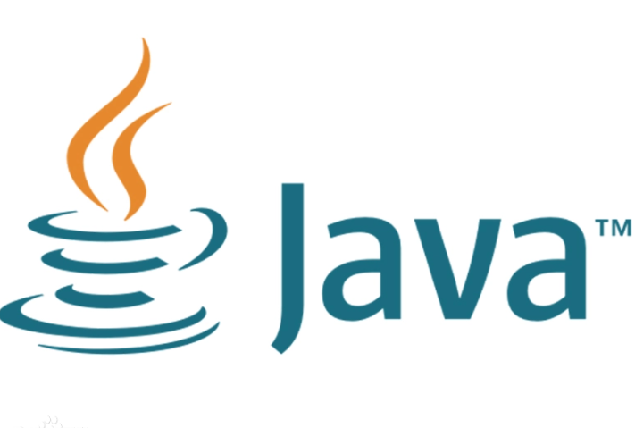
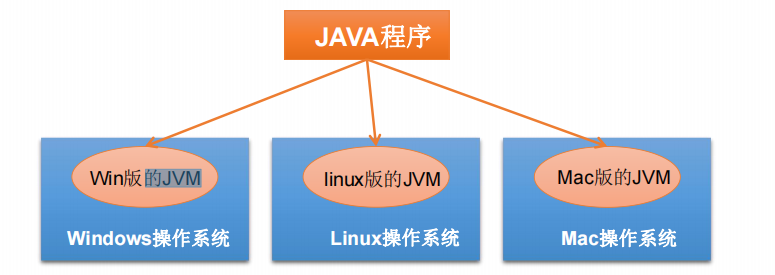
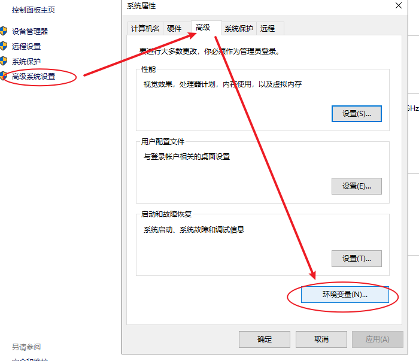
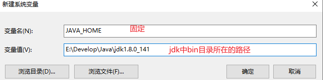
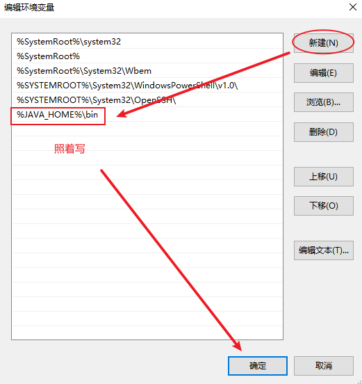
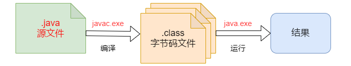
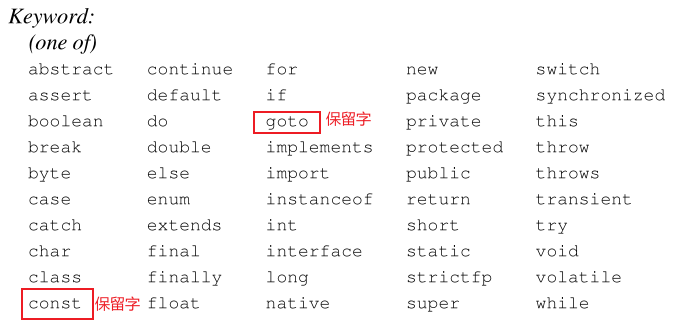

### Day_01随堂笔记

###  JavaSE课程体系介绍

#### JavaSE知识模块介绍

* **第一部分：计算机编程语言核心结构：**`数据类型`、`运算符`、`流程控制`、`数组`、…
* **第二部分：Java面向对象核心逻辑：**`类和对象`、`封装`、`继承`、`多态`、`抽象`、`接口`、…
* **第三部分：JavaSE核心高级应用：**`集合`、`I/O`、`多线程`、`网络编程`、`反射机制`、…
* **第四部分：Java新特性：**`Lambda表达式`、`函数式编程`、`新Date/Time API`、`接口的默认、静态和私有方法`、…

### 计算机编程语言

```JAVA
计算机编程语言 : 和计算机进行交流的专业语言.
编程语言的种类是很多的,不同的编程语言在不同的领域有自己的使用场景.
    (编程语言的使用场景越多我们称这个语言的生态好)
    
Java: 后台开发    
```

### Java语言介绍（了解）

```JAVA
Java语言的创始人: 詹姆斯.高斯林
Java之前的公司: SUN公司 斯坦福大学网络公司
Java现在的公司: Oracle公司 (Oracle数据库,Java)    
Java的初始版本发行日期: 1995年
Java语言的版本拆分:
	JavaSE: Java基础
	JavaEE: Java企业级开发 (后台,web) --> 大数据工程师
	JavaME: Java嵌入式开发   塞班 --> Android
        
Java语言是一门面向对象,强类型,开源的编程语言!        
```




### Java语言的发展史

**版本历史：**

|  发行版本  |  发行时间  |                            备注                            |
| :--------: | :--------: | :--------------------------------------------------------: |
|    Java    | 1995.05.23 |  **Sun公司在Sun world会议上正式发布Java和HotJava浏览器**   |
|  Java 1.0  | 1996.01.23 |            Sun公司发布了Java的第一个开发工具包             |
|  Java 1.1  | 1997.02.19 |                                                            |
|  Java 1.2  | 1998.12.08 | **拆分成：J2SE（标准版）、J2EE（企业版）、J2ME（小型版）** |
|  Java 1.3  | 2000.05.08 |                                                            |
|  Java1.4   | 2004.02.06 |                                                            |
|  Java 5.0  | 2004.09.30 |   ①版本号从1.5改为5.0；②平台更名为JavaSE、JavaEE、JavaME   |
|  Java 6.0  | 2006.12.11 |    **2009.04.20 Oracle宣布收购SUN公司，收购价74亿美金**    |
|   Java 7   | 2011.07.02 |                                                            |
| **Java 8** | 2014.03.18 |         **5.0版本以来最大变化的版本，长期支持版**          |
|   Java 9   | 2017.09.22 |    ①每半年更新一次；②Java 9开始不再支持windows 32位系统    |
|  Java 10   | 2018.03.21 |                                                            |
|  Java 11   | 2018.09.25 |  **JDK安装包取消独立JRE安装包，长期支持版**-->未来的趋势   |
|  Java 12   | 2019.03.19 |                                                            |
|  Java 13   | 2019.9.18  |                                                            |
|  Java 14   | 2020.3.17  |                                                            |

**特点:**高版本的Java向下兼容,版本之间不通融

### Java语言的特点

```JAVA
1. 开源: 开放源代码 
2. 免费: 免费试用    
3. 面向对象: 编程思维 --> 懒人思维
4. 强类型: 对数据种类的分类非常的严格 --> 前期学习麻烦,后期使用方便    
5. 一次编写到处运行: Java跨平台  
    	Java语言需要有各个系统的JVM才能支持跨平台.
```



### 平台

```JAVA
系统平台(操作平台):
	windows:最普遍
    Linux:服务器系统(后台开发,运维)
    Mac:苹果系统 最适合开发操作系统
Java语言平台: J2SE,J2EE,J2ME
```

### JVM,JRE,JDK

```JAVA
JVM:Java虚拟机  ->土壤
    	保证Java程序跨平台的根本,也是Java程序运行的载体
    
JRE:Java运行环境 ->生长环境
    	有了JRE程序就能正常的运行
    
JDK:Java开发工具集 ->锄头,铁锹,肥料....
    	有了JDK就可以修改,开发Java程序
    
三者的关系:包含关系
	JDK 包含 JRE , JRE 包含 JVM
    
我只需要安装JDK既可以开发和运行Java程序.    
```

### DOS命令

```java
//DOS命令: 以命令的方式去操作windows系统
1. 在win+r的窗口内输入cmd,进入windows命令模式
2. 常用命令:
	切换盘符: 盘符名称:
	进入文件夹: cd 文件夹名称 -> 单级进入
    查看文件夹: dir
    清除命令: cls
    回到上级目录: cd..
    回到盘符根目录: cd/
    退出: exit
        
 拓展:
	ipconfig 查看网络连接 查看ip地址
         192.168.12.192 : 老师的ip地址
         192.168.12.1 : 网关地址
         192.168.12.255 : 广播地址    
    ping 网址/IP地址         
```

### 配置Path环境变量

```JAVA
为什么配置Path环境变量: 重点
	为了让java命令,javac命令能在任意的路径下执行.(为了让jdk中bin目录中的命令能在系统的任意路径下执行)
    
第一步:进入环境变量
第二步:在系统变量中添加JAVA_HOME,JAVA_HOME的地址是jdkbin目录所在的地址
第三步:在系统变量中Path变量值的最前方加入内容:  %JAVA_HOME%\bin;   

java -version : 查看JDK版本号
```







### HelloWorld编写

#### Java程序的执行过程

1. 编写Java代码,写在一个后缀名为.java的文档中 --> java文件

2. 编译: 把编写的程序翻译成计算机能读懂的文字,得到一个后缀名为.class的文件 --> 字节码文件

   javac 文件名.java

3. 运行:执行命令 java 命令 ,让计算机执行程序 (执行的是字节码文件)

   java 文件名



> 先编译,后运行

#### HelloWorld案例代码

```JAVA
//定义一个类,要求类名和文件名一致
public class HelloWorld{
    //定义Java程序的主方法,程序的入口,若没有主方法那么程序无法执行
	public static void main(String[ ] args){
        //输出语句 println:打印并换行
		System.out.println("HelloWorld");		
	}			
}

//先要在控制台找到java文件的位置
先编译:
	javac HelloWorld.java
后运行:
	java HelloWorld
```

#### Notepad++工具的安装和使用

#### notepad++设置

### 注释 comment

```JAVA
注释: 对代码进行解释说明的文字
    
格式:
	单行注释 : //这都是注释的内容
	多行注释 : 
			/*
				这里
				都是
				多行
				注释
			*/
	文本注释 : 
			/**
				这里
				都是
				文本
				注释
			*/
特点: 不会影响程序执行
```

### 关键字

```JAVA
关键字: 被Java赋予了特殊含义的单词,每一个关键字都具备特殊的含义
    
特点:
	1. 关键字全部都是小写组成
    2. 关键字不可以用来取名字   
    3. 高级的编辑器对Java关键字有特殊颜色的表示: 紫色,蓝色 
        
保留字: 以后可能是关键字,但是现在还不是  
    
交通标志 : 被警察赋予了特殊含义的符号    
```



### 标志符

```JAVA
标志符 : 给Java中的元素(类,变量,方法....)取名字的符号;

组成:
	1. 英文字母大小写 
    2. 数字 //不能开头
    3. 汉字 //不建议用
    4. _ 下划线 //不建议用 -> 自定义常量 JAVA_HOME
    5. $ 美刀 //不建议用 -> 匿名内部类 Outer$Inner
        
注意事项:
	1. 数字不能开头 2b -> 错误
    2. 关键字不可以用来取名字     
```

### 命名规范

```java
命名大原则 : 见名知意
    
类名 : 大驼峰命名法
    每一个单词的首字母大写; 例如 : HelloWorld,Demo
        
变量名,方法名 : 小驼峰命名法
    单个单词全部小写 例如 : int age = 18; show();
    多个单词从第二个单词开始每个单词的首字母大写 例如: int maxAge = 120; getName();
```

### 字面值常量

```JAVA
字面值常量 : 在程序的执行过程中其值不会发生改变的量!
    
分类:
	整数常量 : 负整数,0,正整数;
    浮点数常量(小数常量) : 负小数,0.0,正小数
    字符常量 : 单引号引起来的内容就叫字符常量  注意: 单引号中间只能有一个符号
        符号可以是 : 数字,英文大小写字母,汉字,标点  --> 只能有一个
            '7','a','A','中','!'
            '\u0000' -> 空字符(unicode编码)
    字符串常量 : 双引号引起来的内容叫字符串常量 注意: 双引号内可以有任意内容,被双引号引起来的内容都是字符串        "我想写什么就写什么!! 这都是字符串常量!!"  
        //字符串是由一堆字符组成的!  羊肉和羊肉串
    布尔常量 : true / false
    空常量 : null   -> 给对象服务的!
        
作用: 给变量赋值!        
```

#### 变量

```JAVA
变量 : 在程序的执行过程中,其值在一定范围内可以发生改变的量;

举例 : 鸡蛋的价格是5元每斤; 
	鸡蛋的价格 -> 变量
    5元每斤 -> 常量    
        
变量的定义格式:
	数据类型 变量名 = 初始化值;

格式解释:
	数据类型 : 1. 代表着变量的数据类型 2. 约束变量的变化范围 
    变量名 : 使用变量用的就是变量名
    = : 赋值运算符 把右边的常量值赋值给左边的变量;
    初始化值 : 本质就是一个常量; 初始化值在程序的执行过程中可能发生改变    
```

#### 数据类型

````java
数据类型 : 数据的类型
分类 : 
	1. 基本数据类型 : 四类八种
    2. 引用数据类型 : 类(class),接口(interface),数组(Array),枚举(enum),注解(@interface) 
````

##### 字节

```java
计算机中一切皆字节!!
    
计算机最小的存储单元是字节; B(byte)
计算机最小的信息单元是比特位; b(bit) -> 01010101010 二进制数
    
    1B = 8b -> 一个字节有8位 
    1KB = 1024B 
    1MB = 1024KB
    1GB = 1024MB
    1TB = 1024GB
    1PB = 1024TB
    ......
```

##### 基本数据类型

| 基本数据类型的名称 | 基本数据类型所占用的字节数 | 基本数据类型的表示范围 |
| :----------------: | :------------------------: | :--------------------: |
|      **整型**      |                            |                        |
|        byte        |             1              |       -128到127        |
|       short        |             2              |        比byte多        |
|        int         |             4              |       正负21个亿       |
|        long        |             8              |        比int多         |
|     **浮点型**     |                            |                        |
|       float        |             4              |  比long多,科学计数法   |
|       double       |             8              |       比float多        |
|     **字符型**     |                            |                        |
|        char        |             2              |        0-65535         |
|     **布尔型**     |                            |                        |
|      boolean       |             1              |      true和false       |

