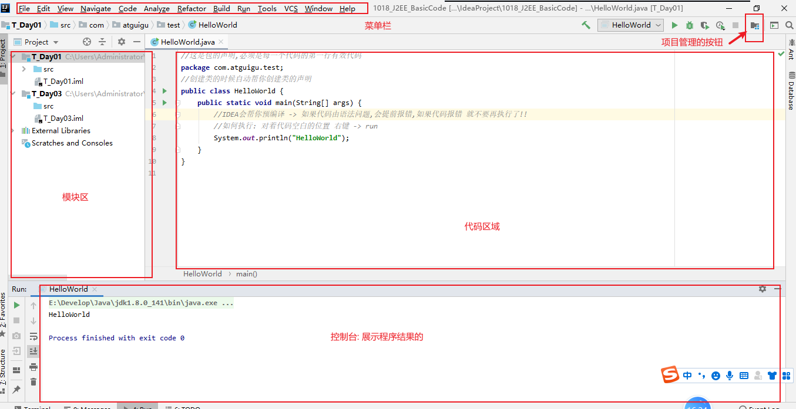

### Day_02随堂笔记

#### 开发工具IDE

```java
IDE: IDE是所有开发工具的统称!
    最早: 记事本
    升级: Nodepad++
    再升级: Eclipse,IDEA...   (高级的开发工具) 
```

#### IDEA的使用

##### 安装IDEA -> 见视频

##### IDEA的项目结构


##### IDEA的常规设置

###### 项目中需要设置的内容


###### 设置项目中的注意事项


###### 如何新建模块


###### 如何新建包


###### IDEA的页面介绍



###### IDEA字体的修改


###### 设置alt+/快捷键


###### 常用快捷键

```java
 main方法的快捷键 :  main / psvm
    输出语句的快捷键 : sout

    快捷键:
        ctrl系列:
            ctrl + a : 全选
            ctrl + c : 复制
            ctrl + x : 剪切
            ctrl + v : 粘贴
            ctrl + z : 撤回
            ctrl + y : 往前进一步
            ctrl + d : 复制一行代码

     移动代码: alt + shift + 上下箭头

     退格 : tab
     往前退格 :  shift + tab

     注释 :
        单行: ctrl + / 取消:再按一次
        多行: ctrl + shift + / 取消:再按一次

     格式化代码 : 让代码变得好看 ,整洁
        ctrl +alt + L (配合 ctrl + a)

     快捷代码:
        .var : 自动接收
        .sout : 打印
```

#### 变量的基本使用

```java
数据类型:
	基本数据类型 : 
		整型: byte , short , int , long
        浮点型: float , double
        字符型: char
        布尔型: boolean
    引用数据类型 :  类,接口,数组,枚举,注解    
        
变量的定义格式:
	数据类型 变量名 = 初始化值;
```

#### 变量使用的注意事项

```java
    变量使用的注意事项:
        1. 规则:
            定义整型变量的时候优先使用int类型
            若定义long类型的变量时,需要在常量值的后面加大写的L
            定义浮点型变量的时候优先使用double类型
            若定义float类型的变量时,需要在常量值的后面加大写的F

            //当常量值没有超过int的表示范围,那么定义的long类型变量在常量值的后面不需要加L
        2. 变量要先定义后使用
        3. 变量只在其定义的大括号内有效 -> 作用域
        4. 在同一个作用域下,不可以有同名的变量 -> 变量名不能重复
                
     变量使用注意事项: 进阶版
        1. 变量未赋值不能直接使用
        2. 变量可以先定义后赋值 (在使用之前赋值即可)
        3. 一句代码可以定义多个变量,但是要求变量的类型相同;            
```

#### 基本数据类型的类型转换

```java
基本数据类型的大小关系:
double > float > long > int > short , char , byte
   // short , char , byte 类型的变量在做运算的时候会自动升级成int类型
   // boolean 类型是不参与这种比较的
    
自动提升 : 大类型接受小类型
    例如 : int num = 100; --> long l = num;
强制转换 : 小类型接受大类型
    例如 : int num = 100; --> byte b = num; //num肯定不干! 报错!
	格式 : 
		小的数据类型 变量名 = (小的数据类型)大类型的值;
		//byte b = (byte) num;

数据是什么类型就拿什么类型接收,不要动不动就强转,会出现精度损失
```

#### 进制

```java
进制 : 进位的制度 (逢几进一)
 
二进制 : 逢2进1 (0,1)   
八进制 : 逢8进1 (0,1,2,3,4,5,6,7)    
十进制 : 逢10进1 (0,1,2,3,4,5,6,7,8,9)  
十六进制 : 逢16进1 (0,1,2,3,4,5,6,7,8,9,A,B,C,D,E,F)   
    
进制之间的转换: 推荐使用计算器   
    
计算机中一切皆字节(字节可以和二进制进行转换)    
    
二进制的运算: -> 源码,反码,补码 
    -> 数要在计算机中运算先转换成二进制,再拿二进制的补码进行运算.算完再把补码转换成源码,显示结果
	1. 正数的原反补是相同的
    2. 负数第一位二进制数代表的是符号位: 1 负数 0 正数
        例如 : int num = 100        
        源码 : 00000000 00000000 00000000 01100100
        反码 : 00000000 00000000 00000000 01100100
        补码 : 00000000 00000000 00000000 01100100  
            
        例如 : -100  
        源码 : 10000000 00000000 00000000 01100100 
        反码 : 11111111 11111111 11111111 10011011//符号位不变,0变1 1变0
        补码 : 11111111 11111111 11111111 10011100//在反码的基础上+1 
            //拿着补码做运算,算完得到结果,再把补码变回源码展示结构
```

##### 强制转换的原理


#### 运算符

```java
运算符:参与运算的符号;

分为:
	算数运算符
    赋值运算符
    关系运算符
    逻辑运算符
    三元运算符    
```

##### 算数运算符

```java
算数运算符 : +,-,*(乘法),/(除法),%(取余,求模) ,++/--
    
注意事项:
        1. %(取余,求模): 求2个数相除的余数
        2. 整数做除法结果一定是整数,要想得到小数必须有小数参与运算
        3. 运算符的优先级: 乘除取余 > 加减
           运算优先级最高的是 小括号
        4. 两种不同类型的数据做运算结果一定是大类型的
        5. 当被除数小于除数的时候,取余的结果等于被除数本身        
```

###### ++/--自增自减运算符

```java
++/-- : 必须要和变量一起使用;
	运算法则: 自增,自减 --> 变量的值+1/变量的值-1,再赋值给原变量!!
        
++,--运算符 可以放在变量的前后:
        1. 单独使用: 放前放后没有影响
        2. 参与运算:
            ++/--在变量的后面 : 先参与运算,再自增/自减
            ++/--在变量的前面 : 先自增/自减,再参与运算

       在实际开发中 , ++/-- 百分之99的情况都是单独使用!        
```

###### 字符类型的数据做运算

```java
char : 字符类型
    
为什么字符类型的数据可以做运算 : 字符类型的数据会依仗一张表,转换成对应的数字,再参与运算;
	例如:	"我爱你中国" 我->100 爱 -> 101 你-> 102.. --> 100101102103104 -> 二进制
   
依仗的表 : 编码表        
    编码表中最基础的表 : ASCII码表 ->(所有编码表的前128个都是ASCII码表)  
        
ASCII码表 : 美国标准信息交换码表  (适用于任何英文国家)  
中国的编码表 : GB系列 -> GB2312 -> GBK  (windows在中国地区默认的编码格式 ANSI -> GBK)
    
    
'0' -> 48 'A' -> 65 'a' -> 97    --> 记录!!
    
 5201314 -程序员表白法(ASCII)-> 53504849514952 
    
 字符类型的数据做运算会先转换成int类型(ASCII码表的值)再参与运算!!   
```


###### 字符串做加法运算

```java
字符串 -> String -> 可以做加法运算 (唯一可以做加法运算的对象!) 
    
        字符串和字符做加法的时候,字符不会转换成数字,而是直接链接!!   
    
字符串做加法结果一定是字符串类型!    
```

#####  赋值运算符

```java
赋值运算符 : = 
    int a = 10; --> 把10赋值给int类型的变量a
        
拓展的赋值运算符: +=,-=,*=,/=,%=  
    
        拓展的赋值运算符的展开式: 隐含了强制类型转换
        num += 值;
        ---> num = (num的数据类型)(num + 值);
```

##### 关系运算符

```java
关系运算符 : 表示数据的关系,被关系运算符链接起来的式子叫关系表达式
    
    关系表达式的结果一定是 boolean 类型的!
    
分类: 
	== : 判断是否相等的  
    != : 判断是否不相等    
    >,>=,<,<=    
```

##### 逻辑运算符

```java
逻辑运算符 : 用来链接关系表达式的!
  生活中:
		0 <= a <= 10; --> 闭合区间
        a <= 0 或者 a >= 10; -->发散区间
         
  //0 <= a <= 10; 在代码中不存在  
            
注意: 逻辑表达式的结果一定是 boolean 类型    
    
分类:
	& : 与
    | : 或
    ^ : 异或    
    ! : 非  
        
    && : 双与
    || : 双或  
        
作用:
	& : 与 -> 并且 : 有false则为false
    | : 或 -> 或者 : 有true则为true
    ^ : 异或 -> 中国的领证关系 : 相同则为false,不同则为true   
    ! : 非 -> 取反 : true 为 false, false 为 true 
```

###### 二进制运算中的逻辑运算符(了解)

```java
1 :  ture
0 :  false    

		System.out.println(7 & 8);//0
						00000000 00000000 00000000 00000111  //7 : 的补码
                            							  &  // 有0则为0
                        00000000 00000000 00000000 00001000  //8 : 的补码  
            -----------------------------------------------                
                        00000000 00000000 00000000 00000000 // 0

        System.out.println(7 | 8);//15
						00000000 00000000 00000000 00000111  //7 : 的补码
                            							  |  // 有1则为1
                        00000000 00000000 00000000 00001000  //8 : 的补码  
            -----------------------------------------------                
                        00000000 00000000 00000000 00001111 // 15	
        System.out.println(7 ^ 8);//15
						00000000 00000000 00000000 00000111  //7 : 的补码
                            							  ^  // 相同则为0 不同则为1
                        00000000 00000000 00000000 00001000  //8 : 的补码  
            -----------------------------------------------  
                        00000000 00000000 00000000 00001111 //15	            
```

###### 二进制的位移运算


