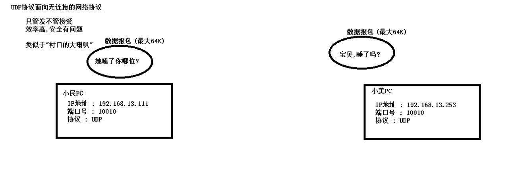
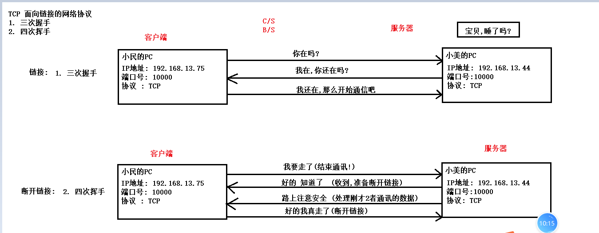

### 网络编程(概念比代码更重要)

#### 网络编程的概述

```java
网络编程实现了 PC 和 PC之间的数据交换;
```

#### 网络编程的三要素

```java
IP地址:PC在网络环境下的地址
端口号: 通讯的软件(软件中的线程)在电脑中的编号
网络协议: UDP/TCP

发快递的三要素:
	收件人的地址 -> IP地址
    收件人姓名和电话 -> 端口号
    选一家快递公司 -> 网络协议  
```

##### IP地址

```java
IP地址:PC在网络环境下的地址
    
IP地址的组成:
	IPV4(32位) : 点分10进制法;  192.168.1.1
        每个点之间能表示的数: 0-255 
        cmd中可以查询当前电脑的ip地址,也可以查看当前电脑的网络连接状态:
			 
            ping ip地址 -> 知道你的电脑的网络连接情况
                建议 ping 网关: 例如-> 192.168.0.1  -> 1号ip就是网关
                255号 : 广播地址;    
    IPV6(64位) : 冒分16进制表示法 fe80:0000:a9ac:af45:2750:e7e3

        
     www.baidu.com -DNS解析器-> 百度服务器的IP地址
```

##### InetAddress

```java
InetAddress : IP地址对象的类
    String host: IP地址/主机名
    static InetAddress getByName(String host) :通过主机名或者IP地址获取IP地址对象 
    static InetAddress[] getAllByName(String host) : 通过主机名或者IP地址获取所有此主机名的IP地址对象 
    快捷的创建对象的方法:
		static InetAddress getLocalHost() : 快速的获取当前主机的IP地址对象
            
InetAddress的成员方法:
	String getHostName()  : 获取IP地址的主机名
    String getHostAddress() : 获取IP地址对象的IP地址   
```

##### 端口号

```java
端口号: 通讯的软件(软件中的线程)在电脑中的编号
    
注意事项:
	1. 取值范围 : 0-65535  (不要选1000以内)
    2. 端口号不能重复 -> BindException
    3. Tomcat:8080/80 MySQL:3306     
```

#### UDP网络协议

```java
UDP -> 面向无连接的网络协议 
    类似于村口的大喇叭
```



##### 发送端

```java
DatagramSocket 类:

构造方法:
	DatagramSocket() : 发送端的构造方法
        
发送数据: send
    void send(DatagramPacket p)
    
DatagramPacket: 数据报包的对象
    构造方法:
		DatagramPacket(byte[] buf, int length, InetAddress address, int port)
关闭资源:
	void close() : 关闭发送端的套接字对象
```

##### 接受端

````java
        构造方法:
            DatagramSocket(int port)
        接受数据:
            void receive(DatagramPacket p)
    接收端数据包的对象:
        DatagramPacket(byte[] buf, int length)
    数据报包中的成员方法 :
        byte[] getData(): 用不着,数据存在我自己创建数组中
        int getLength() : 获取数据的长度!!
        InetAddress getAddress() : 获取发件人的ip地址对象
````

#### TCP网络协议

```java
TCP网络协议 -> 面向链接的网络协议
```



##### 客户端 Client

```java
客户端 Client的类 : Socket
    构造方法:
		Socket(InetAddress address, int port) 
		Socket(String host, int port) :传入字符串类型的主机名/ip地址创建TCP客户端对象
            
    成员方法: TCP协议传输都是获取流对象进行传输 -> 而通讯的流对象一定是Socket对象获取
		OutputStream getOutputStream()  
```

##### 服务端 Server

```java
服务端 Server的类 :
	构造方法:
		ServerSocket(int port) 
	
    成员方法:
		Socket accept()  : 监听
```

