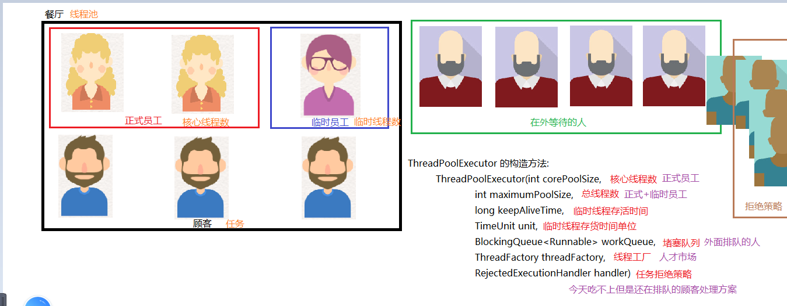
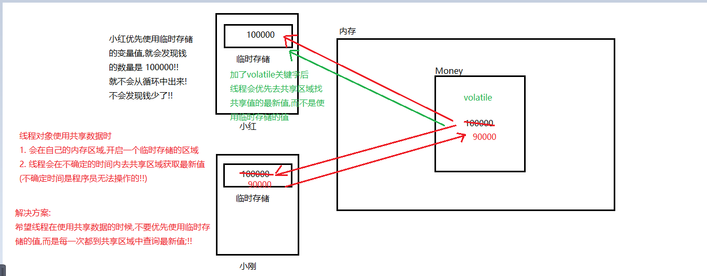
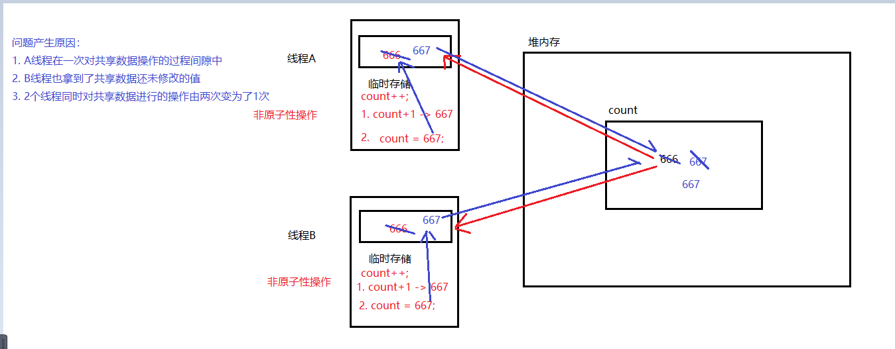
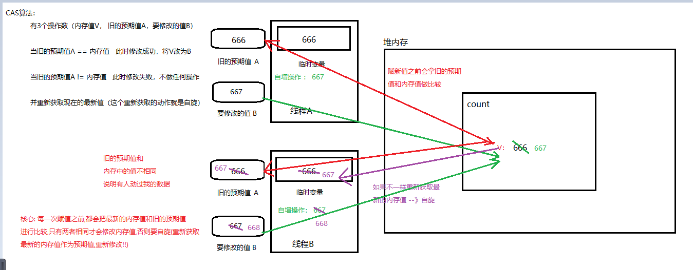
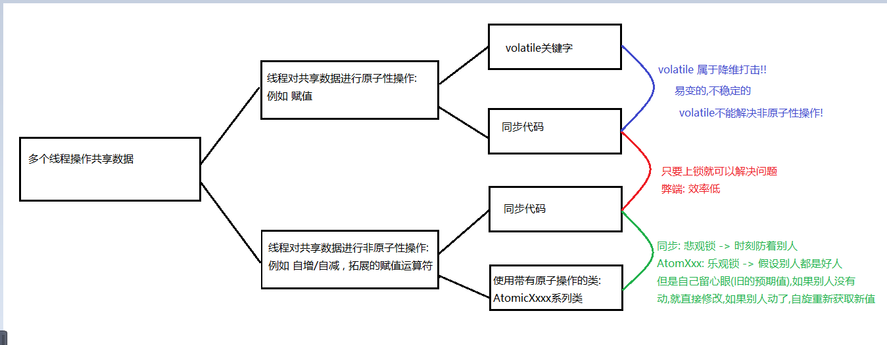

### Day_21随堂笔记

#### 线程的生命周期

```java
NEW : 新建 
BLOCKED : 阻塞 (有执行资格,可能没有锁或者CPU资源)
WAITING : 无限等待 (没有执行资格,被调用wait())  ---> notify(),notifyAll() 唤醒 
TIMED-WAITING : 限时等待 (没有执行资格,被调用了wait(long timeout)[释放锁和CPU],sleep(long millis)[只释放CPU执行权])  ---> notify(),notifyAll() 唤醒   
RUNNABLE : 运行状态(有锁,有CPU资源)
TERMINATED : 死亡    
```

#### 等待唤醒案例

```java
等待唤醒案例,生产者消费者案例,线程之间的通讯    
```

#### 线程池

```java
线程 : 线程对象
池 : 游泳池,水池  
    
线程池 : 装了线程对象的池子  -->  ThreadPoolExecutor  线程池的类 
```

##### 面向对象方式实现线程池对象(重要)

```java
工具类 : Executors
 
通过静态方法能得到线程池对象    
静态方法:
	static ExecutorService newCachedThreadPool() : 获取一个无上限线程数量的线程池对象 
        //无上限 : int 的最大值
    static ExecutorService newFixedThreadPool(int nThreads) 获取一个指定最大线程数量的线程池对象  
  //如果有任务提交给线程池,线程池才会在内部创建线程对象      

ExecutorService 对象的功能:
	Future<T> submit(Callable<T> task)  
    Future<?> submit(Runnable task)
    Future<T> submit(Runnable task, T result)       
```

#### ---------------------------以下是理论,要听懂!---------------------------

##### 面向过程方式实现线程池对象 (理解)

```java
ThreadPoolExecutor 的构造方法:
	ThreadPoolExecutor(int corePoolSize, 
                       int maximumPoolSize, 
                       long keepAliveTime, 
                       TimeUnit unit, 
                       BlockingQueue<Runnable> workQueue, 
                       ThreadFactory threadFactory, 
                       RejectedExecutionHandler handler) 
```



##### TimeUnit

```java
TimeUnit : 时间单位的枚举类
 
枚举对象: 枚举项
    DAYS             
    HOURS            
    MICROSECONDS            
    MILLISECONDS            
    MINUTES           
    NANOSECONDS            
    SECONDS
        
如何使用: 枚举类名.枚举项        
```

##### BlockingQueue<E>

```java
BlockingQueue<E> 集合(接口) --> 阻塞队列 
    
具体使用的实现类 :ArrayBlockingQueue<E>    
    ArrayBlockingQueue(int capacity) : 参数是队列的容量
    
特殊的成员方法:
	 void put(E e)  : 往队列中添加一个元素

     E take() : 从队列的头部取出一个元素
```

##### ThreadFactory

```java
ThreadFactory: 线程工厂 (员工从哪里来 --> 人才市场)
     
如何创建ThreadFactory对象: Executors : static ThreadFactory defaultThreadFactory()  
	Executors.defaultThreadFactory()  
```

##### RejectedExecutionHandler

```java
RejectedExecutionHandler :  任务拒绝策略
    
ThreadPoolExecutor类中的静态内部类得到:    
    ThreadPoolExecutor.AbortPolicy : 
			默认的 -> 拒绝阻塞队列外的等待线程,并抛出异常RejectedExecutionException
    ThreadPoolExecutor.DiscardPolicy 
            不推荐 -> 拒绝阻塞队列外的等待线程,不抛异常
    ThreadPoolExecutor.DiscardOldestPolicy 
            抛弃队列中的某个任务,从阻塞队列外中选取一个等待最久的线程任务加入阻塞队列    
    ThreadPoolExecutor.CallerRunsPolicy
            把阻塞队列外其他的线程任务交付给其他线程完成     
```

#### ThreadPoolExecutor的七个参数注意事项

```java
ThreadPoolExecutor(int corePoolSize,  //核心线程数 >=0
                       int maximumPoolSize,  //最大线程数 >= 核心线程数
                       long keepAliveTime,// 等待时间 >=0 
                       TimeUnit unit, //时间单位
                       BlockingQueue<Runnable> workQueue, // 不能为null
                       ThreadFactory threadFactory, // 不能为null
                       RejectedExecutionHandler handler)  //不能为null
```

##### 自定义线程池对象实现

```java
//threadPool 线程池 一共能处理多少个线程任务 : 总线程数+等待队列的容量
        ThreadPoolExecutor threadPool = new ThreadPoolExecutor(2,//核心
                3,//总
                20, //时间
                TimeUnit.SECONDS,//时间单位
                new ArrayBlockingQueue<>(1),//排队的人
                Executors.defaultThreadFactory(),//线程工厂
                new ThreadPoolExecutor.CallerRunsPolicy());//拒绝策略, 线程池处理不了,找其他线程对象处理

        for (int i = 1; i <= 5; i++) {
            final int j = i;
            threadPool.submit(new Runnable() {
                @Override
                public void run() {
                    System.out.println(Thread.currentThread().getName() + "World" + j);
                }
            });
        }

        //关闭线程池
        threadPool.shutdown();
```

#### volatile关键字

```java
volatile 关键字 : 不稳定,易变的
    
 用来修饰变量 : 被修饰的变量就变成了 不稳定的,易变的变量   --> 提醒线程,遇到这样的变量要"小心"!!
```

##### 问题代码

```java
  //事物描述类
  public class Money {
      public static int money = 100000;
      //解决方案1:
      //public static volatile int money = 100000;
  }

	//线程1: 小红
	public class MyThread1 extends  Thread {
      @Override
      public void run() {
          while(Money.money == 100000){

          }

          System.out.println("结婚基金已经不是十万了");
      }
  }

	//线程2: 小刚
	public class MyThread2 extends Thread {
      @Override
      public void run() {
          try {
              Thread.sleep(10);
          } catch (InterruptedException e) {
              e.printStackTrace();
          }

          Money.money = 90000;
      }
  }

	//测试类
	public class Demo {
      public static void main(String[] args) {
          MyThread1 t1 = new MyThread1();
          t1.setName("小红");
          t1.start();

          MyThread2 t2 = new MyThread2();
          t2.setName("小刚");
          t2.start();
      }
  }


问题分析：
  女孩虽然知道结婚基金是十万，但是当基金的余额发生变化的时候，女孩无法知道最新的余额。
  
  
以上案例出现的问题:

当A线程修改了共享数据时，B线程没有及时获取到最新的值，如果还在使用原先的值，就会出现问题 

	1 ，堆内存是唯一的，每一个线程都有自己的线程栈。

    2 ，每一个线程在使用堆里面变量的时候，都会先拷贝一份到变量的副本中。

	3 ，在线程中，每一次使用是从变量的副本中获取的。  
    	//线程什么时候会去取用内存中的值,无法控制!!
```

###### 内存分析



###### synchronized解决

​	1 ，线程获得锁

​	2 ，清空变量副本 --> 最重要的步骤

​	3 ，拷贝共享变量最新的值到变量副本中

​	4 ，执行代码

​	5 ，将修改后变量副本中的值赋值给共享数据

​	6 ，释放锁

**代码实现 :** 

```java
public class Money {
    public static Object lock = new Object();
    public static volatile int money = 100000;
}

//小红
public class MyThread1 extends  Thread {
    @Override
    public void run() {
        while(true){
            synchronized (Money.lock){
                if(Money.money != 100000){
                    System.out.println("结婚基金已经不是十万了");
                    break;
                }
            }
        }
    }
}

//小刚
public class MyThread2 extends Thread {
    @Override
    public void run() {
        synchronized (Money.lock) {
            try {
                Thread.sleep(10);
            } catch (InterruptedException e) {
                e.printStackTrace();
            }

            Money.money = 90000;
        }
    }
}


public class Demo {
    public static void main(String[] args) {
        MyThread1 t1 = new MyThread1();
        t1.setName("小红");
        t1.start();

        MyThread2 t2 = new MyThread2();
        t2.setName("小刚");
        t2.start();
    }
}
```

##### volatile关键字解决

> **Volatile关键字 :** 强制线程每次在使用共有数据的时候，都会看一下共享区域最新的值

```java
代码实现：
public class Money {
    public static volatile int money = 100000;
}

//小红
public class MyThread1 extends  Thread {
    @Override
    public void run() {
        while(Money.money == 100000){

        }

        System.out.println("结婚基金已经不是十万了");
    }
}

//小刚
public class MyThread2 extends Thread {
    @Override
    public void run() {
        try {
            Thread.sleep(10);
        } catch (InterruptedException e) {
            e.printStackTrace();
        }

        //原子性操作
        Money.money = 90000;
    }
}

public class Demo {
    public static void main(String[] args) {
        MyThread1 t1 = new MyThread1();
        t1.setName("小红");
        t1.start();

        MyThread2 t2 = new MyThread2();
        t2.setName("小刚");
        t2.start();
    }
}
```

#### 原子性-Atom

```java
原子性: 不能分割的一种特性
    
原子性操作 :  一次操作要么不做,要么一定要做完,中途不可以分割!!
    例如 : 赋值操作
        int a = 10; --> 原子性操作
            
非原子性操作 :  一次操作可以分割的操作!!
    例如 : 
		1. 拓展的赋值运算符 
            a += 10; --> 第一步 : a + 10;  第二步: a = a的新值;
		2. ++/--
            a++; --> 第一步 : a自增 第二步 : 把自增后的值赋值给a
            
public class AtomDemo {
    public static void main(String[] args) {
        //创建任务对象
        Target target = new Target();
        //创建100次线程对象 100个线程对象每个人送100次
        for (int i = 0; i < 1000; i++) {
            new Thread(target).start();
        }
    }
}


class Target implements Runnable{
    private int count = 0; //送冰淇淋的数量

    @Override
    public void run() {
        for (int i = 0; i < 1000; i++) {
            //1,从共享数据中读取数据到本线程栈中.
            //2,修改本线程栈中变量副本的值
            //3,会把本线程栈中变量副本的值赋值给共享数据.
            count++;//非原子性的操作
            System.out.println("已经送了" + count + "个冰淇淋");
        }
    }
}            
```

##### 非原子性操作的问题内存图



##### volatile关键字不能保证原子性

```java
//原因: volatile关键字只能保证 多线程环境下使用共享数据原子性操作的安全问题!!

//代码演示：
public class AtomDemo {
    public static void main(String[] args) {
        MyAtomThread atom = new MyAtomThread();

        for (int i = 0; i < 100; i++) {
            new Thread(atom).start();
        }
    }
}

class MyAtomThread implements Runnable {
    private volatile int count = 0; //送冰淇淋的数量
		//private int count = 0; //送冰淇淋的数量
  
    @Override
    public void run() {
        for (int i = 0; i < 100; i++) {
            //1,从共享数据中读取数据到本线程栈中.
            //2,修改本线程栈中变量副本的值
            //3,会把本线程栈中变量副本的值赋值给共享数据.
            count++;
            System.out.println("已经送了" + count + "个冰淇淋");
        }
    }
}
```

##### 解决方案1:上锁

```java
package com.atguigu.atom;

public class AtomDemo1 {
    public static void main(String[] args) {
        //创建任务对象
        Target1 t = new Target1();
        //创建线程对象
        for (int i = 0; i < 1000; i++) {
            new Thread(t).start();
        }
    }
}


class Target1 implements Runnable{
    private int count = 0; //送冰淇淋的数量
    private Object obj = new Object();

    @Override
    public void run() {
        for (int i = 0; i < 1000; i++) {
            //解决方案1: 对原子性的操作进行上锁
            synchronized (obj){
                count++;//非原子性的操作
                System.out.println("已经送了" + count + "个冰淇淋");
            }
        }
    }
}
```

##### 解决方案2:使用原子性类_AtomicXxxxx

```java
概述：Java从JDK1.5开始提供了java.util.concurrent.atomic包(简称Atomic包)，这个包中的原子操作类提供了一种用法简单，性能高效，线程安全地更新一个变量的方式。(CAS算法 + 自旋)
    因为变量(共享数据)的类型有很多种，所以在Atomic包里一共提供了13个类，属于4种类型的原子更新方式，分别是原子更新基本类型、原子更新数组、原子更新引用和原子更新属性(字段)。
  
本次我们只讲解使用原子的方式更新基本类型，使用原子的方式更新基本类型Atomic包提供了以下3个类：  
  1. AtomicBoolean：原子更新布尔类型
  2. AtomicInteger：原子更新整型
  3. AtomicLong：原子更新长整型
```

###### AtomicInteger的构造方法和成员方法

```java
//构造方法：
public AtomicInteger()：初始化一个默认值为0的原子型Integer
public AtomicInteger(int initialValue)：初始化一个指定值的原子型Integer

  
//成员方法：
int get(): 获取值
int getAndIncrement():以原子方式将当前值加1，注意，这里返回的是自增前的值。 b=a++;
int incrementAndGet():以原子方式将当前值加1，注意，这里返回的是自增后的值。 b=++a;
int addAndGet(int data):以原子方式将输入的数值与实例中的值（AtomicInteger里的value）相加，并返回结果。
int getAndSet(int value):以原子方式设置为newValue的值，并返回旧值。
```

###### AtomicInteger-内存解析

```java
package com.atguigu.atom;

import java.util.concurrent.atomic.AtomicInteger;

public class AtomDemo2 {
    public static void main(String[] args) {
        //只创建一次任务对象保证了共享数据的唯一性和锁对象的唯一性
        Target1 target = new Target1();
        for (int i = 0; i < 1000; i++) {
            new Thread(target).start();
        }
    }
}

class Target2 implements Runnable{
   AtomicInteger ac = new AtomicInteger();//0

    @Override
    public void run() {
        for (int i = 0; i < 1000; i++) {
            //解决方案2: 使用原子性的类
            int count = ac.incrementAndGet();//先自增后赋值
            System.out.println("已经送了" + count + "个冰淇淋");
        }
    }
}

AtomicInteger原理 : 自旋锁  + CAS 算法

CAS算法：
	有3个操作数（内存值V， 旧的预期值A，要修改的值B）

​	当旧的预期值A == 内存值   此时修改成功，将V改为B                 

​	当旧的预期值A != 内存值   此时修改失败，不做任何操作                 

​	并重新获取现在的最新值（这个重新获取的动作就是自旋）  
```

###### CAS算法和自旋的内存图



#### 线程安全问题的总结



#### 悲观锁和乐观锁

**synchronized和CAS的区别 :** 

**相同点：**在多线程情况下，都可以保证共享数据的安全性。

**不同点：**

1. synchronized总是从最坏的角度出发，认为每次获取数据的时候，别人都有可能修改。所以在每                       次操作共享数据之前，都会上锁。（悲观锁）

2. cas是从乐观的角度出发，假设每次获取数据别人都不会修改，所以不会上锁。只不过在修改共享数据的时候，会检查一下，别人有没有修改过这个数据。
   1. 如果别人修改过，那么我再次获取现在最新的值。            
   2. 如果别人没有修改过，那么我现在直接修改共享数据的值.(乐观锁）

#### 死锁

```java
//死锁实现代码:
package com.atguigu.deathlock;

public class DeathLockDemo {
    public static void main(String[] args) {
        //准备2把锁
        Object objA = new Object();
        Object objB = new Object();

        //准备2个线程
        new Thread(new Runnable() {
            @Override
            public void run() {
                while(true){
                    synchronized (objA){//小康遇到的第一把锁
                        synchronized (objB){//小康遇到的第二把锁
                            System.out.println("紫薇 不要走~");
                        }
                    }
                }
            }
        }).start();//小康


        new Thread(new Runnable() {
            @Override
            public void run() {
                while(true){
                    synchronized (objB){//小薇遇到的第一把锁
                        synchronized (objA){//小薇遇到的第二把锁
                            System.out.println("尔康 我不想留~");
                        }
                    }
                }
            }
        }).start();//小薇
    }
}

```

###### 死锁的内存图


#### 封装好多线程安全的类

##### Hashtable<K,V>

```java
HashMap<K,V>在多线程情况下是不安全的；

为了保证数据的安全性我们可以使用Hashtable，但是Hashtable的效率低下。（被替换）
  
//案例演示：
public static void main(String[] args) throws InterruptedException {
        //HashMap<String,String> hm = new HashMap<>();
        Hashtable<String, String> hm = new Hashtable<>();

        Thread t1 = new Thread(new Runnable() {
            @Override
            public void run() {
                for (int i = 0; i < 250; i++) {
                    hm.put(i + "", i + "");//双列集合的0-24个元素赋值 0-0 1-1 2-2
                }
            }
        });


        Thread t2 = new Thread(new Runnable() {
            @Override
            public void run() {
                for (int i = 250; i < 501; i++) {
                    hm.put(i + "", i + "");//双列集合的25-50个元素赋值 25-25
                }
            }
        });

        t1.start();
        t2.start();

        System.out.println("----------------------------");
        //为了t1和t2能把数据全部添加完毕
        Thread.sleep(2000);

        //0-0 1-1 ..... 50- 50

        for (int i = 0; i < 501; i++) {
            System.out.println(hm.get(i + ""));
        }//0 1 2 3 .... 50
    }

Hashtable中所有的方法都被同步修饰,那么当线程操作集合时,锁会把集合的底层数组全部锁起来,不让其他的线程去操作
    
但是因为效率低下,推荐使用ConcurrentHashMap完成双列集合多线程情况下线程安全的操作!!
```

##### ConcurrentHashMap<K,V>

```java
ConcurrentHashMap出现的原因 : 
	1. 在集合类中HashMap是比较常用的集合对象，但是HashMap是线程不安全的(多线程环境下可能会存在问题)。
    2. 为了保证数据的安全性我们可以使用Hashtable，但是Hashtable的效率低下。

基于以上两个原因我们可以使用JDK1.5以后所提供的ConcurrentHashMap。
        
public class ConcurrentHashMapDemo {
    public static void main(String[] args) throws InterruptedException {
        //100是初始容量
        ConcurrentHashMap<String, String> hm = new ConcurrentHashMap<>(600);

        Thread t1 = new Thread(() -> {
            for (int i = 0; i < 250; i++) {
                hm.put(i + "", i + "");
            }
        });


        Thread t2 = new Thread(() -> {
            for (int i = 250; i < 501; i++) {
                hm.put(i + "", i + "");
            }
        });

        t1.start();
        t2.start();

        System.out.println("----------------------------");
        //为了t1和t2能把数据全部添加完毕
        Thread.sleep(1000);

        //0-0 1-1 ..... 50- 50

        for (int i = 0; i < 501; i++) {
            System.out.println(hm.get(i + ""));
        }//0 1 2 3 .... 50
    }
}

总结 ：
​	1 ，HashMap是线程不安全的。多线程环境下会有数据安全问题

​	2 ，Hashtable是线程安全的，但是会将整张表锁起来，效率低下

​	3，ConcurrentHashMap也是线程安全的，效率较高。
  
在JDK7和JDK8中，底层原理不一样。
  	//如果使用空参构造创建ConcurrentHashMap对象，则什么事情都不做。
  	//第一次添加元素，默认创建一个底层长度为16，加载因子是0.75的Hash表的大数组，这个大数组一旦创建长度不能修改。
  	1.7: 底层Hash结构-> 数组+链表+同步代码块锁当前被操作的hash地址
    1.8: 原理同7，当链表的长度大于等于8时，自动转换成红黑树。
```

##### CountDownLatch类 : 		

| 方法                             | 解释                             |
| -------------------------------- | -------------------------------- |
| public CountDownLatch(int count) | 参数传递线程数，表示等待线程数量 |
| public void await()              | 让线程等待                       |
| public void countDown()          | 当前线程执行完毕                 |

**使用场景：** 让某一条线程等待其他线程执行完毕之后再执行

**代码实现 :** 

```java
package com.atguigu.countdownlatch;

import java.util.concurrent.CountDownLatch;

public class CountDownLatchDemo {
    public static void main(String[] args) {
        //创建countDownLatch对象
        CountDownLatch countDownLatch = new CountDownLatch(3);

        //创建孩子线程和妈妈线程并启动
        ChildThread1 t1 = new ChildThread1(countDownLatch,"大娃");
        ChildThread2 t2 = new ChildThread2(countDownLatch,"二娃");
        ChildThread3 t3 = new ChildThread3(countDownLatch,"三娃");
        
        MotherThread motherThread = new MotherThread(countDownLatch,"雅典娜");

        motherThread.start();
        t1.start();
        t2.start();
        t3.start();
    }
}

//孩子线程1
class ChildThread1 extends Thread {

    private CountDownLatch countDownLatch;

    public ChildThread1(CountDownLatch countDownLatch,String name) {
        super(name);
        this.countDownLatch = countDownLatch;
    }
    @Override
    public void run() {
        //1.吃饺子
        for (int i = 1; i <= 10; i++) {
            System.out.println(getName() + "在吃第" + i + "个饺子");
        }
        //2.吃完说一声
        //每一次countDown方法的时候，就让计数器-1
        countDownLatch.countDown();
    }
}

//孩子线程2
class ChildThread2 extends Thread {

    private CountDownLatch countDownLatch;

    public ChildThread2(CountDownLatch countDownLatch,String name) {
        super(name);
        this.countDownLatch = countDownLatch;
    }
    @Override
    public void run() {
        //1.吃饺子
        for (int i = 1; i <= 20; i++) {
            System.out.println(getName() + "在吃第" + i + "个饺子");
        }
        //2.吃完说一声
        //每一次countDown方法的时候，就让计数器-1
        countDownLatch.countDown();
    }
}

//孩子线程3
class ChildThread3 extends Thread {

    private CountDownLatch countDownLatch;

    public ChildThread3(CountDownLatch countDownLatch,String name) {
        super(name);
        this.countDownLatch = countDownLatch;
    }
    @Override
    public void run() {
        //1.吃饺子
        for (int i = 1; i <= 15; i++) {
            System.out.println(getName() + "在吃第" + i + "个饺子");
        }
        //2.吃完说一声
        //每一次countDown方法的时候，就让计数器-1
        countDownLatch.countDown();
    }
}

//妈妈线程
class MotherThread extends Thread {
    private CountDownLatch countDownLatch;

    public MotherThread(CountDownLatch countDownLatch,String name) {
        super(name);
        this.countDownLatch = countDownLatch;
    }
    @Override
    public void run() {
        //1.等待
        try {
            //当计数器变成0的时候，会自动唤醒这里等待的线程。
            countDownLatch.await();
        } catch (InterruptedException e) {
            e.printStackTrace();
        }
        //2.收拾碗筷
        System.out.println("妈妈在收拾碗筷");
    }
}
```

**总结 :** 

​	1. CountDownLatch(int count)：参数写等待线程的数量。并定义了一个计数器。

​	2. await()：让线程等待，当计数器为0时，会唤醒等待的线程

​	3. countDown()： 线程执行完毕时调用，会将计数器-1。

##### Semaphore类

**使用场景 :** 

​	可以控制访问特定资源的线程数量。

**实现步骤 :** 

​	1，需要有人管理这个通道

​	2，当有车进来了，发通行许可证

​	3，当车出去了，收回通行许可证

​	4，如果通行许可证发完了，那么其他车辆只能等着

**代码实现 :** 

```java
//线程任务对象
public class MyRunnable implements Runnable {
    //1.获得管理员对象，
    private Semaphore semaphore = new Semaphore(2);
    @Override
    public void run() {
        //2.获得通行证
        try {
            semaphore.acquire();
            //3.开始行驶
            System.out.println("获得了通行证开始行驶");
            Thread.sleep(2000);
            System.out.println("归还通行证");
            //4.归还通行证
            semaphore.release();
        } catch (InterruptedException e) {
            e.printStackTrace();
        }
    }
}

public class MySemaphoreDemo {
    public static void main(String[] args) {
        MyRunnable mr = new MyRunnable();

        for (int i = 0; i < 100; i++) {
            new Thread(mr).start();
        }
    }
}
```
