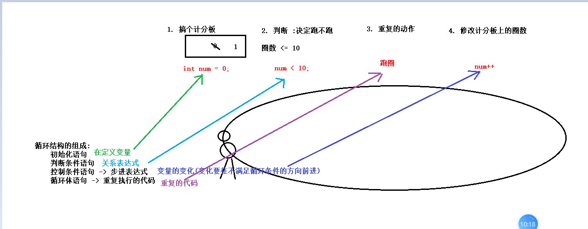
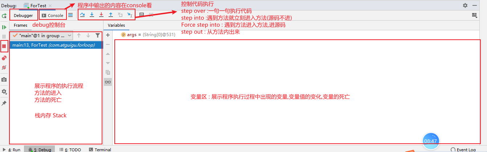

### Day_03随堂笔记

#### 运算符

```java
算数运算符:  +,-,/,*,%,++/--
    1. 整数做运算,结果一定是整数;
	2. 2种不一样的类型做运算,结果是大的数据类型
    3. short,byte,char 变量在做运算的时候会自动提示至int    
    4. char 类型数据做运算 会根据 ASCII 码表找到对应的数值进行运算
    5. 字符串可以做加法,本质是链接,拼接
    6. % : 求2个数相除的余数    
赋值运算符: = 
	拓展的赋值运算符 : +=,-=,/=,*=,%=
        a += 10; 展开式 : a = (a的类型)(a + 值);
	注意：
		拓展运算符都带有强转；
关系运算符 : ==,!=,>,>=,<,<= 
    关系表达式的结果一定是布尔类型, true,false
逻辑运算符 : 链接关系表达式的,结果也一定是布尔类型
    &: 并且 -> 有false则为false
	|: 或者 -> 有true则为true
	^: 异或 -> 相同则为false,不同则为true
	!: 取反 -> true则false,false则true
        
    &&:
	||:
三元运算符    
```

##### 逻辑运算符 :&& 和 ||

```java
运算法则:
	&&: 有false则为false
	||: 有true则为true
        
为什么有 && 和 || ?       
     && 和 || 有短路效果,提高代码的效率    
        
短路效果:
	&& : 左边为false,右边不执行!
    || : 左边为true,右边不执行!
        
以后只要用到逻辑与和逻辑或 就用 && 和 ||;        
```

##### 三元运算符

```java
元 : 板块
    
一元运算符 : ++/--
二元运算符 : 基本上都是二元
    
三元运算符 : 
	格式 : 结果的数据类型 变量名 = 关系表达式 ? 表达式1 : 表达式2;
	执行流程 : 
		1. 计算关系表达式的结果 (true 和 false)
        2. 如果关系表达式的结果是 true, 三元运算符的结果就是 表达式1的结果;
		3. 如果关系表达式的结果是 false, 三元运算符的结果就是 表达式2的结果;

注意:
	1. 表达式不可以写太复杂的内容;
	2. 三元运算符记得接收结果;
```

#### 键盘录入数据功能

```java
Scanner : 文本扫描器 能完成键盘数据到Java代码的过程;

使用步骤:
	1. 导包 import java.util.Scanner; // 我们使用IDEA开发不需要手动导包!
	2. 创建对象 : Scanner 对象名 = new Scanner(System.in);
	3. 接受数据 : 
			//录入一个整数:
			int 变量名 = 对象名.nextInt();
```

#### 流程控制

#### 顺序结构

```java
顺序结构 : 百分之99的代码都是按照此流程来进行执行的!
    
1. 从main方法进入
2. 从上至下,从左至右执行代码    
```

#### 选择结构

##### if结构(重点)

```java
if : 如果,假如 
    
if 的第一种格式:
	// 假如 () 内成立了 -> true
	if(结果为boolean类型的式子){
        //我该做什么
        语句体;
    }
	其他代码;
	
	执行流程:
		1. 判断小括号内式子的结果
        2. 如果为true,执行大括号内的语句体; 当语句体执行完执行if结构后面的其他代码;
		3. 如果为false,不执行大括号内的语句体;执行if结构后面的代码;

	if 的第一种格式是对 1 种情况的判断!!
        
    伪代码: 
		if(小丽来不来){
            //小丽来
            去小树林走走;
        }

if 第二种格式:
	// 假如 () 内成立了 -> true
	if(结果为boolean类型的式子){
        //我该做什么
        语句体1;
    }else{
        //假如 () 内不成立 -> false
        //我该做什么
        语句体2;
    }
	其他代码;

	执行流程:
		1. 判断小括号内式子的结果
        2. 如果为true,执行大括号内的语句体1; 当语句体1执行完执行if结构后面的其他代码;
		3. 如果为false,执行else大括号内的语句体2;当语句体2执行完执行if结构后面的其他代码;

	if 的第二种格式是对 2 种情况的判断!!
        
    伪代码: 
		if(小丽来不来){
            //小丽来
            去小树林走走;
        }else{
            //小丽不来
            约小丽闺蜜小红;
        }

if 的第三种格式 -> 完整格式
    格式:
		if(结果为boolean类型的式子1){//情况1
            //情况1满足
            语句体1;
        }else if(结果为boolean类型的式子1){ //情况2
            //情况1不满足且情况2满足
            语句体2;
        }...很多else if..
		else{
            //以上情况都不满足,若有else 才执行else中的语句体;
            语句体;
        }
		其他代码;
	执行流程:
		1. 判断表达式1的结果,若为true执行语句体1,执行完语句体1执行if后面的其他代码;
		2. 若表达式1的结果是false,表达式2的结果是true,执行语句体2,执行完语句体2执行if后面的其他代码;
		3. 若表达式2的结果是false .. 判断表达式2下面的表达式n.. 
        4. 若所有的表达式的结果都是false,执行else中的语句体;else语句体执行完毕执行if后面的其他代码;

	if 的第三种格式可以处理 n 种情况;

	伪代码
		if(小丽来不来){
            //小丽来
            去小树林走走;
        }else if(小丽和闺蜜一起来?){
            //和闺蜜一起来
            一起去小树林走走;
        }else if(小丽和他男朋友一起来?){
            //小丽带着他男朋友一起来
            和他男朋友去网吧打游戏;
        }else{
            //小丽压根没来
            约闺蜜小红;
        }
            
注意:
	1. if 结构并不会阻止程序向下运行!
    2. if的大括号都能省略,但是只能控制离他最近的一句有效代码
```

##### switch结构(理解)

```java
switch : 分支 , 开关
    
格式:
	switch(表达式){
        case 值1:
            语句体1;
            break;
        case 值2:
            语句体2;
            break;
        case 值3:
            语句体3;
            break;
        case 值4:
            语句体4;
            break;  
         ...这里可以写很多case...
        default:
            语句体n+1;
            break;
    }

格式解释:
	switch : 分支结构,switch 结构
    表达式 : 
		1. 只能是变量
        2. 只能是 byte,short,char,int,String,枚举类型   
    case : 事件 
    值 : 
		1. 常量
        2. 类型必须和表达式的类型一致
        3. 值与值之间不可以重复
    语句体 : 需要执行的代码
    break : 中断,打断 -> 结束switch语句    
    default : 缺省的,默认的 -> 当所有的case都不匹配,进入到default中       
        
 执行流程:
	1. 计算表达式的值;
	2. 从上至下依次和case后面的值进行比较 (比较是否相等)
    3. 若相等了,进入到当前的case中,执行case中的语句体  
    4. 遇到break结束switch语句,没有遇到break ???
    5. 若所有的case后的值和表达式的结果都不相等,若有default,执行default中的语句体n+1;    


case 穿透 : 弊大于利 -> 写switch一定要记得加 break;
	当case中没有写break,代码会击穿执行下一个case中的语句体,直到遇到break或者switch的结束括号,结束switch;case穿透适合用来累加满月天数，表达式为月份，累加上一个月的满月天数，其中月份倒序;
```

#### 循环结构

```java
循环结构 : 重复的去做某件相同的事情 -> 可能会影响程序往后执行 

 Java中的循环结构:
	for 循环
    while 循环
    do .. while 循环    
        
循环结构的组成:
	初始化语句
    判断条件语句
    控制条件语句 -> 步进表达式
    循环体语句 -> 重复执行的代码    
```



##### for循环

```java
格式:
	for(初始化语句1;判断条件语句2;控制条件语句3){
        循环体语句4;
    }

格式解释:
	初始化语句: 定义变量 -> 变量用来控制循环,定义一次!!
    判断条件语句: boolean类型的式子 -> 决定循环执行不执行
    控制条件语句: 初始化语句变量的变化 -> 变量的变化要往不满足循环条件的方向前进
    循环体语句: 重复执行的代码    
        
执行流程:
	1. 执行初始化语句
    2. 执行判断条件语句
        若为false,结束循环
    3. 判断条件语句若为true,执行循环体语句
    4. 执行控制条件语句
    5. 从第二步骤开始循环执行
        
执行流程代码:
	1 -> 2 -true-> 4 -> 3 -> 2 -true-> 4 -> 3 -> 2 -true-> 4 -> 3....
           -false->结束         -false->结束         -false->结束
```

#### 输出语句

```java
    System.out.println("111"); -> 打印111并换行
    System.out.println(); -> 换行
    System.out.print("111"); -> 打印111不换行
    System.out.print(); -> 报错!!

    "\r\n" -> 换行符
    "\t" -> 制表符 退格

    \ : 转义符
```

#### 断点调试 -> debug

```java
bug : 甲虫
de : 抵抗,相反的
buff :增益效果  
debuff : 减益效果    
debug : 解决bug 
    
高级的IDE中都有debug模式 : 能够一句一句的让代码执行,从而查看代码流程,找出问题所在;

debug的步骤:
	1. 打断点 : 
		如何打断点: 在行号的位置点一下,取消再点一次
        在哪打断点: 哪里不会点哪里(一个方法内点一次,不要点到注释上)    
    2. 断点调试代码 :  dubug as .. -> 弹出debug控制台
    3. 一步一步的执行代码 : step over (F8)   
    4. 弄完停止debug    
```



