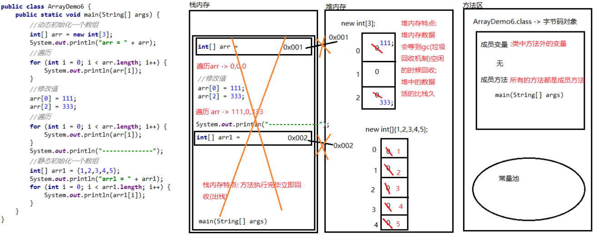

### Day_04随堂笔记

#### 循环结构

```java
初始化语句;
判断条件语句;
控制条件语句;
循环体语句;
```

##### while循环

```java
格式:
	初始化语句;1
	while(判断条件语句 2){
        循环体语句;4
        控制条件语句;3    
    }

执行流程:
	1. 执行初始化语句
    2. 执行判断条件语句
        若为false,结束循环
    3. 判断条件语句若为true,执行循环体语句
    4. 执行控制条件语句
    5. 从第二步骤开始循环执行
        
执行流程代码:
	1 -> 2 -true-> 4 -> 3 -> 2 -true-> 4 -> 3 -> 2 -true-> 4 -> 3....
           -false->结束         -false->结束         -false->结束
        
 //while循环和for循环可以相互转换!!       
```

##### do..while循环(了解)

```java
格式:
	初始化语句;1
    do{
        循环体语句;2
        步进表达式(控制循环语句);3
    }while(判断条件语句4);

执行流程:
	1. 执行初始化语句
    2. 执行循环体语句
    3. 执行步进表达式
    4. 执行判断条件语句
        若为false,结束循环
    5. 若判断条件语句结果为true,执行循环体语句
    6. 从第二步开始循环执行  
        
  // 无论如何都会执行一次循环体语句!!! 
        
 执行流程代码:
	1 -> 2 -> 3 -> 4 -true-> 2 -> 3 -> 4 -true-> 2.....
        			 -false-> 结束循环     -false-> 结束循环
```

#### 三种循环的区别和使用场景

```java
    三种循环之间都可以相互转换!!

	for循环 和 while循环,do..while循环的区别:
        for定义的初始化语句变量只在for循环内有效,出了循环就无效了
    do..while循环 和 while循环,for循环的区别:
        do..while循环无论如何都会执行一次循环体语句,for循环和while循环必须满足循环条件才能执行  
            
 使用场景:
	1. do..while 能不用就不用;
	2. for 循环: 当你明确循环的次数的时候就用for
    3. while 循环 : 当你不明确循环的次数的时候就用while    
```

#### 控制循环的关键字

```java
break 和 continue 一般都是配合条件使用! (if 判断)

break : 中断,结束
	使用场景 :  不能单独使用! 只能用在 循环语句中或者switch语句中;
	作用: 立即结束当前循环或者switch语句;

continue : 继续,跳过
    使用场景 :  不能单独使用! 只能用在 循环语句中;
	作用: 立即结束本轮循环从下一轮循环的步进表达式开始执行;
```

#### 给循环取别名

```java
    break,continue 只能控制离他最近的循环;(break只能控制离他最近的switch语句)

    给循环取别名 :三种循环都可以取别名;
        格式:
            别名 : 循环关键字
        别名的命名方式 : 和变量一致

    break 和 continue 指定控制哪个循环的话:
        break/continue 别名;
```

#### 死循环

```java
死循环 : 停不下来的循环
    
格式:  
	for循环死循环标准格式:
        for(;;){
            重复执行代码;
        }

    while循环的死循环标准格式 : -> 推荐
       while(true){
           重复执行代码;
       }

使用场景: 不明确多少次循环就可以使用死循环!
    
配合 break 或者 continue 控制死循环!!    
```

#### Random随机数

```java
Random 类 : 生成随机数的对象所在的类
    
使用步骤:
	1. 导包 : import java.util.Random; --> idea自动生成
    2. 创建对象 : 
			Random 对象名 = new Random();
	3. 生成随机整数 :
			int 变量名 = 对象名.nextInt(m);
				//m : int类型的数值  --> 决定随机数的范围: [0,m-1]

    生成 [1,m] :  对象.nextInt(m) + 1;
    生成 [n,m] :  对象.nextInt(m - n + 1) + n;
        [1,10] :  (10) + 1
        [33,86] : (54) + 33 -> [0,53] + 33
```

#### 猜数字小游戏

```java
package com.atguigu.random;

import java.util.Random;
import java.util.Scanner;

/*
    猜数字小游戏:
        心里要想个数 : Random
        玩家要猜数字 : Scanner
        两个数比较 : 3种情况 -> 判断 if完整格式
        我能几次猜中 ??  不确定
        猜数字的动作是不是重复动作 ?? 是 -> 循环 -> 死循环
        猜中了要停 : break
 */
public class RandomTest {
    public static void main(String[] args) {
        //生成随机数
        Random r = new Random();
        //键盘录入
        Scanner sc = new Scanner(System.in);
        //生成随机数
        int guessNumber = r.nextInt(100) + 1;

        while(true){
            //提示
            System.out.println("请您输入您猜的数字([1,100]):");
            int number = sc.nextInt();

            //判断
            if (number > guessNumber){
                System.out.println("您猜的数字"+number+"大了~");
            }else if(number < guessNumber){
                System.out.println("您猜的数字"+number+"小了~");
            }else{
                System.out.println("恭喜你,猜中了. 随机生成的数是:"+ number +"!");
                break;//猜对了结束循环
            }
        }
    }
}
```

#### 循环的嵌套

```java
循环的嵌套 :  循环中的循环体语句是一个循环叫循环的嵌套
    
格式://以for循环为例
	out:for(初始化语句;判断条件语句;控制条件语句){
        外层循环体语句;
        in:for(初始化语句;判断条件语句;控制条件语句){
        	内层循环体语句;
    	}
    }

在循环嵌套中,外层循环执行一次,内层循环执行完毕!//时间
```

#### 数组

```java
数组 : 数的组合,一堆数据; -> 它是一个容器!
    //数组以后被集合取代
    
学习容器类型知识点的方法:
	1. 如何创建容器 (链接容器)
    2. 此容器的增删改查四类功能  -> CRUD    
    3. 如何遍历容器
        
数组有维度,要掌握的是一维数组,要了解的是二维数组        
```

#### 数组的特点

```java
*1. 数组一旦被定义长度不能发生改变; -> 弊端: 被淘汰的根本原因
2. 一个数组中元素的数据类型必须一致; -> 要求严格 -> 站在一个数组的角度
3. 数组可以存储任意类型的元素;    -> 站在所有数组的角度
4. 数组中的元素存取有序;
*5. 数组中的元素都有一个编号(索引);  //索引的起始是 0 
```

#### 一维数组的常规使用

```java
创建容器:
	定义格式:
		数据类型[] 数组名;
			[] : 一维数组
            数据类型 : 基本数据类型,引用数据类型
            数组名 : 使用数组就是拿着数组名用  
                
	动态初始化: 程序员决定了数组的长度(元素的个数)由JVM根据数组的元素数据类型给与默认值;
		数据类型[] 数组名 = new 数据类型[m];
			new : 创建对象 -> 数组也是对象
            数据类型[m] : 数据类型和前面的一致
            m : 代表的是数组的长度,元素的个数
       	例如 : int[] arr = new int[10];        
	静态初始化: 程序员决定了数组的每一个元素的具体值,由JVM自动计算数组的长度(元素个数)
		数据类型[] 数组名 = new 数据类型[]{元素1,元素2,元素3.....};//完整版
		缩写版 : 数据类型[] 数组名 = {元素1,元素2,元素3.....};//推荐
		例如: int[] arr = {1,2,3,4,5};

增删改查:
	增: 数组一旦被定义长度不能发生改变,所以没有增的功能!!
	删: 数组一旦被定义长度不能发生改变,所以没有删的功能!!
        
	改: //先找到需要修改的元素,再对元素进行修改(重新赋值)
		数组名[索引] = 修改的值;
            
	查:	//每一个元素有索引,通过索引来获取该索引位置上的元素值
		数据类型 变量名 = 数组名[索引];

		//每一个数组都有一个长度属性!!能获取数组的长度,元素的个数
		int length = 数组名.length;
		

遍历 : 依次获取数组中每一个元素


注意:
	1. 直接输出对象得到的是对象在内存中的地址值;(如果输出对象看到的不是地址值,那么有人在捣鬼!)
            [I@4554617c
            [ : 一维数组
            I : int 类型
            @ : 没意思 只起到分隔作用
            4554617c : 对象在内存中的地址值 (十六进制表示)
    2. 动态初始化: 程序会根据数组的元素类型给与默认值,程序员只需要提供数组的长度即可
        整数 : 0
        浮点数 : 0.0
        字符 : '\u0000' -> 空字符
        布尔 : false
        所有的引用数据类型数组的默认值 : null         
```

#### Java内存分配

```java
栈内存: Stack
    1. 展示程序的执行流程的 (方法进栈方法出栈)
    2. 栈中存放局部变量
    	局部变量:方法内定义的变量,方法的形参,for循环定义的初始化语句变量
堆内存: Memory
    1. 堆内存中存放的是new出来的东西 --> 对象!!
    2. 堆内存中的对象都有地址值
    3. 堆内存中的对象内部的数据都有默认值
            整数 : 0
            浮点数 : 0.0
            字符 : '\u0000' -> 空字符
            布尔 : false
            所有的引用数据类型数组的默认值 : null         
方法区:
	1. 字节码对象(通过字节码文件生成的(.class文件))
         字节码对象中有类的目录(类中有什么字节码对象中有什么) -> 类的概览
    2. 常量池 : 存放代码出现的常量的 (JDK7开始常量池从方法区搬到了堆内存中)     
-------了解-------
本地方法区: 存放本地方法(native)的
寄存器: 和CPU运算有关的
```

#### 2个数组的内存图



