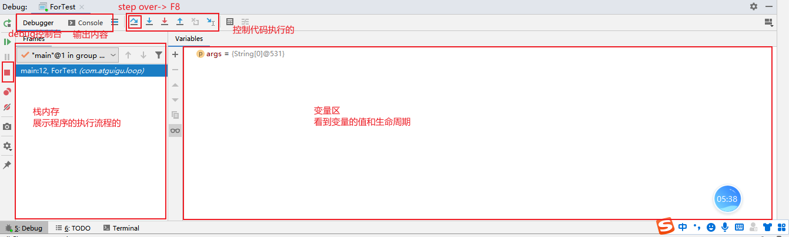

### Day_04随堂笔记

#### Debug断点调试

```java
Debug断点调试 : 让程序一句一句的执行,debug可以调错,读代码;

bug: 小甲虫
    
de: 反面的词根 -> 敌法师   
    
debug的使用步骤:
	1. 打断点 : 对着行号点一下
        哪里打断点: 哪里不会点哪里
    2. debug执行程序: 右键 -> debug as   
    3. 一句一句的执行代码 -> step over F8
```



#### 关于换行的问题

```java
		//打印换行
        System.out.println("Hello");

        //打印不换行
        System.out.print("Java");

        //换行符 "\r\n"  \: 转义符
        System.out.print("Java\r\n");

        //换行
        System.out.println();
        System.out.println("World");
        System.out.println("--------------------");


        //\t : 制表符 tab
        System.out.println("Hello    World    Java");
        System.out.println("Hello\t\tWorld\t\tJava");
```

#### while循环

```java
格式:
	初始化语句;1
	while(判断条件语句2){
        循环体语句;4
        步进表达式;3
    }

执行流程:
	1. 执行初始化语句
    2. 执行判断条件语句
        若结果是false,立即停止循环
    3. 若判断条件语句的结果是true,执行循环体语句
    4. 执行步进表达式
    5. 从步骤2开始重复执行.......
        
执行流程代码:
	1 --> 2 -true-> 4 --> 3 --> 2 -true-> 4 --> 3 .....
            -false-> 结束			 -false-> 结束
        
//for循环能完成的案例,while循环一样能完成;
```

#### do..while循环(了解)

```java
格式:
	初始化语句;//1
	do{
        循环体语句;//2
        步进表达式;//3
    }while(判断条件语句);//4

执行流程:
	1. 执行初始化语句
    2. 执行循环体语句    
    3. 执行步进表达式
    4. 执行判断条件语句    
        若结果是false,立即停止循环
    5. 若判断条件语句的结果是true,继续执行循环体语句
    6. 执行步进表达式
        ....
        
do..while 循环的特点 : 无论如何都会执行一次循环体语句       
```

#### 三种循环的区别和使用场景

```java
for循环 和 while循环,do.while循环的区别?
        for循环定义的初始化语句变量只在循环内有效,出了循环无效了 -> 可以重复利用
        while,do..while循环定义的初始化语句变量在整个main方法中都有效 -> 不可以重复利用

do..while循环 和for循环,while循环的区别?
        do..while会至少执行一次循环体语句,for循环,while循环必须满足循环条件才能执行.

    for循环更擅长处理明确循环次数的需求
    while循环更擅长处理不明确循环次数的需求
```

#### 死循环

```java
死循环 : 停不下来的循环叫死循环;

for 循环的死循环格式:
	for(;;){
        
    }

while 循环的死循环格式:
	while(true){
        
    }
```

#### 控制循环的关键字

```java
break : 中断,打断
    使用场景: 只能在循环中或者switch语句中使用
    含义: 提前结束循环
        
continue : 继续
    使用场景: 只能在循环中使用
    含义: 结束本轮循环,从下一轮循环的步进表达式开始执行
```

#### 循环的别名

```java
continue只能操作其定义所在的那个循环
break只能操作离他最近的那个循环或者switch语句
    
循环的别名:
	别名:while
    别名:for

控制循环的关键字后面指明控制谁:
	break 别名;
	continue 别名;    
```

#### 循环的嵌套

```java
循环的嵌套: 循环的循环体语句还是一个循环
    
格式:
	外层循环:for(初始化语句;判断条件语句;步进表达式){
        //其他代码
       内层循环:for(初始化语句;判断条件语句;步进表达式){
            循环体语句;
    	}
        //其他代码
    }

外层循环执行一次,内层循环要执行完毕
```

#### 随机数

```java
Random : 实现随机数生成的类
    
实现步骤:
	1. 导包: import java.util.Random;
	2. 创建对象:
		Random 对象名 = new Random();
	3. 对象调用方法 => 对象帮你实现功能
        int num = 对象名.nextInt(m);//随机生成一个整数 
			m: 随机数的范围 m是int类型  随机数的范围 : [0,m-1]

    问题:
    1. 想生成 [1,10] 之间的随机数
        int num = r.nextInt(10);//[0,9] + 1

    2. 想生成 [m,n] 之间的随机数
        r.nextInt(n - m + 1) + m;
        [17,89]
        r.nextInt(73) + 17; --> [0,72] + 17 -> [17,89]
```

#### 猜数字小游戏

```java
随机生成一个1-100之间的随机数,猜数字猜中为止 
    随机数: Random
    猜: Scanner
    三种情况: 大了,小了,中了
    猜是重复动作 : 循环 -> while -> 死循环
```

#### 数组

```java
数组: 数据的组合 是一个容器;

数组的特点:
	1. 数组一旦被定义长度不能发生改变 -> 弊端,也是数组被淘汰的原因
    2. 数组的元素有索引(index),从0开始,最大索引是数组的长度-1
    3. 数组可以存储基本数据类型和引用数据类型的元素 -> 数组什么都能存!!
    4. 一个数组中元素类型必须一致    
    5. 数组还分维度 最多研究到二维;

数组象形法 : 羊肉串
```

#### 学习容器方法

```java
1. 如何创建容器/如何链接数据库/如何建库/如何建表
    
2. 掌握容器的CRUD四类操作   (增删改查)  
    
3. 遍历容器 (遍历: 一个一个取出容器中的数据)    
```

#### Java的内存分配