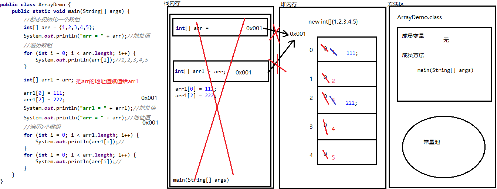

### Day_05随堂笔记

#### 两个数组指向同一个地址的内存图



#### 数组操作的小问题

```java
ArrayIndexOutOfBoundsException: 数组索引超出范围异常 -> 数组索引越界异常

    产生的原因 : 访问了不存在的索引编号
    解决办法:
        1. 不访问
        2. 访问正确的索引编号
            
空指针异常: NullPointerException
        产生的原因: 使用了值为null的对象 -> 1. 访问了内部空间 2. 调用了对象的属性 3. 调用了对象的方法
        解决办法 :
            1. 不访问
            2. 把对象的正确的地址值赋值给对象

      一旦出空指针异常 一定是调用方法的对象出了问题,去找对象在哪里变成了null,给与对象正确的地址值!       
```

#### 冒泡排序

```java
算法 : 计算的手法 -> 非常消耗脑细胞
    
排序 : 是算法学科中一个课题 
    
冒泡排序: 冒泡->排序方法  -> 效率非常低的排序方法
    
//准备一个数组
        int[] arr = {99,11,23,9,66,4,1,10};
        System.out.println(Arrays.toString(arr));
        
        for (int j = 0; j < arr.length - 1; j++) {
            for (int i = 0; i < arr.length - 1 - j; i++) {
                //判断 当前索引的元素 和 下一个索引位置的元素值的大小关系
                if (arr[i] > arr[i+1]){
                    //交换位置的代码
                    int temp = arr[i];
                    arr[i] = arr[i + 1];
                    arr[i + 1] = temp;
                }
            }
        }

        System.out.println(Arrays.toString(arr));    
```

#### 二维数组(了解)

```java
一维数组 : 由点链接起来的线
二维数组 : 由线链接起来的面 -> 二维数组其实就是一维数组中存储着一维数组
    
一维数组 : 一包烟 
二维数组 : 一条烟
    
二维数组是了解内容!!    
```

#### 二维数组的基本操作

```java
创建数组:
	动态初始化:
		数据类型[][] 数组名 = new 数据类型[m][n];
			m,n: 都是数字
            m: 代表的是二维数组中一维数组的个数
            n: 代表的是每一个一维数组中元素的个数
          //一条烟[][] 蓝楼 = new 一条烟[10][20];      
	静态初始化:
		数据类型[][] 数组名 = new 数据类型[][]{{值1,值2...},{值1,值2,值3....},{值...}....};
		数据类型[][] 数组名 = {{值1,值2...},{值1,值2,值3....},{值...}....};
增删改查:
	增: 数组一旦被定义长度不能发生改变,所以没有增的功能
	删: 数组一旦被定义长度不能发生改变,所以没有删的功能
	改:	//先获取元素再赋值
		二维数组名[索引] = 一维数组的地址值;(这里必须是一个地址值) //修改二维数组中指定索引的一维数组的地址值!!
		二维数组名[二维数组中一维数组的索引][一维数组中元素的索引] = 元素值;
	查: 
		二维数组名[索引] : 获取二维数组中指定索引位置的一维数组 
		二维数组名[一维数组的索引位置][此一维数组索引位置的元素] : 获取二维数组中指定一维数组中的指定索引元素
		二维数组名.length : 二维数组中一维数组的个数
        二维数组名[一维数组的索引].length : 二维数组中指定一维数组的元素个数    
遍历:
```


