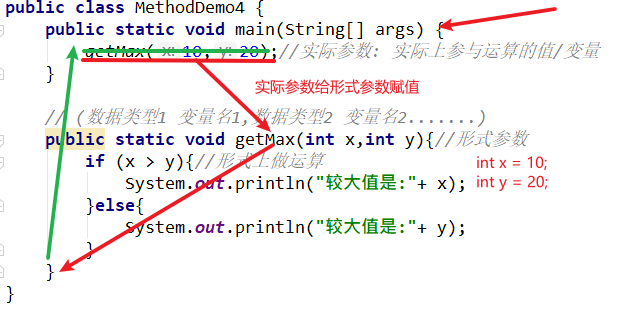

### Day_06随堂笔记

#### 方法

```java
方法 : method  -> 封装了特定功能的代码块 -> 提高了代码的复用性
    方法另一个重要的功能是 :  参数传递
```

#### 方法的完整定义格式

```java
完整格式:
	访问权限修饰符 状态修饰符 返回值类型 方法名(形式参数列表){
        方法体;
        return 返回值;
    }

1. 方法一定要先定义后调用!!
2. 方法需要什么,调用时就需要给它什么!! 
3. 方法必须定义在类中,其他的方法外面!! -> 成员位置
    	所有的方法都是 成员方法!!
```

#### 无形参无返回值的方法格式

```java
格式:
	public static void 方法名(){
        方法体;
    }

格式解释:
	public :  访问权限修饰符 -> java最大的访问权限(在同一个模块中都可以访问)
    static :  状态修饰符 -> 静态 (原因: main方法有static修饰,我们需要在main方法调用这个方法)    
    void : 代表方法执行完毕后没有结果 (无返回值) -> void 不是一种数据类型,他是一个关键字; 
	方法名 : 帮我们在内存中找到此方法的;
	() : 存放形式参数列表的地方 -> 啥都不写代表无形式参数列表
    {} : 大括号内就是存放方法逻辑代码的地方 -> 方法体放在{}内
    方法体 : 完成功能的代码  
        
调用格式: //需要在使用方法的地方编写
	方法名();
	无返回值方法只能直接调用!!
```

##### 无形参无返回值方法的执行流程图


##### 无形参无返回值方法的执行内存图


#### 无形参有返回值的方法格式

```java
格式:
	public static 返回值类型 方法名(){
        方法体;
        return 结果/返回值;
    }

格式解释:
	返回值类型 : 是一个数据类型 (既可以是基本数据类型也可以是引用数据类型)
        用数据的名称去替换返回值类型即可,替换后就代表此方法执行完毕后有一个结果可以返回给调用者;
	return : 结束方法,如果return后面跟着结果,同时会把结果返回给调用者
    结果/返回值 : 具体值的值/变量 
        要求 :  返回值的类型必须和定义方法时编写的返回值类型一致
            
    有返回值方法的调用:
        1. 直接调用 :  方法名();  -> 方法执行了但是你忽略的返回值
        2. 输出调用 :  System.out.println(方法名()); -> 看到结果,但是我把结果输出了
        3. 赋值调用 : 返回值类型 变量名 = 方法名();
            -> 推荐: 把方法的结果接收了,并可以继续运算            
            
注意:
	1. 当一个方法的返回值类型不是void关键字,那么方法必须要返回一个同(返回值类型)类型的结果
```

##### 无参数有返回值方法的执行流程图


##### 无参数有返回值方法的内存图


#### 有参数无返回值方法格式

```java
格式:
	public static void 方法名(形式参数列表){
        方法体;
        //return;
    }	

格式解释: 
	形式参数列表 -> 格式 : 
		作用 : 形式上做运算的变量
```

##### 参数传递的执行流程图



#### 有参数有返回值方法的格式

```java
格式:
	public static 返回值类型 方法名(形式参数列表){
        方法体;//逻辑
        return 返回值/结果;
    }

调用方式:
	1. 直接调
    2. 输出调
    3. 赋值调    
```


#### 形式参数和实际参数的不同

```java
位置不同:
	形式参数: 方法定义的小括号内
    实际参数: 调用方法的小括号内    
定义格式不同:    
	形式参数: 数据类型 变量名
    实际参数: 值/变量  -> 值和变量的类型必须和对应的形参类型一致!  
作用不同:
	形式参数列表 : 向调用者索要具体参与运算的值 (约束实际参数的类型,个数,类型顺序)
        //形参是用来接收实参传递的值
    实际参数列表 : 给要启动的方法形参赋值 (必须和形参列表的数据类型,个数,数据类型的顺序一致)   
        //给形式参数赋值
        
调用方法传递参数的原则 :
	要什么给什么! -> 数据类型
    要多少给多少! -> 形参个数
    怎么要怎么给! -> 数据类型的顺序   
```

#### return

```java
无返回值方法内 :
	return; -> 只能提前结束方法
    
有返回值方法内 : 
	return 结果;

一个方法内可以有多个return,但是只能有一个return能被执行
```

#### 方法形参传递和类型之间的关系

##### 方法的形参是基本数据类型,形式参数的改变不影响实际参数!


##### 方法的形参是引用数据类型,形式参数的改变直接影响实际参数!


#### 方法的重载

```java
方法的重载 : 在同一个类中出现了同名的方法,且不报错!!
    
方法的重载:
        1. 在同一个类中
        2. 方法名必须一致
        3. 形式参数列表不一致
            a. 形参个数不一致
            b. 形参类型不一致
            c. 形参类型顺序不一致
        4. 与返回值无关
        5. 与形参的变量名无关

    好处: 方便调用者使用

    方法重载的调用:
        JVM会根据你调用方法时传入的实际参数的个数,类型,类型顺序去选择最优方法!

    学习要求:
        1. 会辨认
        2. 会调用    
```

#### 方法的好处

```java
1. 提高代码的复用性
2. 实现了数据的传递    
```

