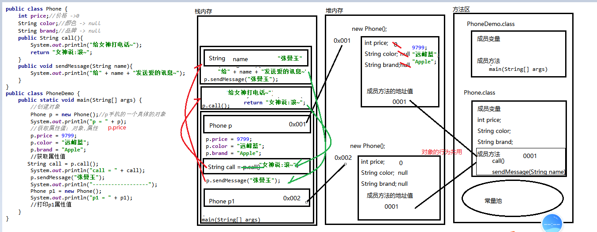

### Day_07随堂笔记

#### 面向对象思想

```java
思想: 思维方式 -> 思想决定行为
编程思想: 编程的方式 -> 编程思想决定写代码的方式
    面向过程 : 凡事必躬亲 -> 前6天都是面向过程的方式写代码, C语言
    面向对象 : 基于面向过程思想, 自己的事情别人做 -> 懒人思维 , Java语言
    面向函数 : 基于面向对象思想, 只关注对象做什么,忽略对象
        
面向对象思想的三大特性: 封装 继承 多态
面向对象思想的三大特点:
	1. 更符合我们平时的思维习惯
    2. 把复杂的问题简单化
    3. 把我们从执行者变成指挥者
        
十五字讲面向对象:
	服务员点单
    万物皆对象(Thinking in Java <Java编程思想>)


面试环节中面向对象思想的对答:
	面向对象思想是Java的核心编程思想,它是 更符合我们平时的思维习惯, 把复杂的问题简单化,把我们从执行者变成指挥者的一种编程思想.在Thinking in Java一书中有对面向对象思想非常精辟的概括: 万物皆对象;例如,面试官您面试的过程就涉及到了很多面向对象思想的运用,面试官您面试肯定是因为公司有新的开发需求,以您的实力完全可以一人搞定,但是您有更为重要的工作要去完成,所以您使用了您面试的功能来招聘一些具备开发功能的人例如我,和您一起完成公司的任务.
```

#### 类和对象的关系

```java
类 -> class : 事物的抽象 -> 事物的模板
对象 -> 一类事物的具体化
    
1. 有类才有对象 
2. 使用的是 对象!!
    
为了能让生活中的事物出现在Java代码中,我们可以使用类来描述这类事物;    
```

#### 定义类

```java
格式:
	public class 类名{
        //属性: 成员变量 -> 定义在类中方法外的变量
		
		//行为: 成员方法 -> 定义在类中方法外的方法
    }

举例:
	public class Student{
        //属性
        String name;
        int age;
        String gender;
        
        //行为
        public void eat(String food){
            sout("吃"+food);
        }
        
        public void study(){
            sout("学生在学习~");
        }
    }

//事物描述类是不写main方法的,因为此类只是在描述一类事物
//在main方法所在的类中定义方法就要加static关键字
//在事物描述类中定义方法就不要加static关键字
```

#### 创建对象

```java
有了一类事物之后,要使用这类事物,必须有具体的对象!!
    
格式:
	类名 对象名 = new 类名();

如何使用对象:对象调方法/对象调属性  --> 调: .
    对象调属性: 
		对象名.属性名 --> 获取该对象的属性值
    对象调方能股份:        
        对象名.方法() --> 让该对象启动功能
            
 //成员都属于对象!!           
```

#### 对象的内存图



#### 成员变量和局部变量的区别

```java
1. 在类中的位置不同
    	成员变量: 类中方法外
        局部变量: 方法内,方法的形参
2. 作用域不一样
        成员变量: -> 全局变量 在整个类中使用
        局部变量: 只在其定义的方法内有效
3. 在内存中的位置不一样
        成员变量: 堆内存
        局部变量: 栈内存
4. 默认值不一样
        成员变量: 有默认值
        局部变量: 局部变量未赋值不能直接使用
5. 生命周期不一样
        成员变量: 随着对象的创建而创建,随着对象的被回收而死亡 -> 久
        局部变量: 随着方法的调用而创建,随着方法的执行完毕而死亡 -> 短
            
 因为在类中位置不同,导致作用域不同和在内存中的位置不同;
 因为在内存中的位置不同,导致默认值不同和生命周期不同;

6. IDEA的展示颜色不同
     未使用: 灰色
     被使用:
			成员变量: 粗紫色
            局部变量: 细黑色    
```

#### private

```java
private : 访问权限修饰符 -> 最小权限
public : 访问权限修饰符 -> 最大权限    
    
private 只能用来修饰 成员变量 和 成员方法;  

被private修饰的成员只能在本类中访问;
```

#### getter and setter方法

```java
getXxx() : 有返回值无参数的方法 -> 获取对象的属性值;
    
setXxx(形参) : 无返回值有参数的方法 -> 设置对象的属性值;

getter and setter方法 可以自动生成:
	alt + insert -> getter and setter -> 全选 -> OK
```

#### this关键字

```java
this 的作用:  用来调用变量,调用方法 -> 强制访问成员位置的元素
    this.变量名 -> 打破变量访问的就近原则,强制要求访问本类成员位置上的变量
    this.方法名(实参) -> 调用成员位置的方法 -> 没必要!!
---------------------------------------------------------------------    
this : 本类对象的引用 
    本类对象 : this 出现在哪个类中就代表哪个类的对象
    引用 : 来接受对象地址值的
        
    哪个对象调用含有this关键字的方法,this就代表是哪个一个对象!!    
```

#### 封装特性

```java
封装的体现和好处:
1. 把重复的代码用循环格式封装 -> 提高代码的复用性
2. 把重复的功能用方法格式封装 -> 提高代码的复用性,传递数据做数据的交换
3. private 关键字修饰属性 -> 提高代码的安全性
4. 把生活中的事物用类进行封装,用属性和行为进行描述 -> 提高代码的多样性    
```

#### 构造方法

```java
构造方法 : 构建创造对象的方法
	方法: 就是方法
    构造: 构建创造    
        
创建对象的格式: 
	类名 对象名 = new 类名();

new 到底干了啥:
	1. 在堆内存中开辟空间
    2. 创建了对象
    3. 调用了相应的构造方法 -> 反之: 构造方法是new来调用的
        
构造方法的格式:
	public 类名(形参列表){
        方法体;
        //return;
    }
```

#### 构造方法的注意事项

```java
1. 在一个类中,如果没有编写任何构造方法,JVM会默认赠送一个无形参的构造方法
2. 构造方法可以重载
3. 如果你编写了任意的构造方法，JVM默认赠送的无参构造就不送了
4. 全参构造存在的意义可以在创建对象的同时给对象的属性赋值
```

#### 标准的事物描述类的定义步骤

```java
1. 私有所有的属性
//alt + insert + constructor
2. 自动生成无参构造
3. 自动生成全参构造    
//alt + insert + getter and setter  
4. 自动生成getter and setter 方法    
    
//行为: 看需求的!
```


