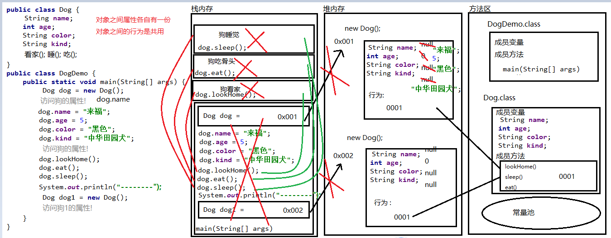

### Day_07随堂笔记

#### 面向对象思想

```java
思想 : 思想决定了行为
编程思想 : 编程思想能改变我们写代码的思维方式和代码的编码方式
    面向过程,面向对象,面向函数...
面向对象编程思想:  面向 -> 看重,关注    -> 面向对象思想更看重对象的使用!
    
面向过程: 凡事必躬亲
    完成一个需求,面向过程的编程方式要求每一个环节每一个步骤都得亲自完成; -> 前6天99%代码都是面向过程的编程思想在编程;(今天大部分的内容也是面向过程的)

面向对象: 自己的事情别人做  别人 : 使用的对象; -> 懒人思维
    特点:
	1. 更符合我们平时的思维习惯
    2. 把复杂的问题简单化 (把简单的问题变得更简单)
    3. 把我们从执行者变成指挥者 
        
举例:
	洗衣服
        面向过程: 泡一泡 -> 搓一搓 -> 拧一拧 -> 晾一晾
        面向对象: 找到一台洗衣机 -> 衣服搞里头   --> 洗衣机: 对象    
    买电脑    
        面向过程: 打车去广埠屯 -> 选配置 -> 和老板还价 -> 组装 -> 搬回家
        面向对象: 打开手机APP -> 选电脑 -> 下单      ---> 手机app: 对象
   
            
举例: 服务员点单!
    
<Thinking in Java> -> Java编程思想    
    万物皆对象!
   
    
面试中如何回答 面试官问 你对面向对象思想的理解 ?
    面向对象思想是一种基于面向过程编程思想的进阶,它更符合我们平时的思维习惯,把复杂的问题简单化,把我们从执行者变成指挥者;例如在Thinking in Java这本书中写到面向对象思想的核心点在于 万物皆对象;面试官您面试的这个过程也涉及到很多面向对象思想的应用,面试官您招人肯定是因为公司项目有了更多的需求,以您的实力一个人完成肯定没有任何问题,但是您有更重要的工作要去主持,所以老板调用了您 招人的 功能 来招聘一些 具备开发能力的人, 例如我! 帮助您快速完成需求.
```

#### 类和对象的关系

```java
类 : class -> 种类,类别
    类 : 事物的抽象  --> 范围
        
对象 : 
    对象: 此类事物的具体化 --> 具体的某一个
        
我们使用的是对象!!        
        
现有类 后有对象! 对象是根据类来创建的,类是对象的模板        
```

#### 如何定义事物描述类

```java
格式:
	public class 类名{
        //属性(特征)
        成员变量; // 数据类型 变量名;  成员变量在定义的时候不需要赋值
        //行为(能力)
        成员方法; //这里的成员方法定义时不要加static关键字
        //main方法所在的类中定义方法就加static关键字
        //没有main方法的类中定义方法就不加static关键字
    }

例如:
	public class Student{//从此代码世界中就出现了学生事物
        //特征
        String name; //当你在描述一个事物的时候,不知道这个属性是什么类型就写String
        int age;
        //能力
        public void eat(String food){
            //编写如何吃
        }
        public void sleep(){
            //编写如何睡
        }
    }

成员 : Java中位置关系 -> 在类中方法外
```

#### 如何使用事物描述类

```java
在需要使用这类事物的地方,创建此类事物的对象!! 
    
创建对象的格式: new     
    类名 对象名 = new 类名();

 . : 点 符号 ---> 调用
     
对象.属性 -> 访问属性
对象.行为 -> 调用方法/启动功能     
     
     实例 -> 对象
```

#### 两个对象的内存图



#### private 

```java
    public : 公共的 Java中最大的访问权限修饰符
        只要在同一个模块下都可以访问;
    private : 私有的  Java中最小的访问权限修饰符
        只能在本类中访问
        private可以用来修饰成员,被修饰的成员只能在本类中使用
```


#### this关键字

```java

变量访问的就近原则 : 变量懒
    近 : 局部位置  远一点 : 本类的成员位置  最远的: 本类父类的成员位置

this 关键字的使用: ---> 重要的
    this: 打破局部的约束,强制访问本类成员位置上的成员变量和成员方法
        this.变量名 : 强制访问本类成员位置上的变量
        this.方法名(实际参数) :  强制调用本类成员位置上的方法 -> 永远不会用
            
            
 this 的概念 : 本类对象的引用
     //哪个对象调用含有this关键字的方法,这时候这个this就代表着哪个对象

     本类对象的引用:
	 本类 : this 出现在哪个类中就代指哪个类的某个对象
     对象 : new 出来的东西
     引用 : 接收对象地址的"变量"

```


#### 成员变量和局部变量的区别

```java
局部变量 : 定义在方法内,方法的形参,for循环的初始化语句的变量都叫局部变量
成员变量 : 定义在类中方法外的变量 
    
1. 类中位置不同
    局部变量 : 方法内,方法的形参,for循环的初始化语句
    成员变量 : 类中方法外
        
2. 作用域不同: 变量只在其定义的大括号内有效
    局部变量 : 方法内,循环内
    成员变量 : 整个类中都有效    
        
3. 在内存中的位置不同:
	局部变量 : 栈中
    成员变量 : 堆中
        
4. 初始化值不同
    局部变量 : 局部变量未赋值不能直接使用
    成员变量 : 根据类型给与默认值
        整数 0 浮点数0.0 字符:'\u0000' 布尔false 所有的引用数据类型 : null
            
5. 生命周期不同 :
	局部变量 : 局部变量随着方法的调用而产生,随着方法的执行完毕而死亡
    成员变量 : 成员变量随着对象的创建而产生,睡着对象的被回收而死亡  
        
背诵 : 
	1. 因为在类中位置不同,所以作用域不同和在内存中的位置不同;  
	2. 因为在内存中的位置不同,所以初始化值不同和生命周期不同;
----------------------以上都是理论---------------------------
    
6. 颜色不同   
    IDEA中任何东西未使用 :  灰色
        
    局部变量 :  黑色
    成员变量 :  粗紫色    
```

#### 构造方法

```java
构造方法
    方法 : 封装了特定功能的代码块
    构造 : 构建创造 
       
构造方法 :  用来构建和创造对象的方法!! --> 特殊的方法
    
创建对象的格式: 
	类名 对象名 = new 类名();

new 关键字干了啥:
	1. 创建对象
    2. 在堆中开辟了空间
    3. new 还调用了相应构造方法    
        
定义构造方法的格式:
	权限修饰符 类名(形式参数列表){
        方法体;
        //return; 只能提前结束方法
    }
 
调用格式: 构造方法只能通过 new 关键字调用
	new 类名(实际参数列表);

注意:
	1. 构造方法是用来创建对象的
    2. 构造方法没有返回值类型,因为构造方法执行完毕必然生成的是此类对象
    3. 构造方法内不可以有return 值; 可以有 return : 提前结束方法
    4. 构造方法的命名和类名要完全一致!!(大小写也必须一样)     
```

#### 标准事物描述类的编写步骤

```java
1. 私有所有的属性(特征)
//自动生成 :  alt + insert     
2. 自动生成无参构造 //constructor -> select none
3. 自动生成全参构造 //constructor -> ctrl + a + ok
4. 自动生成getter and setter方法   //getter and setter -> ctrl + a + ok
    
//行为 : 根据需求来    
```

#### 面向对象的三大特性之一 --- 封装

```java
面向对象的三大特性 : 封装,继承,多态
    
封装性 :
	1. 循环 : 把重复的代码进行循环封装 -> 提高代码的复用性
    2. 方法 : 把特定的功能进行方法封装 -> 提高代码的复用性,方法实现了数据的传递
    3. private : 把成员变量私有,在提供公共的访问方式 -> 提高了代码的安全性 
    4. 定义事物描述类 : 把一类事物的特征和功能封装到类中 -> 提高了代码的多样性    
```

