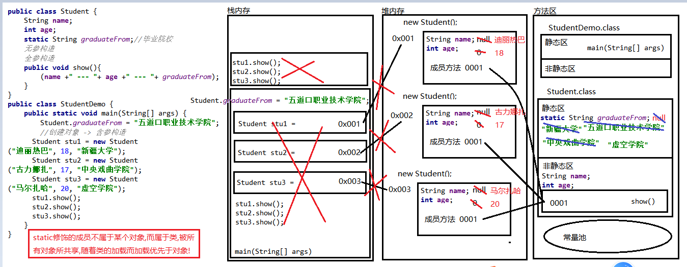
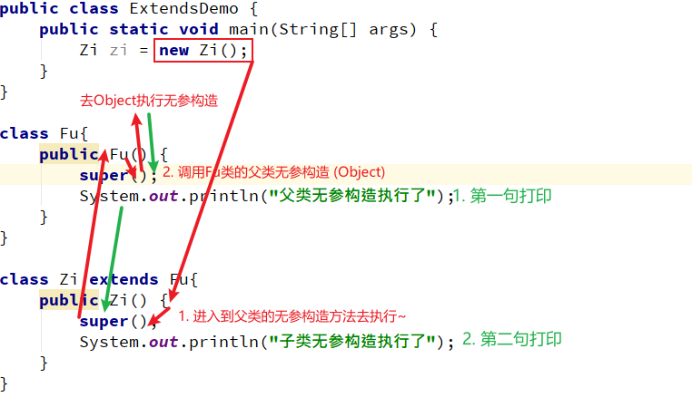

### Day_08随堂笔记

#### static

```java
static : 静态的 
    
static 关键字的特点:
	1. 被static修饰的成员被所有的对象所共享
    2. 被static修饰的成员可以使用类名直接访问 --> 使用环节
    3. 被static修饰的成员优先于对象加载
    4. 被static修饰的成员随着类的加载而加载 (static修饰的成员属于类不属于某个对象)
```

#### static关键字内存图



#### 静态访问的问题

|                    | 静态成员变量 | 静态成员方法 | 非静态成员变量 | 非静态成员方法 |
| :----------------: | :----------: | :----------: | :------------: | :------------: |
|  **静态成员方法**  |      √       |      √       |       X        |       X        |
| **非静态成员方法** |      √       |      √       |       √        |       √        |

**结论: 静态方法只能访问静态成员** 

> 静态虽好但只能访问静态~(原因: 加载的时机问题)

**为什么静态只能访问静态?**

> static修饰的成员随着类的加载而加载优先于对象  --> 更早出生的
>
> 非static修饰的成员随着对象的创建而创建 --> 

**非要在静态成员方法内访问非静态成员**

> 1. new ! -> 创建对象
> 2. 对象.非静态成员

**静态不能和this还有super一起用**

**静态方法没有重写的概念**

#### 静态的应用-> 工具类

```java
JDK提供了大量的工具类: Arrays
    static String toString(任意类型的数组) --> System.out.println(Arrays.toString(数组对象));
	static void sort(任意类型的数组) --> Arrays.sort(数组对象); -> 按照自然升序对数组元素进行排序
```

#### 工具类如何自定义

```java
1. 把类名命名为 XxxxUtils
2. 私有无参构造,并不提供任何其他构造方法 -> 治疗手贱,不然创建对象
    	//Do not let anyone instance this class!!
3. 把所有的成员变量 和 成员方法 全部都用 static 修饰即可!    
```

#### 自己的数组操作工具类

```java
package com.atguigu.staticdemo;

import java.util.Arrays;

/*
    数组操作的工具类型
 */
public class ArraysUtils {
    //私有无参构造
    private ArraysUtils(){}

    //自定义常量的方式
    public static final String AUTHOR = "谈斌";

    //把所有的方法全都用static修饰
    //求和
    public static int sum(int[] arr){
        int sum = 0;
        for (int i = 0; i < arr.length; i++) {
            sum += arr[i];
        }
        return sum;
    }
    //求最值
    public static int getMax(int[] arr){
        int max = arr[0];
        for (int i = 0; i < arr.length; i++) {
            if (arr[i] >  max){
                max = arr[i];
            }
        }
        return max;
    }

    public static int getMin(int[] arr){
        int min = arr[0];
        for (int i = 0; i < arr.length; i++) {
            if (arr[i] <  min){
                min = arr[i];
            }
        }
        return min;
    }

    //求一个元素第一次出现在数组的索引位置
    public static int indexOf(int[] arr,int num){
        for (int i = 0; i < arr.length; i++) {
            if (num == arr[i]){
                return i;
            }
        }
        return -1;
    }

    //求一个元素最后一次出现在数组的索引位置
    public static int lastIndexOf(int[] arr,int num){
        //临时变量
        int index = -1;
        for (int i = 0; i < arr.length; i++) {
            if (num == arr[i]){
                index = i;
            }
        }
        return index;
    }

    //漂亮的打印数组
    public static void printArray(int[] arr){
        System.out.println(Arrays.toString(arr));
    }

    //翻转
    public static void reserve(int[] arr){
        for(int startIndex = 0,endIndex = arr.length - 1;startIndex < endIndex; startIndex++,endIndex--){
            //交换元素
            int temp = arr[startIndex];
            arr[startIndex] = arr[endIndex];
            arr[endIndex] = temp;
        }
    }

    //排序
    public static void sort(int[] arr){
        Arrays.sort(arr);
    }
}
```

#### 继承

```java
继承: Java中类与类之间的关系~
    
类与类之间只有2种关系:
	继承关系: 子父类
	没有关系: 无关类
        
继承最为重要的概念:
	1. 子类继承父类可以使用父类所有非私有的成员
    2. 子类要加载优先加载父类(子类对象要出现,必先创建父类对象)    
    3. 父类对象不会使用子类的成员
    4. 所有类都直接或者间接的继承于 Object (根类,超类,基类)
        	-> 当一个类不写任何继承格式是默认继承 Object
    5. 特性: 单一继承,多层继承, 但是一个父类可以有多个子类 
```

#### 继承的格式

```java
格式:
	//父类
	public class Fu/*extends Object*/{
        
    }
	//子类
	public class Zi extends Fu{
        
    }
	public class Zai extends Fu{
        
    }

//特性: 单一继承,多层继承, 但是一个父类可以有多个子类 
```

#### 继承关系下成员变量的访问特点

```java
1. 子类继承父类可以使用父类所有非私有的成员
2. 父类对象不会使用子类的成员   
    
结论:    
    1. 在子类中访问:
        相同的变量名 : 优先访问最近的 (变量的就近访问)
            局部 < 本类成员 < 本类父类成员
    2. 在第三方类中子类对象访问 : 遵循变量访问的就近原则
        自己有就访问自己的,自己没有就访问父类的,父类也没有报错
    3. 在第三方类中父类对象访问 :   只能访问自己的和自己父类的,不能访问子类的    
```

#### 继承关系下成员方法的访问特点

```java
子父类继承关系下成员方法的访问特点:
	1. 在子类的方法中访问:
		子类有就用自己的,子类没有用父类的,父类也没有报错
    2. 在父类的方法中访问: 只能调用自己和自己父类的不能使用子类的成员
    3. 在第三方类中,子类对象访问:
		自己有调自己的,自己没有调父类的
   		重写方法一定调用的是重写后的方法
```

#### 方法重写

```java
方法特性:
        方法的重载: overload  -> 用的多,写的少
            1. 在同一个类中
            2. 方法名相同
            3. 形参列表不同: 个数,类型,类型顺序
            4. 与返回值无关,与形参的变量名无关
        方法的重写: override -> 用的多,写的多
            1. 在子父类继承(实现)关系下
            2. 子类中有和父类中声明完全一致的方法
                权限修饰符: 子类重写的方法权限修饰符要大于等于父类的方法权限修饰符
                    private < 不写 < protected < public
                状态修饰符: 静态方法不存在重写!!
                返回值类型:
                    void : 子父类都得是void
                    基本数据类型 : 子父类必须一样
                    引用数据类型 : 子类的返回值类型必须是父类的返回值类型的同类型或者是子类型
                        Object > Father > Son
                方法名: 必须一样
                形参列表: 必须一样
            PS: 绝大多数情况子类重写的方法的声明和父类完全一致!!

       注解: @Override
         位置: 写在子类的重写方法声明上
         作用: 用来约束子类重写方法的格式
```

#### 九阳神功

```java
帮助你读懂代码的!!
    
    九阳神功:
        前提: 只要有对象调
        1. 找到对象创建的语句 : 类名 对象名 = new 类名(实参);
        2. 看对象在干嘛
        3. 对象调成员变量 : 编译看左边,运行看左边
           对象调成员方法 : 编译看左边,运行看右边
           对象调静态成员方法 : 编译看左边,运行看左边


        编译看: 看代码为什么报错
        运行看: 看代码的结果    
```

#### 继承关系下构造方法的访问特点

```java
子类对象要加载优先加载父类对象!!!!
    
    注意事项:
        1. 每一个构造方法的第一句代码 隐藏一句 :  super();
            super() : 调用父类的无参构造方法
        2. 调用构造方法的代码 必须是构造方法的第一句有效代码
        3. 一个构造方法内只能调用一次 其他构造方法;
        4. 除了 super(), 它还有类似方法:
            super() : 调用父类的无参构造
            super(实参) :  调用父类的含参构造
            this(): 调用本类的无参构造
            this(实参) : 调用本类的含参构造
       5. 当你在构造方法内调用了任何其他的构造方法,默认赠送的super()就不送了
       6. 子类中的构造方法必须有一个要来加载父类    
```

#### 子父类之间构造方法的执行流程图



#### this和super的总结

```java
this :  本类对象的引用 -> 照镜子
    哪个对象调用含有this的方法,方法内的this就是哪个对象
super :  本类父类对象的引用 -> 照亲子鉴定镜
    哪个对象调用含有super的方法,方法内的super就是这个对象的某个父类对象
    
this() : 调用本类的无参构造
this(实参) : 调用本类的某个含参构造
super() :  调用本类父类的无参构造 -> 每一个构造方法的默认第一句
super(实参) : 调用本类父类的某个含参构造
    
this.变量名 : 打破局部约束,强制访问本类成员位置上的变量
this.方法名(参数) : 强制访问本类成员位置是上的方法 -> 一般不用,因为所有的方法都是成员方法
super.变量名 : 打破类的约束,强制访问本类父类成员位置上的变量
super.方法名(参数) : 强制访问本类父类成员位置上的方法 -> 用的!
```

#### 继承的好处和弊端

```java
何时使用继承:(继承的好处)
	1. 当多个类中有相同的行为和属性,我们可以创建一个父类,把相同的属性和行为进行抽取,抽取到父类中.再让这些类继承这个父类; --> 提高了代码的复用性
        
    注意: 子类对象的功能一定是比父类对象的功能多    
        
继承的弊端:继承提高了代码的耦合性
	//写代码的六字箴言: 高内聚,低耦合
```

#### 二维数组

```java
概念: 一维数组中存储的是一维数组; -> 一条烟
    
格式:
	动态初始化:
		数据类型[][] 数组名 = new 数据类型[m][n];
			m: 二维数组中有多少个一维数组
            n: 每一个一维数组中有多少个元素    
    静态初始化:
		数据类型[][] 数组名 = {{值1,值2,...},{值1,值2,值3...},{值1..},...};

增删改查:
	增删: 数组长度不能发生改变,所以没有增删功能~
    改: 
		二维数组名[二维数组中一维数组的索引][一维数组中元素索引] = 初始化值;
    查:
		二维数组名[索引]: 二维数组中一维数组的地址值
        二维数组名[二维数组中一维数组的索引][一维数组中元素索引] : 二维数组中访问元素的格式
            
        二维数组名.length : 一维数组的元素个数
		二维数组名[一维数组的索引位置].length : 二维数组中某个一维数组的元素个数
            
            
遍历:
	//二维数组遍历的标准代码
        for (int j = 0; j < 二维数组名.length; j++) {
            for (int i = 0; i < 二维数组名[j].length; i++) {
                System.out.println(二维数组名[j][i]);
            }
        }
```


