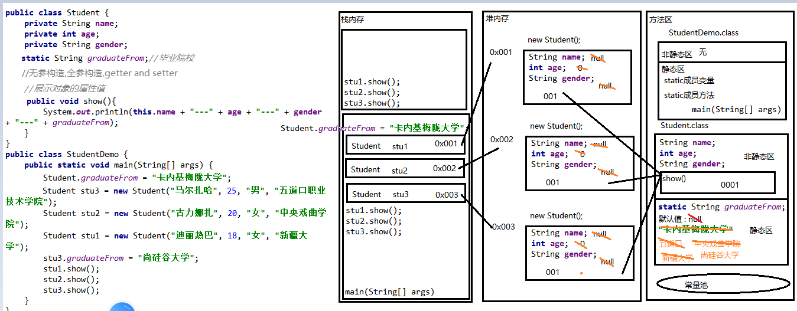

### Day_08随堂笔记

#### static

```java
static : 状态修饰符  -> 静态
    
static 只能用来修饰成员;

特点:
	1. 被static所修饰的成员不属于对象 // 属于对象的是非静态成员变量和成员方法
    2. 被static所修饰的成员被所有对象所共享
    3. 被static所修饰的成员可以直接使用类名调用
    4. 被static所修饰的成员随着类的加载而加载优先加载于对象
```

#### static的内存图



#### static成员的访问

|                | 非静态成员变量 | 非静态成员方法 | 静态成员变量 | 静态成员方法 |
| :------------: | :------------: | :------------: | :----------: | :----------: |
| **非静态方法** |       √        |       √        |      √       |      √       |
|  **静态方法**  |       X        |       X        |      √       |      √       |

> 静态方法只能访问静态成员变量和成员方法!  // 静态虽好,但是只能访问静态!!
>
> why ??  和加载的时间有关
>
> 静态成员随着类的加载而加载优先于对象,非静态成员是随着对象的创建而创建
>
> 静态成员 --> 早出生
>
> 非静态成员 -> 晚出生
>
> this 关键字 是不可以在静态方法内使用的!!

#### static的应用场景

```java
static 的特点中: 可以不用创建对象,直接使用类名调用; 

工具类的拟定 :  可以把类中所有的成员都定义成静态的,那么就可以直接使用类名调用方法和属性!
    
JDK中提供了很多工具类型 : Arrays,Math,System ...    
    
编写步骤:
	1.工具类一般都放在util包下,类名叫: XxxxUtils
	2. 私有无参构造,并不提供任何其他的构造方法 -> 为不让程序员创建此类的对象
    3. 把所有的成员变量和成员方法都用static修饰    
```

#### 继承

```java
继承 : Java中类与类之间的一种关系; //继承关系就是父子关系

重点概念 : 
	1. 子类继承父类可以使用父类所有非私有的成员,父类对象不会使用子类的成员
    2. 继承 是单一继承,多层继承 // 一个子类只能有一个父类,一个父类可以有多个子类,父类也可以有父类     
    3, 子类要加载优先加载父类
```

#### 继承格式

```java
格式:
	public class 父类{
        
    }
	//继承是写在子类上的
	public class 子类 extends 父类{
        
    }

遵循 : 单一继承,多层继承
    
当一个类没有父类默认继承 Object 类; Object 类 : 根类,超类,基类    
```

#### 继承关系下成员之间的关系

##### 成员变量

```java
成员变量:
    1. 在父类中访问成员变量 : 父类只能访问自己类中和自己父类中的成员变量,不可以找子类要!!
    2. 在子类中访问成员变量 : 遵循就近原则
        a . 子类和父类有相同的成员变量会优先访问子类自己的
    3. 在第三方类中,子类对象访问成员变量 :  子继承父,子对象可以使用父类所有非私有的成员!!
```

##### 成员方法

```java
成员方法:
	1. 在子类中访问成员方法: 自己有就优先调自己的,自己没有找父类要
    2. 在父类中访问成员方法: 父类不会找子类要方法
    3. 在第三方类中子类对象访问成员方法 : 自己有就优先调自己的,自己没有找父类要
```

##### 构造方法

```java
//子类对象要加载优先加载父类!!

    构造方法:
        子类对象要加载优先加载父类;
    why ?
        子类对象可以使用父类非私有的成员,父类都没有加载子类如何使用呢?

    注意: 理解
        1. 任何一个构造方法的第一句代码隐藏了 super();
            super(): 调用本类的父类无参构造方法
        2. super()这句话必须是构造方法里第一句有效代码
        3. this() : 调用本类的无参构造
           this(实参) : 调用本类的含参构造
           super() : 调用本类父类的无参构造
           super(实参) :  调用本类父类的含参构造
        4. 一个构造方法内只能调用一次其他的构造方法
        5. 如果你在构造方法内调用了其他的构造方法那么默认赠送的super()就不送了
        6. 在构造方法内不可以再次调用构造方法自己 (构造方法不允许递归)
        7. 一个类中的构造方法内必须有一个构造方法去启动父类!!
```

#### 方法的重写

```java
    方法的重载 : Overload -> 用的多,写的少
        1. 在同一个类中
        2. 方法名相同
        3. 形式参数列表不同
            类型不同
            个数不同
            类型顺序不同
        4. 与返回值,方法形参变量名无关

     方法的重写 : Override -> 用的多,写的多
        1. 必须有继承/实现关系
        2. 子类中的方法声明和父类中方法一模一样
        3. 方法体可以不一样


     注解 : @Override -> 写在子类重写的方法声明上,约束方法重写的格式

     百分之99.99的情况子类的方法声明和父类的方法声明完全一致!
     1. 重写方法的权限修饰符可以不一样 : 子类重写方法的权限修饰符 >= 父类方法的权限修饰符
        private除外 -> 子类看不到!!
     2. 返回值类型可以不一样
        父类方法: void 子类必须是 void
        父类方法: 基本数据类型 子类必须一样
        父类方法: 引用数据类型  --> 父类的返回值类型必须是子类的返回值类型的父类或者同类

    注意: static方法不存在重写的概念!!!
```

#### 九阳神功

```java
只要你看到有对象调...  --> 对象名.
   对象.成员变量
   对象.成员方法
   对象.静态成员方法 
    
第一式: 找到对象创建的位置 --> 对象创建的语句: 类名 对象名 = new 类名();
第二式: 看对象在调什么
    /*
    	左右 : 等号左右两边的类名
    	编译看 : 如果代码报错,就可以通过编译看 来排错
    	运行看 : 说结果
    */
    对象.成员变量 -> 编译看左边,运行看左边
    对象.成员方法 -> 编译看左边,运行看右边
    对象.静态成员方法 -> 编译看左边,运行看左边
```

#### 继承的好处和弊端

```java
好处 :
 	1. 把重复的代码进行向父类的抽取; --> 提高代码的复用性
    2. 从父类往子类看 : 父类约束了子类的行为
    3. 从子类往父类看 : 父类拓展了子类的功能    
        
弊端 : 
	1. Java继承是单一的,一个子类只能有一个父类;
	2. 写代码的最高原则 : 高内聚,低耦合  --> 继承是利大于弊!! 有继承机会果断继承!!
		内聚 : 独立完成功能的能力 
        耦合 : 依赖关系
        而继承提高代码的耦合性;    
```

#### super 和 this 

```java
this : 本类对象的引用 
  this 不是一个具体的对象,当有对象调用含有this关键字的方法时,this就代指这个调用方法的对象!!
  this : 照镜子 ; 
		对象.方法(方法内含有this) --> 对象照镜子 -> 镜子里面出现的那个对象就是this代表的对象!!
    
super : 本类父类对象的引用
  super 不是一个具体的对象,当有对象调用含有super关键字的方法时,super就代指这个对象的某个父类对象!!  
  super : 亲子鉴定的镜子
        对象.方法(方法内含有super) --> 对象照亲子鉴定镜子 --> 镜子里出现的是这个调用方法的对象的父类对象,super就代指这个父类对象!
      
------------------------必考----------------------------
 this.变量名 -> 强制打破局部的约束,强制去访问成员位置上的变量;
 this.方法名(实参) -> 调用成员位置上的方法 // 不用这样写,所有的方法都是成员方法
 super.变量名 -> 强制打破子类的约束,强制去访问本类父类成员位置上的变量;
 super.方法名(实参) -> 调用本类父类成员位置上的方法 //这个可能会用到!!
      
 this(): 调用本类的无参构造
 this(实参): 调用本类的含参构造
 super(); 调用本类父类的无参构造 // 每一个构造方法的默认第一句,写不写都有!! 一般都是不写!!
 super(实参); 调用本类父类的含参构造 
```

