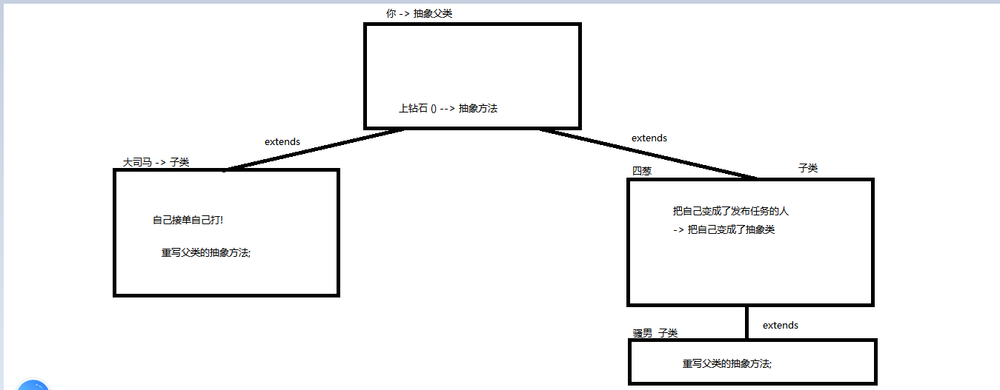

### Day_09随堂笔记

#### 抽象类

```java
抽象类 :  比类更为抽象的类叫抽象类;

抽象类 : 被 abstract 修饰的类叫抽象类;

使用场景: 
	当子类们的共有行为在父类中不好编写行为方法体,那么可以在父类中把此共性行为定义成抽象方法;交给各个子类们自己去重写(实现);

抽象类和普通类之间只有继承关系!  抽象类一般都作为父类存在!!但是抽象类也可以是子类!
```

#### 抽象方法

```java
抽象方法: 被abstract修饰的方法叫抽象方法;

格式:
	public abstract 返回值类型 方法名(形式参数列表);

特点 : 
	1. 没有方法体
    2. 子类们必须重写父类中的抽象方法/.....    
    3. 抽象方法不可以被private修饰    
```

#### abstract

```java
abstract : 抽象
    
修饰的东西 : 类,方法
    被修饰的类 : 抽象类
    被修饰的方法 : 抽象方法    
```

#### 抽象类的成员

```java
    抽象类中的成员:
        //以下成员在抽象类中都可以没有!!
        1. 成员变量 : 可以有
        2. 自定义常量 : 可以有
        3. 构造方法 : 无参和带参都可以有
                //抽象类不可以创建对象!!
        4. 普通方法 : 可以有
        5. 静态方法 : 可以有
        6. 抽象方法 : 可以有
```

#### 抽象类的使用

```java
1. 肯定抽象类都是作为父类的存在
2. 子类要么实现抽象父类中所有的抽象方法(强制)
3. 子类要么自己也变成抽象父类,把继承的抽象方法交付于子类的子类去处理    
```



#### 接口

```java
为什么有接口 ? 当一个类中只有自定义常量和抽象方法的时候,我们可以把这个类定义成接口;

接口的定义格式:
	public interface 接口名{
        
    }
```

#### 接口和类之间的关系

```java
类和类之间 :  继承 -> 单一继承,多层继承 -> extends
类和抽象类之间 :  继承 -> 单一继承,多层继承 -> extends
类和接口之间 :  实现 -> 多实现(一个类可以实现多个父接口) -> implements  
    格式 : 
	public class Zi implements 接口1,接口2....{
        
    }
接口和接口之间 : 继承 -> 多继承(一个接口可以同时继承多个父接口) -> extends
    
一个类可以继承一个父类实现多个父接口: (一个人可以有一个亲爹多个叔叔)
	格式 : 
	public class Zi extends Fu implements Uncle1,Uncle2...{
        
    }
```

#### JDK7及之前的版本接口的成员和使用方式

##### JDK7及之前的版本接口的成员

```java
    JDK7及之前的版本接口的成员  --> JDK7版本的接口是使用最为广泛的
        //以下成员可以啥都没有
        1. 成员变量 : 不可以有
       * 2. 自定义常量 : 可以有
            接口中的成员变量默认被 public static final 修饰 变成了常量
        3. 构造方法 : 不可以有
        4. 普通方法 : 不可以有
        5. 静态方法 : 不可以有
       * 5. 抽象方法 :  可以有
            接口中的成员方法默认被 public abstract 修饰

      什么时候用接口:
        当一个类中全都是抽象方法和自定义常量的时候,就可以把这个类定义成接口;
```

##### JDK7及之前的版本接口的使用

```java
    1. 定义一个实现类,实现父接口,
        1. 并重写父接口中所有的抽象方法
        2. 或把自己变成抽象类
    2. 去测试类中创建实现类的对象,并调用重写后的方法
```

#### JDK8版本接口的成员和使用方式  -> 理解

##### JDK8版本接口的成员

```java
    JDK8版本接口的成员 
        //以下成员可以啥都没有
        1. 成员变量 : 不可以有
       * 2. 自定义常量 : 可以有
            接口中的成员变量默认被 public static final 修饰 变成了常量
        3. 构造方法 : 不可以有
        4. 普通方法 : 不可以有
        5. 静态方法 : 不可以有
       * 6. 抽象方法 :  可以有
            接口中的成员方法默认被 public abstract 修饰
        -----------------------------
       * 7. 默认方法 : 可以有
           格式:
			public default 返回值类型 方法名(形式参数列表){
                方法体;
                //return;
            }
			注意: 默认方法默认被public修饰
       * 8. 静态方法 : 可以有
           格式:
			public static 返回值类型 方法名(形式参数列表){
                方法体;
                //return;
            }
			注意: 静态方法默认被public修饰
             //接口中的静态方法不可以被实现类重写!!
      什么时候用接口:
        当一个类中全都是抽象方法和自定义常量的时候,就可以把这个类定义成接口;
```

##### JDK8版本接口的使用

```java
    1. 定义一个实现类,实现父接口,
        1. 并重写父接口中所有的抽象方法
        2. 或把自己变成抽象类
    2. 去测试类中创建实现类的对象,并调用重写后的方法
    ---------------------------
     接口的默认方法 可以选择性重写!! --> 可以使用实现类对象去调用!       
        //当多个父接口中有相同的默认方法,实现类中就必须重写父接口中的默认方法
            
     接口的静态方法 不可以重写! -->只能使用接口名调用,不可以使用实现类对象调用!!       
```

#### JDK9版本接口的成员和使用方式  -> 了解

##### JDK9版本接口的成员

```java
    JDK8版本接口的成员 
        //以下成员可以啥都没有
        1. 成员变量 : 不可以有
       * 2. 自定义常量 : 可以有
            接口中的成员变量默认被 public static final 修饰 变成了常量
        3. 构造方法 : 不可以有
        4. 普通方法 : 不可以有
        5. 静态方法 : 不可以有
       * 6. 抽象方法 :  可以有
            接口中的成员方法默认被 public abstract 修饰
        -------------JDK8----------------
       * 7. 默认方法 : 可以有
           格式:
			public default 返回值类型 方法名(形式参数列表){
                方法体;
                //return;
            }
			注意: 默认方法默认被public修饰
       * 8. 静态方法 : 可以有
           格式:
			public static 返回值类型 方法名(形式参数列表){
                方法体;
                //return;
            }
			注意: 静态方法默认被public修饰
             //接口中的静态方法不可以被实现类重写!!
        -------------JDK9----------------    
         9. 私有方法
               普通私有: 给默认方法服务 -> 只在接口内部使用
                  格式:
                     private 返回值类型 方法名(形式参数列表){
                         方法体;
                         //return;
                     }
			   静态私有: 给静态方法服务 -> 只在接口内部使用
                  格式:
                     private static 返回值类型 方法名(形式参数列表){
                         方法体;
                         //return;
                     }
      什么时候用接口:
        当一个类中全都是抽象方法和自定义常量的时候,就可以把这个类定义成接口;
```

##### JDK9版本接口的使用

```java
    1. 定义一个实现类,实现父接口,
        1. 并重写父接口中所有的抽象方法
        2. 或把自己变成抽象类
    2. 去测试类中创建实现类的对象,并调用重写后的方法
    ---------------------------
     接口的默认方法 可以选择性重写!! --> 可以使用实现类对象去调用!       
        //当多个父接口中有相同的默认方法,实现类中就必须重写父接口中的默认方法
            
     接口的静态方法 不可以重写! -->只能使用接口名调用,不可以使用实现类对象调用!!    
     ---------------------------
     JDK9中新增的私有方法不可以在实现类中重写或者实现类对象调用 (因为私有外界看不到!)
```

#### 接口的思想

```java
接口的作用:
	从实现类 -> 父接口看 : 拓展功能
    从父接口 -> 实现类看 : 对子类的行为的约束

接口是用来提供 规范!
        
提供规则最重要的事情是什么?? 公开        
        
生活中的接口:  USB接口
    
API : Application Programming Interface    
    
接口中最为重要的关键字 : public    
```

#### 多态

```java
多态 : 事物的多种形态
    
例如 : 
    人类 : 黑人,白人,黄种人,红种人 
    狗 : 金毛,田园犬,拉布拉多,泰迪    
    水 : 液态,气态,固态    
```

#### 多态的前提条件

```java
多态的前提条件:
	1. 必须有继承/实现关系 -> 最重要的条件
    2. 必须有方法的重写 -> 体现多态中 动态绑定 执行方法..  
    3. 父引用指向子类对象 -> 多态形成的语句
         Fu fu = new Zi();
```

#### 多态的本质

```java
多态的本质 : Java中引用数据类型子父类之间的类型转换!!
    Java中基本数据类型 :  byte,short,char < int < long < float < double
		自动提升: 大的数据类型接收小的数据类型的值
		强制转换: 小的数据类型接受大的数据类型的值 -> 强制格式
    Java中引用数据类型子父类间 : 子类/实现类 < 父类/父接口
        向上转型: 父类型接收子类型对象
		向下转型: 子类型接受父类型对象 -> 强制格式
```

#### 多态前提下的成员访问问题

> ```
> 多态的弊端: 父引用不可以访问子类的特有成员!!
> ```

##### 成员变量

```java
多态情况下访问成员变量的特点是 :
        父引用中有的变量才能访问,访问相同名称的变量也是访问父引用;访问不到具体子类对象的成员
            
父类有就有访问父类的,父类没有就报错!            
```

##### 成员方法 -> 重点

```java
动态绑定 :
	父引用调用重写方法时,优先会去子类中找子类重写后的方法执行!

多态情况下成员方法的访问特点 : 具体new的是什么对象,就调用哪个对象类中重写后的方法!
```

##### 构造方法

```java
因为有继承/有实现,子类对象要加载优先加载父类;
```

#### 多态的类型转换

````java
向上转型:父引用接收子类对象
	Fu fu = new Zi(); //弊端: 父引用不可以访问子类的特有成员
向下转型:
    子类型 子对象 = (子类型)(父引用);
	Zi zi = (Zi)(fu);
````

#### 向下转型的弊端和解决办法

```java
    向下转型有风险 :  ClassCastException  :类型转换异常

    注意:每次向下转型之前,要做一个判断!! 原理: 判断一下对象是否是这个类型,如果是就转!

    格式 : 对象引用 instanceof 类型  --> 得到一个boolean类型的结果
    作用 : 判断前面的对象引用指向的对象是否属于后面的类型的

       自己在用对象的时候一定记得 new 子类对象!!!!
```

#### 多态的使用场景 -> 重点

```java
	1. 把父类型作为方法形式参数,启动方法的方式n+1种;
            n: 此父类有多少种子类
            1: 父类本类对象
    2. 把父类型作为方法的返回值类型,返回方法结果的方式有n+1种;
    3. 把父类型作为容器的类型,容器中可以存储的对象类型是n+1种;
```

