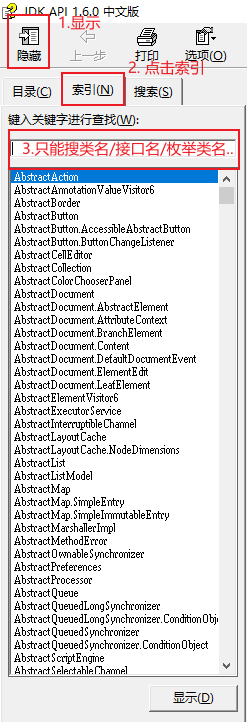
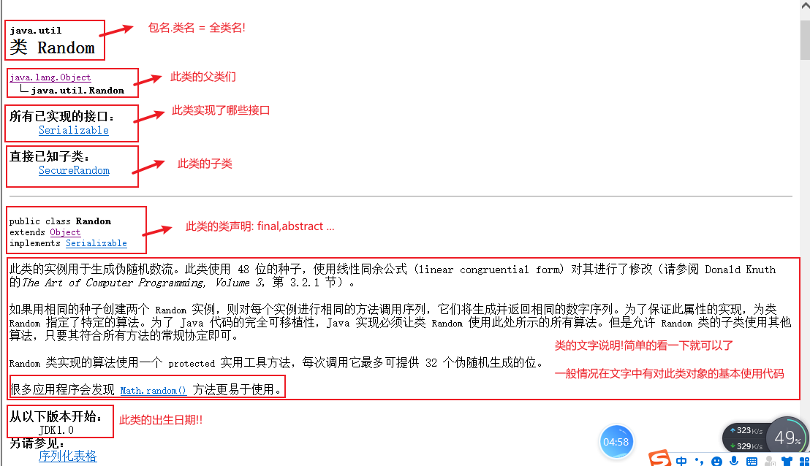
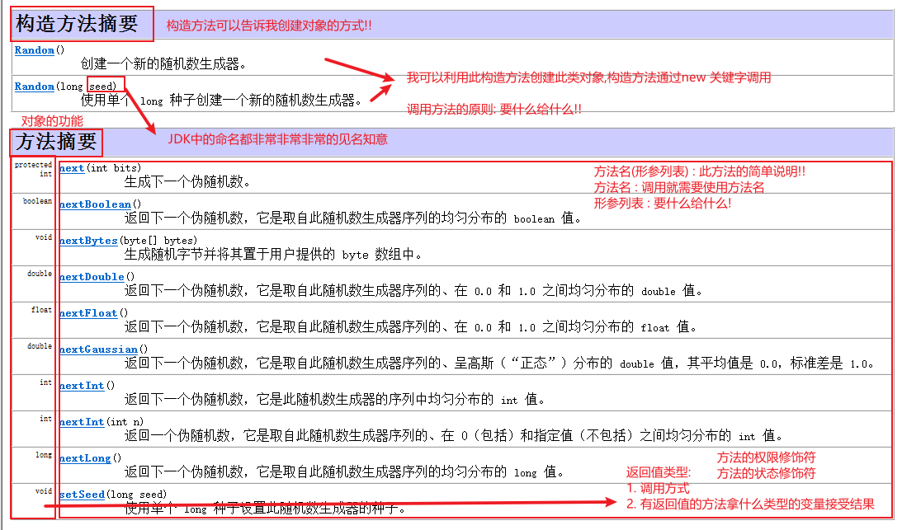
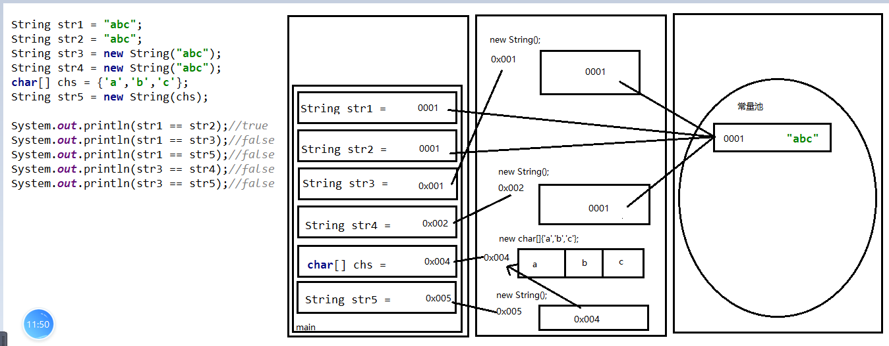

### Day_11随堂笔记

#### API

```java
API : Application Programming Interface -> 应用程序编程接口
    -> 字典,词典,帮助文档
```

#### API的使用步骤



#### API的精讲





> 导包的原则:
>
> 1. 不在同一个包使用就需要导包
> 2. 在JDK中java.lang包下的类使用不需要导包

#### 键盘录入字符串

```java
String next(): 可以录入字符串,但是空格之后的内容不录入了
String nextLine(): 可以录入字符串,也可以录入空格 (弊端: 录入数字后不能录入字符串。解决方法：使用两个Scanner对象分别对数字和字符串进行录入)   
//以后做键盘录入,不知道要录入什么类型的数据就选 nextLine()把它变成字符串    
```

#### String的特点

```java
1. 只要是双引号引起来的内容就是字符串的对象 
    String 类 -> 所有的字符串 -> 事物的抽象
    "xxxx" -> 某个字符串 -> 某类事物的具体化
2. 字符串一旦被定义不能发生改变,要改变一定是生成了新的字符串!
    "abc" -> "abcd" (新的字符串对象)
3. 字符串的本质是一个字符数组,最本质应该是一个字节数组
    "abc" ---> char[] chs = {'a','b','c'};  ---> byte[] bys = {97,98,99};
4. 具体的某个字符串既是一个对象也是一个常量
5. 因为 String 对象是不可变的，所以可以共享; -> 常量可以共享
6. 字符串是Java中唯一一个可以做加法运算的对象,只能做加法运算(本质是做字符串的链接)
7. 字符串的拼接是非常消耗内存资源的
    "Java" + "PHP" + "Python" 在内存中生成了几个字符串对象?
    	"Java" "PHP" "Python" "JavaPHP" "JavaPHPPython"
```

#### String的构造方法

```java
如何创建字符串对象呢?
    ***1. String str = "字符串对象";  -> 最推荐的!!
    2. String() : 创建一个空的字符串对象
    3. String(String original) : 传入一个字符串对象得到一个字符串对象
    char[] --> String转换
    **4. String(char[] value) : 把传入的字符数组中的内容封装成字符串对象
    **5. String(char[] value, int offset, int count) : 把字符数组中的一部分封装成字符串对象
        int offset : 起始索引 int count: 个数
    byte[] --> String转换
    **6. String(byte[] bytes):把传入的字节数组转换成一个字符串对象
    **7. String(byte[] bytes, int offset, int length): 把一个字节数组的一部分转换成字符串
        int offset : 起始索引 int length: 个数

    讲道理: 输出对象就应该看到对象在内存中的地址值,如果输出的不是地址值,那说明有人在捣鬼!
        
    //只要有字符串变量参与拼接运算,和拼接后的常量地址值就不会一样!!    
```



#### String的比较功能

```java
 **boolean equals(Object anObject) : 比较2个字符串的内容是否相同,严格区分大小写
 **boolean equalsIgnoreCase(String anotherString)  : 忽略大小写 比较2个字符串的内容是否相同
     
     
    分析equals方法的源码:
        public boolean equals(Object anObject) {
            //板块1 : 比较调用方法的对象和传入方法的对象的地址值是否相同
            if (this == anObject) {
                //如果2个对象地址值一样,说是同一个对象.
                //作用 : 提高效率
                return true;
            }
            //板块2 : 提高代码的安全性,提高了代码的效率
            if (anObject instanceof String) {
                //进if说明传入的也是字符串对象
                //向下转型
                String anotherString = (String)anObject;//形参/实参
                //获取调用方法字符串对象底层数组的长度 -> 获取调用方法字符串对象的字符个数
                int n = this.value.length;
                //比较调用方法的字符串对象字符个数和传入方法的字符串对象字符个数是否相同
                if (n == anotherString.value.length) {
                    //2个字符串对象的长度相同
                    char v1[] = this.value;//调方法字符串对象的底层数组
                    char v2[] = anotherString.value;//传入方法字符串对象的底层数组
                    int i = 0;
                    while (n-- != 0) {
                        if (v1[i] != v2[i])//v1数组和v2数组只要有一个索引位置的元素值不一样
                            //说明: 2个字符串对象内容不相等
                            return false;
                        i++;
                    }
                    return true;
                }
            }
            //板块3
            return false; //板块1和2结果是false,那么equals方法的结果就是false
        }

```

#### String的判断功能

```java
*boolean contains(CharSequence s)  : 判断传入的字符串是否包含在调用方法字符串内
    CharSequence s : 此接口是String的父接口,所以这里可以直接传入字符串
    
*boolean startsWith(String prefix) : 调用方法的字符串是否以 prefix字符串 开头  -> 校验姓氏 
**boolean endsWith(String suffix) : 调用方法的字符串是否以 suffix字符串 结尾  -> 校验文件后缀名
    
boolean isEmpty() : 判断字符串是否是空字符串 -->  "" 空字符串     
```

#### String的获取功能

```java
 **char charAt(int index) : 获取字符串中指定索引位置的字符
 **int length() : 获取字符串对象的长度 (字符串中字符的个数)    

 //第一次出现
 int indexOf(int ch) : 获取指定字符第一次出现在字符串的索引位置 (既可以传字符也可以传字符对应的ASCII码) 
 int indexOf(int ch, int fromIndex):获取指定字符第一次出现在字符串的索引位置
      int fromIndex : 从哪个索引开始算
 int indexOf(String str) : 获取指定字符串第一次出现在字符串的索引位置 
 int indexOf(String str, int fromIndex): 获取指定字符串第一次出现在字符串的索引位置  
      int fromIndex : 从哪个索引开始算
 //下列方法是获取最后一次出现
 int lastIndexOf(int ch) 
 int lastIndexOf(int ch, int fromIndex) 
 int lastIndexOf(String str) 
 int lastIndexOf(String str, int fromIndex )    
     
 int hashCode() : 获取字符串对象的hash值 
     hashCode(): 在Object中没有重写的hashCode方法的功能是 获取对象在内存中的十进制地址值!
          //一般情况,对象的hash值就是对象在堆内存中的十进制地址值
```

#### String的转换功能

```java
String toLowerCase() : 字符串中的英文字符全部变成小写的
String toUpperCase() : 字符串中的英文字符全部变成大写的

------------------以下是重要方法-----------------------    
String --> char[]    
	**char[] toCharArray() : 字符串转换成字符数组    
char[] --> String转换
    **String(char[] value) : 把传入的字符数组中的内容封装成字符串对象    
    
String --> byte[]
    **byte[] getBytes() : 字符串转换成字节数组
byte[] --> String转换
    **String(byte[] bytes):把传入的字节数组转换成一个字符串对象    
```

#### String的替换功能

```java
String replace(CharSequence target, CharSequence replacement) : 替换功能
	CharSequence target : 目标字符串
    CharSequence replacement : 替换的字符串    
```

#### String的截取功能

```java
String substring(int beginIndex) : 从beginIndex开始截取字符串到字符串结尾,生成了新的字符串
String substring(int beginIndex, int endIndex) : 从beginIndex开始截取字符串到endIndex结尾,生成了新的字符串;
	[beginIndex,endIndex)
```

#### String的切割功能

```java
String[] split(String regex): 按照传入的字符串regex切割原字符串,得到切割之后的字符串数组

    regex : 可以传入正则表达式

    正则表达式 : 一套语法规则,适用于很多编程语言 -> 为了方便

    . : 通配符 -> 任意的字符
    x+ : x出现一次或者多次都按一次算
    \ : 转义符
    在正则中要表示\ : \\\\
    在正则中要表示. : \\.
```

#### String的匹配功能

```java
boolean matches(String regex) : 判断调用方法的字符串是否满足传入的正则规则
    正则表达式请百度 不要自己研究
```

#### String的其他功能

```java
String concat(String str) : 拼接字符串 -> 废物方法
String toString() : 把字符串对象转换成字符串对象 -> 废物方法
static String valueOf(任意类型的数据)  : 把任意的数据转成字符串类型 -> 废物方法
    
    
String trim() : 去除字符串两端的空格,并返回新的字符串; -->  有事没事trim一下
```

