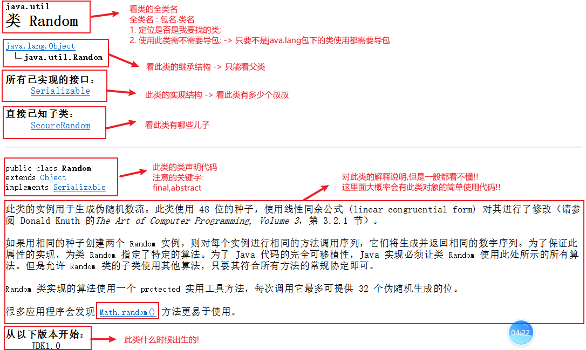
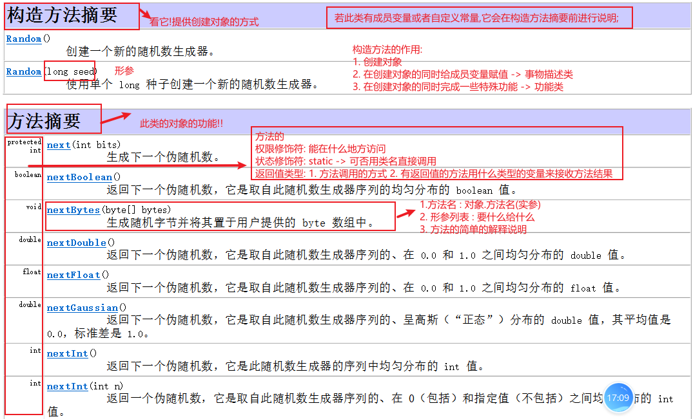
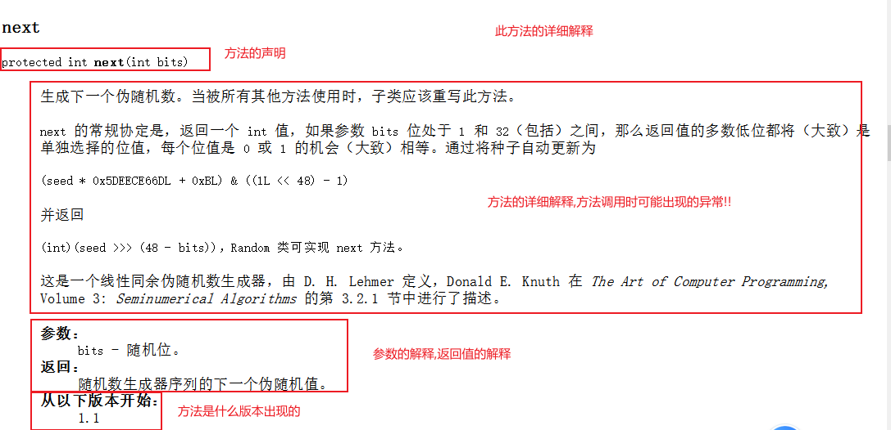
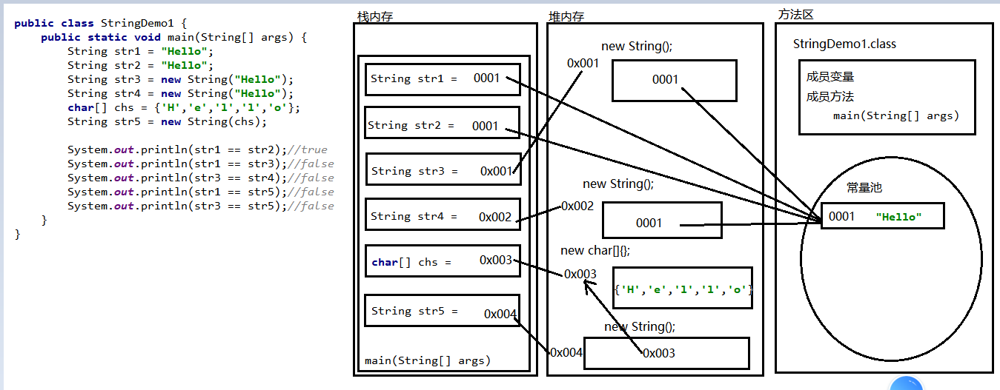

### Day_11随堂笔记

#### API

```java
Application Programming Interface : 应用软件编程接口 -> 帮助文档 
    --> 学习Java语言的词典
```

#### API如何使用

```java
1. 找到API文档,双击打开
2. 在左边找到显示和索引栏目
3. 在搜索框中搜索你要查询的  类名/接口名/抽象类名/枚举类名/注解名    
4. 双击进入 类的详情页 
```







#### 键盘录入字符串的功能

```java
    String next() : 可以录入字符串 (不录入空格之后的字符串)
    String nextLine() :录入一行字符串
        //以后做键盘录入时,你不知道用什么类型来接收录入的数据就用nextLine
```

#### String字符串

```java
String : 字符串 -> java.lang.String
    
String 是Java中最为特殊的引用数据类型, String 的对象也是Java中最为特殊的对象 
    //因为String字符串既是常量也是引用数据类型
    
String 的特点:
	1. 字符串有一个非常特殊的创建对象的方式 : String 对象名 = "直接赋值即可";
	2. 只要是双引号引起来的内容就是一个字符串对象!!
    3. 字符串一旦被定义不能改变,如果改变那么一定生成了新的字符串
        	"Hello" + "World" + "Java" 
        	//"Hello","World","Java","HelloWorld","HelloWorldJava"
    4. 字符串的本质是 一个字符数组, 更本质是 一个字节数组 -> 计算机中一切皆字节(true)
    5. 字符串是一个唯一可以做加法的对象 -> 拼接
    6. 因为 String 对象是不可变的，所以可以共享    
```

#### 创建字符串的方式

```java
创建字符串对象:
       ** 1. String str = "字符串";
        2. String() : 创建了一个空的字符串
            // null: 空常量 "": 空字符串 '\u0000':空字符 " ": 空格字符串
        3. String(String original): 把传入的字符串封装成一个字符串对象
        *4. String(char[] value): 把传入的字符数组中的字符链接成一个字符串对象
        *5. String(char[] value, int startIndex, int length):把字符数组中一部分转换成字符串对象
            startIndex:起始索引 length: 转几个
        *6. String(byte[] bytes): 把传入的字节数组中的字节链接成一个字符串
        *7. String(byte[] bytes, int offset, int length):把字节数组中的一部分内容转换成字符串对象

     输出对象一定是输出对象在堆内存中的地址值,但是只要不是地址值就一定有人在捣鬼!!
```

#### 字符串创建对象的内存图



#### 字符串的比较功能

```java
boolean equals(Object obj): 用来比较调用方法的字符串内容和传入的字符串对象内容是否相同(严格区分大小写)
boolean equalsIgnoreCase(String anotherString): 比较调用方法的字符串内容和传入方法字符串    
```

#### equals方法源码分析

```java
 equals方法的源码分析:
         public boolean equals(Object anObject) {
            //第一板块
            if (this == anObject) {//false
                return true;
            }
            //第二板块
            if (anObject instanceof String) {//false
                //能进来说明anObject是String类型,是String才能转型
                //向下转型
                String anotherString = (String)anObject;
                //value调用方法字符串的底层数组
                int n = value.length;//获取调用方法字符串的长度
                //传入的字符串底层数组的长度获取
                if (n == anotherString.value.length) {//判断2个字符串的长度是否相同
                    //能进入if 说明调用方法的字符串长度和传入方法的字符串长度一致
                    char v1[] = value;//调用方法字符串底层数组
                    char v2[] = anotherString.value;//传入方法字符串底层数组
                    int i = 0;
                    //遍历字符串 -> 获取字符串的每一个字符
                    while (n-- != 0) {
                        //判断v1数组和v2数组中i索引的字符值是否不相同
                        //只要v1数组和v2数组有一个索引位置的字符值不相同则equals方法返回false
                        if (v1[i] != v2[i]){
                            return false;
                        }
                        i++;
                    }
                    return true;
                }
            }
            //第三板块
            return false;
        }

     分析:
        1. 第一板块的if判断是false , 第二板块的if判断是 false, equals方法的结果一定是false
        2. 每个板块中都有return语句,那么只要有一个if成立就有可能改变方法的结果!
        3. 第一板块:  是否是自己比自己,如果是自己比自己就直接返回true
              this == anObject --> (调用方法的对象 == 传入方法的实参对象)
             作用: 提高代码的效率
        4. 第二板块: anObject instanceof String : 判断实参是否是 String类型
                假如实参不是String类型,equals方法返回false
                    结论: String类中equals也只能比较2个字符串的内容是否相同,如果传入的不是字符串直接false处理
                假如实参是String类型 , 判断的结果就是true,进入if大括号
```

#### 字符串的判断功能

```java
*boolean contains(CharSequence s): 判断调用方法的字符串中是否包含传入的字符串内容
        //CharSequence: 就把他当String类型的形参

*boolean endsWith(String suffix): 判断调用方法的字符串是否以传入的字符串结尾 (判断文件的后缀名)
*boolean startsWith(String prefix): 判断调用方法的字符串是否以传入的字符串开头(判断姓氏)

boolean isEmpty(): 判断字符串是否是空字符串 ->  ""
```

#### 字符串的获取功能

```java
    *char charAt(int index)  : 获取指定索引位置上的字符
    *int length() : 获取字符串中字符的个数
    //这两个方法可以帮助我们遍历字符串,获取字符串的每一个字符

    //获取一个字符/一个字符串第一次出现在原字符串的索引位置
    int indexOf(int ch) : 这里可以传入字符,也可以传入字符的ASCII码值
    int indexOf(int ch, int fromIndex): fromIndex: 从哪个索引开始计算
    int indexOf(String str) :按照传入的字符串的首个字符第一次出现的索引位置开始计算
    int indexOf(String str, int fromIndex)

    //获取一个字符/一个字符串最后一次出现在原字符串的索引位置
    int lastIndexOf(int ch)
    int lastIndexOf(int ch, int fromIndex)
    int lastIndexOf(String str)
    int lastIndexOf(String str, int fromIndex)  
```

#### 字符串的转换功能

```java
char[] --> String 
    *String(char[] value): 把传入的字符数组中的字符链接成一个字符串对象
    *String(char[] value, int startIndex, int length):把字符数组中一部分转换成字符串对象
String --> char[]
    char[] toCharArray(): 把字符串转换成字符数组 -> 打回原形  
    
byte[] --> String 
    *String(byte[] bytes): 把传入的字节数组中的字节链接成一个字符串
    *String(byte[] bytes, int offset, int length):把字节数组中的一部分内容转换成字符串对象
String --> byte[] 
    byte[] getBytes():把字符串按照平台的默认编码格式转换成字节数组 -> 打回原原形 
    	//如果字符串中有中文,中文会按照平台的默认编码格式把中文转换成字节
        //所有的中文字符的字节值都是以负数开头
        //UTF-8编码格式中,一个中文占用3个字节
        //GBK编码格式中,一个中文占用2个字节
    byte[] getBytes(String charSetName):把字符串按照自定义的编码格式转换成字节数组 -> 打回原原形 
```

#### 字符串的替换功能

```java
String replace(CharSequence target, CharSequence replacement)  
    target : 目标
    replacement : 替换的内容  
//只要字符串调用方法修改了字符的内容,一定记得接收结果,原来的字符串是不会改变的!!
```

#### 字符串的截取功能

```java
String substring(int beginIndex)  : 从beginIndex索引开始截取字符串,到字符串的末尾
String substring(int beginIndex, int endIndex) : 从beginIndex索引开始截取字符串,到endIndex索引结束; --> [beginIndex,endIndex - 1]
    
//对字符串进行了修改,就生成了新的字符串,新的字符串要重新接受!!!    
```

#### 字符串的切割功能

```java
"1990-01-01" --> 得到年月日
    
String[] split(String regex) : 按照传入的字符串对原字符串进行切割,把切割后的字符串存入一个字符串数组
    
注意:
	1. 基本使用: 你想按什么切割,就传入什么 
    2. String regex : regex 正则表达式   
        regex 正则表达式 : 一套规则 -> 快速且简便的做一些规则的校验~
            遇到需要写正则的地方,百度!!!
        	+ : 出现一次或者多次都按一次算
            . : 正则的通配符
            如果真的想按照点来切割,必须要使用转义符 -> \\.
            \\ : 来切割
            		正则: \\\\    
```

#### 字符串的匹配功能

```java
boolean matches(String regex) : 判断字符串的内容是否满足传入正则的规则
    
    正则的规则: 去百度!!!
```

#### 字符串的其他功能

```java
     String concat(String str)  : 把传入的字符串和调用方法的字符串链接在一起
     String toString() : 把字符串对象转换成一个字符串对象

     String toLowerCase(): 把字符串中的英文大写字符变成英文小写字符,生成新的字符串
     String toUpperCase(): 把字符串中的英文小写字符变成英文大写字符,生成新的字符串

  *   String trim():去除字符串两端的空格,生成新的字符串! -> 拿到用户的数据有事没事trim一下!
```

