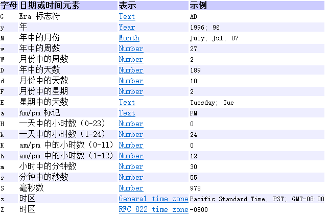
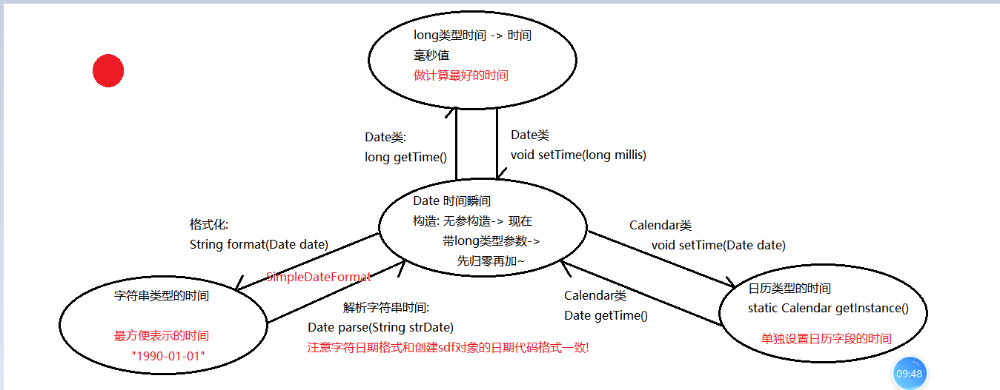

### Day_12随堂笔记

#### StringBuilder/StringBuffer(大量的字符串拼接要用)

```java
为什么会有StringBuilder/StringBuffer这些类??
    字符串一旦被定义不能改变,只要改变就生成新的字符串;所以在做字符串的拼接的时候非常消耗内存资源;
	StringBuilder/StringBuffer -> 类似于长度可变的"字符串";

StringBuilder/StringBuffer 和 String 不是同一种类型!! 
    StringBuilder/StringBuffer 方便操作字符串的"工具类"; -> 字符串的缓冲区类;
        
StringBuilder/StringBuffer 他们的功能完全一致(方法都一样) ,不一样的是 :
	1. StringBuilder : 效率高,线程不安全的类
    2. StringBuffer : 效率低,线程安全的类    
        
StringBuilder
		String str = "abc"; √
        StringBuilder sb = "abc"; X    
    构造方法:
        StringBuilder()
        StringBuilder(String str) : 此构造方法还实现了 String 对象 到 StringBuilder对象的转换
            直接输出StringBuilder对象看到的StringBuilder中的字符内容
            
    StringBuilder的成员方法:
        1. StringBuilder append(任意类型的数据): 在原有的StringBuilder对象中拼接上传入的实参数据,并返回自己
            这个方法的调用可以不用接收
        2. StringBuilder reverse(): 一键翻转,并返回自己  
            
   String 和 StringBuilder 之间的转换问题:
        String -> StringBuilder
            StringBuilder的构造方法:StringBuilder(String str)
        StringBuilder -> String
            1. StringBuilder的成员方法: String toString()         
```

#### Object

```java
Object :  超类,根类,基类 
    //Java中所有的类都直接或者间接的继承与Object (包括数组)
    
了解Object的构造方法:
	Object() : 空参构造  -> 每一个类中的构造方法的第一句代码默认是 super();

Object 的成员方法:
	String toString() :
	boolean equals(Object obj)  :
```

##### Object中的toString()方法

```java
    结论: 直接输出对象名其实就是输出对象.toString()方法结果

    toString()方法的源码:
        public String toString() {
            return getClass().getName() + "@" + Integer.toHexString(hashCode());
        }

    this.getClass().getName() + "@" + Integer.toHexString(hashCode())
    "@"左边:获取对象的全类名
        getClass(): 获取对象的字节码对象
        字节码对象.getName(): 获取对象的字节码对象的名称 -> 对象所在类的全类名(包名.类名)
    "@" : 起到分隔的作用
    "@"右边: 把对象10进制的地址值用16进制表示
        Integer.toHexString(this.hashCode())
            this.hashCode(): 获取对象的哈希值 -> 对象的哈希值默认是十进制的地址值
        Integer.toHexString(十进制的地址值) -> 把10进制的数转换成16进制

     Object类中的toString()方法的源码是:
        com.atguigu.object.Student@4554617c
                        对象的全类名@对象在内存中16进制的地址值;

    假设你有需求,打印对象的时候看到不是对象的地址值而是对象的属性值
        那么我可以在类中重写父类的toString方法,在toString中拼接对象的属性值

    结论: 以后只要看到打印对象不是地址值,一定是此对象所在的类中重写了toString()方法
```

##### Object中的equals()方法

```java
boolean equals(Object obj)  :

    Object类中equals方法的源码:
        public boolean equals(Object obj) {
            return (this == obj);
        }
        this == obj : 调用方法的对象 == 实参传入的对象
        == : 比较基本数据类型的值是否相同,比较引用数据类的地址值是否相同

    假如你希望通过equals方法比较的是对象的属性值而不是对象的地址值,我可以重写父类的equals方法  
```

##### 自动生成equals方法的源码分析

```java
    public boolean equals(Object o) {
        //自己比自己
        if (this == o) return true;
        //实参是null || 如果调用方法对象的类型和实参的类型不一样
        if (o == null || this.getClass() != o.getClass()) return false;

        //o对象一定是 Student类型
        Student student = (Student) o;

        //先比较对象的年龄
        if (age != student.age) return false;

        //年龄一致 比较名字
        // 对name的值进行非空校验
        return name != null ? name.equals(student.name) : student.name == null;
    }
```

#### 标准的JavaBean的编写步骤

```java
1. 私有属性
2. 无参构造
3. 全参构造
4. getter and setter
5. 重写equals() 和 hashCode()方法
6. 重写toString()方法
```

#### Objects

```java
Objects : 关于对象操作的工具类
    Objects类最喜欢做 非空校验~
    
静态方法:
    static boolean equals(Object a, Object b)  :
          不是重写的Object类中的equals()
    Objects中equals方法的源码:
        public static boolean equals(Object a, Object b) {
            //ab两个对象是否是同一个对象 || (先拿a做非空校验 再拿a的equals方法比较b)
            return (a == b) || (a != null && a.equals(b));
        }
     结论: Objects中的equals和Object类中的equals方法的区别在于: Objects中增加对a对象的非空校验!

	static boolean isNull(Object obj): 判断obj对象是否为null,是null返回true,不是null返回false
	    源码: return obj == null
    static boolean nonNull(Object obj): 判断obj对象是否不为null,不是null返回true,是null返回false
        源码: return obj != null


    static String toString(Object obj) : 调用对象的toString()方法但是提前对o对象做非空校验
        若obj对象是null,返回字符串"null"
        源码: (obj == null) ? "null" : obj.toString();
    static String toString(Object obj, String nullDefault): 调用对象的toString()但是提前对o对象做非空校验
        若obj对象是null,返回nullDefault的值
        源码: (obj == null) ? nullDefault : obj.toString();
```

#### Arrays

```java
操作数组的工具类
    
静态方法:
	static String toString(任意类型的数组) :  漂亮的打印数组
    static void sort(任意类型的数组) : 按照元素的自然升序对数组内容进行排序(底层: 快速排序算法)
         //自定义类型必须提供排序规则才能排序
        默认排序: 整数,小数:从小到大 字符串: 按照字符的ASCII码值升序排序
            
    static int binarySearch(int[] a, int key): 查询第二个参数的元素出现在数组的索引位置(二分查找法)        二分查找法的前提是: 序列有序!

    static boolean equals(int[] a, int[] a2): 判断2个数组的内容是否相同 (每一个索引位置的元素都一样)

    static int[] copyOf(int[] original, int newLength): 复制老数组,第二个参数是新数组的长度
        //若新数组的长度没有老数组的长度长,新数组从老数组的第一个元素开始复制,能复制多少就复制多少
    static int[] copyOfRange(int[] original, int from, int to): 复制老数组
        int from: 从老数组的哪个索引开始复制
        int to: 到老数组的哪个索引位置
        范围区间: [from,to)  
```

#### Math

```java
关于基本数学运算的工具类; 

静态成员:
	static double E = 2.7~;
	static double PI = 3.1415926~;
静态方法:
	static double abs(int a): 求绝对值

    static double ceil(double a)  : 天花板 -> 向上取整
    static double floor(double a)  : 地板 -> 向下取整
    static long round(double a) : 四色五入

    static int max(int a, int b) : 求2个数的较大值
    static int min(int a, int b) : 求2个数的较小值

    static double pow(double a, double b)  : 求第一个参数的第二个参数次幂

    static double random()  : 求随机数的方法 [0,1.0)
```

#### System

```java
系统操作的工具类;

静态成员变量:
	static PrintStream out; -> 系统的标准输出流 -> 打印内容到控制台
    static InputStream in; -> 系统的标准输入流 -> 键盘录入    
        
静态成员方法:
	static void gc()  : 手动启动垃圾回收机制 -> 一般不用
    static void exit(int status) : JVM退出 -> 最高级别的退出
        	int status : 状态码 -> 非零即为异常退出 (一般情况下我们传入0)
        break : 结束循环和switch
        return : 结束方法
   ** static long currentTimeMillis()  : 获取当前时间毫秒值   
    	时间原点: 0毫秒时间
         1970年01月01日 00:00:00 ->格林威治时间
         1970年01月01日 08:00:00 ->+8东八区时间

    时间原点为什么是1970年01月01日 00:00:00 ?
        计算机发展史有关,最早起的计算机操作系统是 32位操作系统, 32位操作系统能够表示的数转换成时间 +-68年多(137年作用)

        现在不用担心,64位操作系统的时间范围能到宇宙毁灭~
```

#### 时间概述

```java
年月日时分秒
    
1秒 = 1000毫秒;
1毫秒 = 1000微秒;
1微秒 = 1000纳秒;
------------------------
long 类型的时间单位 : 毫秒值
Date 类型的时间单位 : Date对象
String 类型的时间单位 : "1990年01月01日"   
Calendar 类型的时间单位 : 日历时间    
```

#### Date

```java
Date -> java.util.Date 
    
Date : 特定的时间瞬间,，精确到毫秒 -> 一个Date对象就是一个时间戳    
    
构造方法:
	Date() : 创建Date对象,Date对象指向的时间是创建Date对象的瞬间;
    Date(long millis) :创建Date对象,先把时间归零,在加上传入的时间毫秒值定格的瞬间;

成员方法:
	long getTime(): 获取当前Date对象指向的时间瞬间的时间毫秒值
	void setTime(long millis):设置当前Date对象指向的时间瞬间
	    1. 先把调用方法的Date对象指向的时间归零
	    2. 在把传入的毫秒值加上时间原点定位的瞬间给Date对象
        
long 时间毫秒值 -> Date时间对象
    1. Date(long millis)
    2. void setTime(long millis)    
        
Date时间对象 -> long 时间毫秒值  
    long getTime()
        
Date中需要了解的方法:	
	String toLocaleString()  : 以当地时区的习惯表示时间
    String toGMTString()  : 以0时区的习惯表示时间
```

#### SimpleDateFormat

```java
字符串类型的时间是最为方便的 : "1990年01月01日" 
    String -> Date时间 -> long 时间
    
SimpleDateFormat : 简单时间格式化类
    解析: String 类型的时间  ---> Date 类型的时间
        //"1990年01月01日"  -解析字符串-> 定位到Date对象上
    格式化: Date 类型的时间 ---> String 类型的时间 
        //Mon Sep 27 14:54:55 CST 2021 -格式化-> "2021年09月27日 14:54:55"
        
构造方法:
	SimpleDateFormat(String pattern) : 创建SimpleDateFormat对象,并指定时间对象的日期格式
        String pattern : 日期格式代码 //不管是解析还是格式化日期都需要指定 日期格式
            小公式 : yyyy 年 MM月 dd日 HH:小时 mm:分钟 ss:秒钟
                
格式化的方法:
	String format(Date date): 把传入的Date对象以创建sdf对象的日期格式进行格式化展示
        
解析的方法:
    Date parse(String strDate): 把传入的字符串时间定位到Date对象上
            (严格要求 字符串的日期格式必须和sdf对象创建时指定的日期格式一模一样)
        //涉及到一个编译时期异常 (对着报错位置按alt + enter,选择第一个)
```



#### Calendar日历类

```java
Calendar操作注意:
	1. 一个星期的第一天是星期日
    2. 月份索引从0开始    
        
创建对象:
	//因为Calendar类是一个抽象类,抽象类不能创建对象,而我非要创建Calendar对象的时候:
	//去类中找 static 修饰符 且 返回值为 Calendar 类型的 方法
	static Calendar getInstance()  
        
成员方法:
        int get(int field):获取时间信息
            int field: 你要设置的时间字段(比如年,月....)
            获取日历中时间信息: Calendar.字段名
        void set(int field,int value):设置时间信息
                
转换类型的方法:
	Calendar --> Date
        Date getTime(): 把日历对象的时间信息定位到Date对象上
    Date --> Calendar
        void setTime(Date date): 把Date对象的时间信息定位到Calendar对象上
```

#### JDK7时间类的总结(重点)



