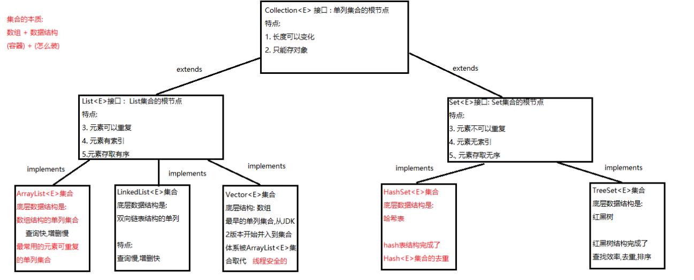
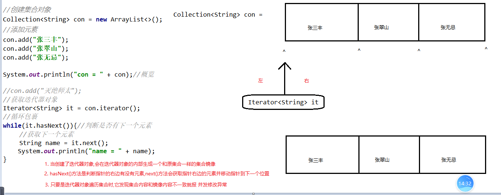

### Day_13随堂笔记

#### JDK8版本的时间操作

##### LocalDate/LocalTime/LocalDateTime

```java
LocalDate : 年月日
LocalTime : 时分秒 
LocalDateTime : 年月日,时分秒   
    //这三个类的功能基本一样
    //最低时间单位是 : 纳秒 nanosecond
```

##### LocalDateTime

```java
//LocalDateTime是一个不可变的日期时间对象
创建对象的方式:
	static LocalDateTime now() : 创建LocalDateTime对象,时间指向现在
    static LocalDateTime of(int year, int month, int dayOfMonth, int hour, int minute, int second)  : 创建LocalDateTime对象,时间自定义的    
```

##### DateTimeFormatter

```java
格式化 : 时间对象 --> String时间
    解析 : String时间 --> 时间对象

    1.8之前:
        格式化:
            SimpleDateFormat : String format(Date date)
        解析:
            SimpleDateFormat : Date parse(String time)

    1.8版的格式化和解析操作:
        专门设置格式的类 : DateTimeFormatter
        创建DateTimeFormatter对象的方式
            static DateTimeFormatter ofPattern(String pattern)
                String pattern: 时间代码
        格式化:
        LocalDateTime类中的 String format(DateTimeFormatter对象)
        解析:
        LocalDateTime类中的 static LocalDateTime parse(String time,DateTimeFormatter对象)
```

##### LocalDateTime的get系列方法(获取值)

```java
int getYear()  :获取年信息
int getMonthValue() :获取月份信息(1-12)
int getDayOfMonth(): 获取天信息      
int getHour() :获取小时信息    
int getMinute():获取分钟信息
int getSecond(): 获取秒钟信息    
-------------------------------------------    
DayOfWeek getDayOfWeek():获取星期信息  
int getDayOfYear():获取年中天信息  
Month getMonth(): 获取月份信息(枚举对象返回)   
int getNano():获取纳秒信息     
```

##### LocalDateTime的plus系列方法(加)

```java
plus系列方法是对日期字段进行做加法的操作!
LocalDateTime plusYears(long years) 
LocalDateTime plusMonths(long months)   
LocalDateTime plusDays(long days)  
LocalDateTime plusHours(long hours)  
LocalDateTime plusMinutes(long minutes)  
LocalDateTime plusSeconds(long seconds) 
-------------------------------------------------    
LocalDateTime plusNanos(long nanos)  
LocalDateTime plusWeeks(long weeks)  
    
注意:
	1. 记得接收, 因为时间修改是生成新的LocalDateTime对象,老的LocalDateTime对象不会改变
    2. 如果你传入的是正数就是做加法,如果你传入的是负数就是做减法    
```

##### LocalDateTime的minus系列方法(减)

```java
minus系列方法是对日期字段进行做减法的操作!
LocalDateTime minusYears(long years) 
LocalDateTime minusMonths(long months)   
LocalDateTime minusDays(long days)  
LocalDateTime minusHours(long hours)  
LocalDateTime minusMinutes(long minutes)  
LocalDateTime minusSeconds(long seconds) 
-------------------------------------------------    
LocalDateTime minusNanos(long nanos)  
LocalDateTime minusWeeks(long weeks) 
    
注意:
	1. 记得接收, 因为时间修改是生成新的LocalDateTime对象,老的LocalDateTime对象不会改变
    2. 如果你传入的是正数就是做减法,如果你传入的是负数就是做加法       
```

##### LocalDateTime的with系列方法(设置值)

```java
with系列方法是对日期字段进行设置值的操作!
LocalDateTime withYears(long years) 
LocalDateTime withMonths(long months)   
LocalDateTime withDays(long days)  
LocalDateTime withHours(long hours)  
LocalDateTime withMinutes(long minutes)  
LocalDateTime withSeconds(long seconds) 
-------------------------------------------------    
LocalDateTime withNanos(long nanos)  
LocalDateTime withWeeks(long weeks) 
    
注意:
	1. 记得接收, 因为时间修改是生成新的LocalDateTime对象,老的LocalDateTime对象不会改变
```

##### LocalDateTime的时间间隔方法

```java
long until(Temporal endExclusive, TemporalUnit unit)  
```

##### Period

```java
Period :  年月日的时间间隔类
    
获取时间间隔对象的方式:
	static Period between(LocalDate startDateInclusive, LocalDate endDateExclusive)  
```

##### Duration

```java
Duration : 时分秒的时间间隔类
    
获取时间间隔对象的方式:
	static Duration between(Temporal startInclusive, Temporal endExclusive)  
        //Duration中的between是不可以传入LocalDate对象

Temporal :  LocalDateTime,LocalDate,LocalTime 的父接口
    
成员方法:    
    long toDays():获取这个时间间隔内的天数
```

#### 集合概述

```java
集合 : 一种长度可以变化的容器!!
    
学习容器的三步走:
	1. 如何创建容器
    2. 增删改查四类功能
    3. 遍历容器
        
集合的分类 : 单列 和 双列 
    
集合的特点:
1. 长度可变  --> 好处
2. 只能存储引用数据类型的元素 -> 只能存对象!  -> 弊端 : 弊端被解决了    
```

#### 单列集合的体系结构



#### Collection<E>接口

```java
Collection<E>接口 : 单列集合的根节点 --> 接口不可以创建对象!!
    
创建对象
    Collection<E> 集合名 = new 实现类对象<E>();
	格式解释:
		Collection : 父接口
        集合名 : 父引用
        <E> : 泛型  -> 一种说不清楚的类型
            作用: 约束集合中元素的数据类型的
            注意: 泛型只可能是一种引用数据类型
            使用: 在创建集合的时候拿具体的引用数据类型类名替换E即可   
        = : 赋值 --> 赋的是地址值
        new : 创建对象
        实现类对象 : 任意的Collection的实现类
        <E> : 必须和前面的E类型一致 (JDK7之后就可以省略后面的E的编写)  
        () :  无参构造    
    例如:
        Collection<String> coll = new ArrayList<String>();
        Collection<Student> coll = new HashSet<Student>();    
		Collection<int> coll = new HashSet<int>();  -> 错误  
增删改查
    增 : add
    	boolean add(E e)  : 根据集合的泛型类型添加固定类型的元素,并返回添加是否成功
    删 :
		boolean remove(Object o) : 按照传入元素的值删除集合中的该元素,并返回删除是否成功
        void clear() : 清除集合中所有的元素    
    改 :        
 		在Collection<E>集合中没有set方法,因为Collection集合还没有索引
    查 :   
		在Collection<E>集合中没有get方法,因为Collection集合还没有索引
        int size(): 获取集合中元素的个数
            
        boolean contains(Object o) : 查询传入的元素是否包含于集合中
     	boolean isEmpty()  : 查询集合是否为空集合
遍历    
    1. Object[] toArray() : 转数组
```

#### Iterator<E>迭代器

```java
Iterator<E>迭代器 : 专门用来遍历集合的工具 -> 更为面向对象的方式遍历集合
    
使用步骤:
	1. 找调羹
        Colletion<E>接口 : Iterator<E> iterator()
    2. 看一眼
        Iterator<E>接口 : boolean hasNext(): 判断是否有下一个元素
    3. 舀起来
        Iterator<E>接口 : E next(): 获取下一个元素    
```

##### 底层原理



#### 并发修改异常

```java
    ConcurrentModificationException : 并发修改异常
        原因: 在创建了迭代器对象之后,使用集合对象对集合元素进行修改
        解决办法:
            1. 在迭代器遍历集合的时候不要使用集合对象对原集合进行修改
            2. 请使用 ListIterator 列表迭代器
```

#### 增强for

```java
//使用前提是,一个类或者它的父类或者父接口实现了 Iterable<E> 接口

单列集合和数组都可以用增强for!!
    
增强for的格式:
	for(泛型 变量名 : 集合名/数组){
        //对变量名进行操作 --> 变量名就是在接收集合/数组中的元素
    }

增强for的底层是: 迭代器
    所以不要在增强for中对集合内容进行修改
```

#### 包装类型和自动装箱/自动拆箱

```java
集合只能存储对象,因为泛型E 只能是一个引用数据类型

    包装类 : 基本数据类型对应的引用数据类型
        byte        Byte
        short       Short
        int         Integer
        long        Long
        float       Float
        double      Double
        char        Character
        boolean     Boolean

    我们在往集合中存储基本数据类型的时候,把泛型写成对应的基本数据类型包装类即可!


    自动装箱和自动拆箱 :
        自动装箱: 基本数据类型数值 ---> 对应包装类型的对象
            例如: Integer i = 100;
            真实代码 : Integer i = Integer.valueOf(100);
        自动拆箱: 对应包装类型的对象 ---> 基本数据类型数值
            例如: int num = i;
            真实代码 : int num = i.intValue();
```

#### 包装类中的解析功能

```java
包装类中的解析功能 : 字符串类型的基本数据类型值转换成对应的基本数据类型值;
	字符串类型的基本数据类型值 : "100"  "true"  "13.14"
        
包装类中的解析方法:
	static xxxx parseXxxx(字符串类型的基本数据类型值); //除了Character没有
		xxxx: 对应基本数据类型

例如 Integer :  static int parseInt(String num)
```

#### List<E>接口

```java
List<E>接口 : 元素有索引,元素存取有序,元素可以重复的集合的根节点 (长度可变,只能存对象)
    
创建对象:
	List<E> 集合名 = new 实现类<>();

增删改查四类功能:
	增 : add
    	boolean add(E e)  : 依次添加元素,永远返回true
    删 :
		boolean remove(Object o) : 按照传入元素的值删除集合中的该元素,并返回删除是否成功
        void clear() : 清除集合中所有的元素    
    查 :   
        int size(): 获取集合中元素的个数
            
        boolean contains(Object o) : 查询传入的元素是否包含于集合中
     	boolean isEmpty()  : 查询集合是否为空集合
    ------------------特有的--------------------------    
    增 :  void add(int index, E element)  : 在指定索引位置插入元素       
    删 :  E remove(int index) : 删除指定索引位置的元素,并返回被删除的元素
    改 :  E set(int index,E element) :修改指定索引位置的元素,并返回被修改的元素 
    查 :  E get(int index) : 获取指定索引位置的元素  
        
遍历:
	//遍历1: 转数组
        Object[] objs = list.toArray();
        for (Object name : objs) {
            System.out.println("name = " + name);
        }
        System.out.println("---------------");
        //遍历2 : 普通迭代器
        Iterator<String> it = list.iterator();
        while(it.hasNext()){
            String name = it.next();
            System.out.println("name = " + name);
        }
        System.out.println("---------------");
        //遍历3 : 增强for
        for (String name : list) {
            System.out.println("name = " + name);
        }
        System.out.println("---------------");
        //遍历4 : 普通for循环
        for (int i = 0; i < list.size(); i++) {
            String name = list.get(i);
            System.out.println("name = " + name);
        }
        System.out.println("---------------");
        //遍历5 : 列表迭代器 ListIterator<E> listIterator()
        ListIterator<String> lit = list.listIterator();
        while(lit.hasNext()){
            String name = lit.next();
            System.out.println("name = " + name);
        }
```

#### ListIterator<E>列表迭代器

#### 数据结构

#### ArrayList<E>集合

#### LinkedList<E>集合

#### Vector<E>集合

