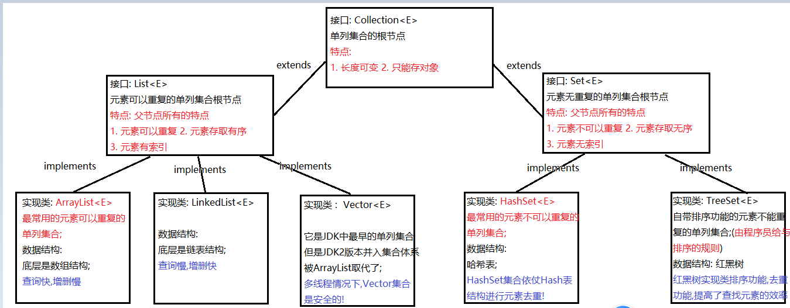

### Day_13随堂笔记

> 基础语法,面向对象,集合,IO,反射,注解

#### LocalDateTime

```java
LocalDateTime : 年月日,时分秒 //LocalDateTime是一个不可变的日期时间对象: 每次时间改变都生成了新的对象
    //LocalDate : 年月日
    //LocalTime : 时分秒

创建对象: //没有构造方法所以不能通过new的方式创建对象
	static LocalDateTime now(): 现在
    static LocalDateTime of(int year, int month, int dayOfMonth, int hour, int minute, int second)  : 指定日期  
	//  LocalDateTime 纠正了日历类中 月份从0开始,星期从星期日开始....  
```

##### String时间和LocalDateTime时间之间的转换

```java
String类型的时间和LocalDateTime时间进行的转换:
   String时间 --> LocalDateTime时间 -> 解析
            LocalDateTime类中: static LocalDateTime parse(CharSequence text, DateTimeFormatter formatter)
                CharSequence text: 字符串时间
                DateTimeFormatter formatter: 解析的格式
                    
   LocalDateTime时间 --> String时间 -> 格式化
            LocalDateTime类中: String format(DateTimeFormatter formatter)
                DateTimeFormatter formatter: 解析的格式
```

##### LocalDateTime的get系列方法(获取值)

```java
int getYear()  :获取年信息
int getMonthValue() :获取月份信息(1-12)
int getDayOfMonth(): 获取天信息      
int getHour() :获取小时信息    
int getMinute():获取分钟信息
int getSecond(): 获取秒钟信息    
-------------------------------------------    
DayOfWeek getDayOfWeek():获取星期信息  
int getDayOfYear():获取年中天信息  
Month getMonth(): 获取月份信息(枚举对象返回)   
int getNano():获取纳秒信息     
```

##### LocalDateTime的plus系列方法(加)

```java
plus系列方法是对日期字段进行做加法的操作!
LocalDateTime plusYears(long years) 
LocalDateTime plusMonths(long months)   
LocalDateTime plusDays(long days)  
LocalDateTime plusHours(long hours)  
LocalDateTime plusMinutes(long minutes)  
LocalDateTime plusSeconds(long seconds) 
-------------------------------------------------    
LocalDateTime plusNanos(long nanos)  
LocalDateTime plusWeeks(long weeks)  
    
注意:
	1. 记得接收, 因为时间修改是生成新的LocalDateTime对象,老的LocalDateTime对象不会改变
    2. 如果你传入的是正数就是做加法,如果你传入的是负数就是做减法    
```

##### LocalDateTime的minus系列方法(减)

```java
minus系列方法是对日期字段进行做减法的操作!
LocalDateTime minusYears(long years) 
LocalDateTime minusMonths(long months)   
LocalDateTime minusDays(long days)  
LocalDateTime minusHours(long hours)  
LocalDateTime minusMinutes(long minutes)  
LocalDateTime minusSeconds(long seconds) 
-------------------------------------------------    
LocalDateTime minusNanos(long nanos)  
LocalDateTime minusWeeks(long weeks) 
    
注意:
	1. 记得接收, 因为时间修改是生成新的LocalDateTime对象,老的LocalDateTime对象不会改变
    2. 如果你传入的是正数就是做减法,如果你传入的是负数就是做加法       
```

##### LocalDateTime的with系列方法(设置值)

```java
with系列方法是对日期字段进行设置值的操作!
LocalDateTime withYears(long years) 
LocalDateTime withMonths(long months)   
LocalDateTime withDays(long days)  
LocalDateTime withHours(long hours)  
LocalDateTime withMinutes(long minutes)  
LocalDateTime withSeconds(long seconds) 
-------------------------------------------------    
LocalDateTime withNanos(long nanos)  
LocalDateTime withWeeks(long weeks) 
    
注意:
	1. 记得接收, 因为时间修改是生成新的LocalDateTime对象,老的LocalDateTime对象不会改变
```

#### DateTimeFormatter类

```java
    提供日期格式的类: DateTimeFormatter  --> 只用来表示日期格式不干其他的事情

    JDK8中把所有的解析和格式化的方法全都放在了LocalDateTime类中,而DateTimeFormatter只用来表示日期格式


    创建DateTimeFormatter对象:
        static DateTimeFormatter ofPattern(String pattern)
```

#### Period

```java
Period: 年月日的时间间隔对象

创建对象的方式:
static Period between(LocalDate startDateInclusive, LocalDate endDateExclusive)  
```

#### Duration

```java
Duration 时分秒的时间间隔
        static Duration between(Temporal startInclusive, Temporal endExclusive)

        Temporal: 是一个接口,实现类有 LocalDateTime,LocalDate(X),LocalTime(√)
            
 一键获取时间间隔天数:
	long toDays()
```

#### BigDecimal

```java
为什么会有这个类?
    1. 二进制没有办法表示整小数
    2. 小数运算会存在精度误差 
    
构造方法:
      *BigDecimal(String val) : 这种构造方法可以完成精确运算
          
四则运算:
	BigDecimal add(BigDecimal augend)   : 加
    BigDecimal subtract(BigDecimal subtrahend)  : 减      
    BigDecimal multiply(BigDecimal multiplicand)  : 乘
    BigDecimal divide(BigDecimal divisor)   : 除法
        
特殊的除法: 带有舍入模式,保留小数点后几位
    BigDecimal divide(BigDecimal divisor, RoundingMode roundingMode)
    	RoundingMode: 舍入模式
        RoundingMode.UP: 向上取整
        RoundingMode.DOWN : 向下取整
        RoundingMode.HALF_UP : 四舍五入

    BigDecimal divide(BigDecimal divisor, int scale, RoundingMode roundingMode)  : 带有设置保留小数点后几位的除法
        int scale: 保留小数点后几位
```

#### 集合板块

```java
集合 : 数据的合集 --> 数据的容器
    特点:
		1. 长度可变 -> 为什么取代数组的原因
        2. 集合中只能存储引用数据类型的元素(只能存对象)  -> 被解决了
        3. 集合只能做临时存储(永久存储的: 硬盘)  -> 弊端
    分类:
		单列集合: 长度可变的数组
        双列集合: 2根平行长度可变的数组(梯子)   
            
集合的本质: 数据结构 + 数组;
	数据结构 : 用何种方式存储数据
	数组 : 存元素的容器
        
    例如: ArrayList TreeSet LinkedList
```

#### 单列集合

```java
单列集合可以理解成长度可变的数组; 
集合的命名: 数据结构 + 集合的类型
    
 1. 创建对象
 2. 增删改查
 3. 遍历   
```

#### 单列集合的体系结构



#### Collection<E>接口

```java
创建对象:
	Collection<E> 集合名 = new 他的实现类对象<E>();
	格式解释:
		1. <E> : 泛型
            作用: 用来约束集合的元素数据类型
            使用: 创建集合的时候,使用具体的引用数据类型名称去替换E就可以了
                	例如: Collection<String> Collection<Student>
                         Collection<int> 错的!
            注意: 1. 只能写引用数据类型,作用是用来约束集合的元素数据类型
                 2. 从JDK5之后才有的
                 3. 泛型只停留在编译阶段
            泛型的概念类似于生活中的 垃圾分类
                
增删改查:
	*增: boolean add(E e)  : 添加元素,返回是否添加成功
    *删: boolean remove(Object o) : 删除传入的元素,返回是否删除成功
        void clear() : 清空集合中所有的元素
    改: 没有set(int index,E e) -> 没有索引
	查: 没有get(int index)方法 -> 因为没有索引
         boolean contains(Object o) : 查询传入的元素是否包含于集合中
 		 boolean isEmpty() : 集合是否是空集合
        * int size() : 获取集合中元素的个数或者集合的长度 
```

#### 集合存储基本数据类型

```java
集合存储基本数据类型,你不可以把泛型E写成基本数据类型名称;

集合存储基本数据类型,必须把集合的泛型写成基本数据类型对应的引用数据类型(包装类型)
        byte    --->    Byte
        short    --->    Short
        int    --->    Integer -> 重要
        long    --->    Long
        float    --->    Float
        double    --->    Double
        char    --->    Character
        boolean    --->    Boolean

     给与了包装类一个语法特性: 自动装箱和自动拆箱
        自动装箱 : 基本数据类型-->引用数据类型
            Integer num = 100;
        自动拆箱 : 引用数据类型-->基本数据类型
            int i = num;
```

#### Integer类

```java
Integer 是int基本数据类型对应的包装类;

创建对象:
	1. Integer num = 100; √ -> 自动装箱
    2. Integer(int value)  -> 传入一个基本数据类型值,得到一个包装类对象    
 
Integer类中的成员方法:        
		//自动装箱隐藏的代码 : Integer num = Integer.valueOf(100);
        //static Integer valueOf(int i)
        Integer num = 100;

        //自动拆箱隐藏的代码 : int i = num.intValue();
        // int intValue()  
        int i = num;
```

#### 字符串基本数据类型值和基本数据值的转换

```java
字符串基本数据类型值 -> "100","true","13.14"
    我需要把String的"100" --> int的100,再能继续运算
    
在包装类中都存在着一个静态方法:
	static 对应基本数据类型 parseXxxx(字符串的基本类型值);
		例如: Integer 类中 -> static int parseInt(String str)
    	例如: Boolean 类中 -> static boolean parseBoolean(String str) 
            ....
            
注意:
	1. 字符串的基本数据类型值中必须保证全都是同一个基本数据类型值
    2. parseXxxx()方法   Character 类中没有  
```

#### Collection集合遍历

```java
    Collection集合的遍历:
        1. 转数组
            Object[] toArray()
        2. 请人帮我遍历 -> 迭代器 Iterator<E>
                Iterator<E>接口中:
                    boolean hasNext(): 判断集合中是否还有下一个元素 -> 看一眼
                    E next(): 获取集合的下一个元素并返回 -> 舀汤圆
                    while循环
            如何获取迭代器对象: Collection接口中 -> Iterator<E> iterator()
```

