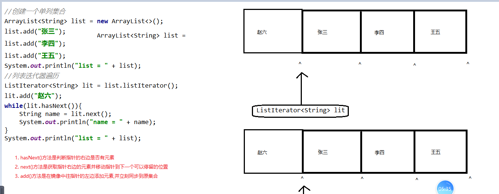
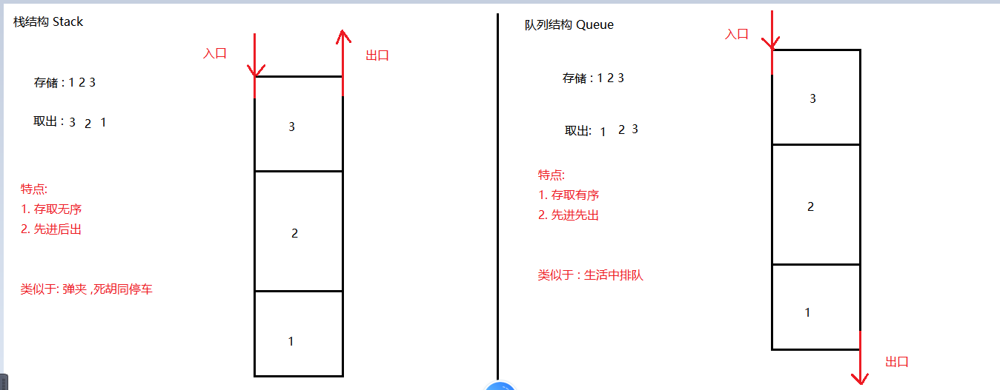
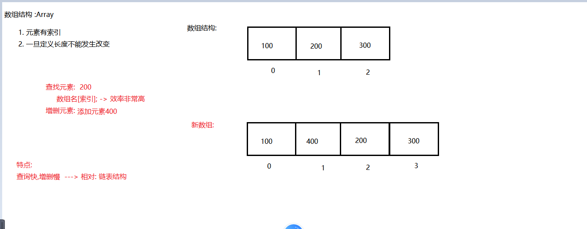
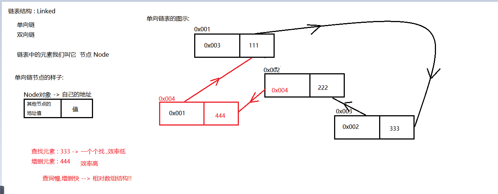
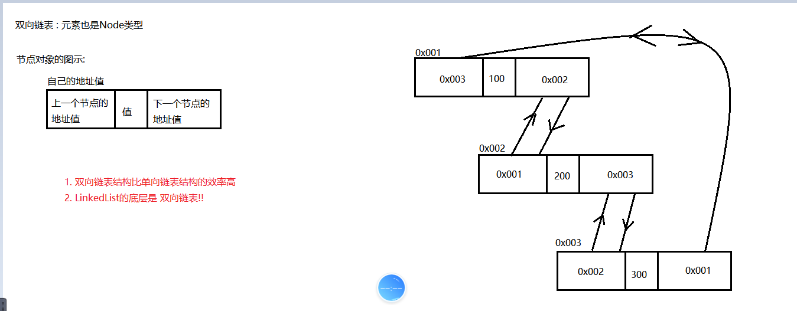
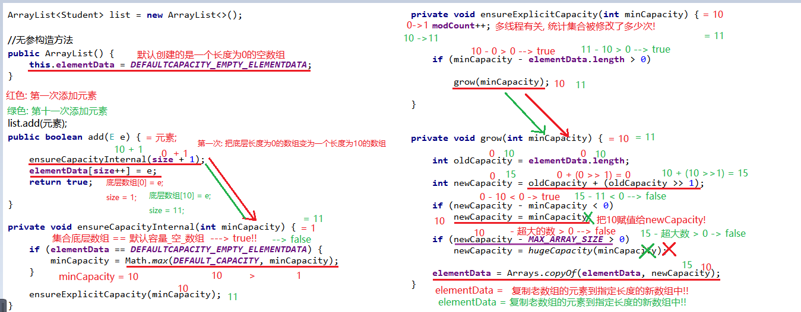
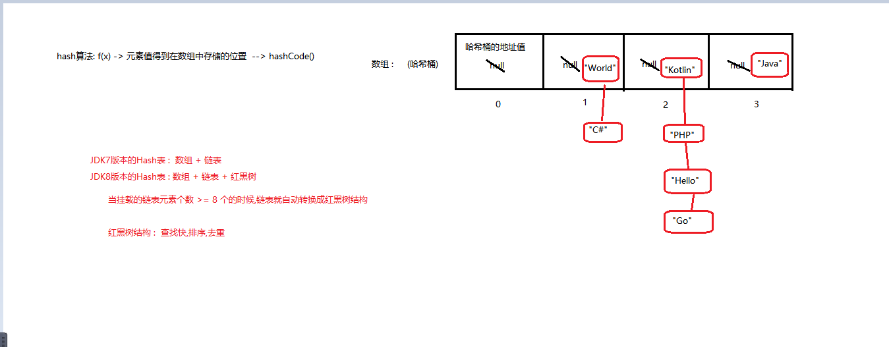

### Day_14随堂笔记

#### ListIterator<E>列表迭代器

```java
Iterator<E> :  普通迭代器  -> Collection<E>接口 -> 所有的单列集合都可以使用
ListIterator<E> : 列表迭代器 -> List<E> -> 所有List集合的实现都可以使用 
    
ListIterator对象可以解决并发修改异常:
        在使用ListIterator遍历集合的时候,不使用集合对象对集合进行修改;但是我们可以使用列表迭代器对象对集合进行修改;

    原理:
        列表迭代器对象会先在镜像中添加元素,并立刻同步到原集合;    
```



#### 数据结构

```java
数据结构: 存储数据的方式
   
编程的本质 :  算法 + 数据结构;   -> C语言  
    
编程的本质 : 交换信息(数据)    
```

##### 栈结构和队列结构



##### 数组结构和链表结构

###### 数组结构



###### 单向链表



###### 双向链表



#### ArrayList<E>集合

```java
ArrayList<E>集合 是最常用的 元素可以重复,元素有索引,元素存取有序的单列集合

创建对象:
	ArrayList 集合名 = new ArrayList<>();

增删改查四类功能:
	增 : add
    	boolean add(E e)  : 依次添加元素,永远返回true
    删 :
		boolean remove(Object o) : 按照传入元素的值删除集合中的该元素,并返回删除是否成功
        void clear() : 清除集合中所有的元素    
    查 :   
        int size(): 获取集合中元素的个数
            
        boolean contains(Object o) : 查询传入的元素是否包含于集合中
     	boolean isEmpty()  : 查询集合是否为空集合
    ------------------特有的--------------------------    
    增 :  void add(int index, E element)  : 在指定索引位置插入元素       
    删 :  E remove(int index) : 删除指定索引位置的元素,并返回被删除的元素
    改 :  E set(int index,E element) :修改指定索引位置的元素,并返回被修改的元素 
    查 :  E get(int index) : 获取指定索引位置的元素  
         int indexOf(Object o) : 获取传入元素第一次出现在集合的索引位置 -> 不存在返回-1
         int lastIndexOf(Object o) : 获取传入元素最后一次出现在集合的索引位置 -> 不存在返回-1
        
遍历:
		//遍历1: 转数组
        //遍历2 : 普通迭代器
		//遍历3 : 增强for
        //遍历4 : 普通for循环
        //遍历5 : 列表迭代器 ListIterator<E> listIterator()
```

#### ArrayList的底层原理

```java
往ArrayList集合中添加第1024个元素,请问ArrayList集合的底层数组的长度是多少? 1234
    
ArrayList的底层原理:
	1. 无参构造创建一个ArrayList集合,会在底层创建一个长度为0的数组;
	2. 当添加第一个元素的时候,底层的数组长度由0变为10;
	3. 当添加第十一个元素的时候,底层的数组长度由10变为15;
	.....
    4. 每当集合底层数组添加满元素,再次添加,底层数组的长度会变为原来长度的1.5倍;
		int newLength = oldLength + (oldLength >> 1);
```



#### LinkedList<E>集合

```java
LinkedList<E>集合 : 底层数据结构双向链表
    
增删改查,遍历和List<E>接口没有任何区别;

链表结构带来的一些特有方法:
	 void addFirst(E e) 
     void addLast(E e) 
 	 E getFirst()  
     E getLast()  
     E removeFirst()
     E removeLast() 
     
```

#### Vector<E>集合

```java
Vector<E>集合 : 最早的单列集合
    从JDK1.2版本开始加入到集合体系中,被ArrayList取代;

Vector<E>集合 在多线程环境下,它是线程安全的;
```

#### Set<E>集合

```java
Set<E>集合接口:  元素唯一,元素无索引,元素存取无序集合的根节点
1. 长度可变
2. 只能存对象
3. 元素唯一
4. 元素无索引
5. 元素存取无序    
    
    
创建对象   :
	Set<E> 父引用 = new 实现类对象<E>();

增删改查:
	增: 
		boolean add(E e) : 添加元素返回添加是否成功
    删:
		boolean remove(Object o)  : 按元素值删除集合中的元素
        void clear() : 清空集合中所有的元素
    改: 因为没有索引所以没有办法修改指定元素
	查: 因为没有索引所以没有get(int index)方法
         boolean contains(Object o)  
         boolean isEmpty() 
		 int size()  
遍历集合:
	1. 转数组
    2. 迭代器
    3. 增强for
```

#### 哈希表结构

```java
哈希表 : Hashtable  -> 散列表
    
哈希算法 : f(x) -> hashCode()方法   
```



#### HashSet<E>集合

```java
HashSet集合去重原理 :
        依仗: hashCode()的结果进行去重;
        在Student类中我故意没有重写hashCode方法,没有重写的hashCode方法来自Object!!
        Object中的hashCode方法是一个native修饰的方法,计算对象在堆内存中的地址值!!

    结论: 没有重写hashCode方法之前,Java中所有的Hash结构去重都是按照对象的地址值去重!!

    我们的需求是: 按照自定义对象的属性值去重!!
    请在自定义对象类中重写hashCode和equals方法 --> 自动生成!!
```

#### Hash算法的源码分析

```java
JDK8之前Hash表结构 :  数组 + 链表
JDK8之后Hash表结构 :  数组 + 链表 + 红黑树     //红黑树的出现仅仅只是提高了查找元素的效率
    
核心逻辑: e.hash == hash && ((k = e.key) == key || key.equals(k))    
```

#### 红黑树结构

#### TreeSet<E>集合