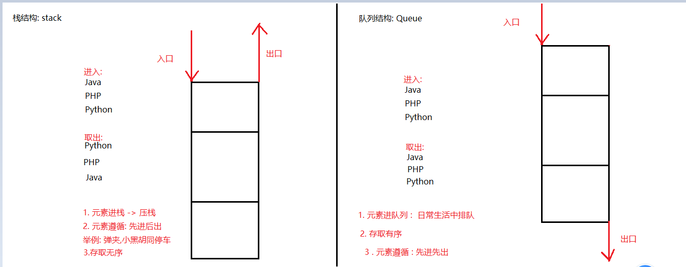

### Day_14随堂笔记

#### 迭代器使用时的小问题-ConcurrentModificationException

```java
    ConcurrentModificationException: 并发修改异常 -> 操作迭代器遍历集合的时候容易出现的小问题

    产生的原因:
        1. 使用迭代器对象遍历集合的时候,使用集合对象对原集合内容进行修改都会报并发修改异常

    解决办法:
        1. 不要在迭代器对象遍历集合的时候,使用集合对象对原集合进行修改操作
        2. 可以使用迭代器对象对原集合进行内容修改 (ListIterator 列表迭代器的功能)
        
    集合对象只要创建了迭代器对象后,就不可以使用集合对象对集合内容进行修改!!    
```

#### 迭代器原理


#### 增强for循环

```java
格式: 
	for(泛型 变量名:单列集合名/数组名){
        //可以对变量进行操作
    }
注意:
	1. 增强for的底层是一个你拿不到的迭代器对象 (小心并发修改异常!)
    2. 不是所有的容器都能使用增强for遍历(只要能用迭代器就能使用增强for)
        	//如果一个类实现类实现了 Iterable
```

#### List<E>接口

```java
List<E>接口 : 是一个 元素可以重复 元素存取有序 元素有索引 单列集合的根节点
    
创建对象:
	List<E> 集合名 = new 实现类对象<>();
增删改查四类功能://相较于Collection<E>接口来说,多了索引相关的操作
	增:
		boolean add(E e) : 依次添加元素,永远返回true
		boolean add(int index, E e) : 在指定索引位置添加元素 -> 插入
    删:
		boolean remove(Object o): 按照元素值删除元素,返回删除是否成功
        E remove(int index) : 按照索引删除元素,返回被删除的元素
        void clear(): 清空集合中所有的元素
    改:
		E set(int index,E newElement):修改指定索引位置的元素,并返回被修改的元素
	查:
		E get(int index) : 获取指定索引位置的元素
        int size():获取集合的长度或者说是元素的个数
        boolean contains(Object o): 判断传入的元素是否存在于集合中
        boolean isEmpty():判断集合是否为空集合    
        int indexOf(Object o): 查询传入的元素第一次出现在集合中的索引位置,不存在返回-1  
        int lastIndexOf(Object o):查询传入的元素最后一次出现在集合中的索引位置,不存在返回-1        
            
    List集合的遍历:
        1. 转数组
        2. 普通迭代器 : Iterator
        3. 增强for
        4. get()和size()和普通for循环
        5. 列表迭代器 ListIterator (是Iterator的子类,列表迭代器从List接口才有)
            使用方法和迭代器没有任何区别,注意事项也一样(并发修改异常)
            列表迭代器的功能比普通迭代器要多,可以解决并发修改异常            
```

#### 列表迭代器的特有功能

#### 列表迭代器解决并发修改异常的原理


#### 数据结构

```java
数据结构: 容器存储数据的方式
    不同的方式带了不同的存储效果(例如: 有的效率高,有的安全,有的去重,有的能排序....)
    
数据结构的种类也很多,我们学习常用的!!    
```

##### 栈和队列

```java
栈: stack 
队列: Queue    
```



##### 数组和链表

```java
数组: array
链表: Linked
```


###### 单向链表


###### 双向链表


#### ArrayList<E>集合

```java
ArrayList<E>集合 : 底层数据结构是数组的元素可以重复的单列集合,也是最为常用的单列集合之一
    
创建对象
    ArrayList<E> 集合名 = new ArrayList<>();
增删改查
    增:
		boolean add(E e) : 依次添加元素,永远返回true
		boolean add(int index, E e) : 在指定索引位置添加元素 -> 插入
    删:
		boolean remove(Object o): 按照元素值删除元素,返回删除是否成功
        E remove(int index) : 按照索引删除元素,返回被删除的元素
        void clear(): 清空集合中所有的元素
    改:
		E set(int index,E newElement):修改指定索引位置的元素,并返回被修改的元素
	查:
		E get(int index) : 获取指定索引位置的元素
        int size():获取集合的长度或者说是元素的个数
        boolean contains(Object o): 判断传入的元素是否存在于集合中
        boolean isEmpty():判断集合是否为空集合    
        int indexOf(Object o): 查询传入的元素第一次出现在集合中的索引位置,不存在返回-1  
        int lastIndexOf(Object o):查询传入的元素最后一次出现在集合中的索引位置,不存在返回-1        
遍历    
        1. 转数组
        2. 普通迭代器 : Iterator
        3. 增强for
        4. get()和size()和普通for循环
        5. 列表迭代器 ListIterator (是Iterator的子类,列表迭代器从List接口才有)
```

#### ArrayList<E>集合底层原理

```java
1. 创建一个ArrayList集合对象,在底层new一个长度为0的数组(数组的类型由集合的泛型决定)
2. 当往ArrayList集合中添加第一个元素的时候,底层会重新new一个长度为10的数组
3. 当添加到第11个元素的时候,底层会再重新new一个长度为10的1.5倍的数组(15)
 ....
4. 后续每次把底层数组元素填满,底层都会重新new一个新的数组,新的数组的长度是老数组的1.5倍
    
1. 添加第1024个元素时,ArrayList集合底层数组的长度是多少?? 1234
```

#### ArrayList集合底层源码分析


#### LinkedList<E>集合

#### Vector<E>集合

