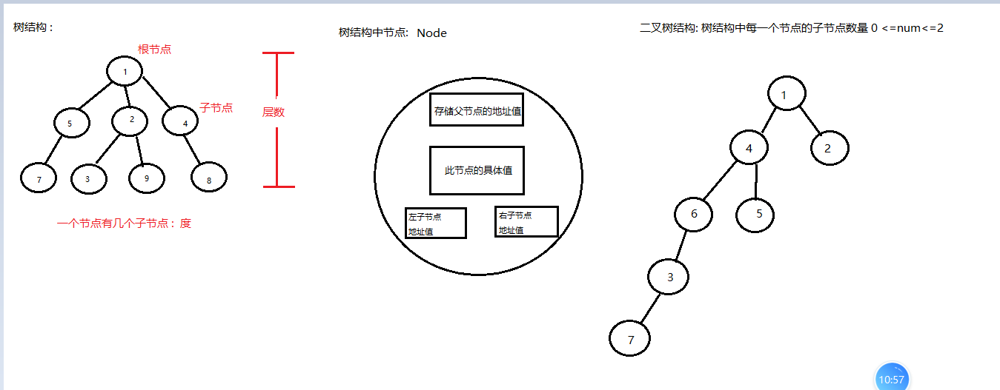
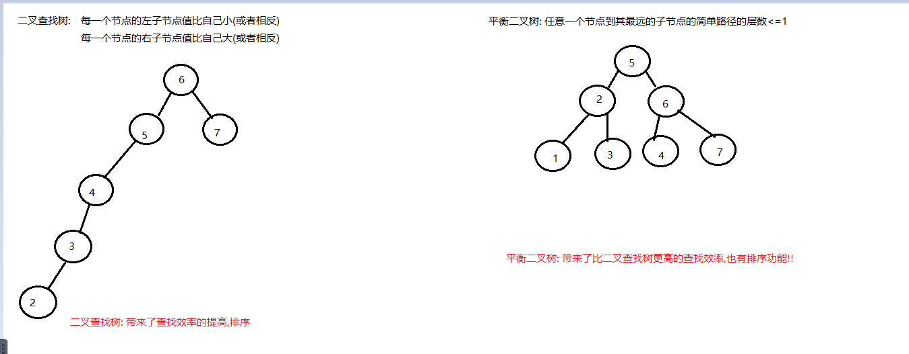
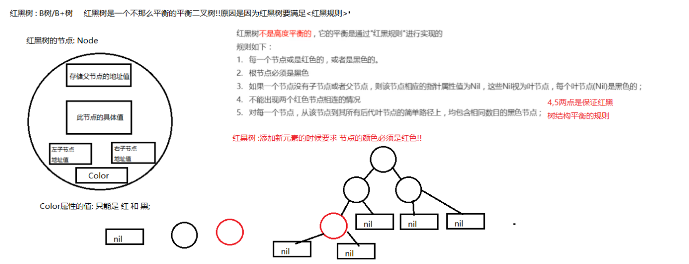
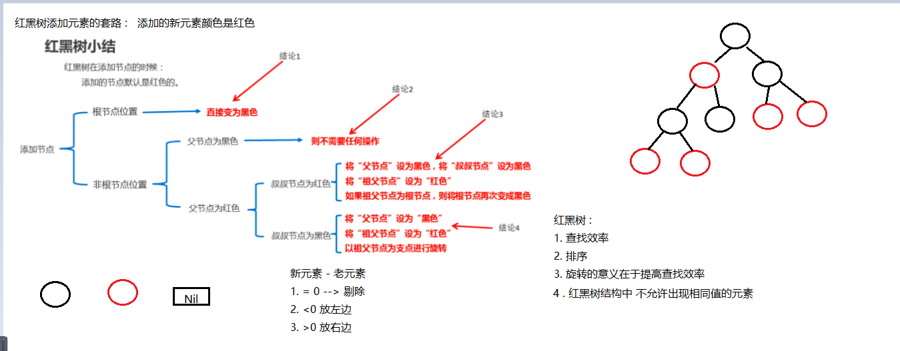
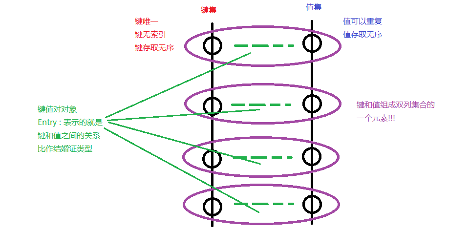
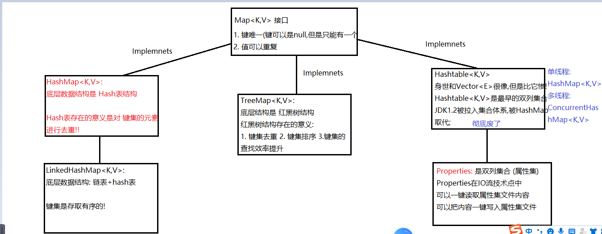

### Day_15随堂笔记

#### 红黑树结构

##### 树结构和二叉树结构



##### 二叉查找树和平衡二叉树



##### 红黑树结构



##### 红黑树结构添加节点的规律



#### TreeSet<E>集合

```java
TreeSet<E>集合 : 底层数据结构是红黑树结构的Set集合的实现
    
红黑树结构 : 去重,排序(具备排序的能力,但是排序的规则需要程序员提供),查找效率最高
    
创建对象:
	TreeSet<E> 集合名 = new TreeSet<>(); //使用泛型类的默认功能
	TreeSet<E> 集合名 = new TreeSet<>(Comparator<E> comparator);//使用自带的比较器比较器


增删改查:
	和HashSet<E>一模一样
遍历:
	1. 转数组
    2. 普通迭代器
    3. 增强for    
```

##### TreeSet<E>集合自然排序的规则

```java
1. TreeSet集合存储整数(Integer)默认排序规则是 :自然升序
2. TreeSet集合存储字符串(String)默认排序规则是 :ASCII值的自然升序
        注意: 越靠前的字符的ASCII码值越小,整个字符串的排序就越靠前
```

##### TreeSet<E>集合存储自定义对象

```java
TreeSet集合具备排序的能力但是需要给TreeSet集合提供排序的规则!
```

#### 绑定比较器 -> Comparable<E>

```java
Comparable<E> 比较器需要泛型类实现它!!

绑定比较器 : 因为它和泛型类绑在一起    
    
Comparable<E> 有且仅有一个抽象方法:
	int compareTo(E o); 提供排序规则的!!(重写方法完成规则的提供)
        
    升序 : this - o
    降序 : o - this    
        
    例如 : 按照年龄的升序 --> this.age - o.age    
```

#### 独立比较器 -> Comparator<E>

```java
Comparator<E> 比较器  泛型类不需要实现它!

独立比较器 : 不需要和泛型类发生实现关系!!
    
注意 :  Comparator<E>  优先级是大于 Comparable<E>   
    
Comparator<E> 是一个接口, 有且仅有一个抽象方法:
	int compare(E o1,E o2):  --> o1就类似于this o2就类似于o
        
        升序 : o1 - o2
    	降序 : o2 - o1   
```

#### List集合和数组的排序

```java
数组排序: 
	Arrays类中 : 
		void sort(基本数据类型的数组) : 底层是快速排序,自然升序!!
        void sort(T[] 引用数据类型的数组)  : 对引用数据类型数组进行排序,但是要求T类型必须提供排序规则
        void sort(T[] a, Comparator<T> c)  :  提供独立比较器的sort方法 
            
List集合排序:
	Collections工具类 :
		void sort(List<T> list) : 按照集合泛型T自带的排序规则对List集合进行排序
		void sort(List<T> list, Comparator<T> c): 按照独立比较器提供的规则对集合进行排序      
```

#### LinkedHashSet<E>集合

```java
LinkedHashSet<E>集合 : 底层数据结构是 链表加Hash表;

是HashSet<E>集合的子类!!!
    
LinkedHashSet<E>集合的基本操作和HashSet<E>集合一模一样!!
    
唯一区别 :LinkedHashSet<E>集合是一个存取有序的集合!!     
```

#### 双列集合概述

```java
双列集合就是2根单列集合的组合!
    
双列集合的根节点 : Map<K,V>  -> 映射,键值对(Key,Value),夫妻对集合(键是丈夫,值是妻子)

双列集合键的集合: Set<K>
双列集合值的集合: Collection<V> --> 大概率是一个List
    
双列集合的特点:(一妻多夫的集合)
	1. 长度可变
    2. 只能存对象    
    3. 键集的元素是: 键唯一,键无索引,键存取无序  -> 丈夫唯一
    4. 值集的元素是: 值可以重复,值存取无序(夫唱妇随) -> 妻子重复
```



#### 双列集合体系结构



#### HashMap<E>集合

#### 泛型

