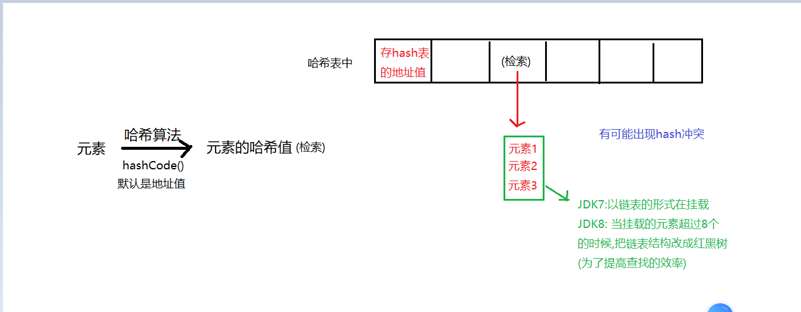
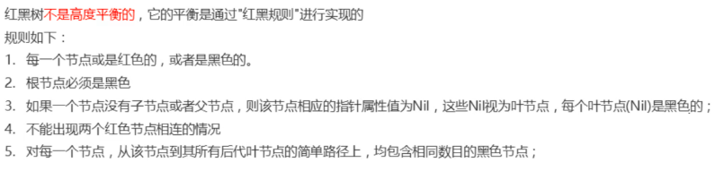

### Day_15随堂笔记

#### LinkedList<E>集合

```java
LinkedList<E>集合 : 底层为链表结构的单列集合的实现;
	//又因为LinkedList<E>集合实现了List接口,所以LinkedList<E>集合底层也是有索引操作;

常规操作:
	创建对象:
	LinkedList<E> 集合名 = new LinkedList<E>();
	增删改查:
	增:
		boolean add(E e) : 依次添加元素,永远返回true
		boolean add(int index, E e) : 在指定索引位置添加元素 -> 插入
    删:
		boolean remove(Object o): 按照元素值删除元素,返回删除是否成功
        E remove(int index) : 按照索引删除元素,返回被删除的元素
        void clear(): 清空集合中所有的元素
    改:
		E set(int index,E newElement):修改指定索引位置的元素,并返回被修改的元素
	查:
		E get(int index) : 获取指定索引位置的元素
        int size():获取集合的长度或者说是元素的个数
        boolean contains(Object o): 判断传入的元素是否存在于集合中
        boolean isEmpty():判断集合是否为空集合    
        int indexOf(Object o): 查询传入的元素第一次出现在集合中的索引位置,不存在返回-1  
        int lastIndexOf(Object o):查询传入的元素最后一次出现在集合中的索引位置,不存在返回-1        
            
    LinkedList<E>集合的遍历:
        1. 转数组
        2. 普通迭代器 : Iterator
        3. 增强for
        4. get()和size()和普通for循环
        5. 列表迭代器 ListIterator (是Iterator的子类,列表迭代器从List接口才有)
            使用方法和迭代器没有任何区别,注意事项也一样(并发修改异常)
            列表迭代器的功能比普通迭代器要多,可以解决并发修改异常         
```

##### LinkedList<E>的特有方法

```java
因为LinkedList底层是链表结构,所以类中也会有一些关于链表的操作方法:

	 E getFirst() : 获取链表的头元素 
     E getLast() : 获取链表的尾元素
     E removeFirst() : 删除链表的头元素
     E removeLast() : 删除链表尾元素
     void addFirst(E e) : 把元素添加到头
     void addLast(E e) : 把元素添加到尾     
```

#### Vector<E>集合

```java
Vector<E>集合 : 最早的单列集合 出生在JDK1.0版本,从JDK1.2版本开始并入到Java集合体系,被ArrayList取代!

    使用场景:
		ArrayList集合在多线程环境下是不安全的,Vector集合因为它所有的方法都是同步方法,所以它在多线程环境下是安全的 -> 多线程环境下,使用元素可重复的集合优先选择Vector<E>;

	增删改查,遍历 沿用List<E>接口的功能;
```

#### Set<E>集合

```java
Set<E>集合是元素不重复,元素存取无序,元素无索引的Collection<E>集合的子接口!!
    
创建对象:
	Set<E> 集合名 = new 实现类<>();
增删改查四类功能:
	增:boolean add(E e)  : 往集合中添加元素,返回添加是否成功
    删:boolean remove(Object o)  : 按照传入元素删除集合中的元素,返回删除是否成功
       void clear():清空集合
    改: 没有索引没有改的方法   
    查: 没有索引没有get方法
         boolean contains(Object o)  : 是否包含
         boolean isEmpty() : 是否为空
 		 int size()  : 长度,元素个数
遍历:
	1. 转数组 :  Object[] toArray()  
    2. 普通迭代器 : Iterator<E> iterator()  
    3. 增强for: 可以    
```

#### 数据结构之哈希表

```java
Hash -> 哈希表
哈希表(hashtable)又称散列表; 通过一个key去寻找对应的value的检索算法方式; 类似: 查字典
    检索 --> hash表中的一个位置
    元素值 --> 在此位置存储的值;
    
    通过hash算法(可以自定义)获取一个元素的hash值,存入到底层Hash表中具体位置 --> 常规的Hash结构;
        
Hash结构尽量避免hash冲突(解决冲突的办法有很多),保证元素均匀的分布在hash表(hash桶)中;     
```



#### HashSet<E>集合

```java
底层是hash表结构的单列集合;
	hash结构:完成了去重的逻辑;

Java中的Hash算法是来自于Object类中hashCode()方法~
    //Object中的hashCode方法把对象的地址值作为对象的默认hash值;
    
HashSet集合往里面存放元素:
	1. 计算元素的hash值 (默认:对象地址,可以重写hashCode方法改变hash值获取方式/基本数据类型: 常量池中的地址-> 不能改)
    2. 在底层hash表中寻找对应检索位置
    3. 把元素添加到此检索位置
        
创建对象:
	HashSet<E> 集合名 = newHashSet<>();
增删改查四类功能:
	增:boolean add(E e)  : 往集合中添加元素,返回添加是否成功
    删:boolean remove(Object o)  : 按照传入元素删除集合中的元素,返回删除是否成功
       void clear():清空集合
    改: 没有索引没有改的方法   
    查: 没有索引没有get方法
         boolean contains(Object o)  : 是否包含
         boolean isEmpty() : 是否为空
 		 int size()  : 长度,元素个数
遍历:
	1. 转数组 :  Object[] toArray()  
    2. 普通迭代器 : Iterator<E> iterator()  
    3. 增强for: 可以          
        
 // 当你需要一个元素不重复的单列集合的时候,第一反应是HashSet     
```

#### HashSet<E>集合存储自定义对象的去重原理

```java
结论:我希望 HashSet集合按照元素的属性值去重而不是按照元素的地址值去重;
    	你只需要在此对象的类中重写equals()和hashCode()方法即可完成以上需求;

核心逻辑 : 新老元素的hash值是否相同 && (新老元素的地址值是否相同 || 新老元素equals方法的结果)
```

#### 数据结构之红黑树

```java
Tree : 树结构 (红黑树)
```

##### 红黑规则



#### TreeSet<E>集合

```java
TreeSet<E>集合: 底层为红黑树结构的Set集合;
	共性: 元素不能重复
    特点: 查找效率高,带有排序功能
        
创建对象:
	TreeSet<E> ts = new TreeSet<>();
增删改查四类功能:
	增:boolean add(E e)  : 往集合中添加元素,返回添加是否成功
    删:boolean remove(Object o)  : 按照传入元素删除集合中的元素,返回删除是否成功
       void clear():清空集合
    改: 没有索引没有改的方法   
    查: 没有索引没有get方法
         boolean contains(Object o)  : 是否包含
         boolean isEmpty() : 是否为空
 		 int size()  : 长度,元素个数
遍历:
	1. 转数组 :  Object[] toArray()  
    2. 普通迭代器 : Iterator<E> iterator()  
    3. 增强for: 可以   
```

#### TreeSet<E>集合默认排序规则

```java
    TreeSet的排序规律:
        整数,浮点数: 自然升序排序
        字符串: 按照字符串的首个字符的ASCII码值的升序进行排序
                中文没有规律!!

    TreeSet集合有排序的功能,排序的规则需要程序员提供(JDK提供了 程序员就可以不提供)!!
```

#### 绑定比较器Comparable<T>

```java
如何提供排序规则呢?
        1. 绑定比较器 -> Comparable<E>
            让泛型类实现Comparable<E>比较器接口,重写接口中的compareTo(E e),compareTo方法内编写排序规则
                比较器的泛型写什么? 谁实现比较器接口谁就是比较器接口的泛型

           排序规则是: 升序 :  this - o  降序 : o - this
```


 双列 泛型 异常 IO 多线程 网络编程 反射 枚举 注解 JDK8新特性(Lambda,stream流,方法引用)