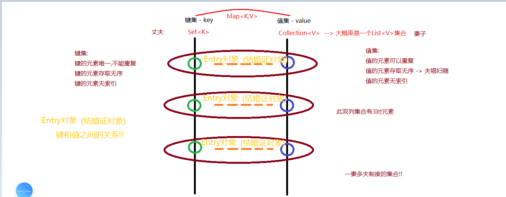
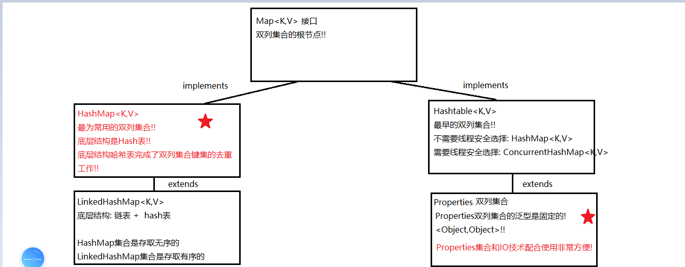

### Day_16随堂笔记

#### 回顾知识点

#### 绑定比较器 Comparable<T>

```java
此比较器接口需要排序的类实现此接口,比较器接口和泛型类进行绑定!
    
格式:
	public class 泛型类 implements Comparable<泛型类型>{
        
        //重写方法
        public int compareTo(泛型类型 o){
            return ...;
        }
    }
```

#### 独立比较器 Comparator<T>

```java
创建TreeSet集合对象的时候,传入一个独立比较器对象,TreeSet集合就可以按照传入的比较器对象进行排序;
	//独立比较器的排序优先级是高于绑定比较器

Comparator<E> 独立比较器接口:
 	抽象方法: int compare(T o1, T o2)  
        o1: 类比this o2 : 类比o
      正序: o1 - o2 倒序: o2 - o1      

TreeSet集合带有独立比较器的构造方法:
	TreeSet(Comparator<E> comparator) 
```

#### 集合和数组的排序

```java
Arrays : 数组操作工具类
        static void sort(任意类型数组): 默认的自然排序规则去排序 -> 快速排序完成的
            //如果数组的类型是自定义类型,自定义类型中必须提供比较规则

        static void sort(T[] a, Comparator<T> c)  : 对对象数组的排序(自定义排序规则)
            T[] : 引用数据类型数组 => 对象数组 Student[]

List接口下集合内容排序:
Collections : 集合操作的工具类
        static void sort(List<T> list) : 对List集合中的元素进行排序(排序按照默认的排序规则来)
            若List集合泛型不提供排序规则就直接报错!!

        static void sort(List<T> list, Comparator<T> c) : 传入独立比较器对集合元素进行排序
            // 排序时遇到重复元素不会去重 --> 原因是因为List接口下的集合都是元素可以重复的!!
```

#### 双列集合

```java
双列集合 : 由2根单列集合组成的集合叫双列集合; 
	双列集合表示的是一种映射关系(一一对应的关系)
        
双列集合是由一根Set集合(键集)和一根Collection集合(值集)进行组合    
```



#### 双列集合体系结构图



#### HashMap<K,V>集合的基本使用

```java
    HashMap集合的基本使用
        创建集合对象:
            HashMap<键的类型,值的类型> hm = new HashMap<>();
        增删改查:
            增,改:
               *  V put(K key, V value)  : 添加一对隐射关系,添加成功返回null.当添加的是重复的键,会替换此键对应的值,并把老值返回
            删:
                void clear(): 清空集合中所有的隐射关系
              * V remove(Object key) : 根据传入的键删除集合中的一对隐射关系,并返回值
                boolean remove(Object key,Object value): 删除传入的键和值返回删除是否成功
            查:
              *  V get(Object key) : 根据键找值,找不到返回null -> 丈夫找媳妇~
              *  int size()  : 查询集合中有几对隐射关系

              *  Set<K> keySet() : 获取双列集合的键集合 -> 召集所有的丈夫
                Collection<V> values() : 获取双列集合的值集合  -> 召集所有的媳妇

                boolean containsKey(Object key)  : 查询是否有传入的键
                boolean containsValue(Object value)  : 查询是否有传入的值
                boolean isEmpty()  : 查询集合是否为空集合
```

#### HashMap<K,V>集合的底层原理

```java
底层也是数组 : table -> hash表
    
HashMap集合的加载因子: 0.75 --> 何时扩容
    当底层数组中的元素个数 > 容量 * 0.75 的时候就扩容
    
 空参构造一个HashMap集合,默认底层数组的容量是 16 , 理想状态下: 当底层数组的元素达到12个(16 * 0.75),底层数组进行扩容(在原有的数组长度基础下进行翻倍
                                                                          
1. 添加新的元素的时候,会计算新元素键的hash值,hash值决定了这对元素在底层数组的索引位置(index);                   	若table[index] == null,不看数组的长度(底层容量) 直接在此索引位置添加元素                           若table[index] != null,看数组的长度(底层的容量)有没有达到加载因子的触发条件
                 a. 若没有达到,对新元素进行挂载形成链表
                 b. 若达到加载因子扩容条件,对底层数组table进行扩容,然后重新计算每一个元素的Hash值对应的索引位置进行元素的重新整理,存放到新的数组中
  
JDK8之后出现:                                                                          
2. 添加新元素的时候,若底层数组table的容量没有达到64,某个index位置的元素挂载超过8个的时候,计算总的元素个数,若达到加载因子的触发条件就对集合进行扩容,并重新计算数组元素应该存放在新数组的索引位置  
                                                                          
3. 添加新元素的时候,若底层数组table的容量超过64,某个index位置的元素挂载超过8个的时候,不会计算总的元素个数,而是把此索引位置的链表转换成红黑树结构                                                                           
                                                                          
HashMap/HashSet底层原理:
	JDK7版本 :  hash表(数组 + 链表)                                                             JDK8版本 :  hash表(数组 + 链表 + 红黑树)            	
```

