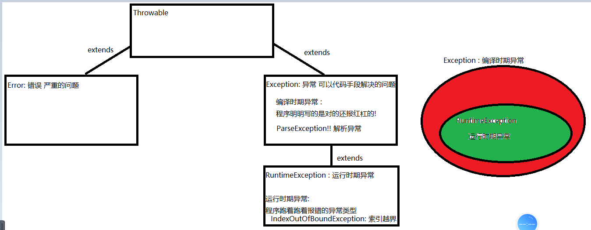

### T_Day16随堂笔记

#### HashMap<K,V>集合

```java
创建容器:
	HashMap<K,V> 集合名 = new HashMap<>();
	K: 双列集合中键集元素的数据类型 -> 必须是引用数据类型 
    V: 双列集合中值集元素的数据类型 -> 必须是引用数据类型 
        
增删改查:
	 **增,改: V put(K key, V value) : 往集合中添加一对映射关系,添加成功返回null,如果双列集合中存在要添加的键,把新值替换集合中键对应的老值,返回老值;
	 删 :  
	 **	V remove(Object key) : 根据传入的键,删除这一整对映射关系,返回被删除的键值对的值
        boolean remove(Object key, Object value) : 根据传入的键和值 删除元素返回删除是否成功
        void clear():清空集合中所有的键值对
     查 : 
	 **	V get(K key) : 根据传入键查找其对应的值 -> 丈夫找媳妇
     **   int size() : 查询集合中的键值对的对数 
            
     	boolean containsKey(Object key)  : 查询传入的键是否存在于双列集合中
        boolean containsValue(Object value)   : 查询传入的值是否存在于双列集合中 
            
        boolean isEmpty()  : 判断集合中是否为空    
            
      **  Set<K> keySet() : 召集所有的丈夫,把他们装到Set集合中   --> 获取键集
        Collection<V> values() : 召集所有的妻子,把她们装到Collection集合中  --> 获取值集    
```

#### 双列集合的遍历

```java
方式1 : 丈夫找媳妇
    //创建集合对象
        HashMap<String,String> hm = new HashMap<>();
        System.out.println("hm = " + hm);

        //添加元素
        hm.put("乔峰","阿朱菇凉");
        hm.put("虚竹","西夏公主");
        hm.put("段誉","王语嫣");
        System.out.println("hm = " + hm);

        //第一种 :  召集所有的丈夫,丈夫找媳妇
        Set<String> keys = hm.keySet();
        //遍历键集
        for (String key : keys) {
            //键找值
            String value = hm.get(key);
            System.out.println(key +" --- "+ value);
        }

方式2 :  通过"结婚证对象" 获取结婚证对象上的丈夫和妻子
    结婚证对象 : Entry类型的对象  
    HashMap类中 : Set<Map.Entry<K,V>> entrySet()    
    Entry接口中 :  K getKey()  , V getValue()
```

#### HashMap<K,V>集合的底层原理

```java
底层数据结构 : Hash表! 
    Hash表: 元素的去重 (键集元素去重,键集存储自定义对象的时候,要按照属性值去重,一定重写hashCode和equals方法!)
        
-----------------------------------------------------------------
往HashMap中存储第1024个元素,不考虑其他情况,请问底层集合的数组的长度是多少?? 2048
        
笼统的来说 : 无参构造创建一个HashMap集合对象,最开始一个null的table数组(Node),添加第一个元素时在底层生成了一个长度为16的,加载因子是0.75的数组(此数组就是Hash表)
        加载因子 : 何时扩容  当添加的元素个数超过 容量 * 加载因子 的个数时就扩容!
        扩容多少呢 ?  在原有底层数组的容量基础上 * 2; 

-----------------------------------------------------------------
Hash结构的前提是 :  计算要添加元素存放与hash表的索引位置
    
1. 如果要添加的元素在底层table[i]的对应值是 null的话,就直接添加,不考虑加载因子!!   
2. 如果table[i]对应的值不是null,就要看table中有多少个元素,满足加载因子的扩容条件就扩容!!
    	扩容后,会重新计算Hash表中每一个元素应该存放的新位置; //新添加的元素也要算

JDK8的时候: Hash表结构 -> 数组 + 链表 +红黑树
如果table[i]位置挂载的链表中元素 >= 8    
    1. 当table.length <= 64 , 继续在链表上挂载元素,不变红黑树
    2. 当table.length > 64 , 这时才把链表转换成红黑树
```

#### LinkedHashMap<K,V>集合

```java
LinkedHashMap<K,V>集合 是 HashMap<K,V>集合子类;

和HashMap不同的地方在于: HashMap集合是键无序的,LinkedHashMap集合键有序的;
```

#### TreeMap<K,V>集合

```java
HashMap<K,V>集合 : 键集可以理解成 HashSet<K>
    
TreeMap<K,V>集合 : 键集可以理解成 TreeSet<K>   
    
//注意: 键的类型K 没有提供排序规则,那么TreeMap集合存储元素会报错
    1. 泛型类K自己实现绑定比较器 Comparable
    2. 在创建TreeMap集合的时候使用含参构造:
			 TreeMap(Comparator<K> comparator)
```

#### Hashtable<K,V>集合

```java
Hashtable<K,V>集合 最早的双列集合;

从JDK2版本开始 Hashtable<K,V>集合并入到集合体系,被HashMap<K,V>取代;

单线程场景: HashMap<K,V>
多线程场景: ConcurrentHashMap<K,V>    
```

#### 泛型

```java
泛型: 一种不明确的引用数据类型,只有在具体使用的时候,使用具体的引用数据类型替换即可!!
    
泛型的定义格式 : <任意大写字母,任意大写字母....>  
    1. 字母必须是大写 (规范)
    2. 字母可以是多个 (一般一个泛型只写一个字母)
    3. 一个尖括号内可以有多个泛型的定义 
    <MVP,MVVP,MPV>
    
 可以作用的地方 : 
	类 : 泛型类
    方法 : 泛型方法
    接口 : 泛型接口   
        
1. 不理睬泛型 泛型默认是Object类型   
2. 泛型是编译阶段的约束,当程序执行到运行阶段时,泛型就不存在了        
```

#### 泛型类(理解)

```java
泛型类 : 在类的声明上有泛型的定义的类叫泛型类; 例如 : ArrayList<E>
    
格式:
	public class 类名<任意大写字母>{
        //代表此类中有一种泛型类型供你使用
    }

使用: 创建类的对象时,使用具体的引用数据类型名称替换即可,替换后<任意大写字母>就变成那个类型!
```

#### 泛型方法(理解)

```java
泛型方法 : 在方法的声明上有泛型的定义的方法叫泛型方法 : 

格式:
	访问权限修饰符 状态修饰符 <泛型> 返回值类型 方法名(形参列表){
        //代表此方法中有一种泛型类型供你使用
    }
```

#### 泛型接口(了解)

```java
泛型接口的定义使用和泛型类相似;

讲泛型接口是为了讲解泛型的延续问题;

结论 :  当子类实现父接口的时候,把父接口中的泛型固定了,那么子类也不能再用此泛型类型了!!
```

#### 泛型通配符和泛型的上限下限(重点)

```java
Object > Number > Integer

    ArrayList<Object> 不是 ArrayList<Number>父类
    ArrayList<Object> 不是 ArrayList<Integer>父类

    泛型通配符: 一般是定义在方法的形参上,配合集合使用
        符号 : ?
        如果方法形参上集合的泛型写的是通配符,那么调用方法时可以传入任意泛型类的该集合对象

    泛型的上限和下限 :  一般是定义在方法的形参上,配合集合使用
        泛型的上限 : ? extends 类名
            要求传入的集合泛型类型必须是extends后面类型的 同类或者子类
        泛型的下限 : ? super 类名
            要求传入的集合泛型类型必须是super后面类型的 同类或者父类

    Collections:
    static <T extends Comparable<? super T>> void sort(List<T> list)
        <T extends Comparable<? super T>> : 定义泛型方法  方法的泛型 <T>
            1. T extends Comparable :要求T是Comparable的子类或者同类
            2. Comparable<? super T> : 要求比较器容器能装的元素类型必须是 >= T
        List<T> list : 要求传入的集合类型的泛型是T类型

    Arrays :
    public static void sort(Object[] a)
```

#### 异常

```java
程序出错分为2种情况:
	1. 编译错误 : 
		 a. 不符合语法规范
         b. 编译时期异常
    2. 运行报错 :
		 a. 报异常 : XxxxxException
         b. 报错误 : XxxxxError -> 严重的问题
 
             
错误(Error) : 严重的错误,不能够通过代码手段解决,只能修改代码
异常(Exception) : 异常(编译时期异常,运行时期异常)  可以通过代码手段处理         
```

#### 异常体系结构



#### JVM如何处理异常

```java
JVM如何处理异常:
        1. JVM会立刻终止程序
        2. 控制台打印错误信息
            a. 红色字体
            b. 打印异常的类型  java.lang.ArithmeticException
            c. 打印异常产生的原因 (大概率) : / by zero
            d. 异常出现在代码的第几行  at com.atguigu.exception.ExceptionDemo.main(ExceptionDemo.java:9)
            e. 告知异常产生在哪个线程中 : Exception in thread "main"
            f. 红色字体的打印是开启了新的线程 打印的报错信息
            g. 在堆内存中创建该类型异常的对象
```

#### 运行时期异常和编译时期异常

```java
编译时期异常 : 在编写代码的时候,代码有红杠(就算你的代码没有问题也有红杠) -> 不处理程序执行不了
   
运行时期异常 : 在程序的运行过程中, 突然程序终止,并在控制台打印了异常信息(就算有错也不会有红杠) -> 不用处理 
    
编译时期异常 : 只要是Exception的子类但不是RuntimeException的子类的异常类
    
运行时期异常 : 只要是RuntimeException的子类的异常类都是运行时期异常    
```

#### 异常处理的方式1 : 抛出去

```java
异常处理的方式 : 抛出去 -> 现阶段最为推荐的处理方式!!! (水平不够)
    
抛出去的格式:
	在方法的声明上,形参小括号后面 -> throws 异常类型1,异常类型2,....
        
    注意 : 
	1. 抛出大类型的异常,小类型的异常也一并被抛出了!! --> 多态的体现 
    2. 抛出去是抛给调用者处理.谁调用谁处理
    
运行时期异常选择抛出去的方式处理 :  无意义
    
编译时期异常不处理代码执行不了!!!
    编译时期异常选择使用抛出去的方式处理: 有意义程序可以执行了
		a. 编译时期异常如果没有产生,一切安好!!
        b. 编译时期异常如果产生了,谁调用谁处理!!
```

异常处理的方式2: 包起来