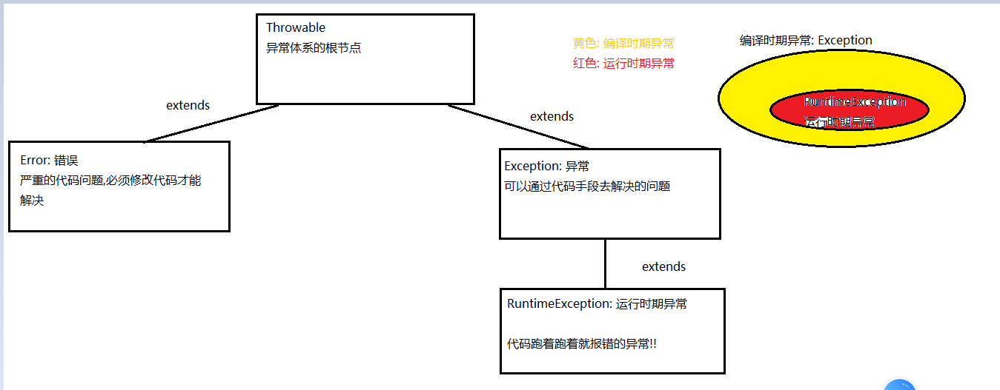
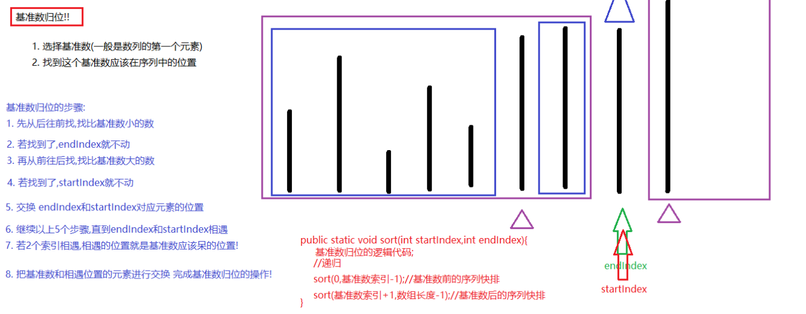

### Day_17随堂笔记

#### 泛型

```java
泛型 : 一种说不清楚的引用数据类型
 
格式 : <大写字母>
    
格式解释: 
	大写字母 : 
		1. 可以是任意的字母 <E>,<T>,<U>...
        2. 可以是单个字母也可以是多个字母 <MVP> --> 一般情况都是用单个字母
        3. 一个尖括号内可以表示一个或者多个泛型类型 <K,V>
            
如何使用:
	例如看到一个类的定义上有泛型(例:ArrayList<E>),只需要在使用此类的时候使用具体的引用数据类型类名去替换泛型即可!(例: ArrayList<String>)
     //泛型只能代表引用数据类型,若想代表基本数据类型必须使用基本数据类型的包装类型
        
     当使用带有泛型的板块时,如果不理会泛型,泛型的默认数据类型是Object!   
```

#### 泛型类(理解)

```java
泛型类: 带有泛型规范的类
    
格式:
	public class 类名<泛型>{
        //在类中,从此这个类中就多了一种引用数据类型供你使用
    }

如何使用呢?
    在使用此类的时候再给类的泛型具体的数据类型替换;

package com.atguigu.fanxing;
/*
    泛型类
 */
public class Student<J> {
    private String name;
    private J age;//18 +""

    public Student() {
    }

    public Student(String name, J age) {
        this.name = name;
        this.age = age;
    }

    public String getName() {
        return name;
    }

    public void setName(String name) {
        this.name = name;
    }

    public J getAge() {
        return age;
    }

    public void setAge(J age) {
        this.age = age;
    }

    @Override
    public boolean equals(Object o) {
        if (this == o) return true;
        if (o == null || getClass() != o.getClass()) return false;

        Student<?> student = (Student<?>) o;

        if (name != null ? !name.equals(student.name) : student.name != null) return false;
        return age != null ? age.equals(student.age) : student.age == null;
    }

    @Override
    public int hashCode() {
        int result = name != null ? name.hashCode() : 0;
        result = 31 * result + (age != null ? age.hashCode() : 0);
        return result;
    }

    @Override
    public String toString() {
        return "Student{" +
                "name='" + name + '\'' +
                ", age=" + age +
                '}';
    }
}

如何使用:
package com.atguigu.fanxing;

public class StudentDemo {
    public static void main(String[] args) {
        //创建学生对象
        Student<Integer> stu = new Student<>();
        stu.setName("迪丽热巴");
        stu.setAge(20);
        System.out.println("stu = " + stu);

        //创建学生对象
        Student<String> stu1 = new Student<>();
        stu1.setName("古力娜扎");
        stu1.setAge("22");
        System.out.println("stu1 = " + stu1);

    }
}
```

#### 泛型接口(了解)

```java
格式:
	public interface 接口名<泛型>{
        //在类中,从此这个接口中就多了一种引用数据类型供你使用
    }

泛型沿用问题: (泛型接口和泛型类都可以)
package com.atguigu.fanxing;

public interface Animal<F> {
    //从此接口中就多了一个F的数据类型供你使用
    public abstract void show(F f);
}

//泛型沿用: 继续使用泛型
//沿用的泛型名称:可以不是F,可以是任意的字母
class Tiger<F> implements Animal<F>{

    @Override
    public void show(F f) {

    }
}

//泛型没有沿用 : 理会泛型: 具体写什么类型,泛型就变成什么类型
class Cat implements Animal<String>{

    @Override
    public void show(String s) {

    }
}

//只要不理会泛型,泛型就会是默认的Object
class Dog implements Animal{
    @Override
    public void show(Object o) {

    }
}
```

#### 泛型方法(理解)

```java
泛型方法: 就是在定义方法的时候,在方法声明上声明一个泛型类型,那么此方法就可以使用此类型
    
格式:
	权限修饰符 状态修饰符 <泛型> 返回值类型 方法名(形式参数列表){
        从此这个方法内就多了一种数据类型供你使用!!
        //方法体;
        //return 返回值;
    }

使用:一般作为方法的返回值类型或者是方法的形式参数 //只有等到具体调用方法传入实参的时候才能确定形参上的泛型具体类型
package com.atguigu.fanxing;

public class FanXingMethod {
    public static void main(String[] args) {
        show(100);
        System.out.println("------------------");
        show("Hello");
    }


    public static <M> M show(M m){//一般当参数用,或者返回值类型用
        //从此这个方法内就多了一个M类型供你使用
        System.out.println("m.getClass() = " + m.getClass());
        return m;
    }
}
```

#### 泛型通配符(重点)

```java
格式: <?>
    
使用场景: 一般是配合集合在形参上定义
    
作用: 此方法可以接受任意泛型类型的集合对象
    
package com.atguigu.fanxing;

import java.util.ArrayList;
/*
    Object > Number > Integer

    泛型的通配符: (一般配合集合使用,用在形参上)
        格式 <?>
 */
public class Demo {
    public static void main(String[] args) {
        //创建集合对象
        ArrayList<Object> list1 = new ArrayList<>();
        show(list1);
        ArrayList<Number> list2 = new ArrayList<>();
        show(list2);
        ArrayList<Integer> list3 = new ArrayList<>();
        show(list3);

        //ArrayList<?> list = new ArrayList<>();

    }

    public static void show(ArrayList<?> list){

    }
}    
```

#### 泛型的上限和下限(重点)

```java
    泛型的下限:
        <? super 类型> :包含super后面的类型和super后面类型的父类型都可以
    泛型的上限:
        <? extends 类型> : 包含extends后面的类型和extendsr后面类型的子类型都可以

    不管上限还是下限都包含 super/extends后面的类型
            
代码:
	public class Demo1 {
    public static void main(String[] args) {
        //创建集合对象
        ArrayList<Object> list1 = new ArrayList<>();
        //show(list1); 此代码报错
        ArrayList<Number> list2 = new ArrayList<>();
        show(list2);
        ArrayList<Integer> list3 = new ArrayList<>();
        show(list3);

        //ArrayList<?> list = new ArrayList<>();

    }

    //上限
    public static void show(ArrayList<? extends Number> list){

    }
}
```

#### 异常体系(理解)

```java
Java中每一个异常其实都是一个类,具体的某一个异常产生是产生了此类的一个具体的对象!
    
根节点: Throwable
Throwable有两个子类: 
	Error: 错误 --> 严重的问题,必须修改代码解决
        // StackOverflowError 栈内存溢出错误  OutOfMemoryError 堆内存溢出错误
	Exception: 异常 ---> 可以通过代码手段解决的问题
        //NullPointerException 等等....
        
Exception有一个子类:
	RuntimeException: 运行时异常 //代码跑着跑着就报错了
    Exception: 编译时期异常//写代码的时候就直接有红杠杠(代码明明写的是对的!!)
```

#### 编译时期异常和运行时期异常

```java
	RuntimeException: 运行时异常 //代码跑着跑着就报错了
    Exception: 编译时期异常//写代码的时候就直接有红杠杠(代码明明写的是对的!!)
        
只要是RuntimeException和RuntimeException的子类异常都是 运行时期异常!  
只要是Exception但不是RuntimeException的子类异常都是 编译时期异常!           
```



#### JVM如何处理异常

```java
    JVM如何处理异常:
        1. 遇到异常立刻终止程序
        2. 控制台打印异常信息
            a.告知异常产生的线程
            b.告知异常的名称(全类名)
            c.告知异常的产生原因 (不一定都有)
            d.告知异常的产生的代码位置(行号)
            e.红色字体打印
            f.JVM还创建了一个此异常类型的对象
            g.开启新线程打印异常信息
```

#### 自己处理异常方式1: 不管交给JVM处理

```java
运行时期异常: 什么都不需要做,等待程序执行到异常代码,JVM报错!!
    //运行时期异常可以不用抛!!
    
编译时期异常: 必须要去处理一下
    方式1: 交给JVM处理 ---> 抛出去(谁调用谁处理)
        
    //抛出去 -> 此方式是目前阶段最为推荐的处理方式   
        
```

#### throws

```java
throws : 抛出异常
    位置: 方法的声明上,形参的后面
    格式: 方法(形参) throws 异常的类名{}
	注意事项:
		1. 一个可以同时抛出多个异常,每个异常之间使用逗号分隔
            方法(形参) throws 异常的类名1,异常的类名2.....{}
		2. 抛出父类型的异常就可以不用抛子类型的异常 --> 多态的体现之一 //一般情况抛到Exception就够了
```

#### 自己处理异常方式2: 包起来(自己手动处理)

```java
自己处理需要使用格式: try..catch
    
不管是编译时期异常还是运行时期异常都可以用此方式进行处理!!
    
格式: //只能在方法内用
	try{
        //可能出现问题的代码
    }catch(异常类型 e){//捕获异常!!
        //你自己的解决方案 (代码)
    }
```

#### try..catch

```java
格式: //只能在方法内用
	try{
        //可能出现问题的代码
    }catch(异常类型 e){//捕获异常!!
        //你自己的解决方案 (代码)
    }

执行流程:
	1. try中没有错
        从上至下正常执行代码,跳过catch中的代码执行
    2. try中有错并捕获到了
        立刻终止try中代码执行,并进入到catch中执行解决方案.继续执行try..catch后面的代码
        //try..catch如果捕获到了异常,那么不会影响try..catch后面的代码继续执行 --> 优势!!
    3. try中有错没有捕获到(绝对不要出现!!真的不知道捕获什么,你捕获Exception!)
        JVM会介入!
    4. try中有错捕获到了,但是catch中有错
        进入到catch中遇到catch中的异常,JVM会介入
```

#### try..catch的使用细节

```java
1. catch中捕获的异常可以是父类异常类型,子类异常对象也能捕获到
2. 一个catch只能捕获一个异常类型的对象
3.一个try中可以有多个catch
4.更靠前的catch如果捕获的是父类型异常,更靠后的catch就不可以捕获子类型异常对象
5.可以先捕获子类型异常再捕获父类型异常    
```

#### 异常对象的成员方法

```java
     String getMessage() : 返回异常的提示信息
     String toString() : 返回异常的类型和异常的提示信息
*     void printStackTrace() : 开启了新的线程以红色字体打印异常的类型和异常的提示信息和异常产生的位置
```

#### try..catch..finally

```java
final : 修饰符 -> 最终的 -> 形容词
    
finally : 只不过是try..catch结构中的一种补充形式
    
格式:    
	try{
        //可能出现问题的代码
    }catch(异常类型 e){//捕获异常!!
        //你自己的解决方案 (代码)
    }finally{
        //作用: 一定会执行的代码
    }

注意:
	1. finally代码块是一定要执行的代码.return结束不掉,只有关闭虚拟机才可以关闭finally代码块内容的执行
```

#### 自定义异常类如何编写

```java
自定义异常类的编写步骤:
1. 创建一个类,类名叫 XxxxxException
2. 若你想自己创建的异常对象是一个编译时期异常那么就让你的异常类去继承 Exception 
   若你想自己创建的异常对象是一个运行时期异常那么就让你的异常类去继承 RuntimeException   
3. 自动生成无参构造方法和还有String形参的含参构造方法    
```

#### 自定义异常类如何使用

```java
1. 创建方法
2. 在某个条件下, 创建异常对象并暴露异常对象
    格式: throw new 异常类型("异常的提示信息");
	//编译时期异常需要在此方法上抛出这个编译时期异常,运行时期异常不管

package com.atguigu.exception;

public class ExceptionDemo8 {
    public static void main(String[] args) {
        System.out.println("main开始");
        printAge(180);
        System.out.println("main结束");
    }


    public static void printAge(int age) throws AreUSBException {
        //条件在前
        if (age < 0 || age > 150){
            //报错!! --> 1. 创建异常对象 2.暴露此异常对象
            //throw new AreUFoolishException("你是一个制杖吧 年龄有问题!!");
            //暴露一个编译时期异常对象,就需要在此方法内处理此编译时期异常
            throw new AreUSBException(" 你是 上班 嘛~");
        }
        System.out.println("您的年龄是:"+ age);
    }
}
```

#### throw 和 throws 的区别

```java
throw : 暴露异常
    
throws : 抛出异常    
    
使用场景:
	throw : 用在方法内
    throws : 用在方法的声明上,形参的后面
        
功能:
	throw : 创建异常对象并暴露异常对象的
    throws : 在方法的声明上去抛出异常,交给调用者处理    
```

#### 递归算法

```java
递归: 在方法内部调用方法本身
    
递归的举例:    
    从前有座山,山里有座庙,庙里有个老和尚,老和尚给小和尚讲故事..
    	从前有座山,山里有座庙,庙里有个老和尚,老和尚给小和尚讲故事..
    		从前有座山,山里有座庙,庙里有个老和尚,老和尚给小和尚讲故事..
   				从前有座山,山里有座庙,庙里有个老和尚,老和尚给小和尚讲故事..
        
     学编程 -> 赚钱 -> 娶媳妇 -> 生娃娃...
        学编程 -> 赚钱 -> 娶媳妇 -> 生娃娃...
        	学编程 -> 赚钱 -> 娶媳妇 -> 生娃娃...
        		学编程 -> 赚钱 -> 娶媳妇 -> 生娃娃...
        
     俄罗斯套娃.......
        
递归的前提:
	//找到递归的规律!!!
*	1. 必须定义方法且方法有形参
    2. 勇敢的在方法内部调用方法本身
*   3. 递归要有出口 
*   4. 再次调用方法时,需要有实参的变化,实参的变化方向要往出口方向前进    
    5. 递归的次数不宜过多    
```

#### 快速排序原理

```java
为什么快排效率高: 把一个序列的排序变成了n个序列的排序
```



#### File类(理解)

```java
File 由JDK描述计算机硬盘上的 文件 和 文件夹!
    //计算机硬盘上都是文件或者文件夹!!!    
```

#### File类的构造方法

```java
    *File(String pathname) : 传入路径,创建File对象指向路径结尾的文件或者文件夹

    File(String parent, String child):以String类型的子父路径的方式创建file对象
    *File(File parent, String child): 以File类型的父路径和String类型的子路径的方式创建File对象

    File对象的创建发生了什么事情:
        1. 创建一个File对象
        2. 在堆内存中开辟空间
        3. 让file对象指向路径结尾的文件/文件夹
        4. 不管文件/文件夹 存在与否, 创建File对象对文件/文件夹无影响!!
```

