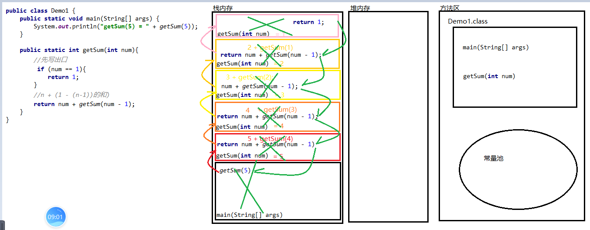
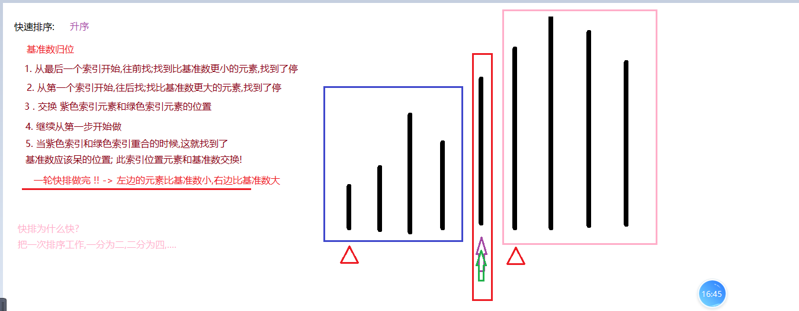
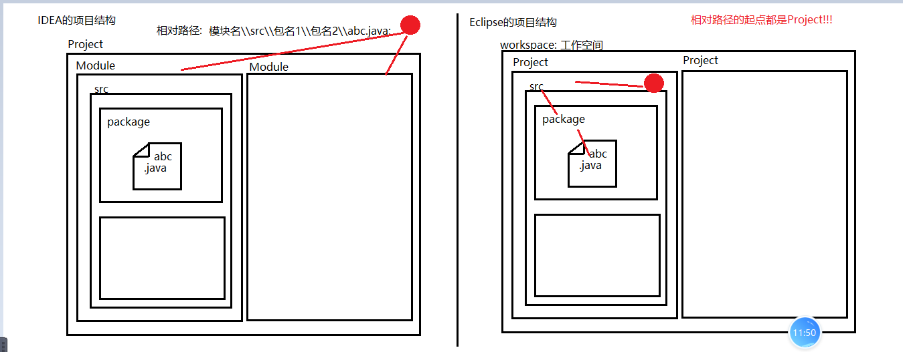

### Day_17随堂笔记

#### 异常的处理方式2:包起来

```java
1. 运行时期异常: 有意义,程序不会终止
    
2. 编译时期异常: 有意义.程序不会终止
```

#### try..catch

```java
包起来的格式:
        try{
            //放可能出现异常的代码
        }catch(异常的类名 异常对象名){
            //放你如何处理异常
        }

    执行流程:
        a.try中有异常,catch捕获准确
            从try中进入->遇到了异常代码->立刻终止try中代码执行->进入到catch中执行catch大括号内的代码->catch下面的代码也要执行
        b.try中无异常,catch无捕获
            从try中进入->执行完毕try跳过catch语句->执行try..catch后面的代码
        c. try中有异常,catch没有捕获到
            从try中进入->遇到异常代码立刻终止try中代码执行 -> catch不能捕获,JVM接手 -> 立刻终止所有程序执行,并抛出异常信息
            
    try..catch语句的注意事项:
        1. catch捕获父类型的异常,子类型的异常也全都捕获的到
        2. 一个try中可以有多个catch
            a. 不可以同时捕获相同的异常对象
            b. 不可以在捕获父类型异常的后面捕获子类型的异常,反之可以
        3. 如果catch中有异常,如果你没有处理JVM就会介入
        4. 一个catch中只能捕获一个异常对象            
```

#### finally

```java
finally 代码块 -> 配合try..catch使用

    
finally 代码块 代表的是一定会执行的代码!!(关流,关闭资源的代码放在finally代码块中)    
    
格式:  
    try{
        //放可能出现异常的代码
    }catch(异常的类名 异常对象名){
        //放你如何处理异常
    }finally{
        //一定会执行的代码
    }

只有一种情况finally代码块不执行 : 我主动让JVM退出(System.exit(0);//JVM退出)
```

#### 异常对象的功能

```java
 	String getMessage() : 获取异常对象的错误信息
    String toString() : 异常对象的类型和异常对象的错误信息
   ** void printStackTrace() : 异常的类型,异常的错误信息,异常产生的位置,红色字体,开启了新的线程打印内容
        JVM介入异常处理时,中断程序并调用异常对象的printStackTrace()!!
```

#### 如何自定义异常类(理解)

```java
自定义异常类的编写步骤:
	1. 给你的异常类取名字 : XxxxxException -> 规范
    2. 思考 : 你定义的异常类 是编译时期异常还是运行时期异常
        	编译时期的异常 : 你的异常类继承 Exception
            运行时期的异常 : 你的异常类继承 RuntimeException
    3. 只需要在异常类中 自动生成无参构造和一个带有String 参数的构造方法    
                
自定义异常类如何使用:
	1. 创建方法
    2. 在方法内编写异常产生的逻辑
    3. 在判断内 创建异常对象 并 暴露
        暴露并创建异常对象的格式 : throw new 异常类名(实际参数);
			//当你暴露的是一个编译时期异常就需要立刻处理 : 抛出去!!
```

#### throws 和 throw的区别

```java
throws : 抛异常
    1. 方法的声明上
    2. 作用: 抛出异常
throw : 暴露异常 
    1. 方法体内
    2. 作用 : 把你创建的异常对象暴露 
```

#### 递归算法

```java
递归是一种现象 : 在方法的内部调用方法的本身 
    
    生活举例 :
		从前有座山,山里有座庙,庙里有个老和尚,老和尚给小和尚讲故事...
            从前有座山,山里有座庙,庙里有个老和尚,老和尚给小和尚讲故事...
            	从前有座山,山里有座庙,庙里有个老和尚,老和尚给小和尚讲故事...
            		从前有座山,山里有座庙,庙里有个老和尚,老和尚给小和尚讲故事...
        
        学编程 -> 赚钱 -> 娶媳妇 -> 生娃娃 ... 
            学编程 -> 赚钱 -> 娶媳妇 -> 生娃娃 ...  
            	学编程 -> 赚钱 -> 娶媳妇 -> 生娃娃 ...  
            		学编程 -> 赚钱 -> 娶媳妇 -> 生娃娃 ...  
            
 递归有要求:
	//找规律    
	1. 在方法内部调用方法本身
    2. 递归要有出口  
    3. 递归方法一定要有形参,在方法内再次调用方法的时候要有实参的变化(变化方向要往出口变)  
    4. 递归的次数不能太多    
```

#### 递归的内存图



#### 快速排序的思路(递归实现)



#### File类

```java
File : 代表计算机中所有的文件和文件夹的类 (计算机中一切皆文件和文件夹)
    
构造方法:
	File(String pathname) : 创建一个File对象,File对象指向路径末尾的文件/文件夹
		pathname -> 文件夹或者文件夹的路径
    File(String parent, String child) : 以子父路径的方式创建File对象
	File(File parent, String child) : 以子父路径的方式创建File对象(父路径的对象File类型)    
```

#### 相对路径和绝对路径(重要)

```java
绝对路径 : 绝对能找到文件/文件夹的路径叫绝对路径 (全路径) -> 从盘符出发
相对路径 : 以参照物为起点的路径叫相对路径 (简单路径) -> 参照物 : project
    
举例:
	绝对路径 : 地球:\\亚洲\\中国\\湖北省\\武汉市\\江夏区\\茅店山中路\\东湖网谷\\六号楼\\4楼\\尚硅谷\\404教室\\谈斌
    相对路径 :  参照物 -> 假设你已经在东湖网谷了
        六号楼\\4楼\\尚硅谷\\404教室\\谈斌
        
相对路径有相对性,不能往外找!!        
```



#### File类的创建功能

```java
**boolean createNewFile()  : 创建File对象指向的路径结尾的文件!
    //如果文件存在,不会创建新文件,返回false
    //如果File对象的前置路径有问题,则报错!!
boolean mkdir() : 创建File对象指向的路径结尾的文件夹! // 只能创建单级文件夹
**boolean mkdirs(): 创建File对象指向的路径结尾的文件夹! // 不仅仅能创建单级文件夹,多级文件夹也可以
    
    
注意 : 具体创建的是文件还是文件夹,要看调用的是什么方法!! 而不看文件的名称!!    
```

#### File类的删除功能(了解中的了解)

```java
//删除是不走回收站的!! 

boolean delete() : 删除File对象指向的文件
    
    delete 在删除文件夹的时候要保证文件夹内所有的文件/文件夹删除完毕!
```

#### File类的判断功能

```java
boolean exists() : 判断File对象指向的文件/文件夹是否存在!!
boolean isDirectory()  :判断File对象指向的是否是一个文件夹
boolean isFile() :判断File对象指向的是否是一个文件
     
boolean isAbsolute() : 判断创建File对象时,是否以绝对路径创建   
boolean isHidden()  : 判断File对象指向的文件或者文件夹是否是一个隐藏文件/文件夹    
```

#### File类的获取功能

```java
   String getAbsolutePath() : 获取到FIle对象指向的文件/文件夹的绝对路径 -> 返回值类型: String
    File getAbsoluteFile() : 获取到FIle对象指向的文件/文件夹的绝对路径 -> 返回值类型: File

    String getParent() :获取到FIle对象指向的文件/文件夹的父路径  -> 返回值类型: String
    File getParentFile():获取到FIle对象指向的文件/文件夹的父路径  -> 返回值类型: File

    String getPath() : 创建File对象的时候传入的是什么路径就获取什么路径
    long length() : 只能获取文件的字节数,不能获取文件夹的字节数 -> 文件夹没有大小


   ** String getName(): 获取文件/文件夹的名称
    String toString(): 内核就是在调用getPath方法

    long lastModified()  : 获取file对象指向的文件/文件夹最后一次修改的时间毫秒值
```

#### 遍历文件夹(重要)

```java
File[] listFiles() : 获取File对象指向的文件夹根目录中的所有的文件和文件夹对象
    1. 如果file对象指向的是一个文件,则返回值是 null ,继续遍历数组会有空指针异常
    2. 如果file对象指向的是一个空文件夹,则返回值是一个内容为空的数组!! 不会有空指针异常!!

//带过滤器的遍历
File[] listFiles(FileFilter filter) : 带过滤条件的文件夹遍历
    FileFilter filter : 文件过滤器  --> 接口!!
        抽象方法 : boolean accept(File file) -> 返回true就要,返回false就不要
```

