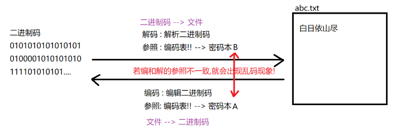
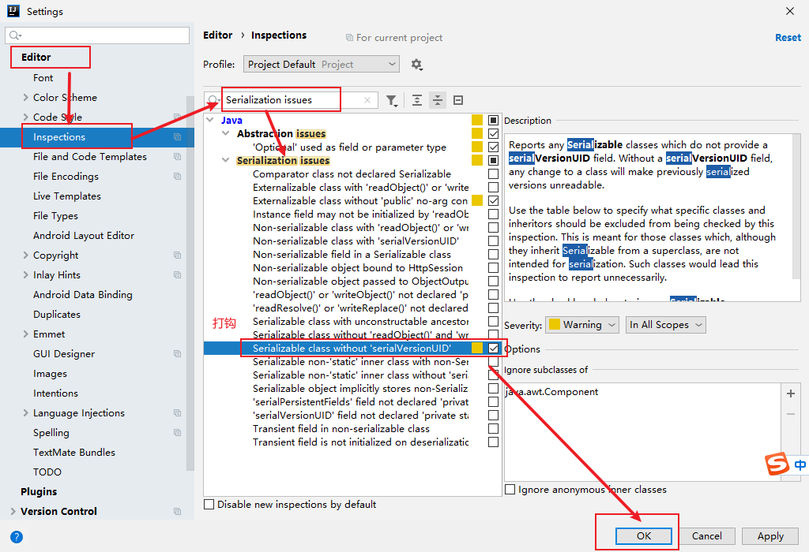

### Day_19随堂笔记

#### 高效字符流

```java
BufferedWriter/BufferedReader 
    
构造方法 :
	BufferedWriter(Writer writer)
    BufferedReader(Reader reader)
        
写的功能:
	*一次写一个字符,一次写一个字符数组,**一次写一个字符数组的一部分,***一次写一个字符串,一次写一个字符串的一部分
读的功能:
	常规: *一次读一个字符,**一次读一个字符数组,一次读一个字符数组的有一部分
```

#### 高效字符流特殊的读方法

```java
BufferedReader : 高效字符输入流
    String readLine(): 一次读一行字符串,不读换行符
    
BufferedWriter : 高效字符输出流
    void newLine(): 写一个换行符,专门会匹配不同的操作系统
```

#### 转换流

```java
转换流 : 字节流通往字符流的桥梁
    
InputStreamReader/OutputStreamWriter :  字符流
    
构造方法: //包装流;
	InputStreamReader(InputStream in)
    OutputStreamWriter(OutputStream out)
        
读写方法:   
	InputStreamReader读的方法: 一次读字符,一次读个字符数组,一次读一个字符数组的一部分
    OutputStreamWriter写的方法 : 一次写一个字符,一次写一个字符数组,一次写一个字符数组的一部分,一次写一个字符串,一次写一个字符串的一部分
```

#### 编码和解码(字符文件)

```java
编码 : 编花篮,编写 , 码 : 二进制码
    String --> 二进制码 : 过程叫 编码
        
解码 : 解析   码 : 二进制码
    二进制码 --> String : 过程叫 解码
        
编码和解码的过程中有一个很重要的环节 : "密码本"  -> 编码表      
    
乱码的根本原因: 编码和解码的编码表不一致!!
    
解决乱码的办法(最推荐的) : 修改文件的编码格式!!    
```



#### 编码表

```java
编码表 : 一个编码表下可以有多个编码格式
    
ASCII码表 : 最基础的码表,所有的编码表的前128位都是ASCII码表    
    
GB系列 : 中国的编码表 
    GB2312 : 老的
    GBK : 新的   -> windows系统在东八区中文系统环境下的默认编码格式 //一个中文占用2个字节
        
Unicode系列 : 国际同一组织规范的万维网中的编码格式
    UTF-8 : 万维网中的同一编码格式  //一个中文: 3个字节
        
windows系统中的: ANSI --> 不是一个编码格式
    ANSI只不过是一个变量, 变量来接收当前系统的默认编码格式;

ISO-8859-1 : 拉丁编码
```

#### 字符集

- 什么是字符集

  1. 是一个系统支持的所有字符的集合，包括各国家文字、标点符号、图形符号、数字,emoji等

  2. 计算机要准确的存储和识别各种字符集符号，就需要进行字符编码，一套字符集必然至少有一套字符编码。
  3. 常见字符集有ASCII字符集、GBXXXX字符集、Unicode字符集等

- 常见的字符集

  - ASCII字符集：

    ASCII：是基于拉丁字母的一套电脑编码系统，用于显示现代英语，主要包括控制字符(回车键、退格、换行键等)和可显示字符(英文大小写字符、阿拉伯数字和西文符号) 

    > 其他任何字符集都是ASCII字符集的延伸

  - GBXXX字符集：

    GBK：最常用的中文码表。是在GB2312标准基础上的扩展规范，使用了双字节编码方案，共收录了21003个汉字，完全兼容GB2312标准，同时支持繁体汉字以及日韩汉字等

    > GBXXX是中国的编码表 
    >
    > GB2312
    >
    > GBK: windows系统在中文环境下的默认编码格式
    >
    > GBK中中文占用2个字节

  - Unicode字符集：

    UTF-8编码：可以用来表示Unicode标准中任意字符，它是电子邮件、网页及其他存储或传送文字的应用 中，优先采用的编码。互联网工程工作小组（IETF）要求所有互联网协议都必须支持UTF-8编码。它使用一至四个字节为每个字符编码

    > 网站中的编码统一都是UTF-8

    **编码规则： 

      128个US-ASCII字符，只需一个字节编码

      拉丁文等字符，需要二个字节编码

      大部分常用字（含中文），使用三个字节编码

      其他极少使用的Unicode辅助字符，使用四字节编码(Emoj)

  - ANSI: windows系统中默认编码表

    > ANSI不是一种具体的编码表,windows系统在不同的语言环境下ANSI代表的是不同类型的编码表 
    >
    > 中文环境: ANSI -> GBK
    >
    > 英文环境: ANSI -> ASCII
    >
    > 拉丁环境: ANSI -> ISO8859-1

#### String类和编码的联动

```java
编码 : String --> 二进制码(byte)
    byte[] getBytes(): 按照平台的默认编码格式对字符串进行编码
    byte[] getBytes(String charSetName): 按照指定的编码格式对字符串进行编码
    
解码 : 二进制码(byte) --> String
    String(byte[] bys): 按照平台默认编码格式对bys字节数组进行解码操作
    String(byte[] bys,int startIndex,int length): 按照平台默认编码格式对bys字节数组的一部分内容进行解码操作
    
    String(byte[] bys,String charsetName): 按照指定编码格式对bys字节数组进行解码操作
    String(byte[] bys,int startIndex,int length,String charsetName): 按照指定编码格式对bys字节数组的一部分进行解码操作
    
//要想不乱码,要保证编码和解码的编码格式一致    
```

#### 转换流的设置读写编码格式的方法

```java
InputStreamReader/OutputStreamWriter :  字符流
    
InputStreamReader: 设置读文件时的编码格式  
    InputStreamReader(InputStream in, String charsetName)
    
OutputStreamWriter: 设置写入文件数据的编码格式    
    OutputStreamWriter(OutputStream out,String charsetName)
    
// 字符流 = 字节流 + 编码格式;    
    
文件是什么编码格式就按照什么编码格式读,绝对不会乱!!  
    
文件是什么编码格式就按照什么编码格式写,绝对不会乱!!       
    
解决乱码的推荐方案是: 修改文件的编码让其和平台的编码格式一致!!    
```

#### 标准的系统输出输入流

```java
InputStream -> System.in; -> 标准系统输入流 -> 只做键盘录入
    
PrintStream -> System.out; -> 标准的系统输出流 -> 只做控制台打印
```

#### 序列化流和反序列化流

```java
ObjectInputStream:反序列化流
    ObjectInputStream(InputStream in)
ObjectOutputStream:序列化流
    ObjectOutputStream(OutputStream out) 
    
//他们是字节流,肯定是具备字节流读和写的功能
    
他们特有的读写方法: 读写对象
    ObjectOutputStream : void writeObject(Object obj)
    ObjectInputStream : Object readObject()    
        
//想把对象写到文件中的时候,需要对象所在的类实现Serializable接口 (序列化接口)
//读对象文件读到文件末尾的时候,会报EOF异常(文件末尾异常)        
```



#### 编写JavaBean的八个步骤

```java
1. 私有属性 		//封装性,提高安全
2. 提供无参构造方法   //为了方便的创建对象
3. 提供全参构造方法   //在创建对象的时候给属性值赋值
4. 生成getter and setter方法 //对私有属性的公共访问方式 
5. 生成equals和hashCode方法 //Hash结构中按照属性值去重  equals: 比较对象的时候比较属性
6. 生成toString方法 // 输出对象的时候不输出对象的地址值而是属性值
7. 实现序列化接口 -> Serializable //序列化流要操作这个类的对象,此类必须有这个标签
8. 自动生成序列化id -> serialVersionUID // 通过ID找类而不是通过类成员找类   
```

#### 打印流

```java
打印流只有输出流没有输入流;

打印字节输出流 : PrintStream 
打印字符输出流 : PrintWriter
    
PrintWriter : 可以实现自动换行和自动刷新
    //前提 :
    	1. 必须在创建PrintWriter对象的时候打开自动刷新的开关 autoFlush,并且必须使用 printf(),format(),println()之一 --> 自动刷新就可以
   		2. 必须使用println()才能实现自动换行
    
PrintWriter构造方法:
	 PrintWriter(String fileName) 
	 PrintWriter(File file) 
         
     PrintWriter(Writer out) --> 包装流;
     PrintWriter(OutputStream out) 

     //创建PrintWriter对象时,传入Writer/OutputStream对象时才能控制自动刷新开关!!
     PrintWriter(Writer out, boolean autoFlush) 
     PrintWriter(OutputStream out, boolean autoFlush) 
         
 PrintWriter写的功能:
	1.  write():一次写一个字符,一次写一个字符数组,一次写一个字符数组的一部分,一次写一个字符串,一次写一个字符串的一部分
    2. void println(任意类型的对象)      
```

#### Properties

