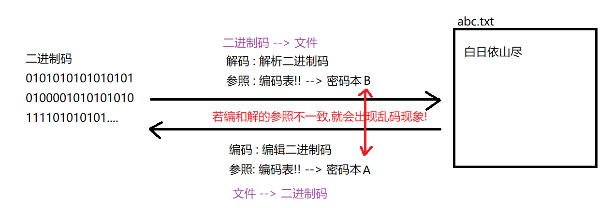
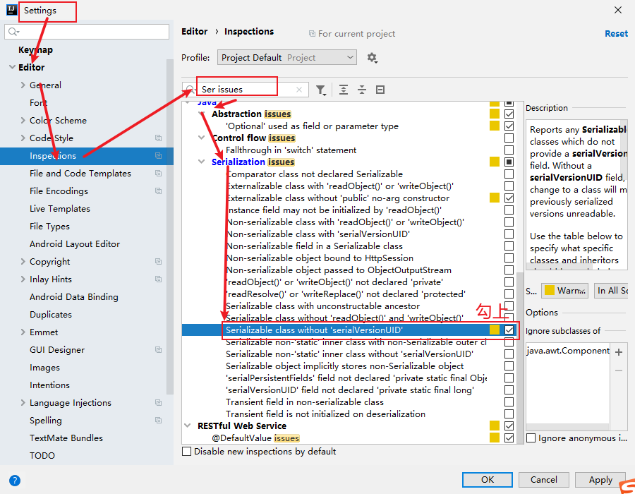

### Day_19随堂笔记

#### 高效的字节流

```java
BufferedInputStream/BufferedOutputStream -> 缓冲流
    
缓冲流的原理: 
	在内存中去开辟一个缓冲区,先把数据读到缓冲区中,然后一次性把缓冲区的数据写入到文件中
        
创建对象:
	BufferedInputStream(InputStream in) 
    BufferedOutputStream(OutputStream out)  
    //根据构造方法我们知道高效流又称作为 包装流(本身不具备读写能力,真正具备读写能力的是普通流对象)
        
读和写的功能: 完全和普通流一样
    读: 
	  *	int read(): 一次读一个字节
      **  int read(byte[] bys): 一次读一个字节数组
        int read(byte[] bys,int startIndex,int length): 一次读一个字节数组的一部分   
    写:
	  *	void write(int by): 一次写一个字节
        void write(byte[] bys):一次写一个字节数组
      **  void write(byte[] bys,int startIndex,int length):一次写一个字节数组的一部分//读了多少写多少   
          
高效输出流都需要做的一个事情:      
	高效流会先把数据写到缓冲区中,只有关流的时候才会把缓冲区中的数据写入到文件中;
	所以我们需要在写入一次数据之后主动 刷新!!
    高效输出流都有这个方法 :  void flush()    
        
只有基本输出流才具备追加写的功能!! 高效流没有!! 若想追加写只需要在高效输出流封装的普通输出流中打开追加写开关!        
```

#### 字节流操作字符文件的问题

```java
package com.atguigu.readerandwriter;

import java.io.FileInputStream;
import java.io.IOException;

public class Demo {
    public static void main(String[] args) throws IOException {
        //字节流读取字符文件的内容 打印到控制台
        FileInputStream fis = new FileInputStream("T_Day19/test/BufferedOutputStreamDemo.java");

        //一次一个字节
        int by;
        while ((by = fis.read())!=-1){
            //输出
            System.out.print((char)by);
        }

        fis.close();
    }
}
```

#### 字符流

```java
字符流 : 更方便的操作计算机中字符文件(只能操作字符文件)
    
字符流的本质其实也是字节流;(字符流 = 字节流 + 编码格式)    
	//字符流本身其实也是一个包装流(高度封装),字符输出流输出数据的时候也是要刷新的!!

字符流的根节点:
	Reader/Writer -> 也是抽象类
```

#### 普通字符流

```java
FileReader/FileWriter
```

##### 普通字符输出流 - FileWriter

```java
构造方法:
	*FileWriter(String fileName) : 直接传入目标文件的路径,让字符输出流指向这个文件;
    FileWriter(File file) : 直接传入目标文件的路径(File对象的形式),让字符输出流指向这个文件;  

	//带有追加写开关的字符输出流对象!!
	FileWriter(String fileName, boolean append) 
    FileWriter(File file, boolean append)     
        
    //具备追加写功能的流对象: FileOutputStream/FileWriter -> 基本输出流   
    //文件不存在可以帮你创建,但是要保证文件的前置路径要正确
        
 写的功能:
	void write(int ch) : 一次写一个字符
    void write(char[] chs) : 一次写一个字符数组
    void write(char[] chs,int startIndex,int length) : 一次写一个字符数组的一部分
    void write(String str) 一次写一个字符串
    void write(String str,int startIndex,int length) : 一次写一个字符串的一部分 
        
        //startIndex : off/offset
```

##### 普通字符输入流 - FileReader

```java
构造方法:
	FileReader(String fileName) : 直接传入字符文件路径,输入流对象指向这个字符文件
	FileReader(File file) : 直接传入字符文件路径,输入流对象指向这个字符文件
        //输入流是没有追加读的说法!!
        //源文件必须存在!!
        
读的方法:       
	int read():一次读一个字符
    int read(char[] chs)一次读一个字符数组
    int read(char[] chs,int startIndex,int length) : 一次读一个字符数组的一部分    
```

#### 高效字符流

```java
BufferedReader/BufferedWriter: 包装流,真正工作的还是基本流
    
构造方法:  
	BufferedReader(Reader reader) 
    BufferedWriter(Writer writer)  
        
基本读和写的功能:
	写的功能:
	void write(int ch) : 一次写一个字符
    void write(char[] chs) : 一次写一个字符数组
    void write(char[] chs,int startIndex,int length) : 一次写一个字符数组的一部分
    void write(String str) 一次写一个字符串
    void write(String str,int startIndex,int length) : 一次写一个字符串的一部分 
        
    读的方法:       
	int read():一次读一个字符
    int read(char[] chs)一次读一个字符数组
    int read(char[] chs,int startIndex,int length) : 一次读一个字符数组的一部分        
```

#### 高效字符流的特殊功能

```java
BufferedReader的特殊读的方法:
	String readLine() : 一次读一行字符串,不能读换行符
BufferedWriter的特殊方法:
	void newLine(): 写一个换行符 (根据不同的操作系统自动生成相应的换行符)
```

#### 编码和解码

```java
字节 byte : 计算机中最小的存储单元
比特位 bit : 计算机中最小的信息单元  --> 01010101010101010  --> 二进制码       
```



#### 字符集

- 什么是字符集

  1. 是一个系统支持的所有字符的集合，包括各国家文字、标点符号、图形符号、数字,emoji等

  2. 计算机要准确的存储和识别各种字符集符号，就需要进行字符编码，一套字符集必然至少有一套字符编码。
  3. 常见字符集有ASCII字符集、GBXXXX字符集、Unicode字符集等

- 常见的字符集

  - ASCII字符集：

    ASCII：是基于拉丁字母的一套电脑编码系统，用于显示现代英语，主要包括控制字符(回车键、退格、换行键等)和可显示字符(英文大小写字符、阿拉伯数字和西文符号) 

    > 其他任何字符集都是ASCII字符集的延伸

  - GBXXX字符集：

    GBK：最常用的中文码表。是在GB2312标准基础上的扩展规范，使用了双字节编码方案，共收录了21003个汉字，完全兼容GB2312标准，同时支持繁体汉字以及日韩汉字等

    > GBXXX是中国的编码表 
    >
    > GB2312
    >
    > GBK: windows系统在中文环境下的默认编码格式
    >
    > GBK中中文占用2个字节

  - Unicode字符集：

    UTF-8编码：可以用来表示Unicode标准中任意字符，它是电子邮件、网页及其他存储或传送文字的应用 中，优先采用的编码。互联网工程工作小组（IETF）要求所有互联网协议都必须支持UTF-8编码。它使用一至四个字节为每个字符编码

    > 网站中的编码统一都是UTF-8

    **编码规则： 

      128个US-ASCII字符，只需一个字节编码

      拉丁文等字符，需要二个字节编码

      大部分常用字（含中文），使用三个字节编码

      其他极少使用的Unicode辅助字符，使用四字节编码(Emoj)

  - ANSI: windows系统中默认编码表

    > ANSI不是一种具体的编码表,windows系统在不同的语言环境下ANSI代表的是不同类型的编码表 
    >
    > 中文环境: ANSI -> GBK
    >
    > 英文环境: ANSI -> ASCII
    >
    > 拉丁环境: ANSI -> ISO8859-1

#### String类和编码的联动

```java
String  -->  byte[]  ---> 编码
    成员方法 : byte[] getBytes(): 把字符串按照平台的默认编码格式转换成一个字节数组
    关于带编码表的操作:
	byte[] getBytes(String charsetName)  
    
byte[] --> String ---> 解码   
    String的构造方法: String(byte[] bys) :  把字节数组按照平台默认的编码格式转换成一个字符串
    关于带编码表的操作: 
	String(byte[] bytes, String charsetName) 
    String(byte[] bytes, int offset, int length, String charsetName)     
```

#### 转换流

```java
转换流的功能:
	1. 把字节流转换成字符流 -> 字节流通往字符流的桥梁
    2. 转换流可以在读写的时候,设置读和写的编码格式
        
字符流 = 字节流 + 编码格式; 

转换流: InputStreamReader/OutputStreamWriter  --> 字符流
    
构造方法:
	InputStreamReader(InputStream in) : 把字节输入流转换成字符输入流;(按照平台默认的编码格式进行读)
    InputStreamReader(InputStream in, String charsetName) : 按照传入的指定编码格式读取字符文件;

	OutputStreamWriter(OutputStream out): 按照平台的指定编码格式往文件中写数据;
	OutputStreamWriter(OutputStream out, String charsetName): 按照指定的编码格式往文件中写数据

InputStreamReader 读的功能:
	1. 一次读一个字符
    2. 一次读一个字符数组
    3. 一次读一个字符数组的一部分   
        
OutputStreamWriter 写的功能:
	1. 一次写一个字符
    2. 一次写一个字符数组
    3. 一次写一个字符数组的一部分
    4. 一次写一个字符串
    5. 一次写一个字符串的一部分    
```

#### 标准系统流

```java
标准系统输入流: 字节流 --> 只做键盘录入
	System.in:  --> public final static InputStream in = null;
标准系统输出流: 字节流 --> 只做打印控制台
	System.out: --> public final static PrintStream out = null; 
```

#### 序列化流和反序列化流

```java
对象操作流 -> 序列化流和反序列化流
    序列化 :  把对象存到文件中
    反序列化: 把对象从文件中取出来
        
ObjectInputStream/ObjectOutputStream : 字节流
    
构造方法:
	ObjectOutputStream(OutputStream out) 
    ObjectInputStream(InputStream in)   
        
序列化流和反序列化流特殊的读写功能 -> 写对象!/读对象!
    写对象: 
		void writeObject(Object obj): 把传入的对象写到指定的对象文件中
    读对象:
		Object readObject(): 把对象文件中的对象读出来
            
注意事项:
        1. 想把一个类的对象写到文件中必须要求此类实现序列化接口!!
                interface --> Serializable            
```



#### 一个标准的事物描述类的编写步骤

```java
1. 私有属性
2. 无参构造
3. 全参构造
4. getter and setter方法
5. equals 和 hashCode方法
6. toString方法
7. 实现Serializable接口
8. 自动生成序列化versionUID    
```

#### 打印流

#### Properties