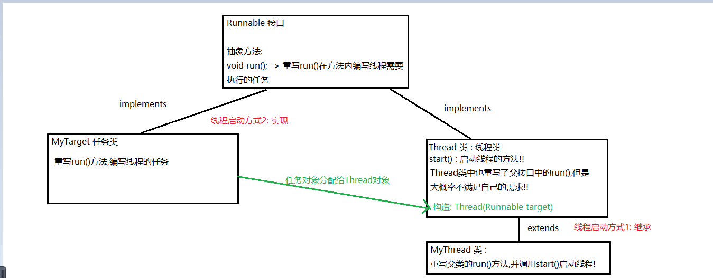
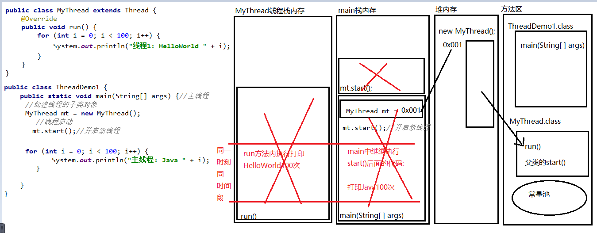
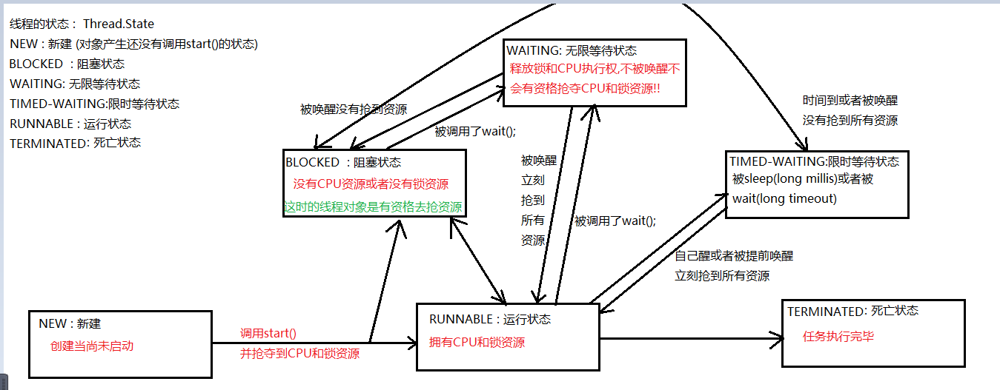

### Day_20随堂笔记

#### Properties

```java
Properties : 属性集 -> .properties结尾的文件 (属性集文件)
    
Properties 是一个不可以写泛型的双列集合(它的父类 Hashtable ,在Properties继承Hashtable时,把Hashtable的泛型写死了 <Object,Object>)
    //Properties要实现它强大的功能,里面的元素必须是String类型
    
创建对象:
	Properties 集合名 = new Properties();
增删改查:
	增和改 : V put(键,值)
    查 : V get(键)
    删 : 
		值 remove(键): 根据键删除整个映射关系,返回被删除元素的值
        boolean remove(键,值) : 根据键值对删除元素,并返回删除是否成功
            
遍历:
	1. 丈夫找媳妇 :Set<K> keySet()
    2. 通过结婚证对象 :Set<Map.Entry<K,V>> entrySet()   
        
----------------------------------------------
Properties 特有的 增删改查 和 遍历功能       
     Object setProperty(String key, String value) <----> V put(键,值)     
     String getProperty(String key)  <---->  V get(键) 
     Set<String> stringPropertyNames()  <----> Set<K> keySet()  
```

#### Properties集合和IO的配合

```java
    Properties 可以和IO流技术配合:(元素的类型必须都是String)
        1. 一键存储 : 一键把集合中的内容存储到文件中
                 void store(OutputStream out, String comments)
                 void store(Writer writer, String comments)
        2. 一键加载 : 一键把文件中的属性集加载到集合中
                 void load(InputStream inStream)
                 void load(Reader reader)
```

#### 进程和线程

```java
进程 :  正在运行的程序叫进程

线程 : 存在于进程中的一条任务线
    //一个进程中至少有一个线程 (单线程程序)
    //一个进程中大多都不止一个线程 (绝对多数的程序都是多线程程序)
    
CPU是如何处理计算机中同时运行的多个程序?
    1. 先把所有进程中的线程获取到
    2. 线程抢占(抢夺CPU的执行权)式执行
```

#### 并行和并发

```java
并发 : 时间段
    在一段时间内,有多个事件发生
并行 : 时间点(时间瞬间)    
    在一个时间瞬间,有多个事件发生
    
多线程的程序是并行还是并发 : 多线程程序既是并行也是并发    
    
多线程随机性非常强,出问题的概率也大 !!
    多个线程同时处理共享数据大概率会出问题 (线程安全问题)
    线程安全问题的解决方案 : 一定能够解决的方案是 -> 同步操作(上悲观锁)
```

#### 线程的体系结构

```java
根节点: 
	Runable 接口 -> 抽象方法 : void run() -> 线程需要执行的任务就写在重写的run方法中
        
子类 :
	Thread 线程的类 -> 只有Thread类和Thread类的子类对象才是线程对象,才能启动线程(start())
```



#### 线程的开启方式

##### 线程开启方式1: 继承的方式

```java
步骤:
	1. 创建类,去继承Thread
    2. 重写父类中的run方法,在run中编写该线程对象需要完成的任务
    3. 在使用线程的地方,创建线程的子类对象,并调用start()    
```



##### 线程的开启方式2: 实现的方式

```java
步骤:
	1. 创建任务类,去实现Runnable接口
    2. 在任务类中,重写父接口中的run方法
    3. 在run方法中编写线程需要执行的任务
    4. 在使用线程的地方,创建的是Thread对象
        	构造方法 : Thread(Runnable target)
    5. 启动线程 调用start方法            
```

##### 线程的开启方式3: 有任务结果的开启方式

```java
Callable<V> 接口: //类似于Runnable接口,也是给线程提供任务的,但是call()方法有返回值
	有且仅有一个抽象方法 : V call() //在call中编写线程的任务
        
FutureTask<V>类: 
	构造方法: 
		1. FutureTask(Callable<V> callable) 
        2. FutureTask(Runnable runnable, V result)     
	成员方法:
		V get(): 获取任务执行完毕的结果
            
1. 创建任务类,去实现Callable接口
2. 重写call方法
3. 创建FutureTask对象,把Callable的实现类对象传递进去
4. 在使用线程的地方,创建的是Thread对象,把FutureTask对象传递进去
        	构造方法 : Thread(Runnable target)  
5. 启动线程 调用start方法                
```

#### 设置线程名称和获取线程名称的方法

```java
Thread类:
	设置线程名称 :
		1. 成员方法 : void setName(String name)
        2. 构造方法 :
				Thread(String name): 创建Thread对象时给名称; //继承的方式: 在子类中也自动生成
                Thread(Runnable target, String name)  : 传递任务给线程取名字   //实现的方式
                    
    获取线程名称 : 
		String getName(): 获取线程对象的名称
            
	获取当前线程对象:
		Thread 静态方法: static Thread currentThread():        
```

#### 设置线程优先级

```java
线程对象都是有优先级的:
	默认: 5
    最低: 1
    最高: 10
       
优先级: 优先级越高,优先执行的概率就越大!!       
    
设置优先级的方法:
	void setPriority(int newPriority): 传入的整数 1-10之间
获取优先级的方法:
	int getPriority(): 
```

#### 设置守护线程

```java
守护线程: 当被守护的线程执行完毕,守护线程也会立刻结束
    
 void setDaemon(boolean on)      
```

#### 休眠方法

```java
static void sleep(long millis): 让线程休眠,传入休眠的毫秒值
    //sleep方法 会让线程放弃CPU的执行权
```

#### 火车站卖票案例

#### 同步代码块

```java
对代码进行上锁 :
        锁对象 :
            1. 任意引用类型的对象 -> 推荐Object
            2. 锁对象要能控制所有的线程对象

    同步代码块:
        synchronized(锁对象){
            //需要上锁的代码
        }

    上锁的代码:
        线程对象获取CPU资源还要获取锁资源
```

#### 同步方法

```java
定义格式:
	权限修饰符 状态修饰符 synchronized 返回值类型 方法名(形参列表){
        //方法体
        //return 值;
    }

    //非静态同步方法 -> 锁对象: this
    //静态同步方法 -> 锁对象: 当前类的Class对象
```

#### Lock对象上锁

```java
Lock 是一个接口

实现类 :  ReentrantLock 类
    
成员方法:
	上锁: lock()
    解锁: unLock()    
```

#### 锁对象的功能

```java
锁对象的功能是控制线程执行!!
    
Object 成员方法:
	//等待
	void wait()  : 无限等待 //线程不会自己醒,需要锁对象唤醒
    void wait(long timeout) : 限时等待 //线程自己会醒,但是要抢CPU和锁资源
    void wait(long timeout, int nanos)  : 限时等待 
    	//wait方法: 让线程对象释放锁资源和CPU资源
        //sleep方法: 只释放CPU执行权 (抱着锁睡!!)
        
    //唤醒
    void notify() : 随机唤醒等待中的某个线程对象  
    void notifyAll() : 唤醒所有等待的线程对象    
```

#### 线程的生命周期



