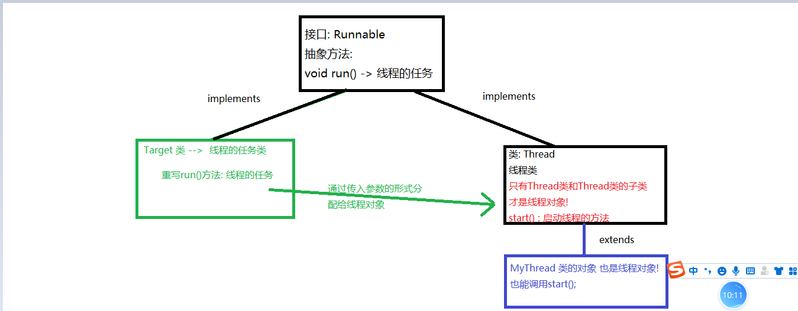
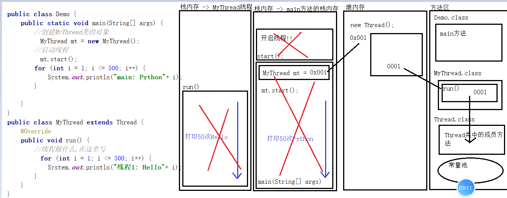

### Day_20随堂笔记

#### 打印流 - PrintStream/PrintWriter

```java
打印流 : 单身汉流,只有输出流没有输入流 -> 只有输出流!
    PrintStream打印字节流/PrintWriter打印字符流
    
PrintWriter构造方法:
	* PrintWriter(String fileName) 
	new BufferedWriter(new OutputStreamWriter(new FileOutputStream("目标文件"))),false);

	PrintWriter(File file) 
    new BufferedWriter(new OutputStreamWriter(new FileOutputStream(file))),false);   
    
    //打印字符流也是一个包装流
    PrintWriter(OutputStream out)    
    源码: this(out, false);    
    PrintWriter(Writer out)    
    
    //打印字符流带有自动刷新的开关(默认是关闭的!)
    PrintWriter(OutputStream out, boolean autoFlush) 
    PrintWriter(Writer out, boolean autoFlush)    
        
打印字符流的特点: 
	1. 自动刷新(a. 打开自动刷新的开关. b. 必须选用println(),printf(),format()输出)  
    2. 自动换行(a. 必须用 println() 方法进行输出)   
        
PrintWriter写的功能:
	常规的写的方法:
		void write(int ch):一次写一个字符
        void write(char[] chs):一次写一个字符数组
        void write(char[] chs,int startIndex,int length):一次写一个字符数组的一部分
        void write(String str):一次写一个字符串 
        void write(String str,int startIndex,int length):一次写一个字符串的一部分
   最为特殊的写的方法 : 写并换行
       void println(任意类型的数据):写一切
```

#### 属性集 - Properties

```java
Properties 是一个双列集合 是Hashtable的子类(Properties 一键加载一键存储)
    
Properties 是不可以写泛型的!它的泛型固定: <Object,Object>
    重要: 要实现一键加载和一键存储 要求Properties集合中的元素类型必须是<String,String>
        
创建对象:
	Properties prop = new Properties();
增删改查: 和HashMap一模一样!!
```

#### 多线程

#### 进程和线程

```java
进程: 一个正在运行的应用程序叫进程
线程: 一个进程中有多个线程(同时执行的流程)    
    
百分之99.99的应用程序都是多线程的!
一个进程中至少有一个线程!!    
```

#### 并发和并行

```java
并发: 在同一段时间内同时做事情
并行: 在同一时刻同时做事情
    
多线程的程序是并行还是并发?? 都是   
    
计算机中的多个程序是如何流畅的执行的?
    先把所有进程中的线程收集起来,让线程们去抢夺CPU的执行权,谁抢到谁执行!!
```

#### 多线程的体系结构

```java
根节点: 接口 -> Runnable
    抽象方法: void run(); -> 重写run()方法就是线程对象需要完成的任务!
 
子类 : Thread  -> 此类的对象或者其子类对象才是线程对象!!      
```



#### 线程开启方式

##### 线程开启方式1:继承的方式

```java
步骤:
	1. 创建一个类,继承Thread
    2. 主动的重写父类的run方法(),并把线程需要做的事情写在run方法内
    3. 在需要使用线程对象的时候,创建Thread的子类对象并调用start()    
```

##### 线程的开启方式2:实现的方式 -> 任务和线程对象分离

```java
1. 创建一个类去实现Runnable接口
2. 必须重写父接口中的run方法,在run方法内编写线程的任务
3. 在使用线程的地方,创建任务对象(MyTarget类)再创建线程对象(Thread类)   
4. 把任务对象分配给线程对象:
		Thread(Runnable target) 
            
            //线程和任务对象的分离!!
```

##### 线程的开始方式3: 有结果的线程开启方式

```java
不带结果的任务接口: Runnable 抽象方法: void run();
带结果的任务接口: Callable<T> 抽象方法: T call(); 
		-> 线程要做什么就在call()方法中编辑
        -> T: 线程执行完毕结果的数据类型
            
1. 创建一个实现类实现Callable<T>接口,重写Callable<T>接口中的call方法
2. 在call方法内编写线程需要完成的任务,并返回任务完成后的结果
3. 在使用线程的时候,把任务对象(Callable的实现类对象)分配给线程对象(Thread类对象) 
            
        
  Runnable有一个实现类 : FutureTask<T>
    FutureTask有一个构造方法可以接受Callable对象
        FutureTask(Callable<V> callable)

    如何获取到线程的结果呢?
        调用FutureTask类中的get方法获取线程的结果


    FutureTask有一个构造方法可以接受Runnable对象,并且可以手动给结果
        FutureTask(Runnable runnable, V result)            
```

#### 多线程的内存图

```java
开启新的线程在内存中其实是开启了新的栈!!
```



#### 线程对象的成员方法

##### 给线程对象取名字并且获取线程对象的名称

```java
设置名字:
	成员方法: void setName(String name)  
    构造方法:
		Thread(String name) 
    	Thread(Runnable target, String name)
            
获取名字:
	成员方法:  String getName()  
        
   //Runnable实现类对象和Thread类对象没有关系,就不可以调用Thread类中的getName()方法
   //Thread类中有一个静态方法 static Thread currentThread() -> 获取当前线程对象     
```

##### 设置线程的优先级

```java
每一个线程都有优先级 : 优先级越高,抢夺CPU资源的概率越高!!
    线程默认的优先级: 5
    线程最小的优先级: 1
    线程最大的优先级: 10
        
int getPriority() :获取线程优先级
void setPriority(int newPriority)  :更改线程优先级        
```

##### 设置守护线程

```java
void setDaemon(boolean on)  : 线程对象调用此方法,被设置为守护线程,其他线程执行完毕,它"立刻"死亡
```

##### 让线程睡一下

```java
static void sleep(long millis)  : 传入的是毫秒值
    //让线程睡觉,会让线程慢下来且主动放弃抢夺CPU的执行权
```

