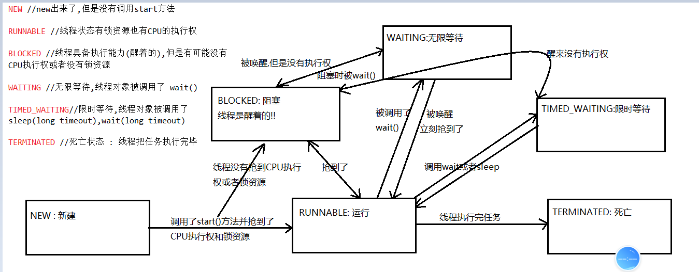
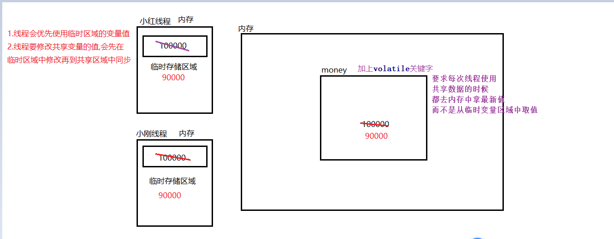
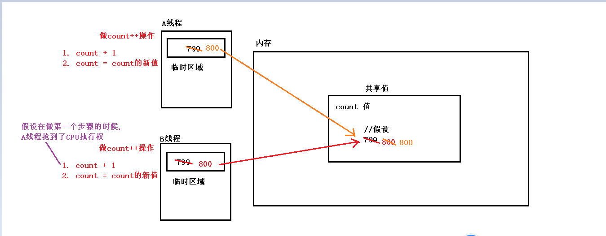
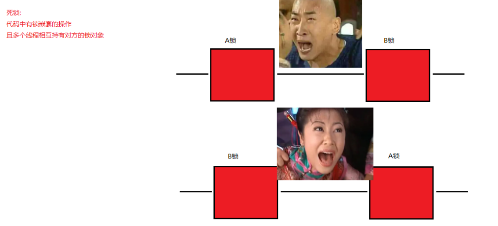

### Day_21随堂笔记

#### 昨日复习

```java
package com.atguigu.review;

import java.util.concurrent.Callable;
import java.util.concurrent.FutureTask;

/*
    匿名内部类的格式:
        new 父类/抽象类/接口(){
            //子类/实现类的类主体
        };
    第一种: 继承的方式
    第二种: 实现的方式 -> 任务对象和线程对象的分离
    第三种: 有任务结果的实现方式 Callable<V>

 */
public class Demo {
    public static void main(String[] args) {
        //第一种: 继承的方式
        //Thread父类 = 匿名的Thread的子类对象
        Thread t1 = new Thread(){
            @Override
            public void run() {
                System.out.println(getName() + " Java~");
            }
        };
        t1.setName("线程1:");
        //第二种: 实现的方式
        Thread t2 = new Thread(new Runnable() {
            @Override
            public void run() {
                System.out.println(Thread.currentThread().getName() +" PHP~");
            }
        },"线程2:");
        //第三种:
        Thread t3 = new Thread(new FutureTask<String>(new Callable<String>() {
            @Override
            public String call() throws Exception {
                System.out.println(Thread.currentThread().getName() +" Python~");
                return "完成了~";
            }
        }),"线程3:");

        t1.start();
        t2.start();
        t3.start();
    }
}
```

#### 火车站卖票的问题

```java
解决代码实现:

package com.atguigu.sellticket;
/*
    解决方案: 上锁
    锁: 要被所有的线程对象共享
    上锁的方式1:同步代码块
        synchronized(锁对象){
            //需要被上锁的代码
        }
    锁对象:
        1. 可以是任意类型的引用数据类型对象
        2. 锁对象要能管住所有的线程对象

   上了锁的代码(同步代码)要求线程需要抢夺CPU的执行权和锁资源,只有2者都具备线程才能够执行
 */
public class SellTicket implements Runnable{
    //总票数 ->共享: 我只会创建一个sellTicket对象
    int ticket = 100;
    //创建锁对象
    //Object obj = new Object();
    @Override
    public void run() {
       while(true){//模拟的是火车站不关门
            synchronized (this){//线程1
               if (ticket > 0){//只有当票号大于0的时候才卖票

                   //卖票之前,让线程睡一会~
                   try {
                       Thread.sleep(300);
                   } catch (InterruptedException e) {
                       e.printStackTrace();
                   }

                   //编写线程需要完成的任务 -> 卖票
                   System.out.println(Thread.currentThread().getName() +" 卖了第"+ticket+"号票~");
                   ticket--;//真正的卖票动作
               }
           }
       }
    }
}


public class ThreadDemo1 {
    public static void main(String[] args) {
        //创建任务对象
        SellTicket st = new SellTicket();//只能创建一个
        //创建线程对象,把任务分配给线程对象
        Thread t1 = new Thread(st,"窗口一: ");
        Thread t2 = new Thread(st,"窗口二: ");
        Thread t3 = new Thread(st,"窗口三: ");

        t1.start();
        t2.start();
        t3.start();
    }
}
```

#### 等待和唤醒

```java
锁对象控制线程对象等待和唤醒;
	//锁对象可以是任意类型的对象,且被所有的线程对象所共享

方法来自于Object类:
等待方法: 当线程被安排等待,线程对象会释放CPU资源和锁资源
	void wait() : 无限等待 
    void wait(long timeout) : 限时等待,当时间耗尽,线程对象自己醒来 单位 毫秒
    void wait(long timeout, int nanos) : 限时等待,当时间耗尽,线程对象自己醒来  单位: 毫秒 + 纳秒 
唤醒方法: 当线程被唤醒
    	如果线程是sleep被唤醒,线程就需要继续去抢夺CPU的执行权
    	如果线程是wait被唤醒,线程就需要继续去抢夺CPU的执行权和锁资源
	void notify() : 随机唤醒正在等待的某个线程
    void notifyAll() : 唤醒所有正在等待的线程     
```

#### 线程的生命周期

```java
线程的生命周期: Thread.State 内部枚举中枚举了线程的六种状态
    
NEW //new出来了,但是没有调用start方法
至今尚未启动的线程处于这种状态。 
RUNNABLE //线程状态有锁资源也有CPU的执行权
正在 Java 虚拟机中执行的线程处于这种状态。 
BLOCKED //线程具备执行能力(醒着的),但是有可能没有CPU执行权或者没有锁资源
受阻塞并等待某个监视器锁的线程处于这种状态。 
WAITING //无限等待,线程对象被调用了 wait()
无限期地等待另一个线程来执行某一特定操作的线程处于这种状态。 
TIMED_WAITING//限时等待,线程对象被调用了 sleep(long timeout),wait(long timeout)
等待另一个线程来执行取决于指定等待时间的操作的线程处于这种状态。 
TERMINATED //死亡状态 : 线程把任务执行完毕
已退出的线程处于这种状态。    
```



#### 线程间通讯(等待唤醒案例)

```java
package com.atguigu.waitandnotify;

import java.io.Serializable;
import java.util.Objects;

/*
    BaoZi事物描述类 : 描述包子这样的事物

    BaoZi的状态还决定了2个线程的执行情况

    BaiZi当做锁对象的类型!

    BaoZi增强程序的趣味性
 */
public class BaoZi implements Serializable {
    private static final long serialVersionUID = -4003342788793693566L;
    //属性
    private String xianer;//包子馅
    private boolean flag;//包子的状态 默认值false

    public BaoZi() {
    }

    public BaoZi(String xianer, boolean flag) {
        this.xianer = xianer;
        this.flag = flag;
    }

    public String getXianer() {
        return xianer;
    }

    public void setXianer(String xianer) {
        this.xianer = xianer;
    }

    public boolean isFlag() {
        return flag;
    }

    public void setFlag(boolean flag) {
        this.flag = flag;
    }

    @Override
    public boolean equals(Object o) {
        if (this == o) return true;
        if (o == null || getClass() != o.getClass()) return false;
        BaoZi baoZi = (BaoZi) o;
        return flag == baoZi.flag &&
                Objects.equals(xianer, baoZi.xianer);
    }

    @Override
    public int hashCode() {
        return Objects.hash(xianer, flag);
    }

    @Override
    public String toString() {
        return "BaoZi{" +
                "xianer='" + xianer + '\'' +
                ", flag=" + flag +
                '}';
    }
}

package com.atguigu.waitandnotify;

import java.io.Serializable;
import java.util.Objects;

/*
    厨师线程
 */
public class Cook extends Thread implements Serializable {
    private static final long serialVersionUID = 2438177812665281675L;
    //属性 包子属性
    private BaoZi bz;

    public Cook() {
    }

    public Cook(String name,BaoZi bz) {
        super(name);
        this.bz = bz;
    }

    public BaoZi getBz() {
        return bz;
    }

    public void setBz(BaoZi bz) {
        this.bz = bz;
    }

    @Override
    public boolean equals(Object o) {
        if (this == o) return true;
        if (o == null || getClass() != o.getClass()) return false;
        Cook cook = (Cook) o;
        return Objects.equals(bz, cook.bz);
    }

    @Override
    public int hashCode() {
        return Objects.hash(bz);
    }

    @Override
    public String toString() {
        return "Cook{" +
                "bz=" + bz +
                '}';
    }

    //统计变量
    int count = 0;

    //重写run 安排线程做事情
    @Override
    public void run() {

        //饭店不关门
        while(true){
            synchronized (bz){
                //先判断包子的状态 什么状态厨师停
                if (bz.isFlag()){//bz.isFlag() == true
                    //有包子
                    try {
                        bz.wait();
                    } catch (InterruptedException e) {
                        e.printStackTrace();
                    }
                }


                //对包子馅进行赋值
                if (count % 2 == 0){
                    //偶数次做包子
                    bz.setXianer("茴香肉沫馅");
                }else{
                    //奇数次做包子
                    bz.setXianer("西葫芦鸡蛋馅");
                }

                count++;//统计变量自增

                //能下来说明没包子
                System.out.println("姓名是"+getName()+"的厨子正在做"+bz.getXianer()+"的包子~");
                //做包子要时间
                try {
                    Thread.sleep(3000);
                } catch (InterruptedException e) {
                    e.printStackTrace();
                }
                System.out.println(bz.getXianer()+"的包子做好啦,有没有人来吃呀~");
                //真正的做包子是改变包子的状态
                bz.setFlag(true);
                //提示吃货来吃东西
                bz.notify();
            }
        }
    }
}

package com.atguigu.waitandnotify;

import java.io.Serializable;
import java.util.Objects;

/*
    顾客线程
 */
public class Customer extends Thread implements Serializable {

    private static final long serialVersionUID = -8718530353586983814L;
    //属性 包子属性
    private BaoZi bz;

    public Customer() {
    }

    public Customer(String name,BaoZi bz) {
        super(name);
        this.bz = bz;
    }

    public BaoZi getBz() {
        return bz;
    }

    public void setBz(BaoZi bz) {
        this.bz = bz;
    }

    @Override
    public boolean equals(Object o) {
        if (this == o) return true;
        if (o == null || getClass() != o.getClass()) return false;
        Customer customer = (Customer) o;
        return Objects.equals(bz, customer.bz);
    }

    @Override
    public int hashCode() {
        return Objects.hash(bz);
    }

    @Override
    public String toString() {
        return "Customer{" +
                "bz=" + bz +
                '}';
    }
    //重写run安排线程做事情
    @Override
    public void run() {
        //假设顾客一直吃
        while(true){
            synchronized (bz){
                //顾客什么时候需要等待?? 包子的状态是false
                //关卡
                if (!bz.isFlag()){//bz.isFlag() == false
                    //线程等
                    try {
                        bz.wait();
                    } catch (InterruptedException e) {
                        e.printStackTrace();
                    }
                }

                //能下来说明有包子
                System.out.println("姓名是"+getName()+"的吃货正在吃"+bz.getXianer()+"的包子~");
                //吃包子花时间
                try {
                    Thread.sleep(2000);
                } catch (InterruptedException e) {
                    e.printStackTrace();
                }
                System.out.println("吃完了,真好吃~ 厨师大大,我还要吃~");
                //只有改变包子的状态才叫吃
                bz.setFlag(false);
                //唤醒厨师线程
                bz.notify();
                System.out.println("--------------------------------------------------------");
            }
        }
    }
}

package com.atguigu.waitandnotify;

public class Demo {
    public static void main(String[] args) {
        //创建一个包子对象
        BaoZi bz = new BaoZi();
        //创建线程对象
        Cook cook = new Cook("中华小当家",bz);
        Customer customer = new Customer("猪八戒",bz);

        //启动线程
        cook.start();
        customer.start();
    }
}
```

#### ThreadPoolExecutor-线程池

```java
存放线程对象的池子(容器)
1. 当有任务提交
2. 线程池会安排线程去完成
3. 当线程完成任务回到线程池    
```

##### 更为面向对象的方式创建线程池对象

```java
如何创建线程池对象: 
	Executors 工具类中:
		static ExecutorService newCachedThreadPool() : 获得一个线程池对象,里面最大的线程数量是int的最大值;
        static ExecutorService newFixedThreadPool(int nThreads) : 获取一个指定最大线程数量的线程池对象      int nThreads -> 此线程池中最大的线程数量
            
如何使用线程池对象:
	提交任务 : submit
        Future<?> submit(Runnable task)  
        Future<T> submit(Runnable task, T result) 
        Future<T> submit(Callable<T> task)  
```

#### ---------------------------以下是理论,要听懂!---------------------------

##### 线程池-面向过程的方式创建

```java
ThreadPoolExecutor类
public ThreadPoolExecutor(int corePoolSize,//核心线程数 --> 正式员工
                              int maximumPoolSize,//最大线程数 --> 总员工数 =正式员工 + 临时员工
                              long keepAliveTime,//空闲线程存活时间 -> 临时员工存活时间
                              TimeUnit unit,//空间线程存货时间单位 -> 临时员工存活时间单位
                              BlockingQueue<Runnable> workQueue,//任务队列 -> 排队的顾客
                              ThreadFactory threadFactory,//线程工厂 -> 人才市场
                              RejectedExecutionHandler handler)//任务的拒绝策略 -> 如何拒绝没排上的顾客

伪代码：  
ThreadPoolExecutor threadPoolExecutor = new ThreadPoolExecutor(核心线程数量,最大线程数量,空闲线程最大存活时间,空闲线程最大存活时间单位,任务队列,创建线程工厂,任务的拒绝策略);


代码实现：
public class MyThreadPoolDemo3 {
//    参数一：核心线程数量
//    参数二：最大线程数
//    参数三：空闲线程最大存活时间
//    参数四：时间单位
//    参数五：任务队列
//    参数六：创建线程工厂
//    参数七：任务的拒绝策略
public class ThreadPoolExecutorDemo {
    public static void main(String[] args) {
        //创建线程池对象
        ThreadPoolExecutor pool = new ThreadPoolExecutor(2,
                5,
                2,
                TimeUnit.SECONDS,
                new ArrayBlockingQueue<>(10),
                Executors.defaultThreadFactory(),
                new ThreadPoolExecutor.AbortPolicy());//抛弃多余的任务并抛出异常
        //创建任务对象
        Runnable target = new Runnable() {

            @Override
            public void run() {
                System.out.println(Thread.currentThread().getName() + "Hello");
            }
        };
        //向线程池提交任务
        pool.submit(target);
        pool.submit(target);
        //关闭线程池
        pool.shutdown();
    }
}
```


##### ArrayBlockingQueue<E>

```java
ArrayBlockingQueue是单列集合:
	底层是数组结构+阻塞队列
        
构造方法:
	ArrayBlockingQueue(int capacity) 指定队列的最大容量创建阻塞队列对象
        int capacity: 容量
            
成员方法: 肯定是具备Collection<E>接口中所有的成员方法
特殊方法:
	void put(E e):往队列中添加一个元素(队列的尾部)
    E take() :获取队列最前面的元素,若队列中没有元素就一直等待    
```

##### 自定义线程池对象参数注意事项

```java
corePoolSize：   核心线程的int最大值，不能小于0
maximumPoolSize：最大线程数，不能小于等于0，maximumPoolSize >= corePoolSize
keepAliveTime：  空闲线程最大存活时间,不能小于0
unit：           时间单位
workQueue：      任务队列，不能为null
threadFactory：  创建线程工厂,不能为null      
handler：        任务的拒绝策略,不能为null  
```

##### 自定义线程池对象任务的拒绝策略

```java
四种拒绝策略是ThreadPoolExecutor类中的静态内部类:

ThreadPoolExecutor.AbortPolicy: 丢弃任务并抛出RejectedExecutionException异常。是默认的策略。
  
ThreadPoolExecutor.DiscardPolicy: 丢弃任务，但是不抛出异常 这是不推荐的做法。
  
ThreadPoolExecutor.DiscardOldestPolicy: 抛弃队列中其他的任务,把等待最久的任务加入队列中。
  
ThreadPoolExecutor.CallerRunsPolicy:调用任务的run()方法绕过线程池直接执行。
  
//注：明确线程池最多可执行的任务数 = 队列容量 + 最大线程数  
```

###### 案例演示1:ThreadPoolExecutor.AbortPolicy()

```java
	public static void main(String[] args) {
        /**
         * 核心线程数量为1 ， 最大线程池数量为3, 任务容器的容量为1 ,空闲线程的最大存在时间为20s
         *
         * 最大处理任务数 4
         */
        ThreadPoolExecutor threadPoolExecutor = new ThreadPoolExecutor(1 ,
                3 ,
                20 ,
                TimeUnit.SECONDS ,
                new ArrayBlockingQueue<>(1) ,
                Executors.defaultThreadFactory() ,
                new ThreadPoolExecutor.AbortPolicy()) ;

        // 提交5个任务，而该线程池最多可以处理4个任务，当我们使用AbortPolicy这个任务处理策略的时候，就会抛出异常
        for(int x = 0 ; x < 5 ; x++) {
            threadPoolExecutor.submit(new Runnable() {
                @Override
                public void run() {
                    System.out.println(Thread.currentThread().getName() + "---->> 执行了任务");
                }
            });
        }
        
        threadPoolExecutor.shutdown();
    }

执行结果：
pool-1-thread-1---->> 执行了任务
pool-1-thread-1---->> 执行了任务
pool-1-thread-2---->> 执行了任务
pool-1-thread-3---->> 执行了任务  
抛异常

//控制台报错，仅仅执行了4个任务，有一个任务被丢弃了  
```

###### 案例演示2:ThreadPoolExecutor.DiscardPolicy()

```java
public static void main(String[] args) {
        /**
         * 核心线程数量为1 ， 最大线程池数量为3, 任务容器的容量为1 ,空闲线程的最大存在时间为20s
         *
         * 最大处理任务数 4
         */
        ThreadPoolExecutor threadPoolExecutor = new ThreadPoolExecutor(1 ,
                3 ,
                20 ,
                TimeUnit.SECONDS ,
                new ArrayBlockingQueue<>(1) ,
                Executors.defaultThreadFactory() ,
                new ThreadPoolExecutor.DiscardPolicy()) ;

        // 提交5个任务，而该线程池最多可以处理4个任务，当我们使用AbortPolicy这个任务处理策略的时候，就会抛出异常
        for(int x = 0 ; x < 5 ; x++) {
            threadPoolExecutor.submit(new Runnable() {
                @Override
                public void run() {
                    System.out.println(Thread.currentThread().getName() + "---->> 执行了任务");
                }
            });
        }

        threadPoolExecutor.shutdown();

执行结果：
pool-1-thread-2---->> 执行了任务
pool-1-thread-2---->> 执行了任务
pool-1-thread-1---->> 执行了任务
pool-1-thread-3---->> 执行了任务  

//控制台没有报错，仅仅执行了4个任务，有一个任务被丢弃了  
```

###### 案例演示3:ThreadPoolExecutor.DiscardOldestPolicy()

```java
public static void main(String[] args) {
        /**
         * 核心线程数量为1 ， 最大线程池数量为3, 任务容器的容量为1 ,空闲线程的最大存在时间为20s
         */
        ThreadPoolExecutor threadPoolExecutor = new ThreadPoolExecutor(1 ,
                3 ,
                20 ,
                TimeUnit.SECONDS ,
                new ArrayBlockingQueue<>(1) ,
                Executors.defaultThreadFactory() ,
                new ThreadPoolExecutor.DiscardOldestPolicy());
        // 提交5个任务
        for(int x = 0 ; x < 5 ; x++) {
            // 定义一个变量，来指定指定当前执行的任务;这个变量需要被final修饰
            final int y = x ;
            threadPoolExecutor.submit(new Runnable() {
                @Override
                public void run() {
                    System.out.println(Thread.currentThread().getName() + "---->> 执行了任务" + y);
                }
            });
        }
    }

执行结果：
pool-1-thread-1---->> 执行了任务0
pool-1-thread-1---->> 执行了任务4
pool-1-thread-2---->> 执行了任务2
pool-1-thread-3---->> 执行了任务3
    
//由于任务3在线程池中等待时间最长，因此任务3被加入队列执行。
```

###### 案例演示4:ThreadPoolExecutor.CallerRunsPolicy()

```java
public static void main(String[] args) {
		/**
         * 核心线程数量为1 ， 最大线程池数量为3, 任务容器的容量为1 ,空闲线程的最大存在时间为20s
         */
        ThreadPoolExecutor threadPoolExecutor;
        threadPoolExecutor = new ThreadPoolExecutor(1 ,
                3 ,
                20 ,
                TimeUnit.SECONDS ,
                new ArrayBlockingQueue<>(1) ,
                Executors.defaultThreadFactory() ,
                new ThreadPoolExecutor.CallerRunsPolicy());

        // 提交5个任务
        for(int x = 0 ; x < 5 ; x++) {
            threadPoolExecutor.submit(new Runnable() {
                @Override
                public void run() {
                    System.out.println(Thread.currentThread().getName() + "---->> 执行了任务");
                }
            });
        }

        threadPoolExecutor.shutdown();
}

执行结果：
pool-1-thread-1---->> 执行了任务
pool-1-thread-3---->> 执行了任务
pool-1-thread-3---->> 执行了任务
pool-1-thread-2---->> 执行了任务
main---->> 执行了任务
    
//通过控制台的输出，我们可以看到在处理不了的任务没有通过线程池中的线程执行任务，而是直接调用任务的run()方法绕过线程池直接执行。(main线程在执行)
```

#### volatile关键字

```java
volatile: 状态修饰符 -> 不稳定的,易变
  作用: 强制要求线程对象在使用共享数据的时候,都去共享区域拿取数据,而不是使用线程内部存储的临时变量!!
```

##### 问题代码

```java
  //事物描述类
  public class Money {
      public static int money = 100000;
      //解决方案1:
      //public static volatile int money = 100000;
  }

	//线程1: 小红
	public class MyThread1 extends  Thread {
      @Override
      public void run() {
          while(Money.money == 100000){

          }

          System.out.println("结婚基金已经不是十万了");
      }
  }

	//线程2: 小刚
	public class MyThread2 extends Thread {
      @Override
      public void run() {
          try {
              Thread.sleep(10);
          } catch (InterruptedException e) {
              e.printStackTrace();
          }

          Money.money = 90000;
      }
  }

	//测试类
	public class Demo {
      public static void main(String[] args) {
          MyThread1 t1 = new MyThread1();
          t1.setName("小红");
          t1.start();

          MyThread2 t2 = new MyThread2();
          t2.setName("小刚");
          t2.start();
      }
  }


问题分析：
  女孩虽然知道结婚基金是十万，但是当基金的余额发生变化的时候，女孩无法知道最新的余额。
  
  
以上案例出现的问题:

当A线程修改了共享数据时，B线程没有及时获取到最新的值，如果还在使用原先的值，就会出现问题 

	1 ，堆内存是唯一的，每一个线程都有自己的线程栈。

    2 ，每一个线程在使用堆里面变量的时候，都会先拷贝一份到变量的副本中。

	3 ，在线程中，每一次使用是从变量的副本中获取的。  
    	//线程什么时候会去取用内存中的值,无法控制!!
```

###### 内存分析



###### synchronized解决

​	1 ，线程获得锁

​	2 ，清空变量副本

​	3 ，拷贝共享变量最新的值到变量副本中

​	4 ，执行代码

​	5 ，将修改后变量副本中的值赋值给共享数据

​	6 ，释放锁

**代码实现 :** 

```java
public class Money {
    public static Object lock = new Object();
    public static volatile int money = 100000;
}

//小红
public class MyThread1 extends  Thread {
    @Override
    public void run() {
        while(true){
            synchronized (Money.lock){
                if(Money.money != 100000){
                    System.out.println("结婚基金已经不是十万了");
                    break;
                }
            }
        }
    }
}

//小刚
public class MyThread2 extends Thread {
    @Override
    public void run() {
        synchronized (Money.lock) {
            try {
                Thread.sleep(10);
            } catch (InterruptedException e) {
                e.printStackTrace();
            }

            Money.money = 90000;
        }
    }
}


public class Demo {
    public static void main(String[] args) {
        MyThread1 t1 = new MyThread1();
        t1.setName("小红");
        t1.start();

        MyThread2 t2 = new MyThread2();
        t2.setName("小刚");
        t2.start();
    }
}
```

##### volatile关键字解决

> **Volatile关键字 :** 强制线程每次在使用共有数据的时候，都会看一下共享区域最新的值

```java
代码实现：
public class Money {
    public static volatile int money = 100000;
}

//小红
public class MyThread1 extends  Thread {
    @Override
    public void run() {
        while(Money.money == 100000){

        }

        System.out.println("结婚基金已经不是十万了");
    }
}

//小刚
public class MyThread2 extends Thread {
    @Override
    public void run() {
        try {
            Thread.sleep(10);
        } catch (InterruptedException e) {
            e.printStackTrace();
        }

        //原子性操作
        Money.money = 90000;
    }
}

public class Demo {
    public static void main(String[] args) {
        MyThread1 t1 = new MyThread1();
        t1.setName("小红");
        t1.start();

        MyThread2 t2 = new MyThread2();
        t2.setName("小刚");
        t2.start();
    }
}
```

#### 原子性-Atom

```java
原子性: 不能分割的一种特性
    
原子性操作 : 所谓的原子性操作是指在一次操作或者多次操作中，要么所有的操作全部都得到了执行并且不会受到任何因素的干扰而中断，要么所有的操作都不执行，多个操作是一个不可以分割的整体。
    
原子性操作: 
	int a = 10;    
非原子性操作:  //在多线程环境下是不好的!!
	假设A原来的值是100;
	a += 10; 
		1. a + 10 -> 线程A: a是原来的值
        2. a = a的新值;-> 线程B: a是新值   
	a++; 
		1. a++ : a做自增 ->线程A:  a是原来的值
        2. a = a自增后的值; -> 线程B: a是新值 
            
public class AtomDemo {
    public static void main(String[] args) {
        //创建任务对象
        Target target = new Target();
        //创建100次线程对象 100个线程对象每个人送100次
        for (int i = 0; i < 1000; i++) {
            new Thread(target).start();
        }
    }
}


class Target implements Runnable{
    private int count = 0; //送冰淇淋的数量

    @Override
    public void run() {
        for (int i = 0; i < 1000; i++) {
            //1,从共享数据中读取数据到本线程栈中.
            //2,修改本线程栈中变量副本的值
            //3,会把本线程栈中变量副本的值赋值给共享数据.
            count++;//非原子性的操作
            System.out.println("已经送了" + count + "个冰淇淋");
        }
    }
}            
```

###### 非原子性操作的问题内存图



##### volatile关键字不能保证原子性

```java
//原因: volatile关键字只能保证 多线程环境下使用共享数据原子性操作的安全问题!!

//代码演示：
public class AtomDemo {
    public static void main(String[] args) {
        MyAtomThread atom = new MyAtomThread();

        for (int i = 0; i < 100; i++) {
            new Thread(atom).start();
        }
    }
}

class MyAtomThread implements Runnable {
    private volatile int count = 0; //送冰淇淋的数量
		//private int count = 0; //送冰淇淋的数量
  
    @Override
    public void run() {
        for (int i = 0; i < 100; i++) {
            //1,从共享数据中读取数据到本线程栈中.
            //2,修改本线程栈中变量副本的值
            //3,会把本线程栈中变量副本的值赋值给共享数据.
            count++;
            System.out.println("已经送了" + count + "个冰淇淋");
        }
    }
}
```

##### 解决方案1:上锁

```java
package com.atguigu.atom;

public class AtomDemo1 {
    public static void main(String[] args) {
        //创建任务对象
        Target1 t = new Target1();
        //创建线程对象
        for (int i = 0; i < 1000; i++) {
            new Thread(t).start();
        }
    }
}


class Target1 implements Runnable{
    private int count = 0; //送冰淇淋的数量
    private Object obj = new Object();

    @Override
    public void run() {
        for (int i = 0; i < 1000; i++) {
            //解决方案1: 对原子性的操作进行上锁
            synchronized (obj){
                count++;//非原子性的操作
                System.out.println("已经送了" + count + "个冰淇淋");
            }
        }
    }
}
```

##### 解决方案2:使用原子性类_AtomicInteger

```java
概述：Java从JDK1.5开始提供了java.util.concurrent.atomic包(简称Atomic包)，这个包中的原子操作类提供了一种用法简单，性能高效，线程安全地更新一个变量的方式。(CAS算法 + 自旋)
    因为变量(共享数据)的类型有很多种，所以在Atomic包里一共提供了13个类，属于4种类型的原子更新方式，分别是原子更新基本类型、原子更新数组、原子更新引用和原子更新属性(字段)。
  
本次我们只讲解使用原子的方式更新基本类型，使用原子的方式更新基本类型Atomic包提供了以下3个类：  
  1. AtomicBoolean：原子更新布尔类型
  2. AtomicInteger：原子更新整型
  3. AtomicLong：原子更新长整型
```

###### AtomicInteger的构造方法和成员方法

```java
//构造方法：
public AtomicInteger()：初始化一个默认值为0的原子型Integer
public AtomicInteger(int initialValue)：初始化一个指定值的原子型Integer

  
//成员方法：
int get(): 获取值
int getAndIncrement():以原子方式将当前值加1，注意，这里返回的是自增前的值。
int incrementAndGet():以原子方式将当前值加1，注意，这里返回的是自增后的值。
int addAndGet(int data):以原子方式将输入的数值与实例中的值（AtomicInteger里的value）相加，并返回结果。
int getAndSet(int value):以原子方式设置为newValue的值，并返回旧值。
```

###### AtomicInteger构造方法和成员方法的演示代码

```java
//构造方法：
public AtomicInteger()：初始化一个默认值为0的原子型Integer
public AtomicInteger(int initialValue)：初始化一个指定值的原子型Integer

  
//成员方法：
int get(): 获取值
int getAndIncrement():以原子方式将当前值加1，注意，这里返回的是自增前的值。
int incrementAndGet():以原子方式将当前值加1，注意，这里返回的是自增后的值。
int addAndGet(int data):以原子方式将输入的数值与实例中的值（AtomicInteger里的value）相加，并返回结果。
int getAndSet(int value):以原子方式设置为newValue的值，并返回旧值。
```

###### AtomicInteger-内存解析

```java
package com.atguigu.atom;

import java.util.concurrent.atomic.AtomicInteger;

public class AtomDemo2 {
    public static void main(String[] args) {
        //只创建一次任务对象保证了共享数据的唯一性和锁对象的唯一性
        Target1 target = new Target1();
        for (int i = 0; i < 1000; i++) {
            new Thread(target).start();
        }
    }
}

class Target2 implements Runnable{
   AtomicInteger ac = new AtomicInteger();//0

    @Override
    public void run() {
        for (int i = 0; i < 1000; i++) {
            //解决方案2: 使用原子性的类
            int count = ac.incrementAndGet();//先自增后赋值
            System.out.println("已经送了" + count + "个冰淇淋");
        }
    }
}

AtomicInteger原理 : 自旋锁  + CAS 算法

CAS算法：
	有3个操作数（内存值V， 旧的预期值A，要修改的值B）

​	当旧的预期值A == 内存值   此时修改成功，将V改为B                 

​	当旧的预期值A != 内存值   此时修改失败，不做任何操作                 

​	并重新获取现在的最新值（这个重新获取的动作就是自旋）  
```

###### CAS算法和自旋的内存图

#### 悲观锁和乐观锁

**synchronized和CAS的区别 :** 

**相同点：**在多线程情况下，都可以保证共享数据的安全性。

**不同点：**

1. synchronized总是从最坏的角度出发，认为每次获取数据的时候，别人都有可能修改。所以在每                       次操作共享数据之前，都会上锁。（悲观锁）

2. cas是从乐观的角度出发，假设每次获取数据别人都不会修改，所以不会上锁。只不过在修改共享数据的时候，会检查一下，别人有没有修改过这个数据。
   1. 如果别人修改过，那么我再次获取现在最新的值。            
   2. 如果别人没有修改过，那么我现在直接修改共享数据的值.(乐观锁）

#### 死锁

```java
//死锁实现代码:
package com.atguigu.deathlock;

public class DeathLockDemo {
    public static void main(String[] args) {
        //准备2把锁
        Object objA = new Object();
        Object objB = new Object();

        //准备2个线程
        new Thread(new Runnable() {
            @Override
            public void run() {
                while(true){
                    synchronized (objA){//小康遇到的第一把锁
                        synchronized (objB){//小康遇到的第二把锁
                            System.out.println("紫薇 不要走~");
                        }
                    }
                }
            }
        }).start();//小康


        new Thread(new Runnable() {
            @Override
            public void run() {
                while(true){
                    synchronized (objB){//小薇遇到的第一把锁
                        synchronized (objA){//小薇遇到的第二把锁
                            System.out.println("尔康 我不想留~");
                        }
                    }
                }
            }
        }).start();//小薇
    }
}

```

###### 死锁的内存图



##### Hashtable<K,V>

```java
HashMap<K,V>在多线程情况下是不安全的；

为了保证数据的安全性我们可以使用Hashtable，但是Hashtable的效率低下。（被替换）
  
//案例演示：
		public static void main(String[] args) throws InterruptedException {
  			HashMap<String,String> hm = new HashMap<>();
        //Hashtable<String, String> hm = new Hashtable<>();

        Thread t1 = new Thread(() -> {
            for (int i = 0; i < 25; i++) {
                hm.put(i + "", i + "");
            }
        });


        Thread t2 = new Thread(() -> {
            for (int i = 25; i < 51; i++) {
                hm.put(i + "", i + "");
            }
        });

        t1.start();
        t2.start();

        System.out.println("----------------------------");
        //为了t1和t2能把数据全部添加完毕
        Thread.sleep(2000);

        //0-0 1-1 ..... 50- 50

        for (int i = 0; i < 51; i++) {
            System.out.println(hm.get(i + ""));
        }//0 1 2 3 .... 50
    }

Hashtable中所有的方法都被同步修饰,那么当线程操作集合时,锁会把集合的底层数组全部锁起来,不让其他的线程去操作
    
推荐使用ConcurrentHashMap完成双列集合多线程情况下线程安全的操作!!
```

##### ConcurrentHashMap<K,V>

```java
ConcurrentHashMap出现的原因 : 
	1. 在集合类中HashMap是比较常用的集合对象，但是HashMap是线程不安全的(多线程环境下可能会存在问题)。
    2. 为了保证数据的安全性我们可以使用Hashtable，但是Hashtable的效率低下。

基于以上两个原因我们可以使用JDK1.5以后所提供的ConcurrentHashMap。
    
//代码案例
public class MyConcurrentHashMapDemo {
    public static void main(String[] args) throws InterruptedException {
      	//100是初始容量
        ConcurrentHashMap<String, String> hm = new ConcurrentHashMap<>(100);

        Thread t1 = new Thread(() -> {
            for (int i = 0; i < 25; i++) {
                hm.put(i + "", i + "");
            }
        });


        Thread t2 = new Thread(() -> {
            for (int i = 25; i < 51; i++) {
                hm.put(i + "", i + "");
            }
        });

        t1.start();
        t2.start();

        System.out.println("----------------------------");
        //为了t1和t2能把数据全部添加完毕
        Thread.sleep(1000);

        //0-0 1-1 ..... 50- 50

        for (int i = 0; i < 51; i++) {
            System.out.println(hm.get(i + ""));
        }//0 1 2 3 .... 50
    }
}

总结 ：
​	1 ，HashMap是线程不安全的。多线程环境下会有数据安全问题

​	2 ，Hashtable是线程安全的，但是会将整张表锁起来，效率低下

​	3，ConcurrentHashMap也是线程安全的，效率较高。
  
在JDK7和JDK8中，底层原理不一样。
  	//如果使用空参构造创建ConcurrentHashMap对象，则什么事情都不做。
  	//第一次添加元素，默认创建一个底层长度为16，加载因子是0.75的Hash表的大数组，这个大数组一旦创建长度不能修改。
  	1.7: 底层Hash结构-> 数组+链表+同步代码块锁当前被操作的hash地址
    1.8: 原理同7，当链表的长度大于等于8时，自动转换成红黑树。
```

##### CountDownLatch类 : 		

| 方法                             | 解释                             |
| -------------------------------- | -------------------------------- |
| public CountDownLatch(int count) | 参数传递线程数，表示等待线程数量 |
| public void await()              | 让线程等待                       |
| public void countDown()          | 当前线程执行完毕                 |

**使用场景：** 让某一条线程等待其他线程执行完毕之后再执行

**代码实现 :** 

```java
package com.atguigu.countdownlatch;

import java.util.concurrent.CountDownLatch;

public class CountDownLatchDemo {
    public static void main(String[] args) {
        //创建countDownLatch对象
        CountDownLatch countDownLatch = new CountDownLatch(3);

        //创建孩子线程和妈妈线程并启动
        ChildThread1 t1 = new ChildThread1(countDownLatch,"大娃");
        ChildThread2 t2 = new ChildThread2(countDownLatch,"二娃");
        ChildThread3 t3 = new ChildThread3(countDownLatch,"三娃");
        
        MotherThread motherThread = new MotherThread(countDownLatch,"雅典娜");

        motherThread.start();
        t1.start();
        t2.start();
        t3.start();
    }
}

//孩子线程1
class ChildThread1 extends Thread {

    private CountDownLatch countDownLatch;

    public ChildThread1(CountDownLatch countDownLatch,String name) {
        super(name);
        this.countDownLatch = countDownLatch;
    }
    @Override
    public void run() {
        //1.吃饺子
        for (int i = 1; i <= 10; i++) {
            System.out.println(getName() + "在吃第" + i + "个饺子");
        }
        //2.吃完说一声
        //每一次countDown方法的时候，就让计数器-1
        countDownLatch.countDown();
    }
}

//孩子线程2
class ChildThread2 extends Thread {

    private CountDownLatch countDownLatch;

    public ChildThread2(CountDownLatch countDownLatch,String name) {
        super(name);
        this.countDownLatch = countDownLatch;
    }
    @Override
    public void run() {
        //1.吃饺子
        for (int i = 1; i <= 20; i++) {
            System.out.println(getName() + "在吃第" + i + "个饺子");
        }
        //2.吃完说一声
        //每一次countDown方法的时候，就让计数器-1
        countDownLatch.countDown();
    }
}

//孩子线程3
class ChildThread3 extends Thread {

    private CountDownLatch countDownLatch;

    public ChildThread3(CountDownLatch countDownLatch,String name) {
        super(name);
        this.countDownLatch = countDownLatch;
    }
    @Override
    public void run() {
        //1.吃饺子
        for (int i = 1; i <= 15; i++) {
            System.out.println(getName() + "在吃第" + i + "个饺子");
        }
        //2.吃完说一声
        //每一次countDown方法的时候，就让计数器-1
        countDownLatch.countDown();
    }
}

//妈妈线程
class MotherThread extends Thread {
    private CountDownLatch countDownLatch;

    public MotherThread(CountDownLatch countDownLatch,String name) {
        super(name);
        this.countDownLatch = countDownLatch;
    }
    @Override
    public void run() {
        //1.等待
        try {
            //当计数器变成0的时候，会自动唤醒这里等待的线程。
            countDownLatch.await();
        } catch (InterruptedException e) {
            e.printStackTrace();
        }
        //2.收拾碗筷
        System.out.println("妈妈在收拾碗筷");
    }
}
```

**总结 :** 

​	1. CountDownLatch(int count)：参数写等待线程的数量。并定义了一个计数器。

​	2. await()：让线程等待，当计数器为0时，会唤醒等待的线程

​	3. countDown()： 线程执行完毕时调用，会将计数器-1。

##### Semaphore类

**使用场景 :** 

​	可以控制访问特定资源的线程数量。

**实现步骤 :** 

​	1，需要有人管理这个通道

​	2，当有车进来了，发通行许可证

​	3，当车出去了，收回通行许可证

​	4，如果通行许可证发完了，那么其他车辆只能等着

**代码实现 :** 

```java
//线程任务对象
public class MyRunnable implements Runnable {
    //1.获得管理员对象，
    private Semaphore semaphore = new Semaphore(2);
    @Override
    public void run() {
        //2.获得通行证
        try {
            semaphore.acquire();
            //3.开始行驶
            System.out.println("获得了通行证开始行驶");
            Thread.sleep(2000);
            System.out.println("归还通行证");
            //4.归还通行证
            semaphore.release();
        } catch (InterruptedException e) {
            e.printStackTrace();
        }
    }
}

public class MySemaphoreDemo {
    public static void main(String[] args) {
        MyRunnable mr = new MyRunnable();

        for (int i = 0; i < 100; i++) {
            new Thread(mr).start();
        }
    }
}
```


