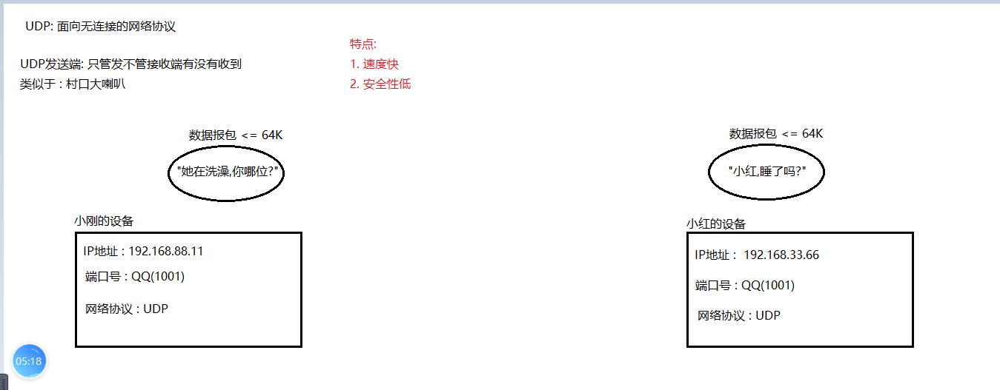
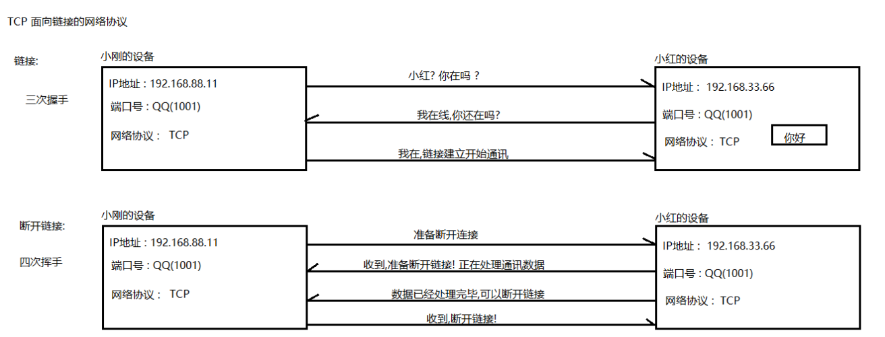

### Day_22随堂笔记

#### 网络编程

```java
PC与PC之间的数据交换!!    
```

#### 网络编程的三要素

```java
收件人地址: 湖北省.武汉市.江夏区.茅店山中路.东湖网谷.6号楼.4楼尚硅谷
收件人姓名和电话 : 谈斌
快递公司 : 顺丰,邮政...    
----------------------
IP地址: IP地址可以找到在网络环境下对方PC的位置
端口号: 确定通讯的软件
网络协议: TCP/UDP
```

#### IP地址

```java
IP地址: IP地址可以找到在网络环境下设备的位置
    
IP地址有2种表现形式 :
	IPv4: 点分十进制法 --> 192.168.0.1 
        每个分位占用 : 1个字节  --> 总共占用 4个字节 
        每个分位的数值 : 0-255    
	IPv6: 冒分十六进制法 --> fe80:0000:0000:0000:a9ac:af45:2750:e7e3
        
如何查询当前设备的IP地址: 
	CMD : ipconfig -> 192.168.14.57
    Linux : ifconfig -all    
        
如何查看当前设备的网络状态: 
	CMD : ping IP地址(网关) --> 网关 : 192.168.号段.1  (发送4次数据)
    Linux : ping IP地址(网关)  (一直发)
        
重要的IP:
	 网关 : 192.168.号段.1
     广播地址 : 192.168.号段.255
     DNS服务器 :  www.baidu.com -> 服务器代号   --> DNS的作用是用来解析 网址  
```

#### 端口号

```java
端口号: 确定通讯的软件 (通讯软件在设备中的代号)
    
端口号注意事项:
	1. 范围: 0-65535
    2. 在选用端口号的时候: 不能被占用
    3. 不要使用 10000 以下的端口号  (MySQL: 3306 Tomcat: 8080)
    4. 一个线程可能会占用一个端口号            
```

#### InetAddress

```java
InetAddress : IP地址的类
	通过这个类可以获取指定主机的IP地址对象   
    有了IP地址对象可以获取IP地址对象中封装的IP地址和主机名
    
静态成员方法:
	*static InetAddress getByName(String host)  : 传入主机名,IP地址获取该主机的IP地址对象
    static InetAddress[] getAllByName(String host) : 传入主机名时若网段中有重复的主机名,会把该主机的IP地址都获取存储到 InetAddress[]
    *static InetAddress getLocalHost() : 快速获取当前主机的IP地址对象   
        
成员方法:
	 String getHostName()  : 获取主机名
     String getHostAddress()  : 获取主机IP地址    
```

#### UDP网络协议

```java
UDP: 面向无连接的网络协议
    
DatagramSocket : 此类表示用来发送和接收数据报包的套接字。    
```



##### 发送端代码

```java
UDP发送端的类 : DatagramSocket
    
构造方法:
	DatagramSocket() 

成员方法:
	void send(DatagramPacket p) : 发送数据报包 
        
DatagramPacket -> 数据报包的类        
	构造方法:
		DatagramPacket(byte[] buf, int offset, int length, InetAddress address, int port) 
            byte[] buf, int offset, int length: 你要发送的数据
            InetAddress address : 收件人的IP地址对象
            int port: 收件人的名称和电话 -> 端口号    
```

##### 接收端代码

```java
UDP接收端的类 : DatagramSocket
    
构造方法:
	DatagramSocket(int port) 
        
成员方法:
	 void receive(DatagramPacket p) 

DatagramPacket -> 数据报包的类  
     接收端数据报包的构造方法:
		DatagramPacket(byte[] buf, int offset, int length) 
```

#### TCP网络协议

```java
TCP网络协议: 面向链接的网络协议
    
   链接 : 三次握手
   断开链接 : 四次挥手    
       
B/S : Browers/Server
C/S : Client/Server
    
客户端: Socket
服务器: ServerSocket
    
TCP网络协议 通过通讯流进行数据的传递    
```



##### 客户端代码

```java
客户端: Socket

构造方法:
	Socket(String host, int port) 
        String host: 服务器的IP地址;
		int port:服务器中通讯软件的端口号;
    Socket(InetAddress address, int port)  

        
发送数据: 先获取输出流对象
	 OutputStream getOutputStream()  
```

##### 服务器代码

```java
服务器: ServerSocket
   
构造方法:    
	ServerSocket(int port) : 确认服务器的端口号即可
        
接受数据:
	Socket accept() : 侦听并接受到客户端套接字的连接。  -> 阻塞
        
通过Socket对象获取输入流对象,读取客户端发来的信息; 
	Socket类中: InputStream getInputStream()
```

