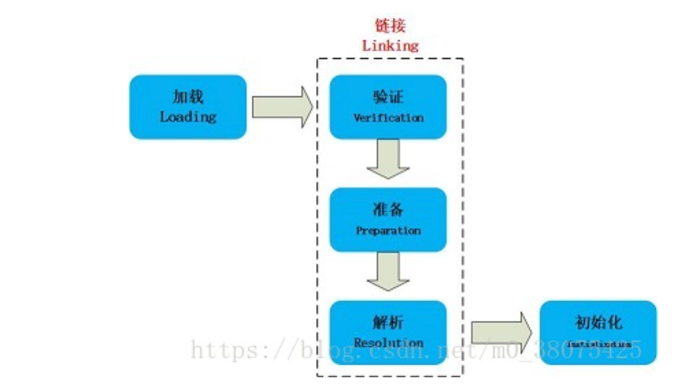
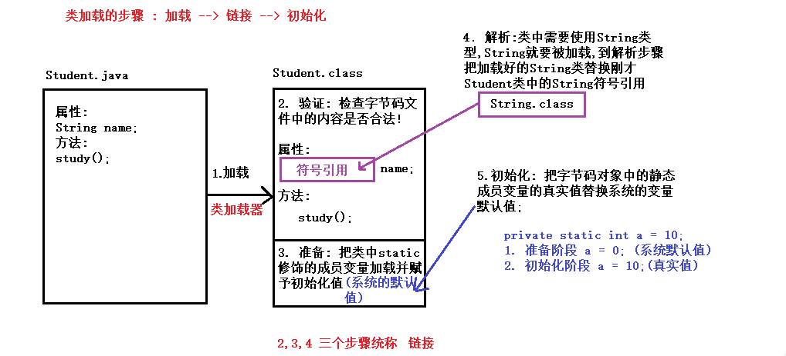
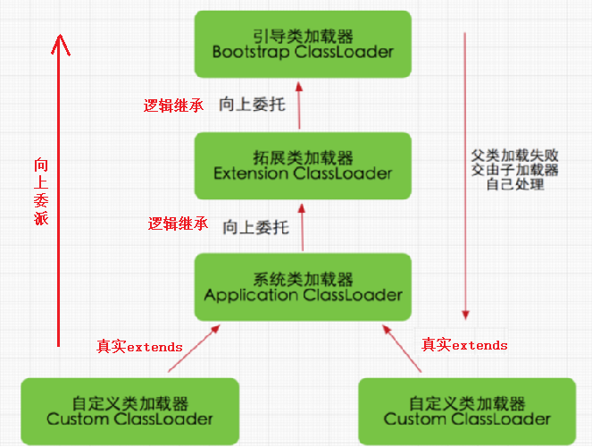
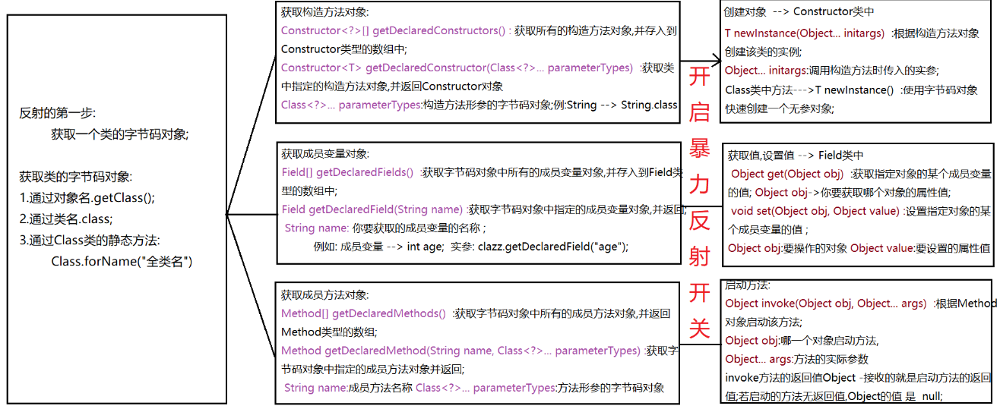

### Day_23随堂笔记

#### 类加载的过程

```java
	当程序主动使用某个类时，如果该类还未被加载到内存中，则JVM会通过加载、连接、初始化3个步骤来对该类进行初始化。如果没有意外，JVM将会连续完成3个步骤，所以有时也把这个3个步骤统称为类加载或类初始化。
```



##### 加载    

​    加载指的是将类的class文件读入到内存，并为之创建一个java.lang.Class对象(字节码对象)，也就是说，当程序中使用任何类时，系统都会为之建立一个java.lang.Class对象(一个类只可能有一个字节码对象)。

```java
现在 : 对象.getClass() == 类名.class --> 前面的对象是否属于后面的类型
    
以前的写法: 对象 instanceof 类    
```

> 类的加载由类加载器(ClassLoader)完成，类加载器通常由JVM提供，这些类加载器也是前面所有程序运行的基础，JVM提供的这些类加载器通常被称为系统类加载器。除此之外，开发者可以通过继承ClassLoader基类(类加载器的基类)来创建自己的类加载器。

通过使用不同的类加载器，可以从不同来源加载类的二进制数据(字节码文件)，通常有如下几种来源。

1. 从本地文件系统加载class文件，这是前面绝大部分示例程序的类加载方式。

2. 从JAR包加载class文件，这种方式也是很常见的，JDBC编程时用到的数据库驱动类就放在JAR文件中，JVM可以从JAR文件中直接加载该class文件。

3. 通过网络加载class文件。
   把一个Java源文件动态编译，并执行加载。

   > 类加载器通常无须等到“首次使用”该类时才加载该类，Java虚拟机规范允许系统预先加载某些类。

##### 链接

​    当类被加载之后，系统为之生成一个对应的Class对象，接着将会进入连接阶段，连接阶段负责把类的二进制数据(字节码对象)合并到JRE中。类连接又可分为如下3个阶段。

**1)验证**：验证阶段用于检验被加载的类是否有正确的内部结构，并和其他类协调一致。Java是相对C++语言是安全的语言，例如Java有C++不具有的数组越界的检查。这本身就是对自身安全的一种保护。验证阶段是Java非常重要的一个阶段，它会直接的保证应用是否会被恶意入侵的一道重要的防线，越是严谨的验证机制越安全。验证的目的在于确保**Class文件的字节流中包含信息符合当前虚拟机要求**，不会危害虚拟机自身安全。其主要包括四种验证，文件格式验证，元数据验证，字节码验证，符号引用验证。

四种验证做进一步说明：

文件格式验证：主要验证字节流是否符合Class文件格式规范，并且能被当前的虚拟机加载处理。例如：主，次版本号是否在当前虚拟机处理的范围之内。常量池中是否有不被支持的常量类型。指向常量的中的索引值是否存在不存在的常量或不符合类型的常量。

元数据验证：对字节码描述的信息进行语义的分析，分析是否符合java的语言语法的规范。

字节码验证：最重要的验证环节，分析数据流和控制，确定语义是合法的，符合逻辑的。主要的针对元数据验证后对方法体的验证。保证类方法在运行时不会有危害出现。

符号引用验证：主要是针对符号引用转换为直接引用的时候，是会延伸到第三解析阶段，主要去确定访问类型等涉及到引用的情况，主要是要保证引用一定会被访问到，不会出现类等无法访问的问题。

**2)准备**：类准备阶段负责为类的静态变量分配内存，并设置默认初始值(系统默认值)。

**3)解析：**将类的二进制数据中的符号引用替换成直接引用。说明一下：符号引用：符号引用是以一组符号来描述所引用的目标，符号可以是任何的字面形式的字面量，只要不会出现冲突能够定位到就行。布局和内存无关。直接引用：是指向目标的指针，偏移量或者能够直接定位的句柄。该引用是和内存中的布局有关的，并且一定加载进来的。

##### 初始化

​    初始化是为类的静态变量赋予正确的初始值(程序员给静态成员变量赋的值)，准备阶段和初始化阶段看似有点矛盾，其实是不矛盾的，如果类中有语句：private static int a = 10，它的执行过程是这样的，首先字节码文件被加载到内存后，先进行链接的验证这一步骤，验证通过后准备阶段，给a分配内存，因为变量a是static的，所以此时a等于int类型的默认初始值0，即a=0,然后到解析，到初始化这一步骤时，才把a的真正的值10赋给a,此时a=10。

```java
总结:
	加载: 生成类的字节码对象
    链接:
		验证: 校验字节码对象中的成员是否符合Java类规范
        准备: 加载类中静态成员并赋予系统默认值
        解析: 把类中的符号引用替换成直接引用
    初始化: 把类中静态成员的默认值替换成真实值;
```



#### 类何时加载

1. 创建类的实例，也就是new一个对象
2. 访问某个类或接口的静态变量，或者对该静态变量赋值
3. 调用类的静态方法
4. 反射（Class.forName("全类名")）
5. 初始化一个类的子类（会首先初始化子类的父类）
6. JVM启动时标明的启动类，即文件名和类名相同的那个类 

> 类何时被加载: 类第一次被使用的时候加载

#### 类加载器

```java
类加载器负责加载所有的类，其为所有被载入内存中的类生成一个java.lang.Class实例对象。一旦一个类被加载如JVM中，同一个类就不会被再次载入了。
```

1. **根类加载器（bootstrap classloader）**:它用来加载 Java 的核心类，是用原生代码来实现的，并不继承自 java.lang.ClassLoader（负责加载$JAVA_HOME中jre/lib/rt.jar里所有的class，由C++实现，不是ClassLoader子类）。由于引导类加载器涉及到虚拟机本地实现细节，开发者无法直接获取到启动类加载器的引用，所以不允许直接通过引用进行操作。
2. **扩展类加载器（extensions classloader）**：它负责加载JRE的扩展目录，lib/ext或者由java.ext.dirs系统属性指定的目录中的JAR包的类。由Java语言实现，父类加载器为null。
3. **系统类加载器（system class loader）**：被称为系统（也称为应用）类加载器，它负责在JVM启动时加载来自Java命令的-classpath选项、java.class.path系统属性，或者CLASSPATH换将变量所指定的JAR包和类路径。程序可以通过ClassLoader的静态方法getSystemClassLoader()来获取系统类加载器。如果没有特别指定，则用户自定义的类加载器都以此类加载器作为父加载器。
4. **自定义加载器(custom class loader)**: 我要指定一些类由某个类加载器加载 那么就可以自定义类记载器

#### 类加载器加载Class的8个步骤

```java
1. 检测此Class是否载入过，即在缓冲区中是否有此Class，如果有直接进入第8步，否则进入第2步。
2. 如果没有父类加载器，则要么Parent是根类加载器，要么本身就是根类加载器，则跳到第4步，如果父类加载器存在，则进入第3步。
3. 请求使用父类加载器去载入目标类，如果载入成功则跳至第8步，否则接着执行第5步。
4. 请求使用根类加载器去载入目标类，如果载入成功则跳至第8步，否则跳至第7步。
5. 当前类加载器尝试寻找Class文件，如果找到则执行第6步，如果找不到则执行第7步。
6. 从文件中载入Class，成功后跳至第8步。
7. 抛出ClassNotFountException异常。
8. 返回对应的java.lang.Class对象。
```

#### 类加载机制-双亲委派模型



#### 类加载器使用场景(重要)

```java
类加载器的功能: 快速获取当前类所在模块src文件夹根目录下的文件
    
ClassLoader: 类加载器的类(类加载器的基类)   
    static ClassLoader getSystemClassLoader() : 获取到系统类加载器对象
    InputStream getResourceAsStream(String fileName): 快速的获取传入文件路径指向的文件
    	String fileName: 文件路径 --> 相对路径写: 相对路径的起点是src文件夹
            
static InputStream getSystemResourceAsStream(String name):直接获取输入流对象 -> 推荐方法       
```

#### 反射

```java
反射 : reflect
  
反射到底在干嘛:        
	以前写代码 : 面向需求
	反射写代码 : 面向写需求的人    
        
为什么叫反射?
    正射: 对象调方法 --> student.study();
	反射: 反射是基于正射
        1. 先获取方法对象  --> Method类的对象(study()方法对象)
        2. 方法对象自己启动,传入调用方法的对象
        	study.invoke(student);

Class : 类的类 -->  获取类的成员
Constructer : 构造方法的类  --> 创建对象
Field : 成员变量的类 --> 获取值,赋值
Method :  成员方法的类  --> 调用
```

#### 反射的使用

##### 反射第一步: 获取类对象

```java
Class : 类的类 -->  获取类的成员
    
1. Object 类中: Class getClass() --> 对象.getClass()
2. 类型属性 class -> 类名.class,基本数据类型名称.class,数组类型.class
    Student.class , int.class , String[].class
3. Class 类中 : static Class forName(类的全类名)        
```

##### 反射第二步:获取类成员

###### 构造方法

```java
    Class类中:
        Constructor<?>[] getConstructors() : 获取类中所有的构造方法对象  -> 能获取public修饰的
        Constructor<T> getConstructor(Class<?>... parameterTypes)     -> 能获取public修饰的

        Constructor<?>[] getDeclaredConstructors()  :获取类中所有的构造方法对象
        Constructor<T> getDeclaredConstructor(Class<?>... parameterTypes): 获取类中指定的构造方法的对象
            Class<?>... parameterTypes : 构造方法的形参的类字节码对象
```

###### 成员变量

```java
   Class类:
        Field[] getFields()
        Field getField(String name)

        Field[] getDeclaredFields() : 获取所有的成员变量对象
        Field getDeclaredField(String name) : 获取指定的成员变量对象
            String name: 变量的名称
```

###### 成员方法

```java
    Class类:
        Method[] getMethods()
        Method getMethod(String name, Class<?>... parameterTypes)

        Method[] getDeclaredMethods() : 获取类中所有的成员方法对象
        Method getDeclaredMethod(String name, Class<?>... parameterTypes): 获取类中指定的成员方法对象
            String name: 你要获取的成员方法的名字
            Class<?>... parameterTypes : 方法形参列表的类型字节码对象
```

##### 反射第三步:使用类成员

###### 使用构造方法的对象 -> 创建类的对象

```java
    Constructor类中:
        T newInstance(Object... initargs): 调用相应的构造方法(创建对象)
            Object... initargs : 启动方法的具体实参值

    无权限的情况下都得开启暴力反射开关
        Constructor,Field,Method类中开启暴力反射开关 :  void setAccessible(传入true)

    快速获得本类的一个无参对象: 字节码对象所表示的类中必须有无参构造!!
        Class类中:
            T newInstance():
```

###### 使用成员变量的对象->设置和获取值

```java
   Field类:
         Object get(Object obj) : 获取值
            返回值类型: Object -> 获取的该属性的值
            Object obj : 代表要获取哪一个对象的该属性值

         void set(Object obj, Object value) : 设置值
```

###### 使用成员方法的对象->启动方法

```java
     Method类:
         Object invoke(Object obj, Object... args)  : 方法对象启动方法的方法
            返回值Object : 接受方法的返回值结果的(当invoke启动的void方法,那么invoke方法的返回值是null)
            Object obj : 谁(哪个对象)启动这个方法
            Object... args : 实参
```

#### 反射总结图



#### 单元测试

```java
测试 :  黑盒和白盒
    
单元测试 : 白盒测试中的一种
```

##### 单元测试的使用步骤

```java
1. 导入jar包 
    a. 在模块的根目录创建一个lib/libs文件夹
    b. 把jar包复制到该文件夹下
    c. 对着需要注入的jar包右键,选择 add as library..
 
2. 创建测试包 (一般命名为test)
3. 创建测试类 (测试类不要叫Test)
4. 创建单元测试的方法:
	a. 命名 -> testXxx
    b. 形参 -> 测试方法不允许有形参
    c. 返回值类型 -> 测试方法不允许有返回值类型 
5. 单独执行单元测试方法
      看灯 : 红-> 不好,绿-> 好
```

##### 断言操作

```java
    断言操作: 实际值,预期值

    Assert.assertEquals(预期值,实际值)
```

