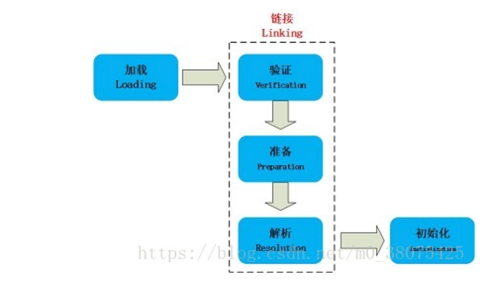
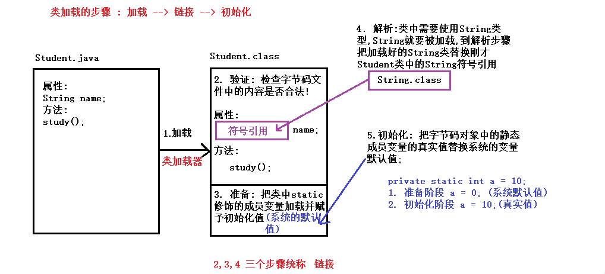
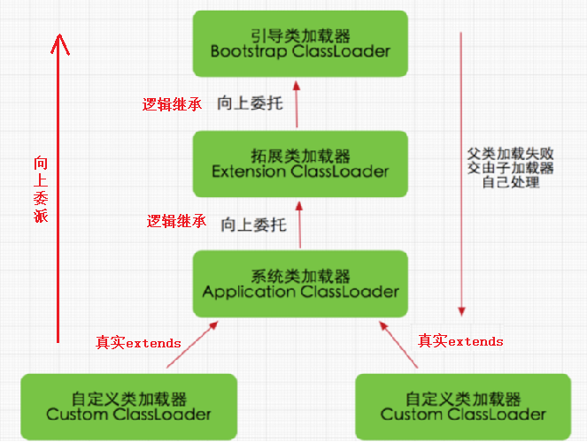

### Day_23随堂笔记

#### 类加载的过程

```java
	当程序主动使用某个类时，如果该类还未被加载到内存中，则JVM会通过加载、连接、初始化3个步骤来对该类进行初始化。如果没有意外，JVM将会连续完成3个步骤，所以有时也把这个3个步骤统称为类加载或类初始化。
```



##### 加载    

​    加载指的是将类的class文件读入到内存，并为之创建一个java.lang.Class对象(字节码对象)，也就是说，当程序中使用任何类时，系统都会为之建立一个java.lang.Class对象(一个类只可能有一个字节码对象)。

```java
对象.getClass() == 类名.class --> 前面的对象是否属于后面的类型
```

> 类的加载由类加载器(ClassLoader)完成，类加载器通常由JVM提供，这些类加载器也是前面所有程序运行的基础，JVM提供的这些类加载器通常被称为系统类加载器。除此之外，开发者可以通过继承ClassLoader基类(类加载器的基类)来创建自己的类加载器。

通过使用不同的类加载器，可以从不同来源加载类的二进制数据(字节码文件)，通常有如下几种来源。

1. 从本地文件系统加载class文件，这是前面绝大部分示例程序的类加载方式。

2. 从JAR包加载class文件，这种方式也是很常见的，JDBC编程时用到的数据库驱动类就放在JAR文件中，JVM可以从JAR文件中直接加载该class文件。

3. 通过网络加载class文件。
   把一个Java源文件动态编译，并执行加载。

   > 类加载器通常无须等到“首次使用”该类时才加载该类，Java虚拟机规范允许系统预先加载某些类。

##### 链接

​    当类被加载之后，系统为之生成一个对应的Class对象，接着将会进入连接阶段，连接阶段负责把类的二进制数据(字节码对象)合并到JRE中。类连接又可分为如下3个阶段。

**1)验证**：验证阶段用于检验被加载的类是否有正确的内部结构，并和其他类协调一致。Java是相对C++语言是安全的语言，例如Java有C++不具有的数组越界的检查。这本身就是对自身安全的一种保护。验证阶段是Java非常重要的一个阶段，它会直接的保证应用是否会被恶意入侵的一道重要的防线，越是严谨的验证机制越安全。验证的目的在于确保**Class文件的字节流中包含信息符合当前虚拟机要求**，不会危害虚拟机自身安全。其主要包括四种验证，文件格式验证，元数据验证，字节码验证，符号引用验证。

四种验证做进一步说明：

文件格式验证：主要验证字节流是否符合Class文件格式规范，并且能被当前的虚拟机加载处理。例如：主，次版本号是否在当前虚拟机处理的范围之内。常量池中是否有不被支持的常量类型。指向常量的中的索引值是否存在不存在的常量或不符合类型的常量。

元数据验证：对字节码描述的信息进行语义的分析，分析是否符合java的语言语法的规范。

字节码验证：最重要的验证环节，分析数据流和控制，确定语义是合法的，符合逻辑的。主要的针对元数据验证后对方法体的验证。保证类方法在运行时不会有危害出现。

符号引用验证：主要是针对符号引用转换为直接引用的时候，是会延伸到第三解析阶段，主要去确定访问类型等涉及到引用的情况，主要是要保证引用一定会被访问到，不会出现类等无法访问的问题。

**2)准备**：类准备阶段负责为类的静态变量分配内存，并设置默认初始值(系统默认值)。

**3)解析：**将类的二进制数据中的符号引用替换成直接引用。说明一下：符号引用：符号引用是以一组符号来描述所引用的目标，符号可以是任何的字面形式的字面量，只要不会出现冲突能够定位到就行。布局和内存无关。直接引用：是指向目标的指针，偏移量或者能够直接定位的句柄。该引用是和内存中的布局有关的，并且一定加载进来的。

##### 初始化

​    初始化是为类的静态变量赋予正确的初始值(程序员给静态成员变量赋的值)，准备阶段和初始化阶段看似有点矛盾，其实是不矛盾的，如果类中有语句：private static int a = 10，它的执行过程是这样的，首先字节码文件被加载到内存后，先进行链接的验证这一步骤，验证通过后准备阶段，给a分配内存，因为变量a是static的，所以此时a等于int类型的默认初始值0，即a=0,然后到解析，到初始化这一步骤时，才把a的真正的值10赋给a,此时a=10。

```java
总结:
	加载: 生成类的字节码对象
    链接:
		验证: 校验字节码对象中的成员是否符合Java类规范
        准备: 加载类中静态成员并赋予系统默认值
        解析: 把类中的符号引用替换成直接引用
    初始化: 把类中静态成员的默认值替换成真实值;
```



#### 类何时加载

1. 创建类的实例，也就是new一个对象
2. 访问某个类或接口的静态变量，或者对该静态变量赋值
3. 调用类的静态方法
4. 反射（Class.forName("全类名")）
5. 初始化一个类的子类（会首先初始化子类的父类）
6. JVM启动时标明的启动类，即文件名和类名相同的那个类 

> 类何时被加载: 类第一次被使用的时候加载

#### 类加载器

```java
类加载器负责加载所有的类，其为所有被载入内存中的类生成一个java.lang.Class实例对象。一旦一个类被加载如JVM中，同一个类就不会被再次载入了。
```

1. **根类加载器（bootstrap classloader）**:它用来加载 Java 的核心类，是用原生代码来实现的，并不继承自 java.lang.ClassLoader（负责加载$JAVA_HOME中jre/lib/rt.jar里所有的class，由C++实现，不是ClassLoader子类）。由于引导类加载器涉及到虚拟机本地实现细节，开发者无法直接获取到启动类加载器的引用，所以不允许直接通过引用进行操作。
2. **扩展类加载器（extensions classloader）**：它负责加载JRE的扩展目录，lib/ext或者由java.ext.dirs系统属性指定的目录中的JAR包的类。由Java语言实现，父类加载器为null。
3. **系统类加载器（system class loader）**：被称为系统（也称为应用）类加载器，它负责在JVM启动时加载来自Java命令的-classpath选项、java.class.path系统属性，或者CLASSPATH换将变量所指定的JAR包和类路径。程序可以通过ClassLoader的静态方法getSystemClassLoader()来获取系统类加载器。如果没有特别指定，则用户自定义的类加载器都以此类加载器作为父加载器。
4. **自定义加载器(custom class loader)**: 我要指定一些类由某个类加载器加载 那么就可以自定义类记载器

#### 类加载器加载Class的8个步骤

```java
1. 检测此Class是否载入过，即在缓冲区中是否有此Class，如果有直接进入第8步，否则进入第2步。
2. 如果没有父类加载器，则要么Parent是根类加载器，要么本身就是根类加载器，则跳到第4步，如果父类加载器存在，则进入第3步。
3. 请求使用父类加载器去载入目标类，如果载入成功则跳至第8步，否则接着执行第5步。
4. 请求使用根类加载器去载入目标类，如果载入成功则跳至第8步，否则跳至第7步。
5. 当前类加载器尝试寻找Class文件，如果找到则执行第6步，如果找不到则执行第7步。
6. 从文件中载入Class，成功后跳至第8步。
7. 抛出ClassNotFountException异常。
8. 返回对应的java.lang.Class对象。
```

#### 类加载机制-双亲委派模型



#### 类加载器使用场景(重要)

```java
类加载器的功能: 快速获取当前类所在模块src文件夹下的文件
    
ClassLoader: 类加载器的类(类加载器的基类)   
    static ClassLoader getSystemClassLoader() : 获取到系统类加载器对象
    InputStream getResourceAsStream(String fileName): 快速的获取传入文件路径指向的文件
    	String fileName: 文件路径 --> 相对路径写: 相对路径的起点是src文件夹
            
static InputStream getSystemResourceAsStream(String name):直接获取输入流对象 -> 推荐方法       
```

#### 反射

```java
反射: reflect 
    
反射到底为了去做什么? 思想;
    非反射代码(正射) : 面向需求解决需求
    反射代码 : 面向解决需求的人,帮别人做功能
        
正射和反射代码编写上有什么区别?
   //例如: Student.java  成员方法 study()
   正射: 
		1. 创建学生对象
        2. 学生对象.study(); 我学习
   反射: (反射更灵活,这段代码写完可以实现 任何类的任何方法的调用)
		1. 让需要调用方法的人告诉我要创建哪个类的对象 (对外: 让别人提供信息);
        2. 根据别人给的 全类名 ,获取那个类的字节码对象 (写反射代码的人需要做的)  
        3. 根据类的字节码对象获取类中的方法对象 (study方法对象) 
        4. 方法对象启动,传入需要调用的对象
           //例如: study方法对象.invoke(学生对象)  
            		学习(我)
            
Class : 类
Field : 成员变量/成员常量
Method : 方法
Constructor : 构造方法    
```

#### 反射第一步: 获取类的字节码对象

```java
第一种: 类名.class 
    Class clazz = 类名.class;
第二种: 对象名.getClass()
    Class clazz = 对象名.getClass();
第三种: Class.forName("全类名")
    Class clazz = Class.forName("全类名");
		//全类名 : 包名.类名
```

#### 反射第二步: 获取类中的成员

##### 获取构造方法

```java
Class类中:
        Constructor<?>[] getConstructors() : 获取类中所有的构造方法对象 -> 获取public修饰的
        Constructor<T> getConstructor(Class<?>... parameterTypes): 获取类中指定的某个构造方法对象 -> 获取public修饰的

        //只是拿到构造方法对象,;类的对象要产生,还要求此构造方法执行!
        Constructor<?>[] getDeclaredConstructors() :获取类中所有的构造方法对象
        Constructor<T> getDeclaredConstructor(Class<?>... parameterTypes):获取类中指定的某个构造方法对象
```

##### 获取成员变量

```java
    利用反射获取类中的成员变量:

    Class类中:
         Field[] getFields()
         Field getField(String name)

         Field[] getDeclaredFields()  : 获取一个类中所有的成员变量对象,返回Field对象数组
         Field getDeclaredField(String name) : 获取一个类中指定的成员变量对象
            String name : 成员变量的名称
```

##### 获取成员方法

```java
    获取类中的成员方法对象:
    Class类中:
        Method[] getMethods()
        Method getMethod(String name, Class<?>... parameterTypes)

        Method[] getDeclaredMethods()  :获取所有的成员方法对象
        Method getDeclaredMethod(String name, Class<?>... parameterTypes)  :获取指定的成员方法对象
            String name: 方法名
            Class<?>... parameterTypes : 方法形参类型的字节码对象
```

#### 反射第三步:使用类中的成员

##### 构造方法: 创建对象

```java
    启动构造方法 就是创建此类的对象

    Class类中: 获取构造方法对象
        Constructor<T> getDeclaredConstructor(Class<?>... parameterTypes):获取类中指定的某个构造方法对象

    Constructor类中: 启动构造方法对象-> 调用构造方法
        T newInstance(Object... initargs):
            initargs : 启动的方法的实际参数
            Object : 因为不知道你方法的形参是什么类型
            ... : 也不知道你方法有几个形参

     来自于Constructor,Field,Method的父类的方法 ->暴力反射开关:
        void setAccessible(boolean flag)  : 默认是关闭
        stem.out.println("constructor4 = " + constructor4);
                若你非要跨越权限修饰符的约束,请打开暴力反射开关

     快速创建本类无参构造的方法:
     Class类中:
         T newInstance():启动类中的无参构造 //必须保证类中的无参构造public修饰且存在!!
```

##### 成员变量: 赋值/取值

```java
 获取到成员变量对象就可以对该成员变量对象赋值和取值
     Field类中:
         Object get(Object obj): 取值
            Object obj:取哪个对象的这个属性值
         void set(Object obj, Object value) :赋值
            Object obj:取哪个对象的这个属性值
            Object value :要把这个变量设置为什么值
            
      正射: stu.getName()   
      反射: name.get(stu) 
```

##### 成员方法: 启动方法

```java
  有了方法对象,启动方法
     Method类中的方法
          Object invoke(Object obj, Object... args)  :
              Object obj: 哪个对象调方法
              Object... args:  启动方法的实参
              invoke返回值Object : 方法对象启动后的结果(被启动的方法的返回值)
                    被启动的方法返回值是void,invoke方法的返回值是 null
                    被启动的方法返回值是具体的数据类型,invoke方法的返回值就是这个值

        正射: dog.eat(实参);
        反射: eat.invoke(dog,实参);
```

#### 单元测试

```java
单元测试 属于白盒测试中的一种;

//单元测试中一个测试方法可以独立启动

需要使用这个功能必须,必须导入外部jar包. (导入外部jar包的动作请看录屏)
    
单元测试的步骤
    1. 创建一个测试类 Test.java
    2. 在测试类中编写测试方法:
		方法名:xxxxTest -> xxx:测试的功能
        形参: 必须空参
        返回值类型: 必须 void 
    3. 在测试方法的上方增加注解 @Test
    4. 测试方法就可以单独执行了
            
    单元测试看红灯还是绿灯

    绿灯 : 测试通过
    红灯 : 测试不通过

    断言操作:
        Assert类中:
        public static void assertEquals(long expected, long actual)
            expected: 预期值
            actual: 真实值            
```

#### 枚举的概述

枚举是 Java 中一种特殊的类(类型)，它可以定义固定数量的枚举实例(此类的对象)，例如: 性别、交通信号灯、季节等等

> 枚举类的对象不是new出来的, 而是一一罗列出来的. -> 数量有限

**类的对象只有有限个，确定的**

- 星期：Monday(星期一)、... 、Sunday(星期天)
- 性别：Man(男)、Woman(女)
- 季节：Spring (春天)、Summer(夏天)、Autumn(秋天)、Winter(冬天)
- 支付方式：Cash(现金)、WeChatPay(微信)、Alipay(支付宝)、BankCart(银行卡)、CreditCart(信用卡)
- 就职状态：Busy、Free、Vocation、Dimission
- 订单状态：Nonpayment(未付款)、Paid(已付款)、FulFilled(已配货)、Delivered(已发货)、Return(退货)、Checked(已确认)

#### 为什么要使用枚举

假设我们要定义一个人类，人类中包含姓名和性别。通常会将性别定义成字符串类型，效果如下：

```java
public class Person {
    private String name;
    private String sex;

    public Person() {
    }

    public Person(String name, String sex) {
        this.name = name;
        if(sex.equals("男") || sex.equals("女")){
              this.sex = sex;
        }
    }
	
    // 省略get/set/toString方法
    
}
```

```java
public class Demo01 {
    public static void main(String[] args) {
        Person p1 = new Person("张三", "男");
        Person p2 = new Person("张三", "abc"); // 因为性别是字符串,所以我们可以传入任意字符串，但事实上性别只能是‘男’或者‘女’
    }
}
```

不使用枚举存在的问题：可以给性别传入任意的字符串，导致性别是非法的数据，不安全。

问题解决:

```java
//定义一个枚举类型
public enum Gender{
    //Sex类中只有2个对象
    MALE,//男
    FEMALE;//女
}
public class Person {
    private String name;
    private Gender gender;

    public Person() {
    }

    public Person(String name, Gender gender) {
        this.name = name;
        this.gender = gender;
    }
	
    // 省略get/set/toString方法
}

public class Demo01 {
    public static void main(String[] args) {
        Person p1 = new Person("张三", Gender.MALE);
        Person p2 = new Person("张三", Gender.FAMALE); 
    }
}
```

#### 枚举类的使用

 枚举的实现方式

- JDK1.5之前需要自定义普通类

- JDK1.5及以后新增的enum关键字用于定义枚举类 -> 枚举从JDK5版本有的

需求： 定义一个方法，方法的参数传递“一年四季中的某一个季节”，根据不同的季节，打印对不同季节的描述 

#### 定义枚举类的做法

```java
枚举类的定义:
        public enum 类名{
            //枚举项的名称全部大写 : 规范
            //枚举项都是此类的对象
            枚举项1,
            枚举项2,
            ...
            枚举项n;
        }
    枚举对象的创建:
        枚举类类名.枚举项;
```

```java
 public enum SeasonEnum {
     //这四个枚举项是SeasonEnum枚举类的对象,只有四个!!
    SPRING,
    SUMMER,
    AUTUMN,
    WINTER;
}

```

```java
 //通过枚举类 可以这样写
    public static void printSeasonByEnum(SeasonEnum seasonEnum){
        switch (seasonEnum){
            case SPRING:
                System.out.println("春暖花开");
                break;
            case SUMMER:
                System.out.println("夏日炎炎");
                break;
            case AUTUMN:
                System.out.println("硕果累累");
                break;
            case WINTER:
                System.out.println("雪花飘飘");
                break;

        }
    }
```

```java
 public static void main(String[] args) {        //使用枚举类，作为方法的参数        printSeasonByEnum(SeasonEnum.AUTUMN); }
```

##### 案例应用

1. 定义枚举：MALE表示男，FEMALE表示女

```java
enum Sex {
    MALE, FEMALE; // 男，女
}
```

1. Perosn中的性别有String类型改为Sex枚举类型

```java
public class Person {
    private String name;
    private Sex sex;

    public Person() {
    }

    public Person(String name, Sex sex) {
        this.name = name;
        this.sex = sex;
    }
    // 省略get/set/toString方法
}
```

1. 使用时只能传入枚举中的固定值

```java
public class Demo02 {
    public static void main(String[] args) {
        Person p1 = new Person("张三", Sex.MALE);
        Person p2 = new Person("张三", Sex.FEMALE);
        Person p3 = new Person("张三", "abc");//这样写就不可以，只能是固定的枚举类型的对象
    }
}
```

#### 枚举中添加成员变量和成员方法和构造方法

枚举的本质是一个类，所以枚举中还可以有成员变量，成员方法等。

例如：定义一个交通信号灯，分别有红灯，绿灯，黄灯，并对每一个信号灯加以说明： 比如 红灯停，绿灯行，黄灯亮了等一等 ， 

```java
public enum Light {
    //1.枚举类必须先定义对象  （类似调用类的无参构造器对象 ）
    RED("红灯停"),GREEN("绿灯行"),YELLOW("黄灯亮了等一等");
    
    //2.在枚举中定义属性 和 方法
    String colorDesc;

    public String getColorDesc() {
        return colorDesc;
    }

    public void setColorDesc(String colorDesc) {
        this.colorDesc = colorDesc;
    }

    //3.通过构造器给不同的枚举对象传参
    private Light(String colorDesc){
        this.colorDesc = colorDesc;
    }
}
```

```java
  public static void main(String[] args) {
        System.out.println(Light.GREEN);
        //枚举对象的方法
        System.out.println(Light.GREEN.getColorDesc());
        //遍历所有的枚举对象 (values() 方法来自父类 Enum类)
        Light[] values = Light.values();
        for(Light light : values){
            System.out.println(light.name() + "---" + light.getColorDesc() );
        }

         Light light = Light.valueOf("GREEN");
         System.out.println("根据字符串返回一个枚举对象："+light);
    }
```

####  枚举类的常用方法

| 常用方法               | 解释                                 | 返回类型 |
| ---------------------- | ------------------------------------ | -------- |
| 枚举类.values()        | 返回枚举类的所有对象，是一个对象数组 | 对象数组 |
| 枚举类.valueOf(String) | 根据字符串返回对应的枚举类型         | 枚举类型 |
| 枚举对象.ordinal()     | 返回该对象在枚举类中的序号           | int      |
| 枚举对象.name()        | 返回该对象的枚举名称                 | Stirng   |

#### 注解