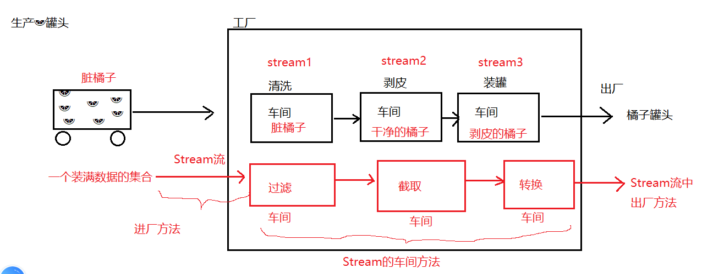
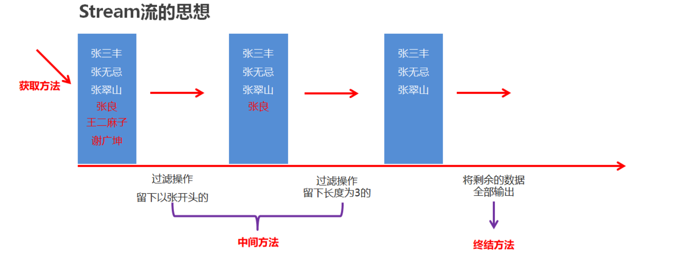

### Day_24随堂笔记

#### 枚举的概述

枚举是 Java 中一种特殊的类(类型)，它可以定义固定数量的枚举实例(此类的对象)，例如: 性别、交通信号灯、季节等等 -> enum

> 枚举类的对象不是new出来的, 而是一一罗列出来的. -> 数量有限

**类的对象只有有限个，确定的**

- 星期：Monday(星期一)、... 、Sunday(星期天)
- 性别：Man(男)、Woman(女)
- 季节：Spring (春天)、Summer(夏天)、Autumn(秋天)、Winter(冬天)
- 支付方式：Cash(现金)、WeChatPay(微信)、Alipay(支付宝)、BankCart(银行卡)、CreditCart(信用卡)
- 就职状态：Busy、Free、Vocation、Dimission
- 订单状态：Nonpayment(未付款)、Paid(已付款)、FulFilled(已配货)、Delivered(已发货)、Return(退货)、Checked(已确认)

#### 为什么要使用枚举

假设我们要定义一个人类，人类中包含姓名和性别。通常会将性别定义成字符串类型，效果如下：

```java
public class Person {
    private String name;
    private String sex;

    public Person() {
    }

    public Person(String name, String sex) {
        this.name = name;
        if(sex.equals("男") || sex.equals("女")){
              this.sex = sex;
        }
    }
	
    // 省略get/set/toString方法
    
}
```

```java
public class Demo01 {
    public static void main(String[] args) {
        Person p1 = new Person("张三", "男");
        Person p2 = new Person("张三", "abc"); // 因为性别是字符串,所以我们可以传入任意字符串，但事实上性别只能是‘男’或者‘女’
    }
}
```

不使用枚举存在的问题：可以给性别传入任意的字符串，导致性别是非法的数据，不安全。

问题解决:

```java
//定义一个枚举类型
public enum Gender{
    //Sex类中只有2个对象
    MALE,//男
    FEMALE;//女
}
public class Person {
    private String name;
    private Gender gender;

    public Person() {
    }

    public Person(String name, Gender gender) {
        this.name = name;
        this.gender = gender;
    }
	
    // 省略get/set/toString方法
}

public class Demo01 {
    public static void main(String[] args) {
        Person p1 = new Person("张三", Gender.MALE);
        Person p2 = new Person("张三", Gender.FAMALE); 
    }
}
```

#### 枚举类的使用

 枚举的实现方式

- JDK1.5之前需要自定义普通类

- JDK1.5及以后新增的enum关键字用于定义枚举类 -> 枚举从JDK5版本有的

需求： 定义一个方法，方法的参数传递“一年四季中的某一个季节”，根据不同的季节，打印对不同季节的描述 

#### 定义枚举类的做法

```java
枚举类的定义:
        public enum 类名{
            //枚举项的名称全部大写 : 规范
            //枚举项都是此类的对象
            枚举项1,
            枚举项2,
            ...
            枚举项n;
        }
    枚举对象的使用:
        枚举类类名.枚举项;
```

```java
 public enum SeasonEnum {
     //这四个枚举项是SeasonEnum枚举类的对象,只有四个!!
    SPRING,
    SUMMER,
    AUTUMN,
    WINTER;
}

```

```java
 //通过枚举类 可以这样写
    public static void printSeasonByEnum(SeasonEnum seasonEnum){
        switch (seasonEnum){
            case SPRING:
                System.out.println("春暖花开");
                break;
            case SUMMER:
                System.out.println("夏日炎炎");
                break;
            case AUTUMN:
                System.out.println("硕果累累");
                break;
            case WINTER:
                System.out.println("雪花飘飘");
                break;

        }
    }
```

```java
 public static void main(String[] args) {        //使用枚举类，作为方法的参数        printSeasonByEnum(SeasonEnum.AUTUMN); }
```

##### 案例应用

1. 定义枚举：MALE表示男，FEMALE表示女

```java
enum Sex {
    MALE, FEMALE; // 男，女
}
```

1. Perosn中的性别有String类型改为Sex枚举类型

```java
public class Person {
    private String name;
    private Sex sex;

    public Person() {
    }

    public Person(String name, Sex sex) {
        this.name = name;
        this.sex = sex;
    }
    // 省略get/set/toString方法
}
```

1. 使用时只能传入枚举中的固定值

```java
public class Demo02 {
    public static void main(String[] args) {
        Person p1 = new Person("张三", Sex.MALE);
        Person p2 = new Person("张三", Sex.FEMALE);
        Person p3 = new Person("张三", "abc");//这样写就不可以，只能是固定的枚举类型的对象
    }
}
```

#### 枚举中添加成员变量和成员方法和构造方法

枚举的本质是一个类，所以枚举中还可以有成员变量，成员方法等。

例如：定义一个交通信号灯，分别有红灯，绿灯，黄灯，并对每一个信号灯加以说明： 比如 红灯停，绿灯行，黄灯亮了等一等 ， 

```java
public enum Light {
    //1.枚举类必须先定义对象  （类似调用类的无参构造器对象 ）
    RED("红灯停"),GREEN("绿灯行"),YELLOW("黄灯亮了等一等");
    
    //2.在枚举中定义属性 和 方法
    String colorDesc;

    public String getColorDesc() {
        return colorDesc;
    }

    public void setColorDesc(String colorDesc) {
        this.colorDesc = colorDesc;
    }

    //3.通过构造器给不同的枚举对象传参
    private Light(String colorDesc){
        this.colorDesc = colorDesc;
    }
}
```

```java
  public static void main(String[] args) {
        System.out.println(Light.GREEN);
        //枚举对象的方法
        System.out.println(Light.GREEN.getColorDesc());
        //遍历所有的枚举对象 (values() 方法来自父类 Enum类)
        Light[] values = Light.values();
        for(Light light : values){
            System.out.println(light.name() + "---" + light.getColorDesc() );
        }

         Light light = Light.valueOf("GREEN");
         System.out.println("根据字符串返回一个枚举对象："+light);
    }
```

####  枚举类的常用方法

| 常用方法               | 解释                                 | 返回类型 |
| ---------------------- | ------------------------------------ | -------- |
| 枚举类.values()        | 返回枚举类的所有对象，是一个对象数组 | 对象数组 |
| 枚举类.valueOf(String) | 根据字符串返回对应的枚举类型         | 枚举类型 |
| 枚举对象.ordinal()     | 返回该对象在枚举类中的序号           | int      |
| 枚举对象.name()        | 返回该对象的枚举名称                 | Stirng   |

#### 注解

#### 什么是注解

注解英文是annotation,是一种代码级别的说明(注释: 文字对代码的解释说明;注解:代码对代码的解释说明),注解和类 接口平级关系。相当于一种标记，在程序中加入注解就等于为程序打上某种标记，以后，javac编译器、开发工具和其他程序可以通过反射来了解你的类及各种元素上有无标记，看你的程序有什么标记，就去干相应的事，标记可以加在包、类，属性、方法，方法的参数以及局部变量上定义.

#### 注解的作用

- 执行编译期的检查 例如:@Override   
- 注解开发 例如@Test

#### JDK提供的三个基本的注解

1. `@Override`:描述方法的重写.
2. `@SuppressWarnings`:压制警告. 
3. `@Deprecated`:标记过时

#### 自定义注解(重点)

##### 自定义注解语法

**语法**:  `@interface 注解名{}`

**示例**

```java
/**
 * 定义了注解
 *
 */
public @interface Annotation01 {

}
```

定义新的Annotation类型使用关键字@interface关键字；

自定义注解自动继承了java.lang.annotation.Annotation接口；

#### 注解属性

##### 注解属性的作用

​	注解属性可以让注解具备携带存储数据的功能

##### 注解属性的类型

- 基本类型


- String


- 枚举类型


- 注解类型


- Class类型  


- 以上类型的一维数组类型

> 属性的定义格式:  运行的数据类型 属性名();


**注意:**

​	一旦注解有属性了,使用注解的时候,属性必须有值  

- 示例代码

```java
/**
 *注解的属性; 格式和接口的方法很类似 
 *	1.基本类型
	2.String
	3.枚举类型
	4.注解类型
	5.Class类型  
	6.以上类型的一维数组类型  

 */
public @interface Annotation02 {
	int a();//基本类型
	
	String b();//String
	
	Color c();//枚举类型
	
	Annotation01 d();//注解类型
	
	Class e();//Class类型  
	
	String[] f();//一维数组类型 
	
}
```

##### 使用注解时给属性赋值(重要)

- 格式

  ```java
  @注解名(属性名=值,属性名2=值2)  eg:@MyAnnotation3(i = 0,s="23")
  ```

##### 属性赋值的特殊情况(重要)

- **若属性类型的一维数组的时候,当数组的值只有一个的时候可以省略{}**

  ```
  @MyAnnotation4(ss = { "a" })
  @MyAnnotation4(ss = "a")
  ```

- 注解属性可以有默认值

  ```java
  属性类型 属性名() default 默认值;
  
  //属性有默认值后,在使用注解的时候就可以选择性的给属性赋值
  ```

- **若属性名为value的时候,且只有这一个属性需要赋值的时候可以省略value**【重点】


#### 元注解

```java
注解: 用代码约束代码
元注解: 用元注解来约束注解的    
```

##### 元注解的作用

元注解是使用在自定义的注解上，为自定义的注解提供支持的

##### 常用的元注解

- `@Target`: 用于指定被修饰的注解Annotation能用在修饰哪些程序元素，默认注解可以在任何程序元素. 值为:`ElementType`的枚举值

​		`METHOD`:方法

​		`TYPE`:类 接口

​		`FIELD`:字段

​		`CONSTRUCTOR`:构造方法声明

- `@Retention`:定义该注解保留到那个代码阶段, 值为:`RetentionPolicy`类型,**默认只在源码阶段保留**

​		`SOURCE`:只在源码上保留(默认)

​		`CLASS`:在源码和字节码上保留

​		`RUNTIME`:在所有的阶段都保留 

java (源码阶段) ----编译---> .class(字节码阶段) ----加载内存--> 运行(RUNTIME)

```java
@Target(value = {ElementType.METHOD,ElementType.TYPE  })
@Retention(value = RetentionPolicy.RUNTIME)
public @interface MyAnnotation03 {
	int a();
	String b();
}
```

- @Documented: 被修饰的注解将保留在文档工具类(API)中 
- @Inherited: 标注的注解是否能被继承

#### 注解解析

注解解析目的

- 获取类、成员方法、成员变量、方法属性、构造方法等等上面的注解对象
- 获取注解对象的属性
- 判断某个类、成员变量、成员方法等等上面是否有某个注解

Method、Field、Constructer、Class都实现了AnnotationElement的接口

java.lang.reflect.AnnotatedElement

- ****** T getAnnotation(Class<T>annotationType)**:得到指定类型的注解引用。没有返回null。

- ******boolean isAnnotationPresent(Class<?extends Annotation> annotationType)**：判断指定的注解类型是否存在于某个元素上

- **Annotation[] getAnnotations()**：得到所有的注解，包含从父类继承下来的。

- **Annotation[] getDeclaredAnnotations()**：得到自己身上的注解。

```java
public @interface Annotation01(){
  
}

@Annotation01
class Demo01(){
  
  	@Annotation01
  	public void fun01(){
      
  	}
  
    public void fun02(){
      
  	}
}

//1.获得Demo01字节码对象
Class clazz =  Demo01.class;
//2. 获得Demo01上面的注解对象
Annotation01 annotation01 = clazz.getAnnotation(Annotation01.class);
//3.反射获得fun01()方法对象
Method method =  clazz.getMethod("fun01");
//4.判断fun01()方法上面是否有@Annotation01注解
boolean flag = method.isAnnotationPresent(Annotation01.class);
```

#### 函数式接口

```java
函数式接口 : 这个技术出现就是为了推广Lambda表达式!
    
因为Lambda表达式的使用前提条件是: 接口必须是函数式接口   
    
函数式接口的定义: 有且仅有一个抽象方法的接口叫函数式接口
    
我们可以使用 @FunctionalInterface 来进行函数式接口的格式约束     
    
已经学过的函数式接口:
	Runnable 接口 : 有且仅有 void run();
	Comparator<E> 接口 : 有且仅有 int compare(E o1,E o2)
    Comparable<E> 接口 : 有且仅有 int compareTo(E o)  
    FileFilter<T> 接口 : 有且仅有 boolean accept(File fileName)
    Callable<V> 接口 : 有且仅有 V call()    
        .....
```

#### 面向函数式编程思想

```java
面向函数式编程思想 : 基于面向对象思想,在面向对象思想上做的提升;
    
面向函数式编程思想是忽略对象而重视对象做什么 (面向对象玩的非常6了)    
```

#### Lambda表达式

```java
Lambda表达式 的使用前提是 被操作的必须是函数式接口;
Lambda表达式 是匿名内部类的简写格式!但是使用范围比匿名内部类要小得多!!
    
 匿名内部类 : 普通类,抽象类,所有的接口 --> 匿名内部类是对实现类/子类的简写
 Lambda表达式 : 函数式接口     
     
匿名内部类的格式:
	new 接口/父类/抽象父类(){
        @Override
        方法的声明(形参列表){
            方法体;
        }
    }
//匿名内部类是new了一个不知子类类名的子类对象的!!
//在匿名对象的后面{}中编写子类的类主体

		|
      Lambda的使用前提是必须函数式接口
        |
             
Lambda的格式: //箭头函数
        (形参列表) -> {
            方法体;
        }

标志 : ->
    
    简写Lambda:
        1. 当重写的方法体中有且仅有一句代码,省略包裹方法的大括号,return,语句结尾的分号
                (要省略都一起省)
        2. 所有重写方法的形参类型可以省,形参名可以改
        3. 当方法的形参有且仅有一个的时候还可以省略形参的小括号    
```

#### 方法引用(了解)

```java
方法引用: 它是对Lambda表达式的简写
    
方法引用能够使用的条件:
	1. 必须满足Lambda表达式的条件(必须是函数式接口)
    2. 必须要求重写方法内方法体有且仅有一句代码 --> 严苛
    3. 必须要求重写方法内方法体的这句代码: -> 严苛至极
		a. 对象调方法
        b. 类名调静态方法
        c. 创建对象
        d. 创建数组  
    4. 形参要在以上功能中使用
        
标志 : ::        
```

Lambda表达式是可以简化函数式接口的变量与形参赋值的语法。而方法引用和构造器引用是为了简化Lambda表达式的。当Lambda表达式满足一些特殊的情况时，还可以再简化：

##### 方法引用

方法引用的语法格式：

（1）对象名::实例方法	--> 对象调方法

（2）类名::静态方法 --> 类名调用静态方法

说明：

- ::称为方法引用操作符
- Lambda表达式的形参列表，全部在Lambda体中使用上了，要么是作为调用方法的对象，要么是作为方法的实参。
- 在整个Lambda体中没有额外的数据。

##### 构造器引用

（1）当Lambda表达式是创建一个对象，并且满足Lambda表达式形参，正好是给创建这个对象的构造器的实参列表。

（2）  当Lambda表达式是创建一个数组对象，并且满足Lambda表达式形参，正好是给创建这个数组对象的长度

构造器引用的语法格式：

- 类名::new

- 数组类型名::new

##### 使用说明

```java
    方法引用的前提:
        1. 必须可以用Lambda
        2. 重写方法内的方法体有且仅有一句
        3. 要求这一句必须是
            对象调方法 : 对象名::方法名;
            类名调静态方法 : 类名::静态方法名;
            创建对象/创建数组 : 类名::new / 数组类型::new

            能用匿名内部类的不一定能用Lambda,能用Lambda的不一定能用方法引用;反之都可以
```

##### 案例

```java
public class MethodDemo {
    public static void main(String[] args) {
        //匿名内部类的写法
        InterA ia1 = new InterA(){
            @Override
            public void print(String str) {
                System.out.println(str);
            }
        };

        //Lambda表达式的写法
        InterA ia2 = str -> System.out.println(str);
        // System.out-> 对象
        // println(str) -> 方法

        //方法引用的写法 :
        // 基于Lambda做的简化,要求重写方法内有且仅有一句代码且这句代码是
        //要么对象调方法
        //要么类名调用静态方法
        //要么是创建对象
        //要么是创建一个数组

        //对象调方法: 格式 对象::方法名
        InterA ia3 = System.out::println;

        //类名调用静态方法 : 格式 类名::方法名
        InterB ib = Integer::parseInt;
        
        //创建对象 : 格式 类型::new
        //InterC ic = () -> new Date();
        InterC ic = Date::new;
        
        //创建InterD的实现类对象
        //InterD id = length -> new int[length];
        //创建数组对象 格式: 数组类型::new
        InterD id = int[]::new;
    }
}

@FunctionalInterface
interface InterA{
    public abstract void print(String str);
}

@FunctionalInterface
interface InterB{
    public abstract int change(String str);
}

@FunctionalInterface
interface InterC{
    public abstract Date get();
}

@FunctionalInterface
interface InterD{
    public abstract int[] get(int length);
}
```

#### Stream流(重要)



#### 体验Stream流【理解】

- 案例需求

  按照下面的要求完成集合的创建和遍历

  - 创建一个集合，存储多个字符串元素
  - 把集合中所有以"张"开头的元素存储到一个新的集合
  - 把"张"开头的集合中的长度为3的元素存储到一个新的集合
  - 遍历上一步得到的集合

- 原始方式示例代码

  ```java
  public class StreamDemo {
      public static void main(String[] args) {
          //创建一个集合，存储多个字符串元素
          ArrayList<String> list = new ArrayList<String>();
  
          list.add("林青霞");
          list.add("张曼玉");
          list.add("王祖贤");
          list.add("柳岩");
          list.add("张敏");
          list.add("张无忌");
  
          //把集合中所有以"张"开头的元素存储到一个新的集合
          ArrayList<String> zhangList = new ArrayList<String>();
  
          for(String s : list) {
              if(s.startsWith("张")) {
                  zhangList.add(s);
              }
          }
  
  //        System.out.println(zhangList);
  
          //把"张"开头的集合中的长度为3的元素存储到一个新的集合
          ArrayList<String> threeList = new ArrayList<String>();
  
          for(String s : zhangList) {
              if(s.length() == 3) {
                  threeList.add(s);
              }
          }
  
  //        System.out.println(threeList);
  
          //遍历上一步得到的集合
          for(String s : threeList) {
              System.out.println(s);
          }
          System.out.println("--------");
  
          //Stream流来改进
  //        list.stream().filter(s -> s.startsWith("张")).filter(s -> s.length() == 3).forEach(s -> System.out.println(s));
          list.stream().filter(s -> s.startsWith("张")).filter(s -> s.length() == 3).forEach(System.out::println);
      }
  }
  ```

- 使用Stream流示例代码

  ```java
  public class StreamDemo {
      public static void main(String[] args) {
          //创建一个集合，存储多个字符串元素
          ArrayList<String> list = new ArrayList<String>();
  
          list.add("林青霞");
          list.add("张曼玉");
          list.add("王祖贤");
          list.add("柳岩");
          list.add("张敏");
          list.add("张无忌");
  
          //Stream流来改进
          list.stream().filter(s -> s.startsWith("张")).filter(s -> s.length() == 3).forEach(System.out::println);
      }
  }
  ```

- Stream流的好处

  - 直接阅读代码的字面意思即可完美展示无关逻辑方式的语义：获取流、过滤姓张、过滤长度为3、逐一打印
  - Stream流把真正的函数式编程风格引入到Java中
  - 代码简洁

#### Stream流的常见生成方式【应用】

- Stream流的思想

  

- Stream流的三类方法

  + 获取Stream流 -> **进厂方法**

    + 创建一条流水线,并把数据放到流水线上准备进行操作

    > 三种进工厂的方法: 集合,数组,一组同类型的数据

  + 中间方法 -> **车间方法**

    + 流水线上的操作
    + 一次操作完毕之后,还可以继续进行其他操作

    > 车间方法的返回值类型一定是Stream类型

  + 终结方法 -> **出厂方法**

    + 一个Stream流只能有一个终结方法
    + 是流水线上的最后一个操作

    > 出厂方法的返回值类型一定不是Stream类型

  #### 进厂方法

  - Collection体系集合

    使用默认方法stream()生成流， default Stream<E> stream()

  - Map体系集合

    把Map转成Set集合，间接的生成流

  - 数组

    通过Arrays中的静态方法stream生成流

  - 同种数据类型的多个数据

    通过Stream接口的静态方法of(T... values)生成流

    ```java
        进厂方法:
            1. 集合进厂
                单列集合: Collection<E>接口中有一个默认方法 Stream stream() -> list和set等
                双列集合: Map集合中没有stream()方法,曲线救国
                    先把Map集合转换成单列集合
                        Set<K> keySet(): 得到键集合
                        Collection<V> values(): 得到值集合
                        Set<Map.Entry<K,V>> entrySet(): 得到键值对集合
            2. 数组进厂
                Arrays工具类中叫 Stream stream(数组)
            3. 同类型的数据进厂
                Stream接口中的静态方法: Stream<T> of(T...t)
    ```

- 代码演示

  ```java
  public class StreamDemo {
      public static void main(String[] args) {
          //Collection体系的集合可以使用默认方法stream()生成流
          List<String> list = new ArrayList<String>();
          Stream<String> listStream = list.stream();
  
          Set<String> set = new HashSet<String>();
          Stream<String> setStream = set.stream();
  
          //Map体系的集合间接的生成流
          Map<String,Integer> map = new HashMap<String, Integer>();
          Stream<String> keyStream = map.keySet().stream();
          Stream<Integer> valueStream = map.values().stream();
          Stream<Map.Entry<String, Integer>> entryStream = map.entrySet().stream();
  
          //数组可以通过Arrays中的静态方法stream生成流
          String[] strArray = {"hello","world","java"};
          Stream<String> strArrayStream = Arrays.stream(strArray);
        
        	//同种数据类型的多个数据可以通过Stream接口的静态方法of(T... values)生成流
          Stream<String> strArrayStream2 = Stream.of("hello", "world", "java");
          Stream<Integer> intStream = Stream.of(10, 20, 30);
      }
  }
  ```

#### Stream流中间操作方法【应用】

- 概念

  中间操作的意思是,执行完此方法之后,Stream流依然可以继续执行其他操作

- 常见方法

  | 方法名                                          | 说明                                                       |          |
  | ----------------------------------------------- | ---------------------------------------------------------- | -------- |
  | Stream<T> filter(Predicate predicate)           | 用于对流中的数据进行过滤                                   | 过滤车间 |
  | Stream<T> limit(long maxSize)                   | 返回此流中的元素组成的流，截取前指定参数个数的数据         | 截取车间 |
  | Stream<T> skip(long n)                          | 跳过指定参数个数的数据，返回由该流的剩余元素组成的流       | 跳过车间 |
  | static <T> Stream<T> concat(Stream a, Stream b) | 合并a和b两个流为一个流                                     | 链接车间 |
  | Stream<T> distinct()                            | 返回由该流的不同元素（根据Object.equals(Object) ）组成的流 | 去重车间 |
  | Stream<R> map(Function<T,R> mapper)             | 转换车间: 把流中T类型数据转换成R类型数据                   | 转换车   |

- filter代码演示

  ```java
  public class StreamDemo01 {
      public static void main(String[] args) {
          //创建一个集合，存储多个字符串元素
          ArrayList<String> list = new ArrayList<String>();
  
          list.add("林青霞");
          list.add("张曼玉");
          list.add("王祖贤");
          list.add("柳岩");
          list.add("张敏");
          list.add("张无忌");
  
          //需求1：把list集合中以张开头的元素在控制台输出
          list.stream().filter(s -> s.startsWith("张")).forEach(System.out::println);
          System.out.println("--------");
  
          //需求2：把list集合中长度为3的元素在控制台输出
          list.stream().filter(s -> s.length() == 3).forEach(System.out::println);
          System.out.println("--------");
  
          //需求3：把list集合中以张开头的，长度为3的元素在控制台输出
          list.stream().filter(s -> s.startsWith("张")).filter(s -> s.length() == 3).forEach(System.out::println);
      }
  }
  ```

- limit&skip代码演示

  ```java
  public class StreamDemo02 {
      public static void main(String[] args) {
          //创建一个集合，存储多个字符串元素
          ArrayList<String> list = new ArrayList<String>();
  
          list.add("林青霞");
          list.add("张曼玉");
          list.add("王祖贤");
          list.add("柳岩");
          list.add("张敏");
          list.add("张无忌");
  
          //需求1：取前3个数据在控制台输出
          list.stream().limit(3).forEach(System.out::println);
          System.out.println("--------");
  
          //需求2：跳过3个元素，把剩下的元素在控制台输出
          list.stream().skip(3).forEach(System.out::println);
          System.out.println("--------");
  
          //需求3：跳过2个元素，把剩下的元素中前2个在控制台输出
          list.stream().skip(2).limit(2).forEach(System.out::println);
      }
  }
  ```

- concat&distinct代码演示

  ```java
  public class StreamDemo03 {
      public static void main(String[] args) {
          //创建一个集合，存储多个字符串元素
          ArrayList<String> list = new ArrayList<String>();
  
          list.add("林青霞");
          list.add("张曼玉");
          list.add("王祖贤");
          list.add("柳岩");
          list.add("张敏");
          list.add("张无忌");
  
          //需求1：取前4个数据组成一个流
          Stream<String> s1 = list.stream().limit(4);
  
          //需求2：跳过2个数据组成一个流
          Stream<String> s2 = list.stream().skip(2);
  
          //需求3：合并需求1和需求2得到的流，并把结果在控制台输出
  //        Stream.concat(s1,s2).forEach(System.out::println);
  
          //需求4：合并需求1和需求2得到的流，并把结果在控制台输出，要求字符串元素不能重复
          Stream.concat(s1,s2).distinct().forEach(System.out::println);
      }
  }
  ```

> 当方法调用完毕后的结果还是一个Stream流对象,那么这个方法就是Stream流中的车间方法

#### Stream流终结操作方法【应用】

- 概念

  终结操作的意思是,执行完此方法之后,Stream流将不能再执行其他操作

- 常见方法

  | 方法名                        | 说明                     |
  | ----------------------------- | ------------------------ |
  | void forEach(Consumer action) | 对此流的每个元素执行操作 |
  | long count()                  | 返回此流中的元素数       |

- 代码演示

  ```java
  public class StreamDemo {
      public static void main(String[] args) {
          //创建一个集合，存储多个字符串元素
          ArrayList<String> list = new ArrayList<String>();
  
          list.add("林青霞");
          list.add("张曼玉");
          list.add("王祖贤");
          list.add("柳岩");
          list.add("张敏");
          list.add("张无忌");
  
          //需求1：把集合中的元素在控制台输出
  //        list.stream().forEach(System.out::println);
  
          //需求2：统计集合中有几个以张开头的元素，并把统计结果在控制台输出
          long count = list.stream().filter(s -> s.startsWith("张")).count();
          System.out.println(count);
      }
  }
  ```

#### Stream流的收集操作【应用】 -> 出厂方法

- 概念

  对数据使用Stream流的方式操作完毕后,可以把流中的数据收集到集合中

- 常用方法

  | 方法名                         | 说明               |
  | ------------------------------ | ------------------ |
  | R collect(Collector collector) | 把结果收集到集合中 |

- 工具类Collectors提供了具体的收集方式

  | 方法名                                                       | 说明                   |
  | ------------------------------------------------------------ | ---------------------- |
  | public static <T> Collector toList()                         | 把元素收集到List集合中 |
  | public static <T> Collector toSet()                          | 把元素收集到Set集合中  |
  | public static  Collector toMap(Function keyMapper,Function valueMapper) | 把元素收集到Map集合中  |

- 代码演示

  ```java
  public class CollectDemo {
      public static void main(String[] args) {
          //创建List集合对象
          List<String> list = new ArrayList<String>();
          list.add("林青霞");
          list.add("张曼玉");
          list.add("王祖贤");
          list.add("柳岩");
  
          /*
          //需求1：得到名字为3个字的流
          Stream<String> listStream = list.stream().filter(s -> s.length() == 3);
  
          //需求2：把使用Stream流操作完毕的数据收集到List集合中并遍历
          List<String> names = listStream.collect(Collectors.toList());
          for(String name : names) {
              System.out.println(name);
          }
          */
  
          //创建Set集合对象
          Set<Integer> set = new HashSet<Integer>();
          set.add(10);
          set.add(20);
          set.add(30);
          set.add(33);
          set.add(35);
  
          /*
          //需求3：得到年龄大于25的流
          Stream<Integer> setStream = set.stream().filter(age -> age > 25);
  
          //需求4：把使用Stream流操作完毕的数据收集到Set集合中并遍历
          Set<Integer> ages = setStream.collect(Collectors.toSet());
          for(Integer age : ages) {
              System.out.println(age);
          }
          */
          //定义一个字符串数组，每一个字符串数据由姓名数据和年龄数据组合而成
          String[] strArray = {"林青霞,30", "张曼玉,35", "王祖贤,33", "柳岩,25"};
  
          //需求5：得到字符串中年龄数据大于28的流
          Stream<String> arrayStream = Stream.of(strArray).filter(s -> Integer.parseInt(s.split(",")[1]) > 28);
  
          //需求6：把使用Stream流操作完毕的数据收集到Map集合中并遍历，字符串中的姓名作键，年龄作值
          Map<String, Integer> map = arrayStream.collect(Collectors.toMap(s -> s.split(",")[0], s -> Integer.parseInt(s.split(",")[1])));
  
          Set<String> keySet = map.keySet();
          for (String key : keySet) {
              Integer value = map.get(key);
              System.out.println(key + "," + value);
          }
      }
  }
  ```

#### Stream流综合练习【应用】

- 案例需求

  现在有两个ArrayList集合，分别存储6名男演员名称和6名女演员名称，要求完成如下的操作

  - 男演员只要名字为3个字的前三人
  - 女演员只要姓林的，并且不要第一个
  - 把过滤后的男演员姓名和女演员姓名合并到一起
  - 把上一步操作后的元素作为构造方法的参数创建演员对象,遍历数据

  演员类Actor已经提供，里面有一个成员变量，一个带参构造方法，以及成员变量对应的get/set方法

- 代码实现

  演员类

  ```java
  public class Actor {
      private String name;
  
      public Actor(String name) {
          this.name = name;
      }
  
      public String getName() {
          return name;
      }
  
      public void setName(String name) {
          this.name = name;
      }
  }
  ```

  测试类

  ```java
  public class StreamTest {
      public static void main(String[] args) {
          //创建集合
          ArrayList<String> manList = new ArrayList<String>();
          manList.add("周润发");
          manList.add("成龙");
          manList.add("刘德华");
          manList.add("吴京");
          manList.add("周星驰");
          manList.add("李连杰");
  
          ArrayList<String> womanList = new ArrayList<String>();
          womanList.add("林心如");
          womanList.add("张曼玉");
          womanList.add("林青霞");
          womanList.add("柳岩");
          womanList.add("林志玲");
          womanList.add("王祖贤");
    
          /*
          //男演员只要名字为3个字的前三人
          Stream<String> manStream = manList.stream().filter(s -> s.length() == 3).limit(3);
    
          //女演员只要姓林的，并且不要第一个
          Stream<String> womanStream = womanList.stream().filter(s -> s.startsWith("林")).skip(1);
    
          //把过滤后的男演员姓名和女演员姓名合并到一起
          Stream<String> stream = Stream.concat(manStream, womanStream);
    
          //把上一步操作后的元素作为构造方法的参数创建演员对象,遍历数据
  //        stream.map(Actor::new).forEach(System.out::println);
          stream.map(Actor::new).forEach(p -> System.out.println(p.getName()));
          */
    
          Stream.concat(manList.stream().filter(s -> s.length() == 3).limit(3),
                  womanList.stream().filter(s -> s.startsWith("林")).skip(1)).map(Actor::new).
                  forEach(p -> System.out.println(p.getName()));
      }
  }
  ```

