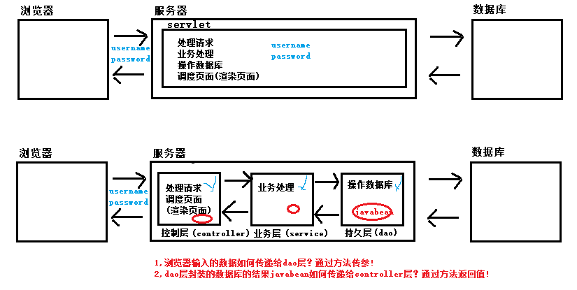

### 01-项目二阶段搭建(掌握)

* 项目搭建
  * v1 -> v2

* 开发步骤
  * ①创建javaweb项目
  * ②将bookstore-v1中的页面资源拷贝到bookstore-v2中
    * 修改vue.js路径，解决404问题


### 02-base标签(掌握)

* 概述

  * 因为在页面中有很多的a标签、表单以及Ajax请求(以后会学)都需要写访问路径，推荐大家写绝对路径，要求最前面是项目的访问路径，一旦项目的访问路径发生改变，要修改的地方特别多，那么， 能不能对项目的访问路径进行统一管理？可以使用base标签

* 开发步骤

  * ①在login.html页面，使用base标签
  * ②在regist.html页面，使用base标签

* ①在login.html页面，使用base标签

  ```html
  <head>
      <meta charset="UTF-8"/>
      <base href="/bookstore/">
      <title>尚硅谷会员登录页面</title>
      <link type="text/css" rel="stylesheet" href="static/css/style.css"/>
  </head>
  ```

* ②在regist.html页面，使用base标签

  ```html
  <head>
      <meta charset="UTF-8"/>
      <base href="/bookstore/">
      <title>尚硅谷会员注册页面</title>
      <link type="text/css" rel="stylesheet" href="static/css/style.css"/>
      <link rel="stylesheet" href="static/css/register.css"/>
      <style type="text/css">
          .login_form {
              height: 420px;
              margin-top: 25px;
          }
      </style>
  </head>
  ```

* 注意事项

  * base标签只会拼接到"相对路径"前面。


### 03-使用静态数据完成登录功能(掌握)

* 概述

  * 使用假数据完成登录功能
    * 如果登录成功，跳转到login_success.html
    * 如果登录失败，跳转回login.html

* 代码实现

  ```html
  <form action="login" @submit="checkLogin()">
      <label>用户名称：</label>
      <input
              class="itxt"
              type="text"
              placeholder="请输入用户名"
              autocomplete="off"
              tabindex="1"
              name="username"
              id="username"
              @change="checkUsername()"
              v-model="username"
      />
      <br/>
      <br/>
      <label>用户密码：</label>
      <input
              class="itxt"
              type="password"
              placeholder="请输入密码"
              autocomplete="off"
              tabindex="1"
              name="password"
              id="password"
              @change="checkPassword()"
              v-model="password"
      />
      <br/>
      <br/>
      <input type="submit" value="登录" id="sub_btn"/>
  </form>
  ```

  ```java
  @WebServlet("/login")
  public class LoginServlet extends HttpServlet {
      @Override
      protected void doGet(HttpServletRequest request, HttpServletResponse response) throws ServletException, IOException {
          //获取登录表单中的用户输入数据
          String username = request.getParameter("username");
          String password = request.getParameter("password");
          if ("root".equals(username) && "root".equals(password)) {
              //登录成功 , 跳转到login_success.html (重定向)
              response.sendRedirect("/bookstore/pages/user/login_success.html");
          } else {
              //登录失败 , 跳转回login.html (请求转发)
              request.getRequestDispatcher("/pages/user/login.html").forward(request, response);
          }
  
      }
  
      @Override
      protected void doPost(HttpServletRequest request, HttpServletResponse response) throws ServletException, IOException {
          doGet(request, response);
      }
  }
  ```


### 04-三层架构概述(难点)

* 存在问题
  * Servlet中要做的事太多了：处理请求、业务处理、操作数据库、调度页面(渲染页面)
  * 解决以上问题，就得使用三层架构
* 三层架构
  * 
  * 控制层 : controller
    * 处理请求、调度页面/渲染页面
  * 业务层 : service
    * 处理业务
  * 持久层 : dao
    * 操作数据库
* 两个问题
  * 浏览器输入的数据如何传递给持久层？
    * 通过方法传参
  * 持久层封装的数据库结果如何传递给控制层？
    * 通过方法返回值


### 05-三层架构实现(难点)

* 开发步骤

  * ①编写controller层代码
  * ②编写service层代码
  * ③编写dao层代码

* ①编写controller层代码

  ```java
  /**
   * 控制层：处理请求、调度页面/渲染页面
   */
  @WebServlet("/login")
  public class LoginServlet extends HttpServlet {
      @Override
      protected void doGet(HttpServletRequest request, HttpServletResponse response) throws ServletException, IOException {
          //处理请求
          String username = request.getParameter("username");
          String password = request.getParameter("password");
          UserService userService = new UserServiceImpl();
          try {
              User user = userService.login(username, password);
              //调度页面
              if (null != user) {
                  //登录成功 , 跳转到login_success.html (重定向)
                  response.sendRedirect("/bookstore/pages/user/login_success.html");
              } else {
                  //登录失败 , 跳转回login.html (请求转发)
                  request.getRequestDispatcher("/pages/user/login.html").forward(request, response);
              }
          } catch (Exception e) {
              e.printStackTrace();
          }
  
  
  
      }
  
      @Override
      protected void doPost(HttpServletRequest request, HttpServletResponse response) throws ServletException, IOException {
          doGet(request, response);
      }
  }
  ```

* ②编写service层代码

  ```java
  /**
   * 业务层：业务处理
   */
  public class UserServiceImpl implements UserService {
      @Override
      public User login(String username, String password) throws Exception {
          UserDao userDao = new UserDaoImpl();
          User user = userDao.login(username, password);
          return user;
      }
  }
  ```

* ③编写dao层代码

  ```java
  /**
   * 持久层：操作数据库
   */
  public class UserDaoImpl implements UserDao {
      @Override
      public User login(String username, String password) throws Exception {
          if ("root".equals(username) && "root".equals(password)) {
              //登录成功，返回有效结果(User对象)给controller层
              return new User(username, password);
          } else {
              //登录失败，返回无效结果(null)给controller层
              return null;
          }
      }
  }
  ```


### 06-UserDao类(掌握)

* DAO
  * data access object : 数据访问对象，用来操作数据库的对象
* 开发步骤
  * ①引入sql备份文件
  * ②引入和数据库相关jar包
    * dbutils、druid、mysql
  * ③定义UserDao接口及其实现子类
    * CRUD
* ①引入sql备份文件
* ②引入和数据库相关jar包
* ③定义UserDao接口及其实现子类


### 07-BaseDao类(难点)

* 概述

  * 开发过程中，经常会对数据进行增删改查，比如说对学生的增删改查，老师的增删改查等 等。然而这时你会发现你所写的很多代码都是重复的，这时你就会考虑到代码的优化问题

* 代码实现

  ```java
  public class BaseDao<T> {
  
  
      /**
       * 增加、删除、修改的通用方法
       *
       * @param sql  ： sql语句
       * @param args : 输入参数
       */
      public int update(String sql, Object... args) {
          Connection connection = null;
          try {
              connection = JDBCUtils.getConnection();
              return new QueryRunner().update(
                      connection,
                      sql,
                      args
              );
          } catch (SQLException e) {
              e.printStackTrace();
          } finally {
              JDBCUtils.release(connection, null);
          }
          return -1;
      }
  
  
      /**
       * 查询单条记录的通用方法
       *
       * @param sql   : sql语句
       * @param clazz : 字节码对象
       * @param args  : 输入参数
       * @return : 单条记录的对象
       */
      public T getBean(String sql, Class<T> clazz, Object... args) {
          Connection connection = null;
          try {
              connection = JDBCUtils.getConnection();
              return new QueryRunner().query(
                      connection,
                      sql,
                      new BeanHandler<>(clazz),
                      args
              );
          } catch (SQLException e) {
              e.printStackTrace();
          } finally {
              JDBCUtils.release(connection, null);
          }
          return null;
      }
  
  
      /**
       * 查询多条记录的通用方法
       * @param sql : sql语句
       * @param clazz : 字节码对象
       * @param args : 输入参数
       * @return : 多条记录的集合
       */
      public List<T> getBeanList(String sql, Class<T> clazz, Object... args) {
          Connection connection = null;
          try {
              connection = JDBCUtils.getConnection();
              return new QueryRunner().query(
                      connection,
                      sql,
                      new BeanListHandler<>(clazz),
                      args
              );
          } catch (SQLException e) {
              e.printStackTrace();
          } finally {
              JDBCUtils.release(connection, null);
          }
          return null;
      }
  
  }
  ```

  ```java
  /**
   * 持久层：操作数据库
   */
  public class UserDaoImpl extends BaseDao<User> implements UserDao {
  
  
      @Override
      public User login(String username, String password) throws Exception {
          if ("root".equals(username) && "root".equals(password)) {
              //登录成功，返回有效结果(User对象)给controller层
              return new User(1, username, password, "5415551@qq.com");
          } else {
              //登录失败，返回无效结果(null)给controller层
              return null;
          }
      }
  
      @Override
      public int addUser(User user) throws Exception {
          return update(
                  "insert into t_user values(null,?,?,?)",
                  user.getUserName(),
                  user.getUserPwd(),
                  user.getEmail()
          );
      }
  
      @Override
      public int deleteUserById(Integer userId) throws Exception {
          return update(
                  "delete from t_user where user_id = ?",
                  userId
          );
  
      }
  
      @Override
      public int updateUserById(User user) throws Exception {
          return update(
                  "update t_user set user_name = ? , user_pwd = ? , email = ? where user_id = ?",
                  user.getUserName(),
                  user.getUserPwd(),
                  user.getEmail(),
                  user.getUserId()
          );
      }
  
      @Override
      public User selectUserById(Integer userId) throws Exception {
          return getBean(
                  "select user_id userId , user_name userName , user_pwd  userPwd , email from t_user where user_id = ?",
                  User.class,
                  userId
          );
      }
  
      @Override
      public List<User> selectUserList() throws Exception {
  
  
          return getBeanList(
                  "select user_id userId , user_name userName , user_pwd  userPwd , email from t_user ",
                  User.class
          );
      }
  }
  ```


### 08-注册功能的完成(掌握)

* 需求

  * 使用数据库完成注册功能
    * 如果注册成功，跳转到regist_success.html
    * 如果注册失败
      * 如果用户名已经存在，在页面上给出"用户名已经存在!"的错误提示
      * 其他错误，跳转回regist.html

* 代码实现

  ```html
  <form action="regist" @submit="checkRegist()">
      <div class="form-item">
          <div>
              <label>用户名称:</label>
              <input type="text" placeholder="请输入用户名" @change="checkUsername()" v-model="username" name="userName"/>
          </div>
          <span class="errMess" v-text="usernameErrorMsg">用户名应为6~16位数字和字母组成</span>
      </div>
      <div class="form-item">
          <div>
              <label>用户密码:</label>
              <input type="password" placeholder="请输入密码" @change="checkPassword()" v-model="password" name="userPwd"/>
          </div>
          <span class="errMess" v-text="passwordErrorMsg">密码的长度至少为5位</span>
      </div>
      <div class="form-item">
          <div>
              <label>确认密码:</label>
              <input type="password" placeholder="请输入确认密码" @change="checkRePassword()" v-model="repassword"/>
          </div>
          <span class="errMess" v-text="repasswordErrorMsg">密码两次输入不一致</span>
      </div>
      <div class="form-item">
          <div>
              <label>用户邮箱:</label>
              <input type="text" placeholder="请输入邮箱" @change="checkEmail()" v-model="email" name="email"/>
          </div>
          <span class="errMess" v-text="emailErrorMsg">请输入正确的邮箱格式</span>
      </div>
      <div class="form-item">
          <div>
              <label>验证码:</label>
              <div class="verify">
                  <input type="text" placeholder="" @change="checkCode()" v-model="code" name="code"/>
                  
              </div>
          </div>
          <span class="errMess" v-text="codeErrorMsg">请输入正确的验证码</span>
      </div>
      <button class="btn">注册</button>
  </form>
  ```

  ```java
  @WebServlet("/regist")
  public class RegistServlet extends HttpServlet {
  
  
      @Override
      protected void doGet(HttpServletRequest req, HttpServletResponse resp) throws ServletException, IOException {
          //使用BeanUtils自动封装
          User inputUser = new User();
          try {
              BeanUtils.populate(inputUser, req.getParameterMap());
              System.out.println("inputUser = " + inputUser);
              UserService userService = new UserServiceImpl();
              //校验用户名是否存在
              User dbUser = userService.selectUserByUsername(inputUser.getUserName());
              if (null != dbUser) {
                  //用户名已经存在
                  resp.setContentType("text/html;charset=utf-8");
                  resp.getWriter().write("<font color='red'>用户名已经存在!</font>");
                  return;
              }
  
              int addUser = userService.addUser(inputUser);
              if (addUser > 0) {
                  //添加成功 , 跳转到regist_success.html (重定向)
                  resp.sendRedirect(req.getContextPath() + "/pages/user/regist_success.html");
              } else {
                  //添加失败 , 跳转回regist.html (转发)
                  req.getRequestDispatcher("/pages/user/regist.html").forward(req, resp);
              }
          } catch (Exception e) {
              e.printStackTrace();
          }
      }
  
      @Override
      protected void doPost(HttpServletRequest req, HttpServletResponse resp) throws ServletException, IOException {
          doGet(req, resp);
      }
  }
  ```

  ```java
  public class UserServiceImpl implements UserService {
  
  
      @Override
      public int addUser(User inputUser) throws Exception {
          UserDao userDao = new UserDaoImpl();
          return userDao.addUser(inputUser);
      }
  
      @Override
      public User selectUserByUsername(String userName) throws Exception {
          UserDao userDao = new UserDaoImpl();
  
          return userDao.selectUserByUsername(userName);
      }
  }
  ```

  ```java
  public class UserDaoImpl extends BaseDao<User> implements UserDao {
  
  
      @Override
      public int addUser(User user) throws Exception {
          return update(
                  "insert into t_user values(null,?,?,?)",
                  user.getUserName(),
                  user.getUserPwd(),
                  user.getEmail()
          );
      }
  
  
      @Override
      public User selectUserByUsername(String userName) throws Exception {
          return getBean(
                  "select user_id userId , user_name userName , user_pwd  userPwd , email from t_user where user_name = ?",
                  User.class,
                  userName
          );
      }
  }
  ```


### 09-登录功能的完成(掌握)

* 需求

  * 使用数据库完成登录功能
    * 登录成功，跳转到login_success.html 
    * 登录失败，跳转到login.html

* 代码实现

  ```java
  public class UserDaoImpl extends BaseDao<User> implements UserDao {
  
  
      @Override
      public User login(String username, String password) throws Exception {
          return getBean(
                  "select user_id userId , user_name userName , user_pwd  userPwd , email from t_user where user_name = ? and user_pwd = ?",
                  User.class,
                  username,
                  password
          );
      }
  }
  ```


### 10-加密概述(了解)

* 概述
  * 数据库密码不能存储明文，必须存储密文。
* 分类
  * MD5
  * MD5+SALT


### 11-MD5加密(了解)

* 概述

  * 一种被广泛使用的密码散列函数，可以产生出一个32字符的散列值（hash value）

* 特点

  * 压缩性：任意长度的数据，算出的MD5值长度都是固定的。 
  * 容易计算：从原数据计算出MD5值很容易。 
  * 抗修改性：对原数据进行任何改动，哪怕只修改1个字节，所得到的MD5值都有很大区别。 
  * 强抗碰撞：已知原数据和其MD5值，想找到一个具有相同MD5值的数据是非常困难的。

* 代码实现

  ```java
  public class Demo01 {
  
      public static void main(String[] args) {
  
          login();
          // regist();
  
      }
  
      private static void login() {
          //①获取明文
          String password = "xiaoqiu";
          //②获取MD5密文
          String md5Password = MD5Utils.generateMD5(password);
          //③现在MD5密文 和 存储在数据库的md5密文 匹配
          String dbPassword = "884f5b0b1bc2c720f886e25369a4320a";
          System.out.println(md5Password.equals(dbPassword) ? "登录成功!" : "登录失败!");
  
  
      }
  
      private static void regist() {
          //①获取明文
          String password = "oldqiu";
          //②获取MD5密文
          String md5Password = MD5Utils.generateMD5(password);
          //③存储MD5密文 : 884f5b0b1bc2c720f886e25369a4320a
          System.out.println("md5Password = " + md5Password);
  
      }
  
  }
  ```

* 存在问题

  * 可以暴力破解MD5 ： https://www.cmd5.com/


### 12-MD5+SALT加密(掌握)

* 概述

  * 在原有明文密码基础上加盐(salt)，再进行MD5加密

* 代码实现

  ```java
  public class Demo02 {
  
      public static void main(String[] args) {
  
          //regist();
  
          login();
  
  
  
      }
  
      private static void login() {
          //①获取明文密码
          System.out.println("请输入密码:");
          String password = new Scanner(System.in).nextLine();
          //②获取数据库中的密文
          String dbPassword = "04ec37510244b92d09532e7816c544156c0108e48d442301";
          //③明文密码 和 密文密码 匹配
          System.out.println(MD5Utils.verify(password,dbPassword) ? "登录成功!" : "登录失败!");
  
  
      }
  
      /**
       * 04ec37510244b92d09532e7816c544156c0108e48d442301
       * d4e86720b597f0936f361214e9119c884236169313d0ac31
       */
      private static void regist() {
          //①获取明文密码
          System.out.println("请输入密码:");
          String password = new Scanner(System.in).nextLine();
          //②获取随机盐值
          String salt = MD5Utils.generateSalt();
          //③根据明文密码和盐值生成MD5密文
          String saltMD5Password = MD5Utils.generateMD5AndSalt(password, salt);
          //④存储MD5密文
          System.out.println("saltMD5Password = " + saltMD5Password);
      }
  
  }
  ```

'


### 13-注册功能引入加密(掌握)

* 需求

  * 在注册功能中，引入加密功能

* 代码实现

  ```java
  public class UserServiceImpl implements UserService {
      @Override
      public int addUser(User inputUser) throws Exception {
          //获取盐值
          String salt = MD5Utils.generateSalt();
          //获取加盐后的MD5密文
          String md5Password = MD5Utils.generateMD5AndSalt(inputUser.getUserPwd(), salt);
          inputUser.setUserPwd(md5Password);
          UserDao userDao = new UserDaoImpl();
          return userDao.addUser(inputUser);
      }
  }
  ```


### 14-登录功能引入加密(掌握)

* 需求

  * 在登录功能中，引入加密功能

* 代码实现

  ```java
  public class UserServiceImpl implements UserService {
      @Override
      public User login(String username, String password) throws Exception {
          UserDao userDao = new UserDaoImpl();
          //①根据username查询用户记录 （验证账户）
          User dbUser = userDao.selectUserByUsername(username);
          if (null == dbUser) {
              //登录失败
              return null;
          }
          //②username是正确的,需要验证密码 ：输入明文 和 数据库密文 匹配 (验证密码)
          boolean verify = MD5Utils.verify(password, dbUser.getUserPwd());
          return verify ? dbUser : null;
      }
  }
  ```

