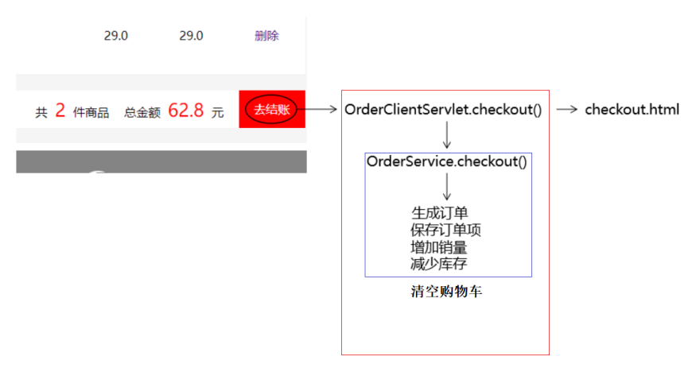

### 01-项目五阶段准备(掌握)

* 项目搭建
  * v4 -> v5
  * 直接复制


### 02-Filter全局编码(掌握)

* 需求

  * 用户登录功能，将请求方式修改为post，会有请求参数中文乱码问题，可以使用Filter过滤器来统一解决。

* 代码实现

  ```java
  public class EncodingFilter implements Filter {
  
      private String encoding ;
      @Override
      public void init(FilterConfig filterConfig) throws ServletException {
          encoding = filterConfig.getInitParameter("encoding");
      }
  
      @Override
      public void doFilter(ServletRequest request, ServletResponse response, FilterChain chain) throws IOException, ServletException {
          request.setCharacterEncoding(encoding);
          chain.doFilter(request, response);
      }
  }
  ```

  ```xml
  <filter>
      <filter-name>EncodingFilter</filter-name>
      <filter-class>com.atguigu.filter.EncodingFilter</filter-class>
      <init-param>
          <param-name>encoding</param-name>
          <param-value>utf-8</param-value>
      </init-param>
  </filter>
  
  <filter-mapping>
      <filter-name>EncodingFilter</filter-name>
      <url-pattern>/*</url-pattern>
  </filter-mapping>
  ```


### 03-登录状态校验(掌握)

* 需求

  * 把项目中一些功能保护起来，没有登录不允许访问，比如：购物车功能、订单功能、图书管理功能等等。

* 代码实现

  ```java
  public class LoginFilter implements Filter {
      @Override
      public void doFilter(ServletRequest req, ServletResponse resp, FilterChain chain) throws IOException, ServletException {
          HttpServletRequest request = (HttpServletRequest) req;
          HttpServletResponse response = (HttpServletResponse) resp;
          //校验登录状态
          Object existUser = request.getSession().getAttribute(BookstoreConstant.SESSION_KEY_USER);
          if (existUser == null) {
              //没有登录 , 跳转到login.html
              try {
                  response.sendRedirect(request.getContextPath() + "/user?method=toLoginPage");
              } catch (IOException e) {
                  e.printStackTrace();
              }
          } else {
              //有登录，直接放行
              chain.doFilter(request, response);
  
          }
      }
  }
  ```

  ```xml
  <filter>
      <filter-name>LoginFilter</filter-name>
      <filter-class>com.atguigu.filter.LoginFilter</filter-class>
  </filter>
  
  <filter-mapping>
      <filter-name>LoginFilter</filter-name>
      <url-pattern>/protected/*</url-pattern>
  </filter-mapping>
  ```

* 注意事项

  * LoginFilter只过滤受保护的资源("/protected/*")，否则会有死循环。


### 04-订单模型(掌握)

* 需求

  * ①创建Order类
  * ②创建OrderItem类
  * ③引入lombok
    * ①settings -> plugins -> lombok -> 安装 ->重启idea
    * ②settings -> build,execution,deployement -> compiler -> annotation processors -> 勾选 enable annotation processing
    * ③当前项目引入lombok.jar
    * ④使用lombok的注解

* ①创建Order类

  ```java
  @NoArgsConstructor
  @AllArgsConstructor
  @Data
  public class Order {
  
  
      private Integer orderId;//订单id
      private String orderSequence;//订单序列号
      private String createTime;//订单创建时间
      private Integer totalCount;//总数量
      private Double totalAmount;//总金额
      private Integer orderStatus;//订单状态(0:未完成 , 1:已完成)
      private Integer userId;//用户id
  
  
  
  }
  ```

  

* ②创建OrderItem类

  ```java
  @NoArgsConstructor
  @AllArgsConstructor
  @Data
  public class OrderItem {
  
      private Integer itemId;//订单项id
      private String bookName;//图书名称
      private Double price;//图书价格
      private String imgPath;//图书图片
      private Integer itemCount;//订单项数量 (购物车项数量)
      private Double itemAmount; //订单项金额(购物车项金额)
      private Integer orderId;//订单id
  
  }
  ```

* ③引入lombok

  


### 05-订单结算业务流程(掌握)

* 业务流程
  * 


### 06-订单结算之生成订单(掌握)

* 代码实现

  ```html
  <a class="pay" th:href="@{/protected/orderClient(method=checkout)}">去结账</a>
  ```

  ```java
  @WebServlet("/protected/orderClient")
  public class ProtectedOrderServlet extends ModelBaseServlet {
  
      /**
       * 订单结算
       * @param request
       * @param response
       */
      public void checkout(HttpServletRequest request, HttpServletResponse response){
          Cart existCart = (Cart) request.getSession().getAttribute(BookstoreConstant.SESSION_KEY_CART);
          User existUser = (User) request.getSession().getAttribute(BookstoreConstant.SESSION_KEY_USER);
          OrderService orderService = new OrderServiceImpl();
          try {
              orderService.checkout(existCart,existUser);
          } catch (Exception e) {
              e.printStackTrace();
          }
      }
  
  }
  ```

  ```java
  public class OrderServiceImpl implements OrderService {
      @Override
      public void checkout(Cart existCart, User existUser) throws Exception {
          //----------------------------------①生成订单----------------------------------
          OrderDao orderDao = new OrderDaoImpl();
          Order order = new Order();
          //3.1,订单id自增
          order.setOrderId(null);
          //3.2,设置订单序列号
          String orderSequence = UUID.randomUUID().toString().replace("-", "");
          order.setOrderSequence(orderSequence);
          //3.3,设置订单创建时间
          order.setCreateTime(new SimpleDateFormat("yyyy-MM-dd HH:mm:ss").format(new Date()));
          //3.4,设置订单总金额
          order.setTotalAmount(existCart.getTotalAmount());
          //3.5,设置订单总数量
          order.setTotalCount(existCart.getTotalCount());
          //3.6,订单订单的用户id
          order.setUserId(existUser.getUserId());
          orderDao.addOrder(order);//当orderDao.addOrder()方法执行完成之后，order对象的orderId就有值啦!
          System.out.println("order = " + order);
          //----------------------------------②生成订单项----------------------------------
          //使用orderId
          //----------------------------------③修改图书销量和库存----------------------------------
      }
  }
  ```

  ```java
  public class OrderDaoImpl implements OrderDao {
      @Override
      public void addOrder(Order order) throws Exception {
          Connection connection = null;
          PreparedStatement statement = null;
          ResultSet resultSet = null;
          try {
              connection = JDBCUtils.getConnection();
              String sql = "insert into t_order values(null,?,?,?,?,?,?)";
              statement = connection.prepareStatement(sql, Statement.RETURN_GENERATED_KEYS);
              statement.setString(1, order.getOrderSequence());
              statement.setString(2, order.getCreateTime());
              statement.setInt(3, order.getTotalCount());
              statement.setDouble(4, order.getTotalAmount());
              statement.setInt(5, BookstoreConstant.ORDER_UNCOMPLETED);
              statement.setInt(6, order.getUserId());
              int addOrder = statement.executeUpdate();
              if (addOrder >= 1) {
                  //添加记录成功 , 获取已经生成记录的主键值
                  resultSet = statement.getGeneratedKeys();
                  while (resultSet.next()) {
                      int orderId = resultSet.getInt(1);
                      order.setOrderId(orderId);
                  }
              }
          } catch (SQLException e) {
              e.printStackTrace();
          } finally {
              JDBCUtils.release(connection, statement, resultSet);
          }
      }
  }
  ```


### 07-订单结算之生成订单项(掌握)

* 代码测试

  ```java
  public class Demo03 {
  
  
      public static void main(String[] args) throws Exception {
  
          //method1();
  
          method2();
  
      }
  
      private static void method1() throws Exception {
          List<User> userList = new ArrayList<>();
          userList.add(new User(null, "zhangsan", "zhangsan", "zs@qq.com"));
          userList.add(new User(null, "lisi", "lisi", "ls@qq.com"));
  
          UserDao userDao = new UserDaoImpl();
          for (User user : userList) {
              userDao.addUser(user);
          }
      }
  
      private static void method2() {
          List<User> userList = new ArrayList<>();
          userList.add(new User(null, "zhangsan2", "zhangsan2", "zs2@qq.com"));
          userList.add(new User(null, "lisi2", "lisi2", "ls2@qq.com"));
  
          Connection connection = null;
          try {
              connection = JDBCUtils.getConnection();
              String sql = "insert into t_user values(null,?,?,?)";
              //第一个参数:需要进行批量操作的记录的个数
              //第二个参数:所操作的记录的属性个数
              Object[][] params = new Object[userList.size()][3];
              for (int i = 0; i < userList.size(); i++) {
                  //i=0 , 循环第一次，获取到批量操作的第一条记录
                  //i=1, 循环第二次，获取到批量操作的第二条记录
                  User user = userList.get(i);
                  params[i][0] = user.getUserName();
                  params[i][1] = user.getUserPwd();
                  params[i][2] = user.getEmail();
              }
              new QueryRunner().batch(connection, sql, params);
          } catch (Exception e) {
              e.printStackTrace();
          }
  
  
      }
  
  
  }
  ```

* 生成订单项

  ```
  public class OrderServiceImpl implements OrderService {
      @Override
      public void checkout(Cart existCart, User existUser) throws Exception {
          //----------------------------------①生成订单----------------------------------
          
          //----------------------------------②生成订单项----------------------------------
          OrderItemDao orderItemDao = new OrderItemDaoImpl();
          //2.1,获取所有购物车项
          Map<Integer, CartItem> cartItemMap = existCart.getCartItemMap();
          //2.2,数组：第一个参数：要批量添加的订单项数量；第二个参数：操作订单项的属性数量
          Object[][] orderItemParams = new Object[cartItemMap.size()][6];
          List<CartItem> cartItems = new ArrayList<>(cartItemMap.values());
          for (int i = 0; i < cartItems.size(); i++) {
              //2.3,获取每一个购物车项
              CartItem cartItem = cartItems.get(i);
              orderItemParams[i][0] = cartItem.getBookName();
              orderItemParams[i][1] = cartItem.getPrice();
              orderItemParams[i][2] = cartItem.getImgPath();
              orderItemParams[i][3] = cartItem.getCount();
              orderItemParams[i][4] = cartItem.getAmount();
              orderItemParams[i][5] = order.getOrderId();
          }
          orderItemDao.addOrderItems(orderItemParams);
          //----------------------------------③修改图书销量和库存----------------------------------
      }
  }
  ```

  ```java
  public class OrderItemDaoImpl implements OrderItemDao {
      @Override
      public void addOrderItems(Object[][] orderItemParams) throws Exception {
          Connection connection = null;
          try {
              connection = JDBCUtils.getConnection();
              new QueryRunner().batch(
                      connection,
                      "insert into t_order_item values(null,?,?,?,?,?,?)",
                      orderItemParams
              );
          } catch (Exception e) {
              e.printStackTrace();
          } finally {
              JDBCUtils.release(connection, null);
          }
  
      }
  }
  ```

  


### 08-订单结算之修改图书库存和销量(掌握)

* 代码测试

  ```java
  public class Demo04 {
  
  
      public static void main(String[] args) throws Exception {
  
          //method1();
          method2();
  
      }
  
      private static void method1() throws Exception {
          List<User> userList = new ArrayList<>();
          userList.add(new User(4, "zhangsan", "zhangsan", "1@qq.com"));
          userList.add(new User(7, "lisi", "lisi", "2@qq.com"));
  
          UserDao userDao = new UserDaoImpl();
          for (User user : userList) {
              userDao.updateUserById(user);
          }
      }
  
      private static void method2() {
          List<User> userList = new ArrayList<>();
          userList.add(new User(4, "zhangsan3", "zhangsan3", "3@qq.com"));
          userList.add(new User(7, "lisi4", "lisi4", "4@qq.com"));
  
          Connection connection = null;
          try {
              connection = JDBCUtils.getConnection();
              String sql = "update t_user set user_name = ? , user_pwd = ? , email = ? where user_id = ?";
              //第一个参数:需要进行批量操作的记录的个数
              //第二个参数:所操作的记录的属性个数
              Object[][] params = new Object[userList.size()][4];
              for (int i = 0; i < userList.size(); i++) {
                  //i=0 , 循环第一次，获取到批量操作的第一条记录
                  //i=1, 循环第二次，获取到批量操作的第二条记录
                  User user = userList.get(i);
                  params[i][0] = user.getUserName();
                  params[i][1] = user.getUserPwd();
                  params[i][2] = user.getEmail();
                  params[i][3] = user.getUserId();
              }
              new QueryRunner().batch(connection, sql, params);
          } catch (Exception e) {
              e.printStackTrace();
          }
  
  
      }
  
  
  }
  ```

* 修改图书库存和销量

  ```java
  public class OrderServiceImpl implements OrderService {
      @Override
      public void checkout(Cart existCart, User existUser) throws Exception {
          //----------------------------------①生成订单----------------------------------
  
          //----------------------------------②生成订单项----------------------------------
  
          //----------------------------------③修改图书销量和库存----------------------------------
          BookDao bookDao = new BookDaoImpl();
          Object[][] bookParams = new Object[cartItemMap.size()][3];
          for (int i = 0; i < cartItems.size(); i++) {
              CartItem cartItem = cartItems.get(i);
              bookParams[i][0] = cartItem.getCount();
              bookParams[i][1] = cartItem.getCount();
              bookParams[i][2] = cartItem.getBookId();
          }
          bookDao.updateBooks(bookParams);
  
  
      }
  }
  ```

  ```java
  @Override
  public void updateBooks(Object[][] bookParams) throws Exception {
      Connection connection = null;
      try {
          connection = JDBCUtils.getConnection();
          new QueryRunner().batch(
                  connection,
                  "update t_book set sales = sales + ? , stock = stock - ? where book_id = ?",
                  bookParams
          );
      } catch (Exception e) {
          e.printStackTrace();
      } finally {
          JDBCUtils.release(connection, null);
      }
  }
  ```


### 09-订单结算之清空购物车(掌握)

* 代码实现

  ```java
  @WebServlet("/protected/orderClient")
  public class ProtectedOrderServlet extends ModelBaseServlet {
  
  
      /**
       * 转发到checkout.html
       *
       * @param request
       * @param response
       */
      public void toCheckoutPage(HttpServletRequest request, HttpServletResponse response) {
          try {
              processTemplate("pages/cart/checkout", request, response);
          } catch (IOException e) {
              e.printStackTrace();
          }
      }
  
  
      /**
       * 订单结算
       *
       * @param request
       * @param response
       */
      public void checkout(HttpServletRequest request, HttpServletResponse response) {
          Cart existCart = (Cart) request.getSession().getAttribute(BookstoreConstant.SESSION_KEY_CART);
          User existUser = (User) request.getSession().getAttribute(BookstoreConstant.SESSION_KEY_USER);
          OrderService orderService = new OrderServiceImpl();
          try {
              String orderSequence = orderService.checkout(existCart, existUser);
              //订单结算成功 , 清空购物车
              request.getSession().removeAttribute(BookstoreConstant.SESSION_KEY_CART);
  
              request.getSession().setAttribute("orderSequence", orderSequence);
              //重定向到ProtectedOrderServlet类的toCheckoutPage方法
              response.sendRedirect(request.getContextPath() + "/protected/orderClient?method=toCheckoutPage");
  
          } catch (Exception e) {
              e.printStackTrace();
          }
      }
  
  }
  ```


### 10-订单结算存在的事务问题(掌握)

* 概述

  * 在一个业务中，将多个sql操作看作一个整体，遵守原子性，要么一起成功，要么一起失败。
  * 有一个订单结算的业务，包含多个sql操作：添加订单、批量添加订单项、批量修改图书销量和库存

* 问题代码

  ```java
  public class OrderServiceImpl implements OrderService {
      @Override
      public String checkout(Cart existCart, User existUser) throws Exception {
          //----------------------------------①生成订单----------------------------------
  
          System.out.println(1 / 0);
  
          //----------------------------------②生成订单项----------------------------------
  
          //----------------------------------③修改图书销量和库存----------------------------------
  
  
      }
  }
  ```


### 11-订单结算事务管理初级方案(掌握)

* 代码实现

  ```java
  public class OrderServiceImpl implements OrderService {
      @Override
      public String checkout(Cart existCart, User existUser) throws Exception {
  
          String orderSequence = null;
          Connection connection = null;
          try {
              //开启事务(设置事务手动提交)
              connection = JDBCUtils.getConnection();
              connection.setAutoCommit(false);
  
              //----------------------------------①生成订单----------------------------------
  
  
              System.out.println(1 / 0);
  
              //----------------------------------②生成订单项----------------------------------
  
              //----------------------------------③修改图书销量和库存----------------------------------
  
              //没错，提交事务
              connection.commit();
          } catch (Exception e) {
              e.printStackTrace();
              //有错，回滚事务
              connection.rollback();
          } finally {
              JDBCUtils.release(connection, null);
          }
          return orderSequence;
  
      }
  }
  ```

* 存在问题

  * 在OrderServiceImpl的checkout方法中获取了一个Connection对象
  * 在OrderDaoImpl的addOrder方法中获取了一个Connection对象
  * 在OrderItemDaoImpl的addOrderItems方法中获取了一个Connection对象
  * 在BookDaoImpl的updateBooks方法中获取了一个Connection对象
  * 以上四个Connection对象是四个不同的对象，所以无法保证它们在同一个事务中


### 12-订单结算事务管理ThreadLocal(掌握)

* 概述

  * OrderServiceImpl的checkout方法、OrderDaoImpl的addOrder方法、OrderItemDaoImpl的addOrderItems方法、BookDaoImpl的updateBooks方法，这四个方法在同一个线程中，那么，就可以使用和线程相关容器技术ThreadLocal来解决保证同一个连接的问题。

* 代码实现

  ```java
  public class JDBCUtils {
  
  
      private static DataSource dataSource;
  
      static {
          Properties properties = new Properties();
          try {
              properties.load(JDBCUtils.class.getClassLoader().getResourceAsStream("druid.properties"));
              dataSource = DruidDataSourceFactory.createDataSource(properties);
          } catch (Exception e) {
              e.printStackTrace();
          }
      }
  
      public static DataSource getDataSource() {
          return dataSource;
      }
  
  
      private static ThreadLocal<Connection> threadLocal = new ThreadLocal<>();
  
      public static Connection getConnection() throws SQLException {
          Connection connection = threadLocal.get();
          if (null == connection) {
              connection = dataSource.getConnection();
              threadLocal.set(connection);
          }
          return connection;
      }
  }
  ```

  ```java
  public class OrderServiceImpl implements OrderService {
      @Override
      public String checkout(Cart existCart, User existUser) throws Exception {
  
          String orderSequence = null;
          Connection connection = null;
          try {
              //开启事务(设置事务手动提交)
  
              System.out.println("OrderServiceImpl checkout : " + Thread.currentThread().getName());
              connection = JDBCUtils.getConnection();
              connection.setAutoCommit(false);
              System.out.println("OrderServiceImpl checkout : " + connection);
  
              //----------------------------------①生成订单----------------------------------
              OrderDao orderDao = new OrderDaoImpl();
              Order order = new Order();
              //3.1,订单id自增
              order.setOrderId(null);
              //3.2,设置订单序列号
              orderSequence = UUID.randomUUID().toString().replace("-", "");
              order.setOrderSequence(orderSequence);
              //3.3,设置订单创建时间
              order.setCreateTime(new SimpleDateFormat("yyyy-MM-dd HH:mm:ss").format(new Date()));
              //3.4,设置订单总金额
              order.setTotalAmount(existCart.getTotalAmount());
              //3.5,设置订单总数量
              order.setTotalCount(existCart.getTotalCount());
              //3.6,订单订单的用户id
              order.setUserId(existUser.getUserId());
              orderDao.addOrder(order);//当orderDao.addOrder()方法执行完成之后，order对象的orderId就有值啦!
              System.out.println("order = " + order);
  
              System.out.println(1 / 0);
  
              //----------------------------------②生成订单项----------------------------------
              OrderItemDao orderItemDao = new OrderItemDaoImpl();
              //2.1,获取所有购物车项
              Map<Integer, CartItem> cartItemMap = existCart.getCartItemMap();
              //2.2,数组：第一个参数：要批量添加的订单项数量；第二个参数：操作订单项的属性数量
              Object[][] orderItemParams = new Object[cartItemMap.size()][6];
              List<CartItem> cartItems = new ArrayList<>(cartItemMap.values());
              for (int i = 0; i < cartItems.size(); i++) {
                  //2.3,获取每一个购物车项
                  CartItem cartItem = cartItems.get(i);
                  orderItemParams[i][0] = cartItem.getBookName();
                  orderItemParams[i][1] = cartItem.getPrice();
                  orderItemParams[i][2] = cartItem.getImgPath();
                  orderItemParams[i][3] = cartItem.getCount();
                  orderItemParams[i][4] = cartItem.getAmount();
                  orderItemParams[i][5] = order.getOrderId();
              }
              orderItemDao.addOrderItems(orderItemParams);
              //----------------------------------③修改图书销量和库存----------------------------------
              BookDao bookDao = new BookDaoImpl();
              Object[][] bookParams = new Object[cartItemMap.size()][3];
              for (int i = 0; i < cartItems.size(); i++) {
                  CartItem cartItem = cartItems.get(i);
                  bookParams[i][0] = cartItem.getCount();
                  bookParams[i][1] = cartItem.getCount();
                  bookParams[i][2] = cartItem.getBookId();
              }
              bookDao.updateBooks(bookParams);
              //没错，提交事务
              connection.commit();
          } catch (Exception e) {
              e.printStackTrace();
              //有错，回滚事务
              connection.rollback();
          } finally {
              //业务结束
              JDBCUtils.release(connection, null);
          }
          return orderSequence;
  
      }
  }
  ```

* 注意事项

  * 订单结算业务中，连接的关闭，应该在业务结束之后。

* 存在问题

  * ①事务管理比较冗余，可以独立抽取公共方法；
  * ②如果仅仅只是将connection.close是不够的，这只是将connection对象归还到了连接池，因为使用ThreadLocal容器，导致归还到了连接池之后，connection对象状态依然为closed。


### 13-订单结算事务管理ThreadLocal优化(掌握)

* 代码实现

  ```java
  public class JDBCUtils {
  
  
      /**
       * 开启事务
       */
      public static void startTransaction() throws SQLException {
          getConnection().setAutoCommit(false);
      }
  
      /**
       * 回滚事务
       * @throws SQLException
       */
      public static void rollback() throws SQLException {
          getConnection().rollback();
      }
  
  
      /**
       * 提交事务
       * @throws SQLException
       */
      public static void commit() throws SQLException {
          getConnection().commit();
      }
  
      public static void closeConnection() throws SQLException {
          Connection connection = getConnection();
          if (null == connection) {
              try {
                  connection.close();
              } catch (SQLException e) {
                  e.printStackTrace();
              }
              connection = null;
              //重置状态
              threadLocal.remove();
          }
      }
  
      private static DataSource dataSource;
  
      static {
          Properties properties = new Properties();
          try {
              properties.load(JDBCUtils.class.getClassLoader().getResourceAsStream("druid.properties"));
              dataSource = DruidDataSourceFactory.createDataSource(properties);
          } catch (Exception e) {
              e.printStackTrace();
          }
      }
  
      public static DataSource getDataSource() {
          return dataSource;
      }
  
  
      private static ThreadLocal<Connection> threadLocal = new ThreadLocal<>();
  
      public static Connection getConnection() throws SQLException {
          System.out.println(Thread.currentThread().getName());
          Connection connection = threadLocal.get();
          if (null == connection) {
              connection = dataSource.getConnection();
              threadLocal.set(connection);
          }
          System.out.println("JDBCUtils getConnection : " + connection);
          return connection;
      }
  }
  ```


### 14-CloseConnectionFilter过滤器(掌握)

* 代码实现

  ```java
  public class CloseConnectionFilter implements Filter {
      @Override
      public void doFilter(ServletRequest request, ServletResponse response, FilterChain chain) throws IOException, ServletException {
  
          try {
              chain.doFilter(request, response);
          } catch (Exception e) {
              e.printStackTrace();
          } finally {
              //资源执行之后
              try {
                  JDBCUtils.closeConnection();
              } catch (SQLException e) {
                  e.printStackTrace();
              }
          }
  
  
      }
  }
  ```

  ```xml
  <filter>
      <filter-name>CloseConnectionFilter</filter-name>
      <filter-class>com.atguigu.filter.CloseConnectionFilter</filter-class>
  </filter>
  
  <filter-mapping>
      <filter-name>CloseConnectionFilter</filter-name>
      <url-pattern>/*</url-pattern>
  </filter-mapping>
  ```