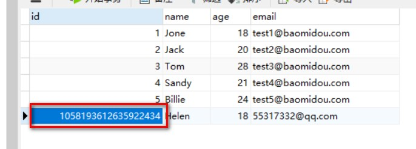

# 一、insert

## 1、插入操作

```java
public class CRUDTests {

    @Autowired
    private UserMapper userMapper;

    @Test
    public void testInsert(){

        User user = new User();
        user.setName("Helen");
        user.setAge(18);
        user.setEmail("55317332@qq.com");

        int result = userMapper.insert(user);
        System.out.println(result); //影响的行数
        System.out.println(user); //id自动回填
    }
}
```

**注意：**数据库插入id值默认为：全局唯一id



## 2、主键策略

**（1）ID_WORKER**

MyBatis-Plus默认的主键策略是：ID_WORKER  全局唯一ID

**参考资料：分布式系统唯一ID生成方案汇总：**[https://www.cnblogs.com/haoxinyue/p/5208136.html](https://www.cnblogs.com/haoxinyue/p/5208136.html)

**（2）自增策略**

* 要想主键自增需要配置如下主键策略

  * 需要在创建数据表的时候设置主键自增
  * 实体字段中配置 @TableId(type = IdType.AUTO)

```java
@TableId(type = IdType.AUTO)
private Long id;
```

其它主键策略：分析 IdType 源码可知

```java
public enum IdType {
     /**
     * 数据库ID自增
     */
    AUTO(0),
  
    /**
     * 该类型为未设置主键类型
     */
    NONE(1),
  
    /**
     * 用户输入ID
     * 该类型可以通过自己注册自动填充插件进行填充
     */  
    INPUT(2),
  
    /**
     * 全局唯一ID
     */  
    ASSIGN_ID(3),
  
    /**
     * 全局唯一ID (UUID)
     */
    ASSIGN_UUID(4),
  
    /** @deprecated */
    @Deprecated
    ID_WORKER(3),
    /** @deprecated */
    @Deprecated
    ID_WORKER_STR(3),
    /** @deprecated */
    @Deprecated
    UUID(4);
    private final int key;
    private IdType(int key) {
        this.key = key;
    }
    public int getKey() {
        return this.key;
    }
}
```

# 二、update

## 1、根据Id更新操作

 **注意：** update时生成的sql自动是动态sql：UPDATE user SET age=? WHERE id=?

```java
    @Test
    public void testUpdateById(){

        User user = new User();
        user.setId(1L);
        user.setAge(28);

        int result = userMapper.updateById(user);
        System.out.println(result);

    }
```

## 2、自动填充

项目中经常会遇到一些数据，每次都使用相同的方式填充，例如记录的创建时间，更新时间等。

我们可以使用MyBatis Plus的自动填充功能，完成这些字段的赋值工作：

**（1）数据库表中添加自动填充字段**

在User表中添加datetime类型的新的字段 create_time、update_time

**（2）实体上添加注解（@TableField注解标记对哪些字段，在什么时候进行填充）**

```java
@Data
public class User {
    ......
    
    @TableField(fill = FieldFill.INSERT)
    private Date createTime;

    //@TableField(fill = FieldFill.UPDATE)
    @TableField(fill = FieldFill.INSERT_UPDATE)
    private Date updateTime;
}
```

**（3）实现元对象处理器接口(在这个接口中指定对这些字段填充的数据时什么?)**

**注意：不要忘记添加 @Component 注解**

```java
@Component
public class MyMetaObjectHandler implements MetaObjectHandler {
  
    @Override
    public void insertFill(MetaObject metaObject) {
        this.setFieldValByName("createTime", new Date(), metaObject);
        this.setFieldValByName("updateTime", new Date(), metaObject);
    }

    @Override
    public void updateFill(MetaObject metaObject) {
        this.setFieldValByName("updateTime", new Date(), metaObject);
    }
}
```

**（4）测试**

## 3、乐观锁

 **主要适用场景：** 当要更新一条记录的时候，希望这条记录没有被别人更新，也就是说实现线程安全的数据更新

**乐观锁实现方式：**

* 取出记录时，获取当前version
* 更新时，带上这个version
* 执行更新时， set version = newVersion where version = oldVersion
* 如果version不对，就更新失败

****（1）数据库中添加version字段****

```sql
ALTER TABLE `user` ADD COLUMN `version` INT
```


****（2）实体类添加version字段****

并添加 @Version 注解

```java
@Version
@TableField(fill = FieldFill.INSERT)
private Integer version;
```

****（3）元对象处理器接口添加version的insert默认值****

```java
@Override
public void insertFill(MetaObject metaObject) {
    ......
    this.setFieldValByName("version", 1, metaObject);
}
```

**特别说明:**

支持的数据类型只有 int,Integer,long,Long,Date,Timestamp,LocalDateTime整数类型下 newVersion = oldVersion + 1newVersion 会回写到 entity 中仅支持 updateById(id) 与 update(entity, wrapper) 方法在 update(entity, wrapper) 方法下, wrapper 不能复用!!!

（4）在 MybatisPlusConfig 中注册 Bean

创建配置类

```java
@EnableTransactionManagement  //该注解，目前没有啥用[自我]
@Configuration
@MapperScan("com.atguigu.mybatis_plus.mapper") //该注解，目前没有啥用[自我]
public class MybatisPlusConfig {

    /**
     * 乐观锁插件
     */
    @Bean
    public OptimisticLockerInterceptor optimisticLockerInterceptor() {
        return new OptimisticLockerInterceptor();
    }
}

```

**（5）测试乐观锁可以修改成功**

测试后分析打印的sql语句，将version的数值进行了加1操作

```java
/**
 * 测试 乐观锁插件
 */
@Test
public void testOptimisticLocker() {

    //查询
    User user = userMapper.selectById(1L);
    //修改数据
    user.setName("Helen Yao");
    user.setEmail("helen@qq.com");
    //执行更新
    userMapper.updateById(user);
}
```

**（5）测试乐观锁修改失败**

```java
/**
 * 测试乐观锁插件 失败
 */
@Test
public void testOptimisticLockerFail() {

    //查询
    User user = userMapper.selectById(1L);
    //修改数据
    user.setName("Helen Yao1");
    user.setEmail("helen@qq.com1");

    //模拟取出数据后，数据库中version实际数据比取出的值大，即已被其它线程修改并更新了version
    user.setVersion(user.getVersion() - 1);

    //执行更新
    userMapper.updateById(user);
}
```

# 三、select

## 1、根据id查询记录

```java
@Test
public void testSelectById(){

    User user = userMapper.selectById(1L);
    System.out.println(user);
}
```

## 2、通过多个id批量查询

完成了动态sql的foreach的功能

```java
@Test
public void testSelectBatchIds(){

    List<User> users = userMapper.selectBatchIds(Arrays.asList(1, 2, 3));
    users.forEach(System.out::println);
}
```

## 3、简单的条件查询

通过map封装查询条件

```java
@Test
public void testSelectByMap(){

    HashMap<String, Object> map = new HashMap<>();
    map.put("name", "Helen");
    map.put("age", 18);
    List<User> users = userMapper.selectByMap(map);

    users.forEach(System.out::println);
}
```

**注意：**map中的key对应的是数据库中的列名。例如数据库user_id，实体类是userId，这时map的key需要填写user_id

## 4、分页

MyBatis Plus自带分页插件，只要简单的配置即可实现分页功能

**（1）创建配置类**

此时可以删除主类中的 @MapperScan 扫描注解[也可以用主类上的@MapperScan注解:自我]

```java
/**
 * 分页插件
 */
@Bean
public PaginationInterceptor paginationInterceptor() {
    return new PaginationInterceptor();
}
```

**（2）测试selectPage分页**

测试：最终通过page对象获取相关数据

```java
@Test
public void testSelectPage() {

    Page<User> page = new Page<>(1,5);
    userMapper.selectPage(page, null);

    page.getRecords().forEach(System.out::println);
    System.out.println(page.getCurrent());
    System.out.println(page.getPages());
    System.out.println(page.getSize());
    System.out.println(page.getTotal());
    System.out.println(page.hasNext());
    System.out.println(page.hasPrevious());
}
```

控制台sql语句打印：SELECT id,name,age,email,create_time,update_time FROM user LIMIT 0,5

**（3）测试selectMapsPage分页：结果集是Map**

```java
@Test
public void testSelectMapsPage() {
   //Page不需要泛型
   Page<Map<String, Object>> page = new Page<>(1, 5);
   Page<Map<String, Object>> pageParam = userMapper.selectMapsPage(page, null);
   List<Map<String, Object>> records = pageParam.getRecords();
   records.forEach(System.out::println);
   System.out.println(pageParam.getCurrent());
   System.out.println(pageParam.getPages());
   System.out.println(pageParam.getSize());
   System.out.println(pageParam.getTotal());
   System.out.println(pageParam.hasNext());
   System.out.println(pageParam.hasPrevious());
}
```

# 四、delete

## 1、根据id删除记录

```java
@Test
public void testDeleteById(){

    int result = userMapper.deleteById(8L);
    System.out.println(result);
}
```

## 2、批量删除

```java
@Test
public void testDeleteBatchIds() {

    int result = userMapper.deleteBatchIds(Arrays.asList(8, 9, 10));
    System.out.println(result);
}
```

## 3、简单的条件查询删除

```java
@Test
public void testDeleteByMap() {

    HashMap<String, Object> map = new HashMap<>();
    map.put("name", "Helen");
    map.put("age", 18);

    int result = userMapper.deleteByMap(map);
    System.out.println(result);
}
```

## 4、逻辑删除

* 物理删除：真实删除，将对应数据从数据库中删除，之后查询不到此条被删除数据
* 逻辑删除：假删除，将对应数据中代表是否被删除字段状态修改为“被删除状态”，之后在数据库中仍旧能看到此条数据记录

**（1）数据库中添加 deleted字段**

```sql
ALTER TABLE `user` ADD COLUMN `deleted` boolean
```


**（2）实体类添加deleted **字段****

并加上 @TableLogic 注解 和 @TableField(fill = FieldFill.INSERT) 注解

```java
@TableLogic
@TableField(fill = FieldFill.INSERT)
private Integer deleted;
```

**（3）元对象处理器接口添加deleted的insert默认值**

```java
@Override
public void insertFill(MetaObject metaObject) {
    ......
    this.setFieldValByName("deleted", 0, metaObject);
}
```

**（4）application.properties 加入配置**

此为默认值，如果你的默认值和mp默认的一样,该配置可无

```properties
mybatis-plus.global-config.db-config.logic-delete-value=1
mybatis-plus.global-config.db-config.logic-not-delete-value=0
```

**（5）测试逻辑删除**

* 测试后发现，数据并没有被删除，deleted字段的值由0变成了1
* 测试后分析打印的sql语句，是一条update
* **注意：**被删除数据的deleted 字段的值必须是 0，才能被选取出来执行逻辑删除的操作

```java
/**
 * 测试 逻辑删除
 */
@Test
public void testLogicDelete() {

    int result = userMapper.deleteById(1L);
    System.out.println(result);
}
```

**（6）测试逻辑删除后的查询**

MyBatis Plus中查询操作也会自动添加逻辑删除字段的判断

```java
/**
 * 测试 逻辑删除后的查询：
 * 不包括被逻辑删除的记录
 */
@Test
public void testLogicDeleteSelect() {
    User user = new User();
    List<User> users = userMapper.selectList(null);
    users.forEach(System.out::println);
}
```

测试后分析打印的sql语句，包含 WHERE deleted=0

SELECT id,name,age,email,create_time,update_time,deleted FROM user WHERE deleted=0

# 五、其它

如果想进行复杂条件查询，那么需要使用条件构造器 Wapper，涉及到如下方法

**1、delete**

**2、selectOne**

**3、selectCount**

**4、selectList**

**5、selectMaps**

**6、selectObjs**

**7、update**
