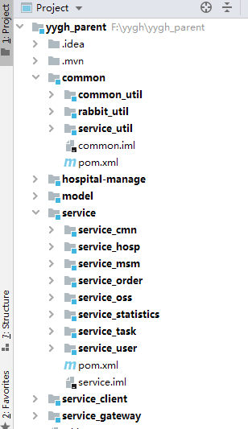
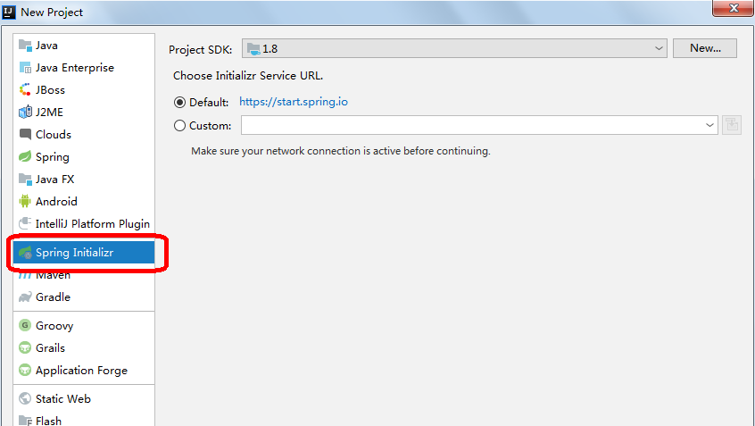
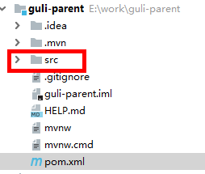

# 一、工程结构介绍

## 1、工程结构



## 2、模块说明

**yygh_parent：预约挂号根目录（父工程），管理多个子模块：**

 **common：公共模块父节点**

        common_util：工具类模块，所有模块都可以依赖于它

        service_utils：service服务的base包，包含service服务的公共配置类，所有service模块依赖于它

        rabbit_utils：rabbitmq封装工具类

  **hospital-manage：医院模拟系统**

 **model：实体类相关模块**

 **service：api接口服务父节点**

        service_hosp：医院api接口服务

        service_cmn：公共api接口服务

        service_user：用户api接口服务

        service_order：订单api接口服务

        service_oss：文件api接口服务

        service_msm：短信 api接口服务

        service_task：定时任务服务

        service_statistics：统计api接口服务

 **service-client：feign服务调用父节点**

        service-cmn-client：公共api接口

        service-hosp-client：医院api接口

        service-order-client：订单api接口

   **server-gateway：服务网关**

# 二、创建父工程

## 1、创建sprigboot工程yygh_parent

在idea开发工具中，使用 Spring Initializr 快速初始化一个 Spring Boot 模块，版本使用：2.2.1.RELEASE



**配置：**

groupId：com.atguigu

artifactId：yygh_parent

一直下一步到完成


## 2、删除 src 目录



## 3、配置 pom.xml

修改版本为 ：2.2.1.RELEASE


<artifactId> 节点后面添加  pom类型

```xml
<artifactId>guli-parent</artifactId>
<packaging>pom</packaging>
```

**4、在pom.xml中添加依赖的版本**

删除pom.xml中的<dependencies>内容

```xml
<!-- 以下内容删除 -->
<dependencies>
    <dependency>
        <groupId>org.springframework.boot</groupId>
        <artifactId>spring-boot-starter</artifactId>
    </dependency>

    <dependency>
        <groupId>org.springframework.boot</groupId>
        <artifactId>spring-boot-starter-test</artifactId>
        <scope>test</scope>
    </dependency>
</dependencies>
```

**添加 <properties>确定依赖的版本**

```xml
<properties>
    <java.version>1.8</java.version>
    <cloud.version>Hoxton.RELEASE</cloud.version>
    <alibaba.version>2.2.0.RELEASE</alibaba.version>
    <mybatis-plus.version>3.3.1</mybatis-plus.version>
    <mysql.version>5.1.46</mysql.version>
    <swagger.version>2.7.0</swagger.version>
    <jwt.version>0.7.0</jwt.version>
    <fastjson.version>1.2.29</fastjson.version>
    <httpclient.version>4.5.1</httpclient.version>
    <easyexcel.version>2.2.0-beta2</easyexcel.version>
    <aliyun.version>4.1.1</aliyun.version>
    <oss.version>3.9.1</oss.version>
    <jodatime.version>2.10.1</jodatime.version>
</properties>
```

**配置 <dependencyManagement> 锁定依赖的版本**

```xml
<!--配置dependencyManagement锁定依赖的版本-->
<dependencyManagement>
    <dependencies>
        <dependency>
            <groupId>org.springframework.cloud</groupId>
            <artifactId>spring-cloud-dependencies</artifactId>
            <version>${cloud.version}</version>
            <type>pom</type>
            <scope>import</scope>
        </dependency>

        <dependency>
            <groupId>com.alibaba.cloud</groupId>
            <artifactId>spring-cloud-alibaba-dependencies</artifactId>
            <version>${alibaba.version}</version>
            <type>pom</type>
            <scope>import</scope>
        </dependency>

        <!--mybatis-plus 持久层-->
        <dependency>
            <groupId>com.baomidou</groupId>
            <artifactId>mybatis-plus-boot-starter</artifactId>
            <version>${mybatis-plus.version}</version>
        </dependency>

        <dependency>
            <groupId>mysql</groupId>
            <artifactId>mysql-connector-java</artifactId>
            <version>${mysql.version}</version>
        </dependency>

        <!--swagger-->
        <dependency>
            <groupId>io.springfox</groupId>
            <artifactId>springfox-swagger2</artifactId>
            <version>${swagger.version}</version>
        </dependency>
        <!--swagger ui-->
        <dependency>
            <groupId>io.springfox</groupId>
            <artifactId>springfox-swagger-ui</artifactId>
            <version>${swagger.version}</version>
        </dependency>

        <dependency>
            <groupId>io.jsonwebtoken</groupId>
            <artifactId>jjwt</artifactId>
            <version>${jwt.version}</version>
        </dependency>

        <dependency>
            <groupId>org.apache.httpcomponents</groupId>
            <artifactId>httpclient</artifactId>
            <version>${httpclient.version}</version>
        </dependency>

        <dependency>
            <groupId>com.alibaba</groupId>
            <artifactId>fastjson</artifactId>
            <version>${fastjson.version}</version>
        </dependency>

        <dependency>
            <groupId>com.alibaba</groupId>
            <artifactId>easyexcel</artifactId>
            <version>${easyexcel.version}</version>
        </dependency>

        <dependency>
            <groupId>com.aliyun</groupId>
            <artifactId>aliyun-java-sdk-core</artifactId>
            <version>${aliyun.version}</version>
        </dependency>

        <dependency>
            <groupId>com.aliyun.oss</groupId>
            <artifactId>aliyun-sdk-oss</artifactId>
            <version>${oss.version}</version>
        </dependency>

        <!--日期时间工具-->
        <dependency>
            <groupId>joda-time</groupId>
            <artifactId>joda-time</artifactId>
            <version>${jodatime.version}</version>
        </dependency>
    </dependencies>
</dependencyManagement>
```

注意：父工程搭建好了，一定要将pom.xml文件中的如下插件删掉，否则后续再对父工程安装的时候会报错。

<build>  
    <plugins>  
        <plugin>  
            <groupId>org.springframework.boot</groupId>  
            <artifactId>spring-boot-maven-plugin</artifactId>  
        </plugin>  
    </plugins>  
</build>
