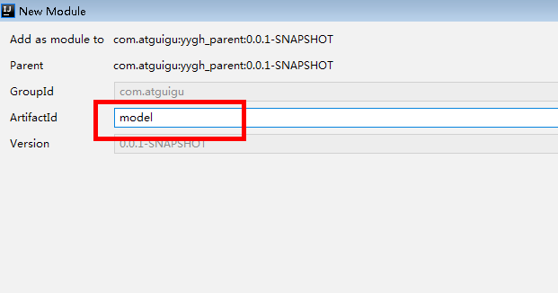

# 一、搭建model模块

## 1、在父工程yygh_parent下面创建模块model

**选择 maven类型，点击下一步**


**输入模块名称model，下一步完成创建**



## 2、添加项目需要的依赖

```xml
 <dependencies>
        <dependency>
            <groupId>org.projectlombok</groupId>
            <artifactId>lombok</artifactId>
        </dependency>
        <!--mybatis-plus-->
        <dependency>
            <groupId>com.baomidou</groupId>
            <artifactId>mybatis-plus-boot-starter</artifactId>
            <scope>provided </scope>
        </dependency>
        <!--swagger-->
        <dependency>
            <groupId>io.springfox</groupId>
            <artifactId>springfox-swagger2</artifactId>
            <scope>provided </scope>
        </dependency>
        <dependency>
            <groupId>com.alibaba</groupId>
            <artifactId>easyexcel</artifactId>
            <scope>provided </scope>
        </dependency>
        <dependency>
            <groupId>org.springframework.boot</groupId>
            <artifactId>spring-boot-starter-data-mongodb</artifactId>
            <scope>provided </scope>
        </dependency>
        <dependency>
            <groupId>com.alibaba</groupId>
            <artifactId>fastjson</artifactId>
            <scope>provided </scope>
        </dependency>
    </dependencies>
```

## 3、复制项目实体类和VO类


