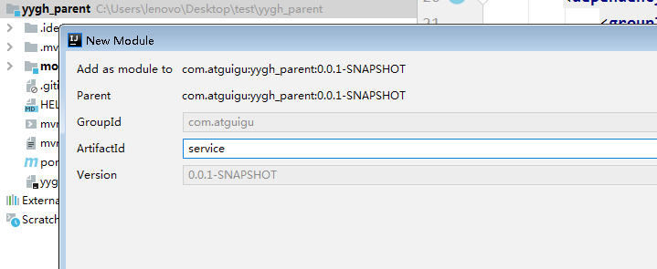

# 一、搭建service模块

## 1、在父工程yygh_parent下面创建模块service

**选择 maven类型，点击下一步**

**输入模块名称 service，下一步完成创建**



## 2、添加模块类型是pom

```xml
<artifactId>service</artifactId>
<packaging>pom</packaging>
```

## 3、添加项目需要的依赖

```xml
<dependencies>
    <dependency>
        <groupId>com.atguigu</groupId>
        <artifactId>model</artifactId>
        <version>0.0.1-SNAPSHOT</version>
    </dependency>
    <!--web-->
    <dependency>
        <groupId>org.springframework.boot</groupId>
        <artifactId>spring-boot-starter-web</artifactId>
    </dependency>
    <!--mybatis-plus-->
    <dependency>
        <groupId>com.baomidou</groupId>
        <artifactId>mybatis-plus-boot-starter</artifactId>
    </dependency>
    <!--mysql-->
    <dependency>
        <groupId>mysql</groupId>
        <artifactId>mysql-connector-java</artifactId>
    </dependency>
    <!--开发者工具-->
    <dependency>
        <groupId>org.springframework.boot</groupId>
        <artifactId>spring-boot-devtools</artifactId>
        <optional>true</optional>
    </dependency>
    <!-- 服务调用feign -->
    <dependency>
        <groupId>org.springframework.cloud</groupId>
        <artifactId>spring-cloud-starter-openfeign</artifactId>
    </dependency>
    <!-- 服务注册 -->
   <dependency>
        <groupId>com.alibaba.cloud</groupId>
        <artifactId>spring-cloud-starter-alibaba-nacos-discovery</artifactId>
    </dependency>
</dependencies>
```

注意：在上面这些依赖中，其中最后两个openfeign和nacos依赖暂时用不着，也可以暂时先注释掉，否则启动时报错，但是不影响使用。

# 二、搭建医院模块service_hosp模块

## 1、在父工程service模块下面创建子模块service_hosp


**输入模块名称 service_hosp，下一步完成创建**


