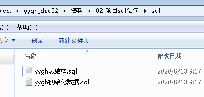
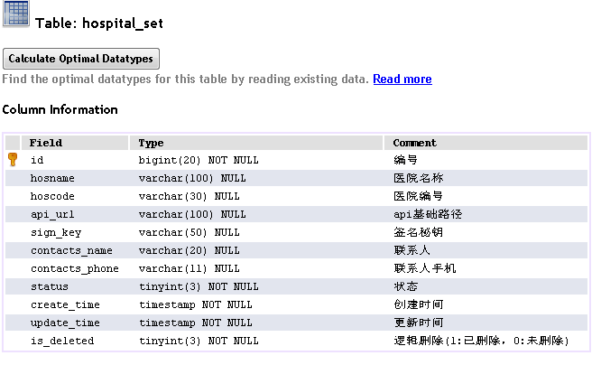
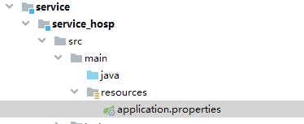
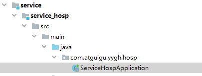
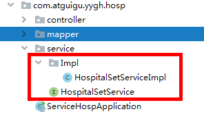
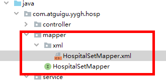
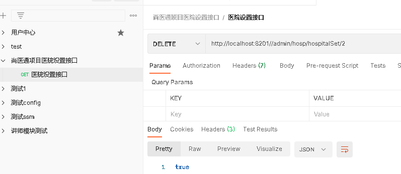

# 一、医院设置模块需求

医院设置主要是用来保存开通医院的一些基本信息，每个医院一条信息，保存了医院编号（平台分配，全局唯一）和接口调用相关的签名key等信息，是整个流程的第一步，只有开通了医院设置信息，才可以上传医院相关信息。我们所开发的功能就是基于单表的一个CRUD、锁定/解锁和发送签名信息这些基本功能。

# 二、医院设置表结构





hosname：医院名称

hoscode：医院编号（平台分配，全局唯一，api接口必填信息）

api_url：医院回调的基础url（如：预约下单，我们要调用该地址去医院下单）

sign_key：双方api接口调用的签名key，有平台生成

contacts_name：医院联系人姓名

contacts_phone：医院联系人手机

status：状态（锁定/解锁）

# 三、医院模块配置

##1、在service下面service_hosp模块中创建配置文件resources目录下创建文件 application.properties



```properties
# 服务端口
server.port=8201
# 服务名
spring.application.name=service-hosp

# 环境设置：dev、test、prod
spring.profiles.active=dev

# mysql数据库连接
spring.datasource.driver-class-name=com.mysql.jdbc.Driver
spring.datasource.url=jdbc:mysql://localhost:3306/yygh_hosp?characterEncoding=utf-8&useSSL=false
spring.datasource.username=root
spring.datasource.password=root

#返回json的全局时间格式
spring.jackson.date-format=yyyy-MM-dd HH:mm:ss
spring.jackson.time-zone=GMT+8

#mybatis日志
mybatis-plus.configuration.log-impl=org.apache.ibatis.logging.stdout.StdOutImpl
```

# 四、编写医院设置后台管理api接口

## 1、创建包结构，创建SpringBoot启动类

创建启动类ServiceHospApplication.java，注意启动类的创建位置



```java
@SpringBootApplication
public class ServiceHospApplication {

    public static void main(String[] args) {
        SpringApplication.run(ServiceHospApplication.class, args);
    }
}
```

## 2、创建service



```java
public interface HospitalSetService extends IService<HospitalSet> {
  
}

@Service
public class HospitalSetServiceImpl extends ServiceImpl<HospitalSetMapper, HospitalSet> implements HospitalSetService {
  
}
```

## 3、创建mapper



```java
public interface HospitalSetMapper extends BaseMapper<HospitalSet> {

}
```

**HospitalSetMapper.xml**

```xml
<?xml version="1.0" encoding="UTF-8" ?>
<!DOCTYPE mapper PUBLIC "-//mybatis.org//DTD Mapper 3.0//EN"
        "http://mybatis.org/dtd/mybatis-3-mapper.dtd">
<mapper namespace="com.atguigu.yygh.hosp.mapper.HospitalSetMapper">

</mapper>
```

## 4、编写controller代码

```java
//医院设置接口
@RestController
@RequestMapping("/admin/hosp/hospitalSet")
public class HospitalSetController {

    @Autowired
    private HospitalSetService hospitalSetService;

    //查询所有医院设置
    @GetMapping("findAll")
    public List<HospitalSet> findAll() {
        List<HospitalSet> list = hospitalSetService.list();
        return list;
    }
}
```

## 5、创建SpringBoot配置类

创建config包，创建HospConfig.java

```java
@Configuration
@EnableTransactionManagement
@MapperScan("com.atguigu.yygh.hosp.mapper")
public class HospConfig {
  
}
```

## 6、运行启动类

访问http://localhost:8201//admin/hosp/hospitalSet/findAll

得到json数据

 **千万注意：将代码生成器生成的entity实体类去掉，用yygh-parent父工程下model模块的实体类** 。

## 7、统一返回的json时间格式

默认情况下json时间格式带有时区，并且是世界标准时间，和我们的时间差了八个小时

在application.properties中设置

```properties
#返回json的全局时间格式
spring.jackson.date-format=yyyy-MM-dd HH:mm:ss
spring.jackson.time-zone=GMT+8
```

# 五、医院设置逻辑删除功能

## 1、HospitalSetController添加删除方法

```java
@DeleteMapping("{id}")
public boolean removeById(@PathVariable String id){
    return hospitalSetService.removeById(id);
}
```

## 2、使用postman测试删除



测试结果：数据库中的is_deleted字段被修改为1

# 六、跨域配置

## 1、什么是跨域

浏览器从一个域名的网页去请求另一个域名的资源时，域名、端口、协议任一不同，都是跨域 。前后端分离开发中，需要考虑ajax跨域的问题。

这里我们可以从服务端解决这个问题

## 2、配置

在Controller类上添加注解

```java
@CrossOrigin //跨域
```
