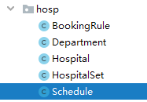

# 一、上传排班接口

参考《尚医通API接口文档.docx》业务接口4.3上传排班

## 1、添加排班基础类

### 1.1 添加model

说明：由于实体对象没有逻辑，我们已经统一导入

com.atguigu.yygh.model.hosp.Schedule



### 1.2 添加repository

```java
@Repository
public interface ScheduleRepository extends MongoRepository<Schedule,String> {
}
```

### 1.3 添加service接口和实现类

```java
public interface ScheduleService {
}

@Service
public class ScheduleServiceImpl implements ScheduleService {
  
    @Autowired
    private ScheduleRepository scheduleRepository;
}
```

## 2、上传排班实现

### 2.1 接口数据分析

```json
{
    "hoscode": "1000_0",
    "depcode": "200040878",
    "title": "医师",
    "docname": "",
    "skill": "内分泌科常见病。",
    "workDate": "2020-06-22",
    "workTime": 0,
    "reservedNumber": 33,
    "availableNumber": 22,
    "amount": "100",
    "status": 1,
    "hosScheduleId": "1"
}
```

### 2.2 添加service方法和实现

```java
public interface ScheduleService {

    /**
     * 上传排班信息
     * @param paramMap
     */
    void save(Map<String, Object> paramMap);

}

@Service
public class ScheduleServiceImpl implements ScheduleService {

    @Autowired
    private ScheduleRepository scheduleRepository;

    @Override
    public void save(Map<String, Object> paramMap) {
        //paramMap 转换department对象
        String paramMapString = JSONObject.toJSONString(paramMap);
        Schedule schedule = JSONObject.parseObject(paramMapString, Schedule.class);

        //根据医院编号 和 排班编号查询
        Schedule scheduleExist = scheduleRepository.
              getScheduleByHoscodeAndHosScheduleId(schedule.getHoscode(),schedule.getHosScheduleId());
        //判断
        if(scheduleExist!=null) {
            scheduleExist.setUpdateTime(new Date());//这里感觉有一点问题，应该是schedule对象
            scheduleExist.setIsDeleted(0);//这里感觉有一点问题，应该是schedule对象
            scheduleExist.setStatus(1);//这里感觉有一点问题，应该是schedule对象
            scheduleRepository.save(scheduleExist);//这里感觉有一点问题，应该是schedule对象，
        } else {
            schedule.setCreateTime(new Date());
            schedule.setUpdateTime(new Date());
            schedule.setIsDeleted(0);
            schedule.setStatus(1);
            scheduleRepository.save(schedule);
        }
    }
}
```

### 2.3 添加repository方法

```java
@Repository
public interface ScheduleRepository extends MongoRepository<Schedule,String> {

    Schedule getScheduleByHoscodeAndHosScheduleId(String hoscode, String hosScheduleId);
}
```

### 2.4 添加controller

```java
@Autowired
private ScheduleService scheduleService;

@ApiOperation(value = "上传排班")
@PostMapping("saveSchedule")
public Result saveSchedule(HttpServletRequest request) {
    Map<String, Object> paramMap = HttpRequestHelper.switchMap(request.getParameterMap());
    //必须参数校验 略
    String hoscode = (String)paramMap.get("hoscode");
    scheduleService.save(paramMap);
    return Result.ok();
}
```
