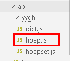
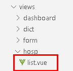

# 一、医院列表功能（前端）

## 1、添加医院列表路由

**（1）在router/index.js添加**

```javascript
{
    path: 'hospital/list',
    name: '医院列表',
    component: () =>import('@/views/hosp/list'),
    meta: { title: '医院列表', icon: 'table' }
} 
```

**（2）封装api请求**

在api/yygh目录下创建hosp.js文件



```javascript
import request from '@/utils/request'

export default {
  //医院列表
  getPageList(current,limit,searchObj) {
    return request ({
      url: `/admin/hosp/hospital/${current}/${limit}`,
      method: 'get',
      params: searchObj  
    })
  },
  //查询dictCode查询下级数据字典
  findByDictCode(dictCode) {
    return request({
        url: `/admin/cmn/dict/findByDictCode/${dictCode}`,
        method: 'get'
      })
    },
  
  //根据id查询下级数据字典
  findByParentId(dictCode) {
    return request({
        url: `/admin/cmn/dict/findChildData/${dictCode}`,
        method: 'get'
      })
  }
}
```

## 2、创建hosp/list.vue页面



## 3、编写页面内容

在hosp/list.vue添加内容

```javascript
<template>
<div class="app-container">
    <el-form :inline="true" class="demo-form-inline">
        <el-form-item>
            <el-select
                v-model="searchObj.provinceCode"
                placeholder="请选择省"
                    @change="provinceChanged">
                <el-option
                    v-for="item in provinceList"
                        :key="item.id"
                        :label="item.name"
                        :value="item.id"/>
            </el-select>
        </el-form-item>

        <el-form-item>
            <el-select
            v-model="searchObj.cityCode"
            placeholder="请选择市">
                <el-option
                v-for="item in cityList"
                :key="item.id"
                :label="item.name"
                :value="item.id"/>
            </el-select>
        </el-form-item>

        <el-form-item>
            <el-input v-model="searchObj.hosname" placeholder="医院名称"/>
        </el-form-item>

        <el-button type="primary" icon="el-icon-search" @click="fetchData()">查询</el-button>
        <el-button type="default" @click="resetData()">清空</el-button>
    </el-form>

    <!-- banner列表 -->
    <el-table v-loading="listLoading" :data="list"
            border
        fit
        highlight-current-row>

        <el-table-column
        label="序号"
        width="60"
        align="center">
            <template slot-scope="scope">
                    {{ (page - 1) * limit + scope.$index + 1 }}
            </template>
        </el-table-column>

        <el-table-column label="医院logo">
            <template slot-scope="scope">
            
            </template>
        </el-table-column>

        <el-table-column prop="hosname" label="医院名称"/>
        <el-table-column prop="param.hostypeString" label="等级" width="90"/>
        <el-table-column prop="param.fullAddress" label="详情地址"/>
        <el-table-column label="状态" width="80">
            <template slot-scope="scope">
                    {{ scope.row.status === 0 ? '未上线' : '已上线' }}
            </template>
        </el-table-column>
        <el-table-column prop="createTime" label="创建时间"/>

        <el-table-column label="操作" width="230" align="center">
            <template slot-scope="scope">
                <router-link :to="'/hospSet/hospital/show/'+scope.row.id">
                    <el-button type="primary" size="mini">查看</el-button>
                </router-link>
                <router-link :to="'/hospSet/hospital/schedule/'+scope.row.hoscode">
                    <el-button type="primary" size="mini">排班</el-button>
                </router-link>

                <el-button v-if="scope.row.status == 1"  type="primary" size="mini" @click="updateStatus(scope.row.id, 0)">下线</el-button>
                <el-button v-if="scope.row.status == 0"  type="danger" size="mini" @click="updateStatus(scope.row.id, 1)">上线</el-button>
            </template>

        </el-table-column>
    </el-table>

    <!-- 分页组件 -->
    <el-pagination
        :current-page="page"
        :total="total"
        :page-size="limit"
        :page-sizes="[5, 10, 20, 30, 40, 50, 100]"
        style="padding: 30px 0; text-align: center;"
        layout="sizes, prev, pager, next, jumper, ->, total, slot"
        @current-change="fetchData"
        @size-change="changeSize"
    />
</div>
</template>
<script>
import hospApi from '@/api/yygh/hosp'
export default {
    data() {
        return {
            listLoading: true, // 数据是否正在加载
            list: null, // 医院列表数据集合
            total: 0, // 数据库中的总记录数
            page: 1, // 默认页码
            limit: 10, // 每页记录数
            searchObj: {
                provinceCode:'',
                cityCode:''
            }, // 查询表单对象
            provinceList: [], //所有省集合
            cityList: []   //所有市集合
        }
    },
    created() {
        //调用医院列表
        this.fetchData()
        //调用查询所有省的方法
        hospApi.findByDictCode('Province').then(response => {
        
            this.provinceList = response.data.list
        })

    },
    methods: {
        //医院列表
        fetchData(page=1) {
            this.page = page
            hospApi.getPageList(this.page,this.limit,this.searchObj)
                .then(response => {
                    //每页数据集合
                    this.list = response.data.pages.content
                    //总记录数
                    this.total = response.data.pages.totalElements
                    //加载图表不显示
                    this.listLoading = false
                })
        },
        //查询所有省
        findAllProvince() {
            hospApi.findByDictCode('Province')
                .then(response => {
                    this.provinceList = response.data.list
                })
        },
        //点击某个省，显示里面市（联动）
        provinceChanged() {
            //初始化值
            this.cityList = []
            this.searchObj.cityCode = ''
            //调用方法，根据省id，查询下面子节点
            hospApi.findByParentId(this.searchObj.provinceCode)
                .then(response => {
                    console.log(response.data.dictList)
                    this.cityList = response.data.dictList
                })
        },
        //分页，页码变化
        changeSize() {
            this.limit = size
            this.fetchData(1)
        }
    }
}
</script>
```
