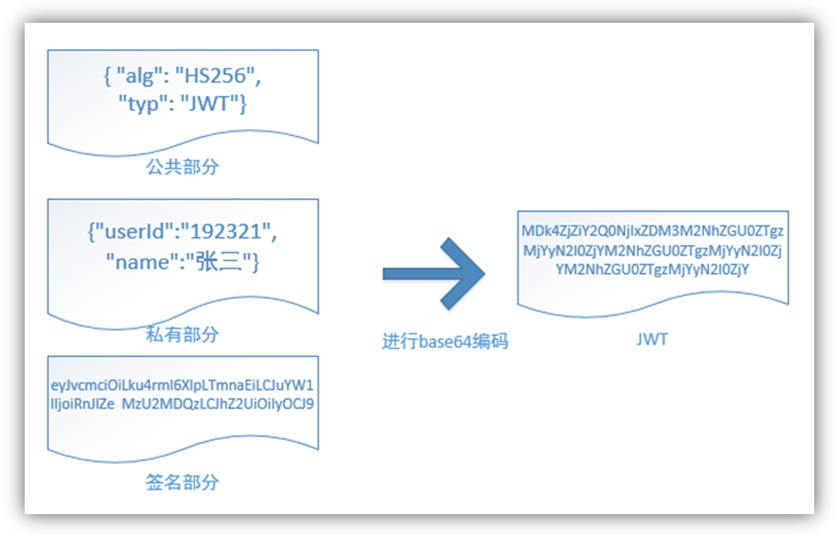

# 一、生成token

## 1、使用JWT进行跨域身份验证

### 1.1 传统用户身份验证


Internet服务无法与用户身份验证分开。一般过程如下：

1. 用户向服务器发送用户名和密码。
2. 验证服务器后，相关数据（如用户角色，登录时间等）将保存在当前会话中。
3. 服务器向用户返回session_id，session信息都会写入到用户的Cookie。
4. 用户的每个后续请求都将通过在Cookie中取出session_id传给服务器。
5. 服务器收到session_id并对比之前保存的数据，确认用户的身份。

这种模式最大的问题是，没有分布式架构，无法支持横向扩展。

### 1.2 解决方案

1. session广播
2. 将透明令牌存入cookie，将用户身份信息存入redis

**另外一种灵活的解决方案：**

使用自包含令牌，通过客户端保存数据，而服务器不保存会话数据。 JWT是这种解决方案的代表

## 2、JWT介绍

**JWT工具**

JWT（Json Web Token）是为了在网络应用环境间传递声明而执行的一种基于JSON的开放标准。

JWT的声明一般被用来在身份提供者和服务提供者间传递被认证的用户身份信息，以便于从资源服务器获取资源。比如用在用户登录上

JWT最重要的作用就是对 token信息的**防伪**作用。

**JWT的原理**

一个JWT由 **三个部分组成：公共部分、私有部分、签名部分** 。最后由这三者组合进行base64编码得到JWT。



1、公共部分

主要是该JWT的相关配置参数，比如签名的加密算法、格式类型、过期时间等等。

Key=ATGUIGU

2、私有部分

用户自定义的内容，根据实际需要真正要封装的信息。

userInfo{用户的Id，用户的昵称nickName}

3、签名部分

SaltiP: 当前服务器的Ip地址!{linux 中配置代理服务器的ip}

主要用户对JWT生成字符串的时候，进行加密{盐值}

最终组成 key+salt+userInfo è token!

base64编码，并不是加密，只是把明文信息变成了不可见的字符串。但是其实只要用一些工具就可以把base64编码解成明文，所以不要在JWT中放入涉及私密的信息。

## 3、整合JWT

### 3.1 在service_utils模块添加依赖

```xml
<dependencies>
    <dependency>
        <groupId>io.jsonwebtoken</groupId>
        <artifactId>jjwt</artifactId>
    </dependency>
</dependencies>
```

### 3.2 添加JWT工具类

```java
public class JwtHelper {
    private static long tokenExpiration = 24*60*60*1000;
    private static String tokenSignKey = "123456";

    public static String createToken(Long userId, String userName) {
        String token = Jwts.builder()
                .setSubject("YYGH-USER")
                .setExpiration(new Date(System.currentTimeMillis() + tokenExpiration))
                .claim("userId", userId)
                .claim("userName", userName)
                .signWith(SignatureAlgorithm.HS512, tokenSignKey)
                .compressWith(CompressionCodecs.GZIP)
                .compact();
        return token;
    }
    public static Long getUserId(String token) {
        if(StringUtils.isEmpty(token)) return null;
        Jws<Claims> claimsJws = Jwts.parser().setSigningKey(tokenSignKey).parseClaimsJws(token);
        Claims claims = claimsJws.getBody();
        Integer userId = (Integer)claims.get("userId");
        return userId.longValue();
    }
    public static String getUserName(String token) {
        if(StringUtils.isEmpty(token)) return "";
        Jws<Claims> claimsJws
                = Jwts.parser().setSigningKey(tokenSignKey).parseClaimsJws(token);
        Claims claims = claimsJws.getBody();
        return (String)claims.get("userName");
    }
  
    public static void main(String[] args) {
        String token = JwtHelper.createToken(1L, "55");
        System.out.println(token);
        System.out.println(JwtHelper.getUserId(token));
        System.out.println(JwtHelper.getUserName(token));
    }
}
```

### 3.3 完善UserInfoServiceImpl登录方法

```java
@Override
public Map<String, Object> login(LoginVo loginVo) {
   .........

    //jwt生成token字符串
    String token = JwtHelper.createToken(userInfo.getId(), name);
    map.put("token",token);

    return map;
}
```

**使用Swagger测试接口，测试多次，第一次注册，以后直接登录**
